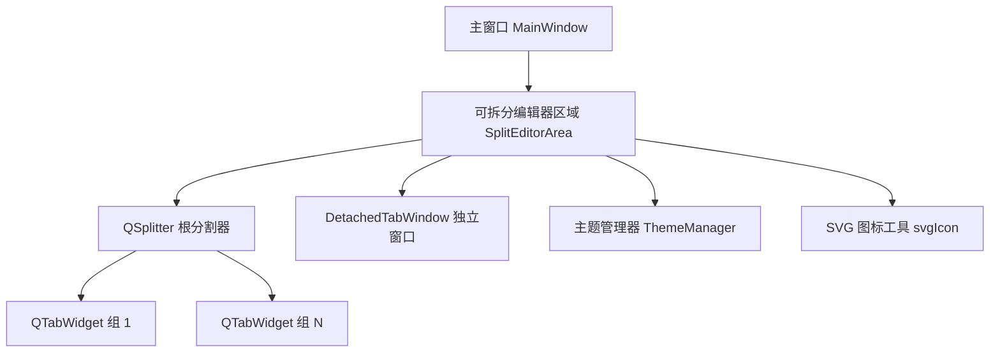
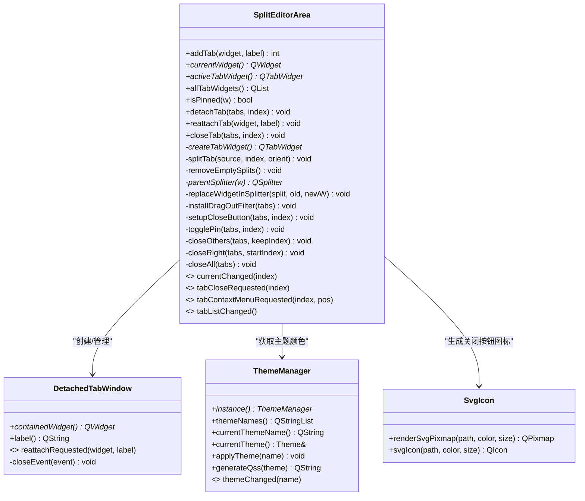
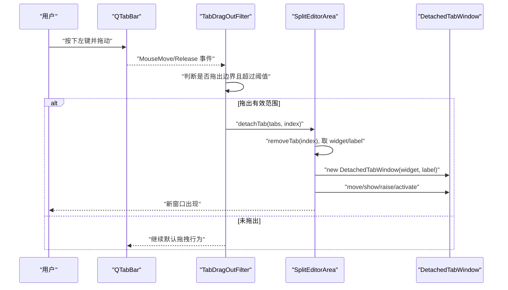
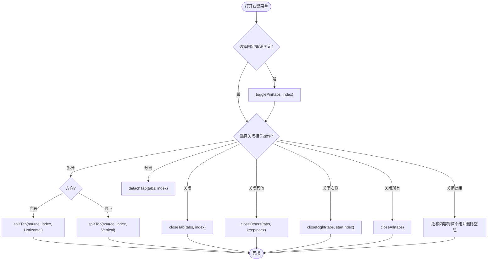
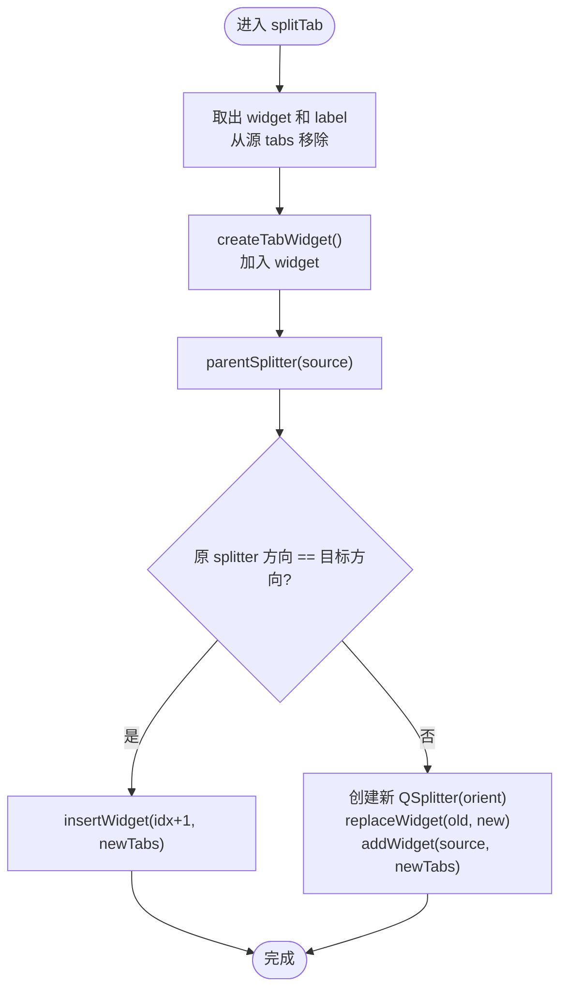
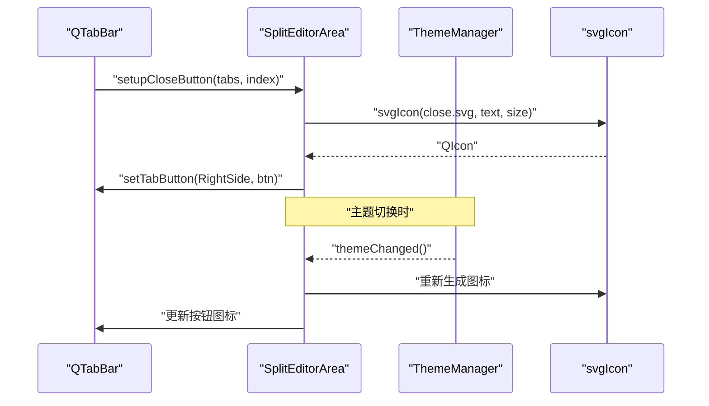
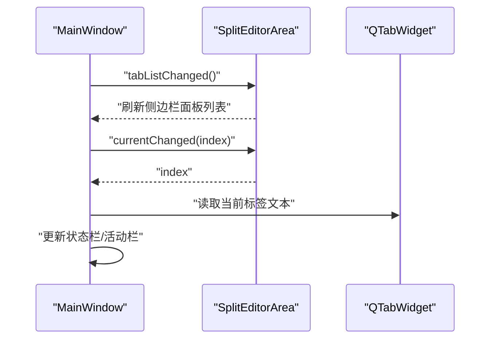
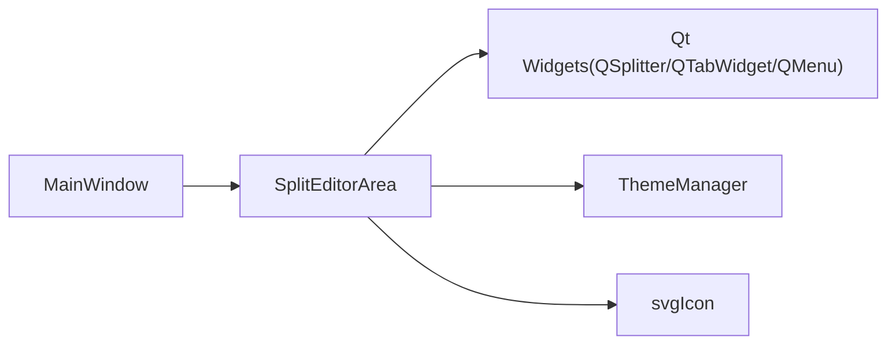

# 可拆分编辑器区域组件

<cite>
**本文引用的文件**
- [spliteditorarea.h](file://src/ui/spliteditorarea.h)
- [spliteditorarea.cpp](file://src/ui/spliteditorarea.cpp)
- [mainwindow.h](file://src/ui/mainwindow.h)
- [mainwindow.cpp](file://src/ui/mainwindow.cpp)
- [thememanager.h](file://src/ui/thememanager.h)
- [svg_icon.h](file://src/utils/svg_icon.h)
</cite>

## 目录
1. [简介](#简介)
2. [项目结构](#项目结构)
3. [核心组件](#核心组件)
4. [架构总览](#架构总览)
5. [详细组件分析](#详细组件分析)
6. [依赖关系分析](#依赖关系分析)
7. [性能考虑](#性能考虑)
8. [故障排查指南](#故障排查指南)
9. [结论](#结论)
10. [附录](#附录)

## 简介
本组件提供“VS Code 风格”的可拆分编辑器区域，支持：
- 多标签页分组与并排/上下拆分
- 标签页拖拽分离为独立窗口，关闭后自动回嵌
- 固定标签页、批量关闭（其他/右侧/全部）
- 主题驱动的 SVG 关闭按钮
- 与主窗口的信号联动（当前页变化、标签列表变更等）

该组件是应用内多个功能模块（如 Trace、Graphic、设备连接、回放、离线分析等）的承载容器，通过 SplitEditorArea 统一管理。

## 项目结构
- 组件位于 src/ui 下，包含头文件与实现文件
- 主窗口在创建布局时实例化并使用 SplitEditorArea
- 主题管理用于动态更新关闭按钮图标颜色
- SVG 工具用于渲染单色图标

**图表来源**
- [mainwindow.cpp:707-735](file://src/ui/mainwindow.cpp#L707-L735)
- [spliteditorarea.cpp:162-174](file://src/ui/spliteditorarea.cpp#L162-L174)
- [spliteditorarea.cpp:283-313](file://src/ui/spliteditorarea.cpp#L283-L313)
- [thememanager.h:82-106](file://src/ui/thememanager.h#L82-L106)
- [svg_icon.h:10-31](file://src/utils/svg_icon.h#L10-L31)

**章节来源**
- [mainwindow.cpp:707-735](file://src/ui/mainwindow.cpp#L707-L735)
- [spliteditorarea.cpp:162-174](file://src/ui/spliteditorarea.cpp#L162-L174)

## 核心组件
- DetachedTabWindow：承载被分离出的标签页内容，关闭窗口时触发重新回嵌请求
- TabBarHoverFilter：鼠标悬停显示/隐藏关闭按钮，固定标签页不显示关闭按钮
- TabDragOutFilter：检测标签页拖出 tab bar 区域，触发分离到新窗口
- SplitEditorArea：核心容器，维护 QSplitter + 多个 QTabWidget，提供添加、拆分、分离、关闭、固定等操作

**章节来源**
- [spliteditorarea.h:15-34](file://src/ui/spliteditorarea.h#L15-L34)
- [spliteditorarea.h:46-101](file://src/ui/spliteditorarea.h#L46-L101)
- [spliteditorarea.cpp:51-89](file://src/ui/spliteditorarea.cpp#L51-L89)
- [spliteditorarea.cpp:95-156](file://src/ui/spliteditorarea.cpp#L95-L156)

## 架构总览
SplitEditorArea 以 QSplitter 作为根容器，内部包含一个或多个 QTabWidget。每个 QTabWidget 是一个“标签页组”，用户可在组内进行标签页切换、移动、关闭；也可对某个标签页执行“向右拆分/向下拆分”，从而生成新的 QTabWidget 并通过 QSplitter 插入到合适位置。

**图表来源**
- [spliteditorarea.h:46-101](file://src/ui/spliteditorarea.h#L46-L101)
- [spliteditorarea.h:15-34](file://src/ui/spliteditorarea.h#L15-L34)
- [thememanager.h:82-106](file://src/ui/thememanager.h#L82-L106)
- [svg_icon.h:10-31](file://src/utils/svg_icon.h#L10-L31)

## 详细组件分析

### 分离标签页流程（拖拽分离）
当用户在标签栏上按住左键拖动并移出一定阈值时，系统会拦截默认拖拽行为，触发分离逻辑，将当前标签页放入独立的 DetachedTabWindow。

**图表来源**
- [spliteditorarea.cpp:95-156](file://src/ui/spliteditorarea.cpp#L95-L156)
- [spliteditorarea.cpp:283-313](file://src/ui/spliteditorarea.cpp#L283-L313)

**章节来源**
- [spliteditorarea.cpp:95-156](file://src/ui/spliteditorarea.cpp#L95-L156)
- [spliteditorarea.cpp:283-313](file://src/ui/spliteditorarea.cpp#L283-L313)

### 标签页右键菜单操作
右键点击标签栏弹出上下文菜单，支持：
- 固定/取消固定标签页
- 关闭、关闭其他、关闭右侧、关闭所有
- 向右拆分、向下拆分
- 分离到新窗口
- 关闭此拆分组（将内容迁移回首个 TabWidget 并删除空组）

**图表来源**
- [spliteditorarea.cpp:335-409](file://src/ui/spliteditorarea.cpp#L335-L409)
- [spliteditorarea.cpp:420-494](file://src/ui/spliteditorarea.cpp#L420-L494)
- [spliteditorarea.cpp:496-528](file://src/ui/spliteditorarea.cpp#L496-L528)

**章节来源**
- [spliteditorarea.cpp:335-409](file://src/ui/spliteditorarea.cpp#L335-L409)
- [spliteditorarea.cpp:420-494](file://src/ui/spliteditorarea.cpp#L420-L494)
- [spliteditorarea.cpp:496-528](file://src/ui/spliteditorarea.cpp#L496-L528)

### 拆分算法（splitTab）
根据目标方向决定是直接插入同级 splitter，还是创建嵌套 splitter 以保持方向一致性。

**图表来源**
- [spliteditorarea.cpp:496-528](file://src/ui/spliteditorarea.cpp#L496-L528)

**章节来源**
- [spliteditorarea.cpp:496-528](file://src/ui/spliteditorarea.cpp#L496-L528)

### 关闭按钮与主题联动
- 每个标签页右侧放置一个 QToolButton 作为关闭按钮
- 使用 svgIcon 读取 SVG 资源并以主题文本颜色渲染
- 监听主题切换信号，刷新关闭按钮图标颜色
- 固定标签页隐藏关闭按钮

**图表来源**
- [spliteditorarea.cpp:229-254](file://src/ui/spliteditorarea.cpp#L229-L254)
- [thememanager.h:82-106](file://src/ui/thememanager.h#L82-L106)
- [svg_icon.h:10-31](file://src/utils/svg_icon.h#L10-L31)

**章节来源**
- [spliteditorarea.cpp:229-254](file://src/ui/spliteditorarea.cpp#L229-L254)
- [thememanager.h:82-106](file://src/ui/thememanager.h#L82-L106)
- [svg_icon.h:10-31](file://src/utils/svg_icon.h#L10-L31)

### 与主窗口的集成
- 主窗口在 createLayout 中创建 SplitEditorArea 并嵌入布局
- 主窗口订阅 SplitEditorArea 的信号：
  - currentChanged：更新状态栏标签名、同步侧边栏活动项
  - tabListChanged：刷新侧边栏面板列表
- 侧边栏操作（如删除 Trace/Graphic）通过 allTabWidgets 查找并调用 closeTab 进行清理

**图表来源**
- [mainwindow.cpp:385-400](file://src/ui/mainwindow.cpp#L385-L400)
- [mainwindow.cpp:707-735](file://src/ui/mainwindow.cpp#L707-L735)

**章节来源**
- [mainwindow.cpp:385-400](file://src/ui/mainwindow.cpp#L385-L400)
- [mainwindow.cpp:707-735](file://src/ui/mainwindow.cpp#L707-L735)

## 依赖关系分析
- SplitEditorArea 依赖 Qt 的 QSplitter、QTabWidget、QMenu、QAction、QTabBar 等构建交互
- 依赖 ThemeManager 获取主题颜色，确保关闭按钮图标与主题一致
- 依赖 svgIcon 工具函数渲染 SVG 图标
- 主窗口通过信号与 SplitEditorArea 解耦协作

**图表来源**
- [spliteditorarea.cpp:1-15](file://src/ui/spliteditorarea.cpp#L1-L15)
- [thememanager.h:82-106](file://src/ui/thememanager.h#L82-L106)
- [svg_icon.h:10-31](file://src/utils/svg_icon.h#L10-L31)
- [mainwindow.cpp:707-735](file://src/ui/mainwindow.cpp#L707-L735)

**章节来源**
- [spliteditorarea.cpp:1-15](file://src/ui/spliteditorarea.cpp#L1-L15)
- [thememanager.h:82-106](file://src/ui/thememanager.h#L82-L106)
- [svg_icon.h:10-31](file://src/utils/svg_icon.h#L10-L31)
- [mainwindow.cpp:707-735](file://src/ui/mainwindow.cpp#L707-L735)

## 性能考虑
- 拆分与合并采用 QSplitter 的 insert/replace 操作，复杂度低，适合频繁调整布局
- 空分组自动清理避免冗余节点，减少绘制开销
- 关闭按钮仅在需要时显示，降低不必要的控件创建与事件处理
- 主题切换时仅刷新关闭按钮图标，避免全量重绘

[本节为通用指导，无需具体文件引用]

## 故障排查指南
- 标签页无法关闭：检查是否为固定标签页（属性 pinned），固定标签页不可关闭
- 分离后无法回嵌：确认 DetachedTabWindow 已正确发出 reattachRequested 信号并被接收
- 拆分方向异常：检查 splitTab 中的方向判断与嵌套 splitter 创建逻辑
- 关闭按钮颜色不正确：确认 ThemeManager 已发出 themeChanged 信号，且 setupCloseButton 已连接主题切换回调
- 侧边栏不同步：确认 SplitEditorArea 的 tabListChanged/currentChanged 信号已连接到主窗口对应槽

**章节来源**
- [spliteditorarea.cpp:420-494](file://src/ui/spliteditorarea.cpp#L420-L494)
- [spliteditorarea.cpp:229-254](file://src/ui/spliteditorarea.cpp#L229-L254)
- [spliteditorarea.cpp:496-528](file://src/ui/spliteditorarea.cpp#L496-L528)
- [mainwindow.cpp:385-400](file://src/ui/mainwindow.cpp#L385-L400)

## 结论
SplitEditorArea 提供了稳定、可扩展的多标签页编辑区域，具备 VS Code 风格的拆分、分离、固定与批量关闭能力，并与主窗口通过信号机制松耦合协作。结合主题管理与 SVG 图标，保证了良好的用户体验与视觉一致性。

[本节为总结性内容，无需具体文件引用]

## 附录
- 关键 API 路径参考：
  - 添加标签页：[addTab:217-227](file://src/ui/spliteditorarea.cpp#L217-L227)
  - 分离标签页：[detachTab:283-313](file://src/ui/spliteditorarea.cpp#L283-L313)
  - 回嵌标签页：[reattachTab:316-333](file://src/ui/spliteditorarea.cpp#L316-L333)
  - 关闭标签页：[closeTab:445-454](file://src/ui/spliteditorarea.cpp#L445-L454)
  - 固定/取消固定：[togglePin:420-443](file://src/ui/spliteditorarea.cpp#L420-L443)
  - 批量关闭：[closeOthers/closeRight/closeAll:456-494](file://src/ui/spliteditorarea.cpp#L456-L494)
  - 拆分逻辑：[splitTab:496-528](file://src/ui/spliteditorarea.cpp#L496-L528)
  - 空分组清理：[removeEmptySplits:530-548](file://src/ui/spliteditorarea.cpp#L530-L548)
  - 关闭按钮设置：[setupCloseButton:229-254](file://src/ui/spliteditorarea.cpp#L229-L254)
  - 拖拽分离过滤：[TabDragOutFilter:95-156](file://src/ui/spliteditorarea.cpp#L95-L156)
  - 悬停过滤：[TabBarHoverFilter:51-89](file://src/ui/spliteditorarea.cpp#L51-L89)
  - 主窗口集成：[createLayout:707-735](file://src/ui/mainwindow.cpp#L707-L735)、[信号连接:385-400](file://src/ui/mainwindow.cpp#L385-L400)