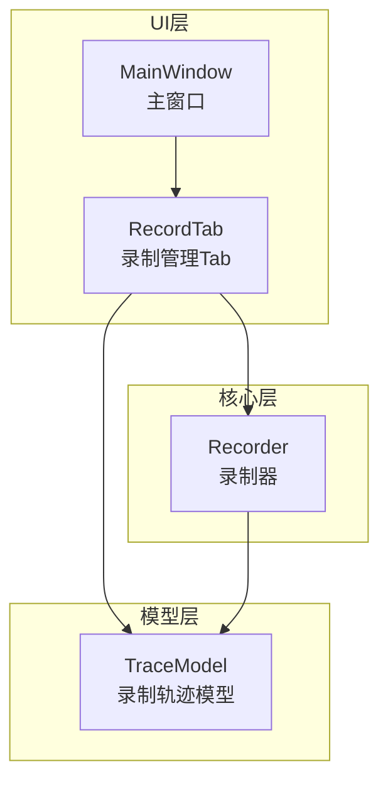
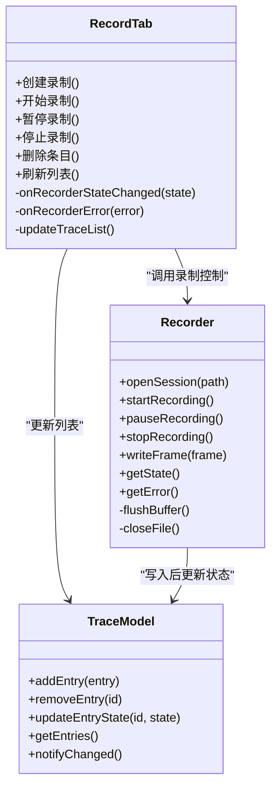
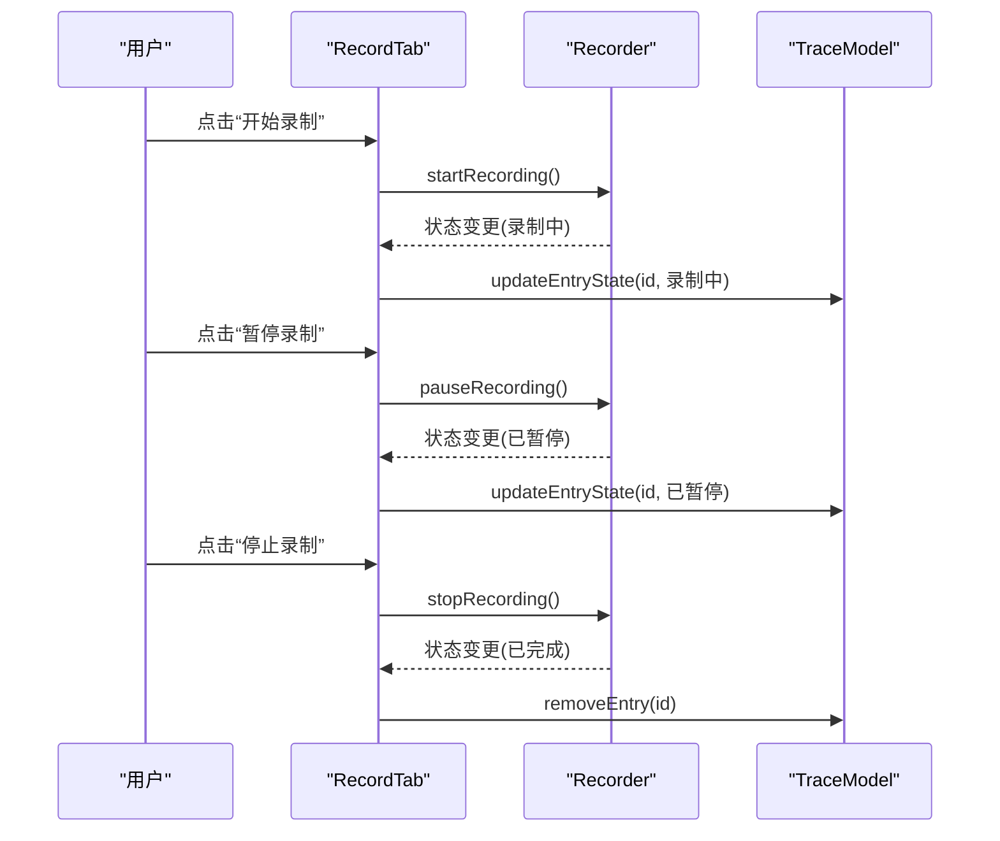
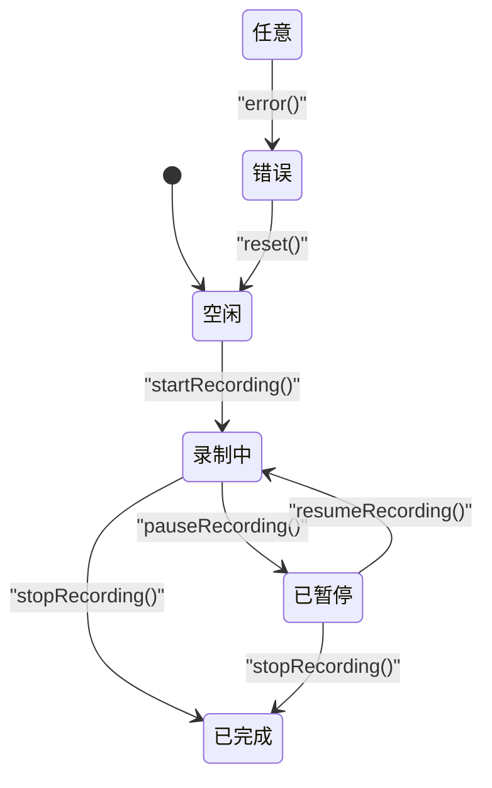
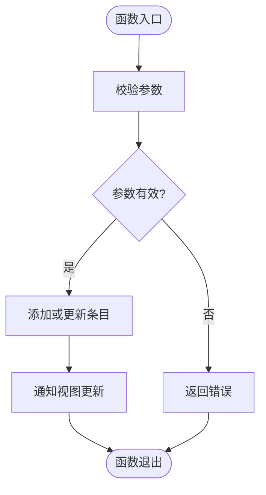
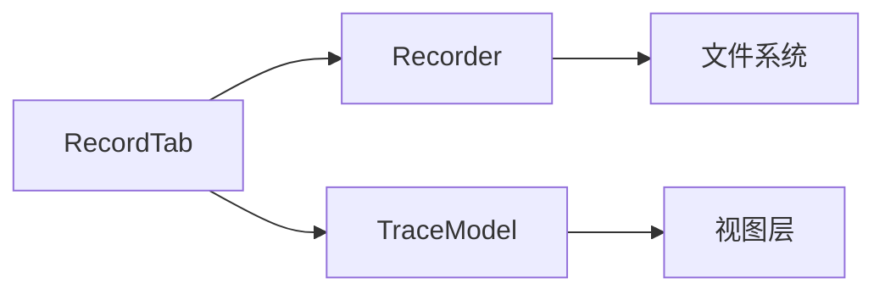

# 录制管理Tab组件

<cite>
**本文引用的文件**
- [recordtab.h](file://src/ui/recordtab.h)
- [recordtab.cpp](file://src/ui/recordtab.cpp)
- [recorder.h](file://src/core/recorder.h)
- [recorder.cpp](file://src/core/recorder.cpp)
- [cantracemodel.h](file://src/models/cantracemodel.h)
- [cantracemodel.cpp](file://src/models/cantracemodel.cpp)
- [mainwindow.h](file://src/ui/mainwindow.h)
- [mainwindow.cpp](file://src/ui/mainwindow.cpp)
</cite>

## 目录
1. [简介](#简介)
2. [项目结构](#项目结构)
3. [核心组件](#核心组件)
4. [架构总览](#架构总览)
5. [详细组件分析](#详细组件分析)
6. [依赖关系分析](#依赖关系分析)
7. [性能考量](#性能考量)
8. [故障排查指南](#故障排查指南)
9. [结论](#结论)
10. [附录](#附录)

## 简介
本文件围绕“录制管理Tab组件”进行系统化文档化，聚焦于CAN总线录制功能的UI与核心逻辑。该组件负责：
- 提供录制会话的创建、启动、暂停、停止等交互入口
- 管理与录制相关的状态机（空闲、录制中、暂停、错误）
- 与底层录制器（Recorder）协作，完成数据写入与生命周期管理
- 通过模型层（TraceModel）驱动界面展示录制列表与状态

## 项目结构
录制管理Tab组件位于UI层，与核心录制模块和模型层紧密耦合。整体结构如下：
- UI层：RecordTab（录制管理Tab）、MainWindow（主窗口容器）
- 核心层：Recorder（录制器，封装IO与状态）
- 模型层：TraceModel（录制轨迹数据模型）

图表来源
- [recordtab.h](file://src/ui/recordtab.h)
- [recordtab.cpp](file://src/ui/recordtab.cpp)
- [recorder.h](file://src/core/recorder.h)
- [recorder.cpp](file://src/core/recorder.cpp)
- [cantracemodel.h](file://src/models/cantracemodel.h)
- [cantracemodel.cpp](file://src/models/cantracemodel.cpp)
- [mainwindow.h](file://src/ui/mainwindow.h)
- [mainwindow.cpp](file://src/ui/mainwindow.cpp)

章节来源
- [recordtab.h](file://src/ui/recordtab.h)
- [recordtab.cpp](file://src/ui/recordtab.cpp)
- [recorder.h](file://src/core/recorder.h)
- [recorder.cpp](file://src/core/recorder.cpp)
- [cantracemodel.h](file://src/models/cantracemodel.h)
- [cantracemodel.cpp](file://src/models/cantracemodel.cpp)
- [mainwindow.h](file://src/ui/mainwindow.h)
- [mainwindow.cpp](file://src/ui/mainwindow.cpp)

## 核心组件
- RecordTab（录制管理Tab）
  - 职责：用户交互、录制流程控制、状态显示、与Recorder和TraceModel通信
  - 关键能力：新建录制、开始/暂停/停止、删除条目、刷新列表、错误提示
- Recorder（录制器）
  - 职责：管理录制会话、文件写入、时间戳与帧缓冲、错误处理
  - 关键能力：打开/关闭文件、写入帧、状态切换、异常恢复
- TraceModel（录制轨迹模型）
  - 职责：维护录制条目集合、提供视图绑定接口、更新与排序
  - 关键能力：添加/移除条目、状态同步、信号通知

章节来源
- [recordtab.h](file://src/ui/recordtab.h)
- [recordtab.cpp](file://src/ui/recordtab.cpp)
- [recorder.h](file://src/core/recorder.h)
- [recorder.cpp](file://src/core/recorder.cpp)
- [cantracemodel.h](file://src/models/cantracemodel.h)
- [cantracemodel.cpp](file://src/models/cantracemodel.cpp)

## 架构总览
录制管理Tab采用典型的MVC分层：UI（RecordTab）通过信号槽与核心（Recorder）和模型（TraceModel）解耦，保证可测试性与扩展性。

图表来源
- [recordtab.h](file://src/ui/recordtab.h)
- [recordtab.cpp](file://src/ui/recordtab.cpp)
- [recorder.h](file://src/core/recorder.h)
- [recorder.cpp](file://src/core/recorder.cpp)
- [cantracemodel.h](file://src/models/cantracemodel.h)
- [cantracemodel.cpp](file://src/models/cantracemodel.cpp)

## 详细组件分析

### RecordTab（录制管理Tab）
- 功能要点
  - 提供“新建录制”、“开始/暂停/停止”按钮或菜单项
  - 监听Recorder的状态变化与错误信号，更新UI状态
  - 与TraceModel交互，维护录制条目列表
- 交互流程
  - 用户点击“开始录制”触发RecordTab调用Recorder.startRecording()
  - Recorder进入录制状态并回调RecordTab更新界面
  - 用户点击“停止录制”，RecordTab调用Recorder.stopRecording()，完成后从TraceModel移除或归档条目

图表来源
- [recordtab.cpp](file://src/ui/recordtab.cpp)
- [recorder.cpp](file://src/core/recorder.cpp)
- [cantracemodel.cpp](file://src/models/cantracemodel.cpp)

章节来源
- [recordtab.h](file://src/ui/recordtab.h)
- [recordtab.cpp](file://src/ui/recordtab.cpp)

### Recorder（录制器）
- 功能要点
  - 管理录制会话的生命周期（打开文件、写入、关闭）
  - 维护内部状态机（空闲、录制中、暂停、错误）
  - 处理缓冲区写入与异常恢复
- 状态机
  - 空闲 → 录制中：startRecording()
  - 录制中 → 已暂停：pauseRecording()
  - 已暂停 → 录制中：resumeRecording()
  - 任意状态 → 已完成：stopRecording()
  - 任意状态 → 错误：error()

图表来源
- [recorder.h](file://src/core/recorder.h)
- [recorder.cpp](file://src/core/recorder.cpp)

章节来源
- [recorder.h](file://src/core/recorder.h)
- [recorder.cpp](file://src/core/recorder.cpp)

### TraceModel（录制轨迹模型）
- 功能要点
  - 维护录制条目集合（ID、路径、状态、时间戳等）
  - 提供增删改查接口，并通过信号通知视图更新
  - 支持排序与过滤（如按时间、状态）
- 数据流
  - RecordTab调用addEntry/removeEntry/updateEntryState
  - Recorder在写入完成后触发状态更新
  - 视图层（如表格）响应notifyChanged刷新显示

图表来源
- [cantracemodel.h](file://src/models/cantracemodel.h)
- [cantracemodel.cpp](file://src/models/cantracemodel.cpp)

章节来源
- [cantracemodel.h](file://src/models/cantracemodel.h)
- [cantracemodel.cpp](file://src/models/cantracemodel.cpp)

### MainWindow（主窗口集成）
- 功能要点
  - 作为RecordTab的容器，管理标签页布局
  - 初始化RecordTab实例并注入依赖（Recorder、TraceModel）
  - 处理全局快捷键或菜单命令，转发到RecordTab

章节来源
- [mainwindow.h](file://src/ui/mainwindow.h)
- [mainwindow.cpp](file://src/ui/mainwindow.cpp)

## 依赖关系分析
- RecordTab依赖Recorder与TraceModel，实现UI与业务逻辑解耦
- Recorder依赖文件系统与可能的缓存机制，确保数据持久化
- TraceModel独立于UI，提供数据访问与状态同步

图表来源
- [recordtab.h](file://src/ui/recordtab.h)
- [recorder.h](file://src/core/recorder.h)
- [cantracemodel.h](file://src/models/cantracemodel.h)

章节来源
- [recordtab.h](file://src/ui/recordtab.h)
- [recorder.h](file://src/core/recorder.h)
- [cantracemodel.h](file://src/models/cantracemodel.h)

## 性能考量
- 批量写入：Recorder应合并小帧写入，减少I/O开销
- 异步处理：避免阻塞UI线程，使用后台任务处理录制与文件操作
- 内存管理：合理设置缓冲区大小，防止内存泄漏或溢出
- 状态同步：使用事件驱动更新，避免轮询导致的资源浪费

[本节为通用指导，无需引用具体文件]

## 故障排查指南
- 常见问题
  - 录制无法开始：检查Recorder状态是否为空闲，确认文件路径权限
  - 录制中断：查看Recorder错误信号，检查磁盘空间与I/O异常
  - 列表不更新：确认TraceModel是否发出更新信号，检查UI绑定
- 调试建议
  - 启用详细日志，记录状态转换与错误码
  - 使用单元测试验证Recorder状态机与TraceModel数据一致性
  - 模拟高负载场景，测试缓冲区与I/O性能

章节来源
- [recorder.cpp](file://src/core/recorder.cpp)
- [cantracemodel.cpp](file://src/models/cantracemodel.cpp)
- [recordtab.cpp](file://src/ui/recordtab.cpp)

## 结论
录制管理Tab组件通过清晰的MVC分层与状态机设计，实现了稳定的录制功能。RecordTab负责交互，Recorder管理核心逻辑，TraceModel提供数据支撑。未来可扩展更多功能（如自动命名、压缩存储、实时预览），同时保持现有架构的简洁与可维护性。

[本节为总结，无需引用具体文件]

## 附录
- 术语表
  - 录制会话：一次完整的录制过程，包含开始、暂停、停止等状态
  - 轨迹条目：单个录制的元数据与状态信息
  - 状态机：用于管理对象状态的抽象模型
- 相关接口
  - RecordTab::startRecording()
  - Recorder::pauseRecording()
  - TraceModel::updateEntryState()

[本节为补充信息，无需引用具体文件]