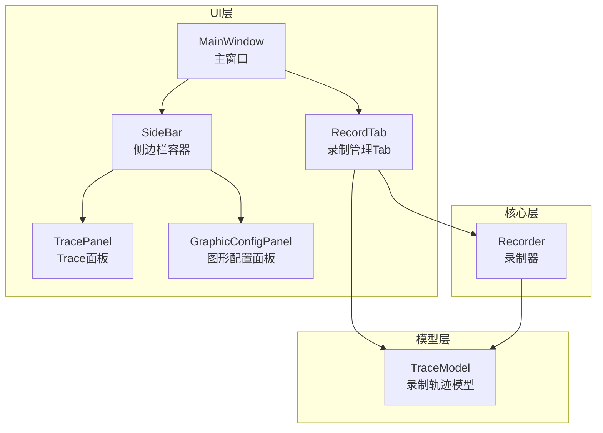
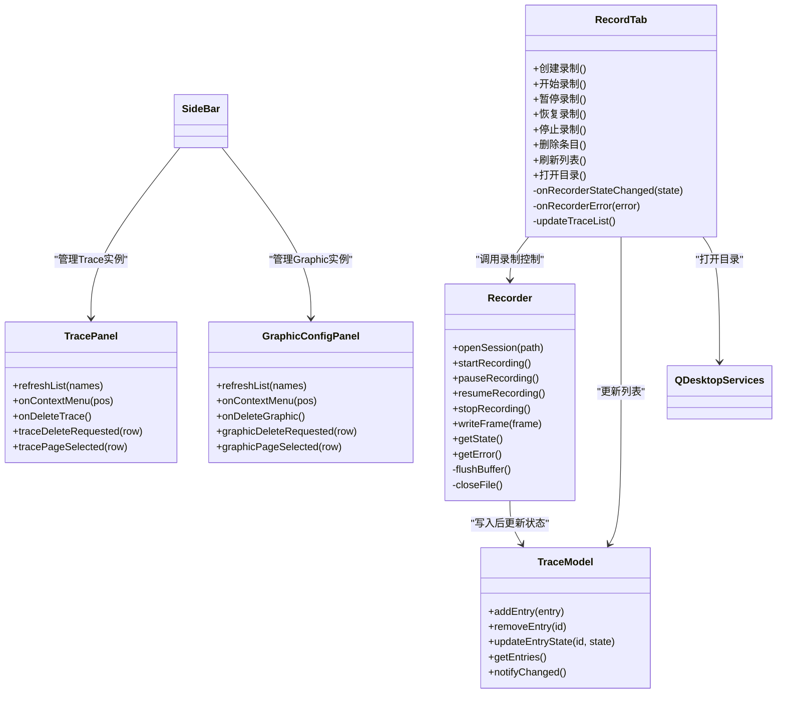
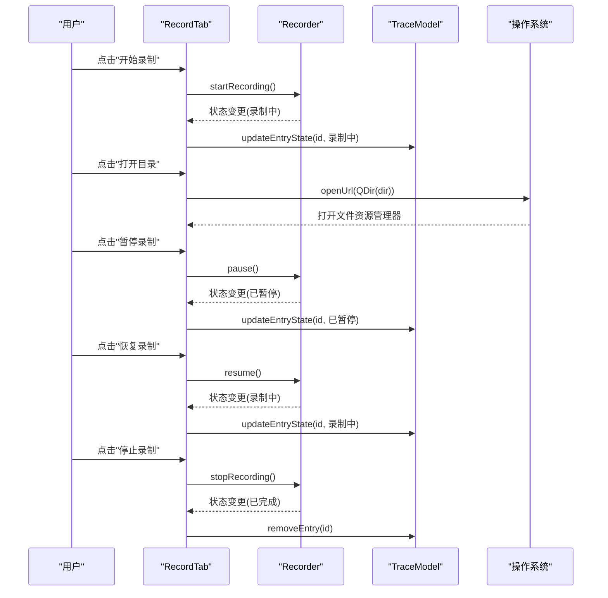
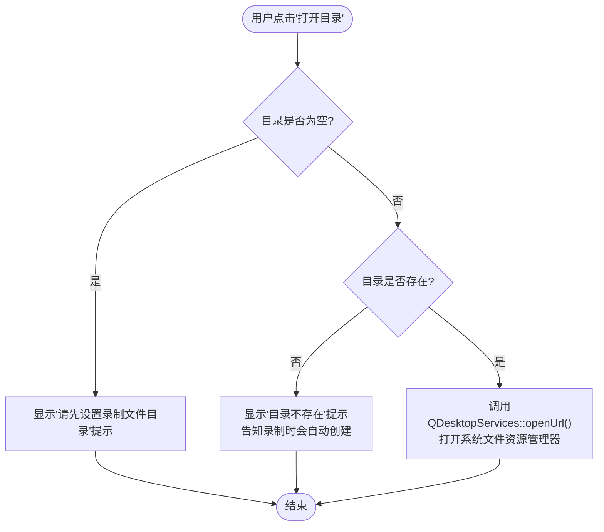
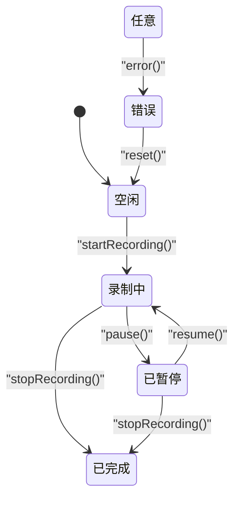
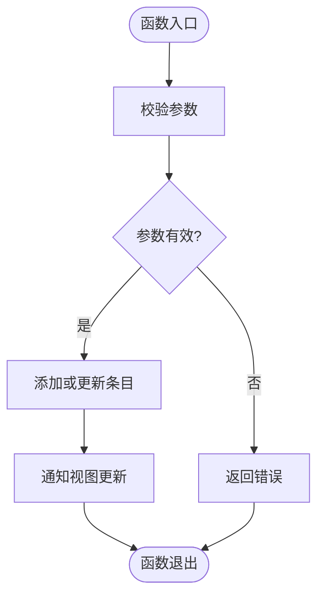
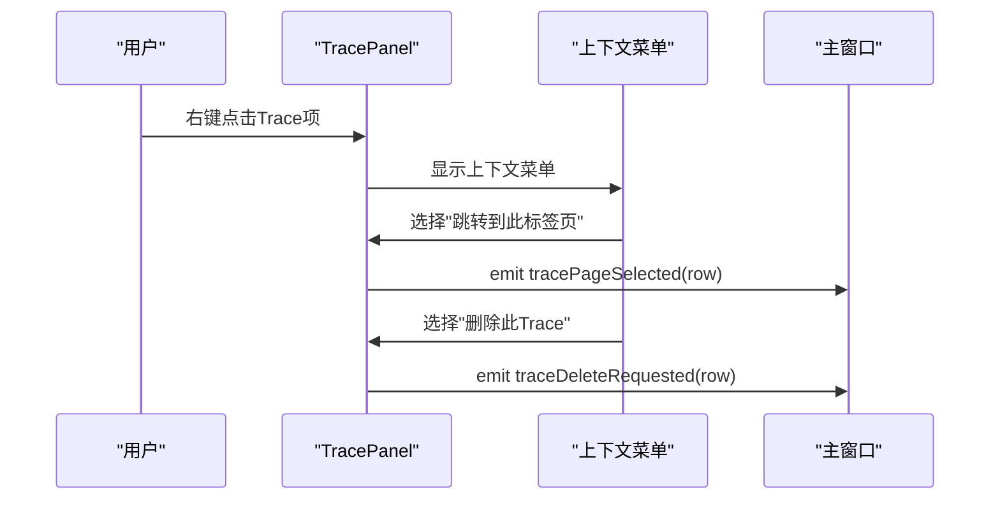
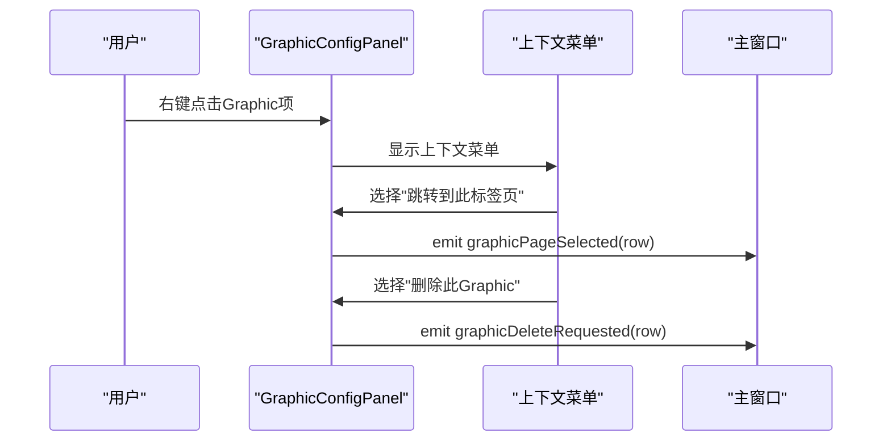
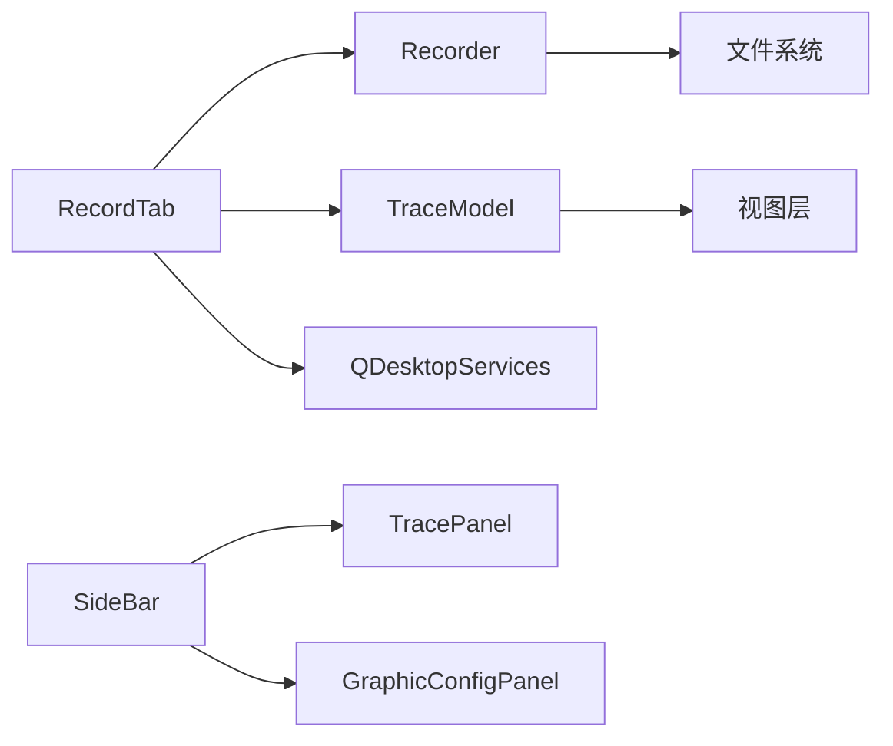

# 录制管理Tab组件

<cite>
**本文引用的文件**
- [recordtab.h](file://src/ui/recordtab.h)
- [recordtab.cpp](file://src/ui/recordtab.cpp)
- [sidebarpanels.h](file://src/ui/panels/sidebarpanels.h)
- [sidebarpanels.cpp](file://src/ui/panels/sidebarpanels.cpp)
- [recorder.h](file://src/core/recorder.h)
- [recorder.cpp](file://src/core/recorder.cpp)
- [cantracemodel.h](file://src/models/cantracemodel.h)
- [cantracemodel.cpp](file://src/models/cantracemodel.cpp)
- [mainwindow.h](file://src/ui/mainwindow.h)
- [mainwindow.cpp](file://src/ui/mainwindow.cpp)
</cite>

## 更新摘要
**所做更改**
- 新增暂停/恢复功能：RecordTab添加了暂停和停止按钮，Recorder支持暂停状态管理
- **新增**：打开目录功能：RecordTab添加了"打开目录"按钮，允许用户直接在系统文件资源管理器中打开录制目录
- 增强侧边栏面板删除功能：TracePanel和GraphicConfigPanel支持实例删除和上下文菜单操作
- 简化录制界面：移除了复杂的环模式和按时间分割配置选项
- 改进文件管理和触发录制的验证逻辑

## 目录
1. [简介](#简介)
2. [项目结构](#项目结构)
3. [核心组件](#核心组件)
4. [架构总览](#架构总览)
5. [详细组件分析](#详细组件分析)
6. [依赖关系分析](#依赖关系分析)
7. [性能考量](#性能考量)
8. [故障排查指南](#故障排查指南)
9. [结论](#结论)
10. [附录](#附录)

## 简介
本文件围绕"录制管理Tab组件"进行系统化文档化，聚焦于CAN总线录制功能的UI与核心逻辑。该组件负责：
- 提供录制会话的创建、启动、暂停、恢复、停止等交互入口
- 管理与录制相关的状态机（空闲、录制中、暂停、错误）
- 与底层录制器（Recorder）协作，完成数据写入与生命周期管理
- 通过模型层（TraceModel）驱动界面展示录制列表与状态
- **新增**：通过"打开目录"按钮直接访问录制文件目录，提升用户体验
- **新增**：通过侧边栏面板提供增强的录制实例管理和删除功能

## 项目结构
录制管理Tab组件位于UI层，与核心录制模块和模型层紧密耦合。整体结构如下：
- UI层：RecordTab（录制管理Tab）、SideBar（侧边栏容器）、TracePanel（Trace面板）、GraphicConfigPanel（图形配置面板）
- 核心层：Recorder（录制器，封装IO与状态）
- 模型层：TraceModel（录制轨迹数据模型）

**图表来源**
- [recordtab.h](file://src/ui/recordtab.h)
- [recordtab.cpp](file://src/ui/recordtab.cpp)
- [sidebarpanels.h](file://src/ui/panels/sidebarpanels.h)
- [sidebarpanels.cpp](file://src/ui/panels/sidebarpanels.cpp)
- [recorder.h](file://src/core/recorder.h)
- [recorder.cpp](file://src/core/recorder.cpp)
- [cantracemodel.h](file://src/models/cantracemodel.h)
- [cantracemodel.cpp](file://src/models/cantracemodel.cpp)
- [mainwindow.h](file://src/ui/mainwindow.h)
- [mainwindow.cpp](file://src/ui/mainwindow.cpp)

**章节来源**
- [recordtab.h](file://src/ui/recordtab.h)
- [recordtab.cpp](file://src/ui/recordtab.cpp)
- [sidebarpanels.h](file://src/ui/panels/sidebarpanels.h)
- [sidebarpanels.cpp](file://src/ui/panels/sidebarpanels.cpp)
- [recorder.h](file://src/core/recorder.h)
- [recorder.cpp](file://src/core/recorder.cpp)
- [cantracemodel.h](file://src/models/cantracemodel.h)
- [cantracemodel.cpp](file://src/models/cantracemodel.cpp)
- [mainwindow.h](file://src/ui/mainwindow.h)
- [mainwindow.cpp](file://src/ui/mainwindow.cpp)

## 核心组件
- RecordTab（录制管理Tab）
  - 职责：用户交互、录制流程控制、状态显示、与Recorder和TraceModel通信
  - 关键能力：新建录制、开始/暂停/恢复/停止、删除条目、刷新列表、错误提示、**打开目录**
- Recorder（录制器）
  - 职责：管理录制会话、文件写入、时间戳与帧缓冲、错误处理
  - 关键能力：打开/关闭文件、写入帧、状态切换、异常恢复、暂停/恢复控制
- TraceModel（录制轨迹模型）
  - 职责：维护录制条目集合、提供视图绑定接口、更新与排序
  - 关键能力：添加/移除条目、状态同步、信号通知
- **新增**：TracePanel（Trace面板）
  - 职责：管理Trace实例列表、提供删除和导航功能
  - 关键能力：新建Trace、删除指定Trace、跳转到特定Trace、上下文菜单操作
- **新增**：GraphicConfigPanel（图形配置面板）
  - 职责：管理Graphic页面列表、提供删除和导航功能
  - 关键能力：新建Graphic、删除指定Graphic、跳转到特定页面、上下文菜单操作

**章节来源**
- [recordtab.h](file://src/ui/recordtab.h)
- [recordtab.cpp](file://src/ui/recordtab.cpp)
- [sidebarpanels.h](file://src/ui/panels/sidebarpanels.h)
- [sidebarpanels.cpp](file://src/ui/panels/sidebarpanels.cpp)
- [recorder.h](file://src/core/recorder.h)
- [recorder.cpp](file://src/core/recorder.cpp)
- [cantracemodel.h](file://src/models/cantracemodel.h)
- [cantracemodel.cpp](file://src/models/cantracemodel.cpp)

## 架构总览
录制管理Tab采用典型的MVC分层：UI（RecordTab）通过信号槽与核心（Recorder）和模型（TraceModel）解耦，保证可测试性与扩展性。侧边栏面板提供了增强的实例管理能力。

**图表来源**
- [recordtab.h](file://src/ui/recordtab.h)
- [recordtab.cpp](file://src/ui/recordtab.cpp)
- [sidebarpanels.h](file://src/ui/panels/sidebarpanels.h)
- [sidebarpanels.cpp](file://src/ui/panels/sidebarpanels.cpp)
- [recorder.h](file://src/core/recorder.h)
- [recorder.cpp](file://src/core/recorder.cpp)
- [cantracemodel.h](file://src/models/cantracemodel.h)
- [cantracemodel.cpp](file://src/models/cantracemodel.cpp)

## 详细组件分析

### RecordTab（录制管理Tab）
- 功能要点
  - 提供"新建录制"、"开始/暂停/恢复/停止"按钮或菜单项
  - **新增**：提供"打开目录"按钮，用于在系统文件资源管理器中打开录制目录
  - 监听Recorder的状态变化与错误信号，更新UI状态
  - 与TraceModel交互，维护录制条目列表
- 交互流程
  - 用户点击"开始录制"触发RecordTab调用Recorder.startRecording()
  - Recorder进入录制状态并回调RecordTab更新界面
  - 用户点击"暂停录制"，RecordTab调用Recorder.pause()，暂停数据写入
  - 用户点击"恢复录制"，RecordTab调用Recorder.resume()，继续数据写入
  - 用户点击"停止录制"，RecordTab调用Recorder.stop()，完成后从TraceModel移除或归档条目
  - **新增**：用户点击"打开目录"，RecordTab调用QDesktopServices::openUrl()打开系统文件资源管理器

**图表来源**
- [recordtab.cpp:205-219](file://src/ui/recordtab.cpp#L205-L219)
- [recorder.cpp](file://src/core/recorder.cpp)
- [cantracemodel.cpp](file://src/models/cantracemodel.cpp)

**章节来源**
- [recordtab.h](file://src/ui/recordtab.h)
- [recordtab.cpp](file://src/ui/recordtab.cpp)

### 打开目录功能详解
- 功能实现
  - 按钮创建：在文件设置组中添加"打开目录"按钮，带有工具提示说明
  - 事件处理：连接到`onOpenDir()`槽函数处理点击事件
  - 路径验证：检查目录是否为空以及是否存在
  - 系统集成：使用Qt的QDesktopServices::openUrl()打开系统文件资源管理器
- 错误处理
  - 空目录提示：当目录为空时显示提示信息
  - 目录不存在提示：当目录不存在时显示友好提示，告知用户录制时会自动创建
  - 成功打开：无错误时直接打开系统文件资源管理器
- 用户体验
  - 工具提示：鼠标悬停时显示"在系统资源管理器中打开录制文件目录"
  - 直观操作：一键打开录制文件所在目录，便于查看和管理录制文件

**图表来源**
- [recordtab.cpp:205-219](file://src/ui/recordtab.cpp#L205-L219)

**章节来源**
- [recordtab.cpp:56-58](file://src/ui/recordtab.cpp#L56-L58)
- [recordtab.cpp:191](file://src/ui/recordtab.cpp#L191)
- [recordtab.cpp:205-219](file://src/ui/recordtab.cpp#L205-L219)

### Recorder（录制器）
- 功能要点
  - 管理录制会话的生命周期（打开文件、写入、关闭）
  - 维护内部状态机（空闲、录制中、暂停、错误）
  - 处理缓冲区写入与异常恢复
  - **新增**：支持暂停/恢复功能，允许临时停止数据写入而不中断录制会话
- 状态机
  - 空闲 → 录制中：startRecording()
  - 录制中 → 已暂停：pause()
  - 已暂停 → 录制中：resume()
  - 任意状态 → 已完成：stopRecording()
  - 任意状态 → 错误：error()

**图表来源**
- [recorder.h](file://src/core/recorder.h)
- [recorder.cpp](file://src/core/recorder.cpp)

**章节来源**
- [recorder.h](file://src/core/recorder.h)
- [recorder.cpp](file://src/core/recorder.cpp)

### TraceModel（录制轨迹模型）
- 功能要点
  - 维护录制条目集合（ID、路径、状态、时间戳等）
  - 提供增删改查接口，并通过信号通知视图更新
  - 支持排序与过滤（如按时间、状态）
- 数据流
  - RecordTab调用addEntry/removeEntry/updateEntryState
  - Recorder在写入完成后触发状态更新
  - 视图层（如表格）响应notifyChanged刷新显示

**图表来源**
- [cantracemodel.h](file://src/models/cantracemodel.h)
- [cantracemodel.cpp](file://src/models/cantracemodel.cpp)

**章节来源**
- [cantracemodel.h](file://src/models/cantracemodel.h)
- [cantracemodel.cpp](file://src/models/cantracemodel.cpp)

### TracePanel（Trace面板）- **新增功能**
- 功能要点
  - 管理Trace实例列表，支持新建和删除操作
  - 提供自定义上下文菜单，支持"跳转到此标签页"和"删除此Trace"
  - 通过信号与主窗口通信，实现实例管理
- 交互流程
  - 用户右键点击Trace列表项，弹出上下文菜单
  - 选择"跳转到此标签页"触发tracePageSelected信号
  - 选择"删除此Trace"触发traceDeleteRequested信号
  - 工具栏删除按钮直接删除当前选中的Trace实例

**图表来源**
- [sidebarpanels.h:146-169](file://src/ui/panels/sidebarpanels.h#L146-L169)
- [sidebarpanels.cpp:672-744](file://src/ui/panels/sidebarpanels.cpp#L672-L744)

**章节来源**
- [sidebarpanels.h:146-169](file://src/ui/panels/sidebarpanels.h#L146-L169)
- [sidebarpanels.cpp:672-744](file://src/ui/panels/sidebarpanels.cpp#L672-L744)

### GraphicConfigPanel（图形配置面板）- **新增功能**
- 功能要点
  - 管理Graphic页面列表，支持新建和删除操作
  - 提供自定义上下文菜单，支持"跳转到此标签页"和"删除此Graphic"
  - 通过信号与主窗口通信，实现页面管理
- 交互流程
  - 用户右键点击Graphic列表项，弹出上下文菜单
  - 选择"跳转到此标签页"触发graphicPageSelected信号
  - 选择"删除此Graphic"触发graphicDeleteRequested信号
  - 工具栏删除按钮直接删除当前选中的Graphic实例

**图表来源**
- [sidebarpanels.h:174-199](file://src/ui/panels/sidebarpanels.h#L174-L199)
- [sidebarpanels.cpp:750-815](file://src/ui/panels/sidebarpanels.cpp#L750-L815)

**章节来源**
- [sidebarpanels.h:174-199](file://src/ui/panels/sidebarpanels.h#L174-L199)
- [sidebarpanels.cpp:750-815](file://src/ui/panels/sidebarpanels.cpp#L750-L815)

### MainWindow（主窗口集成）
- 功能要点
  - 作为RecordTab的容器，管理标签页布局
  - 初始化RecordTab实例并注入依赖（Recorder、TraceModel）
  - 处理全局快捷键或菜单命令，转发到RecordTab
  - **新增**：管理SideBar及其子面板，处理Trace和Graphic实例的删除请求
  - **新增**：连接暂停/恢复按钮的信号处理

**章节来源**
- [mainwindow.h](file://src/ui/mainwindow.h)
- [mainwindow.cpp](file://src/ui/mainwindow.cpp)

## 依赖关系分析
- RecordTab依赖Recorder与TraceModel，实现UI与业务逻辑解耦
- Recorder依赖文件系统与可能的缓存机制，确保数据持久化
- TraceModel独立于UI，提供数据访问与状态同步
- **新增**：RecordTab依赖QDesktopServices进行系统集成
- **新增**：SideBar依赖TracePanel和GraphicConfigPanel，提供统一的实例管理界面

**图表来源**
- [recordtab.h](file://src/ui/recordtab.h)
- [sidebarpanels.h](file://src/ui/panels/sidebarpanels.h)
- [recorder.h](file://src/core/recorder.h)
- [cantracemodel.h](file://src/models/cantracemodel.h)

**章节来源**
- [recordtab.h](file://src/ui/recordtab.h)
- [sidebarpanels.h](file://src/ui/panels/sidebarpanels.h)
- [recorder.h](file://src/core/recorder.h)
- [cantracemodel.h](file://src/models/cantracemodel.h)

## 性能考量
- 批量写入：Recorder应合并小帧写入，减少I/O开销
- 异步处理：避免阻塞UI线程，使用后台任务处理录制与文件操作
- 内存管理：合理设置缓冲区大小，防止内存泄漏或溢出
- 状态同步：使用事件驱动更新，避免轮询导致的资源浪费
- **新增**：列表操作优化：TracePanel和GraphicPanel使用高效的列表刷新机制，避免频繁UI重绘
- **新增**：暂停/恢复优化：暂停时跳过数据写入，减少不必要的I/O操作
- **新增**：目录打开优化：使用系统原生文件浏览器，避免额外的UI开销

## 故障排查指南
- 常见问题
  - 录制无法开始：检查Recorder状态是否为空闲，确认文件路径权限
  - 录制中断：查看Recorder错误信号，检查磁盘空间与I/O异常
  - 列表不更新：确认TraceModel是否发出更新信号，检查UI绑定
  - **新增**：打开目录失败：检查目录路径是否正确，确认目录存在性
  - **新增**：目录打开无响应：检查QDesktopServices是否正常工作，验证路径格式
  - **新增**：暂停功能无效：检查Recorder的m_paused状态是否正确设置
  - **新增**：删除操作失败：检查TracePanel和GraphicPanel的信号连接是否正确
  - **新增**：上下文菜单不显示：确认QListWidget的contextMenuPolicy设置为Qt::CustomContextMenu
- 调试建议
  - 启用详细日志，记录状态转换与错误码
  - 使用单元测试验证Recorder状态机与TraceModel数据一致性
  - 模拟高负载场景，测试缓冲区与I/O性能
  - **新增**：测试打开目录功能，验证各种边界情况（空目录、不存在目录、有效目录）
  - **新增**：测试暂停/恢复功能，确保状态正确切换
  - **新增**：测试上下文菜单功能，确保所有操作都能正确触发相应信号

**章节来源**
- [recorder.cpp](file://src/core/recorder.cpp)
- [cantracemodel.cpp](file://src/models/cantracemodel.cpp)
- [recordtab.cpp](file://src/ui/recordtab.cpp)
- [sidebarpanels.cpp:672-744](file://src/ui/panels/sidebarpanels.cpp#L672-L744)
- [sidebarpanels.cpp:750-815](file://src/ui/panels/sidebarpanels.cpp#L750-L815)

## 结论
录制管理Tab组件通过清晰的MVC分层与状态机设计，实现了稳定的录制功能。RecordTab负责交互，Recorder管理核心逻辑，TraceModel提供数据支撑。**新增的"打开目录"功能进一步提升了用户体验**，让用户能够直接通过系统文件资源管理器访问录制文件，配合**暂停/恢复功能和侧边栏面板删除功能**，提供了更灵活的录制控制和直观的实例管理能力。未来可扩展更多功能（如自动命名、压缩存储、实时预览），同时保持现有架构的简洁与可维护性。

## 附录
- 术语表
  - 录制会话：一次完整的录制过程，包含开始、暂停、恢复、停止等状态
  - 轨迹条目：单个录制的元数据与状态信息
  - 状态机：用于管理对象状态的抽象模型
  - **新增**：打开目录：通过系统文件资源管理器访问录制文件目录的功能
  - **新增**：上下文菜单：右键触发的操作菜单，提供快捷操作选项
  - **新增**：实例管理：对运行中的Trace和Graphic页面的统一管理
  - **新增**：暂停/恢复：临时停止和恢复数据写入的功能
  - **新增**：QDesktopServices：Qt提供的跨平台桌面服务接口
- 相关接口
  - RecordTab::startRecording()
  - RecordTab::pauseRecording()
  - RecordTab::resumeRecording()
  - RecordTab::stopRecording()
  - RecordTab::onOpenDir()
  - Recorder::pause()
  - Recorder::resume()
  - Recorder::isPaused()
  - TraceModel::updateEntryState()
  - **新增**：QDesktopServices::openUrl()
  - **新增**：TracePanel::traceDeleteRequested()
  - **新增**：GraphicConfigPanel::graphicDeleteRequested()
  - **新增**：TracePanel::tracePageSelected()
  - **新增**：GraphicConfigPanel::graphicPageSelected()