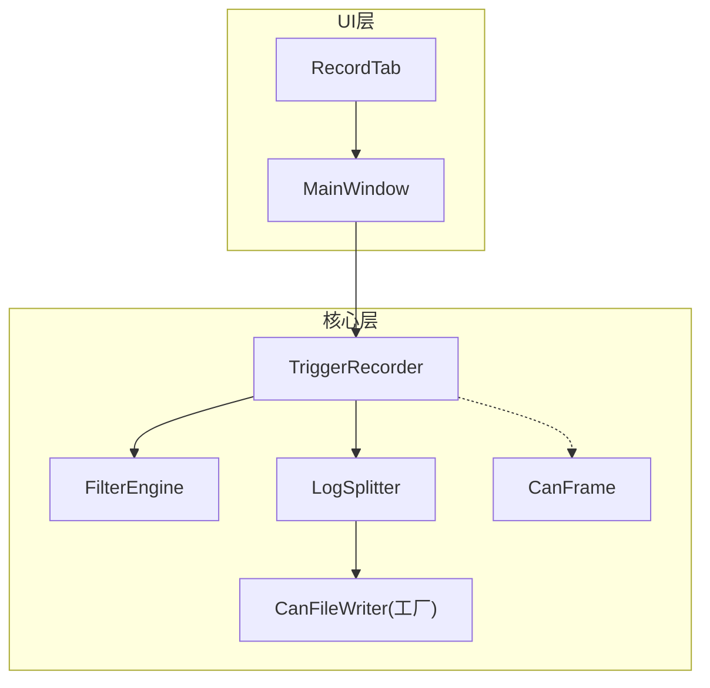
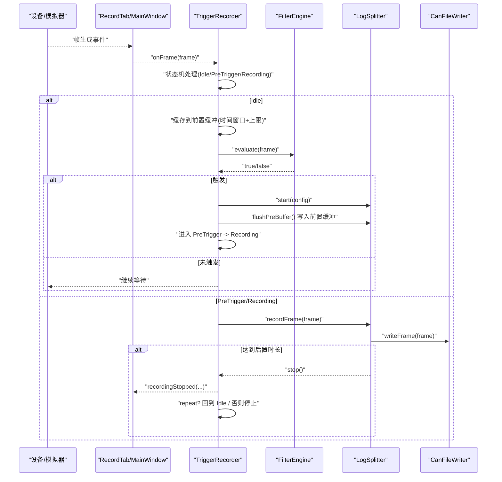
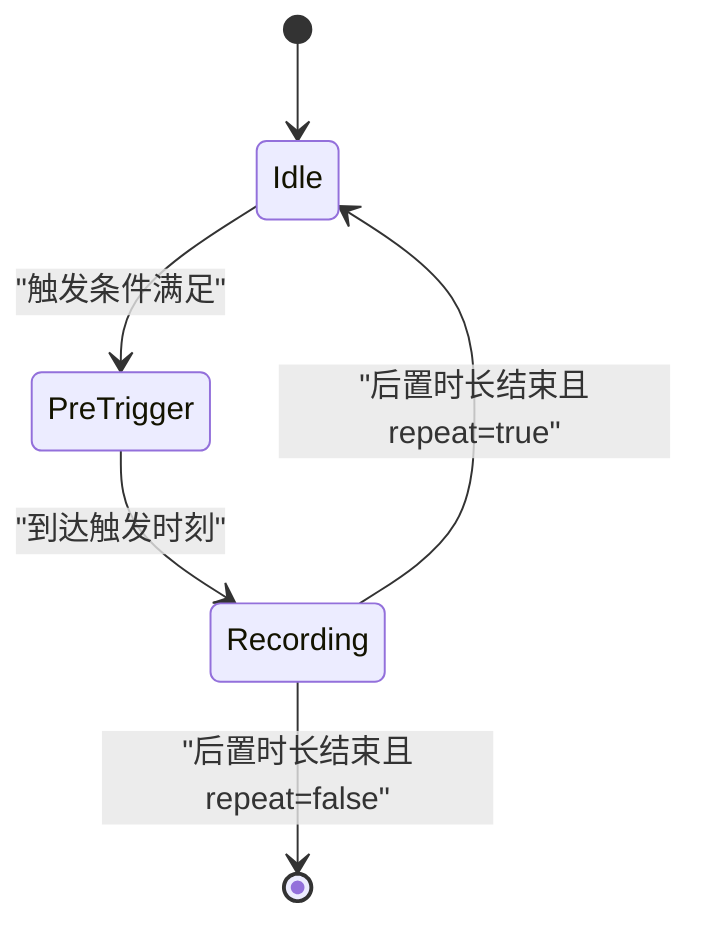
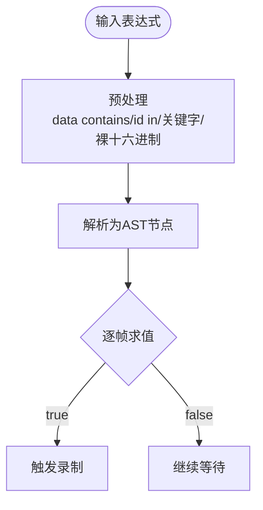
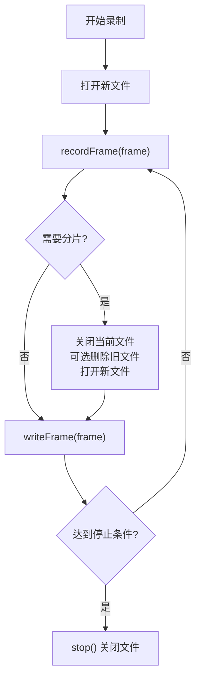
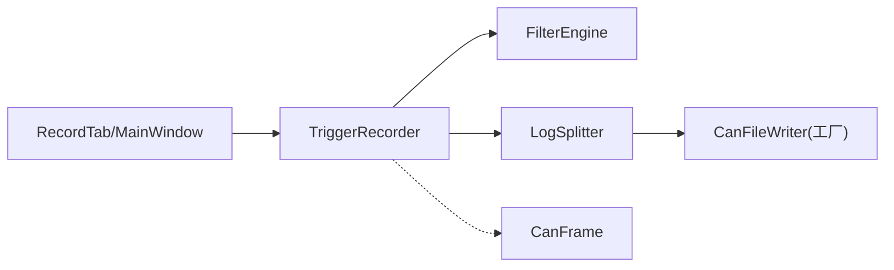

# 触发录制器

<cite>
**本文引用的文件**
- [triggerrecorder.h](file://src/core/triggerrecorder.h)
- [triggerrecorder.cpp](file://src/core/triggerrecorder.cpp)
- [filter_engine.h](file://src/core/filter_engine.h)
- [filter_engine.cpp](file://src/core/filter_engine.cpp)
- [logsplitter.h](file://src/core/logsplitter.h)
- [logsplitter.cpp](file://src/core/logsplitter.cpp)
- [canframe.h](file://src/core/canframe.h)
- [recorder.h](file://src/core/recorder.h)
- [recorder.cpp](file://src/core/recorder.cpp)
- [canfileio_factory.h](file://src/core/canfileio/canfileio_factory.h)
- [canfileio_factory.cpp](file://src/core/canfileio/canfileio_factory.cpp)
- [canfileio.h](file://src/core/canfileio/canfileio.h)
- [recordtab.h](file://src/ui/recordtab.h)
- [recordtab.cpp](file://src/ui/recordtab.cpp)
- [mainwindow.cpp](file://src/ui/mainwindow.cpp)
</cite>

## 更新摘要
**变更内容**
- 优化了switch语句块作用域，提升代码可读性和可维护性
- 改进了变量命名规范，将`triggered`重命名为`isTriggered`，增强语义清晰度
- 增强了代码质量和结构组织

## 目录
1. [简介](#简介)
2. [项目结构](#项目结构)
3. [核心组件](#核心组件)
4. [架构总览](#架构总览)
5. [详细组件分析](#详细组件分析)
6. [依赖关系分析](#依赖关系分析)
7. [性能考量](#性能考量)
8. [故障排查指南](#故障排查指南)
9. [结论](#结论)
10. [附录](#附录)

## 简介
本模块实现"条件触发录制"能力，对标 CANoe 的 Trigger Logging。其核心思想是：在内存中维护一个最近 N 秒或 N 帧的前置缓冲（Pre-Trigger），对每帧报文通过表达式求值判断是否满足触发条件；一旦触发，将前置缓冲写入文件并持续录制后置时长，随后停止或根据配置重复触发。该功能由 UI 层提供参数配置，核心逻辑位于 TriggerRecorder，底层文件分片与写入由 LogSplitter 和 CanFileWriter 完成。

## 项目结构
触发录制相关代码主要分布在 core 与 ui 两层：
- core：TriggerRecorder、FilterEngine、LogSplitter、CanFrame、Recorder、CanFileIOFactory 等
- ui：RecordTab 提供触发录制的用户界面，MainWindow 负责连接数据源与 TriggerRecorder

**图表来源**
- [triggerrecorder.h:20-73](file://src/core/triggerrecorder.h#L20-L73)
- [triggerrecorder.cpp:11-37](file://src/core/triggerrecorder.cpp#L11-L37)
- [logsplitter.h:21-72](file://src/core/logsplitter.h#L21-L72)
- [canfileio_factory.h:10-32](file://src/core/canfileio/canfileio_factory.h#L10-L32)
- [recordtab.h:21-75](file://src/ui/recordtab.h#L21-L75)
- [mainwindow.cpp:2000-2021](file://src/ui/mainwindow.cpp#L2000-L2021)

**章节来源**
- [triggerrecorder.h:20-73](file://src/core/triggerrecorder.h#L20-L73)
- [triggerrecorder.cpp:11-37](file://src/core/triggerrecorder.cpp#L11-L37)
- [logsplitter.h:21-72](file://src/core/logsplitter.h#L21-L72)
- [canfileio_factory.h:10-32](file://src/core/canfileio/canfileio_factory.h#L10-L32)
- [recordtab.h:21-75](file://src/ui/recordtab.h#L21-L75)
- [mainwindow.cpp:2000-2021](file://src/ui/mainwindow.cpp#L2000-L2021)

## 核心组件
- TriggerRecorder：状态机驱动的条件触发录制器，管理前置缓冲、触发判定、后置录制与重复触发策略
- FilterEngine：轻量级表达式解析与求值引擎，支持 id/dlc/ch/time/fd/ext/rx/tx/std 等变量及逻辑/比较运算符、data contains、id in 语法糖
- LogSplitter：日志分片管理器，按大小/时间切割，支持环形模式与序号命名
- Recorder：简单流式写入封装（用于普通录制）
- CanFileWriter/Factory：统一写入接口与格式工厂（BLF/ASC/CSV）
- CanFrame：CAN/CAN FD 帧数据结构，含时间戳、ID、数据、通道、方向等

**章节来源**
- [triggerrecorder.h:20-73](file://src/core/triggerrecorder.h#L20-L73)
- [filter_engine.h:9-58](file://src/core/filter_engine.h#L9-L58)
- [logsplitter.h:12-72](file://src/core/logsplitter.h#L12-L72)
- [recorder.h:12-47](file://src/core/recorder.h#L12-L47)
- [canfileio_factory.h:7-32](file://src/core/canfileio/canfileio_factory.h#L7-L32)
- [canframe.h:8-125](file://src/core/canframe.h#L8-L125)

## 架构总览
触发录制的数据流与控制流如下：

**图表来源**
- [triggerrecorder.cpp:53-131](file://src/core/triggerrecorder.cpp#L53-L131)
- [filter_engine.cpp:91-200](file://src/core/filter_engine.cpp#L91-L200)
- [logsplitter.cpp:93-119](file://src/core/logsplitter.cpp#L93-L119)
- [canfileio_factory.cpp:25-29](file://src/core/canfileio/canfileio_factory.cpp#L25-L29)
- [mainwindow.cpp:2000-2021](file://src/ui/mainwindow.cpp#L2000-L2021)

## 详细组件分析

### TriggerRecorder（条件触发录制器）
- 状态机：Idle → PreTrigger → Recording，支持 repeatTrigger 控制循环
- 前置缓冲：QQueue + 时间窗口裁剪，限制最大帧数防止内存膨胀
- 触发判定：使用 FilterEngine 编译并求值表达式；无条件时立即触发
- 录制流程：触发后启动 LogSplitter，先 flush 前置缓冲，再持续写入至后置时长结束
- 信号：triggered、recordingStarted、recordingStopped、frameRecorded

**已更新** 优化了switch语句块作用域，提升了代码的可读性和可维护性。在onFrame方法中，每个case分支都使用了独立的作用域块，确保局部变量的生命周期得到更好的控制。

**图表来源**
- [triggerrecorder.h:33-37](file://src/core/triggerrecorder.h#L33-L37)
- [triggerrecorder.cpp:53-105](file://src/core/triggerrecorder.cpp#L53-L105)

**章节来源**
- [triggerrecorder.h:20-73](file://src/core/triggerrecorder.h#L20-L73)
- [triggerrecorder.cpp:11-141](file://src/core/triggerrecorder.cpp#L11-L141)

### FilterEngine（表达式求值引擎）
- 语法：支持变量、逻辑运算、比较、data contains、id in、裸十六进制等
- 预处理：提取 data contains 片段、转换 id in、关键字替换、包裹裸十六进制、十六进制转十进制
- AST：递归下降解析为抽象语法树，逐帧 evaluate

**图表来源**
- [filter_engine.cpp:91-200](file://src/core/filter_engine.cpp#L91-L200)
- [filter_engine.h:9-58](file://src/core/filter_engine.h#L9-L58)

**章节来源**
- [filter_engine.h:9-58](file://src/core/filter_engine.h#L9-L58)
- [filter_engine.cpp:91-200](file://src/core/filter_engine.cpp#L91-L200)

### LogSplitter（日志分片管理器）
- 分片策略：按文件大小或时间间隔自动切分
- 环形模式：超过最大文件数时删除最旧文件
- 文件名：前缀_序号.扩展名，序号三位补零
- 写入：委托给 CanFileWriter 接口

**图表来源**
- [logsplitter.cpp:18-119](file://src/core/logsplitter.cpp#L18-L119)
- [logsplitter.h:26-36](file://src/core/logsplitter.h#L26-L36)

**章节来源**
- [logsplitter.h:21-72](file://src/core/logsplitter.h#L21-L72)
- [logsplitter.cpp:18-119](file://src/core/logsplitter.cpp#L18-L119)

### Recorder（普通录制器）
- 基于 CanFileIOFactory 创建对应格式的写入器
- 生命周期：start(filePath) → recordFrame × N → stop()
- 信号：recordingStarted、recordingStopped、frameRecorded

**章节来源**
- [recorder.h:12-47](file://src/core/recorder.h#L12-L47)
- [recorder.cpp:17-60](file://src/core/recorder.cpp#L17-L60)

### UI 集成（RecordTab 与 MainWindow）
- RecordTab：提供触发录制开关、表达式编辑、前后置时长、重复触发选项，并在启用时发出 triggerRecordingRequested
- MainWindow：接收配置，构造 TriggerRecorder::Config，订阅设备/模拟器帧事件，转发到 TriggerRecorder::onFrame

**章节来源**
- [recordtab.h:21-75](file://src/ui/recordtab.h#L21-L75)
- [recordtab.cpp:139-243](file://src/ui/recordtab.cpp#L139-L243)
- [mainwindow.cpp:2000-2021](file://src/ui/mainwindow.cpp#L2000-L2021)

## 依赖关系分析
- TriggerRecorder 依赖：
  - FilterEngine：用于触发条件求值
  - LogSplitter：用于文件分片与写入
  - CanFrame：作为数据载体
- LogSplitter 依赖：
  - CanFileWriter（通过工厂）：具体格式写入实现
- UI 依赖：
  - RecordTab 暴露信号，MainWindow 桥接设备/模拟器与 TriggerRecorder

**图表来源**
- [triggerrecorder.h:20-73](file://src/core/triggerrecorder.h#L20-L73)
- [logsplitter.h:21-72](file://src/core/logsplitter.h#L21-L72)
- [canfileio_factory.h:10-32](file://src/core/canfileio/canfileio_factory.h#L10-L32)
- [recordtab.h:21-75](file://src/ui/recordtab.h#L21-L75)
- [mainwindow.cpp:2000-2021](file://src/ui/mainwindow.cpp#L2000-L2021)

**章节来源**
- [triggerrecorder.h:20-73](file://src/core/triggerrecorder.h#L20-L73)
- [logsplitter.h:21-72](file://src/core/logsplitter.h#L21-L72)
- [canfileio_factory.h:10-32](file://src/core/canfileio/canfileio_factory.h#L10-L32)
- [recordtab.h:21-75](file://src/ui/recordtab.h#L21-L75)
- [mainwindow.cpp:2000-2021](file://src/ui/mainwindow.cpp#L2000-L2021)

## 性能考量
- 前置缓冲容量：默认按 preTriggerSeconds * 1000 估算上限，并设置上下界，避免高吞吐场景下内存暴涨
- 时间窗口裁剪：每次入队后清理超出 preTriggerSeconds 的旧帧，保证缓冲时效性
- 表达式求值：FilterEngine 预编译一次，逐帧 O(1) 求值，适合高频帧流
- 文件分片：按大小/时间切分，降低单文件过大导致的 I/O 压力；环形模式可自动回收旧文件
- 写入路径：通过 CanFileWriter 接口直接写帧，减少中间拷贝

[本节为通用性能建议，不直接分析具体文件]

## 故障排查指南
- 表达式编译失败：
  - 现象：start 返回 false，录制未启动
  - 检查：表达式语法是否正确，变量名是否合法，括号匹配
  - 参考：表达式编译与错误信息获取
  - 章节来源
    - [triggerrecorder.cpp:27-34](file://src/core/triggerrecorder.cpp#L27-L34)
    - [filter_engine.h:38-51](file://src/core/filter_engine.h#L38-L51)
- 无法创建录制文件：
  - 现象：start/open 失败，UI 提示无法创建文件
  - 检查：目录是否存在、权限是否足够、后缀是否受支持
  - 参考：LogSplitter 打开新文件与 Recorder 打开文件
  - 章节来源
    - [logsplitter.cpp:48-59](file://src/core/logsplitter.cpp#L48-L59)
    - [recorder.cpp:17-36](file://src/core/recorder.cpp#L17-L36)
- 录制提前停止：
  - 现象：未达到预期后置时长即停止
  - 检查：postTriggerSeconds 配置、repeatTrigger 行为、分片阈值是否过小导致频繁切换
  - 参考：后置时长结束判断与分片逻辑
  - 章节来源
    - [triggerrecorder.cpp:85-103](file://src/core/triggerrecorder.cpp#L85-L103)
    - [logsplitter.cpp:70-78](file://src/core/logsplitter.cpp#L70-L78)
- 无触发：
  - 现象：一直停留在 Idle，未进入 PreTrigger
  - 检查：表达式是否为空（无条件会立即触发）、数据源是否接入、帧时间戳是否单调递增
  - 参考：checkTrigger 与 onFrame 状态机
  - 章节来源
    - [triggerrecorder.cpp:108-131](file://src/core/triggerrecorder.cpp#L108-L131)
    - [triggerrecorder.cpp:53-72](file://src/core/triggerrecorder.cpp#L53-L72)

## 结论
触发录制器以状态机为核心，结合前置缓冲与表达式求值，实现了灵活可靠的"条件触发 + 前后置录制"能力。配合 LogSplitter 的文件分片机制与 CanFileWriter 的统一写入接口，既保证了实时性与稳定性，又兼顾了不同格式与存储策略。UI 层提供了直观的配置入口，便于用户在复杂总线场景中精准捕获关键事件。

**已更新** 通过switch语句块作用域优化和变量命名改进（triggered重命名为isTriggered），进一步提升了代码的可读性和可维护性，使触发条件的判断逻辑更加清晰易懂。

## 附录
- 典型用法
  - 在 RecordTab 中勾选"启用触发录制"，填写触发表达式与前后置时长，点击"开始触发录制"
  - MainWindow 将配置转换为 TriggerRecorder::Config，并将设备/模拟器的帧事件转发给 TriggerRecorder::onFrame
  - 触发后，系统自动写入前置缓冲并持续录制后置时长，结束后根据 repeatTrigger 决定是否继续监听
- 相关 API 路径
  - 触发录制入口：[recordtab.cpp:218-243](file://src/ui/recordtab.cpp#L218-L243)
  - 主窗口绑定：[mainwindow.cpp:2000-2021](file://src/ui/mainwindow.cpp#L2000-L2021)
  - 触发录制核心：[triggerrecorder.cpp:11-141](file://src/core/triggerrecorder.cpp#L11-L141)
  - 表达式引擎：[filter_engine.cpp:91-200](file://src/core/filter_engine.cpp#L91-L200)
  - 文件分片：[logsplitter.cpp:18-119](file://src/core/logsplitter.cpp#L18-L119)
  - 写入接口：[canfileio.h:56-81](file://src/core/canfileio/canfileio.h#L56-L81)
  - 工厂方法：[canfileio_factory.cpp:25-29](file://src/core/canfileio/canfileio_factory.cpp#L25-L29)