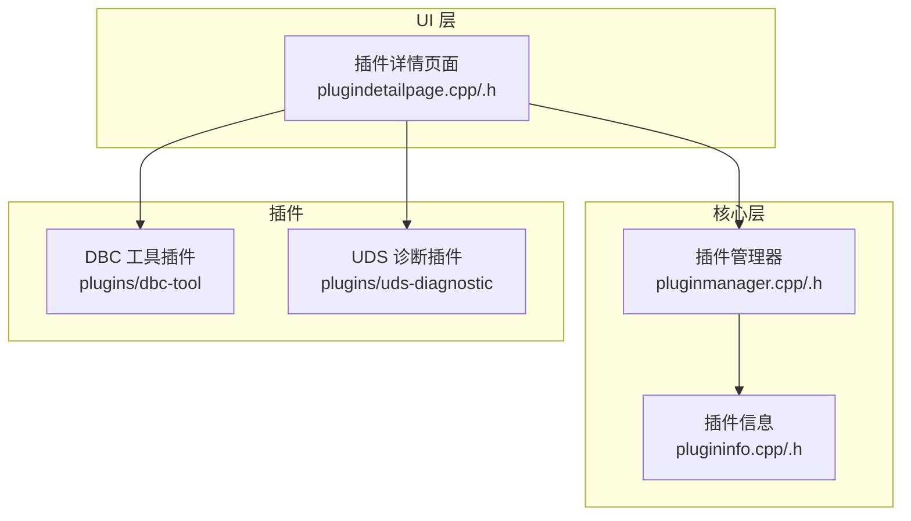
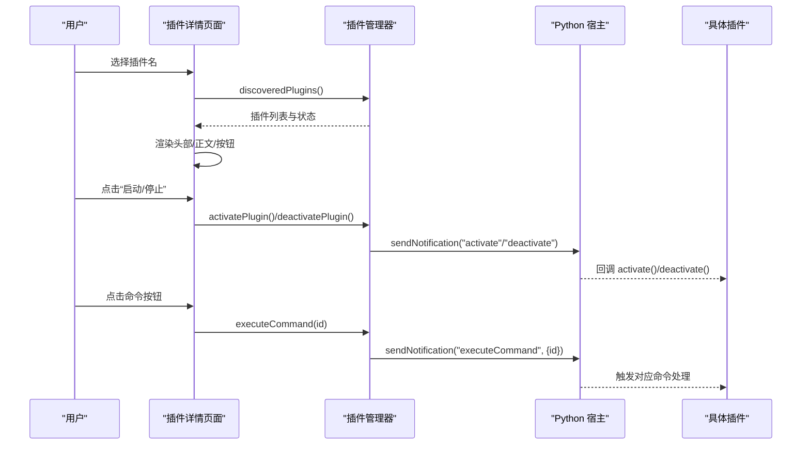
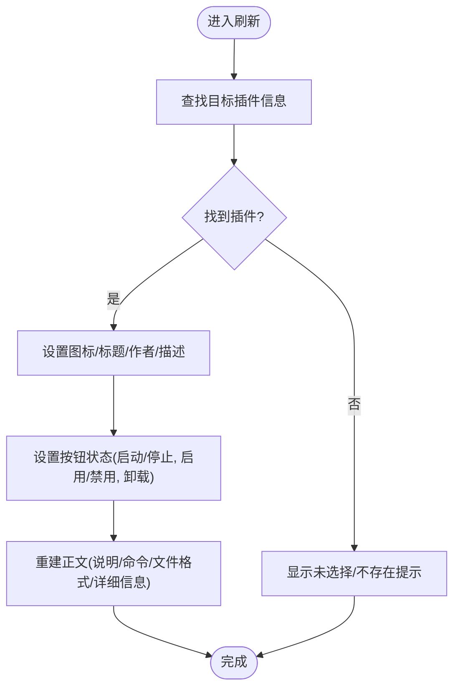
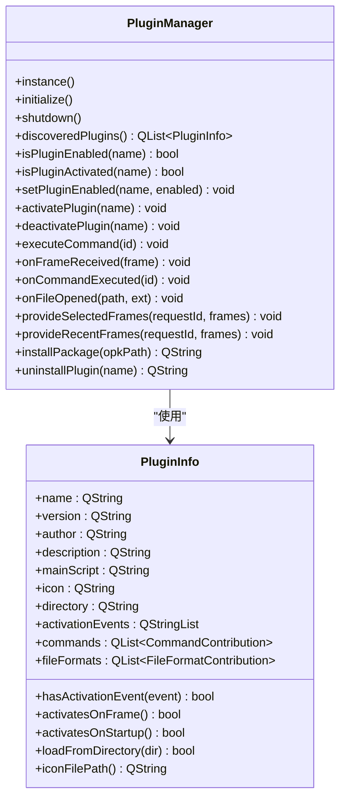
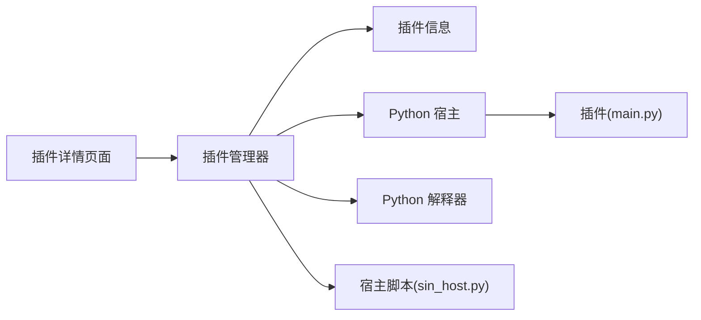

# 插件详情页面

<cite>
**本文引用的文件**
- [src/ui/plugindetailpage.cpp](file://src/ui/plugindetailpage.cpp)
- [src/ui/plugindetailpage.h](file://src/ui/plugindetailpage.h)
- [src/core/plugin/pluginmanager.h](file://src/core/plugin/pluginmanager.h)
- [src/core/plugin/pluginmanager.cpp](file://src/core/plugin/pluginmanager.cpp)
- [src/core/plugin/plugininfo.h](file://src/core/plugin/plugininfo.h)
- [src/core/plugin/plugininfo.cpp](file://src/core/plugin/plugininfo.cpp)
- [plugins/dbc-tool/main.py](file://plugins/dbc-tool/main.py)
- [plugins/dbc-tool/plugin.json](file://plugins/dbc-tool/plugin.json)
- [plugins/uds-diagnostic/main.py](file://plugins/uds-diagnostic/main.py)
- [plugins/uds-diagnostic/plugin.json](file://plugins/uds-diagnostic/plugin.json)
</cite>

## 目录
1. [简介](#简介)
2. [项目结构](#项目结构)
3. [核心组件](#核心组件)
4. [架构总览](#架构总览)
5. [详细组件分析](#详细组件分析)
6. [依赖关系分析](#依赖关系分析)
7. [性能考虑](#性能考虑)
8. [故障排查指南](#故障排查指南)
9. [结论](#结论)
10. [附录](#附录)

## 简介
本章节面向“插件详情页面”的功能与实现，说明该页面如何展示已发现插件的元数据、命令贡献、文件格式支持，并提供启动/停用、启用/禁用、卸载等管理能力。页面通过 Qt 构建 UI，与插件管理器交互，读取插件清单并渲染 VS Code 风格的详情视图。

## 项目结构
插件详情页面位于 UI 层，核心逻辑在 src/ui/plugindetailpage.*；插件管理与信息解析位于 core/plugin/*；示例插件位于 plugins/*（如 dbc-tool、uds-diagnostic）。

图表来源
- [src/ui/plugindetailpage.cpp:145-250](file://src/ui/plugindetailpage.cpp#L145-L250)
- [src/core/plugin/pluginmanager.cpp:117-155](file://src/core/plugin/pluginmanager.cpp#L117-L155)
- [src/core/plugin/plugininfo.cpp:26-85](file://src/core/plugin/plugininfo.cpp#L26-L85)

章节来源
- [src/ui/plugindetailpage.cpp:145-250](file://src/ui/plugindetailpage.cpp#L145-L250)
- [src/core/plugin/pluginmanager.cpp:117-155](file://src/core/plugin/pluginmanager.cpp#L117-L155)
- [src/core/plugin/plugininfo.cpp:26-85](file://src/core/plugin/plugininfo.cpp#L26-L85)

## 核心组件
- 插件详情页面：负责 UI 构建、图标加载、头部信息与正文双栏布局、按钮事件绑定、刷新与重建。
- 插件管理器：单例，负责插件发现、激活/停用、命令执行、宿主进程管理、消息分发。
- 插件信息：从 plugin.json 解析名称、版本、作者、描述、入口脚本、图标、激活事件、命令与文件格式贡献。

章节来源
- [src/ui/plugindetailpage.h:17-59](file://src/ui/plugindetailpage.h#L17-L59)
- [src/core/plugin/pluginmanager.h:19-110](file://src/core/plugin/pluginmanager.h#L19-L110)
- [src/core/plugin/plugininfo.h:8-58](file://src/core/plugin/plugininfo.h#L8-L58)

## 架构总览
插件详情页面通过 PluginManager 获取插件列表与状态，渲染到界面；用户操作（启动/停用、启用/禁用、卸载）直接调用 PluginManager；命令点击触发 executeCommand，由管理器转发至 Python 宿主执行。

图表来源
- [src/ui/plugindetailpage.cpp:222-249](file://src/ui/plugindetailpage.cpp#L222-L249)
- [src/core/plugin/pluginmanager.cpp:287-325](file://src/core/plugin/pluginmanager.cpp#L287-L325)
- [src/core/plugin/pluginmanager.cpp:343-364](file://src/core/plugin/pluginmanager.cpp#L343-L364)

## 详细组件分析

### 插件详情页面（PluginDetailPage）
- 职责
  - 构建固定头部：图标、标题（名称+版本）、作者、描述、操作按钮（启动/停止、启用/禁用、卸载）。
  - 构建可滚动正文：左主列（说明、命令列表、支持的文件格式），右信息栏（标识符、版本、作者、状态、激活事件、目录）。
  - 图标加载：优先加载 SVG/PNG 等图片，失败时按名称哈希生成圆角首字母头像。
  - 刷新机制：监听插件列表变化信号，自动刷新；showPlugin(name) 切换当前插件。
  - 按钮行为：
    - 启动/停止：切换激活状态。
    - 启用/禁用：切换可用状态（禁用会停用已激活的插件）。
    - 卸载：确认后删除插件目录。
- 关键流程
  - refresh(): 查找当前插件信息，设置头部控件文本与按钮状态，调用 rebuildBody()。
  - rebuildBody(): 清空正文布局，根据插件信息动态生成命令按钮与文件格式行，填充右侧详细信息。

图表来源
- [src/ui/plugindetailpage.cpp:267-311](file://src/ui/plugindetailpage.cpp#L267-L311)
- [src/ui/plugindetailpage.cpp:313-420](file://src/ui/plugindetailpage.cpp#L313-L420)

章节来源
- [src/ui/plugindetailpage.cpp:25-76](file://src/ui/plugindetailpage.cpp#L25-L76)
- [src/ui/plugindetailpage.cpp:145-250](file://src/ui/plugindetailpage.cpp#L145-L250)
- [src/ui/plugindetailpage.cpp:252-311](file://src/ui/plugindetailpage.cpp#L252-L311)
- [src/ui/plugindetailpage.cpp:313-420](file://src/ui/plugindetailpage.cpp#L313-L420)

### 插件管理器（PluginManager）
- 职责
  - 发现插件：扫描 plugins/ 目录，加载每个插件的 plugin.json，去重后缓存。
  - 生命周期：initialize() 启动 Python 宿主（按需），shutdown() 停用所有激活插件并清理资源。
  - 激活/停用：向宿主发送 activate/deactivate 通知，维护激活集合。
  - 命令执行：将命令 ID 转发给宿主，必要时根据激活事件自动激活插件。
  - 帧批量：为 onFrame 插件缓冲 CAN 帧，定时批量发送。
  - 会话与转换：提供 files.* 与 dbc.* API 的请求处理（文件转换、DBC 打开/查询/更新/保存/关闭）。
- 与详情页交互
  - 提供 discoveredPlugins()、isPluginEnabled()、isPluginActivated()、activatePlugin()、deactivatePlugin()、setPluginEnabled()、executeCommand()、uninstallPlugin()。

图表来源
- [src/core/plugin/pluginmanager.h:19-168](file://src/core/plugin/pluginmanager.h#L19-L168)
- [src/core/plugin/plugininfo.h:8-58](file://src/core/plugin/plugininfo.h#L8-L58)

章节来源
- [src/core/plugin/pluginmanager.cpp:54-155](file://src/core/plugin/pluginmanager.cpp#L54-L155)
- [src/core/plugin/pluginmanager.cpp:222-364](file://src/core/plugin/pluginmanager.cpp#L222-L364)
- [src/core/plugin/pluginmanager.cpp:388-477](file://src/core/plugin/pluginmanager.cpp#L388-L477)
- [src/core/plugin/pluginmanager.cpp:514-769](file://src/core/plugin/pluginmanager.cpp#L514-L769)

### 插件信息（PluginInfo）
- 职责
  - 从插件目录的 plugin.json 解析基本信息、激活事件、命令贡献、文件格式贡献。
  - 提供辅助方法判断是否监听帧事件或启动时激活，以及计算图标绝对路径。
- 关键字段
  - name/version/author/description/main/icon/directory
  - activationEvents: 如 "onStartup"、"onCommand:id"、"onFrame"
  - contributes.commands: [{id, title}]
  - contributes.fileFormats: [{extension, name}]

章节来源
- [src/core/plugin/plugininfo.cpp:26-85](file://src/core/plugin/plugininfo.cpp#L26-L85)
- [src/core/plugin/plugininfo.h:8-58](file://src/core/plugin/plugininfo.h#L8-L58)

### 示例插件与 manifest
- DBC 工具插件
  - 入口 main.py 注册命令 "dbcTool.open"，创建独立窗口用于查看/编辑 DBC。
  - plugin.json 声明 name、version、author、description、main、icon、activationEvents、contributes.commands。
- UDS 诊断插件
  - 入口 main.py 提供完整 ISO-TP 流控、服务表单、DID 面板、DTC 管理、安全访问、刷写助手等。
  - plugin.json 声明 name、version、author、description、main、icon、activationEvents、contributes.commands。

章节来源
- [plugins/dbc-tool/plugin.json:1-17](file://plugins/dbc-tool/plugin.json#L1-L17)
- [plugins/dbc-tool/main.py:28-50](file://plugins/dbc-tool/main.py#L28-L50)
- [plugins/dbc-tool/main.py:339-345](file://plugins/dbc-tool/main.py#L339-L345)
- [plugins/uds-diagnostic/plugin.json:1-17](file://plugins/uds-diagnostic/plugin.json#L1-L17)
- [plugins/uds-diagnostic/main.py:125-151](file://plugins/uds-diagnostic/main.py#L125-L151)

## 依赖关系分析
- UI 层依赖核心层：
  - 插件详情页面依赖 PluginManager 提供的接口进行状态查询与操作。
  - 插件信息通过 PluginInfo 解析 manifest，供管理器与页面使用。
- 插件与宿主：
  - 插件通过 sin SDK 与宿主通信，宿主由 PluginManager 启动与管理。
- 外部依赖：
  - Python 解释器：管理器自动查找系统 python/python3/py 或环境变量 SIN_PYTHON。
  - 宿主脚本：scripts/sin_host.py，负责插件生命周期与消息转发。

图表来源
- [src/core/plugin/pluginmanager.cpp:83-115](file://src/core/plugin/pluginmanager.cpp#L83-L115)
- [src/core/plugin/pluginmanager.cpp:157-195](file://src/core/plugin/pluginmanager.cpp#L157-L195)

章节来源
- [src/core/plugin/pluginmanager.cpp:83-115](file://src/core/plugin/pluginmanager.cpp#L83-L115)
- [src/core/plugin/pluginmanager.cpp:157-195](file://src/core/plugin/pluginmanager.cpp#L157-L195)

## 性能考虑
- 帧批量传输：对 onFrame 插件采用定时器批量发送，降低频繁通信开销。
- 图标渲染：SVG 按设备像素比放大渲染，避免模糊；无图标时快速生成首字母头像。
- 布局重建：正文区域每次刷新前清空布局，避免残留 widget 导致内存与显示问题。
- 宿主进程：仅在存在插件且 Python 可用时启动，减少不必要开销。

[本节为通用指导，不直接分析具体文件]

## 故障排查指南
- 未找到 Python 解释器
  - 现象：插件系统不可用，无法激活插件。
  - 排查：检查环境变量 SIN_PYTHON 或系统 PATH 中是否存在 python/python3/py。
  - 参考：管理器查找逻辑与日志输出。
- 宿主脚本缺失
  - 现象：插件宿主启动失败。
  - 排查：确认 scripts/sin_host.py 路径正确且存在。
- 插件 manifest 解析错误
  - 现象：插件未被发现或加载失败。
  - 排查：检查 plugin.json 是否为合法 JSON，必需字段 name 是否存在。
- 命令未生效
  - 现象：点击命令按钮无响应。
  - 排查：确认插件已激活且宿主运行正常；检查命令 id 是否与 manifest 一致。
- 卸载失败
  - 现象：卸载返回错误信息。
  - 排查：确认权限与目录存在；查看管理器返回的错误字符串。

章节来源
- [src/core/plugin/pluginmanager.cpp:83-115](file://src/core/plugin/pluginmanager.cpp#L83-L115)
- [src/core/plugin/pluginmanager.cpp:174-190](file://src/core/plugin/pluginmanager.cpp#L174-L190)
- [src/core/plugin/plugininfo.cpp:26-44](file://src/core/plugin/plugininfo.cpp#L26-L44)
- [src/ui/plugindetailpage.cpp:239-249](file://src/ui/plugindetailpage.cpp#L239-L249)

## 结论
插件详情页面提供了直观、易用的插件管理能力，结合插件管理器与插件信息解析，实现了从发现、展示到操作的完整闭环。通过 VS Code 风格的双栏布局与丰富的元数据展示，用户可以高效地理解插件功能并进行启停控制。同时，管理器对宿主进程、命令分发、帧批量与 DBC/files API 的支持，使插件生态具备强大的扩展能力。

[本节为总结性内容，不直接分析具体文件]

## 附录
- 典型操作流程
  - 打开插件详情页面 → 选择插件 → 查看说明/命令/文件格式 → 启动/停用 → 启用/禁用 → 卸载。
- 命令与激活事件
  - 插件通过 contributes.commands 暴露命令，页面按钮调用 executeCommand。
  - 管理器根据 onCommand:id 激活事件自动激活相关插件。
- 文件格式支持
  - 插件可通过 contributes.fileFormats 声明支持的扩展名与名称，页面以表格形式展示。

[本节为补充说明，不直接分析具体文件]