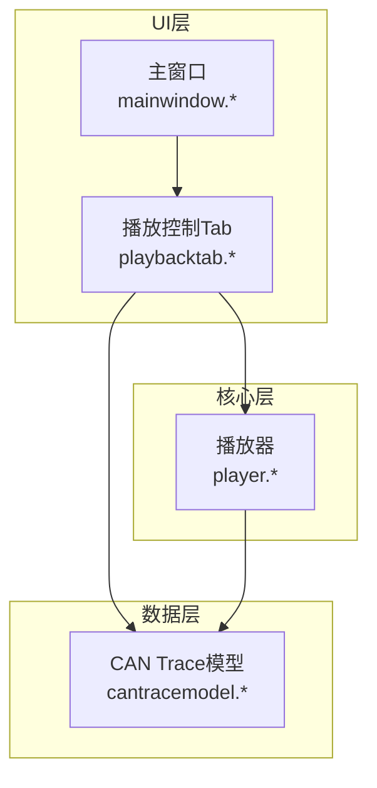
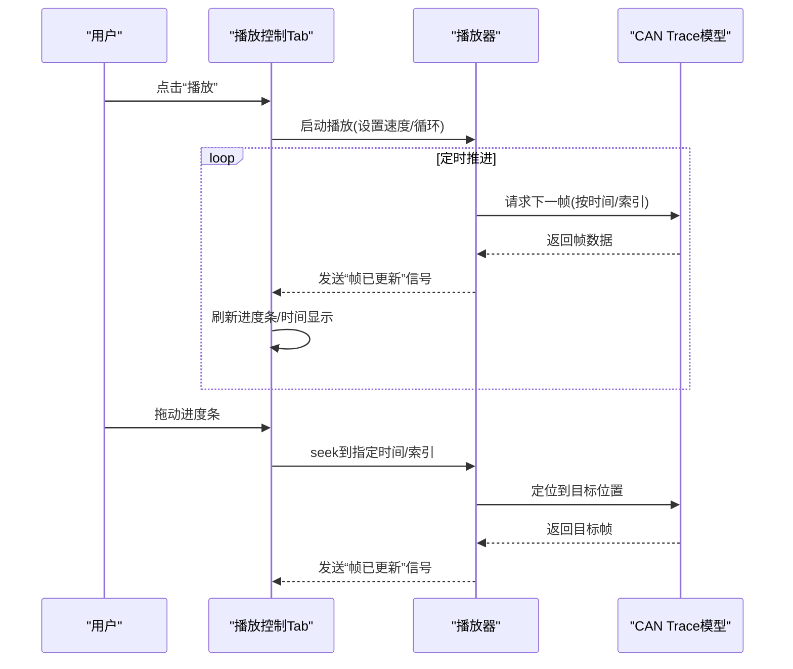
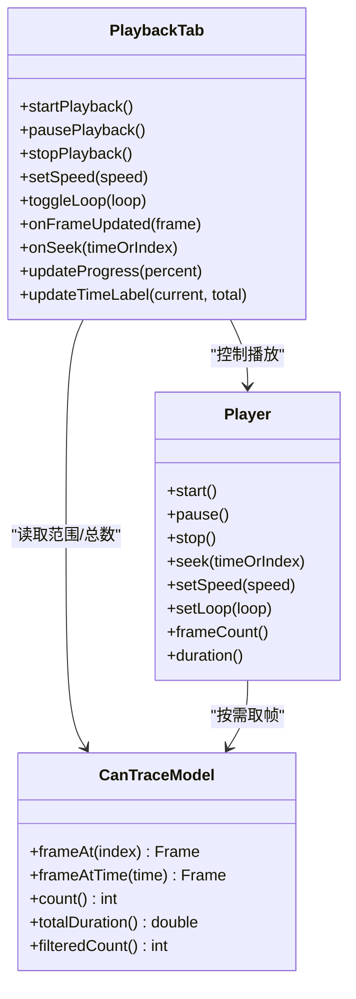
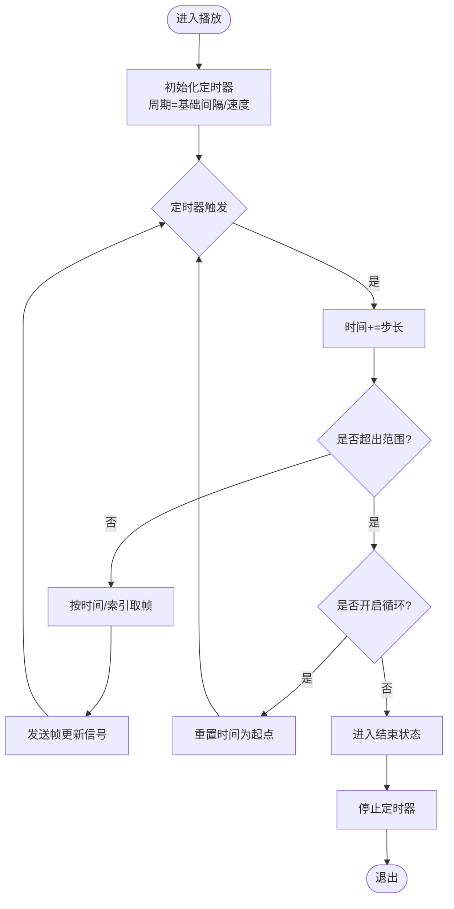
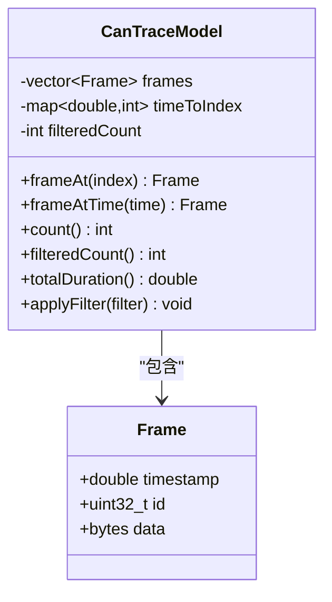
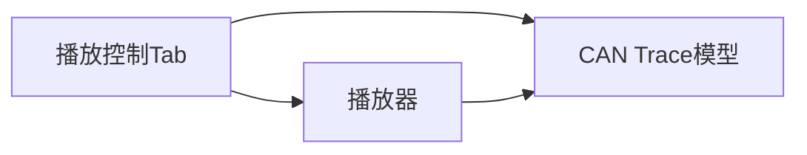

# 播放控制Tab组件

<cite>
**本文档引用的文件**   
- [playbacktab.h](file://src/ui/playbacktab.h)
- [playbacktab.cpp](file://src/ui/playbacktab.cpp)
- [player.h](file://src/core/player.h)
- [player.cpp](file://src/core/player.cpp)
- [cantracemodel.h](file://src/models/cantracemodel.h)
- [cantracemodel.cpp](file://src/models/cantracemodel.cpp)
- [mainwindow.h](file://src/ui/mainwindow.h)
- [mainwindow.cpp](file://src/ui/mainwindow.cpp)
</cite>

## 目录
1. [简介](#简介)
2. [项目结构](#项目结构)
3. [核心组件](#核心组件)
4. [架构总览](#架构总览)
5. [详细组件分析](#详细组件分析)
6. [依赖分析](#依赖分析)
7. [性能考虑](#性能考虑)
8. [故障排查指南](#故障排查指南)
9. [结论](#结论)
10. [附录](#附录)

## 简介
本文件聚焦于“播放控制Tab组件”的设计与实现，围绕播放/暂停、进度控制、速度调节、循环播放等交互能力展开。该组件位于UI层，负责用户操作与底层播放器、数据模型之间的协调，确保CAN Trace数据的回放体验流畅且可配置。

## 项目结构
播放控制Tab组件属于UI模块，与核心播放器（core）和数据模型（models）紧密协作。整体结构如下：
- UI层：播放控制Tab、主窗口、其他面板
- 核心层：播放器（播放状态机、时间轴推进、帧调度）
- 数据层：CAN Trace模型（提供帧序列、过滤、索引）

图表来源
- [playbacktab.h](file://src/ui/playbacktab.h)
- [playbacktab.cpp](file://src/ui/playbacktab.cpp)
- [player.h](file://src/core/player.h)
- [player.cpp](file://src/core/player.cpp)
- [cantracemodel.h](file://src/models/cantracemodel.h)
- [cantracemodel.cpp](file://src/models/cantracemodel.cpp)
- [mainwindow.h](file://src/ui/mainwindow.h)
- [mainwindow.cpp](file://src/ui/mainwindow.cpp)

章节来源
- [playbacktab.h](file://src/ui/playbacktab.h)
- [playbacktab.cpp](file://src/ui/playbacktab.cpp)
- [player.h](file://src/core/player.h)
- [player.cpp](file://src/core/player.cpp)
- [cantracemodel.h](file://src/models/cantracemodel.h)
- [cantracemodel.cpp](file://src/models/cantracemodel.cpp)
- [mainwindow.h](file://src/ui/mainwindow.h)
- [mainwindow.cpp](file://src/ui/mainwindow.cpp)

## 核心组件
- 播放控制Tab（UI）
  - 职责：渲染播放控件（播放/暂停、停止、步进、速度、循环开关）、显示当前时间与总时长、响应用户交互并驱动播放器。
  - 关键交互：点击播放/暂停切换状态；拖动进度条更新播放位置；调整倍速影响定时器间隔；切换循环模式改变结束行为。
- 播放器（Core）
  - 职责：维护播放状态（空闲/播放/暂停/结束）、基于定时器推进时间轴、从Trace模型读取帧并触发信号通知UI刷新。
  - 关键能力：开始/暂停/停止、设置目标时间或帧索引、按时间步长推进、边界处理（首尾循环、越界保护）。
- CAN Trace模型（Models）
  - 职责：提供帧序列、按时间或索引访问、支持过滤后的视图、计算总时长与帧率统计。
  - 关键能力：获取指定时间点的帧、根据索引取帧、迭代器遍历、长度与范围查询。

章节来源
- [playbacktab.h](file://src/ui/playbacktab.h)
- [playbacktab.cpp](file://src/ui/playbacktab.cpp)
- [player.h](file://src/core/player.h)
- [player.cpp](file://src/core/player.cpp)
- [cantracemodel.h](file://src/models/cantracemodel.h)
- [cantracemodel.cpp](file://src/models/cantracemodel.cpp)

## 架构总览
播放控制Tab通过信号槽机制与播放器通信，播放器再访问Trace模型以获取数据。UI仅做展示与输入，核心逻辑集中在播放器与模型中，保证高内聚低耦合。

图表来源
- [playbacktab.h](file://src/ui/playbacktab.h)
- [playbacktab.cpp](file://src/ui/playbacktab.cpp)
- [player.h](file://src/core/player.h)
- [player.cpp](file://src/core/player.cpp)
- [cantracemodel.h](file://src/models/cantracemodel.h)
- [cantracemodel.cpp](file://src/models/cantracemodel.cpp)

## 详细组件分析

### 播放控制Tab（UI）
- 界面元素
  - 播放/暂停按钮、停止按钮、步进前进/后退、速度选择器、循环开关、进度条、时间标签。
- 事件处理
  - 播放/暂停：切换播放器状态，更新按钮文本与图标。
  - 进度条：用户拖拽时调用播放器seek，避免频繁刷新；释放后确认最终位置。
  - 速度/循环：修改播放器参数，影响定时器周期与结束行为。
- 数据绑定
  - 订阅播放器“帧更新”信号，刷新当前时间、进度百分比、当前帧信息。
  - 监听模型“数据变化”信号，重置播放范围与总时长。

图表来源
- [playbacktab.h](file://src/ui/playbacktab.h)
- [playbacktab.cpp](file://src/ui/playbacktab.cpp)
- [player.h](file://src/core/player.h)
- [player.cpp](file://src/core/player.cpp)
- [cantracemodel.h](file://src/models/cantracemodel.h)
- [cantracemodel.cpp](file://src/models/cantracemodel.cpp)

章节来源
- [playbacktab.h](file://src/ui/playbacktab.h)
- [playbacktab.cpp](file://src/ui/playbacktab.cpp)

### 播放器（Core）
- 状态机
  - 状态：空闲、播放、暂停、结束。
  - 转换：start→播放；pause→暂停；stop→空闲；到达末尾→结束（若循环则回到起点继续）。
- 时间推进
  - 使用定时器驱动，周期=基础间隔/速度；每次推进固定时间步长，计算对应帧索引。
- 边界处理
  - 小于起始时间：归零；大于总时长：根据循环策略决定回到起点或停止。
- 信号接口
  - 帧更新：携带当前帧与时间戳，供UI刷新。
  - 状态变更：便于外部监听播放状态。

图表来源
- [player.h](file://src/core/player.h)
- [player.cpp](file://src/core/player.cpp)
- [cantracemodel.h](file://src/models/cantracemodel.h)
- [cantracemodel.cpp](file://src/models/cantracemodel.cpp)

章节来源
- [player.h](file://src/core/player.h)
- [player.cpp](file://src/core/player.cpp)

### CAN Trace模型（Models）
- 数据结构
  - 帧列表：包含时间戳、ID、数据字段等；支持过滤视图。
  - 索引映射：时间到索引的近似映射，加速seek。
- 关键方法
  - 按索引取帧：O(1)随机访问。
  - 按时间取帧：二分查找或预计算映射，O(logN)或O(1)。
  - 计数与范围：返回总帧数、过滤后数量、总时长。
- 线程安全
  - 读多写少场景下，建议只读访问；写入需加锁或仅在UI线程更新。

图表来源
- [cantracemodel.h](file://src/models/cantracemodel.h)
- [cantracemodel.cpp](file://src/models/cantracemodel.cpp)

章节来源
- [cantracemodel.h](file://src/models/cantracemodel.h)
- [cantracemodel.cpp](file://src/models/cantracemodel.cpp)

### 主窗口集成
- 角色：承载播放控制Tab与其他面板，管理生命周期与布局。
- 交互：将播放控制Tab实例化并嵌入主界面；转发部分全局动作（如快捷键）至Tab。

章节来源
- [mainwindow.h](file://src/ui/mainwindow.h)
- [mainwindow.cpp](file://src/ui/mainwindow.cpp)

## 依赖分析
- 组件耦合
  - 播放控制Tab依赖播放器与Trace模型，但通过信号槽解耦，降低直接调用耦合。
  - 播放器依赖Trace模型进行数据读取，不感知UI细节。
- 外部依赖
  - Qt框架（信号槽、定时器、UI控件）。
  - 可能的第三方库用于DBC解析或CAN协议处理（不在本组件范围内）。

图表来源
- [playbacktab.h](file://src/ui/playbacktab.h)
- [playbacktab.cpp](file://src/ui/playbacktab.cpp)
- [player.h](file://src/core/player.h)
- [player.cpp](file://src/core/player.cpp)
- [cantracemodel.h](file://src/models/cantracemodel.h)
- [cantracemodel.cpp](file://src/models/cantracemodel.cpp)

章节来源
- [playbacktab.h](file://src/ui/playbacktab.h)
- [playbacktab.cpp](file://src/ui/playbacktab.cpp)
- [player.h](file://src/core/player.h)
- [player.cpp](file://src/core/player.cpp)
- [cantracemodel.h](file://src/models/cantracemodel.h)
- [cantracemodel.cpp](file://src/models/cantracemodel.cpp)

## 性能考虑
- 定时器精度与UI刷新
  - 合理设置定时器周期，避免过高频率导致CPU占用；UI刷新采用节流或合并更新。
- 数据访问优化
  - 按时间取帧使用二分查找或时间-索引映射，减少线性扫描开销。
- 内存与缓存
  - 大文件场景下，按需加载帧或使用分页；对热点区间做缓存。
- 线程模型
  - 保持UI线程与数据处理分离，必要时使用队列异步更新UI。

[本节为通用指导，无需特定文件引用]

## 故障排查指南
- 播放无响应
  - 检查播放器状态是否为空闲；确认定时器已启动；验证Trace模型非空且有有效数据。
- 进度不同步
  - 核对时间推进步长与模型总时长一致性；检查seek逻辑是否正确更新内部索引。
- UI卡顿
  - 减少每帧UI更新量；批量更新标签与进度条；避免在定时器回调中进行重计算。
- 循环异常
  - 校验循环标志位；确认到达末尾时的重置逻辑；防止无限循环导致的资源耗尽。

章节来源
- [playbacktab.h](file://src/ui/playbacktab.h)
- [playbacktab.cpp](file://src/ui/playbacktab.cpp)
- [player.h](file://src/core/player.h)
- [player.cpp](file://src/core/player.cpp)
- [cantracemodel.h](file://src/models/cantracemodel.h)
- [cantracemodel.cpp](file://src/models/cantracemodel.cpp)

## 结论
播放控制Tab组件通过清晰的职责划分与信号槽机制，实现了用户交互与底层播放逻辑的有效解耦。播放器负责状态管理与时间推进，Trace模型提供高效的数据访问。整体架构具备良好的扩展性与可维护性，适合在CAN数据分析工具中复用与增强。

[本节为总结性内容，无需特定文件引用]

## 附录
- 术语表
  - 播放控制Tab：负责播放相关UI与交互的组件。
  - 播放器：管理播放状态、时间推进与帧调度的核心模块。
  - CAN Trace模型：提供CAN帧序列与时间索引的数据层。
- 最佳实践
  - 使用信号槽进行跨层通信，避免强耦合。
  - 在大数据集场景下优先采用懒加载与缓存策略。
  - 对UI更新进行节流，提升响应性。

[本节为补充信息，无需特定文件引用]