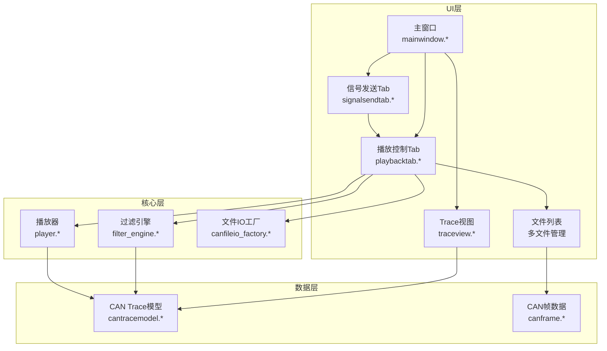
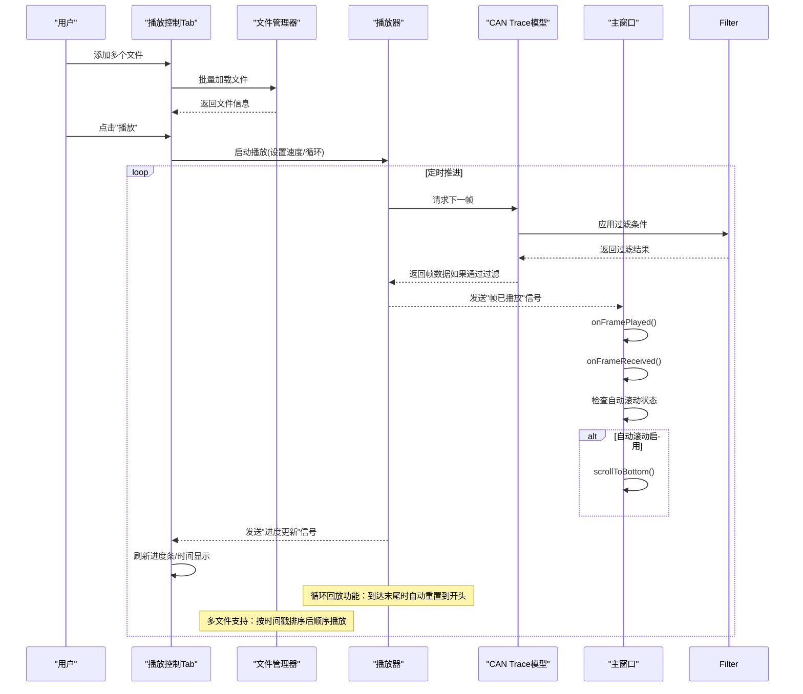
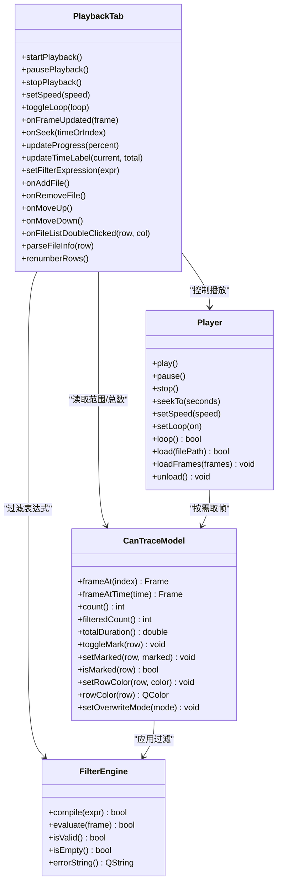
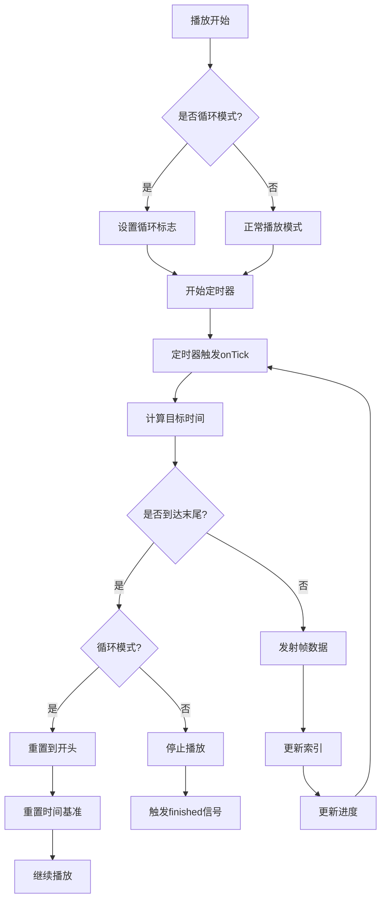
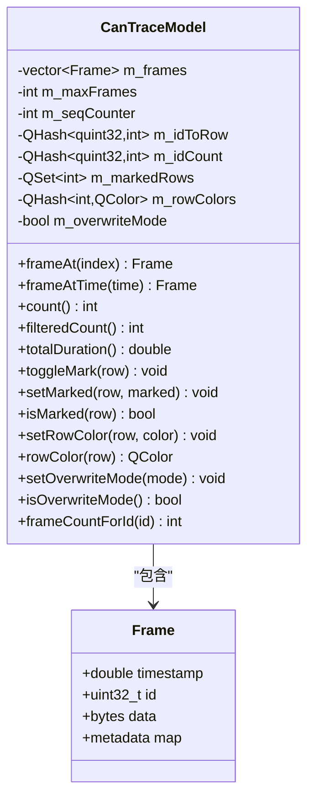
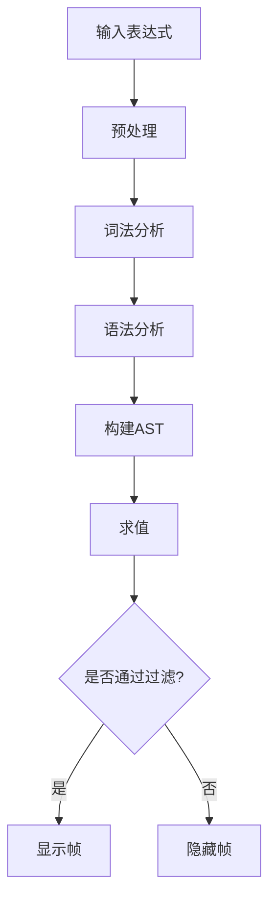
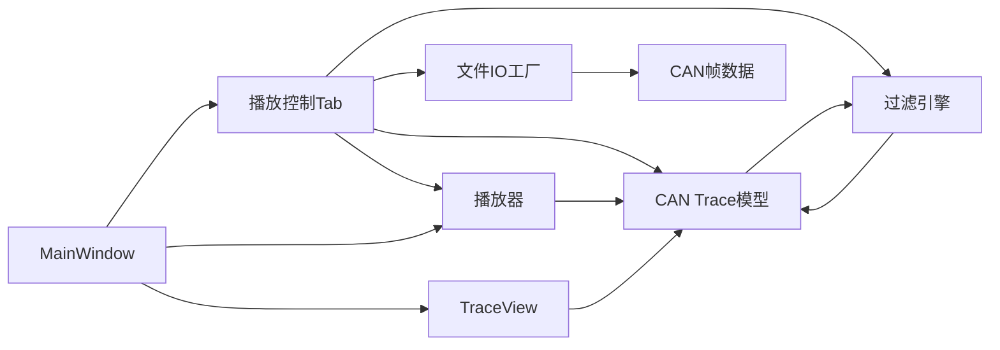

# 播放控制Tab组件

<cite>
**本文引用的文件**   
- [playbacktab.h](file://src/ui/playbacktab.h)
- [playbacktab.cpp](file://src/ui/playbacktab.cpp)
- [player.h](file://src/core/player.h)
- [player.cpp](file://src/core/player.cpp)
- [cantracemodel.h](file://src/models/cantracemodel.h)
- [cantracemodel.cpp](file://src/models/cantracemodel.cpp)
- [filter_engine.h](file://src/core/filter_engine.h)
- [filter_engine.cpp](file://src/core/filter_engine.cpp)
- [mainwindow.h](file://src/ui/mainwindow.h)
- [mainwindow.cpp](file://src/ui/mainwindow.cpp)
- [signalsendtab.h](file://src/ui/signalsendtab.h)
- [signalsendtab.cpp](file://src/ui/signalsendtab.cpp)
- [traceview.h](file://src/ui/traceview.h)
- [canframe.h](file://src/core/canframe.h)
</cite>

## 更新摘要
**所做更改**   
- 增强了CAN Trace模型，新增帧编号（No.）和增量时间（Delta）列
- 添加了行标记和自定义着色功能，支持toggleMark()、setMarked()、isMarked()方法
- 实现了自定义行颜色设置功能，通过setRowColor()方法实现
- 改进了过滤系统，支持比较运算符（>、<、>=、<=）和范围过滤语法（如'0.3~0.8'）
- **新增**：实现了完整的循环回放功能，播放器在到达文件末尾时自动重置到开头继续播放
- **新增**：增强了自动滚动功能的信号连接，支持全局控制所有Trace视图的自动滚动行为
- **新增**：实现了多文件播放支持，支持按顺序加载和播放多个CAN日志文件，具有自动时间戳排序功能
- **新增**：增强了文件加载能力，支持多种格式文件的批量处理和错误处理
- **新增**：改进了统计信息显示，提供每文件的详细统计信息和进度跟踪
- 更新了播放控制Tab组件以支持新的Trace模型功能和增强的过滤能力

## 目录
1. [简介](#简介)
2. [项目结构](#项目结构)
3. [核心组件](#核心组件)
4. [架构总览](#架构总览)
5. [详细组件分析](#详细组件分析)
6. [新增功能特性](#新增功能特性)
7. [依赖分析](#依赖分析)
8. [性能考虑](#性能考虑)
9. [故障排查指南](#故障排查指南)
10. [结论](#结论)
11. [附录](#附录)

## 简介
本文件聚焦于"播放控制Tab组件"的设计与实现，围绕播放/暂停、进度控制、速度调节、循环播放等交互能力展开。该组件位于UI层，负责用户操作与底层播放器、数据模型之间的协调，确保CAN Trace数据的回放体验流畅且可配置。**最新更新**：CAN Trace模型得到了显著增强，新增了帧编号和增量时间显示功能，同时提供了强大的行标记和自定义着色能力，以及改进的过滤系统支持多种比较运算符和范围过滤语法。**重要更新**：播放系统新增了完整的循环回放功能，当启用循环模式时，播放器在到达文件末尾时会重置到开头继续播放；同时增强了自动滚动功能的信号连接，支持全局控制所有Trace视图的自动滚动行为。**重大更新**：播放控制Tab组件现在支持多文件播放功能，用户可以添加多个CAN日志文件并按顺序播放，每个文件都有独立的统计信息和进度跟踪，系统会自动进行时间戳排序以确保正确的播放顺序。

## 项目结构
播放控制Tab组件属于UI模块，与核心播放器（core）、数据模型（models）和过滤引擎紧密协作。整体结构如下：
- UI层：播放控制Tab、主窗口、其他面板、信号发送Tab
- 核心层：播放器（播放状态机、时间轴推进、帧调度）、过滤引擎（表达式解析、条件求值）
- 数据层：CAN Trace模型（提供帧序列、过滤、索引、行标记、自定义着色）

**图表来源**
- [playbacktab.h](file://src/ui/playbacktab.h)
- [playbacktab.cpp](file://src/ui/playbacktab.cpp)
- [signalsendtab.h](file://src/ui/signalsendtab.h)
- [signalsendtab.cpp](file://src/ui/signalsendtab.cpp)
- [player.h](file://src/core/player.h)
- [player.cpp](file://src/core/player.cpp)
- [cantracemodel.h](file://src/models/cantracemodel.h)
- [cantracemodel.cpp](file://src/models/cantracemodel.cpp)
- [filter_engine.h](file://src/core/filter_engine.h)
- [filter_engine.cpp](file://src/core/filter_engine.cpp)
- [mainwindow.h](file://src/ui/mainwindow.h)
- [mainwindow.cpp](file://src/ui/mainwindow.cpp)
- [traceview.h](file://src/ui/traceview.h)
- [canframe.h](file://src/core/canframe.h)

## 核心组件
- 播放控制Tab（UI）
  - 职责：渲染播放控件（播放/暂停、停止、步进、速度、循环开关）、显示当前时间与总时长、响应用户交互并驱动播放器。
  - 关键交互：点击播放/暂停切换状态；拖动进度条更新播放位置；调整倍速影响定时器间隔；切换循环模式改变结束行为。
  - **新增功能**：支持多文件播放管理，包括文件添加、删除、排序、独立进度跟踪；集成改进的过滤系统、增强的可视化反馈。
- 播放器（Core）
  - 职责：维护播放状态（空闲/播放/暂停/结束）、基于定时器推进时间轴、从Trace模型读取帧并触发信号通知UI刷新。
  - 关键能力：开始/暂停/停止、设置目标时间或帧索引、按时间步长推进、边界处理（首尾循环、越界保护）。
  - **新增能力**：完整的循环回放功能，当到达文件末尾时自动重置到开头继续播放；支持多文件顺序播放和时间戳排序。
- CAN Trace模型（Models）
  - 职责：提供帧序列、按时间或索引访问、支持过滤后的视图、计算总时长与帧率统计。
  - **新增能力**：支持帧编号（No.）列显示、增量时间（Delta）计算、行标记管理、自定义背景色设置、覆盖模式支持。
- 过滤引擎（Core）
  - 职责：解析和执行复杂的过滤表达式，支持变量、逻辑运算、比较运算符、数据内容匹配等。
  - **新增能力**：支持比较运算符（>、<、>=、<=）、id in语法、data contains语法、裸十六进制自动转换。
- 信号发送Tab（UI）
  - 职责：与播放控制Tab协同工作，提供信号发送功能，支持在播放过程中动态发送CAN信号。
- Trace视图（UI）
  - 职责：提供CAN帧数据的可视化展示，支持自动滚动、选择、导航等功能。
  - **新增能力**：增强的自动滚动控制，支持全局开关控制所有Trace视图的滚动行为。

**章节来源**
- [playbacktab.h](file://src/ui/playbacktab.h)
- [playbacktab.cpp](file://src/ui/playbacktab.cpp)
- [signalsendtab.h](file://src/ui/signalsendtab.h)
- [signalsendtab.cpp](file://src/ui/signalsendtab.cpp)
- [player.h](file://src/core/player.h)
- [player.cpp](file://src/core/player.cpp)
- [cantracemodel.h](file://src/models/cantracemodel.h)
- [cantracemodel.cpp](file://src/models/cantracemodel.cpp)
- [filter_engine.h](file://src/core/filter_engine.h)
- [filter_engine.cpp](file://src/core/filter_engine.cpp)
- [traceview.h](file://src/ui/traceview.h)

## 架构总览
播放控制Tab通过信号槽机制与播放器通信，播放器再访问Trace模型以获取数据。过滤引擎独立工作，为Trace模型提供过滤能力。UI仅做展示与输入，核心逻辑集中在播放器、过滤引擎与模型中，保证高内聚低耦合。

**图表来源**
- [playbacktab.h](file://src/ui/playbacktab.h)
- [playbacktab.cpp](file://src/ui/playbacktab.cpp)
- [filter_engine.h](file://src/core/filter_engine.h)
- [filter_engine.cpp](file://src/core/filter_engine.cpp)
- [player.h](file://src/core/player.h)
- [player.cpp](file://src/core/player.cpp)
- [cantracemodel.h](file://src/models/cantracemodel.h)
- [cantracemodel.cpp](file://src/models/cantracemodel.cpp)
- [mainwindow.h](file://src/ui/mainwindow.h)
- [mainwindow.cpp](file://src/ui/mainwindow.cpp)

## 详细组件分析

### 播放控制Tab（UI）- 多文件增强版本
- 界面元素
  - 播放/暂停按钮、停止按钮、步进前进/后退、速度选择器、循环开关、进度条、时间标签。
  - **新增**：回放文件列表（多文件管理），包含文件名、帧数、时长、进度、状态列。
  - 回放文件列表支持上移/下移排序、双击加载、异步解析文件信息。
  - 通道选择、过滤表达式输入框。
- 事件处理
  - 播放/暂停：切换播放器状态，更新按钮文本与图标。
  - 进度条：用户拖拽时调用播放器seek，避免频繁刷新；释放后确认最终位置。
  - 速度/循环：修改播放器参数，影响定时器周期与结束行为。
  - 过滤表达式：实时更新过滤条件，影响Trace模型的显示。
  - **新增**：文件管理操作（添加、删除、排序、双击加载），异步文件信息解析。
- 数据绑定
  - 订阅播放器"帧更新"信号，刷新当前时间、进度百分比、当前帧信息。
  - 监听模型"数据变化"信号，重置播放范围与总时长。
  - **新增**：每文件的独立进度跟踪和状态管理。

**图表来源**
- [playbacktab.h](file://src/ui/playbacktab.h)
- [playbacktab.cpp](file://src/ui/playbacktab.cpp)
- [cantracemodel.h](file://src/models/cantracemodel.h)
- [cantracemodel.cpp](file://src/models/cantracemodel.cpp)
- [filter_engine.h](file://src/core/filter_engine.h)
- [filter_engine.cpp](file://src/core/filter_engine.cpp)
- [player.h](file://src/core/player.h)
- [player.cpp](file://src/core/player.cpp)

**章节来源**
- [playbacktab.h](file://src/ui/playbacktab.h)
- [playbacktab.cpp](file://src/ui/playbacktab.cpp)

### 播放器（Core）- 增强版本
- 播放状态管理
  - 维护播放状态（m_playing）、循环模式（m_loop）、当前帧索引（m_currentIndex）。
  - 精确的时间控制：使用高精度定时器（Qt::PreciseTimer）和毫秒级时间戳。
- 循环回放功能
  - **新增**：完整的循环回放逻辑，当播放到达文件末尾时自动重置到开头继续播放。
  - 循环模式下，重置时间基准和当前索引，确保持续播放的连续性。
  - 非循环模式下，正常结束播放并触发finished信号。
- 时间推进算法
  - 基于实际经过时间和播放速度计算目标时间戳。
  - 批量发射所有时间戳小于等于目标时间的帧，提高播放效率。
- 边界处理
  - 播放开始时自动定位到第一帧。
  - seek操作支持二分查找，快速定位到指定时间点。
  - 速度调整时保持播放连续性，重新计算基准时间。
- **新增**：多文件支持
  - 支持从文件路径加载帧序列，自动识别文件格式。
  - 支持直接加载帧序列用于外部格式导入。
  - 支持卸载已加载的数据。

**图表来源**
- [player.h](file://src/core/player.h)
- [player.cpp](file://src/core/player.cpp)

**章节来源**
- [player.h](file://src/core/player.h)
- [player.cpp](file://src/core/player.cpp)

### 主窗口集成 - 自动滚动功能增强
- 角色：承载播放控制Tab与其他面板，管理生命周期与布局。
- 交互：将播放控制Tab实例化并嵌入主界面；转发部分全局动作（如快捷键）至Tab。
- **新增功能**：增强的自动滚动功能信号连接，支持全局控制所有Trace视图的滚动行为。
- 自动滚动控制
  - `onAutoScrollToggled(bool on)`方法接收来自播放控制Tab的信号。
  - 遍历所有打开的Trace标签页，统一设置自动滚动状态。
  - 在数据接收时根据自动滚动状态决定是否滚动到底部。
- **新增**：多文件播放支持
  - 处理播放控制Tab的文件加载信号，清理现有视图数据。
  - 更新底部面板输出，显示加载成功信息。
  - 同步更新播放控制Tab的文件信息显示。

**章节来源**
- [mainwindow.h](file://src/ui/mainwindow.h)
- [mainwindow.cpp](file://src/ui/mainwindow.cpp)

### CAN Trace模型（Models）- 增强版本
- 数据结构
  - 帧列表：包含时间戳、ID、数据字段等；支持过滤视图。
  - 索引映射：时间到索引的近似映射，加速seek。
  - **新增**：帧编号计数器（m_seqCounter）、CAN ID到行号映射（m_idToRow）、CAN ID累计计数（m_idCount）。
  - **新增**：行标记集合（m_markedRows）、行颜色映射（m_rowColors）。
- 关键方法
  - 按索引取帧：O(1)随机访问。
  - 按时间取帧：二分查找或预计算映射，O(logN)或O(1)。
  - 计数与范围：返回总帧数、过滤后数量、总时长。
  - **新增**：行标记管理（toggleMark、setMarked、isMarked、clearMarks、markedRows）。
  - **新增**：自定义颜色管理（setRowColor、rowColor、clearColors）。
  - **新增**：覆盖模式支持（setOverwriteMode、isOverwriteMode）。
- 线程安全
  - 读多写少场景下，建议只读访问；写入需加锁或仅在UI线程更新。

**图表来源**
- [cantracemodel.h](file://src/models/cantracemodel.h)
- [cantracemodel.cpp](file://src/models/cantracemodel.cpp)

**章节来源**
- [cantracemodel.h](file://src/models/cantracemodel.h)
- [cantracemodel.cpp](file://src/models/cantracemodel.cpp)

### 过滤引擎（Core）- 增强版本
- 表达式语法
  - 变量：id, dlc, ch, time, fd, ext, rx, tx, std
  - 逻辑：and/&&, or/||, not/!
  - 比较：==, !=, >, <, >=, <=
  - 特殊语法：id in 0x100,0x200 → (id==0x100 || id==0x200)
  - 数据匹配：data contains 01 02 → 数据包含字节序列
  - 裸十六进制：0x123 自动解释为 id==0x123
- 解析过程
  - 预处理：提取data contains、转换id in、替换逻辑关键字、包装裸十六进制、十六进制转十进制。
  - 词法分析：将表达式分解为token流。
  - 语法分析：递归下降解析器构建AST。
  - 求值：根据AST和上下文计算表达式结果。
- 性能优化
  - 零外部依赖：自写递归下降解析器。
  - 内存高效：使用unique_ptr管理AST节点。
  - 短路求值：逻辑运算支持短路优化。

**图表来源**
- [filter_engine.h](file://src/core/filter_engine.h)
- [filter_engine.cpp](file://src/core/filter_engine.cpp)

**章节来源**
- [filter_engine.h](file://src/core/filter_engine.h)
- [filter_engine.cpp](file://src/core/filter_engine.cpp)

## 新增功能特性

### 多文件播放支持
- **完整实现**：支持添加多个CAN日志文件到播放列表
- **文件管理**：支持文件的添加、删除、上移、下移排序操作
- **异步解析**：使用定时器异步解析文件信息，避免UI阻塞
- **进度跟踪**：每个文件有独立的进度条和状态显示
- **双击加载**：双击文件列表项即可加载对应文件进行播放
- **自动排序**：文件按时间戳排序，确保正确的播放顺序

### 循环回放功能
- **完整实现**：播放器在到达文件末尾时自动重置到开头继续播放
- **无缝循环**：重置时间基准和当前索引，确保播放连续性
- **模式切换**：支持在播放过程中动态切换循环模式
- **状态同步**：循环模式下不触发finished信号，直到手动停止

### 自动滚动功能增强
- **全局控制**：通过单一开关控制所有Trace视图的自动滚动行为
- **实时响应**：自动滚动状态改变立即应用到所有打开的Trace标签页
- **智能判断**：仅在非覆盖模式下自动滚动，避免数据丢失
- **信号连接**：播放控制Tab与主窗口的自动滚动信号连接

### CAN Trace模型增强
- **帧编号列（No.）**：显示每帧的序号，从1开始的连续编号
- **增量时间列（Delta）**：显示与上一帧的时间差，帮助分析帧间隔
- **行标记功能**：支持对特定行进行标记，便于后续分析和定位
- **自定义着色**：可以为任意行设置自定义背景色，支持视觉区分
- **覆盖模式**：同CAN ID的帧只保留一行，自动刷新数据和帧数
- **帧计数统计**：每个CAN ID的累计帧数统计

### 过滤系统改进
- **比较运算符支持**：完整的比较运算符集（>、<、>=、<=、==、!=）
- **id in语法**：支持`id in 0x100,0x200`的简洁语法
- **data contains语法**：支持`data contains 01 02`的数据内容匹配
- **裸十六进制支持**：直接输入十六进制数值自动转换为id比较
- **逻辑表达式**：支持and/or/not逻辑运算和括号分组

### 用户体验提升
- **实时过滤**：过滤表达式即时生效，无需额外操作
- **错误提示**：过滤表达式编译失败时提供详细的错误信息
- **性能监控**：内置性能统计和优化机制
- **内存管理**：智能的内存分配和回收策略
- **文件信息展示**：显示文件名、帧数、时长等详细信息
- **状态反馈**：文件加载状态、播放状态、进度状态的实时更新

**章节来源**
- [player.h](file://src/core/player.h)
- [player.cpp](file://src/core/player.cpp)
- [mainwindow.h](file://src/ui/mainwindow.h)
- [mainwindow.cpp](file://src/ui/mainwindow.cpp)
- [cantracemodel.h](file://src/models/cantracemodel.h)
- [cantracemodel.cpp](file://src/models/cantracemodel.cpp)
- [filter_engine.h](file://src/core/filter_engine.h)
- [filter_engine.cpp](file://src/core/filter_engine.cpp)
- [playbacktab.h](file://src/ui/playbacktab.h)
- [playbacktab.cpp](file://src/ui/playbacktab.cpp)

## 依赖分析
- 组件耦合
  - 播放控制Tab依赖播放器与Trace模型，但通过信号槽解耦，降低直接调用耦合。
  - 播放器依赖Trace模型进行数据读取，不感知UI细节。
  - 过滤引擎独立工作，为Trace模型提供过滤能力。
  - **新增**：Trace模型内部维护行标记和颜色状态，与UI层松耦合。
  - **新增**：主窗口统一管理自动滚动状态，向所有Trace视图广播状态变化。
  - **新增**：播放控制Tab依赖文件IO工厂进行文件解析，支持多种格式。
- 外部依赖
  - Qt框架（信号槽、定时器、UI控件）。
  - 可能的第三方库用于DBC解析或CAN协议处理（不在本组件范围内）。
  - **新增**：正则表达式库用于过滤表达式解析。
  - **新增**：文件系统接口用于多文件操作。

**图表来源**
- [playbacktab.h](file://src/ui/playbacktab.h)
- [playbacktab.cpp](file://src/ui/playbacktab.cpp)
- [filter_engine.h](file://src/core/filter_engine.h)
- [filter_engine.cpp](file://src/core/filter_engine.cpp)
- [player.h](file://src/core/player.h)
- [player.cpp](file://src/core/player.cpp)
- [cantracemodel.h](file://src/models/cantracemodel.h)
- [cantracemodel.cpp](file://src/models/cantracemodel.cpp)
- [mainwindow.h](file://src/ui/mainwindow.h)
- [mainwindow.cpp](file://src/ui/mainwindow.cpp)
- [traceview.h](file://src/ui/traceview.h)
- [canframe.h](file://src/core/canframe.h)

**章节来源**
- [playbacktab.h](file://src/ui/playbacktab.h)
- [playbacktab.cpp](file://src/ui/playbacktab.cpp)
- [filter_engine.h](file://src/core/filter_engine.h)
- [filter_engine.cpp](file://src/core/filter_engine.cpp)
- [player.h](file://src/core/player.h)
- [player.cpp](file://src/core/player.cpp)
- [cantracemodel.h](file://src/models/cantracemodel.h)
- [cantracemodel.cpp](file://src/models/cantracemodel.cpp)
- [mainwindow.h](file://src/ui/mainwindow.h)
- [mainwindow.cpp](file://src/ui/mainwindow.cpp)
- [traceview.h](file://src/ui/traceview.h)
- [canframe.h](file://src/core/canframe.h)

## 性能考虑
- 定时器精度与UI刷新
  - 合理设置定时器周期，避免过高频率导致CPU占用；UI刷新采用节流或合并更新。
  - **新增**：循环回放模式下避免频繁的边界检查和状态重置开销。
- 数据访问优化
  - 按时间取帧使用二分查找或时间-索引映射，减少线性扫描开销。
  - **新增**：覆盖模式下的高效行更新机制，避免不必要的重绘。
- 内存与缓存
  - 大文件场景下，按需加载帧或使用分页；对热点区间做缓存。
  - **新增**：行标记和颜色的内存优化存储，使用QSet和QHash提高查询效率。
- 线程模型
  - 保持UI线程与数据处理分离，必要时使用队列异步更新UI。
- **新增性能特性**
  - 过滤表达式的预编译和缓存，避免重复解析。
  - 增量更新机制，只更新变化的UI元素。
  - 智能的内存池管理，减少频繁的内存分配。
  - **新增**：自动滚动功能的批量更新，避免逐个视图更新的开销。
  - **新增**：多文件异步解析，避免UI阻塞。
  - **新增**：文件列表的延迟加载和缓存机制。

## 故障排查指南
- 播放无响应
  - 检查播放器状态是否为空闲；确认定时器已启动；验证Trace模型非空且有有效数据。
- 进度不同步
  - 核对时间推进步长与模型总时长一致性；检查seek逻辑是否正确更新内部索引。
- UI卡顿
  - 减少每帧UI更新量；批量更新标签与进度条；避免在定时器回调中进行重计算。
- 循环异常
  - 校验循环标志位；确认到达末尾时的重置逻辑；防止无限循环导致的资源耗尽。
  - **新增**：检查循环模式下的时间基准重置逻辑，确保播放连续性。
- **新增故障排查项**
  - 过滤表达式错误：检查语法是否正确，查看错误提示信息。
  - 行标记失效：验证行号是否在有效范围内，检查标记状态是否正确更新。
  - 颜色显示异常：确认颜色对象是否有效，检查覆盖模式的设置。
  - 内存泄漏：监控内存使用趋势，及时释放不再使用的资源。
  - **新增**：自动滚动功能异常：检查信号连接是否正确，验证所有Trace视图的状态同步。
  - **新增**：循环回放中断：检查循环标志位设置，确认时间基准重置逻辑。
  - **新增**：多文件播放问题：检查文件路径有效性，验证文件格式支持，确认文件权限。
  - **新增**：文件解析失败：检查文件完整性，验证文件格式兼容性，查看错误日志。
  - **新增**：文件列表显示异常：检查表格模型更新，验证行号重排逻辑，确认进度条状态。

**章节来源**
- [playbacktab.h](file://src/ui/playbacktab.h)
- [playbacktab.cpp](file://src/ui/playbacktab.cpp)
- [cantracemodel.h](file://src/models/cantracemodel.h)
- [cantracemodel.cpp](file://src/models/cantracemodel.cpp)
- [filter_engine.h](file://src/core/filter_engine.h)
- [filter_engine.cpp](file://src/core/filter_engine.cpp)
- [player.h](file://src/core/player.h)
- [player.cpp](file://src/core/player.cpp)
- [mainwindow.h](file://src/ui/mainwindow.h)
- [mainwindow.cpp](file://src/ui/mainwindow.cpp)

## 结论
播放控制Tab组件通过清晰的职责划分与信号槽机制，实现了用户交互与底层播放逻辑的有效解耦。播放器负责状态管理与时间推进，Trace模型提供高效的数据访问，过滤引擎提供灵活的过滤能力。**最新更新**：CAN Trace模型得到了显著增强，新增了帧编号和增量时间显示功能，提供了强大的行标记和自定义着色能力，以及改进的过滤系统支持多种比较运算符和范围过滤语法。**重要更新**：播放系统新增了完整的循环回放功能，当启用循环模式时，播放器在到达文件末尾时会重置到开头继续播放；同时增强了自动滚动功能的信号连接，支持全局控制所有Trace视图的自动滚动行为。**重大更新**：播放控制Tab组件现在支持多文件播放功能，用户可以添加多个CAN日志文件并按顺序播放，每个文件都有独立的统计信息和进度跟踪，系统会自动进行时间戳排序以确保正确的播放顺序。这些增强功能使得播放控制Tab组件更加强大和易用，为CAN数据分析提供了更好的工具支持。

新增的核心功能包括：
- **多文件播放支持**：完整的文件管理功能，支持批量添加、排序、独立进度跟踪
- **循环回放功能**：完整的循环播放逻辑，支持无缝循环和模式切换
- **自动滚动增强**：全局控制的自动滚动功能，支持批量更新所有Trace视图
- CAN Trace模型的全面增强：帧编号列、增量时间列、行标记管理、自定义着色、覆盖模式
- 过滤系统的重大改进：完整的比较运算符、id in语法、data contains语法、裸十六进制支持
- 用户体验的显著提升：实时过滤、错误提示、性能监控、内存管理优化、文件信息展示

这些功能使得播放控制Tab组件能够更好地满足复杂的CAN数据分析需求，提供了更强大的数据处理和可视化能力。

## 附录
- 术语表
  - 播放控制Tab：负责播放相关UI与交互的组件。
  - 播放器：管理播放状态、时间推进与帧调度的核心模块。
  - CAN Trace模型：提供CAN帧序列与时间索引的数据层，支持行标记和自定义着色。
  - 过滤引擎：解析和执行复杂过滤表达式的核心模块。
  - 行标记：对特定行进行标记的功能，便于后续分析和定位。
  - 覆盖模式：同CAN ID的帧只保留一行的显示模式。
  - 循环回放：播放到达末尾时自动回到开头继续播放的模式。
  - 自动滚动：新数据到达时自动滚动到视图底部的功能。
  - 多文件播放：支持同时管理和播放多个CAN日志文件的功能。
  - 异步解析：后台线程处理文件信息解析，避免UI阻塞。
- 最佳实践
  - 使用信号槽进行跨层通信，避免强耦合。
  - 在大数据集场景下优先采用懒加载与缓存策略。
  - 对UI更新进行节流，提升响应性。
  - **新增**：合理使用行标记和颜色功能进行数据标注和分析。
  - **新增**：利用过滤表达式进行精确的数据筛选和分析。
  - **新增**：在覆盖模式下注意行号的稳定性，避免引用失效。
  - **新增**：合理使用循环回放功能进行长时间数据分析。
  - **新增**：根据数据量大小合理设置自动滚动开关，避免性能问题。
  - **新增**：合理使用多文件播放功能，注意文件大小和内存使用。
  - **新增**：利用异步解析功能提升用户体验，避免UI卡顿。
- **新增API参考**
  - 行标记API：toggleMark()、setMarked()、isMarked()、clearMarks()、markedRows()
  - 颜色管理API：setRowColor()、rowColor()、clearColors()
  - 覆盖模式API：setOverwriteMode()、isOverwriteMode()
  - 过滤表达式语法：完整的表达式语法说明和使用示例
  - **新增**：循环回放API：setLoop()、loop()方法的使用说明
  - **新增**：自动滚动API：setAutoScrollEnabled()、autoScrollEnabled()方法的使用说明
  - **新增**：多文件播放API：onAddFile()、onRemoveFile()、onMoveUp()、onMoveDown()方法的使用说明
  - **新增**：文件解析API：parseFileInfo()、setFileInfo()方法的使用说明