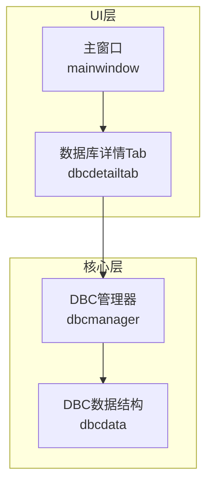
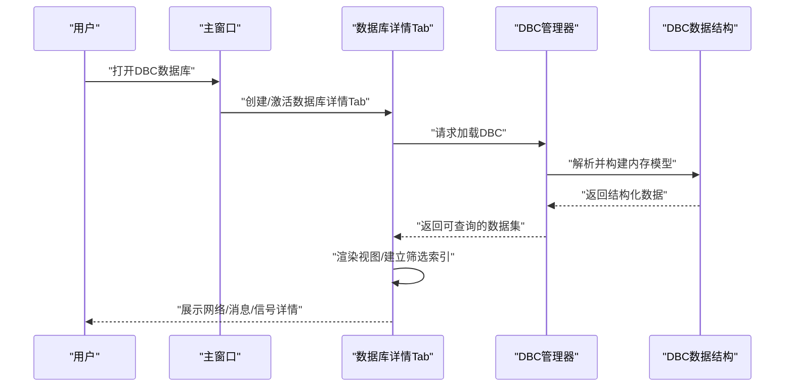
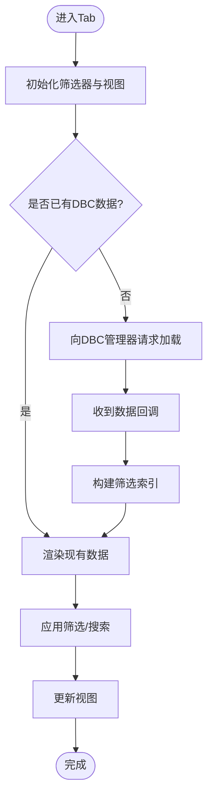
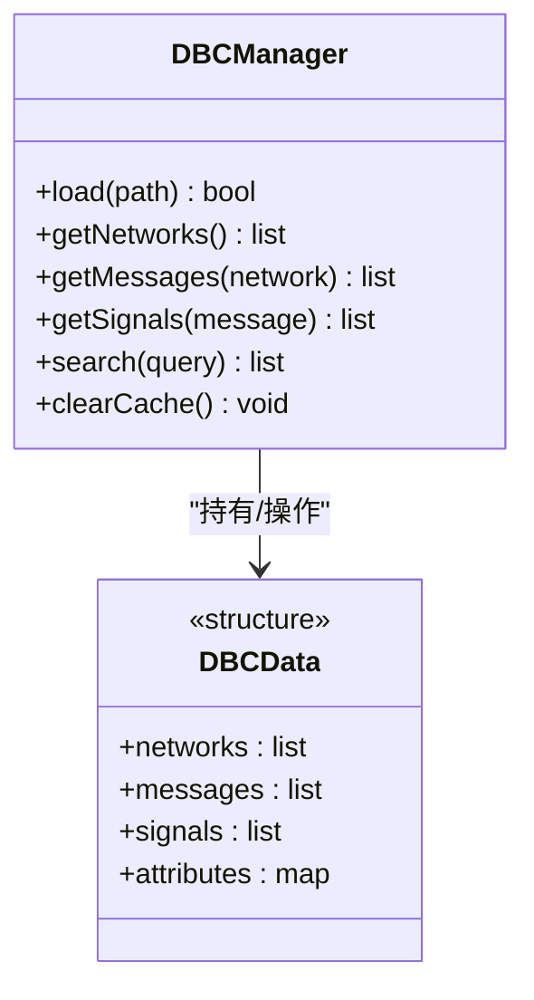

# 数据库详情Tab组件

<cite>
**本文引用的文件**
- [dbcdetailtab.h](file://src/ui/dbcdetailtab.h)
- [dbcdetailtab.cpp](file://src/ui/dbcdetailtab.cpp)
- [dbcmanager.h](file://src/core/dbcmanager.h)
- [dbcmanager.cpp](file://src/core/dbcmanager.cpp)
- [dbcdata.h](file://src/core/dbcdata.h)
- [mainwindow.h](file://src/ui/mainwindow.h)
- [mainwindow.cpp](file://src/ui/mainwindow.cpp)
- [CMakeLists.txt](file://src/CMakeLists.txt)
</cite>

## 目录
1. [简介](#简介)
2. [项目结构](#项目结构)
3. [核心组件](#核心组件)
4. [架构总览](#架构总览)
5. [详细组件分析](#详细组件分析)
6. [依赖关系分析](#依赖关系分析)
7. [性能考虑](#性能考虑)
8. [故障排查指南](#故障排查指南)
9. [结论](#结论)
10. [附录](#附录)

## 简介
本文件围绕“数据库详情Tab组件”展开，聚焦于CAN DBC数据库的加载、解析与展示。该组件以Qt Tab页形式集成在主窗口中，负责：
- 显示DBC数据库中的网络、消息、信号等元数据
- 提供筛选、搜索与快速定位能力
- 与底层DBC管理器交互，获取并缓存解析结果
- 与主窗口进行事件通信，响应数据库切换与刷新

## 项目结构
本项目采用分层组织方式：UI层（Qt界面）、核心逻辑层（DBC解析与管理）、模型与工具模块。数据库详情Tab位于UI层，通过接口与核心层的DBC管理器协作。

图表来源
- [mainwindow.h](file://src/ui/mainwindow.h)
- [dbcdetailtab.h](file://src/ui/dbcdetailtab.h)
- [dbcmanager.h](file://src/core/dbcmanager.h)
- [dbcdata.h](file://src/core/dbcdata.h)

章节来源
- [CMakeLists.txt](file://src/CMakeLists.txt)

## 核心组件
- 数据库详情Tab（UI）
  - 职责：渲染DBC树形/列表视图、提供筛选与搜索、处理用户交互、向DBC管理器请求数据
  - 关键交互：初始化时绑定数据源；监听数据库变更事件；响应筛选条件变化
- DBC管理器（核心）
  - 职责：加载DBC文件、解析为内部数据结构、提供查询接口、维护缓存
  - 关键能力：按网络/消息/信号维度检索、增量更新、错误诊断
- DBC数据结构（核心）
  - 职责：定义网络、消息、信号等实体及其属性，便于UI与业务层共享

章节来源
- [dbcdetailtab.h](file://src/ui/dbcdetailtab.h)
- [dbcdetailtab.cpp](file://src/ui/dbcdetailtab.cpp)
- [dbcmanager.h](file://src/core/dbcmanager.h)
- [dbcmanager.cpp](file://src/core/dbcmanager.cpp)
- [dbcdata.h](file://src/core/dbcdata.h)

## 架构总览
下图展示了从主窗口到数据库详情Tab再到DBC管理器的调用链路与数据流向。

图表来源
- [dbcdetailtab.cpp](file://src/ui/dbcdetailtab.cpp)
- [dbcmanager.cpp](file://src/core/dbcmanager.cpp)
- [dbcdata.h](file://src/core/dbcdata.h)

## 详细组件分析

### 数据库详情Tab（UI）
- 设计要点
  - 作为独立Tab页，生命周期由主窗口管理
  - 使用模型-视图分离思想，将DBC数据映射为可筛选的视图模型
  - 支持多条件筛选（网络、消息名、信号名、ID范围等）
- 关键流程
  - 初始化：注册筛选器、绑定数据源、设置默认视图模式
  - 数据加载：接收主窗口通知后触发加载，避免阻塞UI线程
  - 交互反馈：高亮选中项、同步搜索框与筛选状态
- 典型问题
  - 大数据量下的渲染卡顿：需启用虚拟模型或分页
  - 筛选条件冲突：需对多条件做交集/并集策略

图表来源
- [dbcdetailtab.cpp](file://src/ui/dbcdetailtab.cpp)

章节来源
- [dbcdetailtab.h](file://src/ui/dbcdetailtab.h)
- [dbcdetailtab.cpp](file://src/ui/dbcdetailtab.cpp)

### DBC管理器（核心）
- 设计要点
  - 单例或集中式服务，保证同一进程内DBC解析一致性
  - 提供只读查询接口，避免外部修改破坏内部结构
  - 支持增量更新与缓存失效策略
- 关键能力
  - 文件加载与校验（路径、格式、版本兼容性）
  - 解析为统一的数据结构（网络、消息、信号、属性）
  - 查询API（按名称、ID、属性过滤）
- 错误处理
  - 解析失败时返回明确错误码与上下文信息
  - 记录日志以便定位DBC文件问题

图表来源
- [dbcmanager.h](file://src/core/dbcmanager.h)
- [dbcmanager.cpp](file://src/core/dbcmanager.cpp)
- [dbcdata.h](file://src/core/dbcdata.h)

章节来源
- [dbcmanager.h](file://src/core/dbcmanager.h)
- [dbcmanager.cpp](file://src/core/dbcmanager.cpp)
- [dbcdata.h](file://src/core/dbcdata.h)

### 主窗口集成
- 职责
  - 管理Tab页生命周期与切换
  - 在打开DBC文件后通知数据库详情Tab刷新
  - 传递用户选择与全局配置（如主题、语言）
- 关键点
  - 事件解耦：通过信号槽或事件总线减少耦合
  - 资源释放：关闭Tab时清理DBC引用与缓存

章节来源
- [mainwindow.h](file://src/ui/mainwindow.h)
- [mainwindow.cpp](file://src/ui/mainwindow.cpp)

## 依赖关系分析
- UI层依赖核心层提供的查询接口，不直接访问文件系统
- DBC管理器封装解析细节，对外暴露稳定API
- 主窗口协调UI与核心层，确保状态一致

图表来源
- [dbcdetailtab.h](file://src/ui/dbcdetailtab.h)
- [dbcmanager.h](file://src/core/dbcmanager.h)
- [dbcdata.h](file://src/core/dbcdata.h)

章节来源
- [dbcdetailtab.h](file://src/ui/dbcdetailtab.h)
- [dbcmanager.h](file://src/core/dbcmanager.h)
- [dbcdata.h](file://src/core/dbcdata.h)

## 性能考虑
- 数据量优化
  - 使用虚拟模型按需加载节点，避免一次性构建完整树
  - 对常用查询建立索引（名称、ID、属性）
- 渲染优化
  - 延迟渲染与批量更新，减少重绘次数
  - 大文本字段懒加载
- 并发与线程
  - 解析与I/O放在后台线程，UI保持响应
  - 使用线程安全的队列传递结果

[本节为通用指导，不直接分析具体文件]

## 故障排查指南
- 常见问题
  - DBC文件无法加载：检查路径、权限、文件格式与版本
  - 筛选无结果：确认筛选条件语法与大小写规则
  - 界面卡顿：检查是否未启用虚拟模型或存在重复构建索引
- 定位方法
  - 查看DBC管理器日志输出
  - 打印查询参数与返回条数
  - 逐步禁用筛选条件定位冲突

章节来源
- [dbcmanager.cpp](file://src/core/dbcmanager.cpp)
- [dbcdetailtab.cpp](file://src/ui/dbcdetailtab.cpp)

## 结论
数据库详情Tab组件通过清晰的UI与核心层分离，实现了DBC数据的可靠展示与高效查询。结合合理的索引与异步加载策略，可在大规模DBC场景下保持良好用户体验。建议持续完善错误诊断与性能监控，提升可维护性与稳定性。

[本节为总结性内容，不直接分析具体文件]

## 附录
- 相关构建配置
  - CMakeLists用于声明源文件与依赖库，确保编译链接正确

章节来源
- [CMakeLists.txt](file://src/CMakeLists.txt)