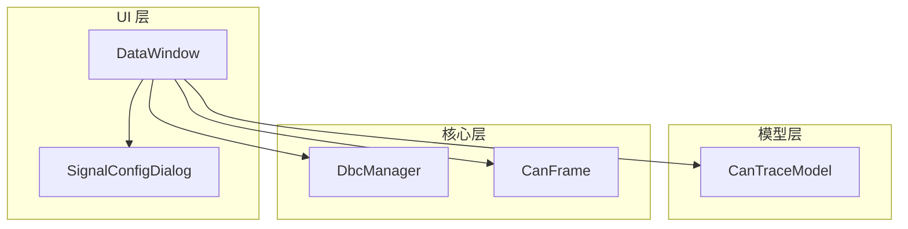
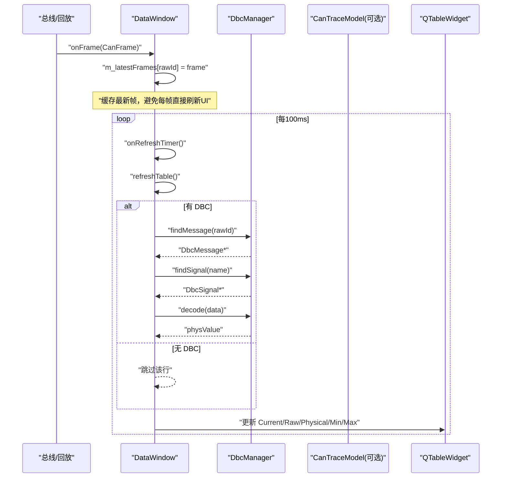
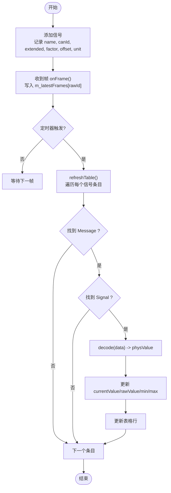
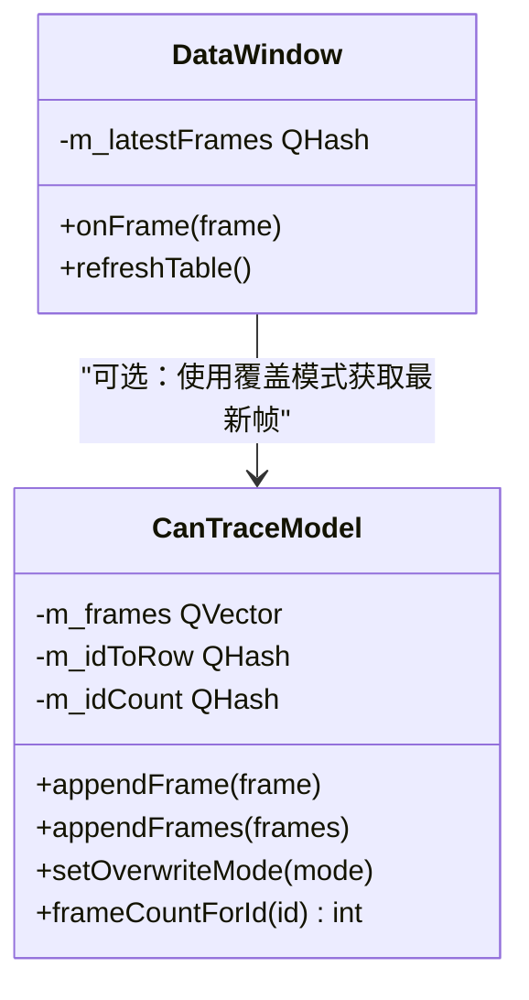
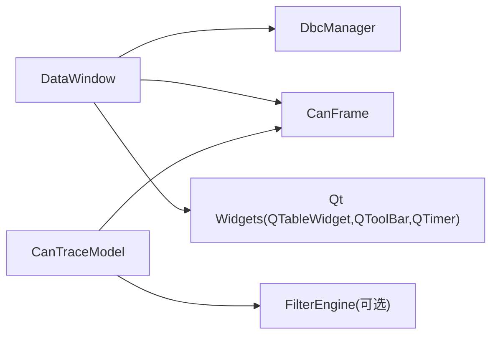

# 数据窗口组件

<cite>
**本文引用的文件**
- [src/ui/datawindow.h](file://src/ui/datawindow.h)
- [src/ui/datawindow.cpp](file://src/ui/datawindow.cpp)
- [src/models/cantracemodel.h](file://src/models/cantracemodel.h)
- [src/models/cantracemodel.cpp](file://src/models/cantracemodel.cpp)
- [src/core/dbcmanager.h](file://src/core/dbcmanager.h)
- [src/core/canframe.h](file://src/core/canframe.h)
- [src/ui/signalconfigdialog.h](file://src/ui/signalconfigdialog.h)
- [README.md](file://README.md)
</cite>

## 目录
1. [简介](#简介)
2. [项目结构](#项目结构)
3. [核心组件](#核心组件)
4. [架构总览](#架构总览)
5. [详细组件分析](#详细组件分析)
6. [依赖关系分析](#依赖关系分析)
7. [性能考量](#性能考量)
8. [故障排查指南](#故障排查指南)
9. [结论](#结论)
10. [附录](#附录)

## 简介
本章节面向“数据窗口（Data Window）”组件，该组件以表格形式实时展示多个信号的当前值、原始值、物理值以及最小/最大值统计，对标 CANoe Data Window。其设计目标是在高频报文场景下保持 UI 流畅，同时提供与 DBC 信号定义一致的解码能力。

## 项目结构
数据窗口位于 UI 层，依赖模型层与核心层：
- UI 层：DataWindow（QWidget + QTableWidget + QToolBar），负责信号列表管理、UI 刷新与用户交互
- 模型层：CanTraceModel（QAbstractTableModel），提供覆盖模式下的最新帧缓存与统计
- 核心层：DbcManager（DBC 解析与查询）、CanFrame（报文数据结构）

图表来源
- [src/ui/datawindow.h:15-74](file://src/ui/datawindow.h#L15-L74)
- [src/models/cantracemodel.h:13-143](file://src/models/cantracemodel.h#L13-L143)
- [src/core/dbcmanager.h:9-70](file://src/core/dbcmanager.h#L9-L70)
- [src/core/canframe.h:8-120](file://src/core/canframe.h#L8-L120)

章节来源
- [README.md:152-180](file://README.md#L152-L180)

## 核心组件
- DataWindow：实现信号添加/删除/清空、定时器轮询刷新、DBC 解码、最小/最大值统计、表格更新
- CanTraceModel：提供覆盖模式（同 ID 仅保留最新一行）与帧计数等能力，便于 DataWindow 获取最新帧
- DbcManager：按 CAN ID 查找 Message，再按信号名查找 Signal 并解码为物理值
- CanFrame：统一的数据载体，包含时间戳、ID、扩展位、FD 标志、DLC、数据等

章节来源
- [src/ui/datawindow.h:15-74](file://src/ui/datawindow.h#L15-L74)
- [src/ui/datawindow.cpp:16-206](file://src/ui/datawindow.cpp#L16-L206)
- [src/models/cantracemodel.h:13-143](file://src/models/cantracemodel.h#L13-L143)
- [src/core/dbcmanager.h:9-70](file://src/core/dbcmanager.h#L9-L70)
- [src/core/canframe.h:8-120](file://src/core/canframe.h#L8-L120)

## 架构总览
数据窗口的数据流如下：
- 外部总线或回放系统产生 CanFrame，进入 DataWindow.onFrame()，写入 m_latestFrames 缓存
- 定时刷新（100ms）触发 onRefreshTimer() → refreshTable()
- refreshTable() 遍历已添加的信号条目，通过 DbcManager 解码物理值，计算原始值、最小/最大值，并更新表格行
- 支持通过 SignalConfigDialog 添加信号，或通过工具栏按钮移除/清空

图表来源
- [src/ui/datawindow.cpp:119-184](file://src/ui/datawindow.cpp#L119-L184)
- [src/core/dbcmanager.h:32-56](file://src/core/dbcmanager.h#L32-L56)
- [src/core/canframe.h:14-45](file://src/core/canframe.h#L14-L45)

## 详细组件分析

### DataWindow 类
职责与行为
- 维护信号条目列表（名称、CAN ID、扩展位、因子、偏移、单位、运行时统计）
- 使用 QTableWidget 显示列：Signal、Current、Raw、Physical、Min、Max
- 工具栏提供添加、删除选中、清空全部操作
- 100ms 定时器轮询刷新，避免高频 UI 卡顿
- 通过 DbcManager 解码物理值，并计算原始值、最小/最大值

关键流程
- 添加信号：addSignal() 插入表格行并初始化占位符
- 接收帧：onFrame() 将最新帧按 rawId 缓存
- 刷新：refreshTable() 遍历条目，解码物理值，更新统计与表格单元格
- 交互：onAddSignal()/onRemoveSignal()/onClearAll() 对应工具栏事件

图表来源
- [src/ui/datawindow.cpp:71-184](file://src/ui/datawindow.cpp#L71-L184)

章节来源
- [src/ui/datawindow.h:15-74](file://src/ui/datawindow.h#L15-L74)
- [src/ui/datawindow.cpp:16-206](file://src/ui/datawindow.cpp#L16-L206)

### CanTraceModel（覆盖模式与统计）
作用
- 提供 appendFrame/appendFrames 追加帧的能力
- 覆盖模式下，同一 CAN ID 只保留一行，刷新数据与帧计数
- 维护每个 CAN ID 的累计帧数，便于统计与展示

与 DataWindow 的关系
- DataWindow 可通过覆盖模式快速获得每个 ID 的最新帧，减少内存占用与刷新开销
- 若未启用覆盖模式，DataWindow 仍可使用自身 m_latestFrames 缓存

图表来源
- [src/models/cantracemodel.h:13-143](file://src/models/cantracemodel.h#L13-L143)
- [src/models/cantracemodel.cpp:126-187](file://src/models/cantracemodel.cpp#L126-L187)
- [src/ui/datawindow.h:62-70](file://src/ui/datawindow.h#L62-L70)

章节来源
- [src/models/cantracemodel.h:13-143](file://src/models/cantracemodel.h#L13-L143)
- [src/models/cantracemodel.cpp:126-187](file://src/models/cantracemodel.cpp#L126-L187)

### DbcManager（信号解码）
作用
- 加载/卸载 DBC 文件，维护 CAN ID → Message 索引
- 根据 CAN ID 查找 Message，再按信号名查找 Signal 并解码物理值
- 提供批量 decodeFrame 与单信号 decodeSignal

与 DataWindow 的关系
- DataWindow 在 refreshTable() 中调用 findMessage/findSignal/decode 完成物理值计算
- 若无 DBC，则跳过该行，避免空指针或无效解码

章节来源
- [src/core/dbcmanager.h:9-70](file://src/core/dbcmanager.h#L9-L70)
- [src/ui/datawindow.cpp:141-158](file://src/ui/datawindow.cpp#L141-L158)

### CanFrame（数据载体）
作用
- 统一表示经典 CAN 与 CAN FD 帧，包含时间戳、ID、扩展位、FD 标志、DLC、数据、通道、方向等
- 提供 DLC 转换、错误帧判断、序列化/反序列化

与 DataWindow 的关系
- DataWindow.onFrame() 接收 CanFrame 并缓存；refreshTable() 读取 data 字段进行解码

章节来源
- [src/core/canframe.h:8-120](file://src/core/canframe.h#L8-L120)
- [src/ui/datawindow.cpp:119-123](file://src/ui/datawindow.cpp#L119-L123)

### SignalConfigDialog（信号配置）
作用
- 提供信号名称、CAN ID、扩展帧选项、字节偏移、位长、字节序等输入控件
- DataWindow 通过该对话框添加新信号

章节来源
- [src/ui/signalconfigdialog.h:11-43](file://src/ui/signalconfigdialog.h#L11-L43)
- [src/ui/datawindow.cpp:186-193](file://src/ui/datawindow.cpp#L186-L193)

## 依赖关系分析
- DataWindow 依赖：
  - DbcManager：用于信号解码
  - CanFrame：作为数据载体
  - QTableWidget/QToolBar：UI 渲染与交互
  - QTimer：定时刷新策略
- CanTraceModel 依赖：
  - CanFrame：存储帧序列
  - FilterEngine（着色规则）：非必需，但可用于 TraceView 的行着色
- DbcManager 依赖：
  - DbcData：内部数据结构（消息/信号定义）

图表来源
- [src/ui/datawindow.h:62-70](file://src/ui/datawindow.h#L62-L70)
- [src/models/cantracemodel.h:13-143](file://src/models/cantracemodel.h#L13-L143)
- [src/core/dbcmanager.h:9-70](file://src/core/dbcmanager.h#L9-L70)
- [src/core/canframe.h:8-120](file://src/core/canframe.h#L8-L120)

章节来源
- [src/ui/datawindow.h:62-70](file://src/ui/datawindow.h#L62-L70)
- [src/models/cantracemodel.h:13-143](file://src/models/cantracemodel.h#L13-L143)
- [src/core/dbcmanager.h:9-70](file://src/core/dbcmanager.h#L9-L70)
- [src/core/canframe.h:8-120](file://src/core/canframe.h#L8-L120)

## 性能考量
- 刷新频率控制：使用 100ms 定时器轮询，避免每帧触发 UI 更新导致卡顿
- 数据缓存：m_latestFrames 按 rawId 缓存最新帧，减少重复解码与查找
- 覆盖模式：在 CanTraceModel 中启用覆盖模式可显著降低内存占用，适合高频报文场景
- 解码优化：仅在存在 DBC 且找到对应 Message/Signal 时执行 decode，否则跳过该行
- 表格更新：逐行更新单元格文本，避免整表重绘

## 故障排查指南
常见问题与处理建议
- 无 DBC 文件：refreshTable() 会跳过该行，需确保已加载 DBC 并正确设置 DbcManager
- 信号不存在：当 Message 存在但 Signal 未找到时，跳过该行；检查信号名是否匹配
- 高频报文导致 UI 卡顿：确认定时器间隔合理（默认 100ms），必要时增大间隔或启用覆盖模式
- 原始值异常：检查 factor/offset 配置是否正确；原始值由物理值反算得到
- 最小/最大值不更新：确认 hasValue 初始状态与首次赋值逻辑；确保物理值有效范围

章节来源
- [src/ui/datawindow.cpp:141-184](file://src/ui/datawindow.cpp#L141-L184)
- [src/ui/datawindow.cpp:108-117](file://src/ui/datawindow.cpp#L108-L117)

## 结论
数据窗口组件通过定时器轮询与 DBC 解码，实现了信号级实时表格展示，具备当前值、原始值、物理值与最小/最大值统计能力。结合 CanTraceModel 的覆盖模式，可在高频报文场景下保持良好性能。未来可扩展预定义过滤集、书签持久化、着色规则编辑器等功能，进一步提升用户体验。

## 附录
- 参考规划：Data Window 的目标与实现方案详见 README 中的方案 1
- 集成点：DataWindow 可作为独立标签页或 Dock 面板嵌入主界面

章节来源
- [README.md:152-180](file://README.md#L152-L180)