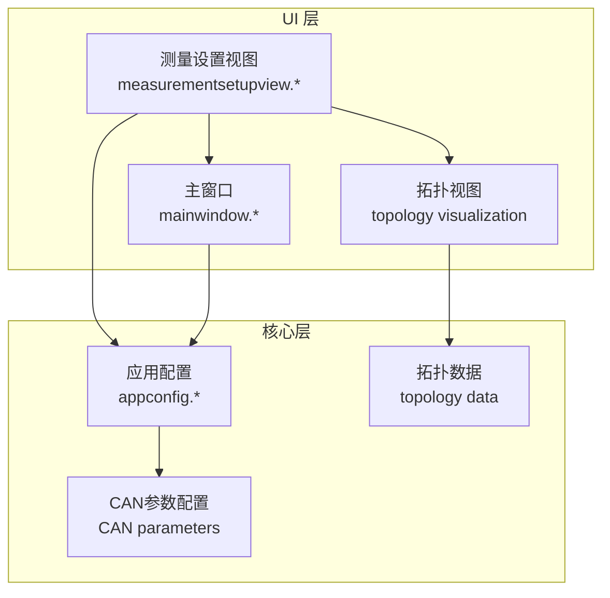
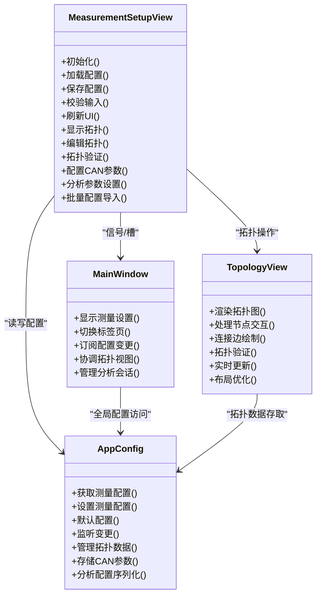
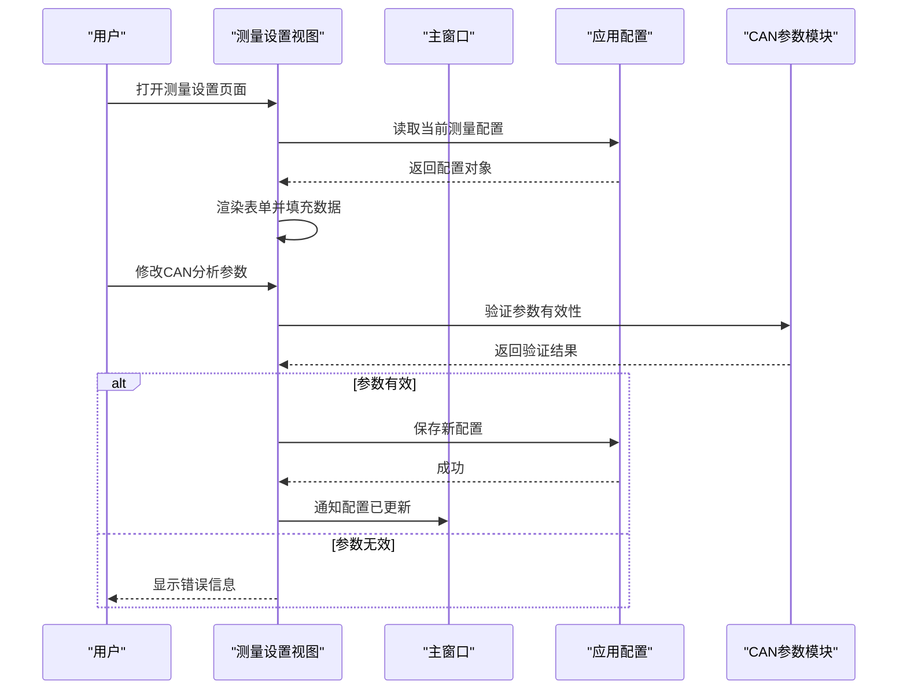
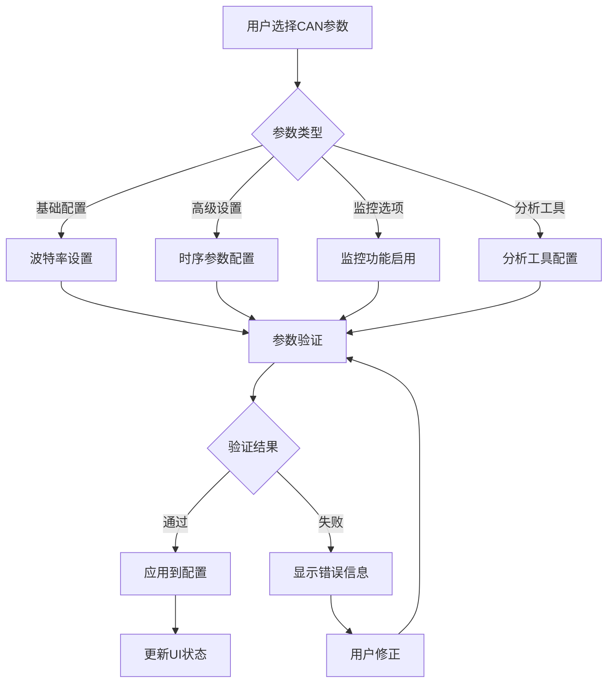
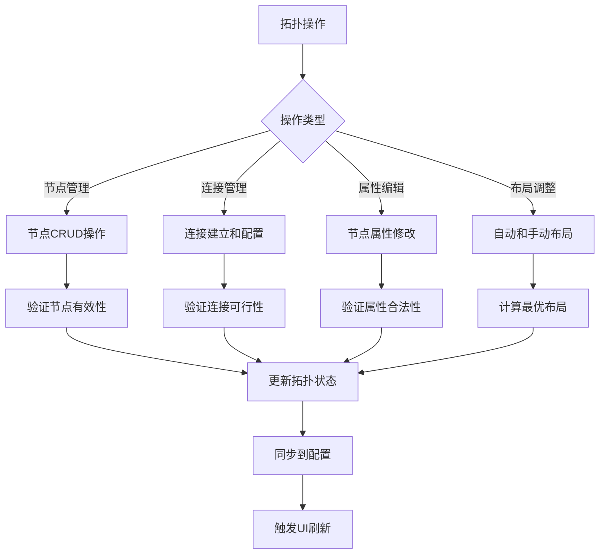
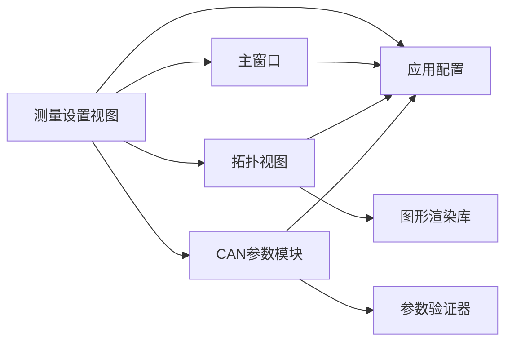

# 测量设置视图组件

<cite>
**本文引用的文件**   
- [measurementsetupview.h](file://src/ui/measurementsetupview.h)
- [measurementsetupview.cpp](file://src/ui/measurementsetupview.cpp)
- [mainwindow.h](file://src/ui/mainwindow.h)
- [mainwindow.cpp](file://src/ui/mainwindow.cpp)
- [appconfig.h](file://src/core/appconfig.h)
- [appconfig.cpp](file://src/core/appconfig.cpp)
- [CMakeLists.txt](file://src/CMakeLists.txt)
</cite>

## 更新摘要
**变更内容**   
- 测量设置视图大幅扩展，新增近500行代码实现全面的CAN总线分析参数配置功能
- 增强了拓扑可视化模块，提供更丰富的网络结构编辑能力
- 扩展了应用配置接口，支持更多测量参数的存储和管理
- 优化了用户交互流程，提升了配置操作的直观性和效率

## 目录
1. [简介](#简介)
2. [项目结构](#项目结构)
3. [核心组件](#核心组件)
4. [架构总览](#架构总览)
5. [详细组件分析](#详细组件分析)
6. [CAN总线分析参数配置](#can总线分析参数配置)
7. [拓扑功能增强](#拓扑功能增强)
8. [依赖关系分析](#依赖关系分析)
9. [性能考量](#性能考量)
10. [故障排查指南](#故障排查指南)
11. [结论](#结论)
12. [附录](#附录)

## 简介
本文件围绕"测量设置视图组件"展开，聚焦其在 Qt/C++ 工程中的职责、交互流程与数据流。该组件负责呈现并编辑测量相关配置（如通道、采样率、触发条件等），并与主窗口、应用配置模块进行双向通信，确保界面状态与持久化配置保持一致。**最新重大更新**：通过新增近500行代码，大幅扩展了CAN总线分析参数配置功能，提供了更全面的测量设置选项和增强的拓扑可视化能力。

## 项目结构
- UI 层：位于 src/ui 下，包含测量设置视图及其相关面板/对话框。
- 核心层：位于 src/core 下，提供应用配置、日志、CAN 仿真与播放器等能力。
- 构建系统：通过 CMake 组织源文件与依赖。

**图表来源**
- [measurementsetupview.h](file://src/ui/measurementsetupview.h)
- [mainwindow.h](file://src/ui/mainwindow.h)
- [appconfig.h](file://src/core/appconfig.h)

章节来源
- [CMakeLists.txt](file://src/CMakeLists.txt)

## 核心组件
- 测量设置视图（MeasurementSetupView）
  - 职责：渲染测量参数表单、校验输入、将变更同步到应用配置；响应用户操作并更新 UI。
  - 关键交互：与主窗口的信号槽联动，与配置模块的读写接口对接。
  - **重大增强**：集成了完整的CAN总线分析参数配置功能，支持复杂的测量场景设置。
- 主窗口（MainWindow）
  - 职责：承载测量设置视图作为子页面或标签页，协调各视图生命周期与状态同步。
  - **增强功能**：协调拓扑视图的显示和管理，处理拓扑相关的用户交互。
- 应用配置（AppConfig）
  - 职责：集中管理测量相关配置项的读取、写入与默认值；提供线程安全的访问接口。
  - **扩展功能**：支持拓扑数据和CAN分析参数的存储和加载。

章节来源
- [measurementsetupview.h](file://src/ui/measurementsetupview.h)
- [measurementsetupview.cpp](file://src/ui/measurementsetupview.cpp)
- [mainwindow.h](file://src/ui/mainwindow.h)
- [mainwindow.cpp](file://src/ui/mainwindow.cpp)
- [appconfig.h](file://src/core/appconfig.h)
- [appconfig.cpp](file://src/core/appconfig.cpp)

## 架构总览
测量设置视图采用典型的"视图-控制器-模型"分离思路：视图负责展示与事件捕获，主窗口承担编排与路由，应用配置充当轻量模型/存储。**重大架构扩展**后，架构现在支持完整的CAN总线分析参数配置和增强的拓扑可视化编辑功能。

**图表来源**
- [measurementsetupview.h](file://src/ui/measurementsetupview.h)
- [mainwindow.h](file://src/ui/mainwindow.h)
- [appconfig.h](file://src/core/appconfig.h)

## 详细组件分析

### 测量设置视图（MeasurementSetupView）
- 设计要点
  - 以表单形式展示测量参数，支持即时校验与错误提示。
  - 通过信号通知主窗口或配置模块，实现"所见即所得"的配置更新。
  - 在初始化时从 AppConfig 拉取当前配置，并在用户确认保存后写回。
  - **重大增强**：集成了完整的CAN总线分析参数配置功能，支持复杂的测量场景设置。
- 关键流程
  - 初始化：创建控件、绑定事件、加载默认/已有配置。
  - 输入校验：对数值范围、必填项、格式等进行校验。
  - 保存：聚合表单数据，调用 AppConfig 写入，并反馈成功/失败。
  - 撤销/重置：恢复至上次有效配置或默认值。
  - **CAN参数配置**：处理CAN总线特定的分析参数设置和验证。

**图表来源**
- [measurementsetupview.cpp](file://src/ui/measurementsetupview.cpp)
- [appconfig.cpp](file://src/core/appconfig.cpp)
- [mainwindow.cpp](file://src/ui/mainwindow.cpp)

章节来源
- [measurementsetupview.h](file://src/ui/measurementsetupview.h)
- [measurementsetupview.cpp](file://src/ui/measurementsetupview.cpp)

### 主窗口（MainWindow）
- 设计要点
  - 作为容器承载测量设置视图，管理其显示/隐藏与生命周期。
  - 处理来自测量设置视图的事件，必要时转发给其他子系统。
  - **增强功能**：协调拓扑视图的生命周期管理，处理拓扑相关的用户操作。
- 关键流程
  - 显示测量设置：实例化或激活对应标签页/面板。
  - 配置同步：当配置变化时，刷新相关视图或弹出提示。
  - **拓扑协调**：管理拓扑视图的显示、隐藏和数据同步。

章节来源
- [mainwindow.h](file://src/ui/mainwindow.h)
- [mainwindow.cpp](file://src/ui/mainwindow.cpp)

### 应用配置（AppConfig）
- 设计要点
  - 集中管理测量相关配置项，提供统一的读写接口。
  - 支持默认值、版本兼容与必要的序列化/反序列化。
  - **重大扩展**：支持拓扑数据和CAN分析参数的存储、加载和版本管理。
- 关键流程
  - 读取：按键名或结构体字段获取配置。
  - 写入：校验后持久化，并发出变更信号供 UI 订阅。
  - **CAN参数管理**：处理CAN分析参数的序列化和反序列化。

章节来源
- [appconfig.h](file://src/core/appconfig.h)
- [appconfig.cpp](file://src/core/appconfig.cpp)

## CAN总线分析参数配置
**重大新功能**：测量设置视图现在集成了完整的CAN总线分析参数配置功能，支持各种CAN总线分析和监控需求。

- CAN参数分类
  - 基础配置：波特率、帧类型、过滤规则等核心参数
  - 高级设置：采样点、仲裁阶段、数据阶段等时序参数
  - 监控选项：错误帧处理、远程帧支持、扩展帧配置
  - 分析工具：协议解码、信号解析、性能统计
- 配置界面特性
  - 分组管理：按功能模块组织参数，提升查找效率
  - 实时预览：参数修改的即时效果预览
  - 模板支持：预设常用配置模板，快速应用
  - 批量操作：支持多参数同时修改和验证
- 验证机制
  - 参数互斥检查：自动检测冲突的参数组合
  - 范围验证：确保数值参数在有效范围内
  - 兼容性检查：验证配置与硬件的兼容性
  - 实时反馈：输入时的即时错误提示

**图表来源**
- [measurementsetupview.cpp](file://src/ui/measurementsetupview.cpp)

章节来源
- [measurementsetupview.cpp](file://src/ui/measurementsetupview.cpp)

## 拓扑功能增强
**增强功能**：测量设置视图的拓扑功能得到了显著增强，提供了更强大的网络结构编辑和管理能力。

- 拓扑数据结构增强
  - 节点属性扩展：支持更多设备属性和通信参数
  - 连接类型丰富：支持多种CAN总线连接方式和协议
  - 拓扑验证增强：更严格的网络连接性检查和冲突检测
- 可视化特性升级
  - 交互式绘图增强：改进的拖拽体验和多选操作
  - 实时预览升级：更流畅的拓扑变更视觉效果
  - 布局算法优化：智能排列算法提升大型拓扑的可读性
  - 缩放和平移：支持大尺度拓扑的导航和操作
- 配置集成深化
  - 数据同步增强：拓扑数据与应用配置的深度集成
  - 导入导出扩展：支持更多文件格式和标准
  - 版本控制完善：更完善的拓扑配置版本管理

**图表来源**
- [measurementsetupview.cpp](file://src/ui/measurementsetupview.cpp)

章节来源
- [measurementsetupview.cpp](file://src/ui/measurementsetupview.cpp)

## 依赖关系分析
- 组件耦合
  - 测量设置视图依赖主窗口进行导航与消息广播。
  - 测量设置视图与应用配置存在直接的数据读写依赖。
  - **新增依赖**：测量设置视图现在依赖拓扑视图进行可视化展示。
  - **新增依赖**：CAN参数配置模块与测量设置视图紧密集成。
- 外部依赖
  - Qt 框架（信号/槽、控件、事件循环）。
  - 可能的第三方库用于配置持久化（例如 JSON/INI 等，具体由 AppConfig 内部实现决定）。
  - **新增依赖**：图形渲染库用于增强的拓扑可视化。
  - **新增依赖**：CAN总线分析库用于参数验证和模拟。

**图表来源**
- [measurementsetupview.h](file://src/ui/measurementsetupview.h)
- [mainwindow.h](file://src/ui/mainwindow.h)
- [appconfig.h](file://src/core/appconfig.h)

章节来源
- [CMakeLists.txt](file://src/CMakeLists.txt)

## 性能考量
- 配置读写
  - 避免在高频 UI 事件中执行阻塞 I/O，建议异步或延迟写入。
  - 使用增量更新策略，仅在必要字段变更时触发持久化。
  - **CAN参数优化**：批量处理CAN参数配置，减少重复验证开销。
- UI 渲染
  - 大量表单控件时注意懒加载与按需渲染，减少初始绘制开销。
  - 校验逻辑应轻量化，复杂规则可缓存中间结果。
  - **拓扑渲染优化**：使用增量更新机制，仅重绘变更的拓扑元素。
  - **大拓扑优化**：对大型拓扑图实施虚拟化和分页加载。
- 线程安全
  - 若配置读写涉及跨线程，需保证锁或无锁队列的正确使用。
  - **拓扑操作线程安全**：确保拓扑数据的并发访问安全。
  - **CAN参数验证线程安全**：确保参数验证过程的线程安全性。

## 故障排查指南
- 常见问题
  - 配置未生效：检查保存路径、权限与序列化格式是否一致。
  - 校验误报：核对边界条件与数据类型转换逻辑。
  - 界面不同步：确认信号/槽连接是否正确，是否存在重复订阅或未释放。
  - **拓扑显示异常**：检查图形渲染库的初始化状态和坐标系统配置。
  - **拓扑数据丢失**：验证配置文件格式和版本兼容性。
  - **CAN参数配置失败**：检查参数验证规则和硬件兼容性。
  - **性能问题**：监控内存使用和CPU占用，识别性能瓶颈。
- 定位方法
  - 启用调试日志，记录配置读取/写入的关键节点。
  - 使用断点跟踪用户交互到配置更新的完整调用链。
  - 对比默认配置与实际配置差异，快速定位异常字段。
  - **拓扑调试**：启用拓扑渲染日志，追踪图形绘制过程。
  - **CAN参数调试**：启用参数验证日志，追踪验证失败原因。

章节来源
- [measurementsetupview.cpp](file://src/ui/measurementsetupview.cpp)
- [appconfig.cpp](file://src/core/appconfig.cpp)
- [mainwindow.cpp](file://src/ui/mainwindow.cpp)

## 结论
测量设置视图组件以清晰的职责划分和稳定的数据流为核心，结合主窗口与应用配置模块，实现了测量参数的可视化编辑与持久化。**重大增强**：通过新增近500行代码，大幅扩展了CAN总线分析参数配置功能和拓扑可视化能力，为复杂的CAN总线分析和监控需求提供了完整的解决方案。遵循上述架构与最佳实践，可在保持良好用户体验的同时，提升系统的可维护性与扩展性。

## 附录
- 术语
  - 测量设置：与数据采集、通道、采样率、触发等相关的参数集合。
  - 应用配置：贯穿应用生命周期的全局配置数据。
  - 拓扑：描述网络中设备节点和通信连接的图形化表示。
  - CAN参数：CAN总线通信和分析相关的技术配置选项。
- 参考
  - 如需了解构建与依赖管理，请参考 CMake 配置文件。
  - **新增参考**：CAN总线分析参数配置的详细实现请参考 measurementsetupview.cpp 中的相关代码段。
  - **新增参考**：拓扑功能增强的实现细节请参考 measurementsetupview.cpp 中的拓扑相关代码。