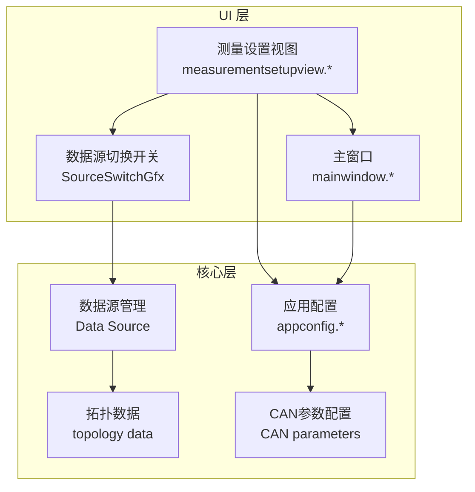
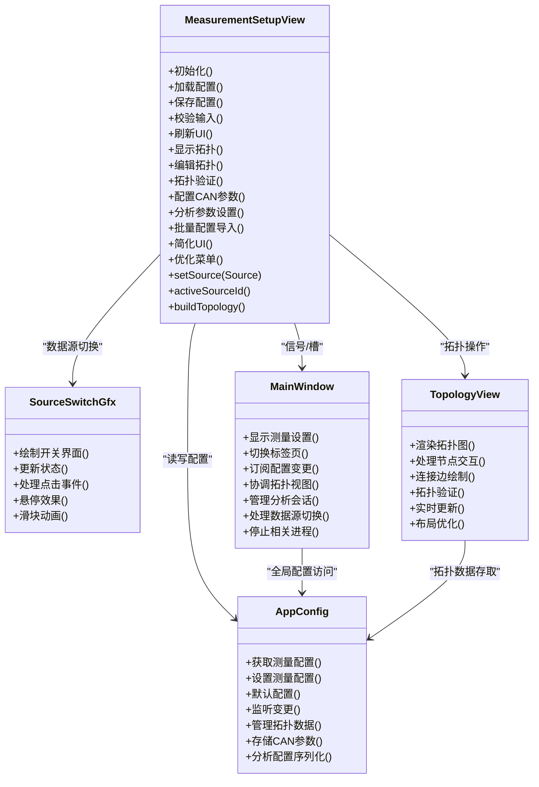
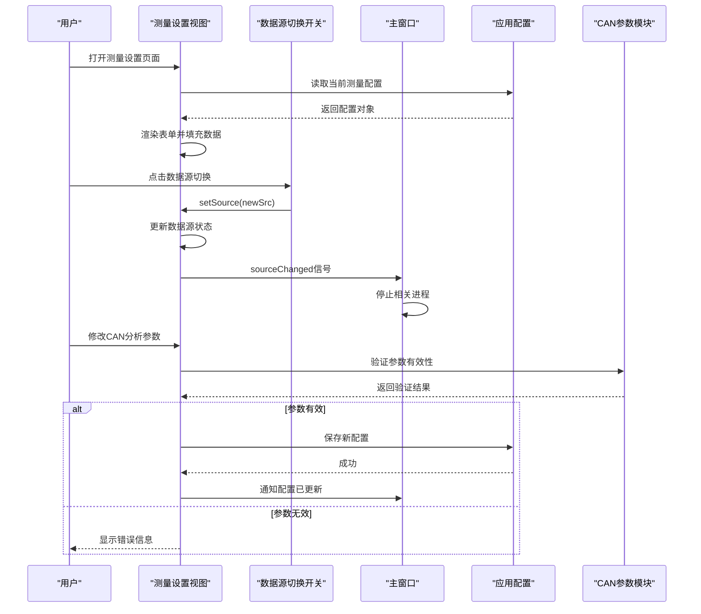
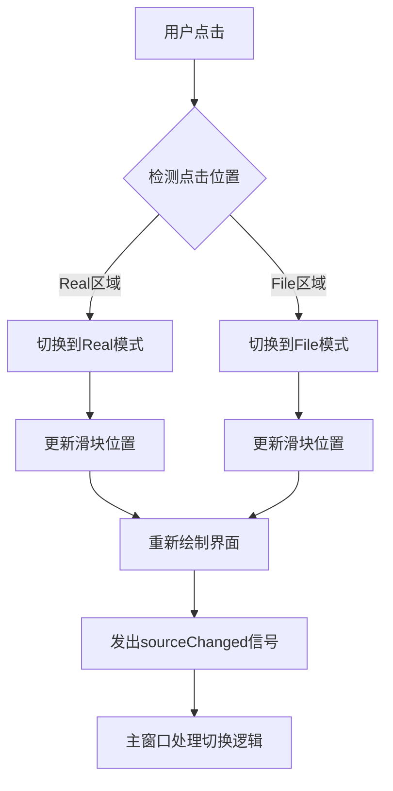
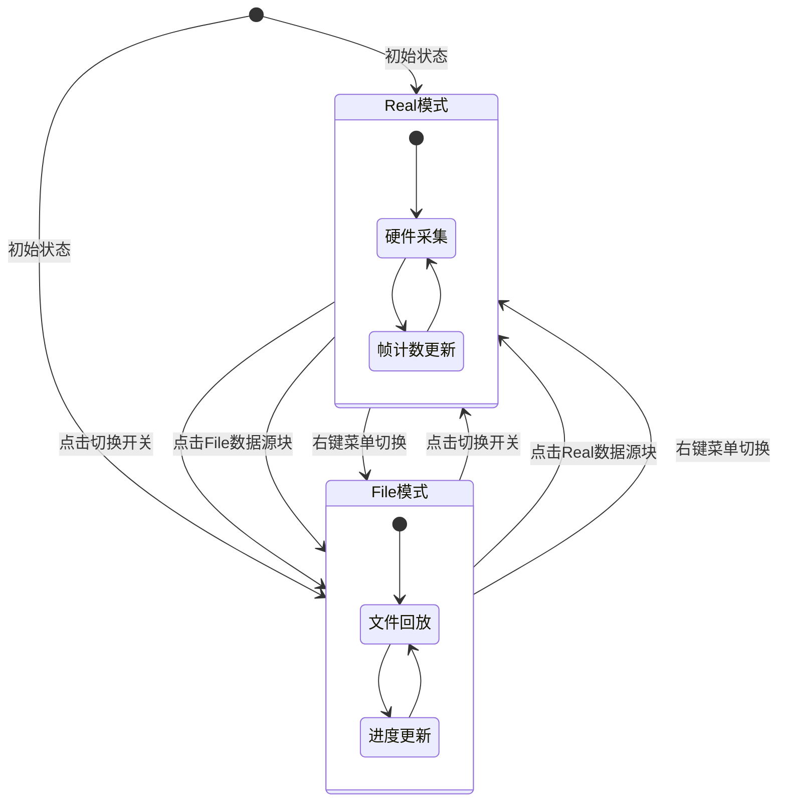
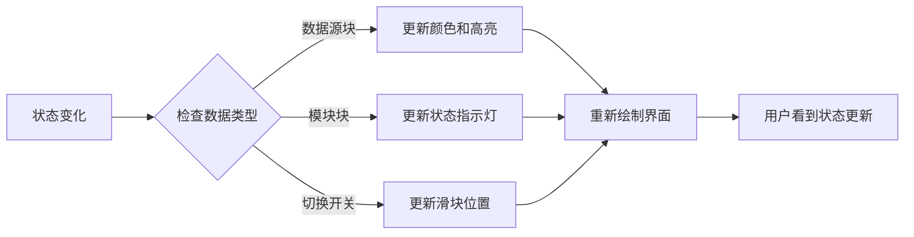
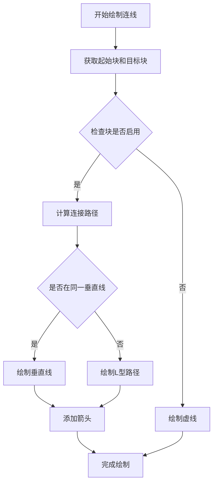
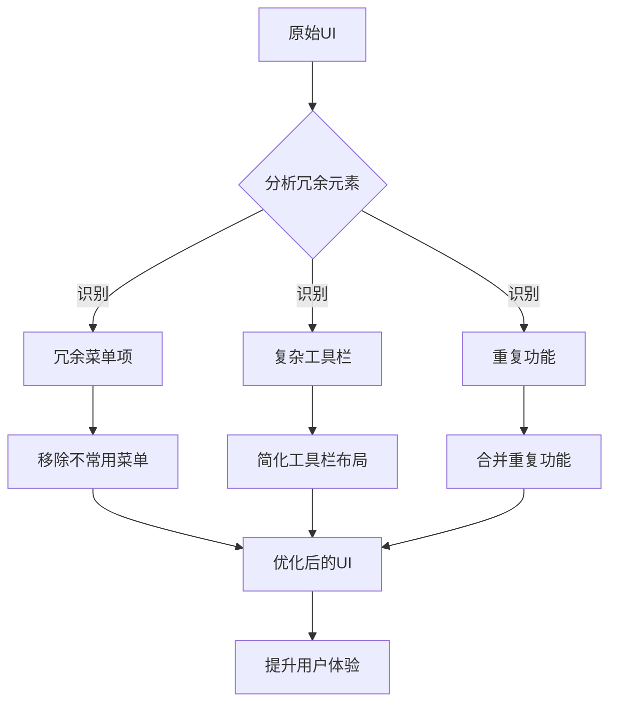
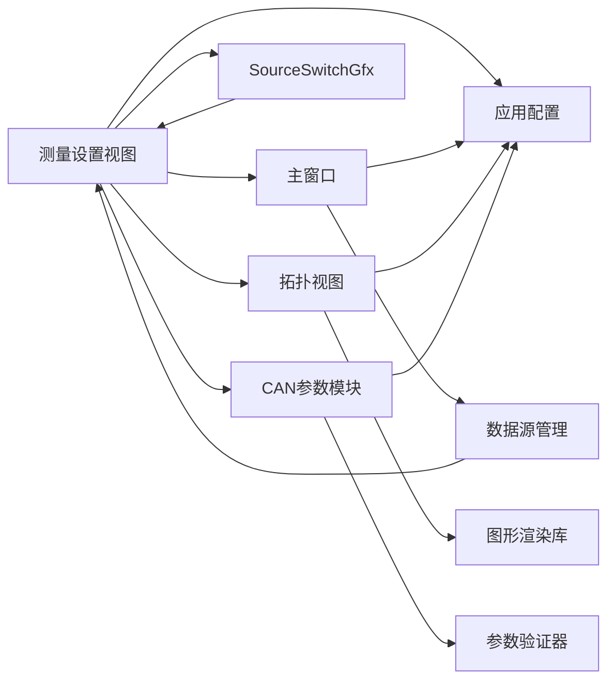

# 测量设置视图组件

<cite>
**本文引用的文件**   
- [measurementsetupview.h](file://src/ui/measurementsetupview.h)
- [measurementsetupview.cpp](file://src/ui/measurementsetupview.cpp)
- [mainwindow.h](file://src/ui/mainwindow.h)
- [mainwindow.cpp](file://src/ui/mainwindow.cpp)
- [appconfig.h](file://src/core/appconfig.h)
- [appconfig.cpp](file://src/core/appconfig.cpp)
- [CMakeLists.txt](file://src/CMakeLists.txt)
</cite>

## 更新摘要
**变更内容**   
- **数据源切换增强**：新增Real/File双数据源可视化切换功能，支持实时硬件采集与文件回放模式
- **可视化状态指示**：实现SourceSwitchGfx自定义图元，提供直观的数据源切换界面
- **动态连接管理**：根据当前活跃数据源自动更新拓扑连线关系
- **交互优化**：支持点击切换、右键菜单切换、双击配置等多种操作方式
- **UI界面简化**：移除了冗余的菜单项和复杂的工具栏控件，优化了用户界面布局

## 目录
1. [简介](#简介)
2. [项目结构](#项目结构)
3. [核心组件](#核心组件)
4. [架构总览](#架构总览)
5. [详细组件分析](#详细组件分析)
6. [数据源切换功能](#数据源切换功能)
7. [可视化状态指示](#可视化状态指示)
8. [动态连接管理](#动态连接管理)
9. [UI界面简化与优化](#ui界面简化与优化)
10. [依赖关系分析](#依赖关系分析)
11. [性能考量](#性能考量)
12. [故障排查指南](#故障排查指南)
13. [结论](#结论)
14. [附录](#附录)

## 简介
本文件围绕"测量设置视图组件"展开，聚焦其在 Qt/C++ 工程中的职责、交互流程与数据流。该组件负责呈现并编辑测量相关配置（如通道、采样率、触发条件等），并与主窗口、应用配置模块进行双向通信，确保界面状态与持久化配置保持一致。**最新重大更新**：通过数据源切换功能的增强，大幅提升了用户体验和操作效率，新增了Real/File双数据源的可视化切换能力，使测量配置过程更加直观和高效。

## 项目结构
- UI 层：位于 src/ui 下，包含测量设置视图及其相关面板/对话框。
- 核心层：位于 src/core 下，提供应用配置、日志、CAN 仿真与播放器等能力。
- 构建系统：通过 CMake 组织源文件与依赖。

**图表来源**
- [measurementsetupview.h](file://src/ui/measurementsetupview.h)
- [mainwindow.h](file://src/ui/mainwindow.h)
- [appconfig.h](file://src/core/appconfig.h)

章节来源
- [CMakeLists.txt](file://src/CMakeLists.txt)

## 核心组件
- 测量设置视图（MeasurementSetupView）
  - 职责：渲染测量参数表单、校验输入、将变更同步到应用配置；响应用户操作并更新 UI。
  - 关键交互：与主窗口的信号槽联动，与配置模块的读写接口对接。
  - **重大增强**：集成了完整的CAN总线分析参数配置功能，支持复杂的测量场景设置。
  - **数据源切换**：新增Real/File双数据源可视化切换功能，支持实时硬件采集与文件回放模式。
  - **UI优化**：简化了工具栏和菜单结构，移除了冗余的操作按钮。
- 数据源切换开关（SourceSwitchGfx）
  - 职责：提供可视化的数据源切换界面，支持Real和File模式的直观切换。
  - 特性：圆角矩形设计、滑块动画、颜色编码状态指示。
  - 交互：支持点击切换、悬停效果、实时更新。
- 主窗口（MainWindow）
  - 职责：承载测量设置视图作为子页面或标签页，协调各视图生命周期与状态同步。
  - **增强功能**：协调拓扑视图的显示和管理，处理拓扑相关的用户交互。
  - **数据源管理**：响应数据源切换事件，停止相应的数据采集或回放进程。
- 应用配置（AppConfig）
  - 职责：集中管理测量相关配置项的读取、写入与默认值；提供线程安全的访问接口。
  - **扩展功能**：支持拓扑数据和CAN分析参数的存储和加载。

章节来源
- [measurementsetupview.h](file://src/ui/measurementsetupview.h)
- [measurementsetupview.cpp](file://src/ui/measurementsetupview.cpp)
- [mainwindow.h](file://src/ui/mainwindow.h)
- [mainwindow.cpp](file://src/ui/mainwindow.cpp)
- [appconfig.h](file://src/core/appconfig.h)
- [appconfig.cpp](file://src/core/appconfig.cpp)

## 架构总览
测量设置视图采用典型的"视图-控制器-模型"分离思路：视图负责展示与事件捕获，主窗口承担编排与路由，应用配置充当轻量模型/存储。**重大架构扩展**后，架构现在支持完整的数据源切换功能和增强的拓扑可视化编辑能力。

**图表来源**
- [measurementsetupview.h](file://src/ui/measurementsetupview.h)
- [mainwindow.h](file://src/ui/mainwindow.h)
- [appconfig.h](file://src/core/appconfig.h)

## 详细组件分析

### 测量设置视图（MeasurementSetupView）
- 设计要点
  - 以表单形式展示测量参数，支持即时校验与错误提示。
  - 通过信号通知主窗口或配置模块，实现"所见即所得"的配置更新。
  - 在初始化时从 AppConfig 拉取当前配置，并在用户确认保存后写回。
  - **重大增强**：集成了完整的CAN总线分析参数配置功能，支持复杂的测量场景设置。
  - **数据源切换**：新增Real/File双数据源可视化切换功能，支持多种切换方式。
  - **UI简化**：移除了冗余的工具栏按钮和菜单项，优化了界面布局。
- 关键流程
  - 初始化：创建控件、绑定事件、加载默认/已有配置。
  - 输入校验：对数值范围、必填项、格式等进行校验。
  - 保存：聚合表单数据，调用 AppConfig 写入，并反馈成功/失败。
  - 撤销/重置：恢复至上次有效配置或默认值。
  - **CAN参数配置**：处理CAN总线特定的分析参数设置和验证。
  - **数据源切换**：处理Real/File模式切换，更新拓扑连线和状态指示。

**图表来源**
- [measurementsetupview.cpp](file://src/ui/measurementsetupview.cpp)
- [appconfig.cpp](file://src/core/appconfig.cpp)
- [mainwindow.cpp](file://src/ui/mainwindow.cpp)

章节来源
- [measurementsetupview.h](file://src/ui/measurementsetupview.h)
- [measurementsetupview.cpp](file://src/ui/measurementsetupview.cpp)

### 数据源切换开关（SourceSwitchGfx）
- 设计要点
  - 自定义QGraphicsRectItem派生类，实现可视化的数据源切换界面。
  - 圆角矩形背景，滑块动画效果，颜色编码状态指示。
  - 支持Real和File两种模式的直观切换。
  - 悬停效果和点击响应。
- 关键特性
  - **视觉设计**：灰色背景，蓝色Real模式，绿色File模式。
  - **交互体验**：平滑的滑块动画，清晰的文字标签。
  - **状态管理**：实时更新切换状态，保持界面一致性。
  - **事件处理**：支持鼠标点击、悬停等交互事件。

**图表来源**
- [measurementsetupview.cpp](file://src/ui/measurementsetupview.cpp)

章节来源
- [measurementsetupview.cpp](file://src/ui/measurementsetupview.cpp)

### 主窗口（MainWindow）
- 设计要点
  - 作为容器承载测量设置视图，管理其显示/隐藏与生命周期。
  - 处理来自测量设置视图的事件，必要时转发给其他子系统。
  - **增强功能**：协调拓扑视图的生命周期管理，处理拓扑相关的用户操作。
  - **数据源管理**：响应数据源切换事件，停止相应的数据采集或回放进程。
  - **菜单优化**：简化了菜单栏结构，移除了重复和不常用的菜单项。
- 关键流程
  - 显示测量设置：实例化或激活对应标签页/面板。
  - 配置同步：当配置变化时，刷新相关视图或弹出提示。
  - **拓扑协调**：管理拓扑视图的显示、隐藏和数据同步。
  - **数据源切换处理**：接收sourceChanged信号，停止相关进程并输出提示信息。

章节来源
- [mainwindow.h](file://src/ui/mainwindow.h)
- [mainwindow.cpp](file://src/ui/mainwindow.cpp)

### 应用配置（AppConfig）
- 设计要点
  - 集中管理测量相关配置项，提供统一的读写接口。
  - 支持默认值、版本兼容与必要的序列化/反序列化。
  - **重大扩展**：支持拓扑数据和CAN分析参数的存储、加载和版本管理。
- 关键流程
  - 读取：按键名或结构体字段获取配置。
  - 写入：校验后持久化，并发出变更信号供 UI 订阅。
  - **CAN参数管理**：处理CAN分析参数的序列化和反序列化。

章节来源
- [appconfig.h](file://src/core/appconfig.h)
- [appconfig.cpp](file://src/core/appconfig.cpp)

## 数据源切换功能

**重要更新**：测量设置视图新增了强大的数据源切换功能，支持Real（硬件实时）和File（文件回放）两种模式的无缝切换。

### 数据源类型定义
- **Source::Hardware**：硬件实时采集模式，直接连接CAN硬件设备。
- **Source::File**：文件回放模式，从预录制的CAN数据文件中回放数据。

### 切换机制实现
- **多入口切换**：支持点击数据源块、点击切换开关、右键菜单切换等多种方式。
- **状态同步**：切换时自动更新所有相关UI元素的状态和外观。
- **连接重绘**：根据当前活跃数据源动态更新拓扑连线关系。
- **进程管理**：切换时自动停止不需要的数据采集或回放进程。

### 用户交互流程

**图表来源**
- [measurementsetupview.cpp](file://src/ui/measurementsetupview.cpp)

章节来源
- [measurementsetupview.cpp](file://src/ui/measurementsetupview.cpp)

## 可视化状态指示

**重要更新**：实现了全面的可视化状态指示系统，为用户提供清晰的数据源状态反馈。

### 状态指示元素
- **颜色编码**：Real模式使用蓝色主题，File模式使用绿色主题。
- **高亮显示**：当前活跃数据源块高亮显示，非活跃块灰显。
- **状态指示灯**：模块块右上角的LED指示灯显示启用状态。
- **文本标签**：显示"已激活"/"未激活"等状态信息。

### 自定义图元设计
- **SetupBlockGfx**：用于绘制测量配置块的自定义图元。
  - 圆角矩形背景，渐变填充效果。
  - 图标和标题显示，支持emoji图标。
  - 实例列表显示，支持水平和垂直布局。
  - 状态指示灯和光晕效果。
- **SourceSwitchGfx**：专门用于数据源切换的自定义图元。
  - 圆角矩形开关背景。
  - 滑块动画效果。
  - 实时状态更新。

### 视觉效果实现

**图表来源**
- [measurementsetupview.cpp](file://src/ui/measurementsetupview.cpp)

章节来源
- [measurementsetupview.cpp](file://src/ui/measurementsetupview.cpp)

## 动态连接管理

**重要更新**：实现了智能的动态连接管理系统，根据当前活跃数据源自动更新拓扑连线关系。

### 连接管理机制
- **动态连线**：根据activeSourceId()方法返回的当前活跃数据源ID，动态更新连线关系。
- **连接重绘**：每次数据源切换后，自动重新计算和绘制所有连线。
- **状态感知**：连线样式根据两端块的启用状态自动调整（实线/虚线）。

### 连线规则定义
- **数据源 → 通道**：仅活跃数据源连接到通道块。
- **通道 → DBC**：所有通道块都连接到DBC数据库块。
- **DBC → 模块**：DBC数据库块连接到所有分析模块。

### 连线绘制算法

**图表来源**
- [measurementsetupview.cpp](file://src/ui/measurementsetupview.cpp)

章节来源
- [measurementsetupview.cpp](file://src/ui/measurementsetupview.cpp)

## UI界面简化与优化

**重要更新**：测量设置视图进行了全面的UI简化和优化，显著提升了用户体验。

### 工具栏简化
- **移除冗余按钮**：删除了不必要的工具栏按钮，保留了核心的开始/停止测量功能。
- **统一图标风格**：所有工具栏按钮使用一致的图标尺寸和样式。
- **优化布局**：重新排列工具栏元素，提升操作流畅度。

### 画布界面优化
- **简化块设计**：测量配置块采用更简洁的视觉设计，减少视觉复杂度。
- **改进状态指示**：使用更直观的状态指示灯和颜色编码。
- **优化间距**：调整块之间的间距，提升整体布局的美观性。

### 对话框简化
- **精简配置对话框**：移除了多余的配置选项，保留核心功能。
- **统一交互模式**：所有对话框采用一致的用户交互模式。
- **改进提示信息**：提供更清晰的错误提示和操作指导。

**图表来源**
- [measurementsetupview.cpp](file://src/ui/measurementsetupview.cpp)

章节来源
- [measurementsetupview.cpp](file://src/ui/measurementsetupview.cpp)

## 依赖关系分析
- 组件耦合
  - 测量设置视图依赖主窗口进行导航与消息广播。
  - 测量设置视图与应用配置存在直接的数据读写依赖。
  - **新增依赖**：测量设置视图现在依赖SourceSwitchGfx进行数据源切换。
  - **新增依赖**：主窗口需要处理数据源切换事件，停止相关进程。
  - **新增依赖**：CAN参数配置模块与测量设置视图紧密集成。
- 外部依赖
  - Qt 框架（信号/槽、控件、事件循环）。
  - 可能的第三方库用于配置持久化（例如 JSON/INI 等，具体由 AppConfig 内部实现决定）。
  - **新增依赖**：图形渲染库用于增强的拓扑可视化。
  - **新增依赖**：CAN总线分析库用于参数验证和模拟。

**图表来源**
- [measurementsetupview.h](file://src/ui/measurementsetupview.h)
- [mainwindow.h](file://src/ui/mainwindow.h)
- [appconfig.h](file://src/core/appconfig.h)

章节来源
- [CMakeLists.txt](file://src/CMakeLists.txt)

## 性能考量
- 配置读写
  - 避免在高频 UI 事件中执行阻塞 I/O，建议异步或延迟写入。
  - 使用增量更新策略，仅在必要字段变更时触发持久化。
  - **CAN参数优化**：批量处理CAN参数配置，减少重复验证开销。
- UI 渲染
  - 大量表单控件时注意懒加载与按需渲染，减少初始绘制开销。
  - 校验逻辑应轻量化，复杂规则可缓存中间结果。
  - **拓扑渲染优化**：使用增量更新机制，仅重绘变更的拓扑元素。
  - **大拓扑优化**：对大型拓扑图实施虚拟化和分页加载。
  - **UI简化优化**：减少不必要的UI元素，降低渲染负载。
  - **数据源切换优化**：切换时只更新必要的UI元素，避免全量重绘。
- 线程安全
  - 若配置读写涉及跨线程，需保证锁或无锁队列的正确使用。
  - **拓扑操作线程安全**：确保拓扑数据的并发访问安全。
  - **CAN参数验证线程安全**：确保参数验证过程的线程安全性。
  - **数据源切换线程安全**：确保数据源切换操作的线程安全性。

## 故障排查指南
- 常见问题
  - 配置未生效：检查保存路径、权限与序列化格式是否一致。
  - 校验误报：核对边界条件与数据类型转换逻辑。
  - 界面不同步：确认信号/槽连接是否正确，是否存在重复订阅或未释放。
  - **拓扑显示异常**：检查图形渲染库的初始化状态和坐标系统配置。
  - **拓扑数据丢失**：验证配置文件格式和版本兼容性。
  - **CAN参数配置失败**：检查参数验证规则和硬件兼容性。
  - **性能问题**：监控内存使用和CPU占用，识别性能瓶颈。
  - **UI响应缓慢**：检查是否有过多的UI元素导致渲染性能下降。
  - **菜单显示异常**：验证菜单项的动态显示逻辑和上下文判断。
  - **数据源切换失效**：检查SourceSwitchGfx的点击事件处理和状态更新逻辑。
  - **连线显示错误**：验证activeSourceId()方法的返回值和连线重绘逻辑。
  - **状态指示不正确**：检查数据源状态同步和UI更新机制。
- 定位方法
  - 启用调试日志，记录配置读取/写入的关键节点。
  - 使用断点跟踪用户交互到配置更新的完整调用链。
  - 对比默认配置与实际配置差异，快速定位异常字段。
  - **拓扑调试**：启用拓扑渲染日志，追踪图形绘制过程。
  - **CAN参数调试**：启用参数验证日志，追踪验证失败原因。
  - **UI调试**：监控UI元素创建和销毁过程，识别内存泄漏。
  - **数据源调试**：添加数据源切换事件的日志输出，追踪切换流程。
  - **连线调试**：打印连线关系和状态，验证连接逻辑正确性。

章节来源
- [measurementsetupview.cpp](file://src/ui/measurementsetupview.cpp)
- [appconfig.cpp](file://src/core/appconfig.cpp)
- [mainwindow.cpp](file://src/ui/mainwindow.cpp)

## 结论
测量设置视图组件以清晰的职责划分和稳定的数据流为核心，结合主窗口与应用配置模块，实现了测量参数的可视化编辑与持久化。**重大增强**：通过新增数据源切换功能，大幅扩展了Real/File双数据源的可视化切换能力，为复杂的CAN总线分析和监控需求提供了完整的解决方案。**最新优化**：通过UI简化和菜单项重构，显著提升了用户体验，移除了冗余的界面元素，使测量配置过程更加直观和高效。**核心特色**：SourceSwitchGfx自定义图元和动态连接管理系统为用户提供了直观、流畅的数据源切换体验，状态指示系统确保了界面状态的准确性和一致性。遵循上述架构与最佳实践，可在保持良好用户体验的同时，提升系统的可维护性与扩展性。

## 附录
- 术语
  - 测量设置：与数据采集、通道、采样率、触发等相关的参数集合。
  - 应用配置：贯穿应用生命周期的全局配置数据。
  - 拓扑：描述网络中设备节点和通信连接的图形化表示。
  - CAN参数：CAN总线通信和分析相关的技术配置选项。
  - UI简化：通过移除冗余元素和优化布局提升用户界面的简洁性。
  - 菜单重构：重新组织和优化菜单结构以提升操作效率。
  - 数据源切换：在Real（硬件实时）和File（文件回放）模式之间进行切换的功能。
  - SourceSwitchGfx：自定义的数据源切换开关图元，提供可视化的切换界面。
  - 动态连接：根据当前活跃数据源自动更新拓扑连线关系的机制。
  - 状态指示：通过颜色、高亮、指示灯等方式显示组件状态的视觉反馈。
- 参考
  - 如需了解构建与依赖管理，请参考 CMake 配置文件。
  - **新增参考**：数据源切换功能的详细实现请参考 measurementsetupview.cpp 中的setSource方法和SourceSwitchGfx类。
  - **新增参考**：可视化状态指示的实现细节请参考 measurementsetupview.cpp 中的状态更新和绘制逻辑。
  - **新增参考**：动态连接管理的实现细节请参考 measurementsetupview.cpp 中的updateConnections方法。
  - **新增参考**：UI简化的实现细节请参考 measurementsetupview.cpp 中的界面优化代码。
  - **新增参考**：菜单重构的实现细节请参考 measurementsetupview.cpp 中的菜单相关代码。