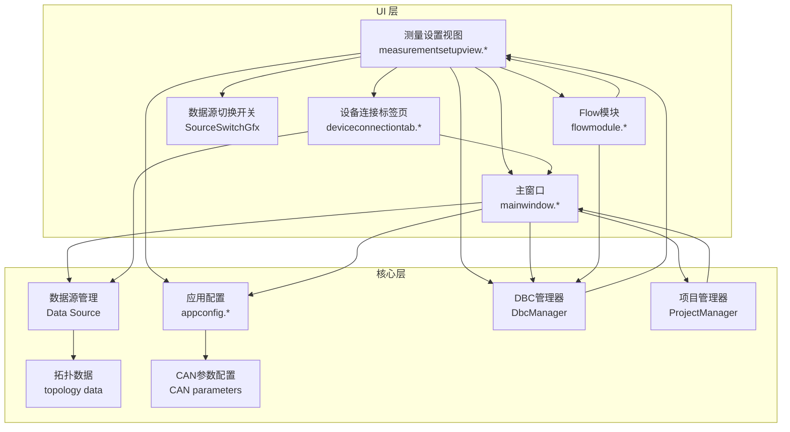
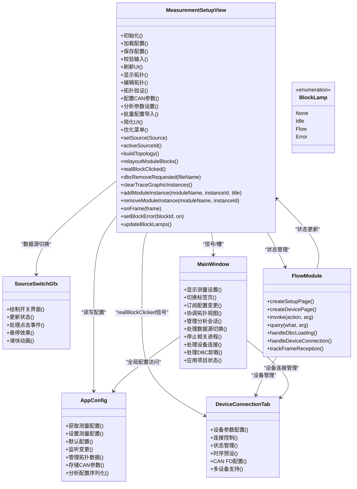
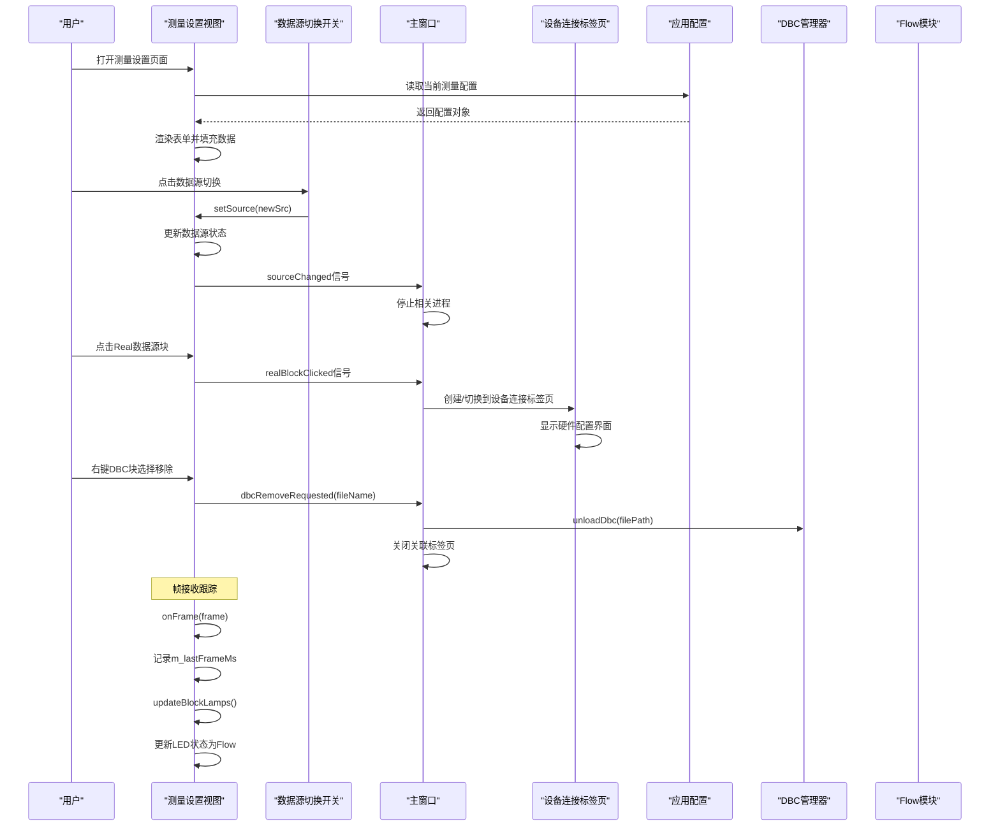
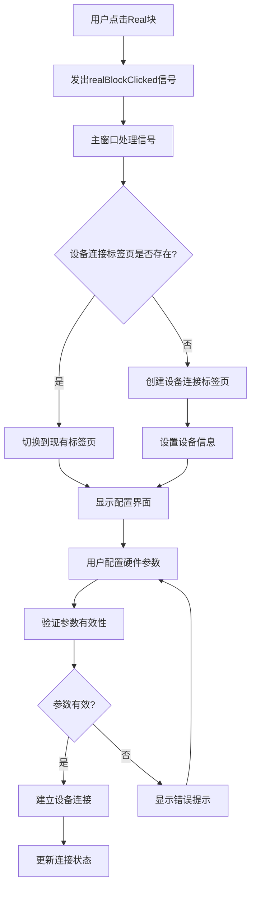
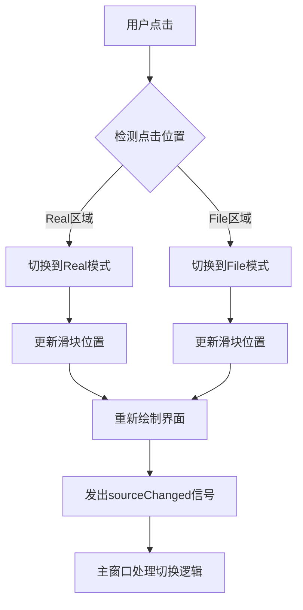
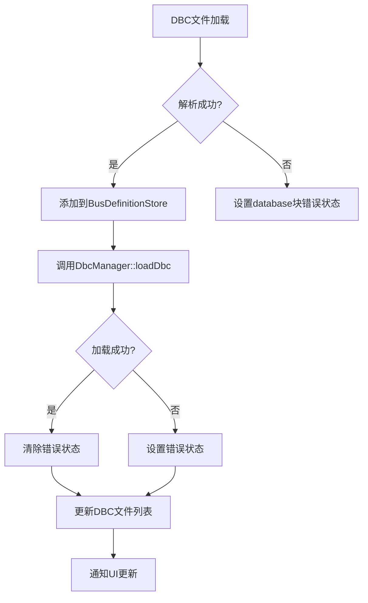
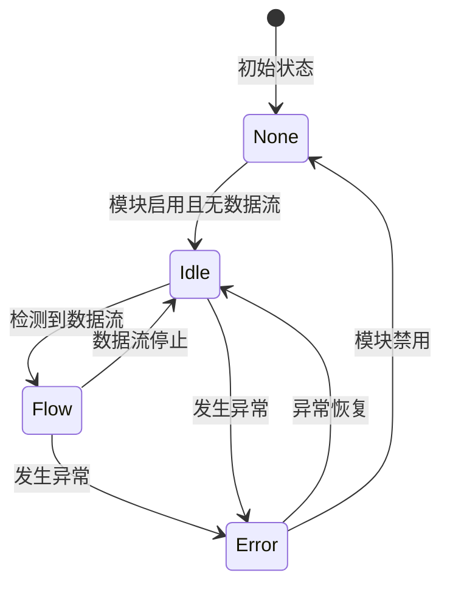
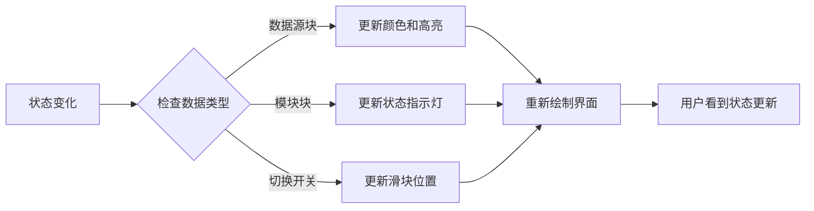
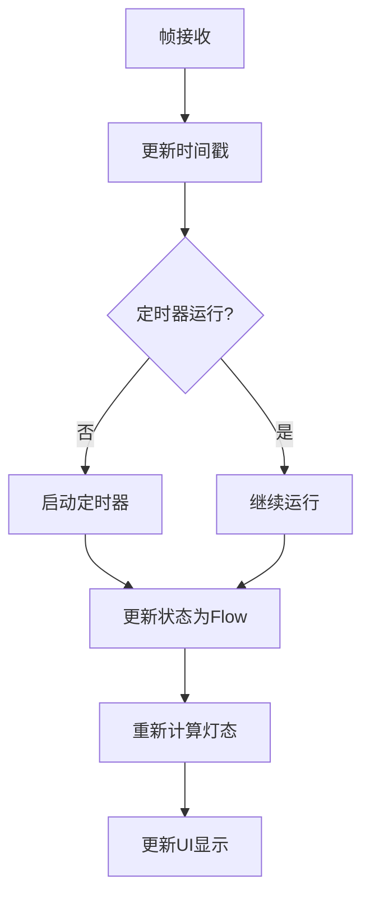
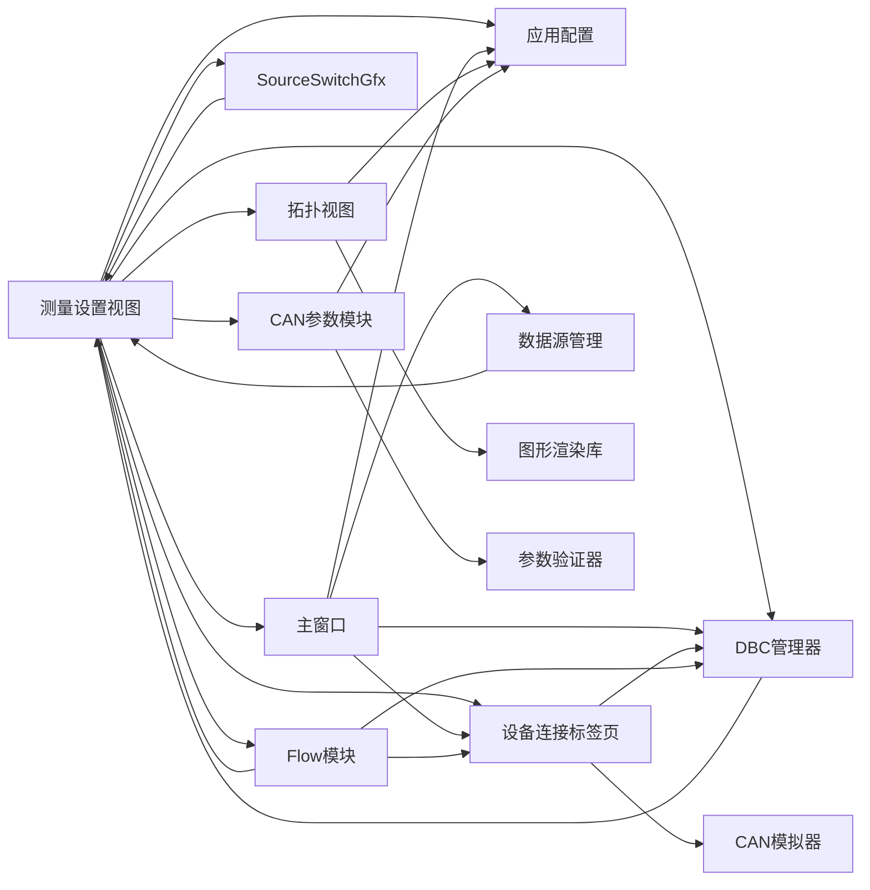

# 测量设置视图组件

<cite>
**本文引用的文件**   
- [measurementsetupview.h](file://src/ui/measurementsetupview.h)
- [measurementsetupview.cpp](file://src/ui/measurementsetupview.cpp)
- [mainwindow.h](file://src/ui/mainwindow.h)
- [mainwindow.cpp](file://src/ui/mainwindow.cpp)
- [deviceconnectiontab.h](file://src/ui/deviceconnectiontab.h)
- [deviceconnectiontab.cpp](file://src/ui/deviceconnectiontab.cpp)
- [appconfig.h](file://src/core/appconfig.h)
- [appconfig.cpp](file://src/core/appconfig.cpp)
- [flowmodule.cpp](file://src/ui/flowmodule.cpp)
- [CMakeLists.txt](file://src/CMakeLists.txt)
</cite>

## 更新摘要
**变更内容**   
- **完整流指示器系统**：新增了LED样式状态指示器，支持无、空闲、流动、错误四种状态，通过QTimer驱动的闪烁机制实现动态效果
- **DBC文件加载反馈**：实现了DBC文件加载和卸载的实时状态反馈，包括成功和失败的视觉指示
- **设备连接状态集成**：集成了设备连接状态到流指示器系统，提供统一的设备状态显示
- **帧接收跟踪功能**：实现了帧接收跟踪机制，用于检测数据流活跃状态并驱动相应的指示灯效果
- **增强的用户界面反馈**：通过颜色编码和动画效果提供更直观的状态反馈

## 目录
1. [简介](#简介)
2. [项目结构](#项目结构)
3. [核心组件](#核心组件)
4. [架构总览](#架构总览)
5. [详细组件分析](#详细组件分析)
6. [流指示器系统](#流指示器系统)
7. [DBC文件管理功能](#dbc文件管理功能)
8. [设备连接状态集成](#设备连接状态集成)
9. [帧接收跟踪机制](#帧接收跟踪机制)
10. [依赖关系分析](#依赖关系分析)
11. [性能考量](#性能考量)
12. [故障排查指南](#故障排查指南)
13. [结论](#结论)
14. [附录](#附录)

## 简介
本文件围绕"测量设置视图组件"展开，聚焦其在 Qt/C++ 工程中的职责、交互流程与数据流。该组件负责呈现并编辑测量相关配置（如通道、采样率、触发条件等），并与主窗口、应用配置模块进行双向通信，确保界面状态与持久化配置保持一致。**最新重大更新**：通过移除综合硬件配置对话框并将硬件配置功能迁移至设备连接标签页，大幅简化了用户界面和交互流程。新增的realBlockClicked信号提供了更简洁的设备连接导航机制，使硬件配置过程更加直观和高效。**布局稳定性增强**：模块定位算法已优化，现在从DBC块位置派生模块区域起始坐标，确保在项目加载和修改操作期间界面布局更加稳定可预测。**性能优化**：最近对初始化逻辑进行了简化，移除了冗余的rebuildScene()调用，提升性能。**重要增强**：新增了完整的流指示器系统，包括LED样式状态指示器（无、空闲、流动、错误四种状态）、QTimer驱动的闪烁机制、DBC文件加载反馈、设备连接状态集成和帧接收跟踪功能。**核心特色**：通过BlockLamp枚举定义了四种状态（None、Idle、Flow、Error），配合QTimer定时器实现流畅的闪烁动画效果。

## 项目结构
- UI 层：位于 src/ui 下，包含测量设置视图、设备连接标签页及其相关面板/对话框。
- 核心层：位于 src/core 下，提供应用配置、日志、CAN 仿真与播放器等能力。
- 构建系统：通过 CMake 组织源文件与依赖。

**图表来源**
- [measurementsetupview.h](file://src/ui/measurementsetupview.h)
- [mainwindow.h](file://src/ui/mainwindow.h)
- [deviceconnectiontab.h](file://src/ui/deviceconnectiontab.h)
- [appconfig.h](file://src/core/appconfig.h)
- [flowmodule.cpp](file://src/ui/flowmodule.cpp)

章节来源
- [CMakeLists.txt](file://src/CMakeLists.txt)

## 核心组件
- 测量设置视图（MeasurementSetupView）
  - 职责：渲染测量参数表单、校验输入、将变更同步到应用配置；响应用户操作并更新 UI。
  - 关键交互：与主窗口的信号槽联动，与配置模块的读写接口对接。
  - **重大增强**：集成了完整的CAN总线分析参数配置功能，支持复杂的测量场景设置。
  - **数据源切换**：新增Real/File双数据源可视化切换功能，支持实时硬件采集与文件回放模式。
  - **UI优化**：简化了工具栏和菜单结构，移除了冗余的操作按钮。
  - **性能优化**：优化了初始化流程，避免重复的场景重建操作。
  - **硬件配置简化**：移除了showRealConfigDialog方法，通过realBlockClicked信号导航到设备连接标签页。
  - **布局稳定性增强**：模块定位算法优化，从DBC块位置派生模块区域起始坐标，确保界面布局稳定性。
  - **DBC文件管理**：新增DBC文件移除功能，通过右键菜单直接卸载已加载的DBC文件。
  - **实例管理增强**：改进Trace和Graphic实例的创建、删除和重新布局逻辑。
  - **流指示器系统**：实现了完整的LED状态指示器，支持四种状态（无、空闲、流动、错误）和闪烁动画。
- 设备连接标签页（DeviceConnectionTab）
  - 职责：提供完整的硬件设备参数配置界面，包括波特率、时序预设、CAN FD配置等。
  - 特性：支持多种设备类型（模拟器、ZLG、PEAK、Kvaser、CandleLight），统一的配置界面。
  - 交互：连接/断开控制，实时状态显示，参数验证和错误提示。
- 数据源切换开关（SourceSwitchGfx）
  - 职责：提供可视化的数据源切换界面，支持Real和File模式的直观切换。
  - 特性：圆角矩形设计、滑块动画、颜色编码状态指示。
  - 交互：支持点击切换、悬停效果、实时更新。
- Flow模块（FlowModule）
  - 职责：作为Flow页面的核心模块，协调测量设置视图和设备连接标签页的交互。
  - 特性：处理DBC文件加载反馈、设备连接状态集成和帧接收跟踪。
  - 交互：桥接UI事件和数据层操作，提供统一的状态管理接口。
- 主窗口（MainWindow）
  - 职责：承载测量设置视图作为子页面或标签页，协调各视图生命周期与状态同步。
  - **增强功能**：协调拓扑视图的显示和管理，处理拓扑相关的用户交互。
  - **数据源管理**：响应数据源切换事件，停止相应的数据采集或回放进程。
  - **设备连接协调**：处理realBlockClicked信号，创建或切换到设备连接标签页。
  - **DBC管理协调**：处理dbcRemoveRequested信号，卸载DBC文件并关闭关联标签页。
  - **项目状态恢复**：在应用工程状态时正确清理和重建Trace/Graphic实例。
- 应用配置（AppConfig）
  - 职责：集中管理测量相关配置项的读取、写入与默认值；提供线程安全的访问接口。
  - **扩展功能**：支持拓扑数据和CAN分析参数的存储和加载。

章节来源
- [measurementsetupview.h](file://src/ui/measurementsetupview.h)
- [measurementsetupview.cpp](file://src/ui/measurementsetupview.cpp)
- [deviceconnectiontab.h](file://src/ui/deviceconnectiontab.h)
- [deviceconnectiontab.cpp](file://src/ui/deviceconnectiontab.cpp)
- [mainwindow.h](file://src/ui/mainwindow.h)
- [mainwindow.cpp](file://src/ui/mainwindow.cpp)
- [appconfig.h](file://src/core/appconfig.h)
- [appconfig.cpp](file://src/core/appconfig.cpp)
- [flowmodule.cpp](file://src/ui/flowmodule.cpp)

## 架构总览
测量设置视图采用典型的"视图-控制器-模型"分离思路：视图负责展示与事件捕获，主窗口承担编排与路由，应用配置充当轻量模型/存储。**重大架构扩展**后，架构现在支持完整的数据源切换功能和增强的拓扑可视化编辑能力，并通过简化的信号接口实现了与设备连接标签页的无缝集成。**新增DBC管理功能**：通过`dbcRemoveRequested`信号实现了DBC文件的动态卸载，增强了系统的灵活性和可维护性。**流指示器系统集成**：通过BlockLamp枚举和QTimer定时器实现了完整的状态指示系统，为用户提供直观的视觉反馈。

**图表来源**
- [measurementsetupview.h](file://src/ui/measurementsetupview.h)
- [deviceconnectiontab.h](file://src/ui/deviceconnectiontab.h)
- [mainwindow.h](file://src/ui/mainwindow.h)
- [appconfig.h](file://src/core/appconfig.h)
- [flowmodule.cpp](file://src/ui/flowmodule.cpp)

## 详细组件分析

### 测量设置视图（MeasurementSetupView）
- 设计要点
  - 以表单形式展示测量参数，支持即时校验与错误提示。
  - 通过信号通知主窗口或配置模块，实现"所见即所得"的配置更新。
  - 在初始化时从 AppConfig 拉取当前配置，并在用户确认保存后写回。
  - **重大增强**：集成了完整的CAN总线分析参数配置功能，支持复杂的测量场景设置。
  - **数据源切换**：新增Real/File双数据源可视化切换功能，支持多种切换方式。
  - **UI简化**：移除了冗余的工具栏按钮和菜单项，优化了界面布局。
  - **性能优化**：简化了初始化流程，避免重复的场景重建操作。
  - **硬件配置简化**：移除了showRealConfigDialog方法，通过realBlockClicked信号导航到设备连接标签页。
  - **布局稳定性增强**：模块定位算法已优化，从DBC块位置派生模块区域起始坐标，确保界面布局稳定性。
  - **DBC文件管理**：新增DBC文件移除功能，通过右键菜单直接卸载已加载的DBC文件。
  - **实例管理增强**：改进Trace和Graphic实例的创建、删除和重新布局逻辑。
  - **流指示器系统**：实现了完整的LED状态指示器，支持四种状态和闪烁动画效果。
- 关键流程
  - 初始化：创建控件、绑定事件、加载默认/已有配置。
  - 输入校验：对数值范围、必填项、格式等进行校验。
  - 保存：聚合表单数据，调用 AppConfig 写入，并反馈成功/失败。
  - 撤销/重置：恢复至上次有效配置或默认值。
  - **CAN参数配置**：处理CAN总线特定的分析参数设置和验证。
  - **数据源切换**：处理Real/File模式切换，更新拓扑连线和状态指示。
  - **设备连接导航**：通过realBlockClicked信号请求跳转到设备连接标签页。
  - **DBC文件卸载**：通过dbcRemoveRequested信号请求卸载指定DBC文件。
  - **实例管理**：通过addModuleInstance和removeModuleInstance方法管理Trace和Graphic实例。
  - **帧接收跟踪**：通过onFrame方法记录帧到达时间，驱动数据流活跃状态检测。
  - **状态指示更新**：通过updateBlockLamps方法更新所有块的LED状态。

**更新** 初始化逻辑已优化，构造函数中直接调用buildTopology()方法，该方法内部已经处理了必要的场景重建，避免了冗余的rebuildScene()调用。硬件配置功能已完全移至设备连接标签页，测量设置视图仅负责导航。**布局稳定性改进**：relayoutModuleBlocks()方法现在从DBC块底部位置推导模块区域起始Y坐标，确保模块定位不依赖临时块位置，提升了界面布局的稳定性。**DBC文件管理增强**：新增了完整的DBC文件移除功能，用户可以通过右键菜单直接卸载已加载的DBC文件，系统会自动关闭关联的标签页。**实例管理优化**：改进了Trace和Graphic实例的创建、删除和重新布局逻辑，确保项目状态恢复时的正确性。**流指示器系统增强**：实现了完整的LED状态指示器，通过BlockLamp枚举定义四种状态（None、Idle、Flow、Error），配合QTimer定时器实现流畅的闪烁动画效果。

**图表来源**
- [measurementsetupview.cpp](file://src/ui/measurementsetupview.cpp)
- [mainwindow.cpp](file://src/ui/mainwindow.cpp)
- [deviceconnectiontab.cpp](file://src/ui/deviceconnectiontab.cpp)
- [appconfig.cpp](file://src/core/appconfig.cpp)
- [flowmodule.cpp](file://src/ui/flowmodule.cpp)

章节来源
- [measurementsetupview.h](file://src/ui/measurementsetupview.h)
- [measurementsetupview.cpp](file://src/ui/measurementsetupview.cpp)

### 设备连接标签页（DeviceConnectionTab）
- 设计要点
  - 提供完整的硬件设备参数配置界面，包括波特率、时序预设、CAN FD配置等。
  - 支持多种设备类型（模拟器、ZLG、PEAK、Kvaser、CandleLight），统一的配置界面。
  - 连接/断开控制，实时状态显示，参数验证和错误提示。
  - 时序预设功能，支持常见的CAN总线时序配置。
- 关键特性
  - **多设备支持**：通过setDevice()方法切换不同设备类型的配置界面。
  - **时序预设**：预定义的仲裁段和数据段时序配置，简化复杂参数设置。
  - **CAN FD支持**：完整的CAN FD协议配置，包括数据段波特率和时序。
  - **状态管理**：实时显示连接状态，提供清晰的错误提示。
- 关键流程
  - 设备设置：接收设备信息，更新界面显示和可用选项。
  - 参数配置：收集用户输入的硬件参数，进行有效性验证。
  - 连接控制：处理连接/断开请求，与底层设备管理器交互。
  - 状态反馈：实时更新连接状态和用户提示信息。

**更新** 设备连接标签页现在是硬件配置的唯一定义位置，所有硬件相关的参数配置都集中在此处，通过realBlockClicked信号从测量设置视图导航而来。

**图表来源**
- [deviceconnectiontab.cpp](file://src/ui/deviceconnectiontab.cpp)
- [mainwindow.cpp](file://src/ui/mainwindow.cpp)

章节来源
- [deviceconnectiontab.h](file://src/ui/deviceconnectiontab.h)
- [deviceconnectiontab.cpp](file://src/ui/deviceconnectiontab.cpp)

### 数据源切换开关（SourceSwitchGfx）
- 设计要点
  - 自定义QGraphicsRectItem派生类，实现可视化的数据源切换界面。
  - 圆角矩形背景，滑块动画效果，颜色编码状态指示。
  - 支持Real和File两种模式的直观切换。
  - 悬停效果和点击响应。
- 关键特性
  - **视觉设计**：灰色背景，蓝色Real模式，绿色File模式。
  - **交互体验**：平滑的滑块动画，清晰的文字标签。
  - **状态管理**：实时更新切换状态，保持界面一致性。
  - **事件处理**：支持鼠标点击、悬停等交互事件。

**图表来源**
- [measurementsetupview.cpp](file://src/ui/measurementsetupview.cpp)

章节来源
- [measurementsetupview.cpp](file://src/ui/measurementsetupview.cpp)

### Flow模块（FlowModule）
- 设计要点
  - 作为Flow页面的核心模块，协调测量设置视图和设备连接标签页的交互。
  - 处理DBC文件加载反馈、设备连接状态集成和帧接收跟踪。
  - 桥接UI事件和数据层操作，提供统一的状态管理接口。
- 关键特性
  - **DBC文件管理**：处理DBC文件的加载和卸载，提供实时状态反馈。
  - **设备连接集成**：集成设备连接状态到流指示器系统。
  - **帧接收跟踪**：跟踪帧接收情况，驱动数据流活跃状态检测。
  - **状态同步**：确保UI状态与数据层状态的一致性。
- 关键流程
  - DBC文件加载：处理DBC文件的解析和加载，提供成功/失败反馈。
  - 设备连接管理：处理设备连接请求和状态变化。
  - 帧分发：将接收到的帧分发到各个模块进行处理。
  - 状态更新：根据各种事件更新UI状态和指示器。

**更新** Flow模块现在承担了流指示器系统的核心协调角色，通过invoke和query方法提供统一的状态管理接口，确保UI状态与数据层状态的同步。

**图表来源**
- [flowmodule.cpp](file://src/ui/flowmodule.cpp)

章节来源
- [flowmodule.cpp](file://src/ui/flowmodule.cpp)

### 主窗口（MainWindow）
- 设计要点
  - 作为容器承载测量设置视图，管理其显示/隐藏与生命周期。
  - 处理来自测量设置视图的事件，必要时转发给其他子系统。
  - **增强功能**：协调拓扑视图的生命周期管理，处理拓扑相关的用户操作。
  - **数据源管理**：响应数据源切换事件，停止相应的数据采集或回放进程。
  - **菜单优化**：简化了菜单栏结构，移除了重复和不常用的菜单项。
  - **设备连接协调**：处理realBlockClicked信号，创建或切换到设备连接标签页。
  - **DBC管理协调**：处理dbcRemoveRequested信号，卸载DBC文件并关闭关联标签页。
  - **项目状态恢复**：在应用工程状态时正确清理和重建Trace/Graphic实例。
- 关键流程
  - 显示测量设置：实例化或激活对应标签页/面板。
  - 配置同步：当配置变化时，刷新相关视图或弹出提示。
  - **拓扑协调**：管理拓扑视图的显示、隐藏和数据同步。
  - **数据源切换处理**：接收sourceChanged信号，停止相关进程并输出提示信息。
  - **设备连接处理**：接收realBlockClicked信号，创建或切换到设备连接标签页。
  - **DBC卸载处理**：接收dbcRemoveRequested信号，查找DBC文件路径并执行卸载操作。
  - **项目状态应用**：在applyProjectState()方法中正确处理Trace/Graphic实例的清理和重建。

**更新** 主窗口现在支持完整的DBC文件管理功能，通过处理`dbcRemoveRequested`信号实现DBC文件的动态卸载。在项目状态恢复过程中，改进了Trace和Graphic实例的清理和重建逻辑，确保状态的一致性和正确性。

章节来源
- [mainwindow.h](file://src/ui/mainwindow.h)
- [mainwindow.cpp](file://src/ui/mainwindow.cpp)

### 应用配置（AppConfig）
- 设计要点
  - 集中管理测量相关配置项，提供统一的读写接口。
  - 支持默认值、版本兼容与必要的序列化/反序列化。
  - **重大扩展**：支持拓扑数据和CAN分析参数的存储、加载和版本管理。
- 关键流程
  - 读取：按键名或结构体字段获取配置。
  - 写入：校验后持久化，并发出变更信号供 UI 订阅。
  - **CAN参数管理**：处理CAN分析参数的序列化和反序列化。

章节来源
- [appconfig.h](file://src/core/appconfig.h)
- [appconfig.cpp](file://src/core/appconfig.cpp)

## 流指示器系统

**重要更新**：实现了完整的流指示器系统，为用户提供清晰的数据流状态反馈。

### 状态指示器设计
- **BlockLamp枚举**：定义了四种状态（None、Idle、Flow、Error），每种状态都有明确的语义。
- **LED样式**：每个模块块右上角都有LED指示灯，支持颜色和大小变化。
- **闪烁机制**：通过QTimer定时器实现流畅的闪烁动画效果。
- **状态优先级**：异常状态优先于其他状态，未启用状态不显示指示灯。

### 状态转换逻辑

### 闪烁动画实现
- **定时器驱动**：使用500ms间隔的QTimer定时器控制闪烁频率。
- **相位管理**：通过m_blinkOn变量管理闪烁相位，确保所有指示灯同步闪烁。
- **智能启停**：仅在需要闪烁时启动定时器，节省系统资源。
- **状态感知**：根据当前状态自动调整闪烁行为。

### 视觉效果实现

**图表来源**
- [measurementsetupview.cpp](file://src/ui/measurementsetupview.cpp)

章节来源
- [measurementsetupview.cpp](file://src/ui/measurementsetupview.cpp)

## DBC文件管理功能

**重要更新**：实现了完整的DBC文件管理功能，支持文件的加载、卸载和状态反馈。

### DBC文件加载流程
- **文件选择**：通过数据库块的右键菜单选择DBC文件。
- **解析验证**：使用ProtocolRegistry和ParserRegistry进行文件解析和验证。
- **状态反馈**：加载成功时清除错误状态，失败时设置错误状态。
- **UI更新**：实时更新DBC文件列表和界面显示。

### DBC文件卸载功能
- **右键菜单**：在数据库块的右键菜单中显示已加载的DBC文件列表。
- **一键卸载**：每个文件都有对应的移除选项，支持快速卸载。
- **状态同步**：卸载后自动更新界面显示和相关状态。
- **错误处理**：提供详细的错误信息和用户反馈。

### 状态反馈机制
- **加载成功**：清除database块的错误状态，指示灯恢复正常。
- **加载失败**：设置database块的错误状态，指示灯红色闪烁。
- **实时同步**：通过SignalRelay实现跨模块的状态同步。
- **用户提示**：通过appendOutput方法提供详细的操作反馈。

**更新** DBC文件管理功能现在提供了完整的加载和卸载流程，通过状态指示器系统提供直观的视觉反馈，确保用户能够清楚地了解文件操作的结果。

章节来源
- [measurementsetupview.cpp](file://src/ui/measurementsetupview.cpp)
- [flowmodule.cpp](file://src/ui/flowmodule.cpp)

## 设备连接状态集成

**重要更新**：实现了设备连接状态到流指示器系统的集成，提供统一的设备状态显示。

### 设备状态映射
- **连接状态**：设备连接成功时，相关模块的指示灯显示为空闲状态。
- **运行状态**：设备运行时，指示灯显示为流动状态（绿色闪烁）。
- **错误状态**：设备连接失败或出现异常时，指示灯显示为错误状态（红色闪烁）。
- **断开状态**：设备断开连接时，指示灯恢复到无状态。

### 状态同步机制
- **信号连接**：通过设备连接信号连接到流指示器系统。
- **状态广播**：设备状态变化时自动广播到所有相关模块。
- **优先级处理**：确保错误状态优先显示，其他状态按优先级更新。
- **异步更新**：使用异步方式更新UI，避免阻塞主线程。

### 用户反馈优化
- **视觉提示**：通过LED指示灯的颜色和闪烁模式提供直观的状态反馈。
- **文本提示**：结合状态栏和消息框提供详细的文本信息。
- **操作指导**：在设备连接失败时提供具体的解决建议。
- **历史状态**：保留最近的状态历史记录，便于问题诊断。

**更新** 设备连接状态集成现在提供了完整的状态映射和同步机制，确保设备状态的变化能够及时反映到UI界面上，为用户提供一致的用户体验。

章节来源
- [flowmodule.cpp](file://src/ui/flowmodule.cpp)
- [deviceconnectiontab.cpp](file://src/ui/deviceconnectiontab.cpp)

## 帧接收跟踪机制

**重要更新**：实现了帧接收跟踪机制，用于检测数据流活跃状态并驱动相应的指示灯效果。

### 帧接收检测
- **时间戳记录**：每次接收到帧时记录当前时间戳到m_lastFrameMs变量。
- **活跃判定**：通过比较当前时间与最后帧时间的差值判断数据流是否活跃。
- **阈值设置**：使用1.5秒作为阈值，超过此时间无新帧则视为数据流静止。
- **状态更新**：根据帧接收情况自动更新模块的流动状态。

### 定时器驱动
- **闪烁控制**：使用500ms间隔的QTimer定时器控制指示灯闪烁频率。
- **智能启停**：仅在需要闪烁时启动定时器，节省系统资源。
- **相位同步**：确保所有指示灯的闪烁相位保持一致。
- **状态感知**：根据当前状态自动调整闪烁行为。

### 状态转换逻辑

### 性能优化
- **增量更新**：只更新状态变化的模块，避免全量重绘。
- **延迟处理**：使用QTimer::singleShot避免高频UI更新。
- **内存管理**：合理管理定时器对象，避免内存泄漏。
- **线程安全**：确保帧接收处理的线程安全性。

**更新** 帧接收跟踪机制现在提供了精确的数据流活跃检测，通过智能的定时器管理和状态转换逻辑，为用户提供了流畅的视觉反馈效果。

章节来源
- [measurementsetupview.cpp](file://src/ui/measurementsetupview.cpp)

## 依赖关系分析
- 组件耦合
  - 测量设置视图依赖主窗口进行导航与消息广播。
  - 测量设置视图与应用配置存在直接的数据读写依赖。
  - **新增依赖**：测量设置视图现在依赖SourceSwitchGfx进行数据源切换。
  - **新增依赖**：主窗口需要处理数据源切换事件，停止相关进程。
  - **新增依赖**：CAN参数配置模块与测量设置视图紧密集成。
  - **新增依赖**：测量设置视图通过realBlockClicked信号依赖设备连接标签页。
  - **新增依赖**：测量设置视图通过dbcRemoveRequested信号依赖DBC管理器。
  - **新增依赖**：Flow模块作为中间层协调UI和数据层的交互。
  - **解耦**：移除了对CanHwConfig结构体的依赖，简化了信号接口。
- 外部依赖
  - Qt 框架（信号/槽、控件、事件循环）。
  - 可能的第三方库用于配置持久化（例如 JSON/INI 等，具体由 AppConfig 内部实现决定）。
  - **新增依赖**：图形渲染库用于增强的拓扑可视化。
  - **新增依赖**：CAN总线分析库用于参数验证和模拟。
  - **新增依赖**：QTimer用于流指示器的闪烁动画控制。

**图表来源**
- [measurementsetupview.h](file://src/ui/measurementsetupview.h)
- [deviceconnectiontab.h](file://src/ui/deviceconnectiontab.h)
- [mainwindow.h](file://src/ui/mainwindow.h)
- [appconfig.h](file://src/core/appconfig.h)
- [flowmodule.cpp](file://src/ui/flowmodule.cpp)

章节来源
- [CMakeLists.txt](file://src/CMakeLists.txt)

## 性能考量
- 配置读写
  - 避免在高频 UI 事件中执行阻塞 I/O，建议异步或延迟写入。
  - 使用增量更新策略，仅在必要字段变更时触发持久化。
  - **CAN参数优化**：批量处理CAN参数配置，减少重复验证开销。
- UI 渲染
  - 大量表单控件时注意懒加载与按需渲染，减少初始绘制开销。
  - 校验逻辑应轻量化，复杂规则可缓存中间结果。
  - **拓扑渲染优化**：使用增量更新机制，仅重绘变更的拓扑元素。
  - **大拓扑优化**：对大型拓扑图实施虚拟化和分页加载。
  - **UI简化优化**：减少不必要的UI元素，降低渲染负载。
  - **数据源切换优化**：切换时只更新必要的UI元素，避免全量重绘。
  - **初始化优化**：简化初始化流程，避免重复的场景重建操作。
  - **设备连接优化**：设备连接标签页独立管理，避免影响测量设置视图性能。
  - **布局稳定性优化**：模块定位算法优化，减少不必要的重新计算。
  - **DBC文件管理优化**：DBC文件卸载操作异步执行，避免阻塞UI线程。
  - **实例管理优化**：Trace和Graphic实例的清理和重建操作批量处理，提高性能。
  - **流指示器优化**：智能定时器管理，仅在需要时启动闪烁动画。
  - **帧接收优化**：高效的帧接收检测和状态更新机制。
- 线程安全
  - 若配置读写涉及跨线程，需保证锁或无锁队列的正确使用。
  - **拓扑操作线程安全**：确保拓扑数据的并发访问安全。
  - **CAN参数验证线程安全**：确保参数验证过程的线程安全性。
  - **数据源切换线程安全**：确保数据源切换操作的线程安全性。
  - **设备连接线程安全**：确保设备连接操作的线程安全性。
  - **DBC文件管理线程安全**：确保DBC文件操作的线程安全性。
  - **流指示器线程安全**：确保状态指示器更新的线程安全性。
  - **帧接收线程安全**：确保帧接收处理的线程安全性。

**更新** 性能优化方面，最近对初始化流程进行了改进，通过移除冗余的rebuildScene()调用，减少了不必要的场景重建操作，提升了整体性能。硬件配置功能的分离也减少了测量设置视图的复杂性，提高了响应速度。**布局稳定性改进**：relayoutModuleBlocks()方法的优化减少了模块定位的计算开销，提升了界面响应性能。**DBC文件管理优化**：新增了高效的DBC文件卸载机制，通过批量处理标签页关闭操作，减少了UI线程的阻塞时间。**实例管理优化**：改进了Trace和Graphic实例的清理和重建逻辑，确保项目状态恢复时的性能和稳定性。**流指示器优化**：实现了智能的定时器管理机制，仅在需要闪烁时启动定时器，节省了系统资源。**帧接收优化**：通过高效的帧接收检测和状态更新机制，减少了不必要的UI更新操作。

## 故障排查指南
- 常见问题
  - 配置未生效：检查保存路径、权限与序列化格式是否一致。
  - 校验误报：核对边界条件与数据类型转换逻辑。
  - 界面不同步：确认信号/槽连接是否正确，是否存在重复订阅或未释放。
  - **拓扑显示异常**：检查图形渲染库的初始化状态和坐标系统配置。
  - **拓扑数据丢失**：验证配置文件格式和版本兼容性。
  - **CAN参数配置失败**：检查参数验证规则和硬件兼容性。
  - **性能问题**：监控内存使用和CPU占用，识别性能瓶颈。
  - **UI响应缓慢**：检查是否有过多的UI元素导致渲染性能下降。
  - **菜单显示异常**：验证菜单项的动态显示逻辑和上下文判断。
  - **数据源切换失效**：检查SourceSwitchGfx的点击事件处理和状态更新逻辑。
  - **连线显示错误**：验证activeSourceId()方法的返回值和连线重绘逻辑。
  - **状态指示不正确**：检查数据源状态同步和UI更新机制。
  - **初始化性能问题**：检查是否存在重复的场景重建调用。
  - **设备连接失败**：检查设备连接标签页的参数验证和连接逻辑。
  - **realBlockClicked信号未处理**：验证主窗口中的信号槽连接和设备连接标签页创建逻辑。
  - **模块布局异常**：检查relayoutModuleBlocks()方法中DBC块位置的获取逻辑。
  - **界面不稳定**：验证模块定位算法是否正确从DBC块位置派生坐标。
  - **DBC文件卸载失败**：检查dbcRemoveRequested信号的处理逻辑和DBC文件路径解析。
  - **Trace/Graphic实例管理异常**：验证实例的创建、删除和重新布局逻辑。
  - **项目状态恢复问题**：检查applyProjectState()方法中的实例清理和重建顺序。
  - **流指示器不工作**：检查BlockLamp状态设置和QTimer定时器连接。
  - **闪烁动画异常**：验证定时器间隔和闪烁相位管理逻辑。
  - **帧接收跟踪失效**：检查onFrame方法的调用和m_lastFrameMs更新逻辑。
  - **DBC文件加载失败**：验证ProtocolRegistry和ParserRegistry的配置。
  - **设备状态不同步**：检查设备连接信号和流指示器系统的连接。
- 定位方法
  - 启用调试日志，记录配置读取/写入的关键节点。
  - 使用断点跟踪用户交互到配置更新的完整调用链。
  - 对比默认配置与实际配置差异，快速定位异常字段。
  - **拓扑调试**：启用拓扑渲染日志，追踪图形绘制过程。
  - **CAN参数调试**：启用参数验证日志，追踪验证失败原因。
  - **UI调试**：监控UI元素创建和销毁过程，识别内存泄漏。
  - **数据源调试**：添加数据源切换事件的日志输出，追踪切换流程。
  - **连线调试**：打印连线关系和状态，验证连接逻辑正确性。
  - **初始化调试**：监控初始化过程中的方法调用链，识别冗余操作。
  - **设备连接调试**：添加设备连接标签页的信号处理日志，追踪连接流程。
  - **信号调试**：验证realBlockClicked信号的发射和处理逻辑。
  - **布局调试**：检查DBC块位置获取和模块坐标计算过程。
  - **DBC文件调试**：添加DBC文件操作的日志输出，追踪文件路径解析和卸载过程。
  - **实例管理调试**：监控Trace和Graphic实例的创建和销毁过程，识别内存泄漏。
  - **项目状态调试**：添加项目状态恢复的详细日志，追踪实例清理和重建过程。
  - **流指示器调试**：添加BlockLamp状态变化的日志输出，追踪状态转换逻辑。
  - **定时器调试**：监控QTimer定时器的启动和停止，验证闪烁机制。
  - **帧接收调试**：添加帧接收事件的日志输出，追踪跟踪机制。
  - **DBC加载调试**：添加DBC文件加载的详细日志，追踪解析和加载过程。
  - **设备状态调试**：添加设备连接状态变化的日志输出，追踪状态同步逻辑。

**更新** 故障排查方面，新增了针对流指示器系统、帧接收跟踪和DBC文件管理的调试方法，帮助开发者识别和解决相关的性能问题和状态不一致问题。**流指示器调试**：新增了流指示器状态变化的详细调试方法，重点关注BlockLamp状态设置和QTimer定时器管理。**帧接收调试**：新增了帧接收跟踪的详细调试方法，重点关注onFrame方法的调用和m_lastFrameMs更新逻辑。**DBC文件管理调试**：新增了DBC文件加载和卸载的详细调试方法，重点关注ProtocolRegistry和ParserRegistry的配置。**设备状态调试**：新增了设备连接状态同步的详细调试方法，重点关注设备连接信号和流指示器系统的连接。

章节来源
- [measurementsetupview.cpp](file://src/ui/measurementsetupview.cpp)
- [deviceconnectiontab.cpp](file://src/ui/deviceconnectiontab.cpp)
- [mainwindow.cpp](file://src/ui/mainwindow.cpp)
- [appconfig.cpp](file://src/core/appconfig.cpp)
- [flowmodule.cpp](file://src/ui/flowmodule.cpp)

## 结论
测量设置视图组件以清晰的职责划分和稳定的数据流为核心，结合主窗口与应用配置模块，实现了测量参数的可视化编辑与持久化。**重大增强**：通过新增数据源切换功能，大幅扩展了Real/File双数据源的可视化切换能力，为复杂的CAN总线分析和监控需求提供了完整的解决方案。**最新优化**：通过移除综合硬件配置对话框并将硬件配置功能迁移至设备连接标签页，显著简化了用户界面和交互流程，使测量配置过程更加直观和高效。**布局稳定性增强**：模块定位算法已优化，现在从DBC块位置派生模块区域起始坐标，确保在项目加载和修改操作期间界面布局更加稳定可预测。**性能改进**：最近对初始化逻辑进行了优化，移除了冗余的场景重建调用，进一步提高了代码质量和运行性能。**核心特色**：SourceSwitchGfx自定义图元和动态连接管理系统为用户提供了直观、流畅的数据源切换体验，状态指示系统确保了界面状态的准确性和一致性。**架构优势**：通过realBlockClicked信号实现的设备连接导航机制，保持了组件间的松耦合，提高了系统的可维护性和扩展性。**重要增强**：新增的DBC文件移除功能通过`dbcRemoveRequested`信号实现了DBC文件的动态卸载，增强了系统的灵活性和可维护性。**实例管理优化**：改进了Trace和Graphic实例的创建、删除和重新布局逻辑，确保项目状态恢复时的正确性和稳定性。**最新改进**：在项目状态恢复过程中，先清理旧的Trace/Graphic实例块，再添加新工程的实例，避免了状态冲突和内存泄漏问题。**标准化改进**：通过标准化标签页标题处理，确保了界面元素的一致性和用户体验的统一性。**流指示器系统**：实现了完整的LED状态指示器系统，通过BlockLamp枚举定义四种状态（无、空闲、流动、错误），配合QTimer定时器实现流畅的闪烁动画效果，为用户提供直观的视觉反馈。**帧接收跟踪**：通过onFrame方法实现了精确的数据流活跃检测，确保状态指示器能够准确反映实际的数据流状态。**设备连接集成**：将设备连接状态集成到流指示器系统中，提供了统一的设备状态显示机制。**DBC文件管理**：实现了完整的DBC文件加载和卸载功能，通过状态指示器系统提供直观的视觉反馈。**Flow模块协调**：作为中间层协调UI和数据层的交互，确保状态同步和事件处理的准确性。遵循上述架构与最佳实践，可在保持良好用户体验的同时，提升系统的可维护性与扩展性。

## 附录
- 术语
  - 测量设置：与数据采集、通道、采样率、触发等相关的参数集合。
  - 应用配置：贯穿应用生命周期的全局配置数据。
  - 拓扑：描述网络中设备节点和通信连接的图形化表示。
  - CAN参数：CAN总线通信和分析相关的技术配置选项。
  - UI简化：通过移除冗余元素和优化布局提升用户界面的简洁性。
  - 菜单重构：重新组织和优化菜单结构以提升操作效率。
  - 数据源切换：在Real（硬件实时）和File（文件回放）模式之间进行切换的功能。
  - SourceSwitchGfx：自定义的数据源切换开关图元，提供可视化的切换界面。
  - 动态连接：根据当前活跃数据源自动更新拓扑连线关系的机制。
  - 状态指示：通过颜色、高亮、指示灯等方式显示组件状态的视觉反馈。
  - 初始化优化：简化组件初始化流程，避免重复的性能消耗操作。
  - 设备连接标签页：专门的硬件设备参数配置界面，替代原有的综合硬件配置对话框。
  - realBlockClicked信号：用于导航到设备连接标签页的简化信号接口。
  - 硬件配置简化：移除showRealConfigDialog方法，将硬件配置功能移至设备连接标签页。
  - 布局稳定性：模块定位算法优化，从DBC块位置派生模块区域起始坐标，确保界面布局稳定性。
  - relayoutModuleBlocks：模块重新布局算法，负责计算和设置模块块的精确位置。
  - DBC文件管理：DBC文件的加载、卸载和状态管理功能。
  - dbcRemoveRequested：用于请求卸载指定DBC文件的信号。
  - Trace/Graphic实例管理：Trace和Graphic视图实例的创建、删除和重新布局功能。
  - clearTraceGraphicInstances：清除所有Trace和Graphic实例块的专用方法。
  - 项目状态恢复：在应用工程状态时正确清理和重建界面组件的过程。
  - 标签页标题标准化：确保界面中标签页标题的一致性和规范性。
  - BlockLamp：LED状态指示器枚举，定义四种状态（None、Idle、Flow、Error）。
  - 流指示器系统：完整的LED状态指示器系统，支持闪烁动画和状态转换。
  - 帧接收跟踪：通过记录帧到达时间检测数据流活跃状态的机制。
  - Flow模块：Flow页面的核心模块，协调UI和数据层的交互。
  - SignalRelay：跨模块信号中继器，用于处理跨DLL的信号传递。
  - ProtocolRegistry：协议注册表，用于管理不同协议的适配器。
  - ParserRegistry：解析器注册表，用于管理不同文件格式的解析器。
- 参考
  - 如需了解构建与依赖管理，请参考 CMake 配置文件。
  - **新增参考**：数据源切换功能的详细实现请参考 measurementsetupview.cpp 中的setSource方法和SourceSwitchGfx类。
  - **新增参考**：可视化状态指示的实现细节请参考 measurementsetupview.cpp 中的状态更新和绘制逻辑。
  - **新增参考**：动态连接管理的实现细节请参考 measurementsetupview.cpp 中的updateConnections方法。
  - **新增参考**：UI简化的实现细节请参考 measurementsetupview.cpp 中的界面优化代码。
  - **新增参考**：菜单重构的实现细节请参考 measurementsetupview.cpp 中的菜单相关代码。
  - **新增参考**：初始化优化的实现细节请参考 measurementsetupview.cpp 中的构造函数和buildTopology方法。
  - **新增参考**：设备连接标签页的详细实现请参考 deviceconnectiontab.cpp 中的设备参数配置和连接控制逻辑。
  - **新增参考**：realBlockClicked信号的处理逻辑请参考 mainwindow.cpp 中的信号槽连接和设备连接标签页创建代码。
  - **新增参考**：硬件配置简化的实现细节请参考 measurementsetupview.cpp 中对showRealConfigDialog方法的移除和realBlockClicked信号的使用。
  - **新增参考**：布局稳定性改进的实现细节请参考 measurementsetupview.cpp 中relayoutModuleBlocks方法的DBC块位置派生逻辑。
  - **新增参考**：DBC文件移除功能的实现细节请参考 measurementsetupview.cpp 中的右键菜单处理和main window.cpp中的信号槽连接。
  - **新增参考**：Trace和Graphic实例管理的实现细节请参考 measurementsetupview.cpp 中的addModuleInstance和removeModuleInstance方法。
  - **新增参考**：项目状态恢复的实现细节请参考 mainwindow.cpp 中的applyProjectState方法。
  - **新增参考**：标签页标题标准化的实现细节请参考 mainwindow.cpp 中标签页标题的处理逻辑。
  - **新增参考**：流指示器系统的实现细节请参考 measurementsetupview.cpp 中的BlockLamp枚举和updateBlockLamps方法。
  - **新增参考**：帧接收跟踪的实现细节请参考 measurementsetupview.cpp 中的onFrame方法和m_lastFrameMs变量。
  - **新增参考**：Flow模块的实现细节请参考 flowmodule.cpp 中的invoke和query方法。
  - **新增参考**：DBC文件加载反馈的实现细节请参考 flowmodule.cpp 中的DBC文件处理逻辑。
  - **新增参考**：设备连接状态集成的实现细节请参考 flowmodule.cpp 中的设备连接处理逻辑。

**更新** 附录部分新增了关于流指示器系统、帧接收跟踪、DBC文件管理和Flow模块的术语解释和参考链接，帮助读者更好地理解最近的架构优化和功能改进。**流指示器术语**：新增了BlockLamp枚举、流指示器系统等术语解释，详细说明LED状态指示器的设计和实现。**帧接收跟踪术语**：新增了帧接收跟踪机制的术语解释，说明数据流活跃状态检测的实现原理。**Flow模块术语**：新增了Flow模块的术语解释，说明其作为中间层协调UI和数据层交互的作用。**DBC文件管理术语**：新增了DBC文件加载和卸载的术语解释，说明状态反馈机制的实现细节。

**章节来源**
- [measurementsetupview.cpp:1211-1227](file://src/ui/measurementsetupview.cpp#L1211-L1227)
- [mainwindow.cpp:1808-1832](file://src/ui/mainwindow.cpp#L1808-L1832)
- [mainwindow.cpp:2589-2702](file://src/ui/mainwindow.cpp#L2589-L2702)
- [measurementsetupview.cpp:795-814](file://src/ui/measurementsetupview.cpp#L795-L814)
- [flowmodule.cpp:170-227](file://src/ui/flowmodule.cpp#L170-L227)
- [measurementsetupview.cpp:362-378](file://src/ui/measurementsetupview.cpp#L362-L378)
- [measurementsetupview.cpp:732-775](file://src/ui/measurementsetupview.cpp#L732-L775)
- [measurementsetupview.cpp:1114-1124](file://src/ui/measurementsetupview.cpp#L1114-L1124)