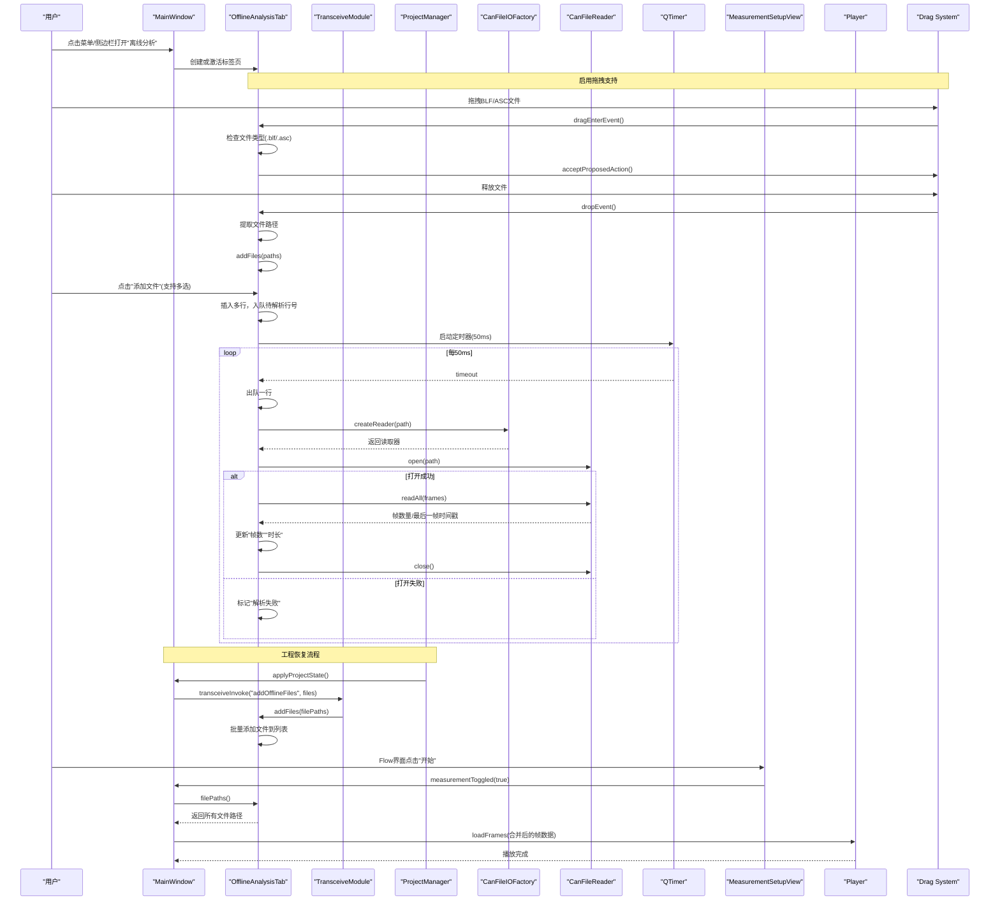
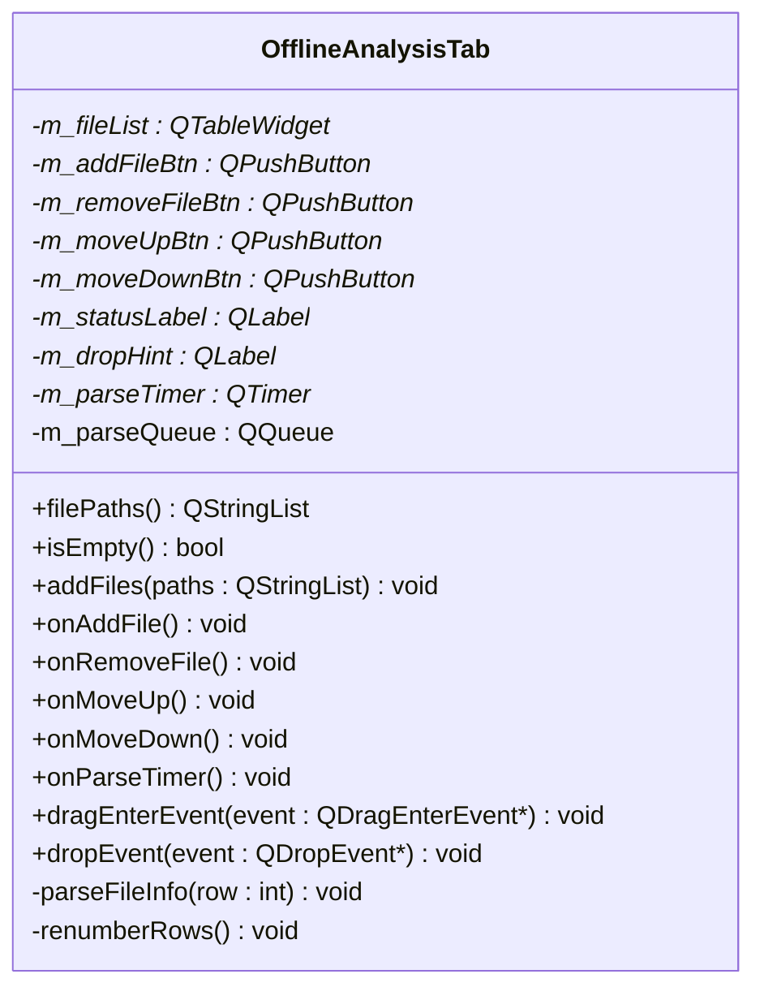
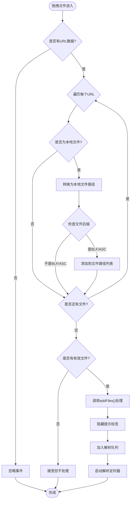
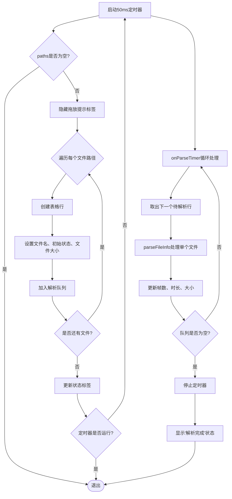

# 离线分析Tab组件

<cite>
**本文引用的文件**
- [offlineanalysistab.h](file://src/ui/offlineanalysistab.h)
- [offlineanalysistab.cpp](file://src/ui/offlineanalysistab.cpp)
- [mainwindow.h](file://src/ui/mainwindow.h)
- [mainwindow.cpp](file://src/ui/mainwindow.cpp)
- [mainwindow_project.cpp](file://src/ui/mainwindow_project.cpp)
- [transceivemodule.cpp](file://src/ui/transceivemodule.cpp)
- [canfileio.h](file://src/core/canfileio/canfileio.h)
- [canfileio_factory.h](file://src/core/canfileio/canfileio_factory.h)
- [canfileio_factory.cpp](file://src/core/canfileio/canfileio_factory.cpp)
- [canframe.h](file://src/core/canframe.h)
</cite>

## 更新摘要
**所做更改**
- 新增了拖拽文件支持功能的详细说明，包括BLF和ASC文件的拖拽操作
- 增强了用户交互体验，支持直接从文件系统拖拽文件到离线分析标签页
- 更新了UI组件结构，新增了拖放提示标签和事件处理机制
- 完善了文件过滤逻辑，确保只接受支持的格式文件

## 目录
1. [简介](#简介)
2. [项目结构](#项目结构)
3. [核心组件](#核心组件)
4. [架构总览](#架构总览)
5. [详细组件分析](#详细组件分析)
6. [依赖关系分析](#依赖关系分析)
7. [性能考虑](#性能考虑)
8. [故障排查指南](#故障排查指南)
9. [结论](#结论)
10. [附录](#附录)

## 简介
本章节面向"离线分析"标签页（OfflineAnalysisTab）的文档，聚焦其职责边界、交互流程与数据解析机制。该组件现已增强为支持**多文件批量处理**的离线报文分析工具，负责CAN总线日志文件的列表管理（添加/删除/排序）、**异步解析帧数、时长与文件大小**，并通过Flow界面与播放器系统无缝集成，实现多文件合并播放和分析。

**主要特性**：
- ✅ 支持同时选择和处理多个CAN总线日志文件
- ✅ **新增拖拽文件支持**：可直接从文件系统拖拽BLF和ASC文件到标签页
- ✅ 提供addFiles()公共方法用于程序化添加文件
- ✅ 异步解析队列避免UI阻塞，提供实时进度反馈
- ✅ 与Flow测量界面深度集成，支持多文件合并播放
- ✅ **项目恢复系统集成**：通过TransceiveModule自动恢复离线分析文件列表
- ✅ 实时统计显示：帧数、时长、文件大小等关键指标
- ✅ **智能文件过滤**：仅接受BLF和ASC格式的文件拖拽

## 项目结构
离线分析功能位于UI层，通过主窗口注册并打开为独立标签页；解析能力依赖核心层的文件格式I/O抽象与工厂。组件现已完全集成到Flow测量工作流中，并支持项目状态的保存与恢复。**新增的拖拽功能**提供了更加直观的文件导入方式。

```mermaid
graph TB
A["MainWindow<br/>主窗口"] --> B["OfflineAnalysisTab<br/>离线分析标签页"]
B --> C["CanFileIOFactory<br/>格式工厂"]
C --> D["CanFileReader<br/>读取器接口"]
D --> E["具体读取器<br/>BLF/ASC/CSV/PCAP/TRC"]
B --> F["CanFrame<br/>帧数据结构"]
G["MeasurementSetupView<br/>Flow界面"] --> A
A --> H["Player<br/>播放器"]
A --> I["TransceiveModule<br/>收发模块"]
I --> J["ProjectManager<br/>项目管理器"]
B -.->|filePaths()| G
G -.->|measurementToggled| A
A -.->|loadFrames()| H
J -.->|applyProjectState| I
I -.->|addOfflineFiles| B
B -.->|拖拽支持| K["QDragEnterEvent/QDropEvent"]
K -.->|BLF/ASC文件| B
```

**图表来源**
- [mainwindow.cpp:1546-1563](file://src/ui/mainwindow.cpp#L1546-L1563)
- [offlineanalysistab.cpp:99-130](file://src/ui/offlineanalysistab.cpp#L99-L130)
- [canfileio_factory.cpp:31-53](file://src/core/canfileio/canfileio_factory.cpp#L31-L53)
- [canfileio.h:96-113](file://src/core/canfileio/canfileio.h#L96-L113)
- [canframe.h:14-49](file://src/core/canframe.h#L14-L49)
- [mainwindow.cpp:1925-1970](file://src/ui/mainwindow.cpp#L1925-L1970)
- [transceivemodule.cpp:113-118](file://src/ui/transceivemodule.cpp#L113-L118)
- [mainwindow_project.cpp:465-467](file://src/ui/mainwindow_project.cpp#L465-L467)
- [offlineanalysistab.cpp:251-288](file://src/ui/offlineanalysistab.cpp#L251-L288)

**章节来源**
- [mainwindow.h:110-112](file://src/ui/mainwindow.h#L110-L112)
- [mainwindow.cpp:1546-1563](file://src/ui/mainwindow.cpp#L1546-L1563)
- [offlineanalysistab.h:13-29](file://src/ui/offlineanalysistab.h#L13-L29)
- [offlineanalysistab.cpp:42-97](file://src/ui/offlineanalysistab.cpp#L42-L97)

## 核心组件
- **OfflineAnalysisTab**：增强的UI组件，提供多文件列表管理、工具栏按钮、状态提示与异步解析队列，新增addFiles()公共方法和**拖拽文件支持**
- **CanFileIOFactory**：根据扩展名创建对应的读取器实例
- **CanFileReader**：统一的读取器接口，支持 open/readAll/close
- **CanFrame**：帧数据结构，包含时间戳、ID、DLC、数据等字段，用于计算时长与统计
- **TransceiveModule**：收发模块，处理项目恢复时的离线文件添加请求

**章节来源**
- [offlineanalysistab.h:13-51](file://src/ui/offlineanalysistab.h#L13-L51)
- [canfileio_factory.h:7-32](file://src/core/canfileio/canfileio_factory.h#L7-L32)
- [canfileio.h:96-113](file://src/core/canfileio/canfileio.h#L96-L113)
- [canframe.h:14-49](file://src/core/canframe.h#L14-L49)
- [transceivemodule.cpp:113-118](file://src/ui/transceivemodule.cpp#L113-L118)

## 架构总览
离线分析标签页通过定时器驱动解析队列，逐行调用工厂创建读取器，读取全部帧后更新表格中的"帧数"和"时长"，同时显示文件大小。**新增的拖拽功能**允许用户直接将BLF和ASC文件从文件系统拖拽到标签页，**新增的项目恢复集成机制**允许在工程加载时自动恢复之前保存的离线分析文件列表。



**图表来源**
- [mainwindow.cpp:1546-1563](file://src/ui/mainwindow.cpp#L1546-L1563)
- [offlineanalysistab.cpp:99-130](file://src/ui/offlineanalysistab.cpp#L99-L130)
- [offlineanalysistab.cpp:203-217](file://src/ui/offlineanalysistab.cpp#L203-L217)
- [offlineanalysistab.cpp:219-254](file://src/ui/offlineanalysistab.cpp#L219-L254)
- [canfileio_factory.cpp:31-53](file://src/core/canfileio/canfileio_factory.cpp#L31-L53)
- [canfileio.h:96-113](file://src/core/canfileio/canfileio.h#L96-L113)
- [mainwindow.cpp:1925-1970](file://src/ui/mainwindow.cpp#L1925-L1970)
- [transceivemodule.cpp:113-118](file://src/ui/transceivemodule.cpp#L113-L118)
- [mainwindow_project.cpp:465-467](file://src/ui/mainwindow_project.cpp#L465-L467)
- [offlineanalysistab.cpp:251-288](file://src/ui/offlineanalysistab.cpp#L251-L288)

## 详细组件分析

### OfflineAnalysisTab 类设计
- **职责**：多文件列表管理（增删、上移/下移排序）、异步解析（帧数/时长/大小）、状态提示、与Flow界面集成、项目恢复支持、**拖拽文件支持**
- **关键成员**：
  - m_fileList：QTableWidget，列包括序号、文件名、帧数、时长、大小
  - m_parseTimer：50ms 定时器，驱动解析队列
  - m_parseQueue：QQueue<int>，保存待解析的行号
  - m_statusLabel：状态提示，如"共 N 个文件，解析中/完成"
  - **m_dropHint**：**新增**拖放提示标签，显示"请拖放文件到此"
- **关键方法**：
  - onAddFile：**支持多选文件**，批量插入行，设置初始状态，入队解析
  - **addFiles(const QStringList &paths)**：**新增公共方法**，用于程序化添加文件，支持项目恢复场景
  - **dragEnterEvent(QDragEnterEvent *event)**：**新增**拖拽进入事件处理，检查文件类型
  - **dropEvent(QDropEvent *event)**：**新增**文件释放事件处理，提取BLF/ASC文件路径
  - onRemoveFile/onMoveUp/onMoveDown：维护列表顺序与序号重排
  - parseFileInfo：基于路径创建读取器，读取全部帧，计算时长并更新 UI
  - filePaths：按当前顺序返回所有文件路径（供Flow界面使用）



**图表来源**
- [offlineanalysistab.h:19-51](file://src/ui/offlineanalysistab.h#L19-L51)
- [offlineanalysistab.cpp:42-97](file://src/ui/offlineanalysistab.cpp#L42-L97)

**章节来源**
- [offlineanalysistab.h:13-51](file://src/ui/offlineanalysistab.h#L13-L51)
- [offlineanalysistab.cpp:99-187](file://src/ui/offlineanalysistab.cpp#L99-L187)

### 拖拽文件支持流程（算法流程图）


**图表来源**
- [offlineanalysistab.cpp:251-288](file://src/ui/offlineanalysistab.cpp#L251-L288)
- [offlineanalysistab.cpp:141-172](file://src/ui/offlineanalysistab.cpp#L141-L172)

**章节来源**
- [offlineanalysistab.cpp:251-288](file://src/ui/offlineanalysistab.cpp#L251-L288)
- [offlineanalysistab.cpp:141-172](file://src/ui/offlineanalysistab.cpp#L141-L172)

### 程序化文件添加流程（算法流程图）


**图表来源**
- [offlineanalysistab.cpp:126-154](file://src/ui/offlineanalysistab.cpp#L126-L154)
- [offlineanalysistab.cpp:227-241](file://src/ui/offlineanalysistab.cpp#L227-L241)
- [offlineanalysistab.cpp:243-278](file://src/ui/offlineanalysistab.cpp#L243-L278)

**章节来源**
- [offlineanalysistab.cpp:126-154](file://src/ui/offlineanalysistab.cpp#L126-L154)
- [offlineanalysistab.cpp:227-241](file://src/ui/offlineanalysistab.cpp#L227-L241)
- [offlineanalysistab.cpp:243-278](file://src/ui/offlineanalysistab.cpp#L243-L278)

### 项目恢复系统集成机制
**新增功能**：项目恢复系统现在能够自动恢复之前保存的离线分析文件列表，通过TransceiveModule进行桥接。

- **入口点**：`applyProjectState()` 方法中调用 `transceiveInvoke("addOfflineFiles", st.offlineFiles)`
- **生命周期管理**：TransceiveModule检查离线分析页面是否存在，不存在则静默忽略
- **数据流集成**：
  - ProjectManager保存离线文件列表到项目状态
  - 应用状态时通过TransceiveModule转发到OfflineAnalysisTab
  - 最终调用addFiles()方法批量添加文件

**章节来源**
- [mainwindow_project.cpp:465-467](file://src/ui/mainwindow_project.cpp#L465-L467)
- [transceivemodule.cpp:113-118](file://src/ui/transceivemodule.cpp#L113-L118)

### Flow界面集成机制
Flow测量界面现在能够直接从离线分析标签页获取已分析的文件列表，并在测量开始时自动加载和合并所有文件。

- **入口点**：通过 `onOpenOfflineAnalysisTab()` 创建和管理标签页实例
- **生命周期管理**：销毁时置空指针，避免悬垂引用
- **数据流集成**：
  - Flow界面通过 `m_offlineTab->filePaths()` 获取文件列表
  - 主窗口将多个文件的帧数据合并并按时间戳排序
  - 最终通过 `m_player->loadFrames()` 统一加载到播放器

**章节来源**
- [mainwindow.h:110-112](file://src/ui/mainwindow.h#L110-L112)
- [mainwindow.cpp:1546-1563](file://src/ui/mainwindow.cpp#L1546-L1563)
- [mainwindow.cpp:1717-1722](file://src/ui/mainwindow.cpp#L1717-L1722)
- [mainwindow.cpp:1925-1970](file://src/ui/mainwindow.cpp#L1925-L1970)

## 依赖关系分析
- **组件耦合**：
  - OfflineAnalysisTab 依赖 CanFileIOFactory 与 CanFileReader 进行文件解析
  - 解析结果依赖 CanFrame 的时间戳字段计算时长
  - MainWindow 负责标签页的创建与展示，并与Flow界面集成
  - **TransceiveModule 作为项目恢复系统的桥梁**，处理离线文件添加请求
  - Flow界面通过信号槽机制与主窗口通信，触发文件加载流程
  - **Qt拖拽系统**：通过QDragEnterEvent和QDropEvent处理文件拖拽
- **外部依赖**：
  - Qt 控件：QTableWidget、QPushButton、QLabel、QTimer、QFileDialog
  - Qt 拖拽：QDragEnterEvent、QDropEvent、QMimeData
  - 文件格式：BLF/ASC/CSV/PCAP/TRC 由工厂统一创建读取器

```mermaid
graph LR
OAT["OfflineAnalysisTab"] --> FAC["CanFileIOFactory"]
FAC --> RIF["CanFileReader(接口)"]
OAT --> CF["CanFrame"]
MW["MainWindow"] --> OAT
TM["TransceiveModule"] --> MW
MSV["MeasurementSetupView"] --> MW
MW --> PL["Player"]
PM["ProjectManager"] --> TM
OAT -.->|filePaths()| MSV
MSV -.->|measurementToggled| MW
TM -.->|addOfflineFiles| OAT
OAT -.->|拖拽支持| QT["Qt Drag System"]
QT -.->|QDragEnterEvent| OAT
QT -.->|QDropEvent| OAT
```

**图表来源**
- [offlineanalysistab.cpp:243-278](file://src/ui/offlineanalysistab.cpp#L243-L278)
- [canfileio_factory.cpp:31-53](file://src/core/canfileio/canfileio_factory.cpp#L31-L53)
- [canfileio.h:96-113](file://src/core/canfileio/canfileio.h#L96-L113)
- [canframe.h:14-49](file://src/core/canframe.h#L14-L49)
- [mainwindow.cpp:1546-1563](file://src/ui/mainwindow.cpp#L1546-L1563)
- [mainwindow.cpp:1925-1970](file://src/ui/mainwindow.cpp#L1925-L1970)
- [transceivemodule.cpp:113-118](file://src/ui/transceivemodule.cpp#L113-L118)
- [mainwindow_project.cpp:465-467](file://src/ui/mainwindow_project.cpp#L465-L467)
- [offlineanalysistab.cpp:251-288](file://src/ui/offlineanalysistab.cpp#L251-L288)

**章节来源**
- [canfileio_factory.cpp:31-53](file://src/core/canfileio/canfileio_factory.cpp#L31-L53)
- [canfileio.h:96-113](file://src/core/canfileio/canfileio.h#L96-L113)
- [canframe.h:14-49](file://src/core/canframe.h#L14-L49)
- [mainwindow.cpp:1546-1563](file://src/ui/mainwindow.cpp#L1546-L1563)
- [mainwindow.cpp:1925-1970](file://src/ui/mainwindow.cpp#L1925-L1970)
- [transceivemodule.cpp:113-118](file://src/ui/transceivemodule.cpp#L113-L118)
- [mainwindow_project.cpp:465-467](file://src/ui/mainwindow_project.cpp#L465-L467)
- [offlineanalysistab.cpp:251-288](file://src/ui/offlineanalysistab.cpp#L251-L288)

## 性能考虑
- **异步解析**：使用 50ms 定时器分片处理解析任务，避免阻塞 UI 线程
- **批量读取**：readAll 一次性读取全部帧，减少 I/O 次数；对于大文件可能带来内存峰值，需关注内存占用
- **时长计算**：取最后一帧时间戳作为时长，复杂度 O(1)
- **多文件优化**：
  - 支持并行处理多个文件的解析请求
  - Flow界面合并帧数据时按时间戳排序，确保播放顺序正确
  - 建议对超大文件可考虑分段读取或流式统计，降低内存压力
- **用户体验**：解析过程中提供实时状态反馈，提升交互体验
- **项目恢复优化**：addFiles()方法支持批量添加，避免多次UI刷新开销
- **拖拽性能优化**：
  - 拖拽事件处理轻量级，仅检查文件类型
  - 文件验证在拖拽进入时进行，避免不必要的处理
  - 支持批量拖拽多个文件，提高操作效率

## 故障排查指南
- **解析失败**：
  - 现象：表格"帧数"列显示"解析失败"
  - 原因：读取器无法打开文件或格式不支持
  - 处理：检查文件路径、扩展名与权限；确认格式受支持
- **时长异常**：
  - 现象：时长显示"-"或为 0
  - 原因：文件无帧或时间戳未正确填充
  - 处理：验证源文件格式与时间戳字段
- **列表状态不一致**：
  - 现象：删除/移动后序号错乱
  - 原因：未调用重编号函数
  - 处理：确保 onRemoveFile/onMoveUp/onMoveDown 后调用 renumberRows
- **Flow集成问题**：
  - 现象：Flow界面无法加载离线分析文件
  - 原因：离线分析标签页为空或未正确初始化
  - 处理：检查 m_offlineTab 实例状态和 filePaths() 返回值
- **项目恢复问题**：
  - 现象：工程恢复后离线分析文件列表为空
  - 原因：TransceiveModule中页面不存在或文件路径无效
  - 处理：检查离线分析页面是否正确创建，验证项目状态中的文件路径
- **拖拽功能问题**：
  - 现象：拖拽文件无响应或被拒绝
  - 原因：文件类型不被支持或拖拽事件未正确处理
  - 处理：确认文件后缀为.blf或.asc，检查setAcceptDrops()调用和事件处理器

**章节来源**
- [offlineanalysistab.cpp:132-187](file://src/ui/offlineanalysistab.cpp#L132-L187)
- [offlineanalysistab.cpp:243-278](file://src/ui/offlineanalysistab.cpp#L243-L278)
- [mainwindow.cpp:1925-1970](file://src/ui/mainwindow.cpp#L1925-L1970)
- [transceivemodule.cpp:113-118](file://src/ui/transceivemodule.cpp#L113-L118)
- [mainwindow_project.cpp:465-467](file://src/ui/mainwindow_project.cpp#L465-L467)
- [offlineanalysistab.cpp:251-288](file://src/ui/offlineanalysistab.cpp#L251-L288)

## 结论
离线分析 Tab 现已升级为功能完整的**多文件批量处理工具**，以简洁的职责边界实现了离线报文文件的列表管理与异步信息解析。通过工厂模式解耦具体文件格式，借助定时器保证 UI 响应性，并**深度集成到Flow测量工作流**中，支持多文件合并播放与统一分析。**新增的拖拽文件支持功能**显著提升了用户交互体验，用户可以直接从文件系统拖拽BLF和ASC文件到标签页，无需通过文件对话框。**新增的addFiles()公共方法和项目恢复系统集成**进一步增强了组件的灵活性和实用性，使得离线分析文件能够在工程间保持一致性，显著提升了CAN总线数据分析的工作效率，为用户提供了更加强大和便捷的离线分析能力。

## 附录
- **相关术语**
  - BLF/ASC/CSV/PCAP/TRC：常见 CAN/CAN FD 日志格式
  - CanFrame：帧数据结构，承载时间戳、ID、DLC、数据等
  - CanFileReader：读取器接口，定义 open/readAll/close 生命周期
  - Flow界面：可视化测量配置画布，支持拖拽式数据流配置
  - 多文件合并：将多个日志文件的帧数据按时间戳排序后统一播放
  - **项目恢复**：工程状态保存与恢复机制，支持离线分析文件列表的持久化
  - **TransceiveModule**：收发模块，负责处理离线文件的添加和查询操作
  - **拖拽支持**：Qt框架提供的文件拖拽功能，通过QDragEnterEvent和QDropEvent处理
  - **文件过滤**：在拖拽过程中验证文件类型，仅接受BLF和ASC格式