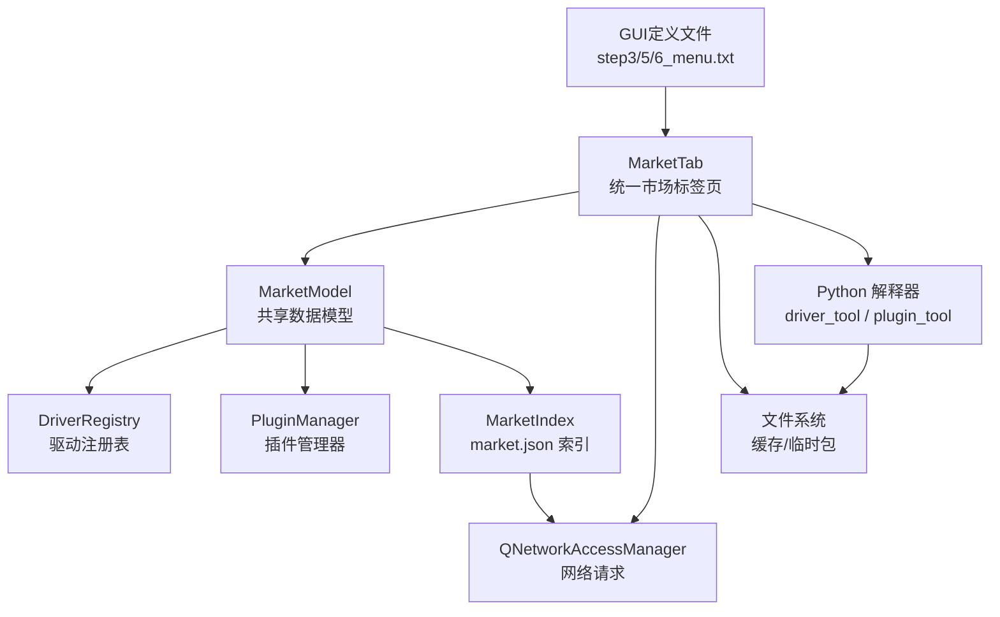
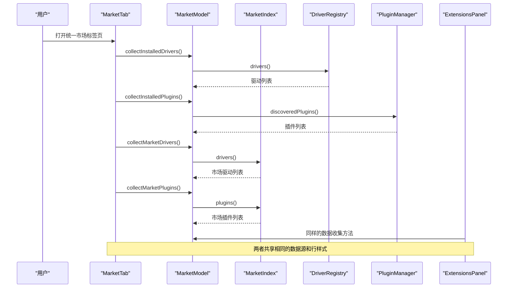
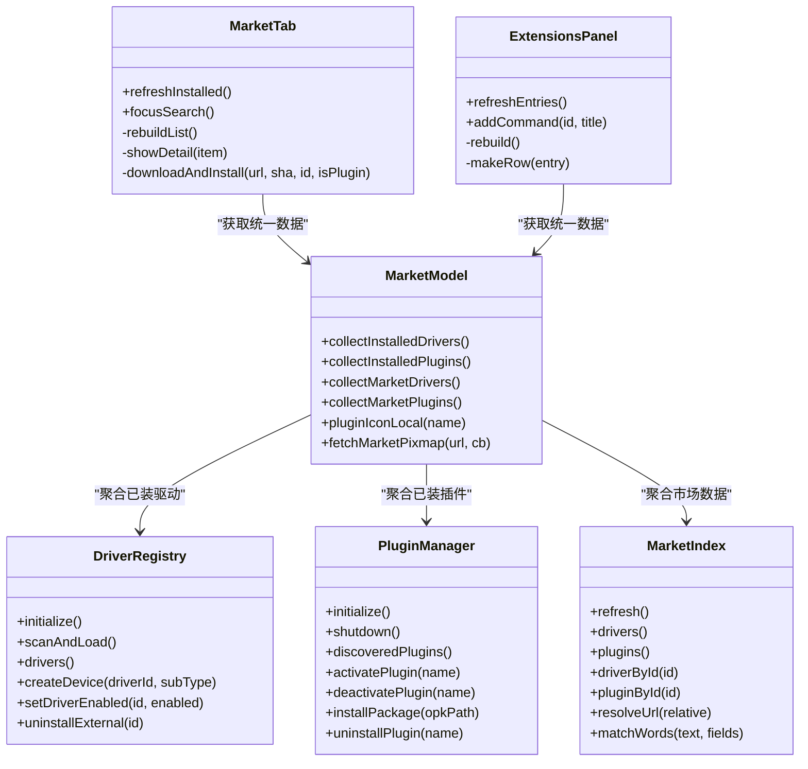

# 统一市场标签页系统

<cite>
**本文引用的文件**
- [README.md](file://README.md)
- [src/ui/marketmodel.h](file://src/ui/marketmodel.h)
- [src/ui/marketmodel.cpp](file://src/ui/marketmodel.cpp)
- [src/ui/markettab.h](file://src/ui/markettab.h)
- [src/ui/markettab.cpp](file://src/ui/markettab.cpp)
- [src/core/driver/marketindex.h](file://src/core/driver/marketindex.h)
- [src/core/driver/marketindex.cpp](file://src/core/driver/marketindex.cpp)
- [src/core/driver/driverregistry.h](file://src/core/driver/driverregistry.h)
- [src/core/plugin/pluginmanager.h](file://src/core/plugin/pluginmanager.h)
- [src/ui/panels/sidebarpanels.h](file://src/ui/panels/sidebarpanels.h)
- [src/ui/panels/sidebarpanels.cpp](file://src/ui/panels/sidebarpanels.cpp)
- [scripts/make_market.py](file://scripts/make_market.py)
- [.gui_v21/step3_markettab.txt](file://.gui_v21/step3_markettab.txt)
- [.gui_v21/step5_markettab.txt](file://.gui_v21/step5_markettab.txt)
- [.gui_v21/step6_menu.txt](file://.gui_v21/step6_menu.txt)
- [.gui_v21/step4_sidebar.txt](file://.gui_v21/step4_sidebar.txt)
- [.gui_v21/step8_menu.txt](file://.gui_v21/step8_menu.txt)
- [.gui_v21/step9_linkage.txt](file://.gui_v21/step9_linkage.txt)
- [doc/驱动系统方案.md](file://doc/驱动系统方案.md)
</cite>

## 更新摘要
**变更内容**
- 新增GUI定义文件：step3_markettab.txt、step5_markettab.txt、step6_menu.txt等，提供完整的市场界面布局定义
- 增强MarketTab UI组件，支持三分组列表展示（已安装/驱动市场/插件市场）
- 完善侧边栏小市场功能，提供紧凑的插件和驱动管理界面
- 优化搜索和筛选功能，支持多词AND搜索与全部/驱动/插件筛选按钮
- 改进图标加载机制，支持本地缓存和网络异步加载
- 增强安装流程，支持离线安装和本地包管理

## 目录
1. [简介](#简介)
2. [项目结构](#项目结构)
3. [核心组件](#核心组件)
4. [架构总览](#架构总览)
5. [详细组件分析](#详细组件分析)
6. [依赖关系分析](#依赖关系分析)
7. [性能与可用性考量](#性能与可用性考量)
8. [故障排查指南](#故障排查指南)
9. [结论](#结论)
10. [附录](#附录)

## 简介
本系统为 openbus 的"统一市场标签页"，以 VS Code 扩展市场风格，将"驱动插件"和"工具插件"统一在一个标签页中进行搜索、浏览、安装、启停与卸载。其目标是：
- 将硬件驱动（原生 DLL）与 Python 工具插件（.opk）纳入同一市场索引与安装流程；
- 提供多词 AND 搜索、分组列表（已安装/驱动市场/插件市场）、详情图文与 Markdown 说明；
- 通过下载 → SHA256 校验 → 确认 → 热加载/安装的完整链路，实现"一键安装"体验；
- 与设备树、驱动注册表、插件管理器联动，使安装后即刻可用。

该能力在 README 中作为"硬件驱动与统一插件市场"的核心特性进行描述，并在驱动系统方案文档中给出 v2 演进路线与 UI 动线。

**章节来源**
- [README.md:76-82](file://README.md#L76-L82)
- [doc/驱动系统方案.md:1-15](file://doc/驱动系统方案.md#L1-L15)

## 项目结构
统一市场标签页由UI层、共享数据模型层、市场索引层、驱动注册表与插件管理器共同构成，配合本地脚本生成开发/演示用 market.json。

**图表来源**
- [src/ui/markettab.h:23-44](file://src/ui/markettab.h#L23-L44)
- [src/ui/marketmodel.h:62-76](file://src/ui/marketmodel.h#L62-L76)
- [src/core/driver/marketindex.h:14-26](file://src/core/driver/marketindex.h#L14-L26)
- [src/core/driver/driverregistry.h:15-27](file://src/core/driver/driverregistry.h#L15-L27)
- [src/core/plugin/pluginmanager.h:19-27](file://src/core/plugin/pluginmanager.h#L19-L27)
- [.gui_v21/step3_markettab.txt:1-55](file://.gui_v21/step3_markettab.txt#L1-L55)

**章节来源**
- [src/ui/markettab.h:23-44](file://src/ui/markettab.h#L23-L44)
- [src/ui/marketmodel.h:62-76](file://src/ui/marketmodel.h#L62-L76)
- [src/core/driver/marketindex.h:14-26](file://src/core/driver/marketindex.h#L14-L26)
- [src/core/driver/driverregistry.h:15-27](file://src/core/driver/driverregistry.h#L15-L27)
- [src/core/plugin/pluginmanager.h:19-27](file://src/core/plugin/pluginmanager.h#L19-L27)

## 核心组件
- **MarketModel**：新增的共享数据模型层，负责从 DriverRegistry、PluginManager、MarketIndex 聚合四源数据（已装驱动、已装插件、市场驱动、市场插件），提供统一的 MarketEntryData 数据结构。
- **MarketTab**：统一市场标签页 UI，现专注于用户交互和详情展示，通过 MarketModel 获取统一数据源。
- **MarketIndex**：异步拉取并解析 market.json（schema 2），提供 drivers[] 与 plugins[] 查询及 URL 解析。
- **DriverRegistry**：管理内置与外置驱动条目，支持扫描、热加载、启用/禁用、卸载。
- **PluginManager**：发现、激活/停用 Python 插件，处理主程序与宿主进程的消息交互，支持 .opk 安装/卸载。
- **ExtensionsPanel**：侧边栏小市场，复用 MarketModel 数据源，提供紧凑的三分组列表展示。
- **make_market.py**：生成本地 market.json（drivers[] + plugins[]），用于开发与演示环境。
- **GUI定义文件**：step3_markettab.txt、step5_markettab.txt、step6_menu.txt等，定义市场界面的布局和控件。

**章节来源**
- [src/ui/marketmodel.h:62-76](file://src/ui/marketmodel.h#L62-L76)
- [src/ui/markettab.h:23-44](file://src/ui/markettab.h#L23-L44)
- [src/core/driver/marketindex.h:14-26](file://src/core/driver/marketindex.h#L14-L26)
- [src/core/driver/driverregistry.h:15-27](file://src/core/driver/driverregistry.h#L15-L27)
- [src/core/plugin/pluginmanager.h:19-27](file://src/core/plugin/pluginmanager.h#L19-L27)
- [src/ui/panels/sidebarpanels.h:315-361](file://src/ui/panels/sidebarpanels.h#L315-L361)
- [scripts/make_market.py:1-14](file://scripts/make_market.py#L1-L14)
- [.gui_v21/step3_markettab.txt:1-55](file://.gui_v21/step3_markettab.txt#L1-L55)

## 架构总览
统一市场标签页采用"UI + 共享数据模型 + 索引 + 注册表/管理器 + 脚本"的分层架构：
- **UI 层**：MarketTab 提供用户交互，调用 MarketModel 获取统一数据，专注详情展示和操作。
- **共享数据模型层**：MarketModel 负责从各数据源聚合数据，提供统一的 MarketEntryData 结构，供 MarketTab 和侧边栏小市场共用。
- **索引层**：MarketIndex 负责从本地或远程获取 market.json，并提供按 id 检索与 URL 解析。
- **运行期管理**：DriverRegistry 与 PluginManager 分别管理驱动与插件的生命周期。
- **构建期脚本**：make_market.py 聚合驱动与插件元数据，生成可被 MarketIndex 消费的 market.json。
- **GUI定义层**：通过step3_markettab.txt等文件定义界面布局和控件配置。

**图表来源**
- [src/ui/markettab.cpp:440-524](file://src/ui/markettab.cpp#L440-L524)
- [src/ui/marketmodel.cpp:111-194](file://src/ui/marketmodel.cpp#L111-L194)
- [src/ui/panels/sidebarpanels.cpp:1228-1295](file://src/ui/panels/sidebarpanels.cpp#L1228-L1295)

## 详细组件分析

### MarketModel（共享数据模型层）
**新增** 职责与行为：
- 提供四个核心数据收集方法：collectInstalledDrivers()、collectInstalledPlugins()、collectMarketDrivers()、collectMarketPlugins()
- 定义统一的 MarketEntryData 结构，包含 MarketItem 标识、标题、元信息、状态、市场图标和搜索字段
- 实现 FrameRow 组件，用于列表行的显示和交互
- 提供 pluginIconLocal() 获取已装插件本地图标
- 实现 fetchMarketPixmap() 异步加载市场图标和图片，带磁盘缓存机制
- 提供 PluginUi::pluginIconPixmap() 绘制首字母头像兜底

关键方法路径参考：
- 数据收集：[collectInstalledDrivers:111-134](file://src/ui/marketmodel.cpp#L111-L134)
- 数据收集：[collectInstalledPlugins:136-156](file://src/ui/marketmodel.cpp#L136-L156)
- 数据收集：[collectMarketDrivers:158-176](file://src/ui/marketmodel.cpp#L158-L176)
- 数据收集：[collectMarketPlugins:178-194](file://src/ui/marketmodel.cpp#L178-L194)
- 图标加载：[fetchMarketPixmap:231-264](file://src/ui/marketmodel.cpp#L231-L264)
- 头像绘制：[pluginIconPixmap:29-80](file://src/ui/marketmodel.cpp#L29-L80)

**章节来源**
- [src/ui/marketmodel.h:14-84](file://src/ui/marketmodel.h#L14-L84)
- [src/ui/marketmodel.cpp:29-80](file://src/ui/marketmodel.cpp#L29-L80)
- [src/ui/marketmodel.cpp:111-194](file://src/ui/marketmodel.cpp#L111-L194)
- [src/ui/marketmodel.cpp:231-264](file://src/ui/marketmodel.cpp#L231-L264)

### MarketTab（简化的统一市场标签页）
**更新** 职责与行为：
- 现专注于用户交互界面，通过 MarketModel 获取统一数据源
- 构建三分组列表（已安装/驱动市场/插件市场），支持多词 AND 搜索与筛选按钮
- 详情区动态渲染：市场驱动（图文+设备简表+readme+安装/更新按钮）、已装驱动（状态+设备型号表+禁用/卸载）、市场插件（图标+描述+安装）、已装插件（启停小按钮）
- 安装链：下载 → sha256 → 驱动使用 driver_tool install 热加载；插件使用 PluginManager::installPackage
- 与外部联动：驱动安装成功后 emit driverInstalled，触发设备树刷新；插件启停通过信号交由 MainWindow 连接至 PluginManager

关键方法路径参考：
- 列表重建：[rebuildList:440-524](file://src/ui/markettab.cpp#L440-L524)
- 详情分发：[showDetail:569-595](file://src/ui/markettab.cpp#L569-L595)
- 市场驱动详情：[showMarketDriver:601-712](file://src/ui/markettab.cpp#L601-L712)
- 已装驱动详情：[showInstalledDriver:718-821](file://src/ui/markettab.cpp#L718-L821)
- 插件安装：[downloadAndInstall:1008-1077](file://src/ui/markettab.cpp#L1008-L1077)

**章节来源**
- [src/ui/markettab.h:23-44](file://src/ui/markettab.h#L23-L44)
- [src/ui/markettab.cpp:440-524](file://src/ui/markettab.cpp#L440-L524)
- [src/ui/markettab.cpp:569-821](file://src/ui/markettab.cpp#L569-L821)
- [src/ui/markettab.cpp:1008-1077](file://src/ui/markettab.cpp#L1008-L1077)

### ExtensionsPanel（侧边栏小市场）
**新增** 职责与行为：
- 复用 MarketModel 数据源，提供紧凑的三分组列表展示
- 支持搜索过滤，与 MarketTab 保持一致的搜索逻辑
- 提供齿轮菜单操作：已装驱动的启用/禁用/卸载，已装插件的启停/卸载
- 行点击事件跳转到 MarketTab 的对应详情页面
- 右上角菜单支持离线安装、打开市场页、刷新功能

关键方法路径参考：
- 数据重建：[rebuild:1228-1295](file://src/ui/panels/sidebarpanels.cpp#L1228-L1295)
- 行创建：[makeRow:1305-1385](file://src/ui/panels/sidebarpanels.cpp#L1305-L1385)
- 齿轮菜单：[showGearMenu:1438-1511](file://src/ui/panels/sidebarpanels.cpp#L1438-L1511)
- 菜单操作：[onMenuClicked:1417-1436](file://src/ui/panels/sidebarpanels.cpp#L1417-L1436)

**章节来源**
- [src/ui/panels/sidebarpanels.h:315-361](file://src/ui/panels/sidebarpanels.h#L315-L361)
- [src/ui/panels/sidebarpanels.cpp:1228-1511](file://src/ui/panels/sidebarpanels.cpp#L1228-L1511)

### GUI定义文件（界面布局配置）
**新增** 职责与行为：
- step3_markettab.txt：定义市场标签页的基础布局和初始状态
- step5_markettab.txt：定义完整的界面控件，包括搜索框、筛选按钮、列表项和详情区域
- step6_menu.txt：定义菜单栏和上下文菜单的配置
- step4_sidebar.txt：定义侧边栏小市场的布局
- step8_menu.txt：定义右键菜单选项
- step9_linkage.txt：定义界面元素之间的关联关系

关键文件路径参考：
- 基础布局：[step3_markettab.txt:1-55](file://.gui_v21/step3_markettab.txt#L1-L55)
- 完整界面：[step5_markettab.txt:1-65](file://.gui_v21/step5_markettab.txt#L1-L65)
- 菜单配置：[step6_menu.txt:1-137](file://.gui_v21/step6_menu.txt#L1-L137)
- 侧边栏布局：[step4_sidebar.txt:1-10](file://.gui_v21/step4_sidebar.txt#L1-L10)

**章节来源**
- [.gui_v21/step3_markettab.txt:1-55](file://.gui_v21/step3_markettab.txt#L1-L55)
- [.gui_v21/step5_markettab.txt:1-65](file://.gui_v21/step5_markettab.txt#L1-L65)
- [.gui_v21/step6_menu.txt:1-137](file://.gui_v21/step6_menu.txt#L1-L137)
- [.gui_v21/step4_sidebar.txt:1-10](file://.gui_v21/step4_sidebar.txt#L1-L10)
- [.gui_v21/step8_menu.txt:1-6](file://.gui_v21/step8_menu.txt#L1-L6)
- [.gui_v21/step9_linkage.txt:1-16](file://.gui_v21/step9_linkage.txt#L1-L16)

### MarketIndex（市场索引）
职责与行为：
- 定位 market.json：优先本地 build/market/market.json 或发布布局 market/market.json，否则回退到占位 URL。
- 异步拉取并解析 JSON，填充 drivers[] 与 plugins[]，暴露 updated 时间、错误信息。
- 提供 matchWords 多词 AND 匹配工具，供 UI 层过滤列表。
- resolveUrl 将相对路径解析为绝对 URL（考虑 base 字段）。

关键方法路径参考：
- 默认市场地址：[defaultMarketUrl:32-47](file://src/core/driver/marketindex.cpp#L32-L47)
- 拉取与解析：[refresh/onReplyFinished:49-138](file://src/core/driver/marketindex.cpp#L49-L138)
- 多词匹配：[matchWords:158-175](file://src/core/driver/marketindex.cpp#L158-L175)
- URL 解析：[resolveUrl:177-189](file://src/core/driver/marketindex.cpp#L177-L189)

**章节来源**
- [src/core/driver/marketindex.h:14-26](file://src/core/driver/marketindex.h#L14-L26)
- [src/core/driver/marketindex.cpp:32-47](file://src/core/driver/marketindex.cpp#L32-L47)
- [src/core/driver/marketindex.cpp:49-138](file://src/core/driver/marketindex.cpp#L49-L138)
- [src/core/driver/marketindex.cpp:158-189](file://src/core/driver/marketindex.cpp#L158-L189)

### DriverRegistry（驱动注册表）
职责与行为：
- 启动时注册内置驱动（ZLG/PEAK/Kvaser），扫描外置驱动（drivers/<id>/driver.json + dll），进行 ABI/架构预检后加载。
- 对外提供 drivers() 元数据、enumerateDevices() 聚合枚举、createDevice() 工厂创建。
- 支持热加载（scanAndLoad）、启用/禁用、卸载（删除安装目录，重启彻底移除）。
- 与 MarketTab 联动：安装/禁用/卸载后发出 driversChanged，触发设备树刷新。

关键方法路径参考：
- 初始化与扫描：[initialize/scanAndLoad](file://src/core/driver/driverregistry.h:51-55)
- 驱动条目与工厂：[drivers/enumerateDevices/createDevice](file://src/core/driver/driverregistry.h:57-65)
- 启用/禁用/卸载：[setDriverEnabled/uninstallExternal](file://src/core/driver/driverregistry.h:70-78)

**章节来源**
- [src/core/driver/driverregistry.h:15-27](file://src/core/driver/driverregistry.h#L15-L27)
- [src/core/driver/driverregistry.h:51-78](file://src/core/driver/driverregistry.h#L51-L78)

### PluginManager（插件管理器）
职责与行为：
- 发现 plugins/ 下的插件，启动 Python 宿主进程，不自动激活插件，等待用户双击触发。
- 提供 onFrameReceived 等事件转发给已激活插件，维护命令注册、输出消息、帧请求等双向通信。
- 支持 .opk 安装/卸载，管理激活/停用状态，记录宿主进程 PID。
- 与 MarketTab 联动：插件启停通过信号交由 MainWindow 连接至 activate/deactivate/toggle。

关键方法路径参考：
- 生命周期：[initialize/shutdown](file://src/core/plugin/pluginmanager.h:35-39)
- 插件发现与状态：[discoveredPlugins/isPluginEnabled/isPluginActivated/setPluginEnabled/reactivatePlugin](file://src/core/plugin/pluginmanager.h:41-49)
- 安装/卸载：[installPackage/uninstallPlugin](file://src/core/plugin/pluginmanager.h:112-120)

**章节来源**
- [src/core/plugin/pluginmanager.h:19-27](file://src/core/plugin/pluginmanager.h#L19-L27)
- [src/core/plugin/pluginmanager.h:35-49](file://src/core/plugin/pluginmanager.h#L35-L49)
- [src/core/plugin/pluginmanager.h:112-120](file://src/core/plugin/pluginmanager.h#L112-L120)

### make_market.py（本地市场生成脚本）
职责与行为：
- 扫描 drivers/<id>/driver.json 与 plugins/*/plugin.json，打包 .odp/.opk 到 build/market。
- 生成 schema 2 的 market.json，包含 drivers[]（按驱动聚合，内嵌 devices 简表与图文/说明/关键词）与 plugins[]。
- 复制 assets 资源到 build/market/assets，便于本地预览。

关键方法路径参考：
- 驱动打包与元数据：[build_driver](file://scripts/make_market.py:181-241)
- 插件打包与元数据：[build_plugin](file://scripts/make_market.py:244-286)
- 输出 market.json：[main](file://scripts/make_market.py:289-330)

**章节来源**
- [scripts/make_market.py:1-14](file://scripts/make_market.py#L1-L14)
- [scripts/make_market.py:181-241](file://scripts/make_market.py#L181-L241)
- [scripts/make_market.py:244-286](file://scripts/make_market.py#L244-L286)
- [scripts/make_market.py:289-330](file://scripts/make_market.py#L289-L330)

## 依赖关系分析
- **MarketTab** 依赖 MarketModel 获取统一数据源，不再直接访问各个数据管理器
- **MarketModel** 依赖 DriverRegistry、PluginManager、MarketIndex 进行数据聚合
- **ExtensionsPanel** 同样依赖 MarketModel，实现与 MarketTab 的数据一致性
- **MarketIndex** 依赖 QNetworkAccessManager 拉取 market.json，并通过 defaultMarketUrl 决定数据来源
- **DriverRegistry** 与 **PluginManager** 提供运行时管理能力，通过信号与槽机制与其他组件解耦
- **make_market.py** 是构建期脚本，不参与运行时，但为 MarketIndex 提供 schema 2 的 market.json
- **GUI定义文件** 为MarketTab提供界面布局配置，确保UI一致性

**图表来源**
- [src/ui/markettab.h:45-134](file://src/ui/markettab.h#L45-L134)
- [src/ui/marketmodel.h:62-76](file://src/ui/marketmodel.h#L62-L76)
- [src/ui/panels/sidebarpanels.h:315-361](file://src/ui/panels/sidebarpanels.h#L315-L361)
- [src/core/driver/marketindex.h:27-91](file://src/core/driver/marketindex.h#L27-L91)
- [src/core/driver/driverregistry.h:28-85](file://src/core/driver/driverregistry.h#L28-L85)
- [src/core/plugin/pluginmanager.h:28-120](file://src/core/plugin/pluginmanager.h#L28-L120)

**章节来源**
- [src/ui/markettab.h:45-134](file://src/ui/markettab.h#L45-L134)
- [src/ui/marketmodel.h:62-76](file://src/ui/marketmodel.h#L62-L76)
- [src/ui/panels/sidebarpanels.h:315-361](file://src/ui/panels/sidebarpanels.h#L315-L361)
- [src/core/driver/marketindex.h:27-91](file://src/core/driver/marketindex.h#L27-L91)
- [src/core/driver/driverregistry.h:28-85](file://src/core/driver/driverregistry.h#L28-L85)
- [src/core/plugin/pluginmanager.h:28-120](file://src/core/plugin/pluginmanager.h#L28-L120)

## 性能与可用性考量
- **数据聚合优化**：MarketModel 集中处理数据收集逻辑，避免重复查询，提升性能
- **列表构建与搜索**：rebuildList 每次清空并重绘，适合中小规模列表；若未来条目增多，可引入延迟渲染与虚拟列表优化
- **图片加载**：fetchMarketPixmap 使用 QNetworkAccessManager 异步下载，结合磁盘缓存减少重复 IO；详情页大图按需加载，避免阻塞
- **安装流程**：下载进度条显示，sha256 校验确保完整性；驱动热加载无需重启，提升用户体验
- **网络容错**：MarketIndex 对网络错误与 JSON 解析失败进行处理，并向 UI 反馈错误信息
- **侧边栏集成**：ExtensionsPanel 复用 MarketModel，保持与 MarketTab 一致的用户体验
- **GUI定义优化**：通过GUI定义文件统一管理界面布局，提高开发效率和界面一致性

## 故障排查指南
常见问题与定位：
- **市场加载失败**：检查 MarketIndex 的网络请求与 JSON 解析错误，查看状态栏提示与市场源 URL。
  - 参考路径：[onReplyFinished:59-76](file://src/core/driver/marketindex.cpp#L59-L76)
- **数据聚合异常**：检查 MarketModel 的四个数据收集方法是否正确返回数据
  - 参考路径：[collectInstalledDrivers:111-134](file://src/ui/marketmodel.cpp#L111-L134)
- **侧边栏显示问题**：检查 ExtensionsPanel 的 rebuild 方法是否正确调用 MarketModel
  - 参考路径：[rebuild:1228-1295](file://src/ui/panels/sidebarpanels.cpp#L1228-L1295)
- **驱动安装失败**：确认 driver_tool 执行结果与 sha256 校验；检查驱动包是否完整、ABI 是否兼容。
  - 参考路径：[installOdpFile/downloadAndInstall:1008-1077](file://src/ui/markettab.cpp#L1008-L1077)
- **插件安装失败**：确认 .opk 包有效，PluginManager::installPackage 返回错误信息。
  - 参考路径：[downloadAndInstall:1008-1077](file://src/ui/markettab.cpp#L1008-L1077)
- **设备树未刷新**：确认 DriverRegistry::driversChanged 信号已触发，MarketTab 已调用 refreshInstalled。
  - 参考路径：[onRefreshClicked:313-318](file://src/ui/markettab.cpp#L313-L318)
- **GUI布局异常**：检查GUI定义文件的坐标和控件配置是否正确
  - 参考路径：[step3_markettab.txt:1-55](file://.gui_v21/step3_markettab.txt#L1-L55)

**章节来源**
- [src/core/driver/marketindex.cpp:59-76](file://src/core/driver/marketindex.cpp#L59-L76)
- [src/ui/marketmodel.cpp:111-134](file://src/ui/marketmodel.cpp#L111-L134)
- [src/ui/panels/sidebarpanels.cpp:1228-1295](file://src/ui/panels/sidebarpanels.cpp#L1228-L1295)
- [src/ui/markettab.cpp:1008-1077](file://src/ui/markettab.cpp#L1008-L1077)
- [src/ui/markettab.cpp:313-318](file://src/ui/markettab.cpp#L313-L318)
- [.gui_v21/step3_markettab.txt:1-55](file://.gui_v21/step3_markettab.txt#L1-L55)

## 结论
统一市场标签页经过重大架构重构，引入了 MarketModel 共享数据模型层，实现了更好的代码复用和架构清晰度。新的架构特点包括：

1. **分层设计**：MarketModel 作为中间层，隔离了 UI 层与数据源的耦合
2. **统一数据源**：MarketTab 和侧边栏小市场共用相同的数据聚合逻辑
3. **简化实现**：MarketTab 专注于用户交互，数据收集逻辑迁移到 MarketModel
4. **增强集成**：侧边栏小市场提供紧凑的市场浏览体验，与主市场页保持一致性
5. **GUI定义标准化**：通过GUI定义文件统一管理界面布局，提高开发效率

通过 MarketModel 的共享数据模型、MarketIndex 的 schema 2 市场索引、DriverRegistry 的热加载机制与 PluginManager 的插件生命周期管理，实现了"一键安装、即装即用"的目标。结合本地脚本 make_market.py 和GUI定义文件，开发者可以快速生成演示市场和标准界面，加速迭代与测试。

## 附录
- **设计依据**：README 中对"硬件驱动与统一插件市场"的描述，以及驱动系统方案的 v2 演进路线。
- **相关文档**：
  - [README.md:76-82](file://README.md#L76-L82)
  - [doc/驱动系统方案.md:1-15](file://doc/驱动系统方案.md#L1-L15)