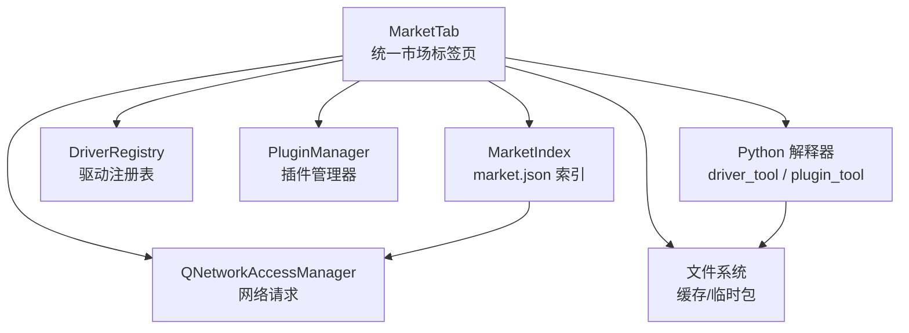
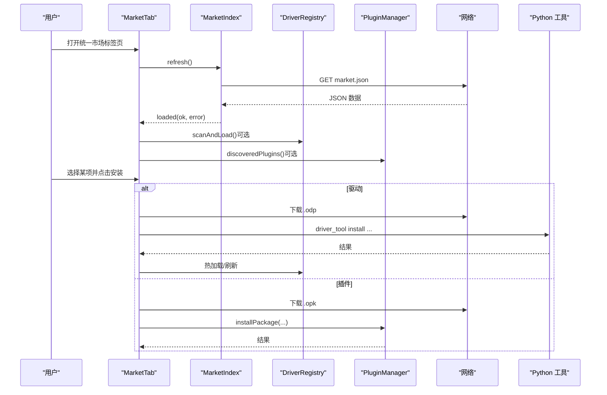
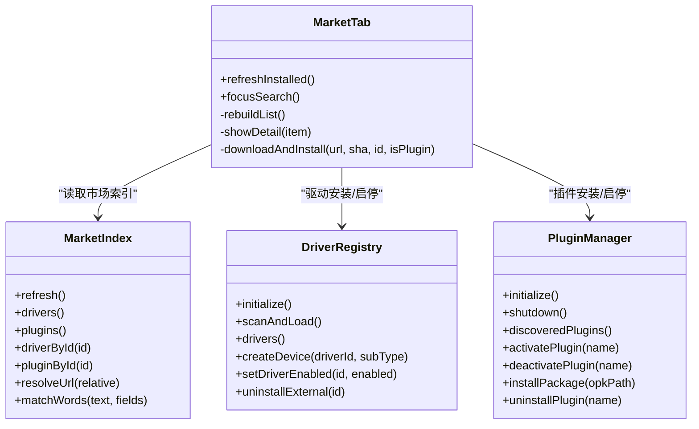

# 统一市场标签页系统

<cite>
**本文引用的文件**
- [README.md](file://README.md)
- [src/ui/markettab.h](file://src/ui/markettab.h)
- [src/ui/markettab.cpp](file://src/ui/markettab.cpp)
- [src/core/driver/marketindex.h](file://src/core/driver/marketindex.h)
- [src/core/driver/marketindex.cpp](file://src/core/driver/marketindex.cpp)
- [src/core/driver/driverregistry.h](file://src/core/driver/driverregistry.h)
- [src/core/plugin/pluginmanager.h](file://src/core/plugin/pluginmanager.h)
- [scripts/make_market.py](file://scripts/make_market.py)
- [doc/驱动系统方案.md](file://doc/驱动系统方案.md)
</cite>

## 目录
1. [简介](#简介)
2. [项目结构](#项目结构)
3. [核心组件](#核心组件)
4. [架构总览](#架构总览)
5. [详细组件分析](#详细组件分析)
6. [依赖关系分析](#依赖关系分析)
7. [性能与可用性考量](#性能与可用性考量)
8. [故障排查指南](#故障排查指南)
9. [结论](#结论)
10. [附录](#附录)

## 简介
本系统为 openbus 的“统一市场标签页”，以 VS Code 扩展市场风格，将“驱动插件”和“工具插件”统一在一个标签页中进行搜索、浏览、安装、启停与卸载。其目标是：
- 将硬件驱动（原生 DLL）与 Python 工具插件（.opk）纳入同一市场索引与安装流程；
- 提供多词 AND 搜索、分组列表（已安装/驱动市场/插件市场）、详情图文与 Markdown 说明；
- 通过下载 → SHA256 校验 → 确认 → 热加载/安装的完整链路，实现“一键安装”体验；
- 与设备树、驱动注册表、插件管理器联动，使安装后即刻可用。

该能力在 README 中作为“硬件驱动与统一插件市场”的核心特性进行描述，并在驱动系统方案文档中给出 v2 演进路线与 UI 动线。

**章节来源**
- [README.md:76-82](file://README.md#L76-L82)
- [doc/驱动系统方案.md:1-15](file://doc/驱动系统方案.md#L1-L15)

## 项目结构
统一市场标签页由 UI 层、市场索引层、驱动注册表与插件管理器共同构成，配合本地脚本生成开发/演示用 market.json。

**图表来源**
- [src/ui/markettab.h:23-44](file://src/ui/markettab.h#L23-L44)
- [src/core/driver/marketindex.h:14-26](file://src/core/driver/marketindex.h#L14-L26)
- [src/core/driver/driverregistry.h:15-27](file://src/core/driver/driverregistry.h#L15-L27)
- [src/core/plugin/pluginmanager.h:19-27](file://src/core/plugin/pluginmanager.h#L19-L27)

**章节来源**
- [src/ui/markettab.h:23-44](file://src/ui/markettab.h#L23-L44)
- [src/core/driver/marketindex.h:14-26](file://src/core/driver/marketindex.h#L14-L26)
- [src/core/driver/driverregistry.h:15-27](file://src/core/driver/driverregistry.h#L15-L27)
- [src/core/plugin/pluginmanager.h:19-27](file://src/core/plugin/pluginmanager.h#L19-L27)

## 核心组件
- MarketTab：统一市场标签页 UI，负责列表构建、搜索过滤、详情展示、安装/卸载操作、图片缓存与进度条。
- MarketIndex：异步拉取并解析 market.json（schema 2），提供 drivers[] 与 plugins[] 查询及 URL 解析。
- DriverRegistry：管理内置与外置驱动条目，支持扫描、热加载、启用/禁用、卸载。
- PluginManager：发现、激活/停用 Python 插件，处理主程序与宿主进程的消息交互，支持 .opk 安装/卸载。
- make_market.py：生成本地 market.json（drivers[] + plugins[]），用于开发与演示环境。

**章节来源**
- [src/ui/markettab.h:23-44](file://src/ui/markettab.h#L23-L44)
- [src/core/driver/marketindex.h:14-26](file://src/core/driver/marketindex.h#L14-L26)
- [src/core/driver/driverregistry.h:15-27](file://src/core/driver/driverregistry.h#L15-L27)
- [src/core/plugin/pluginmanager.h:19-27](file://src/core/plugin/pluginmanager.h#L19-L27)
- [scripts/make_market.py:1-14](file://scripts/make_market.py#L1-L14)

## 架构总览
统一市场标签页采用“UI + 索引 + 注册表/管理器 + 脚本”的分层架构：
- UI 层：MarketTab 提供用户交互，调用各服务完成安装/卸载/启停等操作。
- 索引层：MarketIndex 负责从本地或远程获取 market.json，并提供按 id 检索与 URL 解析。
- 运行期管理：DriverRegistry 与 PluginManager 分别管理驱动与插件的生命周期。
- 构建期脚本：make_market.py 聚合驱动与插件元数据，生成可被 MarketIndex 消费的 market.json。

**图表来源**
- [src/ui/markettab.cpp:188-195](file://src/ui/markettab.cpp#L188-L195)
- [src/core/driver/marketindex.cpp:49-57](file://src/core/driver/marketindex.cpp#L49-L57)
- [src/ui/markettab.cpp:316-321](file://src/ui/markettab.cpp#L316-L321)
- [src/ui/markettab.cpp:323-349](file://src/ui/markettab.cpp#L323-L349)

## 详细组件分析

### MarketTab（统一市场标签页）
职责与行为：
- 构建三分组列表（已安装/驱动市场/插件市场），支持多词 AND 搜索与筛选按钮（全部/驱动/插件）。
- 详情区动态渲染：市场驱动（图文+设备简表+readme+安装/更新按钮）、已装驱动（状态+设备型号表+禁用/卸载）、市场插件（图标+描述+安装）、已装插件（启停小按钮）。
- 安装链：下载 → sha256 → 驱动使用 driver_tool install 热加载；插件使用 PluginManager::installPackage。
- 图片缓存：基于 AppData/market-cache 的路径策略，避免重复下载。
- 与外部联动：驱动安装成功后 emit driverInstalled，触发设备树刷新；插件启停通过信号交由 MainWindow 连接至 PluginManager。

关键方法路径参考：
- 列表重建与搜索：[rebuildList:450-575](file://src/ui/markettab.cpp#L450-L575)
- 详情分发：[showDetail:620-646](file://src/ui/markettab.cpp#L620-L646)
- 市场驱动详情：[showMarketDriver:652-763](file://src/ui/markettab.cpp#L652-L763)
- 已装驱动详情：[showInstalledDriver:769-800](file://src/ui/markettab.cpp#L769-L800)
- 插件安装：[onInstallFromFile:323-349](file://src/ui/markettab.cpp#L323-L349)
- 下载与安装：[downloadAndInstall:104-106](file://src/ui/markettab.cpp#L104-L106)

**章节来源**
- [src/ui/markettab.h:23-44](file://src/ui/markettab.h#L23-L44)
- [src/ui/markettab.cpp:188-195](file://src/ui/markettab.cpp#L188-L195)
- [src/ui/markettab.cpp:316-349](file://src/ui/markettab.cpp#L316-L349)
- [src/ui/markettab.cpp:450-575](file://src/ui/markettab.cpp#L450-L575)
- [src/ui/markettab.cpp:620-763](file://src/ui/markettab.cpp#L620-L763)

### MarketIndex（市场索引）
职责与行为：
- 定位 market.json：优先本地 build/market/market.json 或发布布局 market/market.json，否则回退到占位 URL。
- 异步拉取并解析 JSON，填充 drivers[] 与 plugins[]，暴露 updated 时间、错误信息。
- 提供 matchWords 多词 AND 匹配工具，供 UI 层过滤列表。
- resolveUrl 将相对路径解析为绝对 URL（考虑 base 字段）。

关键方法路径参考：
- 默认市场地址：[defaultMarketUrl:32-47](file://src/core/driver/marketindex.cpp#L32-L47)
- 拉取与解析：[refresh/onReplyFinished:49-138](file://src/core/driver/marketindex.cpp#L49-L138)
- 多词匹配：[matchWords:158-175](file://src/core/driver/marketindex.cpp#L158-L175)
- URL 解析：[resolveUrl:177-189](file://src/core/driver/marketindex.cpp#L177-L189)

**章节来源**
- [src/core/driver/marketindex.h:14-26](file://src/core/driver/marketindex.h#L14-L26)
- [src/core/driver/marketindex.cpp:32-47](file://src/core/driver/marketindex.cpp#L32-L47)
- [src/core/driver/marketindex.cpp:49-138](file://src/core/driver/marketindex.cpp#L49-L138)
- [src/core/driver/marketindex.cpp:158-189](file://src/core/driver/marketindex.cpp#L158-L189)

### DriverRegistry（驱动注册表）
职责与行为：
- 启动时注册内置驱动（ZLG/PEAK/Kvaser），扫描外置驱动（drivers/<id>/driver.json + dll），进行 ABI/架构预检后加载。
- 对外提供 drivers() 元数据、enumerateDevices() 聚合枚举、createDevice() 工厂创建。
- 支持热加载（scanAndLoad）、启用/禁用、卸载（删除安装目录，重启彻底移除）。
- 与 MarketTab 联动：安装/禁用/卸载后发出 driversChanged，触发设备树刷新。

关键方法路径参考：
- 初始化与扫描：[initialize/scanAndLoad](file://src/core/driver/driverregistry.h:51-55)
- 驱动条目与工厂：[drivers/enumerateDevices/createDevice](file://src/core/driver/driverregistry.h:57-65)
- 启用/禁用/卸载：[setDriverEnabled/uninstallExternal](file://src/core/driver/driverregistry.h:70-78)

**章节来源**
- [src/core/driver/driverregistry.h:15-27](file://src/core/driver/driverregistry.h#L15-L27)
- [src/core/driver/driverregistry.h:51-78](file://src/core/driver/driverregistry.h#L51-L78)

### PluginManager（插件管理器）
职责与行为：
- 发现 plugins/ 下的插件，启动 Python 宿主进程，不自动激活插件，等待用户双击触发。
- 提供 onFrameReceived 等事件转发给已激活插件，维护命令注册、输出消息、帧请求等双向通信。
- 支持 .opk 安装/卸载，管理激活/停用状态，记录宿主进程 PID。
- 与 MarketTab 联动：插件启停通过信号交由 MainWindow 连接至 activate/deactivate/toggle。

关键方法路径参考：
- 生命周期：[initialize/shutdown](file://src/core/plugin/pluginmanager.h:35-39)
- 插件发现与状态：[discoveredPlugins/isPluginEnabled/isPluginActivated/setPluginEnabled/reactivatePlugin](file://src/core/plugin/pluginmanager.h:41-49)
- 安装/卸载：[installPackage/uninstallPlugin](file://src/core/plugin/pluginmanager.h:112-120)

**章节来源**
- [src/core/plugin/pluginmanager.h:19-27](file://src/core/plugin/pluginmanager.h#L19-L27)
- [src/core/plugin/pluginmanager.h:35-49](file://src/core/plugin/pluginmanager.h#L35-L49)
- [src/core/plugin/pluginmanager.h:112-120](file://src/core/plugin/pluginmanager.h#L112-L120)

### make_market.py（本地市场生成脚本）
职责与行为：
- 扫描 drivers/<id>/driver.json 与 plugins/*/plugin.json，打包 .odp/.opk 到 build/market。
- 生成 schema 2 的 market.json，包含 drivers[]（按驱动聚合，内嵌 devices 简表与图文/说明/关键词）与 plugins[]。
- 复制 assets 资源到 build/market/assets，便于本地预览。

关键方法路径参考：
- 驱动打包与元数据：[build_driver](file://scripts/make_market.py:181-241)
- 插件打包与元数据：[build_plugin](file://scripts/make_market.py:244-286)
- 输出 market.json：[main](file://scripts/make_market.py:289-330)

**章节来源**
- [scripts/make_market.py:1-14](file://scripts/make_market.py#L1-L14)
- [scripts/make_market.py:181-241](file://scripts/make_market.py#L181-L241)
- [scripts/make_market.py:244-286](file://scripts/make_market.py#L244-L286)
- [scripts/make_market.py:289-330](file://scripts/make_market.py#L289-L330)

## 依赖关系分析
- MarketTab 依赖 MarketIndex 获取市场数据，依赖 DriverRegistry 与 PluginManager 执行安装/启停。
- MarketIndex 依赖 QNetworkAccessManager 拉取 market.json，并通过 defaultMarketUrl 决定数据来源。
- DriverRegistry 与 PluginManager 提供运行时管理能力，MarketTab 通过信号与槽与其解耦。
- make_market.py 是构建期脚本，不参与运行时，但为 MarketIndex 提供 schema 2 的 market.json。

**图表来源**
- [src/ui/markettab.h:45-134](file://src/ui/markettab.h#L45-L134)
- [src/core/driver/marketindex.h:27-91](file://src/core/driver/marketindex.h#L27-L91)
- [src/core/driver/driverregistry.h:28-85](file://src/core/driver/driverregistry.h#L28-L85)
- [src/core/plugin/pluginmanager.h:28-120](file://src/core/plugin/pluginmanager.h#L28-L120)

**章节来源**
- [src/ui/markettab.h:45-134](file://src/ui/markettab.h#L45-L134)
- [src/core/driver/marketindex.h:27-91](file://src/core/driver/marketindex.h#L27-L91)
- [src/core/driver/driverregistry.h:28-85](file://src/core/driver/driverregistry.h#L28-L85)
- [src/core/plugin/pluginmanager.h:28-120](file://src/core/plugin/pluginmanager.h#L28-L120)

## 性能与可用性考量
- 列表构建与搜索：rebuildList 每次清空并重绘，适合中小规模列表；若未来条目增多，可引入延迟渲染与虚拟列表优化。
- 图片加载：fetchPixmap 使用 QNetworkAccessManager 异步下载，结合磁盘缓存减少重复 IO；详情页大图按需加载，避免阻塞。
- 安装流程：下载进度条显示，sha256 校验确保完整性；驱动热加载无需重启，提升用户体验。
- 网络容错：MarketIndex 对网络错误与 JSON 解析失败进行处理，并向 UI 反馈错误信息。

[本节为通用指导，不直接分析具体文件]

## 故障排查指南
常见问题与定位：
- 市场加载失败：检查 MarketIndex 的网络请求与 JSON 解析错误，查看状态栏提示与市场源 URL。
  - 参考路径：[onReplyFinished:59-76](file://src/core/driver/marketindex.cpp#L59-L76)
- 驱动安装失败：确认 driver_tool 执行结果与 sha256 校验；检查驱动包是否完整、ABI 是否兼容。
  - 参考路径：[installOdpFile/downloadAndInstall:104-109](file://src/ui/markettab.cpp#L104-L109)
- 插件安装失败：确认 .opk 包有效，PluginManager::installPackage 返回错误信息。
  - 参考路径：[onInstallFromFile:323-349](file://src/ui/markettab.cpp#L323-L349)
- 设备树未刷新：确认 DriverRegistry::driversChanged 信号已触发，MarketTab 已调用 refreshInstalled。
  - 参考路径：[onRefreshClicked:316-321](file://src/ui/markettab.cpp#L316-L321)

**章节来源**
- [src/core/driver/marketindex.cpp:59-76](file://src/core/driver/marketindex.cpp#L59-L76)
- [src/ui/markettab.cpp:104-109](file://src/ui/markettab.cpp#L104-L109)
- [src/ui/markettab.cpp:316-349](file://src/ui/markettab.cpp#L316-L349)

## 结论
统一市场标签页将驱动与插件纳入同一市场索引与安装流程，提供了直观的搜索、详情与安装体验。通过 MarketIndex 的 schema 2 市场索引、DriverRegistry 的热加载机制与 PluginManager 的插件生命周期管理，实现了“一键安装、即装即用”的目标。结合本地脚本 make_market.py，开发者可以快速生成演示市场，加速迭代与测试。

[本节为总结性内容，不直接分析具体文件]

## 附录
- 设计依据：README 中对“硬件驱动与统一插件市场”的描述，以及驱动系统方案的 v2 演进路线。
- 相关文档：
  - [README.md:76-82](file://README.md#L76-L82)
  - [doc/驱动系统方案.md:1-15](file://doc/驱动系统方案.md#L1-L15)

[本节为补充信息，不直接分析具体文件]