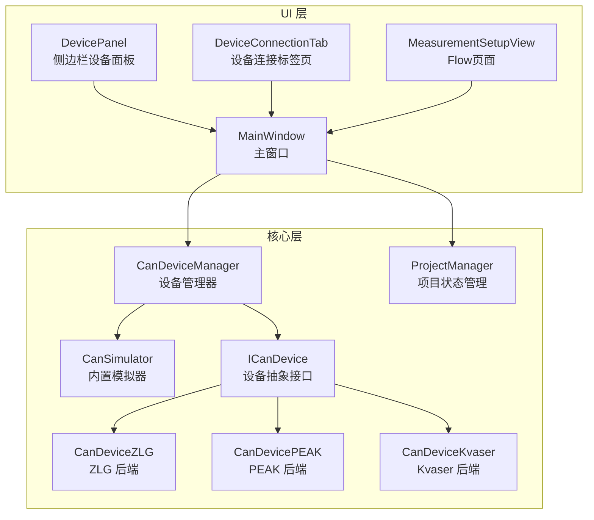
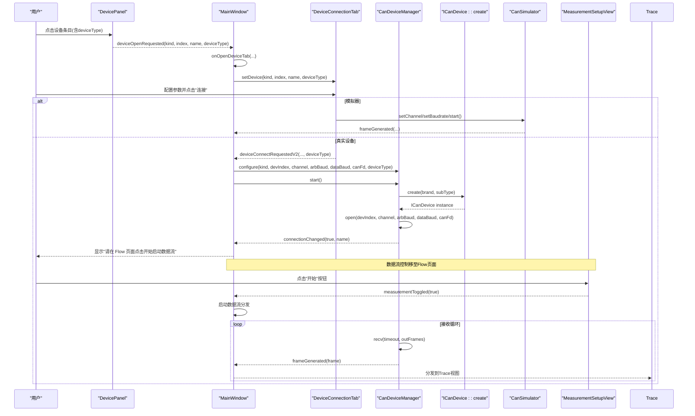
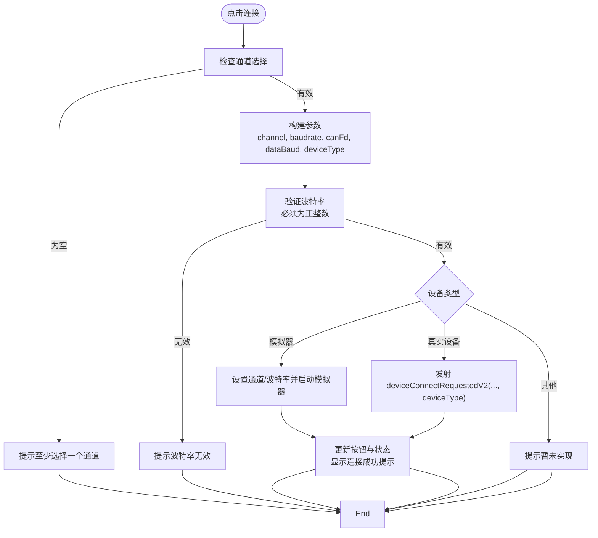
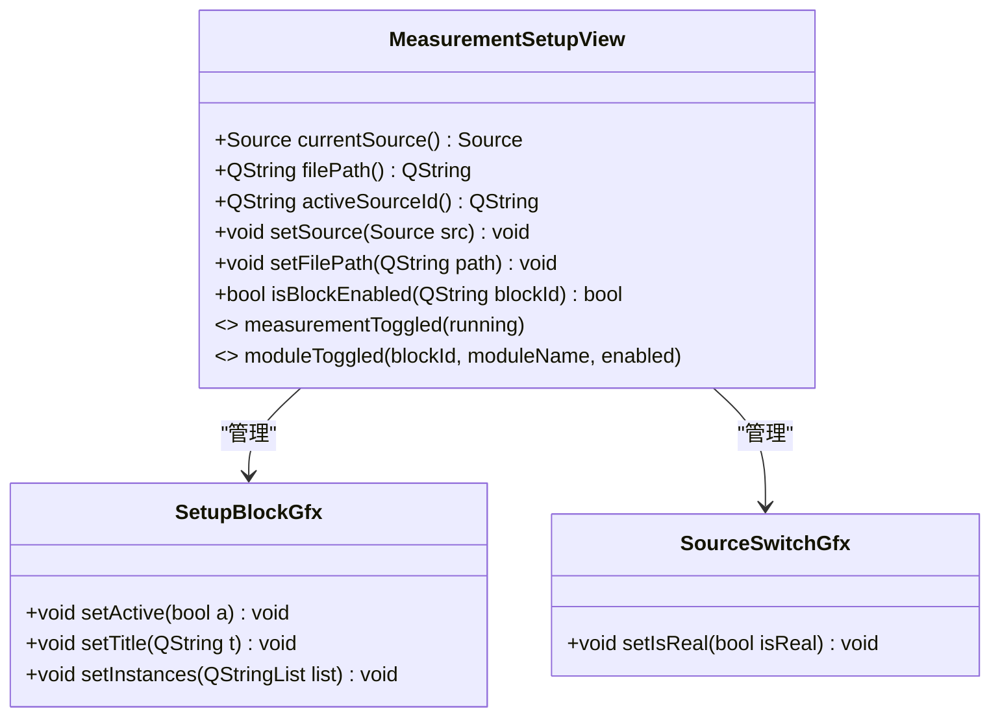
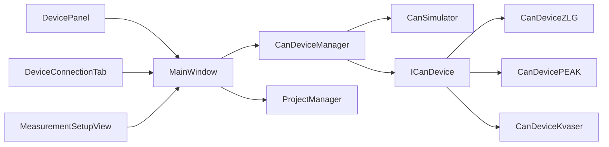

# 设备连接界面

<cite>
**本文引用的文件**   
- [deviceconnectiontab.h](file://src/ui/deviceconnectiontab.h)
- [deviceconnectiontab.cpp](file://src/ui/deviceconnectiontab.cpp)
- [candevicemanager.h](file://src/core/candevicemanager.h)
- [candevicemanager.cpp](file://src/core/candevicemanager.cpp)
- [candevice.h](file://src/core/candevice.h)
- [candevice.cpp](file://src/core/candevice.cpp)
- [cansimulator.h](file://src/core/cansimulator.h)
- [mainwindow.h](file://src/ui/mainwindow.h)
- [mainwindow.cpp](file://src/ui/mainwindow.cpp)
- [sidebarpanels.h](file://src/ui/panels/sidebarpanels.h)
- [sidebarpanels.cpp](file://src/ui/panels/sidebarpanels.cpp)
- [projectmanager.h](file://src/core/projectmanager.h)
- [projectmanager.cpp](file://src/core/projectmanager.cpp)
- [measurementsetupview.h](file://src/ui/measurementsetupview.h)
- [measurementsetupview.cpp](file://src/ui/measurementsetupview.cpp)
</cite>

## 更新摘要
**变更内容**   
- 设备连接界面不再自动启动数据流，连接成功后仅显示提示信息引导用户到Flow页面
- 数据流控制完全移至Flow页面（MeasurementSetupView），通过measurementToggled信号统一管理
- 实现了设备连接与数据流控制的解耦，提供更清晰的用户操作流程
- 更新了设备连接状态提示，明确指示用户需要在Flow页面手动启动数据流

## 目录
1. [简介](#简介)
2. [项目结构](#项目结构)
3. [核心组件](#核心组件)
4. [架构总览](#架构总览)
5. [详细组件分析](#详细组件分析)
6. [依赖关系分析](#依赖关系分析)
7. [性能考量](#性能考量)
8. [故障排查指南](#故障排查指南)
9. [结论](#结论)

## 简介
本文件围绕"设备连接界面"展开，系统性梳理从侧边栏设备面板到中央设备连接标签页的交互流程、参数配置与底层设备管理器的协作机制。该界面支持模拟器与真实硬件（当前已实现 ZLG、PEAK、Kvaser）两类数据源，提供通道选择、增强的波特率配置与时序预设、CAN FD 模式切换、连接/断开控制等能力，并通过统一的信号接口将帧数据接入主窗口的 Trace 视图。

**重要变更** 设备连接界面现已与数据流控制解耦，连接成功后不会自动启动数据流，而是引导用户到Flow页面进行数据流控制，提供更清晰的操作流程和更好的用户体验。

## 项目结构
设备连接相关代码分布在 UI 层与核心层：
- UI 层：设备连接标签页 DeviceConnectionTab、侧边栏设备面板 DevicePanel、Flow页面 MeasurementSetupView、主窗口 MainWindow 的连接编排
- 核心层：设备管理器 CanDeviceManager、抽象设备接口 ICanDevice、各厂商后端实现（ZLG、PEAK、Kvaser）、内置模拟器 CanSimulator
- 项目状态层：ProjectManager 负责配置序列化和恢复

**图表来源**
- [sidebarpanels.cpp:894-956](file://src/ui/panels/sidebarpanels.cpp#L894-L956)
- [deviceconnectiontab.cpp:210-236](file://src/ui/deviceconnectiontab.cpp#L210-L236)
- [measurementsetupview.cpp:1052-1069](file://src/ui/measurementsetupview.cpp#L1052-L1069)
- [mainwindow.cpp:1520-1561](file://src/ui/mainwindow.cpp#L1520-L1561)
- [candevicemanager.cpp:29-43](file://src/core/candevicemanager.cpp#L29-L43)
- [candevice.cpp:60-79](file://src/core/candevice.cpp#L60-L79)

章节来源
- [deviceconnectiontab.h:24-113](file://src/ui/deviceconnectiontab.h#L24-L113)
- [deviceconnectiontab.cpp:210-236](file://src/ui/deviceconnectiontab.cpp#L210-L236)
- [sidebarpanels.h:209-240](file://src/ui/panels/sidebarpanels.h#L209-L240)
- [sidebarpanels.cpp:894-956](file://src/ui/panels/sidebarpanels.cpp#L894-L956)
- [measurementsetupview.h:32-82](file://src/ui/measurementsetupview.h#L32-L82)
- [measurementsetupview.cpp:1052-1069](file://src/ui/measurementsetupview.cpp#L1052-L1069)
- [mainwindow.cpp:1520-1561](file://src/ui/mainwindow.cpp#L1520-L1561)
- [candevicemanager.h:25-129](file://src/core/candevicemanager.h#L25-L129)
- [candevicemanager.cpp:29-43](file://src/core/candevicemanager.cpp#L29-L43)
- [candevice.h:20-77](file://src/core/candevice.h#L20-L77)
- [cansimulator.h:20-66](file://src/core/cansimulator.h#L20-L66)
- [projectmanager.h:53-97](file://src/core/projectmanager.h#L53-L97)

## 核心组件
- DeviceConnectionTab：设备连接标签页，负责展示设备信息、基本配置（CAN/CAN FD、通道使能）、增强的仲裁段/数据段波特率配置与时序预设、连接/断开按钮及状态提示。**连接成功后不自动启动数据流，而是引导用户到Flow页面**。
- CanDeviceManager：统一设备管理器，屏蔽模拟器与真实设备的差异，对外暴露 start()/stop() 与 frameGenerated 信号；内部维护接收线程与无锁队列，批量消费并转发帧。
- ICanDevice：设备抽象接口，定义 open/close/send/recv/vendorCtrl 等统一契约，便于扩展多厂商后端。
- CanDeviceZLG/PEAK/Kvaser：各厂商设备后端，实现 ICanDevice 接口，支持特定厂商的设备子类型。
- CanSimulator：内置模拟器，后台线程生成混合流量，通过无锁队列与定时器在主线程批量 emit 帧。
- MeasurementSetupView：Flow页面，负责数据流的启动和停止控制，通过measurementToggled信号与主窗口通信。
- MainWindow：编排 UI 与核心组件的信号连接，处理设备连接请求、Flow页面控制与状态更新。
- ProjectManager：项目状态管理器，负责设备配置的 JSON 序列化和反序列化。

**更新** DeviceConnectionTab 现已与数据流控制解耦，连接成功后仅显示提示信息，不再自动启动数据流。MeasurementSetupView 成为数据流控制的唯一入口。

章节来源
- [deviceconnectiontab.h:34-58](file://src/ui/deviceconnectiontab.h#L34-L58)
- [deviceconnectiontab.cpp:210-236](file://src/ui/deviceconnectiontab.cpp#L210-L236)
- [measurementsetupview.h:66-82](file://src/ui/measurementsetupview.h#L66-L82)
- [measurementsetupview.cpp:1052-1069](file://src/ui/measurementsetupview.cpp#L1052-L1069)
- [candevicemanager.h:45-54](file://src/core/candevicemanager.h#L45-L54)
- [candevicemanager.cpp:29-43](file://src/core/candevicemanager.cpp#L29-L43)
- [candevice.h:20-77](file://src/core/candevice.h#L20-L77)
- [cansimulator.h:20-66](file://src/core/cansimulator.h#L20-L66)
- [mainwindow.cpp:1520-1561](file://src/ui/mainwindow.cpp#L1520-L1561)
- [projectmanager.h:53-97](file://src/core/projectmanager.h#L53-L97)

## 架构总览
设备连接界面的整体交互流程如下：用户在侧边栏设备面板中选择具体设备条目，触发打开设备连接标签页；标签页中完成参数配置后点击"连接"，根据设备类型走模拟器或真实设备路径；真实设备由 CanDeviceManager 统一管理，启动接收线程并将帧经无锁队列回传至主线程。**关键变更**：连接成功后不会自动启动数据流，而是显示提示信息引导用户到Flow页面进行数据流控制。

**图表来源**
- [sidebarpanels.cpp:958-980](file://src/ui/panels/sidebarpanels.cpp#L958-L980)
- [mainwindow.cpp:1520-1561](file://src/ui/mainwindow.cpp#L1520-L1561)
- [deviceconnectiontab.cpp:210-236](file://src/ui/deviceconnectiontab.cpp#L210-L236)
- [candevicemanager.cpp:57-113](file://src/core/candevicemanager.cpp#L57-L113)
- [candevice.cpp:60-79](file://src/core/candevice.cpp#L60-L79)
- [measurementsetupview.cpp:1052-1069](file://src/ui/measurementsetupview.cpp#L1052-L1069)

## 详细组件分析

### 设备连接标签页 DeviceConnectionTab
- 功能要点
  - 显示设备名称与状态，支持 CAN 2.0A/CAN FD 模式切换
  - 通道多选（至少选一个），默认启用通道 1
  - 增强的仲裁段波特率配置：支持可编辑的组合框，包含多个时序预设（含采样点、SJW/TSEG1/TSEG2 详情）
  - 改进的数据段波特率配置：仅在非模拟器且开启 CAN FD 时可见，同样支持可编辑输入
  - 严格的输入验证：在连接前验证波特率为有效的正整数
  - 连接/断开按钮状态联动，未实现设备类型给出提示
  - 设备子类型支持：通过 setDevice() 的 deviceType 参数接收厂商设备子类型，存储在 m_devSubType 成员中
  - 配置管理接口：提供 getter/setter 方法用于项目状态序列化
- 关键流程
  - setDevice() 设置设备类型、名称和设备子类型，并根据是否实现决定按钮可用性
  - onConnect() 增强验证：校验通道选择、波特率有效性，组装参数，模拟器直接调用模拟器 API，真实设备通过 V2 信号上报（包含 deviceType）
  - **连接成功后不自动启动数据流**：仅显示连接状态和提示信息
  - onDisconnect() 停止模拟器或通过信号通知上层断开
  - updateCanFdVisibility() 控制数据段配置区域的显隐
  - 配置捕获：baudrate()、channel()、isCanFd()、dataBaudrate()、deviceKind() 等方法用于获取当前配置
  - 配置恢复：setBaudrate()、setChannel()、setCanFd()、setDataBaudrate() 等方法用于恢复配置

**更新** 连接成功后不再自动启动数据流，改为显示提示信息引导用户到Flow页面进行数据流控制。

**图表来源**
- [deviceconnectiontab.cpp:210-236](file://src/ui/deviceconnectiontab.cpp#L210-L236)
- [deviceconnectiontab.cpp:238-305](file://src/ui/deviceconnectiontab.cpp#L238-L305)

章节来源
- [deviceconnectiontab.h:34-58](file://src/ui/deviceconnectiontab.h#L34-L58)
- [deviceconnectiontab.cpp:210-236](file://src/ui/deviceconnectiontab.cpp#L210-L236)
- [deviceconnectiontab.cpp:238-305](file://src/ui/deviceconnectiontab.cpp#L238-L305)
- [deviceconnectiontab.cpp:351-400](file://src/ui/deviceconnectiontab.cpp#L351-L400)

### Flow页面 MeasurementSetupView
- 职责
  - 提供可视化的测量配置画布，包含数据源、通道、数据库和分析模块
  - 通过工具栏的"开始"/"停止"按钮控制数据流的启动和停止
  - 通过measurementToggled信号与主窗口通信，统一管理数据流状态
  - 支持硬件实时和文件回放两种数据源模式
- 关键功能
  - onStartClicked()：启动数据流，设置运行状态并发送measurementToggled(true)
  - onStopClicked()：停止数据流，重置状态并发送measurementToggled(false)
  - 模块块控制：支持动态添加/删除Trace、Graphic等分析模块
  - 数据源切换：支持Real（硬件）和File（文件回放）模式的切换

**新增** Flow页面作为数据流控制的唯一入口，提供了更直观和可控的数据流管理方式。

**图表来源**
- [measurementsetupview.h:32-82](file://src/ui/measurementsetupview.h#L32-L82)
- [measurementsetupview.cpp:41-195](file://src/ui/measurementsetupview.cpp#L41-L195)
- [measurementsetupview.cpp:201-265](file://src/ui/measurementsetupview.cpp#L201-L265)

章节来源
- [measurementsetupview.h:32-82](file://src/ui/measurementsetupview.h#L32-L82)
- [measurementsetupview.cpp:1052-1069](file://src/ui/measurementsetupview.cpp#L1052-L1069)
- [measurementsetupview.cpp:305-363](file://src/ui/measurementsetupview.cpp#L305-L363)

### 设备管理器 CanDeviceManager
- 职责
  - 统一配置与运行控制（configure/start/stop）
  - 在真实设备模式下使用工厂方法创建对应后端实例（支持设备子类型），打开设备并启动接收线程
  - 使用无锁队列缓冲帧，主线程定时批量消费并发出 frameGenerated
  - 暴露 connectionChanged 与 errorOccurred 信号用于 UI 状态同步
- 关键点
  - 模拟器模式不重复启动，仅标记运行状态
  - 接收线程以超时方式批量 recv，空转时短暂休眠降低 CPU 占用
  - drainQueue 每 2ms 批量取帧，减少信号开销
  - 设备子类型处理：在start()方法中根据设备类型设置默认子类型，并通过ICanDevice::create()工厂方法创建设备实例

章节来源
- [candevicemanager.h:45-54](file://src/core/candevicemanager.h#L45-L54)
- [candevicemanager.cpp:29-43](file://src/core/candevicemanager.cpp#L29-L43)
- [candevicemanager.cpp:57-113](file://src/core/candevicemanager.cpp#L57-L113)
- [candevicemanager.cpp:180-192](file://src/core/candevicemanager.cpp#L180-L192)

### 主窗口 MainWindow 的连接编排
- 信号连接
  - 将 DeviceConnectionTab 的连接/断开信号与 CanDeviceManager 的运行控制关联
  - 将 CanDeviceManager 的 connectionChanged/errorOccurred 与底部输出/状态栏联动
  - **关键变更**：设备连接成功后显示提示信息，引导用户到Flow页面进行数据流控制
  - 将 MeasurementSetupView 的 measurementToggled 信号与数据流控制关联
- 设备标签页初始化
  - setupDeviceTab 绑定 V2 连接信号，调用 configure/start 启动真实设备（包含设备子类型）
  - **连接成功回调**：显示"✅ 设备已连接: [设备名] (请在 Flow 页面点击开始启动数据流)"
- Flow页面集成
  - onOpenMeasurementSetup 创建和管理Flow页面
  - measurementToggled 信号处理：根据当前数据源模式启动相应的数据流
  - 模块块控制：根据Flow页面的模块使能状态控制Trace/Graphic等模块的数据接收

**更新** 主窗口现已实现设备连接与数据流控制的解耦，连接成功后引导用户到Flow页面进行数据流控制。

章节来源
- [mainwindow.cpp:1520-1561](file://src/ui/mainwindow.cpp#L1520-L1561)
- [mainwindow.cpp:1569-1761](file://src/ui/mainwindow.cpp#L1569-L1761)
- [mainwindow.cpp:1692-1725](file://src/ui/mainwindow.cpp#L1692-L1725)

### 项目状态系统集成
- 配置捕获（captureProjectState）
  - 从 DeviceConnectionTab 获取当前设备配置
  - 保存到 ProjectState 结构中
  - 支持 CAN FD 模式和数据段波特率的序列化
- 配置恢复（applyProjectState）
  - 从 ProjectState 恢复设备配置到 DeviceConnectionTab
  - 保持界面状态与实际配置一致
  - 支持完整的设备参数恢复

章节来源
- [mainwindow.cpp:2495-2579](file://src/ui/mainwindow.cpp#L2495-L2579)
- [mainwindow.cpp:2581-2694](file://src/ui/mainwindow.cpp#L2581-L2694)
- [projectmanager.cpp:159-249](file://src/core/projectmanager.cpp#L159-L249)
- [projectmanager.h:53-97](file://src/core/projectmanager.h#L53-L97)

### 侧边栏设备面板 DevicePanel
- 功能要点
  - 树形展示设备类别（模拟器、ZLG、PEAK、Kvaser、CandleLight 等占位）
  - "扫描设备"按钮刷新列表
  - 点击叶子节点发出 deviceOpenRequested 信号，携带设备类型、序号、显示名和设备子类型
- 与主窗口协作
  - MainWindow::onOpenDeviceTab 查找或创建设备连接标签页，注入模拟器与管理器引用，并设置当前设备（包含设备子类型）

章节来源
- [sidebarpanels.cpp:894-956](file://src/ui/panels/sidebarpanels.cpp#L894-L956)
- [sidebarpanels.cpp:958-980](file://src/ui/panels/sidebarpanels.cpp#L958-L980)
- [mainwindow.cpp:1520-1561](file://src/ui/mainwindow.cpp#L1520-L1561)

## 依赖关系分析
- UI 层依赖
  - DevicePanel → MainWindow（事件，包含设备子类型）
  - DeviceConnectionTab → MainWindow（信号，包含设备子类型）
  - MeasurementSetupView → MainWindow（measurementToggled信号，控制数据流）
- 核心层依赖
  - CanDeviceManager → ICanDevice（抽象，支持设备子类型）
  - CanDeviceManager → CanSimulator（可选）
  - ICanDevice → 各厂商后端实现（ZLG、PEAK、Kvaser）
- 项目状态层依赖
  - MainWindow → ProjectManager（配置序列化）
  - DeviceConnectionTab → ProjectManager（配置捕获/恢复）
- 外部依赖
  - 各厂商后端动态加载相应DLL，缺失时 open() 返回 false，不影响其他后端

**图表来源**
- [sidebarpanels.cpp:958-980](file://src/ui/panels/sidebarpanels.cpp#L958-L980)
- [deviceconnectiontab.cpp:210-236](file://src/ui/deviceconnectiontab.cpp#L210-L236)
- [measurementsetupview.cpp:1052-1069](file://src/ui/measurementsetupview.cpp#L1052-L1069)
- [candevicemanager.cpp:29-43](file://src/core/candevicemanager.cpp#L29-L43)
- [candevice.cpp:60-79](file://src/core/candevice.cpp#L60-L79)

章节来源
- [sidebarpanels.h:209-240](file://src/ui/panels/sidebarpanels.h#L209-L240)
- [measurementsetupview.h:66-82](file://src/ui/measurementsetupview.h#L66-L82)
- [candevicemanager.h:45-54](file://src/core/candevicemanager.h#L45-L54)
- [candevice.h:20-77](file://src/core/candevice.h#L20-L77)

## 性能考量
- 帧接收路径采用生产者-消费者模型：
  - 接收线程批量 recv，入队无锁队列，避免阻塞 UI
  - 主线程定时器（2ms）批量消费，减少信号与 UI 更新频率
- 空闲时短暂休眠（1ms）降低 CPU 空转
- 模拟器同样采用后台线程生成 + 无锁队列 + 定时器批量 emit，保证高频场景稳定
- 项目状态序列化：使用高效的 JSON 序列化格式，避免频繁的磁盘 I/O
- 设备子类型处理：通过工厂模式避免重复的设备实例化，提高设备创建效率
- **数据流控制优化**：Flow页面集中管理数据流状态，避免重复启动/停止操作

## 故障排查指南
- 无法连接真实设备
  - 检查设备类型是否已实现（当前仅模拟器与 ZLG、PEAK、Kvaser）
  - 确认 DLL 可用（各厂商后端动态加载失败时 open() 返回 false）
  - 查看底部输出区的 errorOccurred 消息
- 未选择通道导致连接失败
  - 界面会弹出警告，需至少勾选一个通道
- 波特率输入无效
  - 确保输入的波特率为正整数，界面会进行严格验证
  - 可使用预设的波特率选项或手动输入有效值
- 设备子类型问题
  - 检查设备子类型是否正确传递（从侧边栏到设备管理器）
  - 确认设备子类型与设备型号匹配
  - 验证ICanDevice::create()方法是否正确处理设备子类型
- 连接后无帧显示
  - **关键**：确认已在Flow页面点击"开始"按钮启动数据流
  - 确认 CanDeviceManager 已启动且 connectionChanged(true)
  - 检查帧是否被正确 emit 并进入 onFrameReceived
- 断开后状态未恢复
  - 确保 onDisconnect 触发后按钮与状态标签复位
- 项目状态恢复问题
  - 检查 ProjectManager 是否正确序列化和反序列化配置
  - 确认 DeviceConnectionTab 的 getter/setter 方法正常工作
  - 验证 CAN FD 配置和数据段波特率的正确性
- **Flow页面相关问题**
  - 确认MeasurementSetupView已正确创建并显示
  - 检查measurementToggled信号是否正确连接到主窗口
  - 验证数据源模式（硬件/文件）设置是否正确

**更新** 新增了Flow页面相关的故障排查指导，帮助解决数据流控制相关问题。

章节来源
- [deviceconnectiontab.cpp:238-267](file://src/ui/deviceconnectiontab.cpp#L238-L267)
- [candevicemanager.cpp:57-113](file://src/core/candevicemanager.cpp#L57-L113)
- [candevice.cpp:60-79](file://src/core/candevice.cpp#L60-L79)
- [mainwindow.cpp:1520-1561](file://src/ui/mainwindow.cpp#L1520-L1561)
- [measurementsetupview.cpp:1052-1069](file://src/ui/measurementsetupview.cpp#L1052-L1069)
- [mainwindow.cpp:1692-1725](file://src/ui/mainwindow.cpp#L1692-L1725)

## 结论
设备连接界面通过清晰的 UI 分层与统一的核心设备管理器，实现了模拟器与真实硬件的一致体验。其设计重点在于：
- **增强的参数化配置与时序预设**：支持可编辑的波特率输入和丰富的预设选项，提升易用性
- **设备连接与数据流控制解耦**：连接成功后不自动启动数据流，引导用户到Flow页面进行控制，提供更清晰的操作流程
- **Flow页面集中控制**：通过MeasurementSetupView统一管理数据流的启动和停止，提供更好的用户体验
- **工厂模式集成**：通过ICanDevice::create()方法支持按品牌和子类型动态创建设备实例
- **改进的 CAN FD 支持**：提供更完善的数据段波特率配置选项
- **项目状态系统集成**：实现设备配置的自动序列化和恢复
- 无锁队列与定时器保障高吞吐下的稳定性
- 抽象接口与后端解耦，便于扩展更多厂商设备

**最新改进包括：**
- 设备连接与数据流控制的完全解耦，连接成功后仅显示提示信息
- Flow页面作为数据流控制的唯一入口，提供更直观的控制方式
- 改进的用户体验，明确的连接状态提示和操作引导
- 更好的错误处理和故障诊断能力

未来可在以下方面继续完善：
- 扩展更多厂商后端（TongXing、SLCAN 等）
- 增加高级时序手动编辑与校验
- 增强连接诊断与错误码映射
- 考虑添加波特率自动检测功能
- 优化项目状态序列化的性能和兼容性
- 增强Flow页面的可视化效果和交互体验
- 添加数据流监控和统计功能