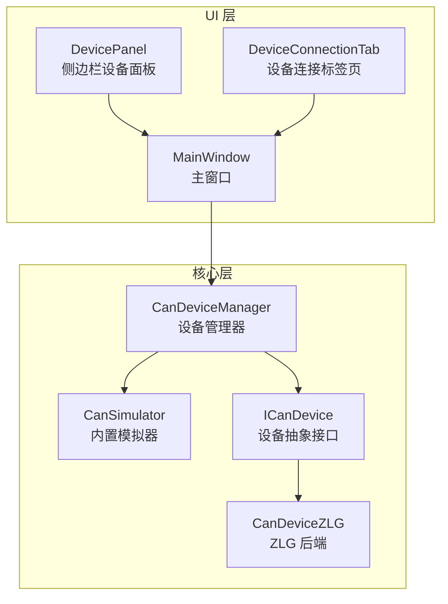
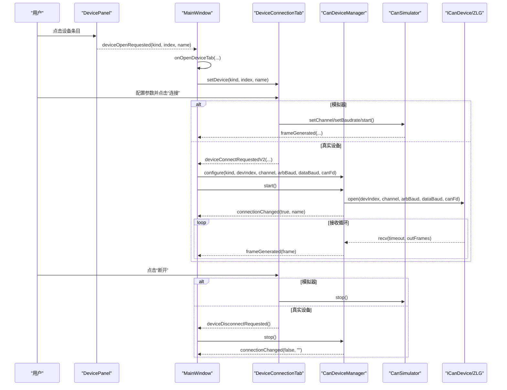
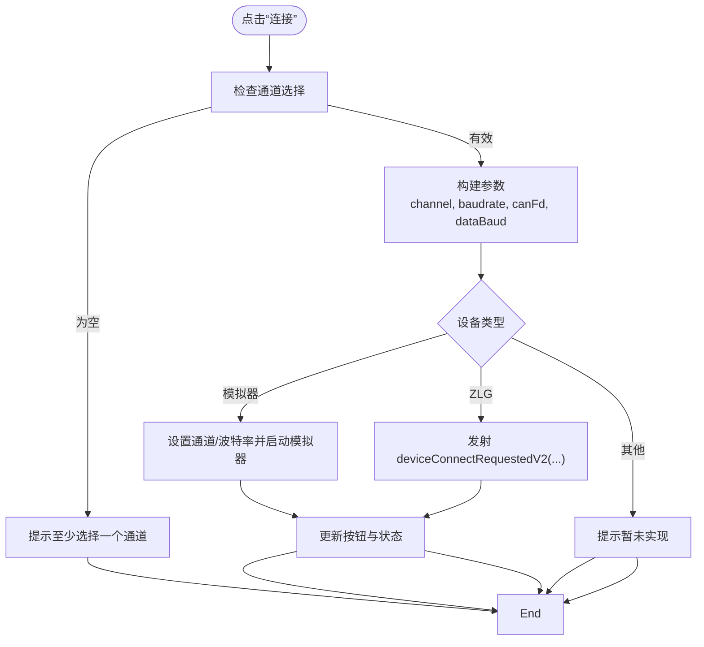
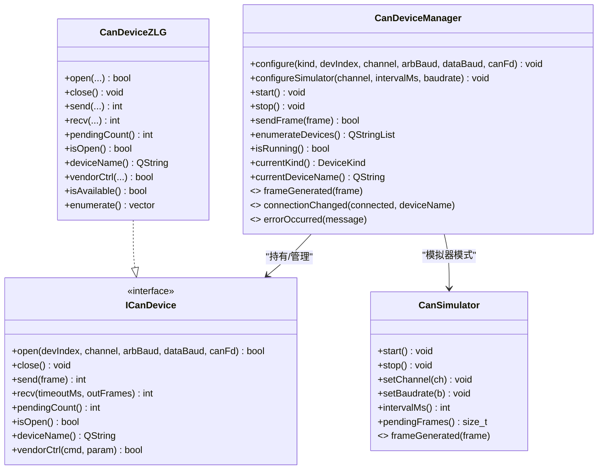
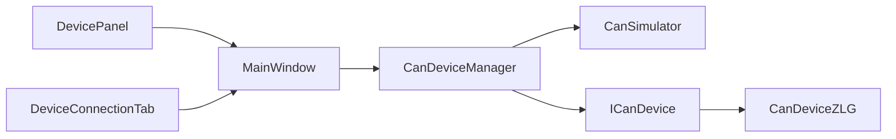

# 设备连接界面

<cite>
**本文引用的文件**   
- [deviceconnectiontab.h](file://src/ui/deviceconnectiontab.h)
- [deviceconnectiontab.cpp](file://src/ui/deviceconnectiontab.cpp)
- [candevicemanager.h](file://src/core/candevicemanager.h)
- [candevicemanager.cpp](file://src/core/candevicemanager.cpp)
- [candevice.h](file://src/core/candevice.h)
- [candevice_zlg.h](file://src/core/candevice_zlg.h)
- [cansimulator.h](file://src/core/cansimulator.h)
- [mainwindow.h](file://src/ui/mainwindow.h)
- [mainwindow.cpp](file://src/ui/mainwindow.cpp)
- [sidebarpanels.h](file://src/ui/panels/sidebarpanels.h)
- [sidebarpanels.cpp](file://src/ui/panels/sidebarpanels.cpp)
</cite>

## 目录
1. [简介](#简介)
2. [项目结构](#项目结构)
3. [核心组件](#核心组件)
4. [架构总览](#架构总览)
5. [详细组件分析](#详细组件分析)
6. [依赖关系分析](#依赖关系分析)
7. [性能考量](#性能考量)
8. [故障排查指南](#故障排查指南)
9. [结论](#结论)

## 简介
本文件围绕“设备连接界面”展开，系统性梳理从侧边栏设备面板到中央设备连接标签页的交互流程、参数配置与底层设备管理器的协作机制。该界面支持模拟器与真实硬件（当前已实现 ZLG）两类数据源，提供通道选择、波特率与时序预设、CAN FD 模式切换、连接/断开控制等能力，并通过统一的信号接口将帧数据接入主窗口的 Trace 视图。

## 项目结构
设备连接相关代码分布在 UI 层与核心层：
- UI 层：设备连接标签页 DeviceConnectionTab、侧边栏设备面板 DevicePanel、主窗口 MainWindow 的连接编排
- 核心层：设备管理器 CanDeviceManager、抽象设备接口 ICanDevice、ZLG 后端 CanDeviceZLG、内置模拟器 CanSimulator

图表来源
- [sidebarpanels.cpp:426-565](file://src/ui/panels/sidebarpanels.cpp#L426-L565)
- [deviceconnectiontab.cpp:16-146](file://src/ui/deviceconnectiontab.cpp#L16-L146)
- [mainwindow.cpp:1381-1432](file://src/ui/mainwindow.cpp#L1381-L1432)
- [candevicemanager.cpp:12-100](file://src/core/candevicemanager.cpp#L12-L100)
- [candevice.h:20-77](file://src/core/candevice.h#L20-L77)
- [candevice_zlg.h:19-58](file://src/core/candevice_zlg.h#L19-L58)
- [cansimulator.h:20-66](file://src/core/cansimulator.h#L20-L66)

章节来源
- [deviceconnectiontab.h:15-38](file://src/ui/deviceconnectiontab.h#L15-L38)
- [deviceconnectiontab.cpp:23-146](file://src/ui/deviceconnectiontab.cpp#L23-L146)
- [sidebarpanels.h:319-356](file://src/ui/panels/sidebarpanels.h#L319-L356)
- [sidebarpanels.cpp:426-565](file://src/ui/panels/sidebarpanels.cpp#L426-L565)
- [mainwindow.cpp:1381-1432](file://src/ui/mainwindow.cpp#L1381-L1432)
- [candevicemanager.h:25-117](file://src/core/candevicemanager.h#L25-L117)
- [candevicemanager.cpp:27-100](file://src/core/candevicemanager.cpp#L27-L100)
- [candevice.h:20-77](file://src/core/candevice.h#L20-L77)
- [candevice_zlg.h:19-58](file://src/core/candevice_zlg.h#L19-L58)
- [cansimulator.h:20-66](file://src/core/cansimulator.h#L20-L66)

## 核心组件
- DeviceConnectionTab：设备连接标签页，负责展示设备信息、基本配置（CAN/CAN FD、通道使能）、仲裁段/数据段波特率与时序预设、连接/断开按钮及状态提示。通过 setDevice() 切换不同设备类型，并在点击连接时发出连接请求信号。
- CanDeviceManager：统一设备管理器，屏蔽模拟器与真实设备的差异，对外暴露 start()/stop() 与 frameGenerated 信号；内部维护接收线程与无锁队列，批量消费并转发帧。
- ICanDevice：设备抽象接口，定义 open/close/send/recv/vendorCtrl 等统一契约，便于扩展多厂商后端。
- CanDeviceZLG：ZLG 设备后端，动态加载 SDK DLL，实现 ICanDevice 接口。
- CanSimulator：内置模拟器，后台线程生成混合流量，通过无锁队列与定时器在主线程批量 emit 帧。
- MainWindow：编排 UI 与核心组件的信号连接，处理设备连接请求、状态更新与错误提示。

章节来源
- [deviceconnectiontab.h:24-46](file://src/ui/deviceconnectiontab.h#L24-L46)
- [deviceconnectiontab.cpp:16-24](file://src/ui/deviceconnectiontab.cpp#L16-L24)
- [candevicemanager.h:25-117](file://src/core/candevicemanager.h#L25-L117)
- [candevicemanager.cpp:27-100](file://src/core/candevicemanager.cpp#L27-L100)
- [candevice.h:20-77](file://src/core/candevice.h#L20-L77)
- [candevice_zlg.h:19-58](file://src/core/candevice_zlg.h#L19-L58)
- [cansimulator.h:20-66](file://src/core/cansimulator.h#L20-L66)
- [mainwindow.cpp:105-126](file://src/ui/mainwindow.cpp#L105-L126)

## 架构总览
设备连接界面的整体交互流程如下：用户在侧边栏设备面板中选择具体设备条目，触发打开设备连接标签页；标签页中完成参数配置后点击“连接”，根据设备类型走模拟器或真实设备路径；真实设备由 CanDeviceManager 统一管理，启动接收线程并将帧经无锁队列回传至主线程，最终进入 Trace 视图。

图表来源
- [sidebarpanels.cpp:426-565](file://src/ui/panels/sidebarpanels.cpp#L426-L565)
- [mainwindow.cpp:1381-1432](file://src/ui/mainwindow.cpp#L1381-L1432)
- [deviceconnectiontab.cpp:226-301](file://src/ui/deviceconnectiontab.cpp#L226-L301)
- [candevicemanager.cpp:54-100](file://src/core/candevicemanager.cpp#L54-L100)
- [cansimulator.h:40-44](file://src/core/cansimulator.h#L40-L44)

## 详细组件分析

### 设备连接标签页 DeviceConnectionTab
- 功能要点
  - 显示设备名称与状态，支持 CAN 2.0A/CAN FD 模式切换
  - 通道多选（至少选一个），默认启用通道 1
  - 仲裁段波特率下拉与多个时序预设（含采样点、SJW/TSEG1/TSEG2 详情）
  - 数据段波特率与时序预设（仅在非模拟器且开启 CAN FD 时可见）
  - 连接/断开按钮状态联动，未实现设备类型给出提示
- 关键流程
  - setDevice() 设置设备类型与名称，并根据是否实现决定按钮可用性
  - onConnect() 校验通道选择，组装参数，模拟器直接调用模拟器 API，真实设备通过 V2 信号上报
  - onDisconnect() 停止模拟器或通过信号通知上层断开
  - updateCanFdVisibility() 控制数据段配置区域的显隐

图表来源
- [deviceconnectiontab.cpp:226-301](file://src/ui/deviceconnectiontab.cpp#L226-L301)
- [deviceconnectiontab.cpp:321-326](file://src/ui/deviceconnectiontab.cpp#L321-L326)

章节来源
- [deviceconnectiontab.h:24-46](file://src/ui/deviceconnectiontab.h#L24-L46)
- [deviceconnectiontab.cpp:23-146](file://src/ui/deviceconnectiontab.cpp#L23-L146)
- [deviceconnectiontab.cpp:199-224](file://src/ui/deviceconnectiontab.cpp#L199-L224)
- [deviceconnectiontab.cpp:226-301](file://src/ui/deviceconnectiontab.cpp#L226-L301)
- [deviceconnectiontab.cpp:309-326](file://src/ui/deviceconnectiontab.cpp#L309-L326)

### 设备管理器 CanDeviceManager
- 职责
  - 统一配置与运行控制（configure/start/stop）
  - 在真实设备模式下创建对应后端实例（当前 ZLG），打开设备并启动接收线程
  - 使用无锁队列缓冲帧，主线程定时批量消费并发出 frameGenerated
  - 暴露 connectionChanged 与 errorOccurred 信号用于 UI 状态同步
- 关键点
  - 模拟器模式不重复启动，仅标记运行状态
  - 接收线程以超时方式批量 recv，空转时短暂休眠降低 CPU 占用
  - drainQueue 每 2ms 批量取帧，减少信号开销

图表来源
- [candevicemanager.h:25-117](file://src/core/candevicemanager.h#L25-L117)
- [candevicemanager.cpp:27-100](file://src/core/candevicemanager.cpp#L27-L100)
- [candevice.h:20-77](file://src/core/candevice.h#L20-L77)
- [candevice_zlg.h:19-58](file://src/core/candevice_zlg.h#L19-L58)
- [cansimulator.h:20-66](file://src/core/cansimulator.h#L20-L66)

章节来源
- [candevicemanager.h:25-117](file://src/core/candevicemanager.h#L25-L117)
- [candevemanager.cpp:12-100](file://src/core/candevicemanager.cpp#L12-L100)
- [candevicemanager.cpp:130-139](file://src/core/candevicemanager.cpp#L130-L139)
- [candevicemanager.cpp:187-203](file://src/core/candevicemanager.cpp#L187-L203)

### 侧边栏设备面板 DevicePanel
- 功能要点
  - 树形展示设备类别（模拟器、ZLG、PEAK、Kvaser、CandleLight 等占位）
  - “扫描设备”按钮刷新列表
  - 点击叶子节点发出 deviceOpenRequested 信号，携带设备类型、序号与显示名
- 与主窗口协作
  - MainWindow::onOpenDeviceTab 查找或创建设备连接标签页，注入模拟器与管理器引用，并设置当前设备

章节来源
- [sidebarpanels.cpp:426-565](file://src/ui/panels/sidebarpanels.cpp#L426-L565)
- [mainwindow.cpp:1381-1406](file://src/ui/mainwindow.cpp#L1381-L1406)

### 主窗口 MainWindow 的连接编排
- 信号连接
  - 将 DeviceConnectionTab 的连接/断开信号与 CanDeviceManager 的运行控制关联
  - 将 CanDeviceManager 的 connectionChanged/errorOccurred 与底部输出/状态栏联动
- 设备标签页初始化
  - setupDeviceTab 绑定 V2 连接信号，调用 configure/start 启动真实设备

章节来源
- [mainwindow.cpp:105-126](file://src/ui/mainwindow.cpp#L105-L126)
- [mainwindow.cpp:1409-1432](file://src/ui/mainwindow.cpp#L1409-L1432)

## 依赖关系分析
- UI 层依赖
  - DevicePanel → MainWindow（事件）
  - DeviceConnectionTab → MainWindow（信号）
- 核心层依赖
  - CanDeviceManager → ICanDevice（抽象）
  - CanDeviceManager → CanSimulator（可选）
  - CanDeviceZLG → ICanDevice（实现）
- 外部依赖
  - ZLG 后端动态加载 zlgcan.dll，缺失时 open() 返回 false，不影响其他后端

图表来源
- [sidebarpanels.cpp:426-565](file://src/ui/panels/sidebarpanels.cpp#L426-L565)
- [deviceconnectiontab.cpp:226-301](file://src/ui/deviceconnectiontab.cpp#L226-L301)
- [candevicemanager.cpp:27-100](file://src/core/candevicemanager.cpp#L27-L100)
- [candevice.h:20-77](file://src/core/candevice.h#L20-L77)
- [candevice_zlg.h:19-58](file://src/core/candevice_zlg.h#L19-L58)

章节来源
- [sidebarpanels.h:319-356](file://src/ui/panels/sidebarpanels.h#L319-L356)
- [candevicemanager.h:25-117](file://src/core/candevicemanager.h#L25-L117)
- [candevice.h:20-77](file://src/core/candevice.h#L20-L77)

## 性能考量
- 帧接收路径采用生产者-消费者模型：
  - 接收线程批量 recv，入队无锁队列，避免阻塞 UI
  - 主线程定时器（2ms）批量消费，减少信号与 UI 更新频率
- 空闲时短暂休眠（1ms）降低 CPU 空转
- 模拟器同样采用后台线程生成 + 无锁队列 + 定时器批量 emit，保证高频场景稳定

[本节为通用性能建议，不直接分析具体文件]

## 故障排查指南
- 无法连接真实设备
  - 检查设备类型是否已实现（当前仅模拟器与 ZLG）
  - 确认 DLL 可用（ZLG 后端动态加载失败时 open() 返回 false）
  - 查看底部输出区的 errorOccurred 消息
- 未选择通道导致连接失败
  - 界面会弹出警告，需至少勾选一个通道
- 连接后无帧显示
  - 确认 CanDeviceManager 已启动且 connectionChanged(true)
  - 检查帧是否被正确 emit 并进入 onFrameReceived
- 断开后状态未恢复
  - 确保 onDisconnect 触发后按钮与状态标签复位

章节来源
- [deviceconnectiontab.cpp:226-240](file://src/ui/deviceconnectiontab.cpp#L226-L240)
- [candevicemanager.cpp:69-84](file://src/core/candevicemanager.cpp#L69-L84)
- [mainwindow.cpp:112-126](file://src/ui/mainwindow.cpp#L112-L126)

## 结论
设备连接界面通过清晰的 UI 分层与统一的核心设备管理器，实现了模拟器与真实硬件的一致体验。其设计重点在于：
- 参数化配置与时序预设提升易用性
- 无锁队列与定时器保障高吞吐下的稳定性
- 抽象接口与后端解耦，便于扩展更多厂商设备

未来可在以下方面继续完善：
- 扩展更多厂商后端（PEAK、Kvaser、CandleLight 等）
- 增加高级时序手动编辑与校验
- 增强连接诊断与错误码映射