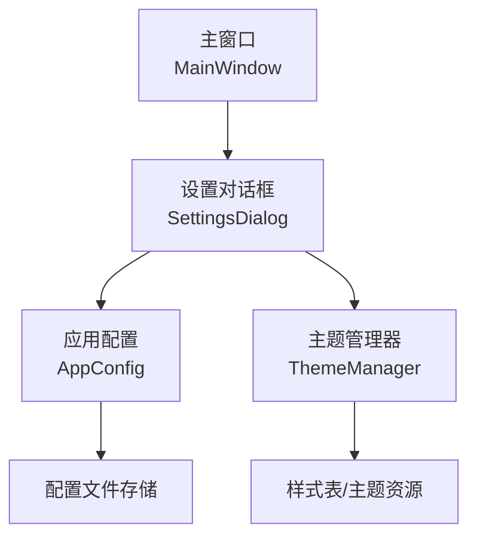
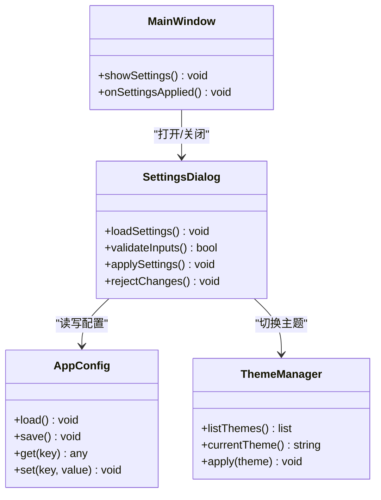
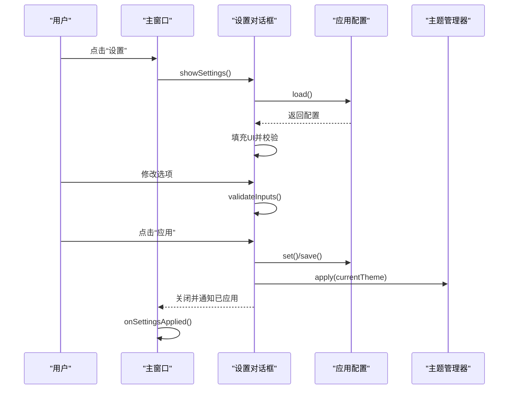
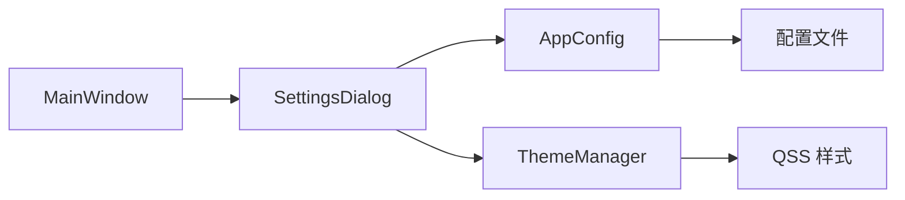

# 设置对话框界面

<cite>
**本文档引用的文件**   
- [settingsdialog.h](file://src/ui/settingsdialog.h)
- [settingsdialog.cpp](file://src/ui/settingsdialog.cpp)
- [mainwindow.h](file://src/ui/mainwindow.h)
- [mainwindow.cpp](file://src/ui/mainwindow.cpp)
- [appconfig.h](file://src/core/appconfig.h)
- [appconfig.cpp](file://src/core/appconfig.cpp)
- [thememanager.h](file://src/ui/thememanager.h)
- [thememanager.cpp](file://src/ui/thememanager.cpp)
</cite>

## 目录
1. [简介](#简介)
2. [项目结构](#项目结构)
3. [核心组件](#核心组件)
4. [架构总览](#架构总览)
5. [详细组件分析](#详细组件分析)
6. [依赖关系分析](#依赖关系分析)
7. [性能考虑](#性能考虑)
8. [故障排查指南](#故障排查指南)
9. [结论](#结论)
10. [附录](#附录)

## 简介
本文件聚焦于“设置对话框界面”的实现与集成，涵盖以下方面：
- 设置对话框的界面结构与交互流程
- 与主窗口、应用配置、主题管理器的数据绑定与持久化
- 关键类职责、调用序列与错误处理策略
- 可扩展性与性能优化建议

## 项目结构
设置对话框位于 UI 层，负责用户配置输入与确认；其数据通过应用配置模块进行持久化，并通过主题管理器影响界面外观。主窗口提供入口并协调对话框生命周期。

图表来源
- [mainwindow.h](file://src/ui/mainwindow.h)
- [mainwindow.cpp](file://src/ui/mainwindow.cpp)
- [settingsdialog.h](file://src/ui/settingsdialog.h)
- [settingsdialog.cpp](file://src/ui/settingsdialog.cpp)
- [appconfig.h](file://src/core/appconfig.h)
- [appconfig.cpp](file://src/core/appconfig.cpp)
- [thememanager.h](file://src/ui/thememanager.h)
- [thememanager.cpp](file://src/ui/thememanager.cpp)

章节来源
- [settingsdialog.h](file://src/ui/settingsdialog.h)
- [settingsdialog.cpp](file://src/ui/settingsdialog.cpp)
- [mainwindow.h](file://src/ui/mainwindow.h)
- [mainwindow.cpp](file://src/ui/mainwindow.cpp)
- [appconfig.h](file://src/core/appconfig.h)
- [appconfig.cpp](file://src/core/appconfig.cpp)
- [thememanager.h](file://src/ui/thememanager.h)
- [thememanager.cpp](file://src/ui/thememanager.cpp)

## 核心组件
- 设置对话框（SettingsDialog）
  - 负责展示和编辑用户可配置项，如界面语言、主题、日志级别、CAN 通道参数等
  - 提供“应用/取消”操作，支持预览与即时校验
  - 与 AppConfig 读写配置，与 ThemeManager 切换主题
- 主窗口（MainWindow）
  - 提供“设置”菜单或按钮触发对话框
  - 在对话框关闭后刷新视图或重新初始化相关子系统
- 应用配置（AppConfig）
  - 封装配置的加载、保存、默认值与迁移逻辑
  - 暴露键值接口供 UI 层读取与写入
- 主题管理器（ThemeManager）
  - 管理 QSS 样式与主题切换
  - 提供主题列表、当前主题查询与应用方法

章节来源
- [settingsdialog.h](file://src/ui/settingsdialog.h)
- [settingsdialog.cpp](file://src/ui/settingsdialog.cpp)
- [mainwindow.h](file://src/ui/mainwindow.h)
- [mainwindow.cpp](file://src/ui/mainwindow.cpp)
- [appconfig.h](file://src/core/appconfig.h)
- [appconfig.cpp](file://src/core/appconfig.cpp)
- [thememanager.h](file://src/ui/thememanager.h)
- [thememanager.cpp](file://src/ui/thememanager.cpp)

## 架构总览
设置对话框采用“UI-Model-Controller”分层思想：UI 层仅做输入与展示，业务逻辑由 AppConfig 与 ThemeManager 承担，主窗口作为控制器编排生命周期。

图表来源
- [mainwindow.h](file://src/ui/mainwindow.h)
- [mainwindow.cpp](file://src/ui/mainwindow.cpp)
- [settingsdialog.h](file://src/ui/settingsdialog.h)
- [settingsdialog.cpp](file://src/ui/settingsdialog.cpp)
- [appconfig.h](file://src/core/appconfig.h)
- [appconfig.cpp](file://src/core/appconfig.cpp)
- [thememanager.h](file://src/ui/thememanager.h)
- [thememanager.cpp](file://src/ui/thememanager.cpp)

## 详细组件分析

### 设置对话框（SettingsDialog）
- 职责
  - 渲染设置面板（分组、控件、提示、校验）
  - 将用户输入映射为配置键值对
  - 执行输入校验与反馈
  - 提交时调用 AppConfig 保存，必要时触发 ThemeManager 应用新主题
- 关键流程
  - 打开：从 AppConfig 加载当前配置到 UI
  - 修改：实时校验，禁用无效操作
  - 应用：保存配置，按需重启部分服务或刷新界面
  - 取消：丢弃未保存更改
- 典型交互序列

图表来源
- [mainwindow.cpp](file://src/ui/mainwindow.cpp)
- [settingsdialog.cpp](file://src/ui/settingsdialog.cpp)
- [appconfig.cpp](file://src/core/appconfig.cpp)
- [thememanager.cpp](file://src/ui/thememanager.cpp)

章节来源
- [settingsdialog.h](file://src/ui/settingsdialog.h)
- [settingsdialog.cpp](file://src/ui/settingsdialog.cpp)

### 主窗口（MainWindow）
- 职责
  - 提供设置入口
  - 管理设置对话框实例的生命周期
  - 在设置生效后刷新视图或重新初始化相关模块
- 关键点
  - 避免重复创建对话框实例
  - 正确处理模态/非模态显示
  - 捕获对话框返回值以决定后续行为

章节来源
- [mainwindow.h](file://src/ui/mainwindow.h)
- [mainwindow.cpp](file://src/ui/mainwindow.cpp)

### 应用配置（AppConfig）
- 职责
  - 统一配置源（内存缓存 + 持久化文件）
  - 提供类型安全的 get/set 接口
  - 处理默认值、版本迁移与异常恢复
- 关键点
  - 读写线程安全（若涉及多线程）
  - 失败回退策略（默认值、上次有效配置）
  - 批量更新与变更事件通知

章节来源
- [appconfig.h](file://src/core/appconfig.h)
- [appconfig.cpp](file://src/core/appconfig.cpp)

### 主题管理器（ThemeManager）
- 职责
  - 维护主题清单与当前主题
  - 加载并应用 QSS 样式
  - 提供主题切换 API 与状态查询
- 关键点
  - 样式资源路径管理
  - 切换时的最小化重绘与性能优化
  - 错误回滚（应用失败时恢复原主题）

章节来源
- [thememanager.h](file://src/ui/thememanager.h)
- [thememanager.cpp](file://src/ui/thememanager.cpp)

## 依赖关系分析
- 耦合关系
  - SettingsDialog 强依赖 AppConfig 与 ThemeManager
  - MainWindow 弱依赖 SettingsDialog（通过信号槽或返回值）
- 外部依赖
  - 文件系统（配置持久化）
  - Qt 样式系统（QSS）
- 潜在循环依赖
  - 确保 AppConfig 与 ThemeManager 不反向依赖 UI 层

图表来源
- [mainwindow.h](file://src/ui/mainwindow.h)
- [mainwindow.cpp](file://src/ui/mainwindow.cpp)
- [settingsdialog.h](file://src/ui/settingsdialog.h)
- [settingsdialog.cpp](file://src/ui/settingsdialog.cpp)
- [appconfig.h](file://src/core/appconfig.h)
- [appconfig.cpp](file://src/core/appconfig.cpp)
- [thememanager.h](file://src/ui/thememanager.h)
- [thememanager.cpp](file://src/ui/thememanager.cpp)

章节来源
- [settingsdialog.h](file://src/ui/settingsdialog.h)
- [settingsdialog.cpp](file://src/ui/settingsdialog.cpp)
- [appconfig.h](file://src/core/appconfig.h)
- [appconfig.cpp](file://src/core/appconfig.cpp)
- [thememanager.h](file://src/ui/thememanager.h)
- [thememanager.cpp](file://src/ui/thememanager.cpp)

## 性能考虑
- 延迟加载：仅在打开设置对话框时加载配置与主题列表
- 增量校验：输入变更时局部校验，避免全量重算
- 批量更新：应用设置时对 AppConfig 进行批量写入，减少 I/O 次数
- 样式切换优化：合并样式更新，避免频繁重绘
- 异步任务：耗时操作（如配置迁移、主题预渲染）放入后台线程并回调 UI

## 故障排查指南
- 常见问题
  - 设置未生效：检查是否调用了保存与刷新流程
  - 主题切换失败：验证 QSS 路径与权限，确认回滚机制
  - 配置损坏：启用默认值回退与备份恢复
  - 输入校验失败：定位具体字段与错误消息
- 调试建议
  - 增加关键路径日志（加载、校验、保存、应用）
  - 使用断点观察配置对象状态变化
  - 对比前后配置文件差异定位问题

章节来源
- [settingsdialog.cpp](file://src/ui/settingsdialog.cpp)
- [appconfig.cpp](file://src/core/appconfig.cpp)
- [thememanager.cpp](file://src/ui/thememanager.cpp)

## 结论
设置对话框通过清晰的职责划分与稳定的数据流，实现了用户配置的可维护与可扩展。结合 AppConfig 与 ThemeManager，既保证了配置的可靠性，也提升了界面的灵活性。建议在后续迭代中完善国际化、快捷键与无障碍支持，并持续优化性能与错误恢复能力。

## 附录
- 扩展建议
  - 新增设置项时，优先在 AppConfig 定义键值与默认值，再在 SettingsDialog 添加控件与校验
  - 主题扩展遵循 ThemeManager 的注册与加载规范
  - 对可能引发副作用的设置项，提供“预览/重启生效”模式