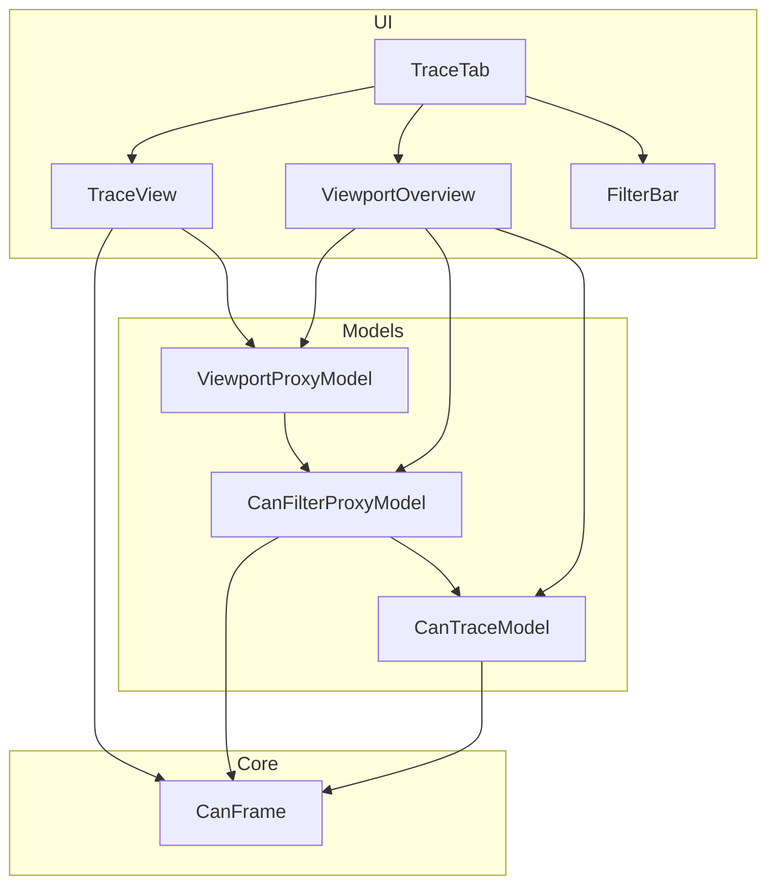
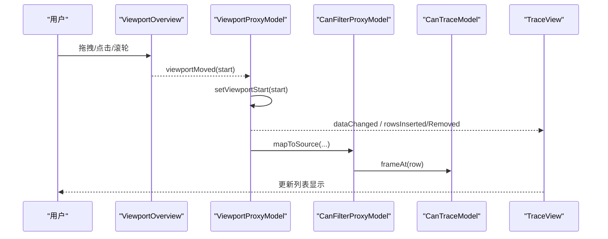
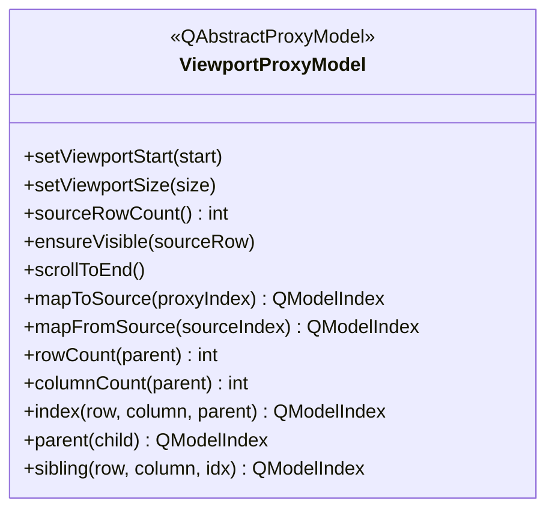
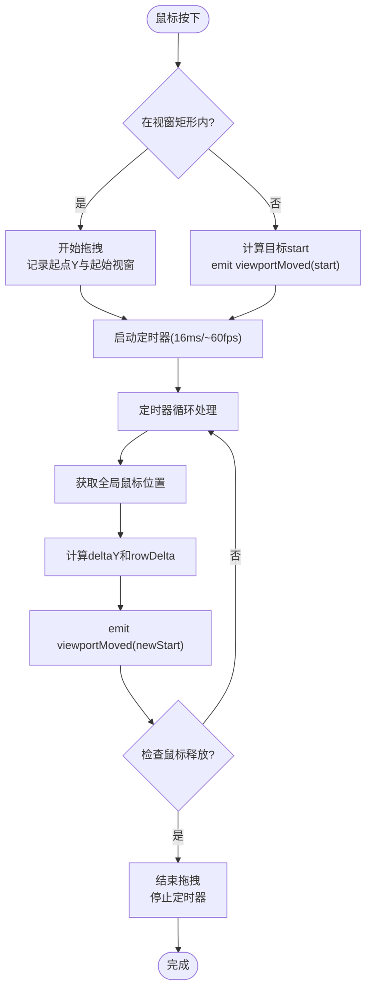
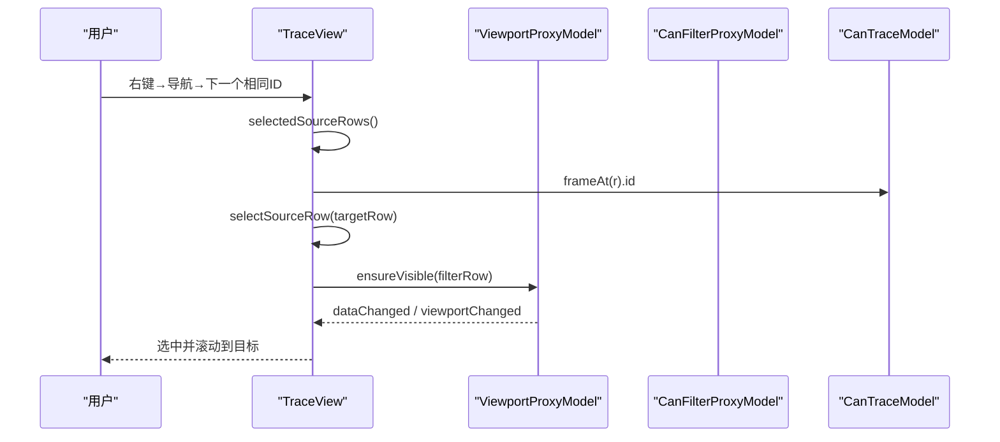
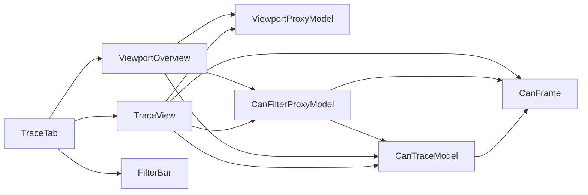

# 跟踪视图视口概览

<cite>
**本文引用的文件**
- [src/ui/traceview.h](file://src/ui/traceview.h)
- [src/ui/traceview.cpp](file://src/ui/traceview.cpp)
- [src/models/viewportproxy.h](file://src/models/viewportproxy.h)
- [src/models/viewportproxy.cpp](file://src/models/viewportproxy.cpp)
- [src/models/canfilterproxymodel.h](file://src/models/canfilterproxymodel.h)
- [src/models/cantracemodel.h](file://src/models/cantracemodel.h)
- [src/core/canframe.h](file://src/core/canframe.h)
</cite>

## 更新摘要
**所做更改**
- 更新了ViewportOverview组件的拖拽机制实现
- 添加了基于定时器的拖拽处理系统（~60fps）
- 实现了全局鼠标位置跟踪机制
- 增强了事件处理和光标管理功能
- 优化了拖拽性能和可靠性

## 目录
1. [简介](#简介)
2. [项目结构](#项目结构)
3. [核心组件](#核心组件)
4. [架构总览](#架构总览)
5. [详细组件分析](#详细组件分析)
6. [依赖关系分析](#依赖关系分析)
7. [性能考量](#性能考量)
8. [故障排查指南](#故障排查指南)
9. [结论](#结论)

## 简介
本文件聚焦"跟踪视图视口概览"能力，围绕 CANoe 风格的固定行数视窗与缩略图导航展开。该能力通过模型链将数据源、过滤层与视窗层解耦，使界面在海量帧数据下仍保持流畅交互：左侧为可视化的数据密度缩略图（可拖拽/点击跳转），右侧为报文列表；底部提供帧结构与信号解析面板。整体设计兼顾高性能渲染与直观导航。

**最新更新**：显著改进了视口拖拽机制，采用基于定时器的拖拽方式（~60fps），使用全局鼠标位置跟踪，增强了事件处理和光标管理，提升了拖拽性能和可靠性。

## 项目结构
跟踪视图相关代码主要分布在 UI 与 Models 两层：
- UI 层：TraceView、ViewportOverview、TraceTab、FilterBar 等负责交互与布局
- Models 层：CanTraceModel、CanFilterProxyModel、ViewportProxyModel 负责数据、过滤与视窗映射
- 数据载体：CanFrame 定义帧结构与时序信息

**图表来源**
- [src/ui/traceview.h:227-316](file://src/ui/traceview.h#L227-L316)
- [src/ui/traceview.cpp:1219-1433](file://src/ui/traceview.cpp#L1219-L1433)
- [src/models/viewportproxy.h:6-17](file://src/models/viewportproxy.h#L6-L17)
- [src/models/canfilterproxymodel.h:9-15](file://src/models/canfilterproxymodel.h#L9-L15)
- [src/models/cantracemodel.h:15-22](file://src/models/cantracemodel.h#L15-L22)
- [src/core/canframe.h:8-13](file://src/core/canframe.h#L8-L13)

**章节来源**
- [src/ui/traceview.h:227-316](file://src/ui/traceview.h#L227-L316)
- [src/ui/traceview.cpp:1219-1433](file://src/ui/traceview.cpp#L1219-L1433)
- [src/models/viewportproxy.h:6-17](file://src/models/viewportproxy.h#L6-L17)
- [src/models/canfilterproxymodel.h:9-15](file://src/models/canfilterproxymodel.h#L9-L15)
- [src/models/cantracemodel.h:15-22](file://src/models/cantracemodel.h#L15-L22)
- [src/core/canframe.h:8-13](file://src/core/canframe.h#L8-L13)

## 核心组件
- TraceView：CANoe/Wireshark 风格报文列表视图，支持列筛选、排序、选中保持、导航（GoTo/Find/Next Same ID）
- ViewportProxyModel：在过滤模型之上叠加"固定行数视窗"，仅暴露当前视窗内的行，外部滚动条控制视窗在全量数据中的位置
- CanFilterProxyModel：基于 FilterEngine 的主表达式 + 按列子过滤器，支持时间戳显示模式切换与分组统计
- CanTraceModel：高性能追踪数据模型，环形缓冲存储、延迟格式化、可见行缓存、批量提交刷新
- **ViewportOverview**：左侧缩略图控件，绘制 Rx/Tx 密度分布，高亮当前视窗区域，**采用基于定时器的拖拽机制（~60fps）**，支持拖拽/点击/滚轮移动视窗
- TraceTab：组合上述组件，构建三栏布局（过滤栏+工具条、报文列表、帧结构与信号解析）

**章节来源**
- [src/ui/traceview.h:21-113](file://src/ui/traceview.h#L21-L113)
- [src/models/viewportproxy.h:6-74](file://src/models/viewportproxy.h#L6-L74)
- [src/models/canfilterproxymodel.h:9-104](file://src/models/canfilterproxymodel.h#L9-L104)
- [src/models/cantracemodel.h:15-179](file://src/models/cantracemodel.h#L15-L179)
- [src/ui/traceview.h:161-225](file://src/ui/traceview.h#L161-L225)
- [src/ui/traceview.h:227-316](file://src/ui/traceview.h#L227-L316)

## 架构总览
模型链采用三层代理：CanTraceModel → CanFilterProxyModel → ViewportProxyModel → QTableView。ViewportProxyModel 将源模型的任意连续区间映射到固定大小的视窗内，QTableView 的内置滚动条仅在该视窗内滚动；外部通过 ViewportOverview 或 API 调整视窗起始位置，实现"大数据集下的稳定视图"。

**图表来源**
- [src/ui/traceview.cpp:1370-1384](file://src/ui/traceview.cpp#L1370-L1384)
- [src/models/viewportproxy.cpp:10-45](file://src/models/viewportproxy.cpp#L10-L45)
- [src/models/viewportproxy.cpp:87-106](file://src/models/viewportproxy.cpp#L87-L106)

## 详细组件分析

### ViewportProxyModel（视窗代理模型）
- 职责：维护视窗起始行与视窗大小，将源模型行号映射到视窗索引，处理结构变化并通知视图
- 关键行为：
  - setViewportStart：计算新行数，增量式发出 dataChanged/insert/remove/reset，避免全量刷新
  - ensureVisible：确保指定源行进入视窗（居中策略）
  - scrollToEnd：移动到末尾（最后 viewportSize 行）
  - mapToSource/mapFromSource：双向索引映射
  - 监听源模型事件：rowsInserted/rowsRemoved/modelReset/layoutChanged，自动调整视窗边界

**图表来源**
- [src/models/viewportproxy.h:18-74](file://src/models/viewportproxy.h#L18-L74)
- [src/models/viewportproxy.cpp:10-194](file://src/models/viewportproxy.cpp#L10-L194)

**章节来源**
- [src/models/viewportproxy.h:18-74](file://src/models/viewportproxy.h#L18-L74)
- [src/models/viewportproxy.cpp:10-194](file://src/models/viewportproxy.cpp#L10-L194)

### ViewportOverview（视窗缩略图控件）

**重大更新**：显著改进了拖拽机制，采用基于定时器的处理方式

- 职责：可视化全部数据的 Rx/Tx 密度，高亮当前视窗区域，支持拖拽、点击跳转、滚轮移动
- **新的拖拽机制**：
  - **定时器驱动**：使用 QTimer 以 ~60fps 频率处理拖拽事件（16ms间隔）
  - **全局鼠标跟踪**：通过 QCursor::pos() 获取全局鼠标坐标，不依赖 widget 内部事件传递
  - **增强的光标管理**：拖拽时显示 SizeVerCursor，释放时恢复 ArrowCursor
  - **健壮的拖拽状态管理**：防止 mouseReleaseEvent 未送达的情况
- 渲染优化：
  - 像素级采样：每行像素对应 total/h 行，采样统计 Rx/Tx 比例，绘制水平密度条
  - 缓存机制：Pixmap 缓存密度图，仅在尺寸/数据变化时重建，高频帧到达时通过定时器节流
- 交互逻辑：
  - mousePressEvent：判断是否在视窗区域内（拖拽）或外（跳转）
  - **onDragTimer**：定时器回调函数，处理实际的拖拽逻辑和视窗位置更新
  - wheelEvent：以 1/4 视窗步长滚动

**图表来源**
- [src/ui/traceview.cpp:985-1005](file://src/ui/traceview.cpp#L985-L1005)
- [src/ui/traceview.cpp:1209-1302](file://src/ui/traceview.cpp#L1209-L1302)
- [src/ui/traceview.cpp:1264-1302](file://src/ui/traceview.cpp#L1264-L1302)

**章节来源**
- [src/ui/traceview.cpp:985-1321](file://src/ui/traceview.cpp#L985-L1321)

### TraceView（报文列表视图）
- 职责：展示过滤后的报文列表，支持列筛选、排序、选中保持、Wireshark 风格导航
- 关键能力：
  - pinSelection/restoreSelection：过滤/排序前后锁定并恢复选中行
  - goToPacket/findNext/findPrevious/goToNextSameId/goToPrevSameId：快速定位
  - scrollToBottom：CANoe 视窗模式下移动视窗到底部并滚动至末行
  - 右键菜单：复制、过滤、发送到 Graphic、标记/着色、导航等

**图表来源**
- [src/ui/traceview.cpp:693-733](file://src/ui/traceview.cpp#L693-L733)
- [src/ui/traceview.cpp:596-626](file://src/ui/traceview.cpp#L596-L626)
- [src/models/viewportproxy.cpp:132-144](file://src/models/viewportproxy.cpp#L132-L144)

**章节来源**
- [src/ui/traceview.cpp:52-327](file://src/ui/traceview.cpp#L52-L327)
- [src/ui/traceview.cpp:515-779](file://src/ui/traceview.cpp#L515-L779)

### CanFilterProxyModel（过滤代理模型）
- 职责：主表达式过滤 + 按列子过滤，时间戳显示模式切换，分组计数
- 关键点：
  - filterAcceptsRow：结合主表达式与列过滤判定是否显示
  - lessThan：排序逻辑
  - invalidateFilter：过滤条件变化后重新计算 SinceDisplay 增量
  - packetCountChanged：捕获数/显示数变化通知

**章节来源**
- [src/models/canfilterproxymodel.h:9-104](file://src/models/canfilterproxymodel.h#L9-L104)

### CanTraceModel（追踪数据模型）
- 职责：高性能存储与访问帧数据，支持环形缓冲、覆盖模式、行缓存、批量提交
- 关键点：
  - appendFrame/appendFrames：实时追加与批量写入
  - setVisibleRange：通知可见行范围，淘汰不可见行缓存
  - framesCommitted：提交批次后触发统计更新与视窗自动跟随
  - 颜色规则与标记：支持行标记与自定义颜色

**章节来源**
- [src/models/cantracemodel.h:15-179](file://src/models/cantracemodel.h#L15-L179)

### TraceTab（页面容器）
- 职责：组装 FilterBar、TraceView、ViewportOverview、FrameInfoWidget、SignalDecodeWidget，建立连接与布局
- 关键点：
  - 模型链初始化与视窗大小设置（默认 2000 行）
  - 视窗缩略图 ↔ 视窗位置的双向绑定
  - 可见行范围 → 行缓存淘汰
  - 帧提交后自动跟随与缩略图缓存失效

**章节来源**
- [src/ui/traceview.cpp:1327-1541](file://src/ui/traceview.cpp#L1327-L1541)
- [src/ui/traceview.cpp:1543-1653](file://src/ui/traceview.cpp#L1543-L1653)

## 依赖关系分析
- TraceView 依赖 ViewportProxyModel、CanFilterProxyModel、CanTraceModel 进行数据与视窗管理
- ViewportOverview 依赖 ViewportProxyModel、CanFilterProxyModel、CanTraceModel 进行密度计算与交互
- TraceTab 作为容器，协调各组件生命周期与信号槽
- CanFrame 作为数据载体贯穿全流程

**图表来源**
- [src/ui/traceview.cpp:1327-1541](file://src/ui/traceview.cpp#L1327-L1541)
- [src/models/viewportproxy.cpp:225-271](file://src/models/viewportproxy.cpp#L225-L271)
- [src/models/canfilterproxymodel.h:9-15](file://src/models/canfilterproxymodel.h#L9-L15)
- [src/models/cantracemodel.h:15-22](file://src/models/cantracemodel.h#L15-L22)
- [src/core/canframe.h:8-13](file://src/core/canframe.h#L8-L13)

**章节来源**
- [src/ui/traceview.cpp:1327-1541](file://src/ui/traceview.cpp#L1327-L1541)
- [src/models/viewportproxy.cpp:225-271](file://src/models/viewportproxy.cpp#L225-L271)
- [src/models/canfilterproxymodel.h:9-15](file://src/models/canfilterproxymodel.h#L9-L15)
- [src/models/cantracemodel.h:15-22](file://src/models/cantracemodel.h#L15-L22)
- [src/core/canframe.h:8-13](file://src/core/canframe.h#L8-L13)

## 性能考量
- 视窗限制：ViewportProxyModel 固定视窗大小，减少 QTableView 渲染压力
- 增量更新：setViewportStart 根据行数变化选择 dataChanged/insert/remove/reset，避免全量刷新
- 密度缓存：ViewportOverview 使用 QPixmap 缓存密度图，定时器节流重建
- 行缓存：CanTraceModel 对可见行范围进行缓存与淘汰，降低格式化开销
- 批量提交：CanTraceModel 支持暂停刷新与一次性 flush，降低高频帧时的 UI 抖动
- 采样渲染：ViewportOverview 每像素行采样固定数量帧，平衡精度与性能
- **拖拽性能优化**：采用定时器驱动的拖拽机制（~60fps），避免频繁的事件处理开销，提升响应速度和稳定性

**本节为通用性能建议，不直接分析具体文件**

## 故障排查指南
- 视窗未更新：检查 ViewportOverview::markCacheDirty 是否被调用，确认 m_cacheDirty 标志与定时器状态
- **拖拽无效**：确认 m_dragging 状态正确，检查 m_dragTimer 是否启动，验证全局鼠标位置获取是否正常
- **拖拽卡顿**：检查定时器间隔设置（应为16ms），确认 onDragTimer 函数执行效率
- **光标异常**：确认 mouseReleaseEvent 中光标恢复逻辑，检查 hideEvent 中的清理逻辑
- 选中丢失：过滤/排序前调用 pinSelection，变更后调用 restoreSelection，确保选中行映射正确
- 自动跟随异常：确认 autoScrollEnabled 与 m_autoScrollViewport 状态，以及 framesCommitted 信号连接
- 滚动不同步：视窗切换后重置 verticalScrollBar 值为 0，避免旧滚动位置残留

**章节来源**
- [src/ui/traceview.cpp:985-1005](file://src/ui/traceview.cpp#L985-L1005)
- [src/ui/traceview.cpp:1209-1302](file://src/ui/traceview.cpp#L1209-L1302)
- [src/ui/traceview.cpp:1243-1262](file://src/ui/traceview.cpp#L1243-L1262)
- [src/ui/traceview.cpp:580-626](file://src/ui/traceview.cpp#L580-L626)
- [src/ui/traceview.cpp:1370-1384](file://src/ui/traceview.cpp#L1370-L1384)

## 结论
该实现通过"数据模型—过滤层—视窗层"的分层架构，配合缩略图导航与高密度渲染优化，提供了高效、直观的 CAN 报文跟踪体验。**最新的拖拽机制改进**采用了基于定时器的处理方式（~60fps），通过全局鼠标位置跟踪和增强的事件处理，显著提升了拖拽操作的流畅性和可靠性。ViewportProxyModel 保证大流量场景下的稳定视图，ViewportOverview 提供直观的宏观导航，TraceView 提供细粒度操作能力。三者协同，形成完整的跟踪视图视口解决方案。

**本节为总结性内容，不直接分析具体文件**