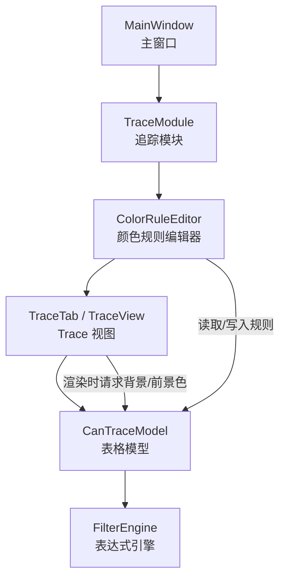
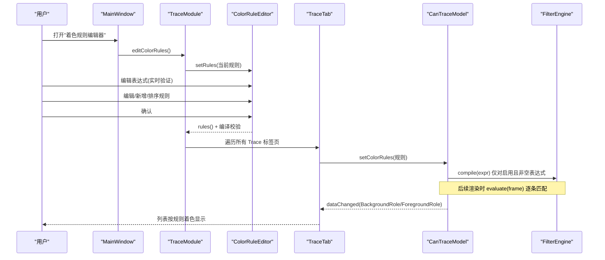
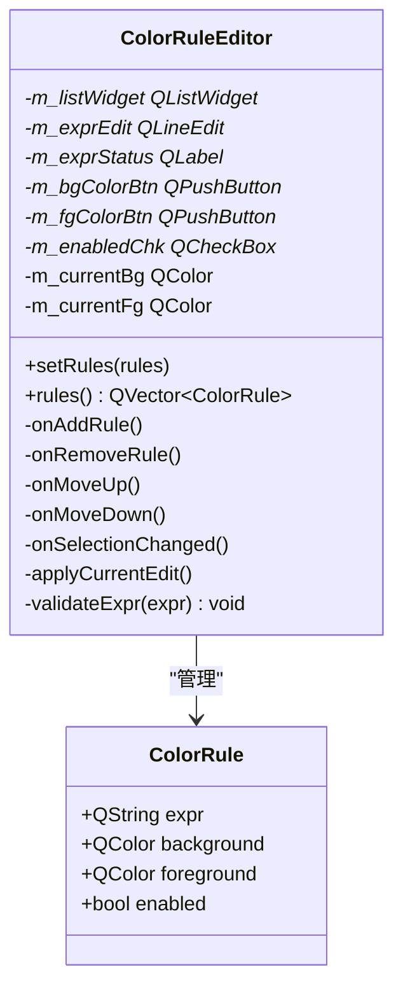
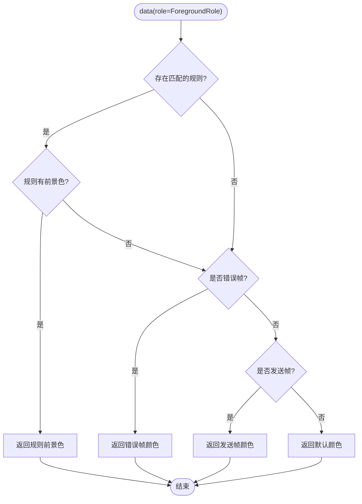
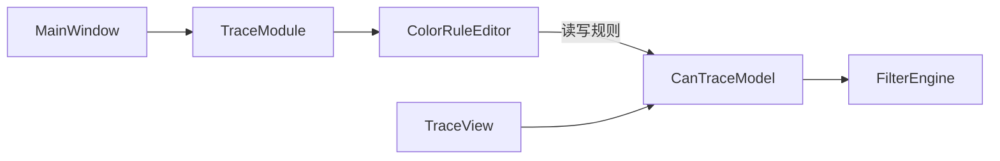

# 颜色规则编辑器

<cite>
**本文引用的文件**
- [colorruleeditor.h](file://src/ui/colorruleeditor.h)
- [colorruleeditor.cpp](file://src/ui/colorruleeditor.cpp)
- [cantracemodel.h](file://src/models/cantracemodel.h)
- [cantracemodel.cpp](file://src/models/cantracemodel.cpp)
- [filter_engine.h](file://src/core/filter_engine.h)
- [mainwindow_pages.cpp](file://src/ui/mainwindow_pages.cpp)
- [tracemodule.cpp](file://src/ui/tracemodule.cpp)
- [traceview.cpp](file://src/ui/traceview.cpp)
</cite>

## 更新摘要
**变更内容**
- 增强了前景色规则处理机制，在data()方法中优先检查匹配的着色规则并应用前景色
- 实现了ColorRuleEditor中的实时表达式验证功能，用户输入时即时显示语法错误
- 改进了编译错误处理，在保存前对所有规则表达式进行完整校验
- matchingColorRule()方法现在返回规则索引而非颜色值，提高了渲染逻辑的灵活性
- 优化了不同模块间ColorRule类型的转换机制，确保数据完整性

## 目录
1. [简介](#简介)
2. [项目结构](#项目结构)
3. [核心组件](#核心组件)
4. [架构总览](#架构总览)
5. [详细组件分析](#详细组件分析)
6. [依赖关系分析](#依赖关系分析)
7. [性能考虑](#性能考虑)
8. [故障排查指南](#故障排查指南)
9. [结论](#结论)
10. [附录](#附录)

## 简介
本文件聚焦"颜色规则编辑器"功能，说明其在 CAN/CAN FD 报文分析工具中的定位、数据流与渲染机制。该编辑器用于定义并管理 Trace 列表的行级着色规则：每条规则由条件表达式、背景色、前景色和启用状态组成；规则按从上到下的顺序匹配，首个命中即生效。条件表达式复用 FilterEngine 的语法能力，确保与全局过滤引擎一致。

**最新更新** 系统现在支持更强大的前景色处理能力，提供实时的表达式验证反馈，并在保存前进行完整的编译错误检查，显著提升了用户体验和规则配置的可靠性。

## 项目结构
围绕颜色规则编辑器的相关文件分布如下：
- UI 层：颜色规则编辑器对话框（ColorRuleEditor）
- 模型层：Trace 表格模型（CanTraceModel）负责着色求值与渲染
- 引擎层：FilterEngine 提供表达式编译与求值
- 模块层：TraceModule 负责编辑器集成和规则应用
- 主窗口：通过菜单入口打开编辑器并协调跨模块通信
- Trace 视图：右键菜单支持手动标记与单行着色（与自动规则互补）

**图表来源**
- [mainwindow_pages.cpp:353-358](file://src/ui/mainwindow_pages.cpp#L353-L358)
- [tracemodule.cpp:258-296](file://src/ui/tracemodule.cpp#L258-L296)
- [colorruleeditor.cpp:21-148](file://src/ui/colorruleeditor.cpp#L21-L148)
- [cantracemodel.cpp:37-134](file://src/models/cantracemodel.cpp#L37-L134)
- [filter_engine.h:29-56](file://src/core/filter_engine.h#L29-L56)

**章节来源**
- [mainwindow_pages.cpp:353-358](file://src/ui/mainwindow_pages.cpp#L353-L358)
- [tracemodule.cpp:258-296](file://src/ui/tracemodule.cpp#L258-L296)
- [colorruleeditor.cpp:21-148](file://src/ui/colorruleeditor.cpp#L21-L148)
- [cantracemodel.cpp:37-134](file://src/models/cantracemodel.cpp#L37-L134)
- [filter_engine.h:29-56](file://src/core/filter_engine.h#L29-L56)

## 核心组件
- ColorRuleEditor：提供可视化界面，维护规则列表（表达式、背景色、前景色、启用），支持添加、删除、上移、下移、选择编辑，以及实时表达式验证。
- CanTraceModel：承载 Trace 数据，并在 data() 中计算每行的背景/前景色；内置着色规则求值逻辑，优先级为：用户自定义行颜色 > 着色规则 > 标记高亮 > 默认样式。
- FilterEngine：轻量表达式引擎，支持 id/dlc/ch/time/fd/ext/rx/tx/std 等变量与逻辑/比较运算符，以及 in、contains 等便捷语法。
- TraceModule：作为中间层，桥接 ColorRuleEditor 和 CanTraceModel，负责在不同模块间转换 ColorRule 类型并应用到所有 Trace 标签页。
- TraceView：提供右键"标记与着色"子菜单，允许对选中行进行手动标记或设置自定义颜色（与自动规则并存）。

**更新** 现在 ColorRuleEditor 提供了实时表达式验证功能，用户在输入表达式时会立即看到语法错误或成功提示，大大提升了配置体验。

**章节来源**
- [colorruleeditor.h:21-60](file://src/ui/colorruleeditor.h#L21-L60)
- [colorruleeditor.cpp:178-191](file://src/ui/colorruleeditor.cpp#L178-L191)
- [cantracemodel.h:116-128](file://src/models/cantracemodel.h#L116-L128)
- [cantracemodel.cpp:37-134](file://src/models/cantracemodel.cpp#L37-L134)
- [filter_engine.h:29-56](file://src/core/filter_engine.h#L29-L56)
- [tracemodule.cpp:258-296](file://src/ui/tracemodule.cpp#L258-L296)
- [traceview.cpp:150-183](file://src/ui/traceview.cpp#L150-L183)

## 架构总览
颜色规则从编辑器到渲染的整体流程如下：

**图表来源**
- [mainwindow_pages.cpp:353-358](file://src/ui/mainwindow_pages.cpp#L353-L358)
- [tracemodule.cpp:258-296](file://src/ui/tracemodule.cpp#L258-L296)
- [colorruleeditor.cpp:117-140](file://src/ui/colorruleeditor.cpp#L117-L140)
- [cantracemodel.cpp:710-760](file://src/models/cantracemodel.cpp#L710-L760)
- [filter_engine.h:38-51](file://src/core/filter_engine.h#L38-L51)

## 详细组件分析

### ColorRuleEditor（颜色规则编辑器）
- 职责：维护规则列表与编辑表单，提供增删改查与顺序调整；通过 QVariant 将 ColorRule 绑定到 QListWidgetItem。
- 关键交互：
  - 选择行时回填表达式与颜色到编辑区
  - 点击"添加/删除/上移/下移"更新列表
  - "确定"时应用当前编辑并进行完整编译校验
  - 实时表达式验证：用户输入时即时显示语法错误
- 数据结构：ColorRule 包含 expr、background、foreground、enabled。

**更新** 新增了 validateExpr() 方法，在用户输入表达式时实时验证语法，并通过 m_exprStatus 标签显示错误信息。保存前会对所有规则进行完整编译检查，防止无效规则被应用。

**图表来源**
- [colorruleeditor.h:21-60](file://src/ui/colorruleeditor.h#L21-L60)
- [colorruleeditor.cpp:21-148](file://src/ui/colorruleeditor.cpp#L21-L148)
- [colorruleeditor.cpp:178-191](file://src/ui/colorruleeditor.cpp#L178-L191)

**章节来源**
- [colorruleeditor.h:21-60](file://src/ui/colorruleeditor.h#L21-L60)
- [colorruleeditor.cpp:21-148](file://src/ui/colorruleeditor.cpp#L21-L148)
- [colorruleeditor.cpp:178-191](file://src/ui/colorruleeditor.cpp#L178-L191)

### CanTraceModel（Trace 表格模型）
- 职责：提供 QAbstractTableModel 实现，存储帧序列，计算列显示内容，并在 data() 中决定背景/前景色。
- 着色优先级：
  1) 用户自定义行颜色（setRowColor）
  2) 着色规则求值（evaluateColorRules）
  3) 标记行高亮
  4) 默认样式（如 FD 帧浅绿底）
- 着色规则：
  - setColorRules：清理旧 FilterEngine，编译新规则（仅启用且非空）
  - matchingColorRule：按顺序匹配，返回首个命中的规则索引
  - clearColorRules：清空规则并刷新

**更新** 现在 data() 方法在处理 ForegroundRole 时优先检查匹配的着色规则，如果规则定义了有效的前景色则直接返回，否则才回退到默认的颜色方案。matchingColorRule() 方法现在返回规则索引而非颜色值，提高了渲染逻辑的灵活性。

**图表来源**
- [cantracemodel.cpp:71-81](file://src/models/cantracemodel.cpp#L71-L81)
- [cantracemodel.cpp:753-760](file://src/models/cantracemodel.cpp#L753-L760)

**章节来源**
- [cantracemodel.h:116-128](file://src/models/cantracemodel.h#L116-L128)
- [cantracemodel.cpp:71-81](file://src/models/cantracemodel.cpp#L71-L81)
- [cantracemodel.cpp:753-760](file://src/models/cantracemodel.cpp#L753-L760)

### FilterEngine（表达式引擎）
- 职责：编译与求值过滤表达式，供全局过滤与着色规则复用。
- 能力：支持变量、逻辑与比较运算、in、contains 等；提供 isValid/errorString 便于错误提示。

**章节来源**
- [filter_engine.h:29-56](file://src/core/filter_engine.h#L29-L56)
- [cantracemodel.cpp:710-760](file://src/models/cantracemodel.cpp#L710-L760)

### TraceModule（模块集成层）
- 职责：作为 ColorRuleEditor 和 CanTraceModel 之间的桥梁，负责在不同模块间转换 ColorRule 类型并应用到所有 Trace 标签页。
- **更新** 现在实现了更健壮的类型转换机制，在 ColorRuleEditor::ColorRule 和 CanTraceModel::ColorRule 之间进行显式字段映射，确保数据完整性。

关键点：遍历所有 TraceTab，将编辑器规则转换为模型规则后调用 traceModel()->setColorRules(...)。

**章节来源**
- [tracemodule.cpp:258-296](file://src/ui/tracemodule.cpp#L258-L296)

### MainWindow（集成入口）
- 职责：通过菜单入口打开颜色规则编辑器，委托给 TraceModule 处理具体的编辑器操作。
- **更新** 现在采用模块化设计，主窗口只负责触发 editColorRules 动作，具体的编辑器管理和规则应用由 TraceModule 处理。

**章节来源**
- [mainwindow_pages.cpp:353-358](file://src/ui/mainwindow_pages.cpp#L353-L358)

### TraceView（右键标记与着色）
- 职责：提供上下文菜单"标记与着色"，支持对选中行进行手动标记或设置自定义颜色，与自动规则并存。
- 行为：通过 CanTraceModel::toggleMark/setRowColor 修改状态并触发刷新。

**章节来源**
- [traceview.cpp:150-183](file://src/ui/traceview.cpp#L150-L183)

## 依赖关系分析
- ColorRuleEditor 依赖 Qt 控件与 QColorDialog，不直接依赖 FilterEngine。
- CanTraceModel 依赖 FilterEngine 以编译/求值规则；同时维护 m_colorFilters 与 m_colorRules。
- TraceModule 作为编排者，桥接编辑器与模型，将规则广播至所有 Trace 标签页。
- MainWindow 通过模块接口间接控制编辑器，不再直接管理 ColorRuleEditor 实例。
- TraceView 与 CanTraceModel 解耦，通过 Model 接口获取/更新行样式。

**更新** 现在采用了更清晰的模块化架构，主窗口不再直接管理 ColorRuleEditor，而是通过 TraceModule 进行协调，提高了系统的可维护性。

**图表来源**
- [mainwindow_pages.cpp:353-358](file://src/ui/mainwindow_pages.cpp#L353-L358)
- [tracemodule.cpp:258-296](file://src/ui/tracemodule.cpp#L258-L296)
- [colorruleeditor.cpp:178-191](file://src/ui/colorruleeditor.cpp#L178-L191)
- [cantracemodel.cpp:710-760](file://src/models/cantracemodel.cpp#L710-L760)

**章节来源**
- [mainwindow_pages.cpp:353-358](file://src/ui/mainwindow_pages.cpp#L353-L358)
- [tracemodule.cpp:258-296](file://src/ui/tracemodule.cpp#L258-L296)
- [colorruleeditor.cpp:178-191](file://src/ui/colorruleeditor.cpp#L178-L191)
- [cantracemodel.cpp:710-760](file://src/models/cantracemodel.cpp#L710-L760)

## 性能考虑
- 规则编译时机：仅在 setColorRules 时编译启用的规则，避免每次渲染重复编译。
- 求值开销：matchingColorRule() 按序匹配，命中即返回；建议将高频匹配规则置于靠前位置。
- 刷新范围：setColorRules 会触发整表 BackgroundRole/ForegroundRole 刷新；若规则数量大，可考虑增量刷新策略。
- 覆盖模式：当开启覆盖模式时，同 ID 只保留一行，减少渲染压力。
- **更新** 实时表达式验证在用户输入时进行，不会阻塞界面响应，只在保存时才进行完整的编译检查。

**章节来源**
- [cantracemodel.cpp:710-760](file://src/models/cantracemodel.cpp#L710-L760)
- [colorruleeditor.cpp:117-140](file://src/ui/colorruleeditor.cpp#L117-L140)
- [colorruleeditor.cpp:178-191](file://src/ui/colorruleeditor.cpp#L178-L191)

## 故障排查指南
- 表达式无效：
  - 现象：规则未生效或无着色
  - 排查：检查表达式语法是否正确；可使用 FilterEngine::isValid/errorString 辅助诊断
  - **更新** 现在 ColorRuleEditor 提供实时验证，用户输入时会立即看到错误提示
  - 参考：[filter_engine.h:38-51](file://src/core/filter_engine.h#L38-L51)
- 规则未应用：
  - 现象：编辑器确认后列表未变色
  - 排查：确认 TraceModule 已将规则设置到所有 Trace 标签页的模型；检查 setColorRules 是否被调用
  - **更新** 现在类型转换更加可靠，如果仍有问题，检查模块间的 ColorRule 类型映射是否正确
  - 参考：[tracemodule.cpp:258-296](file://src/ui/tracemodule.cpp#L258-L296)
- 规则优先级冲突：
  - 现象：自定义颜色覆盖了规则
  - 说明：自定义行颜色优先级高于规则；如需规则生效，先清除自定义颜色
  - 参考：[cantracemodel.cpp:83-109](file://src/models/cantracemodel.cpp#L83-L109)
- 列表刷新异常：
  - 现象：修改规则后未立即刷新
  - 排查：确认 dataChanged 已发出；必要时强制刷新可见区域
  - 参考：[cantracemodel.cpp:734-738](file://src/models/cantracemodel.cpp#L734-L738)
- 编译错误处理：
  - 现象：保存时出现编译错误警告
  - 排查：检查表达式语法；使用实时验证功能提前发现错误
  - **更新** 现在保存前会进行完整的编译检查，阻止无效规则的保存
  - 参考：[colorruleeditor.cpp:117-140](file://src/ui/colorruleeditor.cpp#L117-L140)

**章节来源**
- [filter_engine.h:38-51](file://src/core/filter_engine.h#L38-L51)
- [tracemodule.cpp:258-296](file://src/ui/tracemodule.cpp#L258-L296)
- [cantracemodel.cpp:83-109](file://src/models/cantracemodel.cpp#L83-L109)
- [cantracemodel.cpp:734-738](file://src/models/cantracemodel.cpp#L734-L738)
- [colorruleeditor.cpp:117-140](file://src/ui/colorruleeditor.cpp#L117-L140)

## 结论
颜色规则编辑器通过"表达式 + 颜色"的方式，为 Trace 列表提供了强大而灵活的视觉区分能力。其设计遵循"编辑器—模型—引擎"的分层思路：编辑器专注交互，模型负责求值与渲染，引擎提供一致的表达式能力。结合 TraceModule 的模块化架构，可在多标签页间共享规则，提升分析效率。

**最新更新** 最近的改进显著提升了用户体验和系统可靠性：实时表达式验证让用户能够即时获得反馈，完整的编译检查确保只有有效的规则才能被应用，改进的前景色处理机制提供了更丰富的视觉区分能力，而模块化的架构设计使得系统更加易于维护和扩展。

## 附录
- 程序入口初始化（注册元类型、主题、会话等）：
  - 参考：[main.cpp:10-37](file://src/main.cpp#L10-L37)

**章节来源**
- [main.cpp:10-37](file://src/main.cpp#L10-L37)