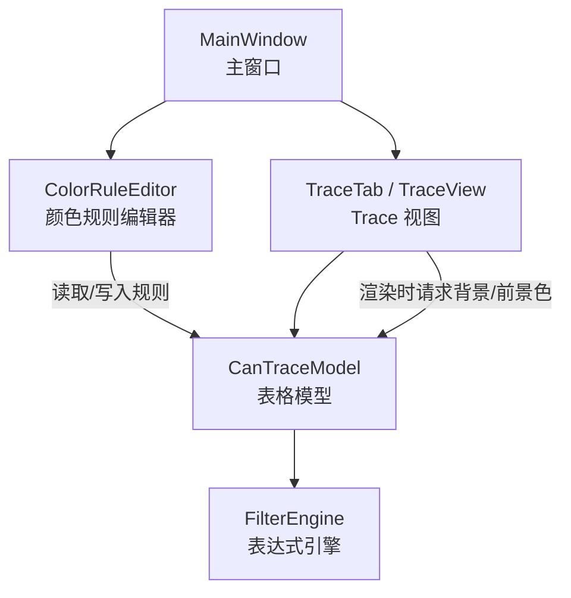
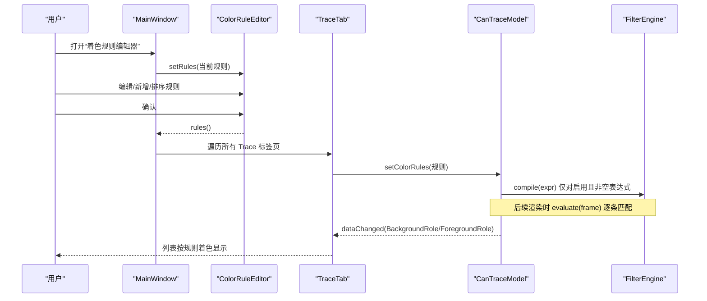
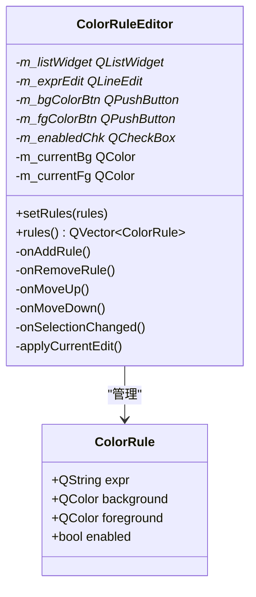
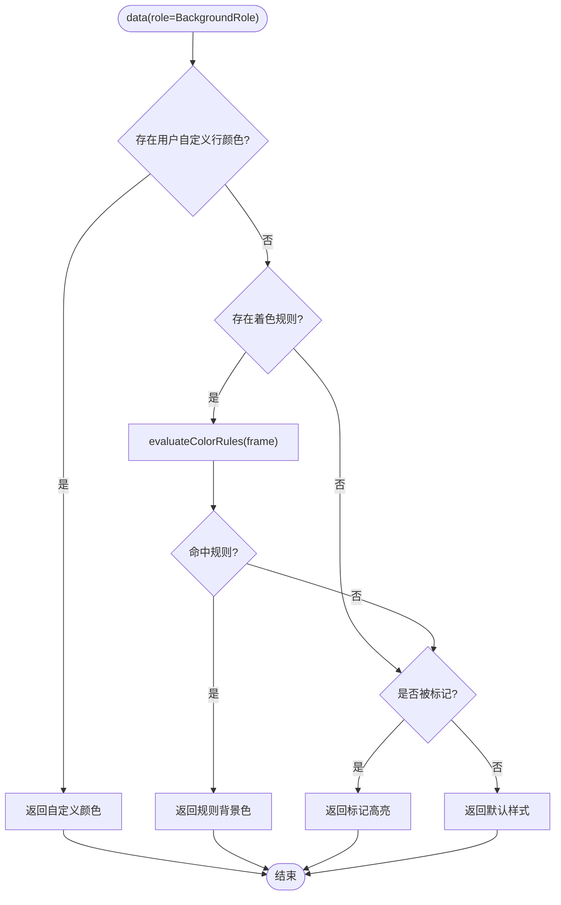
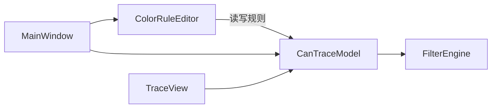

# 颜色规则编辑器

<cite>
**本文引用的文件**
- [colorruleeditor.h](file://src/ui/colorruleeditor.h)
- [colorruleeditor.cpp](file://src/ui/colorruleeditor.cpp)
- [cantracemodel.h](file://src/models/cantracemodel.h)
- [cantracemodel.cpp](file://src/models/cantracemodel.cpp)
- [filter_engine.h](file://src/core/filter_engine.h)
- [mainwindow.h](file://src/ui/mainwindow.h)
- [mainwindow.cpp](file://src/ui/mainwindow.cpp)
- [traceview.cpp](file://src/ui/traceview.cpp)
- [main.cpp](file://src/main.cpp)
</cite>

## 目录
1. [简介](#简介)
2. [项目结构](#项目结构)
3. [核心组件](#核心组件)
4. [架构总览](#架构总览)
5. [详细组件分析](#详细组件分析)
6. [依赖关系分析](#依赖关系分析)
7. [性能考虑](#性能考虑)
8. [故障排查指南](#故障排查指南)
9. [结论](#结论)
10. [附录](#附录)

## 简介
本文件聚焦“颜色规则编辑器”功能，说明其在 CAN/CAN FD 报文分析工具中的定位、数据流与渲染机制。该编辑器用于定义并管理 Trace 列表的行级着色规则：每条规则由条件表达式、背景色、前景色和启用状态组成；规则按从上到下的顺序匹配，首个命中即生效。条件表达式复用 FilterEngine 的语法能力，确保与全局过滤引擎一致。

## 项目结构
围绕颜色规则编辑器的相关文件分布如下：
- UI 层：颜色规则编辑器对话框（ColorRuleEditor）
- 模型层：Trace 表格模型（CanTraceModel）负责着色求值与渲染
- 引擎层：FilterEngine 提供表达式编译与求值
- 主窗口：打开编辑器并将规则应用到所有 Trace 标签页
- Trace 视图：右键菜单支持手动标记与单行着色（与自动规则互补）

图表来源
- [mainwindow.cpp:1937-1982](file://src/ui/mainwindow.cpp#L1937-L1982)
- [colorruleeditor.cpp:16-114](file://src/ui/colorruleeditor.cpp#L16-L114)
- [cantracemodel.cpp:28-105](file://src/models/cantracemodel.cpp#L28-L105)
- [cantracemodel.cpp:305-356](file://src/models/cantracemodel.cpp#L305-L356)
- [filter_engine.h:9-28](file://src/core/filter_engine.h#L9-L28)

章节来源
- [mainwindow.cpp:1937-1982](file://src/ui/mainwindow.cpp#L1937-L1982)
- [colorruleeditor.cpp:16-114](file://src/ui/colorruleeditor.cpp#L16-L114)
- [cantracemodel.cpp:28-105](file://src/models/cantracemodel.cpp#L28-L105)
- [cantracemodel.cpp:305-356](file://src/models/cantracemodel.cpp#L305-L356)
- [filter_engine.h:9-28](file://src/core/filter_engine.h#L9-L28)

## 核心组件
- ColorRuleEditor：提供可视化界面，维护规则列表（表达式、背景色、前景色、启用），支持添加、删除、上移、下移、选择编辑。
- CanTraceModel：承载 Trace 数据，并在 data() 中计算每行的背景/前景色；内置着色规则求值逻辑，优先级为：用户自定义行颜色 > 着色规则 > 标记高亮 > 默认样式。
- FilterEngine：轻量表达式引擎，支持 id/dlc/ch/time/fd/ext/rx/tx/std 等变量与逻辑/比较运算符，以及 in、contains 等便捷语法。
- MainWindow：在菜单或工具入口处打开编辑器，将编辑器中的规则同步到所有 Trace 标签页的模型中。
- TraceView：提供右键“标记与着色”子菜单，允许对选中行进行手动标记或设置自定义颜色（与自动规则并存）。

章节来源
- [colorruleeditor.h:13-56](file://src/ui/colorruleeditor.h#L13-L56)
- [colorruleeditor.cpp:116-232](file://src/ui/colorruleeditor.cpp#L116-L232)
- [cantracemodel.h:99-143](file://src/models/cantracemodel.h#L99-L143)
- [cantracemodel.cpp:28-105](file://src/models/cantracemodel.cpp#L28-L105)
- [filter_engine.h:9-28](file://src/core/filter_engine.h#L9-L28)
- [mainwindow.cpp:1937-1982](file://src/ui/mainwindow.cpp#L1937-L1982)
- [traceview.cpp:152-183](file://src/ui/traceview.cpp#L152-L183)

## 架构总览
颜色规则从编辑器到渲染的整体流程如下：

图表来源
- [mainwindow.cpp:1937-1982](file://src/ui/mainwindow.cpp#L1937-L1982)
- [colorruleeditor.cpp:116-142](file://src/ui/colorruleeditor.cpp#L116-L142)
- [cantracemodel.cpp:305-356](file://src/models/cantracemodel.cpp#L305-L356)
- [filter_engine.h:38-48](file://src/core/filter_engine.h#L38-L48)

## 详细组件分析

### ColorRuleEditor（颜色规则编辑器）
- 职责：维护规则列表与编辑表单，提供增删改查与顺序调整；通过 QVariant 将 ColorRule 绑定到 QListWidgetItem。
- 关键交互：
  - 选择行时回填表达式与颜色到编辑区
  - 点击“添加/删除/上移/下移”更新列表
  - “确定”时应用当前编辑并关闭对话框
- 数据结构：ColorRule 包含 expr、background、foreground、enabled。

图表来源
- [colorruleeditor.h:20-56](file://src/ui/colorruleeditor.h#L20-L56)
- [colorruleeditor.cpp:16-114](file://src/ui/colorruleeditor.cpp#L16-L114)
- [colorruleeditor.cpp:116-232](file://src/ui/colorruleeditor.cpp#L116-L232)

章节来源
- [colorruleeditor.h:20-56](file://src/ui/colorruleeditor.h#L20-L56)
- [colorruleeditor.cpp:16-114](file://src/ui/colorruleeditor.cpp#L16-L114)
- [colorruleeditor.cpp:116-232](file://src/ui/colorruleeditor.cpp#L116-L232)

### CanTraceModel（Trace 表格模型）
- 职责：提供 QAbstractTableModel 实现，存储帧序列，计算列显示内容，并在 data() 中决定背景/前景色。
- 着色优先级：
  1) 用户自定义行颜色（setRowColor）
  2) 着色规则求值（evaluateColorRules）
  3) 标记行高亮
  4) 默认样式（如 FD 帧浅绿底）
- 着色规则：
  - setColorRules：清理旧 FilterEngine，编译新规则（仅启用且非空）
  - evaluateColorRules：按顺序匹配，返回首个命中的背景色
  - clearColorRules：清空规则并刷新

图表来源
- [cantracemodel.cpp:28-105](file://src/models/cantracemodel.cpp#L28-L105)
- [cantracemodel.cpp:305-356](file://src/models/cantracemodel.cpp#L305-L356)

章节来源
- [cantracemodel.h:99-143](file://src/models/cantracemodel.h#L99-L143)
- [cantracemodel.cpp:28-105](file://src/models/cantracemodel.cpp#L28-L105)
- [cantracemodel.cpp:305-356](file://src/models/cantracemodel.cpp#L305-L356)

### FilterEngine（表达式引擎）
- 职责：编译与求值过滤表达式，供全局过滤与着色规则复用。
- 能力：支持变量、逻辑与比较运算、in、contains 等；提供 isValid/errorString 便于错误提示。

章节来源
- [filter_engine.h:9-28](file://src/core/filter_engine.h#L9-L28)
- [cantracemodel.cpp:305-329](file://src/models/cantracemodel.cpp#L305-L329)

### MainWindow（集成入口）
- 职责：打开颜色规则编辑器，将编辑器规则转换为模型规则并应用到所有 Trace 标签页。
- 关键点：遍历 SplitEditorArea 的所有 Tab，找到 TraceTab 后调用其 traceModel()->setColorRules(...)。

章节来源
- [mainwindow.h:113-116](file://src/ui/mainwindow.h#L113-L116)
- [mainwindow.cpp:1937-1982](file://src/ui/mainwindow.cpp#L1937-L1982)

### TraceView（右键标记与着色）
- 职责：提供上下文菜单“标记与着色”，支持对选中行进行手动标记或设置自定义颜色，与自动规则并存。
- 行为：通过 CanTraceModel::toggleMark/setRowColor 修改状态并触发刷新。

章节来源
- [traceview.cpp:152-183](file://src/ui/traceview.cpp#L152-L183)
- [traceview.cpp:498-535](file://src/ui/traceview.cpp#L498-L535)

## 依赖关系分析
- ColorRuleEditor 依赖 Qt 控件与 QColorDialog，不直接依赖 FilterEngine。
- CanTraceModel 依赖 FilterEngine 以编译/求值规则；同时维护 m_colorFilters 与 m_colorRules。
- MainWindow 作为编排者，桥接编辑器与模型，将规则广播至所有 Trace 标签页。
- TraceView 与 CanTraceModel 解耦，通过 Model 接口获取/更新行样式。

图表来源
- [colorruleeditor.cpp:116-232](file://src/ui/colorruleeditor.cpp#L116-L232)
- [cantracemodel.cpp:305-356](file://src/models/cantracemodel.cpp#L305-L356)
- [mainwindow.cpp:1937-1982](file://src/ui/mainwindow.cpp#L1937-L1982)
- [traceview.cpp:498-535](file://src/ui/traceview.cpp#L498-L535)

章节来源
- [colorruleeditor.cpp:116-232](file://src/ui/colorruleeditor.cpp#L116-L232)
- [cantracemodel.cpp:305-356](file://src/models/cantracemodel.cpp#L305-L356)
- [mainwindow.cpp:1937-1982](file://src/ui/mainwindow.cpp#L1937-L1982)
- [traceview.cpp:498-535](file://src/ui/traceview.cpp#L498-L535)

## 性能考虑
- 规则编译时机：仅在 setColorRules 时编译启用的规则，避免每次渲染重复编译。
- 求值开销：evaluateColorRules 按序匹配，命中即返回；建议将高频匹配规则置于靠前位置。
- 刷新范围：setColorRules 会触发整表 BackgroundRole/ForegroundRole 刷新；若规则数量大，可考虑增量刷新策略。
- 覆盖模式：当开启覆盖模式时，同 ID 只保留一行，减少渲染压力。

章节来源
- [cantracemodel.cpp:305-329](file://src/models/cantracemodel.cpp#L305-L329)
- [cantracemodel.cpp:343-356](file://src/models/cantracemodel.cpp#L343-L356)
- [cantracemodel.cpp:126-164](file://src/models/cantracemodel.cpp#L126-L164)

## 故障排查指南
- 表达式无效：
  - 现象：规则未生效或无着色
  - 排查：检查表达式语法是否正确；可使用 FilterEngine::isValid/errorString 辅助诊断
  - 参考：[filter_engine.h:38-51](file://src/core/filter_engine.h#L38-L51)
- 规则未应用：
  - 现象：编辑器确认后列表未变色
  - 排查：确认 MainWindow 已将规则设置到所有 Trace 标签页的模型；检查 setColorRules 是否被调用
  - 参考：[mainwindow.cpp:1937-1982](file://src/ui/mainwindow.cpp#L1937-L1982)
- 规则优先级冲突：
  - 现象：自定义颜色覆盖了规则
  - 说明：自定义行颜色优先级高于规则；如需规则生效，先清除自定义颜色
  - 参考：[cantracemodel.cpp:84-102](file://src/models/cantracemodel.cpp#L84-L102)
- 列表刷新异常：
  - 现象：修改规则后未立即刷新
  - 排查：确认 dataChanged 已发出；必要时强制刷新可见区域
  - 参考：[cantracemodel.cpp:325-329](file://src/models/cantracemodel.cpp#L325-L329)

章节来源
- [filter_engine.h:38-51](file://src/core/filter_engine.h#L38-L51)
- [mainwindow.cpp:1937-1982](file://src/ui/mainwindow.cpp#L1937-L1982)
- [cantracemodel.cpp:84-102](file://src/models/cantracemodel.cpp#L84-L102)
- [cantracemodel.cpp:325-329](file://src/models/cantracemodel.cpp#L325-L329)

## 结论
颜色规则编辑器通过“表达式 + 颜色”的方式，为 Trace 列表提供了强大而灵活的视觉区分能力。其设计遵循“编辑器—模型—引擎”的分层思路：编辑器专注交互，模型负责求值与渲染，引擎提供一致的表达式能力。结合 MainWindow 的全局应用机制，可在多标签页间共享规则，提升分析效率。

## 附录
- 程序入口初始化（注册元类型、主题、会话等）：
  - 参考：[main.cpp:10-37](file://src/main.cpp#L10-L37)

章节来源
- [main.cpp:10-37](file://src/main.cpp#L10-L37)