# 主窗口组件架构

<cite>
**本文引用的文件**
- [src/ui/mainwindow.h](file://src/ui/mainwindow.h)
- [src/ui/mainwindow.cpp](file://src/ui/mainwindow.cpp)
- [src/ui/mainwindow_setup.cpp](file://src/ui/mainwindow_setup.cpp)
- [src/ui/mainwindow_chrome.cpp](file://src/ui/mainwindow_chrome.cpp)
- [src/ui/mainwindow_actions.cpp](file://src/ui/mainwindow_actions.cpp)
- [src/ui/mainwindow_frameflow.cpp](file://src/ui/mainwindow_frameflow.cpp)
- [src/ui/mainwindow_pages.cpp](file://src/ui/mainwindow_pages.cpp)
- [src/ui/mainwindow_project.cpp](file://src/ui/mainwindow_project.cpp)
- [src/ui/mainwindow_dialogs.cpp](file://src/ui/mainwindow_dialogs.cpp)
- [src/ui/mainwindow_window_show.cpp](file://src/ui/mainwindow_window_show.cpp)
- [src/ui/mainwindow_force_show.cpp](file://src/ui/mainwindow_force_show.cpp)
- [src/ui/globalsearchpanel.h](file://src/ui/globalsearchpanel.h)
- [src/ui/globalsearchpanel.cpp](file://src/ui/globalsearchpanel.cpp)
- [src/ui/searchview.h](file://src/ui/searchview.h)
- [src/ui/searchview.cpp](file://src/ui/searchview.cpp)
- [src/core/module/moduleregistry.h](file://src/core/module/moduleregistry.h)
- [src/core/module/imodule.h](file://src/core/module/imodule.h)
- [src/ui/flowmodule.h](file://src/ui/flowmodule.h)
- [src/core/signalrelay.h](file://src/core/signalrelay.h)
- [src/core/signalrelay.cpp](file://src/core/signalrelay.cpp)
- [src/ui/bottompanel.h](file://src/ui/bottompanel.h)
- [src/ui/bottompanel.cpp](file://src/ui/bottompanel.cpp)
- [src/core/candevicemanager.h](file://src/core/candevicemanager.h)
- [resources/panel-toggles.qss](file://resources/panel-toggles.qss)
</cite>

## 更新摘要
**变更内容**
- **国际化改造完成**：所有菜单项从中文改为英文，包括文件、编辑、视图、工具、帮助等菜单
- **新增全局搜索功能**：实现了GlobalSearchPanel和SearchView组件，提供VS Code风格的全局搜索界面
- **改进工具栏组织**：优化了窗口控制按钮布局，集成了SVG图标系统
- **增强用户界面体验**：提供了更直观的搜索面板和更好的视觉反馈

## 目录
1. [简介](#简介)
2. [项目结构](#项目结构)
3. [核心组件](#核心组件)
4. [架构总览](#架构总览)
5. [详细组件分析](#详细组件分析)
6. [依赖关系分析](#依赖关系分析)
7. [性能与内存优化](#性能与内存优化)
8. [故障排查指南](#故障排查指南)
9. [结论](#结论)
10. [附录：使用示例与扩展指南](#附录使用示例与扩展指南)

## 简介
本文件围绕 MainWindow 组件，系统化阐述其基于 Flow-based 模块化架构的设计模式、继承关系、接口定义、UI 组织结构、布局管理策略、事件处理机制、信号槽通信、状态管理、样式系统集成、资源访问模式、插件扩展点、生命周期管理、内存优化与性能考量，并提供具体使用示例与扩展指南。该组件是 CAN/CAN FD 报文分析工具的主界面，采用协调器模式，通过 ModuleRegistry 将业务逻辑委派给独立模块，承担菜单栏、可停靠面板、标签页编辑器区域、状态栏、数据流分发、录制/回放、DBC 解析、Flow 流程编排、工程管理与插件系统协调等职责。**最新改进包括增强的窗口可见性管理、VSCode风格的面板切换功能、全面的模块化重构、SignalRelay 基础设施集成、增强的插件帧发送错误处理机制以及全新的全局搜索功能**。

## 项目结构
- UI 层：MainWindow 作为 QMainWindow 子类，按职责拆分为多个实现文件，组织 ActivityBar、SideBar、SplitEditorArea、BottomPanel、RightPanel 以及多个 Tab。
- 核心服务：Recorder、Player、CanSimulator、CanDeviceManager、DbcManager、BusStatistics、FilterPresetManager、BookmarkManager、TriggerRecorder、PluginManager。
- 模块系统：通过 ModuleRegistry 管理的 FlowModule、TransceiveModule、MarketModule、DbcModule、TraceModule、GraphicModule。
- **信号中继系统**：SignalRelay 提供字符串信号到lambda/std::function的桥接，解决MinGW下跨DLL场景的信号连接问题。
- **增强的错误处理系统**：通过 BottomPanel 输出系统提供详细的用户反馈，支持模拟器模式限制、设备连接问题和一般传输失败的分类处理。
- **增强的窗口可见性管理系统**：提供强制显示逻辑、屏幕几何检测和跨平台显示修复。
- **VSCode风格面板切换系统**：提供直观的面板可见性控制，包含专用样式和交互逻辑。
- **全新全局搜索系统**：GlobalSearchPanel 和 SearchView 提供类似 VS Code 的全局搜索体验。
- 资源与样式：通过 Qt 资源系统加载 QSS 样式表，统一外观。
- 入口：main.cpp 负责应用初始化、主题加载、日志、会话恢复并创建 MainWindow。

```mermaid
graph TB
A["main.cpp<br/>应用启动"] --> B["MainWindow<br/>协调器拆分实现"]
B --> C["mainwindow_setup.cpp<br/>核心服务装配"]
B --> D["mainwindow_chrome.cpp<br/>窗口骨架与布局"]
B --> E["mainwindow_actions.cpp<br/>用户动作处理"]
B --> F["mainwindow_frameflow.cpp<br/>数据流编排"]
B --> G["mainwindow_pages.cpp<br/>页面管理"]
B --> H["mainwindow_project.cpp<br/>工程管理"]
B --> I["mainwindow_dialogs.cpp<br/>对话框与插件集成"]
B --> J["mainwindow_window_show.cpp<br/>窗口可见性管理"]
B --> K["mainwindow_force_show.cpp<br/>强制显示修复"]
B --> L["ModuleRegistry<br/>模块注册中心"]
L --> M["FlowModule<br/>测量流程"]
L --> N["TransceiveModule<br/>收发功能"]
L --> O["MarketModule<br/>插件市场"]
L --> P["DbcModule<br/>DBC管理"]
L --> Q["TraceModule<br/>跟踪视图"]
L --> R["GraphicModule<br/>图形视图"]
B --> S["SignalRelay<br/>信号中继"]
B --> T["BottomPanel<br/>增强错误输出"]
B --> U["PanelToggleButtons<br/>VSCode风格切换"]
B --> V["GlobalSearchPanel<br/>全局搜索面板"]
V --> W["SearchView<br/>搜索结果展示"]
U --> X["左侧边栏切换"]
U --> Y["右侧面板切换"]
U --> Z["底部面板切换"]
U --> AA["布局重置"]
S --> BB["跨DLL信号连接"]
T --> CC["详细错误分类"]
CC --> DD["模拟器模式限制"]
CC --> EE["设备连接问题"]
CC --> FF["一般传输失败"]
J --> GG["强制显示逻辑"]
GG --> HH["屏幕几何检测"]
GG --> II["跨平台显示修复"]
K --> JJ["多重显示保障"]
JJ --> KK["showEvent重写"]
JJ --> LL["延迟执行"]
JJ --> MM["Windows API强制"]
```

**图表来源**
- [src/ui/mainwindow.h:42-54](file://src/ui/mainwindow.h#L42-L54)
- [src/ui/mainwindow_setup.cpp:44-81](file://src/ui/mainwindow_setup.cpp#L44-L81)
- [src/ui/mainwindow_chrome.cpp:294-349](file://src/ui/mainwindow_chrome.cpp#L294-L349)
- [src/ui/mainwindow_window_show.cpp:18-85](file://src/ui/mainwindow_window_show.cpp#L18-L85)
- [src/ui/mainwindow_force_show.cpp:16-80](file://src/ui/mainwindow_force_show.cpp#L16-L80)
- [src/ui/globalsearchpanel.h:8-24](file://src/ui/globalsearchpanel.h#L8-L24)
- [src/ui/searchview.h:12-50](file://src/ui/searchview.h#L12-L50)

章节来源
- [src/ui/mainwindow.h:42-54](file://src/ui/mainwindow.h#L42-L54)
- [src/ui/mainwindow_setup.cpp:44-81](file://src/ui/mainwindow_setup.cpp#L44-L81)
- [src/ui/mainwindow_chrome.cpp:294-349](file://src/ui/mainwindow_chrome.cpp#L294-L349)
- [src/ui/mainwindow_window_show.cpp:18-85](file://src/ui/mainwindow_window_show.cpp#L18-L85)
- [src/ui/mainwindow_force_show.cpp:16-80](file://src/ui/mainwindow_force_show.cpp#L16-L80)
- [src/core/module/moduleregistry.h:12-25](file://src/core/module/moduleregistry.h#L12-L25)

## 核心组件
- MainWindow：继承自 QMainWindow，作为协调器管理 UI 构建、信号槽连接、数据流分发、标签页与停靠面板、工程状态、插件集成，并通过 ModuleRegistry 委派业务逻辑。
- 模块系统：FlowModule（测量流程）、TransceiveModule（收发功能）、MarketModule（插件市场）、DbcModule（DBC管理）、TraceModule（跟踪视图）、GraphicModule（图形视图）。
- **SignalRelay**：字符串信号到lambda/std::function的桥接器，解决MinGW下跨DLL场景的信号连接问题，支持多种参数签名。
- **增强的错误处理系统**：通过 BottomPanel 提供详细的用户反馈，支持三种错误类型的分类处理。
- **增强的窗口可见性管理系统**：提供强制显示逻辑、屏幕几何检测和跨平台显示修复，确保无边框窗口正常显示。
- **VSCode风格面板切换系统**：提供直观的面板可见性控制，包含专用样式和交互逻辑。
- **全新全局搜索系统**：GlobalSearchPanel 和 SearchView 提供类似 VS Code 的全局搜索体验，支持文件、活动、命令、设置等多种类型的搜索。
- 侧边栏与活动栏：ActivityBar 切换"活动"，SideBar 提供 DBC、Trace、图形配置、收发、设备、协议、工具、扩展等子面板。
- 编辑器区域：SplitEditorArea 支持多拆分组与多标签页，承载 TraceTab、GraphicView、PlaybackTab、RecordTab、DeviceConnectionTab、ExtensionsTab 等。
- 底部面板：BottomPanel 提供输出日志、命令输入、问题列表，**新增增强的错误输出功能**。
- 右侧面板：RightPanel 提供快速录制/停止/播放/暂停/停止/清空/自动滚动/连接/断开/AI消息。
- 核心服务：Recorder、Player、CanSimulator、CanDeviceManager、DbcManager、BusStatistics、FilterPresetManager、BookmarkManager、TriggerRecorder、PluginManager。

章节来源
- [src/ui/mainwindow.h:55-295](file://src/ui/mainwindow.h#L55-L295)
- [src/ui/mainwindow_setup.cpp:48-81](file://src/ui/mainwindow_setup.cpp#L48-L81)
- [src/core/module/imodule.h:93-200](file://src/core/module/imodule.h#L93-200)
- [src/core/signalrelay.h:7-49](file://src/core/signalrelay.h#L7-L49)
- [src/ui/bottompanel.h:30-36](file://src/ui/bottompanel.h#L30-L36)
- [src/ui/globalsearchpanel.h:8-24](file://src/ui/globalsearchpanel.h#L8-L24)
- [src/ui/searchview.h:12-50](file://src/ui/searchview.h#L12-L50)

## 架构总览
MainWindow 采用"协调器 + 模块化"的架构：
- 通过 ModuleRegistry 统一管理业务模块，实现壳与业务的完全解耦。
- **通过 SignalRelay 解决跨DLL场景的信号连接问题**，确保插件管理器、设备管理器、录制器等核心服务的信号能够正确连接到MainWindow的槽函数。
- **增强的窗口可见性管理系统**：通过多重保障机制确保无边框窗口正常显示，包括屏幕几何检测、窗口层级管理和原生事件处理。
- **VSCode风格面板切换系统**：提供直观的面板可见性控制，包含专用样式和交互逻辑。
- **全新全局搜索系统**：提供类似 VS Code 的全局搜索体验，支持多种类型的搜索和智能结果展示。
- **增强的错误处理机制**：在插件帧发送过程中提供详细的用户反馈，区分不同类型的错误情况。
- 数据源（硬件设备或模拟器）产生帧，经 MainWindow 分发到各模块（Trace、Graphic、Recorder、BusStatistics、DataWindow、插件）。
- 用户交互（菜单、快捷键、侧边栏、右侧面板、命令）**以及面板切换按钮**统一汇聚到 MainWindow 的槽函数，再通过模块接口调用相应业务逻辑。
- Flow 页面控制测量运行状态，决定数据是否继续分发；模块级开关控制单个实例接收数据。
- 工程管理器负责保存/恢复当前工程状态（数据源、设备配置、DBC、默认 Trace/Graphic 实例、标签顺序等）。

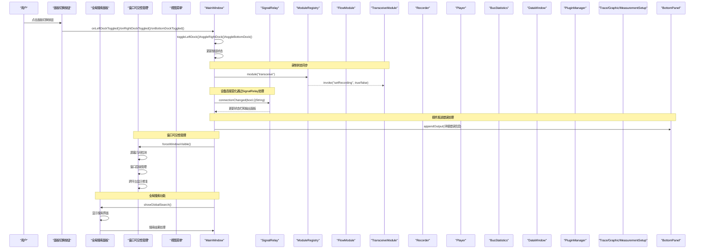

**图表来源**
- [src/ui/mainwindow_chrome.cpp:294-349](file://src/ui/mainwindow_chrome.cpp#L294-L349)
- [src/ui/mainwindow_chrome.cpp:597-654](file://src/ui/mainwindow_chrome.cpp#L597-654)
- [src/ui/mainwindow_window_show.cpp:18-85](file://src/ui/mainwindow_window_show.cpp#L18-L85)
- [src/ui/mainwindow_frameflow.cpp:99-137](file://src/ui/mainwindow_frameflow.cpp#L99-L137)
- [src/ui/mainwindow_pages.cpp:132-152](file://src/ui/mainwindow_pages.cpp#L132-L152)
- [src/ui/mainwindow_setup.cpp:197-214](file://src/ui/mainwindow_setup.cpp#L197-L214)
- [src/ui/mainwindow_dialogs.cpp:274-302](file://src/ui/mainwindow_dialogs.cpp#L274-302)
- [src/ui/globalsearchpanel.cpp:17-67](file://src/ui/globalsearchpanel.cpp#L17-L67)

章节来源
- [src/ui/mainwindow_chrome.cpp:294-349](file://src/ui/mainwindow_chrome.cpp#L294-L349)
- [src/ui/mainwindow_chrome.cpp:597-654](file://src/ui/mainwindow_chrome.cpp#L597-654)
- [src/ui/mainwindow_window_show.cpp:18-85](file://src/ui/mainwindow_window_show.cpp#L18-L85)
- [src/ui/mainwindow_frameflow.cpp:99-137](file://src/ui/mainwindow_frameflow.cpp#L99-L137)
- [src/ui/mainwindow_pages.cpp:132-152](file://src/ui/mainwindow_pages.cpp#L132-L152)
- [src/ui/mainwindow_setup.cpp:197-214](file://src/ui/mainwindow_setup.cpp#L197-L214)

## 详细组件分析

### 类结构与继承关系
- MainWindow 继承自 QMainWindow，作为协调器封装了 UI 与业务协调逻辑。
- 通过 ModuleRegistry 获取业务模块实例，实现松耦合的模块化管理。
- 成员包含大量子部件与服务指针，通过父对象父子关系进行生命周期管理。
- 通过 Q_OBJECT 宏启用信号槽机制，声明了大量槽用于响应各类事件。
- **SignalRelay 作为中间层**，提供字符串信号到lambda函数的桥接能力。
- **增强的错误处理**：onPluginSendFrame 方法集成了详细的错误分类和用户反馈机制。
- **增强的窗口可见性管理**：通过 showEvent 重写和专门的强制显示方法确保窗口正常显示。
- **面板切换系统**：新增面板切换按钮和相关槽函数，提供直观的UI控制。
- **全局搜索系统**：GlobalSearchPanel 和 SearchView 提供完整的全局搜索功能。

```mermaid
classDiagram
class MainWindow {
+构造函数()
+~析构函数()
+createMenuBar()
+createLayout()
+createStatusBar()
+createPanelToggleButtons()
+forceWindowVisible()
+showGlobalSearch()
+showEvent(QShowEvent*)
+openTab(widget, label)
+onFrameReceived(frame)
+onPluginSendFrame(frame)
+toggleLeftDock()
+toggleRightDock()
+toggleBottomDock()
+resetLayout()
+marketInvoke(action, arg)
+transceiveInvoke(action, arg)
+flowInvoke(action, arg)
+makeShellContext()
+onOpenFile()
+onPlay()/onPause()/onStop()
+onRecord()
+setupTraceTab(tab)
}
class GlobalSearchPanel {
+构造函数()
+~析构函数()
+keyPressEvent(QKeyEvent*)
+onSearchClosed()
}
class SearchView {
+构造函数()
+~析构函数()
+keyPressEvent(QKeyEvent*)
+onTextChanged(QString)
+onClearAllClicked()
+performSearch()
+showEmptyResult()
}
class SignalRelay {
+fire0 : std : : function<void()>
+fnBoolString : std : : function<void(bool, QString)>
+fnString : std : : function<void(QString)>
+fnStringInt : std : : function<void(QString, int)>
+fire()
+fireBoolQString(bool, QString)
+fireQString(QString)
+fireQStringInt(QString, int)
}
class ModuleRegistry {
+instance()
+registerModule(id, factory)
+module(id) IBusinessModule*
+ids() QStringList
}
class IBusinessModule {
+id() QString
+title() QString
+icon() QIcon
+createWidget(ctx) QWidget*
+invoke(action, arg)
+query(what, arg) QVariant
+pages() QStringList
+createPage(pageId, ctx) QWidget*
}
class FlowModule {
+id() QString
+createPage(pageId, param, ctx) QWidget*
+createPage(pageId, ctx) QWidget*
+invoke(action, arg)
+query(what, arg) QVariant
}
class TransceiveModule {
+id() QString
+pages() QStringList
+createPage(pageId, ctx) QWidget*
+invoke(action, arg)
+query(what, arg) QVariant
}
MainWindow --|> QMainWindow
MainWindow --> ModuleRegistry
MainWindow --> SignalRelay
MainWindow --> IBusinessModule
MainWindow --> GlobalSearchPanel
GlobalSearchPanel --> SearchView
FlowModule --|> IBusinessModule
TransceiveModule --|> IBusinessModule
```

**图表来源**
- [src/ui/mainwindow.h:55-295](file://src/ui/mainwindow.h#L55-295)
- [src/ui/globalsearchpanel.h:8-24](file://src/ui/globalsearchpanel.h#L8-L24)
- [src/ui/searchview.h:12-50](file://src/ui/searchview.h#L12-L50)
- [src/core/signalrelay.h:29-49](file://src/core/signalrelay.h#L29-L49)
- [src/core/module/moduleregistry.h:27-50](file://src/core/module/moduleregistry.h#L27-L50)
- [src/core/module/imodule.h:93-200](file://src/core/module/imodule.h#L93-200)
- [src/ui/flowmodule.h:24-48](file://src/ui/flowmodule.h#L24-L48)

章节来源
- [src/ui/mainwindow.h:55-295](file://src/ui/mainwindow.h#L55-295)
- [src/ui/globalsearchpanel.h:8-24](file://src/ui/globalsearchpanel.h#L8-L24)
- [src/ui/searchview.h:12-50](file://src/ui/searchview.h#L12-L50)
- [src/core/signalrelay.h:29-49](file://src/core/signalrelay.h#L29-L49)
- [src/core/module/moduleregistry.h:27-50](file://src/core/module/moduleregistry.h#L27-L50)
- [src/core/module/imodule.h:93-200](file://src/core/module/imodule.h#L93-200)
- [src/ui/flowmodule.h:24-48](file://src/ui/flowmodule.h#L24-L48)

### UI 组织与布局管理
- 左侧 Dock：ActivityBar + SideBar，支持收起/展开，宽度记忆。
- 中央：SplitEditorArea 作为 central widget，承载多拆分组与多标签页。
- 右侧 Dock：RightPanel，提供快捷操作。
- 底部 Dock：BottomPanel，输出日志、命令、问题，**新增增强的错误输出功能**。
- **VSCode风格面板切换按钮**：位于窗口右上角，提供快速面板可见性控制。
- **全局搜索按钮**：在窗口标题栏集成搜索按钮，提供快速搜索入口。
- 停靠面板尺寸与可见性可通过视图菜单控制，支持重置布局。
- 页面创建委托：通过 ModuleRegistry 获取对应模块创建页面，实现页面逻辑与壳的解耦。
- **增强的窗口显示管理**：通过多重机制确保无边框窗口正常显示，包括屏幕几何检测和窗口层级管理。

```mermaid
flowchart TD
Start(["创建布局"]) --> Left["左侧Dock: ActivityBar+SideBar"]
Start --> Center["中央: SplitEditorArea"]
Start --> Right["右侧Dock: RightPanel"]
Start --> Bottom["底部Dock: BottomPanel<br/>增强错误输出"]
Start --> TogglePanel["VSCode风格面板切换按钮"]
Start --> SearchBtn["全局搜索按钮"]
Start --> WindowShow["窗口可见性管理"]
Left --> SizeLeft["设置最小/最大宽度"]
Center --> DefaultTabs["默认打开Flow+设备连接"]
Right --> VisibleRight{"默认隐藏?"}
Bottom --> VisibleBottom{"默认隐藏?"}
VisibleRight --> |是| HideRight["m_rightDock->setVisible(false)"]
VisibleBottom --> |是| HideBottom["m_bottomDock->setVisible(false)"]
DefaultTabs --> ModuleCreate["通过ModuleRegistry创建页面"]
ModuleCreate --> FlowMod["flow模块创建Flow页"]
ModuleCreate --> DeviceMod["flow模块创建设备连接页"]
TogglePanel --> ToggleLeft["左侧边栏切换"]
TogglePanel --> ToggleRight["右侧面板切换"]
TogglePanel --> ToggleBottom["底部面板切换"]
TogglePanel --> ResetLayout["布局重置"]
SearchBtn --> ShowSearch["显示全局搜索面板"]
WindowShow --> ForceVisible["forceWindowVisible()"]
ForceVisible --> ScreenDetect["屏幕几何检测"]
ForceVisible --> LayerManage["窗口层级管理"]
ForceVisible --> CrossPlatform["跨平台显示修复"]
Note over Bottom: 错误输出分类
Bottom --> SimError["模拟器模式限制"]
Bottom --> ConnError["设备连接问题"]
Bottom --> GenError["一般传输失败"]
```

**图表来源**
- [src/ui/mainwindow_chrome.cpp:294-349](file://src/ui/mainwindow_chrome.cpp#L294-L349)
- [src/ui/mainwindow_chrome.cpp:309-383](file://src/ui/mainwindow_chrome.cpp#L309-L383)
- [src/ui/mainwindow_chrome.cpp:340-348](file://src/ui/mainwindow_chrome.cpp#L340-348)
- [src/ui/mainwindow_window_show.cpp:18-85](file://src/ui/mainwindow_window_show.cpp#L18-L85)
- [src/ui/mainwindow_dialogs.cpp:274-302](file://src/ui/mainwindow_dialogs.cpp#L274-302)
- [src/ui/globalsearchpanel.cpp:17-67](file://src/ui/globalsearchpanel.cpp#L17-L67)

章节来源
- [src/ui/mainwindow_chrome.cpp:294-349](file://src/ui/mainwindow_chrome.cpp#L294-L349)
- [src/ui/mainwindow_chrome.cpp:309-383](file://src/ui/mainwindow_chrome.cpp#L309-L383)
- [src/ui/mainwindow_chrome.cpp:340-348](file://src/ui/mainwindow_chrome.cpp#L340-348)
- [src/ui/mainwindow_window_show.cpp:18-85](file://src/ui/mainwindow_window_show.cpp#L18-L85)

### 事件处理与信号槽机制
- 菜单栏 Action 绑定到槽：文件、视图、工具、帮助等。
- **面板切换按钮事件**：VSCode风格按钮直接连接到对应的切换槽函数。
- **全局搜索事件**：搜索面板支持键盘快捷键（Esc关闭、Ctrl+E清除）和鼠标交互。
- 侧边栏面板事件：打开/选择/删除 Trace/Graphic、发送/回放/录制、设备连接、协议、工具、扩展等。
- 数据流事件：frameGenerated → onFrameReceived → 分发到各模块。
- 播放器事件：progress/state/finished → 更新 UI 与状态。
- **SignalRelay桥接事件**：录制器事件通过SignalRelay处理录制开始/结束状态变化。
- 设备管理器事件：**connectionChanged/errorOccurred 通过SignalRelay处理**，更新连接状态与输出。
- 过滤器/选择事件：filterApplied/cleared/frameSelected → 更新过滤与选中状态。
- 命令输入：BottomPanel 命令 → processCommand → 执行对应操作。
- 模块间通信：通过 ShellContext.shellInvoke 回调实现模块与壳的双向通信。
- 插件管理器事件：pluginListChanged 通过SignalRelay处理，刷新市场页面。
- **增强的插件帧发送错误处理**：onPluginSendFrame 提供详细的错误分类和用户反馈。
- **窗口显示事件处理**：showEvent 重写确保窗口正常显示，包含延迟执行和多重保障机制。

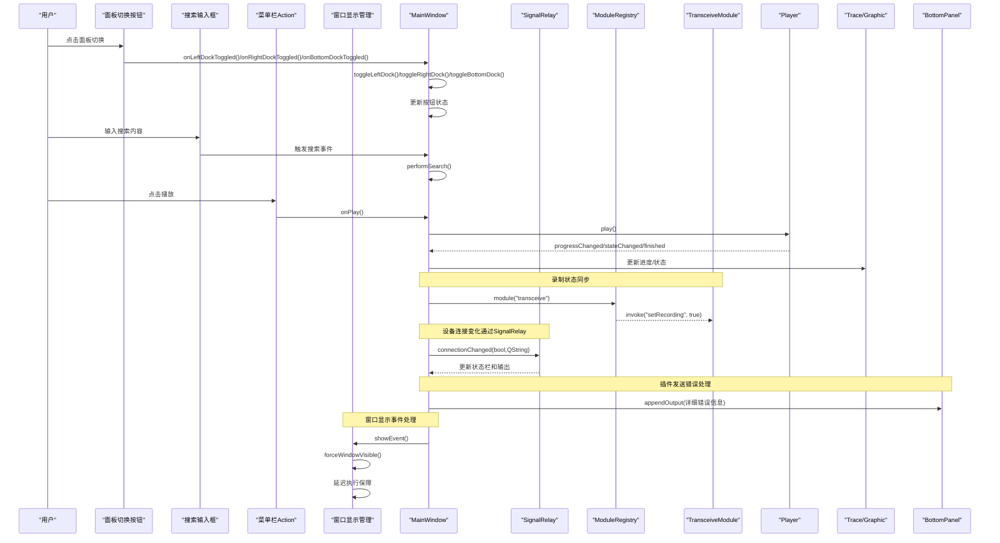

**图表来源**
- [src/ui/mainwindow_chrome.cpp:294-349](file://src/ui/mainwindow_chrome.cpp#L294-L349)
- [src/ui/mainwindow_chrome.cpp:597-654](file://src/ui/mainwindow_chrome.cpp#L597-654)
- [src/ui/mainwindow_window_show.cpp:64-85](file://src/ui/mainwindow_window_show.cpp#L64-L85)
- [src/ui/mainwindow_actions.cpp:127-156](file://src/ui/mainwindow_actions.cpp#L127-L156)
- [src/ui/mainwindow_setup.cpp:223-239](file://src/ui/mainwindow_setup.cpp#L223-239)
- [src/ui/mainwindow_setup.cpp:197-214](file://src/ui/mainwindow_setup.cpp#L197-L214)
- [src/ui/mainwindow_dialogs.cpp:274-302](file://src/ui/mainwindow_dialogs.cpp#L274-302)
- [src/ui/searchview.cpp:167-189](file://src/ui/searchview.cpp#L167-L189)

章节来源
- [src/ui/mainwindow_chrome.cpp:294-349](file://src/ui/mainwindow_chrome.cpp#L294-L349)
- [src/ui/mainwindow_chrome.cpp:597-654](file://src/ui/mainwindow_chrome.cpp#L597-654)
- [src/ui/mainwindow_window_show.cpp:64-85](file://src/ui/mainwindow_window_show.cpp#L64-L85)
- [src/ui/mainwindow_actions.cpp:127-156](file://src/ui/mainwindow_actions.cpp#L127-L156)
- [src/ui/mainwindow_setup.cpp:223-239](file://src/ui/mainwindow_setup.cpp#L223-239)
- [src/ui/mainwindow_setup.cpp:197-214](file://src/ui/mainwindow_setup.cpp#L197-L214)

### 数据流与状态管理
- 数据源：CanSimulator 与 CanDeviceManager 均发射 frameGenerated，统一接入 onFrameReceived。
- 测量运行标志 m_measurementRunning：由 Flow 页面控制，为 false 时直接断流。
- 模块级使能：Trace 标签页 isRunning、Graphic 属性 flowEnabled、MeasurementSetupView 模块开关。
- 状态同步：updateActions 根据播放器状态更新菜单可用性；updateStatistics 更新状态栏统计。
- 工程状态：captureProjectState/applyProjectState 负责保存/恢复数据源、设备配置、DBC、默认实例、标签顺序等。
- 模块查询：通过 flowQuery/transceiveQuery 获取模块状态信息。
- **SignalRelay状态管理**：录制状态变化通过SignalRelay处理，确保UI状态与录制器状态同步。
- **增强的错误状态管理**：插件帧发送失败时提供详细的错误状态和用户反馈。
- **面板切换状态管理**：面板切换按钮状态与对应DockWidget的可见性保持同步。
- **窗口显示状态管理**：通过多重机制确保窗口显示状态的正确性和一致性。
- **搜索状态管理**：SearchView 维护搜索历史、结果缓存和防抖定时器。

```mermaid
flowchart TD
S(["收到帧"]) --> CheckRun{"测量运行?"}
CheckRun --> |否| Drop["丢弃帧(不分发)"]
CheckRun --> |是| Distribute["分发到各模块"]
Distribute --> Trace["TraceTab.appendFrame(若运行)"]
Distribute --> Graphic["GraphicView.onFrame(若flowEnabled)"]
Distribute --> Recorder["Recorder.recordFrame(若录制中)"]
Distribute --> Stats["BusStatistics.onFrame"]
Distribute --> DataWin["DataWindow.onFrame"]
Distribute --> Plugin["PluginManager.onFrameReceived"]
Note over Distribute: 录制状态同步
Distribute --> Transceive["transceiveInvoke('setRecording', state)"]
Note over MW,SR : 设备连接变化通过SignalRelay
Distribute --> ConnRelay["connRelay.fireBoolQString"]
ConnRelay --> UpdateUI["更新状态栏和输出面板"]
Note over MW,BP : 插件发送错误处理
Distribute --> ErrorCheck{"发送成功?"}
ErrorCheck --> |否| ClassifyError["错误分类"]
ClassifyError --> SimMode["模拟器模式限制"]
ClassifyError --> ConnIssue["设备连接问题"]
ClassifyError --> GenFailure["一般传输失败"]
SimMode --> Output["输出详细错误信息"]
ConnIssue --> Output
GenFailure --> Output
Note over MW: 面板切换状态管理
Distribute --> PanelToggle["面板切换按钮状态同步"]
PanelToggle --> UpdateButtons["更新按钮checked状态"]
Note over MW,WindowShow: 窗口显示状态管理
Distribute --> WindowCheck["检查窗口显示状态"]
WindowCheck --> ForceShow["必要时强制显示"]
ForceShow --> ScreenDetect["屏幕几何检测"]
ForceShow --> LayerManage["窗口层级管理"]
Note over MW,SearchView: 搜索状态管理
Distribute --> SearchDebounce["防抖定时器"]
SearchDebounce --> PerformSearch["执行搜索"]
PerformSearch --> UpdateResults["更新搜索结果"]
```

**图表来源**
- [src/ui/mainwindow_frameflow.cpp:99-137](file://src/ui/mainwindow_frameflow.cpp#L99-L137)
- [src/ui/mainwindow_chrome.cpp:597-654](file://src/ui/mainwindow_chrome.cpp#L597-654)
- [src/ui/mainwindow_window_show.cpp:18-85](file://src/ui/mainwindow_window_show.cpp#L18-L85)
- [src/ui/mainwindow_actions.cpp:412-448](file://src/ui/mainwindow_actions.cpp#L412-L448)
- [src/ui/mainwindow_setup.cpp:197-214](file://src/ui/mainwindow_setup.cpp#L197-L214)
- [src/ui/mainwindow_dialogs.cpp:274-302](file://src/ui/mainwindow_dialogs.cpp#L274-302)
- [src/ui/searchview.cpp:182-291](file://src/ui/searchview.cpp#L182-L291)

章节来源
- [src/ui/mainwindow_frameflow.cpp:99-137](file://src/ui/mainwindow_frameflow.cpp#L99-L137)
- [src/ui/mainwindow_chrome.cpp:597-654](file://src/ui/mainwindow_chrome.cpp#L597-654)
- [src/ui/mainwindow_window_show.cpp:18-85](file://src/ui/mainwindow_window_show.cpp#L18-L85)
- [src/ui/mainwindow_actions.cpp:412-448](file://src/ui/mainwindow_actions.cpp#L412-L448)
- [src/ui/mainwindow_setup.cpp:197-214](file://src/ui/mainwindow_setup.cpp#L197-L214)

### 样式系统与资源访问
- 样式表：default.qss 定义了全局控件风格、Dock、Tab、按钮、表格、滚动条、状态栏等。
- **VSCode风格面板切换样式**：panel-toggles.qss 专门定义面板切换按钮的样式，包括悬停、选中、未选中状态。
- **全局搜索样式**：SearchView 使用主题管理器动态应用样式，支持深色/浅色主题。
- 资源注册：resources.qrc 将样式表与图标等资源纳入 Qt 资源系统，便于运行时加载。
- 主题管理：ThemeManager 负责应用主题，SideBar 设置面板触发主题切换。
- **SignalRelay主题处理**：主题变化通过SignalRelay处理，避免跨DLL场景的连接问题。
- **无边框窗口样式**：通过 setWindowFlags(Qt::Window | Qt::FramelessWindowHint) 实现自定义窗口外观。
- **SVG图标集成**：使用 svgIcon 函数统一加载和管理SVG图标，支持主题颜色适配。

章节来源
- [src/ui/mainwindow_chrome.cpp:288-295](file://src/ui/mainwindow_chrome.cpp#L288-L295)
- [src/ui/mainwindow_chrome.cpp:283-285](file://src/ui/mainwindow_chrome.cpp#L283-L285)
- [src/ui/mainwindow.cpp:104](file://src/ui/mainwindow.cpp#L104)
- [resources/panel-toggles.qss:1-26](file://resources/panel-toggles.qss#L1-L26)
- [src/ui/searchview.cpp:62-76](file://src/ui/searchview.cpp#L62-L76)
- [src/ui/searchview.cpp:94-119](file://src/ui/searchview.cpp#L94-L119)

### 插件扩展点
- 插件管理器：PluginManager 单例，提供发现、激活/停用、命令执行、输出、帧请求、选中帧提供等能力。
- 扩展面板：ExtensionsTab 与 SideBar 的 ExtensionsPanel 协同，展示插件列表、命令、启用状态。
- **SignalRelay插件事件**：pluginListChanged 通过SignalRelay处理，确保市场页面正确刷新。
- 事件桥接：MainWindow 连接插件信号到自身槽，转发到底部面板、设备发送、选中帧提供等。
- 模块集成：MarketModule 通过 ModuleRegistry 管理，提供统一的插件安装与管理界面。
- **增强的插件帧发送错误处理**：提供详细的错误分类和用户反馈机制。

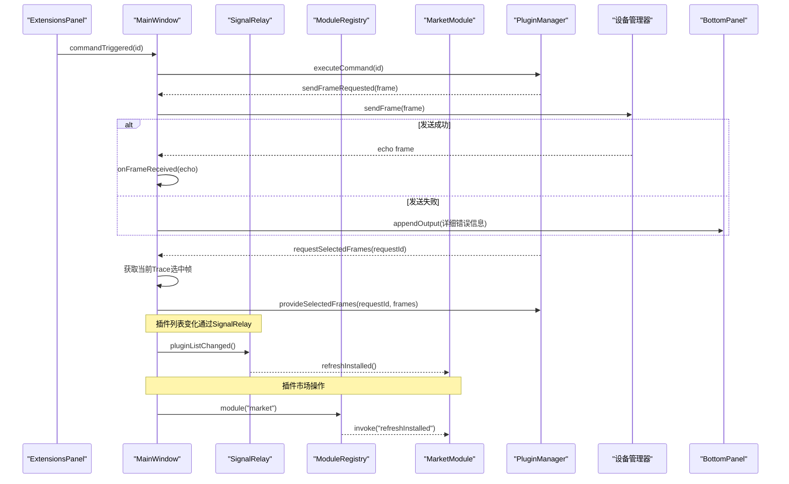

**图表来源**
- [src/ui/mainwindow_dialogs.cpp:262-296](file://src/ui/mainwindow_dialogs.cpp#L262-L296)
- [src/ui/mainwindow_setup.cpp:174-181](file://src/ui/mainwindow_setup.cpp#L174-L181)
- [src/ui/mainwindow_dialogs.cpp:274-302](file://src/ui/mainwindow_dialogs.cpp#L274-L302)

章节来源
- [src/ui/mainwindow_dialogs.cpp:262-296](file://src/ui/mainwindow_dialogs.cpp#L262-L296)
- [src/ui/mainwindow_setup.cpp:174-181](file://src/ui/mainwindow_setup.cpp#L174-L181)

### 生命周期管理
- 构造阶段：初始化核心服务、插件系统、菜单栏、窗口按钮、**面板切换按钮**、状态栏、布局、信号槽连接、默认标签页、工程自动加载。
- 运行阶段：响应用户交互、数据流、插件事件、工程切换、**面板切换操作**。
- 关闭阶段：closeEvent 中停止录制/设备/播放器、关闭插件、自动保存工程。
- 析构阶段：在析构函数中首先断开所有widget的destroyed信号连接，避免在基类deleteChildren阶段访问已释放的QMap节点导致use-after-free崩溃。
- 标签页销毁：通过 QObject::destroyed 信号清理实例映射与 Flow 场景中的模块块，避免悬空引用。
- 模块生命周期：模块实例通过 ModuleRegistry 管理，支持惰性创建和缓存。
- **SignalRelay生命周期**：每个SignalRelay实例都有明确的父对象管理，确保正确的析构顺序。
- **窗口显示生命周期**：通过 showEvent 重写和延迟执行确保窗口显示状态的稳定性。
- **搜索面板生命周期**：GlobalSearchPanel 和 SearchView 有独立的内存管理和生命周期控制。

章节来源
- [src/ui/mainwindow_project.cpp:99-125](file://src/ui/mainwindow_project.cpp#L99-L125)
- [src/ui/mainwindow_project.cpp:332-347](file://src/ui/mainwindow_project.cpp#L332-347)
- [src/ui/mainwindow_window_show.cpp:64-85](file://src/ui/mainwindow_window_show.cpp#L64-L85)
- [src/ui/globalsearchpanel.cpp:69-71](file://src/ui/globalsearchpanel.cpp#L69-L71)
- [src/ui/searchview.cpp:38-40](file://src/ui/searchview.cpp#L38-L40)

### Flow模块页面创建机制
- FlowModule实现了完整的IBusinessModule接口，支持"setup"和"device"两种页面类型。
- **关键修复**：添加了`createPage(const QString &pageId, ShellContext &ctx)`二参数重载，转发到三参数版本，解决壳侧无参调用返回nullptr的问题。
- 页面缓存机制：使用QMap<QString, QPointer<QWidget>>缓存页面实例，页面关闭时自动清理缓存。
- 设备连接页支持参数传递：通过QVariantList携带设备信息{deviceKind, devIndex, deviceName, deviceType}。
- 测量配置页与数据层服务集成：直接操作DbcManager、Simulator、DeviceManager等数据层服务。

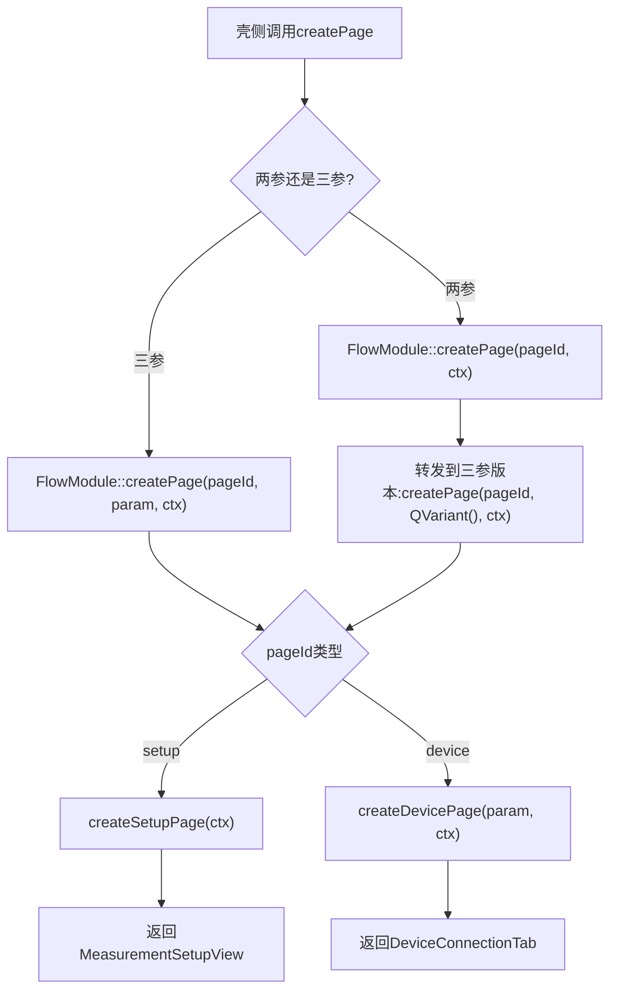

**图表来源**
- [src/ui/flowmodule.h:32-36](file://src/ui/flowmodule.h#L32-L36)

章节来源
- [src/ui/flowmodule.h:32-36](file://src/ui/flowmodule.h#L32-L36)

### SignalRelay基础设施集成
- **问题背景**：MinGW编译器在跨DLL场景下，新式PMF connect的信号查找会拿到本地跳转thunk地址，与data.dll内moc比较的真实地址不等，导致连接静默失败。
- **解决方案**：SignalRelay提供字符串信号到lambda/std::function的桥接，利用Qt运行期字符串匹配机制，不受PMF地址比较影响。
- **应用场景**：
  - 插件管理器事件：pluginListChanged → 刷新市场页面
  - 设备连接变化：connectionChanged(bool, QString) → 更新状态栏和输出
  - 录制状态变化：recordingStarted/recordingStopped → 同步UI状态
  - DBC加载通知：dbcLoaded → 显示加载完成信息
  - 错误处理：errorOccurred → 输出错误信息
- **实现方式**：每个SignalRelay实例维护std::function类型的回调目标，通过对应的fire方法转发信号。

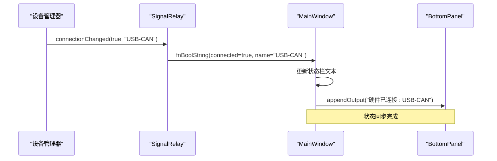

**图表来源**
- [src/ui/mainwindow_setup.cpp:197-214](file://src/ui/mainwindow_setup.cpp#L197-L214)
- [src/core/signalrelay.h:37-41](file://src/core/signalrelay.h#L37-L41)
- [src/core/signalrelay.cpp:13-16](file://src/core/signalrelay.cpp#L13-L16)

章节来源
- [src/ui/mainwindow_setup.cpp:197-214](file://src/ui/mainwindow_setup.cpp#L197-L214)
- [src/core/signalrelay.h:7-49](file://src/core/signalrelay.h#L7-L49)
- [src/core/signalrelay.cpp:1-32](file://src/core/signalrelay.cpp#L1-L32)

### 增强的插件帧发送错误处理
- **错误分类机制**：实现了三层错误检测逻辑，从设备管理器初始化检查到具体发送失败原因分析。
- **模拟器模式限制**：当设备管理器处于模拟器模式时，明确提示不支持发送功能。
- **设备连接问题**：当设备未运行时，提示用户先连接设备。
- **一般传输失败**：对于其他发送失败情况，提供通用的错误提示。
- **详细用户反馈**：通过 BottomPanel 输出系统提供包含时间戳的详细错误信息，包括帧ID等上下文信息。
- **用户体验改进**：相比之前的静默失败，现在用户可以清楚地了解发送失败的具体原因。

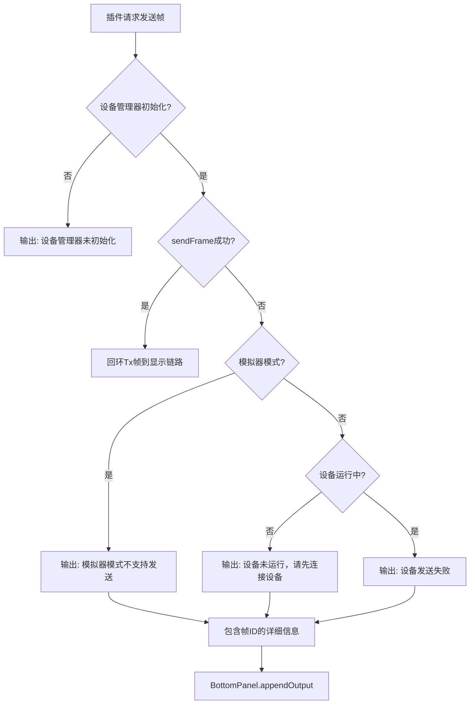

**图表来源**
- [src/ui/mainwindow_dialogs.cpp:274-302](file://src/ui/mainwindow_dialogs.cpp#L274-302)
- [src/ui/bottompanel.cpp:115-119](file://src/ui/bottompanel.cpp#L115-L119)

章节来源
- [src/ui/mainwindow_dialogs.cpp:274-302](file://src/ui/mainwindow_dialogs.cpp#L274-302)
- [src/ui/bottompanel.cpp:115-119](file://src/ui/bottompanel.cpp#L115-L119)

### VSCode风格面板切换系统
- **面板切换按钮组**：位于窗口右上角，包含左侧边栏、右侧面板、底部面板切换按钮和布局重置按钮。
- **专用样式设计**：通过 panel-toggles.qss 文件定义按钮样式，支持透明背景、悬停效果、选中状态和未选中状态。
- **双向状态同步**：按钮的 checked 状态与对应 DockWidget 的可见性保持同步。
- **多重触发方式**：支持通过按钮点击和视图菜单两种方式控制面板可见性。
- **布局重置功能**：一键恢复所有面板到默认位置和大小。

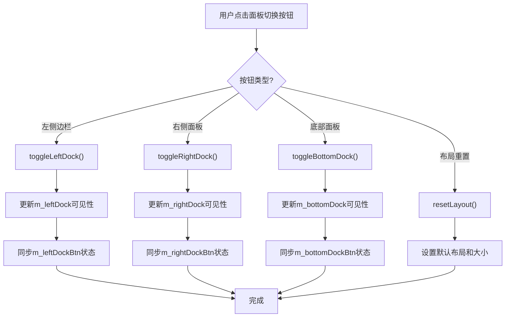

**图表来源**
- [src/ui/mainwindow_chrome.cpp:294-349](file://src/ui/mainwindow_chrome.cpp#L294-L349)
- [src/ui/mainwindow_chrome.cpp:597-654](file://src/ui/mainwindow_chrome.cpp#L597-654)
- [resources/panel-toggles.qss:1-26](file://resources/panel-toggles.qss#L1-L26)

章节来源
- [src/ui/mainwindow_chrome.cpp:294-349](file://src/ui/mainwindow_chrome.cpp#L294-L349)
- [src/ui/mainwindow_chrome.cpp:597-654](file://src/ui/mainwindow_chrome.cpp#L597-654)
- [resources/panel-toggles.qss:1-26](file://resources/panel-toggles.qss#L1-L26)

### 增强的窗口可见性管理系统
- **强制显示逻辑**：通过 forceWindowVisible() 方法实现多层级的窗口显示保障机制。
- **屏幕几何检测**：检测主屏幕可用区域，将窗口移动到屏幕中心位置，防止出现在副屏或屏幕外。
- **窗口层级管理**：通过 raise()、activateWindow() 等方法确保窗口在最前显示。
- **原生事件处理**：在 Windows 平台上使用 ShowWindow()、SetForegroundWindow()、BringWindowToTop() 等 API 强制显示窗口。
- **showEvent 重写**：重写窗口显示事件，添加延迟执行机制，确保窗口显示逻辑在合适的时机执行。
- **调试日志增强**：添加详细的调试输出，便于问题诊断和跟踪。

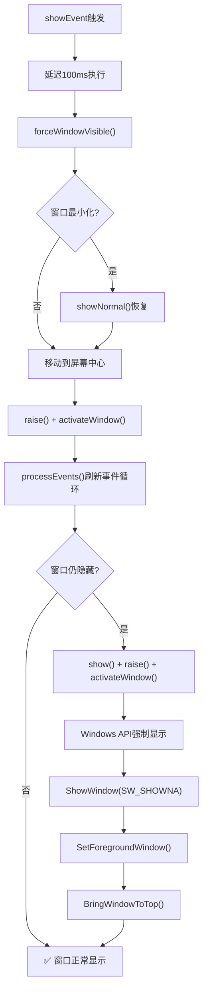

**图表来源**
- [src/ui/mainwindow_window_show.cpp:18-85](file://src/ui/mainwindow_window_show.cpp#L18-L85)
- [src/ui/mainwindow_force_show.cpp:50-80](file://src/ui/mainwindow_force_show.cpp#L50-L80)

章节来源
- [src/ui/mainwindow_window_show.cpp:18-85](file://src/ui/mainwindow_window_show.cpp#L18-L85)
- [src/ui/mainwindow_force_show.cpp:50-80](file://src/ui/mainwindow_force_show.cpp#L50-L80)

### 全局搜索系统
- **GlobalSearchPanel**：模态对话框形式的搜索面板，支持全屏覆盖和键盘快捷键操作。
- **SearchView**：核心搜索组件，提供输入框、结果显示列表和搜索逻辑。
- **搜索类型支持**：文件搜索、活动搜索（Trace、Graphic等）、命令搜索、设置搜索。
- **防抖机制**：使用QTimer实现输入防抖，避免频繁搜索操作。
- **主题集成**：通过ThemeManager动态应用主题样式，支持深色/浅色模式。
- **键盘导航**：支持ESC键关闭、方向键导航、Enter键选择等功能。
- **结果展示**：自定义列表项显示，包含图标、标题、副标题等信息。

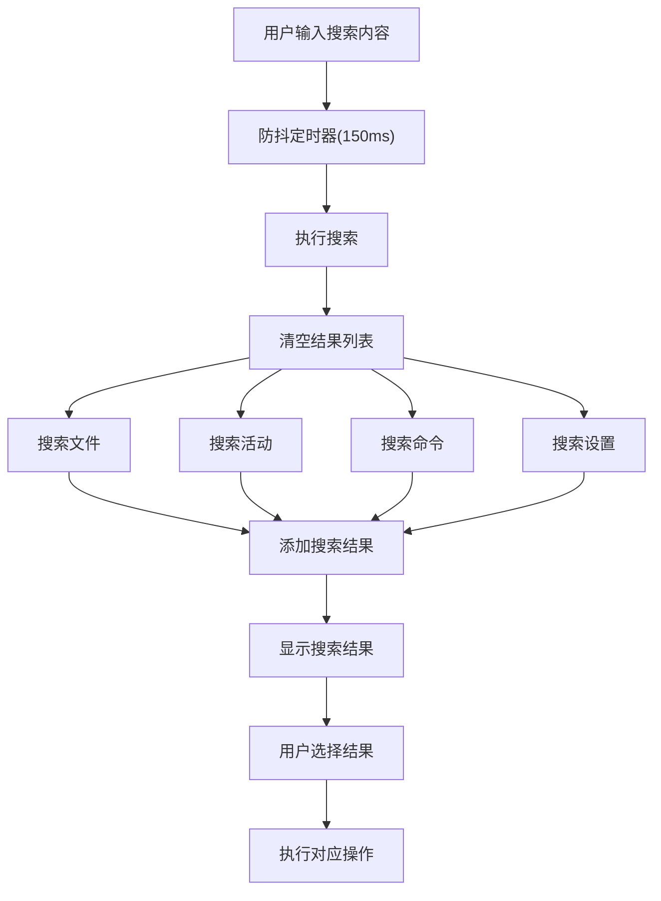

**图表来源**
- [src/ui/searchview.cpp:182-291](file://src/ui/searchview.cpp#L182-L291)
- [src/ui/globalsearchpanel.cpp:17-67](file://src/ui/globalsearchpanel.cpp#L17-L67)

章节来源
- [src/ui/searchview.cpp:182-291](file://src/ui/searchview.cpp#L182-L291)
- [src/ui/globalsearchpanel.cpp:17-67](file://src/ui/globalsearchpanel.cpp#L17-L67)

## 依赖关系分析
- MainWindow 强依赖多个子系统：Recorder、Player、CanSimulator、CanDeviceManager、DbcManager、BusStatistics、FilterPresetManager、BookmarkManager、TriggerRecorder、PluginManager。
- 通过 ModuleRegistry 弱依赖业务模块：FlowModule、TransceiveModule、MarketModule、DbcModule、TraceModule、GraphicModule。
- **通过 SignalRelay 弱依赖跨DLL组件**：解决MinGW下跨DLL信号连接问题。
- **通过 BottomPanel 弱依赖错误输出系统**：提供详细的用户反馈和错误分类。
- **通过 PanelToggleButtons 弱依赖面板切换系统**：提供直观的UI控制面板可见性。
- **通过 GlobalSearchPanel 弱依赖搜索系统**：提供全局搜索功能。
- **通过窗口可见性管理系统弱依赖平台特定功能**：提供跨平台的窗口显示保障。
- UI 组件之间通过信号槽松耦合：ActivityBar ↔ SideBar ↔ EditorArea ↔ Panels。
- 数据流单向：设备/模拟器 → MainWindow → 各消费模块。
- 工程状态通过 ProjectManager 序列化/反序列化，保证跨会话一致性。

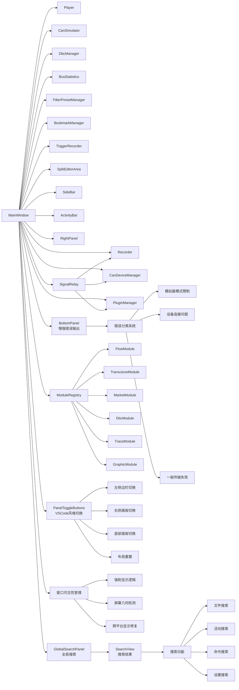

**图表来源**
- [src/ui/mainwindow_setup.cpp:48-81](file://src/ui/mainwindow_setup.cpp#L48-L81)
- [src/ui/mainwindow_chrome.cpp:294-349](file://src/ui/mainwindow_chrome.cpp#L294-L349)
- [src/ui/mainwindow_window_show.cpp:18-85](file://src/ui/mainwindow_window_show.cpp#L18-L85)
- [src/core/module/moduleregistry.h:27-50](file://src/core/module/moduleregistry.h#L27-L50)
- [src/core/signalrelay.h:29-49](file://src/core/signalrelay.h#L29-L49)
- [src/ui/mainwindow_dialogs.cpp:274-302](file://src/ui/mainwindow_dialogs.cpp#L274-302)
- [src/ui/globalsearchpanel.h:8-24](file://src/ui/globalsearchpanel.h#L8-L24)
- [src/ui/searchview.h:12-50](file://src/ui/searchview.h#L12-L50)

章节来源
- [src/ui/mainwindow_setup.cpp:48-81](file://src/ui/mainwindow_setup.cpp#L48-L81)
- [src/ui/mainwindow_chrome.cpp:294-349](file://src/ui/mainwindow_chrome.cpp#L294-L349)
- [src/ui/mainwindow_window_show.cpp:18-85](file://src/ui/mainwindow_window_show.cpp#L18-L85)
- [src/core/module/moduleregistry.h:27-50](file://src/core/module/moduleregistry.h#L27-L50)
- [src/core/signalrelay.h:29-49](file://src/core/signalrelay.h#L29-L49)

## 性能与内存优化
- 数据流节流：测量未运行时直接断流，避免无效分发。
- 模块级使能：仅对运行中的 Trace 与启用的 Graphic 分发帧，减少渲染压力。
- 定时器管理：周期发送使用 QHash<int, QTimer*> 管理行号到定时器的映射，停止时及时释放。
- 标签页销毁：使用 delete 而非 deleteLater 在工程切换时立即销毁旧 Trace/Graphic，防止 use-after-free。
- **析构安全**：在析构函数中优先断开所有destroyed信号连接，避免基类deleteChildren阶段的use-after-free问题。
- **SignalRelay内存管理**：每个SignalRelay实例都有明确的生命周期管理，通过parent-child关系确保正确释放。
- 延迟清理：模块实例关闭时使用 QTimer::singleShot(0) 延迟到下一轮事件循环，避免在右键菜单 exec() 本地事件循环中触发重建导致崩溃。
- 自动滚动：仅在非覆盖模式下且开启自动滚动时滚动到底部，减少频繁重绘。
- 资源加载：QSS 与图标通过 .qrc 统一管理，避免路径错误与重复加载。
- 模块缓存：ModuleRegistry 惰性创建模块实例，减少内存占用。
- **错误处理优化**：增强的错误处理机制避免了不必要的计算和资源消耗，只在真正发生错误时才生成详细的错误信息。
- **面板切换优化**：面板切换操作直接操作QDockWidget的可见性，避免不必要的重绘和布局计算。
- **窗口显示优化**：通过延迟执行和条件检查避免不必要的窗口操作，提高显示性能。
- **搜索性能优化**：SearchView 使用防抖机制减少频繁搜索，支持结果缓存和懒加载。

章节来源
- [src/ui/mainwindow_frameflow.cpp:99-137](file://src/ui/mainwindow_frameflow.cpp#L99-L137)
- [src/ui/mainwindow_project.cpp:332-347](file://src/ui/mainwindow_project.cpp#L332-347)
- [src/ui/mainwindow_window_show.cpp:70-74](file://src/ui/mainwindow_window_show.cpp#L70-L74)
- [src/ui/mainwindow_frameflow.cpp:494-516](file://src/ui/mainwindow_frameflow.cpp#L494-L516)
- [src/ui/searchview.cpp:30-32](file://src/ui/searchview.cpp#L30-L32)

## 故障排查指南
- 无法录制：检查文件格式是否支持写入、路径是否有效、磁盘空间是否足够；查看底部面板问题列表。
- 设备连接失败：确认设备驱动与通道配置；查看连接状态与错误输出。
- 数据未显示：确认 Flow 页面已启动测量；检查 Trace/Graphic 模块是否启用；确认自动滚动设置。
- 插件无输出：检查插件是否激活；查看插件命令是否注册；确认底部面板输出通道。
- 工程切换异常：确保正确保存当前工程状态；检查 DBC 文件是否存在；关注标签页销毁顺序。
- **Flow页面打不开**：检查Flow模块是否正确注册；确认createPage二参数重载已实现；验证ModuleRegistry实例化。
- **程序退出崩溃**：确认析构函数中已正确断开所有destroyed信号连接；检查QMap节点访问时机。
- **SignalRelay连接失败**：检查SignalRelay实例是否正确创建；确认回调函数已赋值；验证父对象生命周期。
- **跨DLL信号连接问题**：确认使用SignalRelay而非直接connect；检查MinGW编译环境配置。
- **插件帧发送失败**：查看底部面板输出的详细错误信息，区分是模拟器模式限制、设备连接问题还是一般传输失败。
- **面板切换按钮不工作**：检查createPanelToggleButtons是否正确调用；确认按钮信号槽连接；验证QSS样式加载。
- **面板可见性不同步**：检查toggleLeftDock/toggleRightDock/toggleBottomDock方法；确认按钮状态同步逻辑。
- **模块通信异常**：检查 ShellContext 是否正确传递；确认 shellInvoke 回调是否正常工作。
- **窗口显示问题**：检查forceWindowVisible()是否正确调用；确认showEvent重写逻辑；验证屏幕几何检测功能。
- **无边框窗口异常**：确认setWindowFlags设置正确；检查nativeEvent处理逻辑；验证Windows API调用。
- **全局搜索不工作**：检查GlobalSearchPanel是否正确创建；确认SearchView信号槽连接；验证搜索逻辑实现。
- **搜索结果显示异常**：检查SearchView的performSearch方法；确认防抖定时器工作正常；验证主题样式应用。

章节来源
- [src/ui/mainwindow_actions.cpp:99-125](file://src/ui/mainwindow_actions.cpp#L99-L125)
- [src/ui/mainwindow_frameflow.cpp:342-426](file://src/ui/mainwindow_frameflow.cpp#L342-L426)
- [src/ui/mainwindow_project.cpp:324-444](file://src/ui/mainwindow_project.cpp#L324-444)
- [src/core/module/imodule.h:93-200](file://src/core/module/imodule.h#L93-200)
- [src/core/signalrelay.h:7-49](file://src/core/signalrelay.h#L7-L49)
- [src/ui/mainwindow_dialogs.cpp:274-302](file://src/ui/mainwindow_dialogs.cpp#L274-302)
- [src/ui/mainwindow_chrome.cpp:294-349](file://src/ui/mainwindow_chrome.cpp#L294-L349)
- [src/ui/mainwindow_window_show.cpp:18-85](file://src/ui/mainwindow_window_show.cpp#L18-L85)
- [src/ui/searchview.cpp:182-291](file://src/ui/searchview.cpp#L182-L291)

## 结论
MainWindow 作为应用的协调器枢纽，采用清晰的层次化布局与信号槽解耦机制，通过 ModuleRegistry 实现了业务逻辑的模块化封装。**最新的增强的窗口可见性管理功能、VSCode风格面板切换功能、模块化重构、SignalRelay基础设施集成、增强的插件帧发送错误处理机制以及全新的全局搜索功能进一步增强了系统的稳定性和兼容性**，解决了MinGW环境下跨DLL场景的信号连接问题，同时提供了更友好的用户错误反馈体验和直观的界面控制功能。新的协调器模式将原本集中在 MainWindow 中的代码分散到独立的业务模块中，显著提高了代码的可维护性和可扩展性。通过 Flow 页面控制测量运行、模块级使能、定时器与标签页生命周期管理，兼顾了功能完整性与性能稳定性。**关键的bug修复确保了程序的稳定性和可靠性**：DEF-11修复了析构函数中的use-after-free问题，避免了程序退出时的崩溃；DEF-10修复了Flow模块页面创建的接口兼容性问题，确保Flow页面和设备连接页能够正常打开；**SignalRelay集成解决了跨DLL信号连接问题，提升了系统在复杂编译环境下的稳定性**；**增强的窗口可见性管理系统解决了无边框窗口显示问题，提供了可靠的跨平台显示保障**；**VSCode风格面板切换功能提供了直观的界面控制，提升了用户体验**；**增强的错误处理机制提供了详细的用户反馈，帮助用户快速定位和解决插件帧发送问题**；**全新全局搜索功能提供了类似 VS Code 的搜索体验，大幅提升了用户操作效率**。样式与资源通过 QSS 与 .qrc 统一管理，提升了可维护性与可扩展性。模块化的架构使得新功能开发更加便捷，降低了模块间的耦合度。

## 附录：使用示例与扩展指南

### 基本使用流程
- 启动应用后，默认打开 Flow 与设备连接标签页。
- 在 Flow 页面选择数据源（文件或硬件），点击开始以启动数据流。
- 在 Trace 标签页查看报文，可使用过滤栏与列过滤筛选。
- 双击帧或信号可添加到 Graphic 视图进行波形显示。
- 使用右侧面板快捷按钮进行录制/播放/连接等操作。
- **使用VSCode风格面板切换按钮快速控制面板可见性**。
- **使用全局搜索按钮快速查找文件、活动、命令和设置**。
- 通过底部面板命令行执行常用操作（help、clear、sim/dev on/off、record/play/filter/stats/load 等）。

章节来源
- [src/ui/mainwindow_chrome.cpp:340-348](file://src/ui/mainwindow_chrome.cpp#L340-348)
- [src/ui/mainwindow_chrome.cpp:294-349](file://src/ui/mainwindow_chrome.cpp#L294-L349)
- [src/ui/mainwindow_actions.cpp:321-406](file://src/ui/mainwindow_actions.cpp#L321-L406)

### 扩展插件开发要点
- 实现插件信息注册与命令暴露。
- 订阅 MainWindow 提供的帧事件与选中帧请求。
- 通过 PluginManager 执行命令、激活/停用插件、输出日志。
- 在 ExtensionsTab 与 SideBar 扩展面板中展示插件状态与命令。
- 通过 MarketModule 提供插件安装与管理功能。
- **注意**：插件信号通过SignalRelay桥接，确保跨DLL场景的正确连接。
- **错误处理**：插件帧发送失败时会收到详细的错误信息，可以通过底部面板查看具体原因。

章节来源
- [src/ui/mainwindow_dialogs.cpp:262-296](file://src/ui/mainwindow_dialogs.cpp#L262-L296)
- [src/ui/mainwindow_setup.cpp:174-181](file://src/ui/mainwindow_setup.cpp#L174-L181)
- [src/ui/mainwindow_dialogs.cpp:274-302](file://src/ui/mainwindow_dialogs.cpp#L274-302)

### 自定义样式与主题
- 修改 default.qss 中的控件样式规则，如颜色、边框、字体、滚动条等。
- **定制VSCode风格面板切换按钮样式**：修改 panel-toggles.qss 文件中的按钮样式。
- **定制全局搜索样式**：通过 ThemeManager 动态应用主题样式，支持深色/浅色模式。
- 通过 ThemeManager 动态切换主题，或在启动时应用指定主题。
- 使用 .qrc 资源系统管理样式与图标，确保跨平台一致。
- **主题变化通过SignalRelay处理**，确保跨DLL场景的主题切换正常工作。
- **无边框窗口样式定制**：通过 setWindowFlags 和 nativeEvent 实现自定义窗口外观。
- **SVG图标集成**：使用 svgIcon 函数统一加载和管理SVG图标，支持主题颜色适配。

章节来源
- [src/ui/mainwindow_chrome.cpp:288-295](file://src/ui/mainwindow_chrome.cpp#L288-L295)
- [src/ui/mainwindow_chrome.cpp:283-285](file://src/ui/mainwindow_chrome.cpp#L283-L285)
- [src/ui/mainwindow.cpp:104](file://src/ui/mainwindow.cpp#L104)
- [resources/panel-toggles.qss:1-26](file://resources/panel-toggles.qss#L1-L26)
- [src/ui/searchview.cpp:62-76](file://src/ui/searchview.cpp#L62-L76)
- [src/ui/searchview.cpp:94-119](file://src/ui/searchview.cpp#L94-L119)

### 模块开发指南
- 实现 IBusinessModule 接口，提供 id、title、icon、createWidget 等方法。
- **重要**：必须实现createPage的两参数重载，转发到三参数版本，确保壳侧无参调用正常工作。
- 通过 ModuleRegistry::registerModule 注册模块工厂函数。
- 使用 ShellContext 访问数据层服务和壳回调。
- 通过 invoke/query 方法与壳进行双向通信。
- 支持多页面模块，实现 pages() 和 createPage() 方法。
- 实现页面缓存机制，提高性能和用户体验。
- **跨DLL通信**：如需与跨DLL组件通信，使用SignalRelay进行信号桥接。

章节来源
- [src/core/module/imodule.h:93-200](file://src/core/module/imodule.h#L93-200)
- [src/core/module/moduleregistry.h:27-50](file://src/core/module/moduleregistry.h#L27-L50)
- [src/ui/flowmodule.h:24-48](file://src/ui/flowmodule.h#L24-L48)

### 生命周期管理最佳实践
- **析构函数优先级**：在析构函数开始时立即断开所有可能触发destroyed信号的连接，避免访问已释放的成员变量。
- **信号连接时机**：确保在对象构造完成后再建立复杂的信号槽连接，避免部分初始化的对象被访问。
- **延迟清理策略**：对于需要在对象销毁后执行的清理操作，使用QMetaObject::invokeMethod配合Qt::QueuedConnection确保安全的异步清理。
- **资源所有权**：明确区分Qt对象的所有权模型，合理使用parent-child关系和手动内存管理。
- **异常安全**：在可能的异常路径上确保资源正确释放，避免内存泄漏。
- **SignalRelay生命周期**：确保SignalRelay实例有正确的父对象，避免内存泄漏；在对象销毁前确保回调函数已清理。
- **窗口显示生命周期**：通过showEvent重写和延迟执行确保窗口显示状态的稳定性。
- **搜索面板生命周期**：GlobalSearchPanel 和 SearchView 有独立的内存管理和生命周期控制。

章节来源
- [src/ui/mainwindow_project.cpp:99-125](file://src/ui/mainwindow_project.cpp#L99-L125)
- [src/ui/mainwindow_project.cpp:332-347](file://src/ui/mainwindow_project.cpp#L332-347)
- [src/ui/mainwindow_window_show.cpp:64-85](file://src/ui/mainwindow_window_show.cpp#L64-L85)
- [src/ui/globalsearchpanel.cpp:69-71](file://src/ui/globalsearchpanel.cpp#L69-L71)
- [src/ui/searchview.cpp:38-40](file://src/ui/searchview.cpp#L38-L40)

### SignalRelay使用示例
- **设备连接变化处理**：
```cpp
auto *connRelay = new SignalRelay(this);
connRelay->fnBoolString = [this](bool connected, const QString &name) {
    if (connected) {
        m_connLabel->setText(QStringLiteral("已连接: %1").arg(name));
        m_bottomPanel->appendOutput(QStringLiteral("硬件已连接: %1").arg(name));
    } else {
        m_connLabel->setText("未连接");
        m_bottomPanel->appendOutput(QStringLiteral("硬件已断开"));
    }
};
connect(m_deviceManager, SIGNAL(connectionChanged(bool,QString)),
        connRelay, SLOT(fireBoolQString(bool,QString)));
```

- **插件列表变化处理**：
```cpp
auto *pluginRelay = new SignalRelay(this);
pluginRelay->fire0 = [this]() {
    if (m_marketWidget) marketInvoke(QStringLiteral("refreshInstalled"));
};
connect(m_pluginManager, SIGNAL(pluginListChanged()),
        pluginRelay, SLOT(fire()));
```

- **录制状态变化处理**：
```cpp
auto *recStartRelay = new SignalRelay(this);
recStartRelay->fire0 = [this]() {
    m_recording = true;
    m_bottomPanel->appendOutput("录制开始");
    transceiveInvoke(QStringLiteral("setRecording"), true);
    updateActions();
};
connect(m_recorder, SIGNAL(recordingStarted(QString)), recStartRelay, SLOT(fire()));
```

章节来源
- [src/ui/mainwindow_setup.cpp:197-214](file://src/ui/mainwindow_setup.cpp#L197-L214)
- [src/ui/mainwindow_setup.cpp:223-239](file://src/ui/mainwindow_setup.cpp#L223-L239)
- [src/ui/mainwindow_setup.cpp:174-181](file://src/ui/mainwindow_setup.cpp#L174-L181)
- [src/core/signalrelay.h:37-41](file://src/core/signalrelay.h#L37-L41)

### 增强的错误处理使用示例
- **插件帧发送错误处理**：
```cpp
void MainWindow::onPluginSendFrame(const CanFrame &frame)
{
    // 基础检查
    if (!m_deviceManager) {
        m_bottomPanel->appendOutput(
            QStringLiteral("插件发送失败: 设备管理器未初始化"));
        return;
    }

    // 尝试发送
    CanFrame echo;
    if (m_deviceManager->sendFrame(frame, &echo)) {
        // 发送成功，回环显示
        onFrameReceived(echo);
        return;
    }

    // 失败原因细分提示
    QString reason;
    if (!m_deviceManager->isRealDevice())
        reason = QStringLiteral("模拟器模式不支持发送");
    else if (!m_deviceManager->isRunning())
        reason = QStringLiteral("设备未运行，请先连接设备");
    else
        reason = QStringLiteral("设备发送失败");
    
    // 输出详细错误信息
    m_bottomPanel->appendOutput(
        QStringLiteral("插件发送失败 (%1): ID=0x%2")
            .arg(reason)
            .arg(frame.id & 0x1FFFFFFF, 0, 16).toUpper());
}
```

章节来源
- [src/ui/mainwindow_dialogs.cpp:274-302](file://src/ui/mainwindow_dialogs.cpp#L274-302)
- [src/ui/bottompanel.cpp:115-119](file://src/ui/bottompanel.cpp#L115-L119)

### VSCode风格面板切换使用示例
- **面板切换按钮实现**：
```cpp
void MainWindow::createPanelToggleButtons()
{
    m_windowControlPanel = new QWidget(this);
    m_windowControlPanel->setObjectName("PanelTogglePanel");
    m_windowControlPanel->setFixedHeight(30);
    auto *panelLayout = new QHBoxLayout(m_windowControlPanel);
    panelLayout->setContentsMargins(4, 0, 0, 0);
    panelLayout->setSpacing(2);

    // 左侧折叠栏切换
    m_leftDockBtn = new QToolButton(m_windowControlPanel);
    m_leftDockBtn->setFixedSize(30, 30);
    m_leftDockBtn->setAutoRaise(true);
    m_leftDockBtn->setCheckable(true);
    m_leftDockBtn->setChecked(true);
    m_leftDockBtn->setToolTip("切换左侧边栏");
    connect(m_leftDockBtn, &QToolButton::clicked, this, &MainWindow::onLeftDockToggled);

    // 右侧面板切换
    m_rightDockBtn = new QToolButton(m_windowControlPanel);
    m_rightDockBtn->setFixedSize(30, 30);
    m_rightDockBtn->setAutoRaise(true);
    m_rightDockBtn->setCheckable(true);
    m_rightDockBtn->setChecked(true);
    m_rightDockBtn->setToolTip("切换右侧边栏");
    connect(m_rightDockBtn, &QToolButton::clicked, this, &MainWindow::onRightDockToggled);

    // 底部信息栏切换
    m_bottomDockBtn = new QToolButton(m_windowControlPanel);
    m_bottomDockBtn->setFixedSize(30, 30);
    m_bottomDockBtn->setAutoRaise(true);
    m_bottomDockBtn->setCheckable(true);
    m_bottomDockBtn->setChecked(true);
    m_bottomDockBtn->setToolTip("切换底部信息栏");
    connect(m_bottomDockBtn, &QToolButton::clicked, this, &MainWindow::onBottomDockToggled);

    // 重置布局按钮
    m_layoutResetBtn = new QToolButton(m_windowControlPanel);
    m_layoutResetBtn->setFixedSize(30, 30);
    m_layoutResetBtn->setAutoRaise(true);
    m_layoutResetBtn->setToolTip("恢复默认布局");
    connect(m_layoutResetBtn, &QToolButton::clicked, this, &MainWindow::onLayoutReset);

    panelLayout->addWidget(m_leftDockBtn);
    panelLayout->addWidget(m_rightDockBtn);
    panelLayout->addWidget(m_bottomDockBtn);
    panelLayout->addStretch();
    panelLayout->addWidget(m_layoutResetBtn);

    menuBar()->setCornerWidget(m_windowControlPanel, Qt::TopRightCorner);

    // 初始应用状态
    m_leftDockBtn->setChecked(m_leftDock && m_leftDock->isVisible());
    m_rightDockBtn->setChecked(m_rightDock && m_rightDock->isVisible());
    m_bottomDockBtn->setChecked(m_bottomDock && m_bottomDock->isVisible());
}
```

- **面板切换样式定义**：
```css
/* VSCode 风格面板切换按钮样式 */
QWidget#PanelTogglePanel {
    background-color: rgba(0, 0, 0, 0);
}

QToolButton#PanelTogglePanel QToolButton {
    border: none;
    border-radius: 3px;
    background-color: transparent;
}

QToolButton#PanelTogglePanel QToolButton:hover {
    background-color: rgba(255, 255, 255, 0.1);
}

QToolButton#PanelTogglePanel QToolButton:checked {
    background-color: rgba(0, 122, 209, 0.4);
}

QToolButton#PanelTogglePanel QToolButton:!checked {
    background-color: rgba(128, 128, 128, 0.2);
}
```

章节来源
- [src/ui/mainwindow_chrome.cpp:294-349](file://src/ui/mainwindow_chrome.cpp#L294-L349)
- [resources/panel-toggles.qss:1-26](file://resources/panel-toggles.qss#L1-L26)

### 增强的窗口可见性管理使用示例
- **强制显示逻辑实现**：
```cpp
void MainWindow::forceWindowVisible()
{
    qDebug() << "[MainWindow::forceWindowVisible] 正在强制窗口可见...";
    
    // 1. 确保窗口不是最小化状态
    if (isMinimized()) {
        qDebug() << "[MainWindow::forceWindowVisible] 恢复最小化窗口";
        showNormal();
    }
    
    // 2. 移动到主屏幕中心（防止在副屏或屏幕外）
    QRect screenRect = QApplication::primaryScreen()->availableGeometry();
    int x = (screenRect.width() - width()) / 2;
    int y = (screenRect.height() - height()) / 2;
    move(x, y);
    
    qDebug() << "[MainWindow::forceWindowVisible] 已移动到：" << geometry();
    
    // 3. 确保窗口层级在最前
    raise();
    activateWindow();
    
    // 4. 如果还是不可见，尝试刷新事件循环
    QCoreApplication::processEvents(QEventLoop::AllEvents, 5000);
    
    // 5. 再次检查并强制显示
    if (isHidden()) {
        qDebug() << "[MainWindow::forceWindowVisible] 警告：窗口仍被隐藏！尝试重新 show...";
        show();
        raise();
        activateWindow();
        
        // 6. 使用 Windows API 强制显示窗口
        HWND hwnd = reinterpret_cast<HWND>(winId());
        if (hwnd) {
            ShowWindow(hwnd, SW_SHOWNA);
            SetForegroundWindow(hwnd);
            BringWindowToTop(hwnd);
            qDebug() << "[MainWindow::forceWindowVisible] 已使用 Windows API 强制显示";
        }
    } else {
        qDebug() << "[MainWindow::forceWindowVisible] ✅ 窗口已正常显示：" << geometry();
    }
}
```

- **showEvent重写实现**：
```cpp
void MainWindow::showEvent(QShowEvent *event)
{
    QMainWindow::showEvent(event);
    
    qDebug() << "[MainWindow::showEvent] 窗口显示事件触发";
    
    // 延迟一点执行强制可见逻辑
    QTimer::singleShot(100, this, [this]() {
        forceWindowVisible();
    });
}
```

章节来源
- [src/ui/mainwindow_window_show.cpp:18-85](file://src/ui/mainwindow_window_show.cpp#L18-L85)
- [src/ui/mainwindow_force_show.cpp:50-80](file://src/ui/mainwindow_force_show.cpp#L50-L80)

### 全局搜索系统使用示例
- **全局搜索面板实现**：
```cpp
// 创建全局搜索面板
void MainWindow::showGlobalSearch()
{
    if (!m_searchPanel) {
        m_searchPanel = new GlobalSearchPanel(this);
        connect(m_searchPanel, &QDialog::accepted, this, [this]() {
            m_searchPanel = nullptr;
        });
    }
    m_searchPanel->show();
    m_searchPanel->raise();
    m_searchPanel->activateWindow();
}
```

- **搜索视图实现**：
```cpp
// 搜索视图的核心功能
SearchView::SearchView(QWidget *parent)
    : QWidget(parent)
{
    setObjectName("SearchView");
    setBackgroundRole(QPalette::Base);
    
    m_debounceTimer = new QTimer(this);
    m_debounceTimer->setSingleShot(true);
    m_debounceTimer->setInterval(150);  // 150ms
    
    setupUI();
    connectSignals();
}

// 执行搜索逻辑
void SearchView::performSearch()
{
    QString query = m_searchEdit->text().trimmed().toLower();
    if (query.isEmpty()) {
        showEmptyResult();
        return;
    }
    
    m_resultList->clear();
    
    // 搜索文件
    static const QStringList recentFiles = {"project.openbus", "engine.dbc", "trace.asc"};
    for (const QString &file : recentFiles) {
        if (file.contains(query)) {
            addSearchResult(":/icons/file.svg", file, "File", FileType);
        }
    }
    
    // 搜索活动
    static const QList<QPair<QString, QString>> activities = {
        {"trace", "Trace View"},
        {"graphic", "Signal Graph"},
        {"dbc", "DBC Details"},
        {"send", "Signal Send"},
        {"record", "Recording"},
        {"flow", "Measurement Setup"}
    };
    
    for (const auto &act : activities) {
        if (act.first.contains(query) || act.second.toLower().contains(query)) {
            addSearchResult(":/icons/trace.svg", act.second, act.first, ActivityType);
        }
    }
    
    // 搜索命令和设置...
}
```

章节来源
- [src/ui/globalsearchpanel.cpp:17-67](file://src/ui/globalsearchpanel.cpp#L17-L67)
- [src/ui/searchview.cpp:24-36](file://src/ui/searchview.cpp#L24-L36)
- [src/ui/searchview.cpp:213-291](file://src/ui/searchview.cpp#L213-L291)