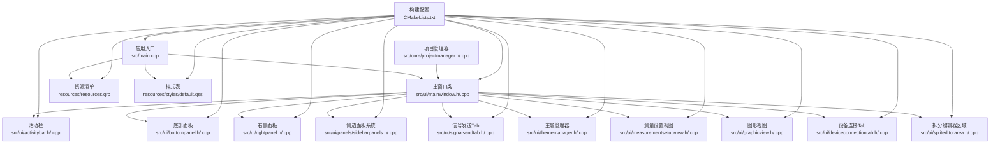
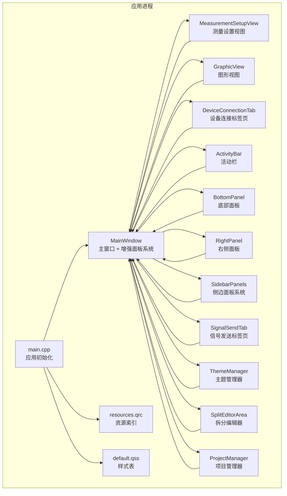
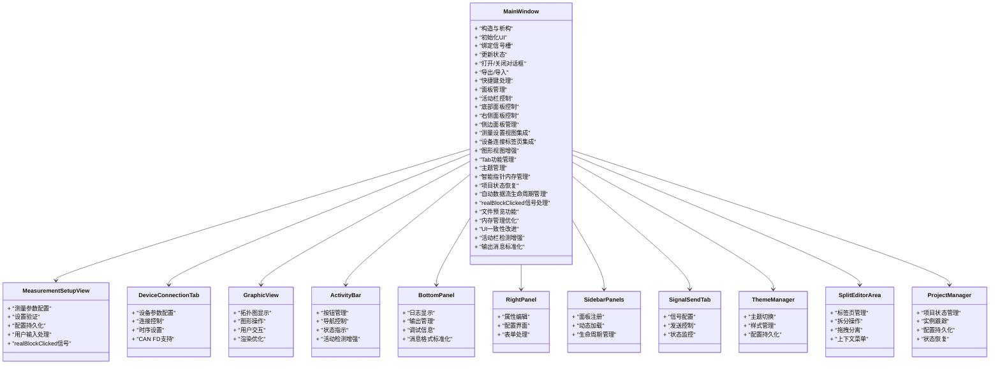
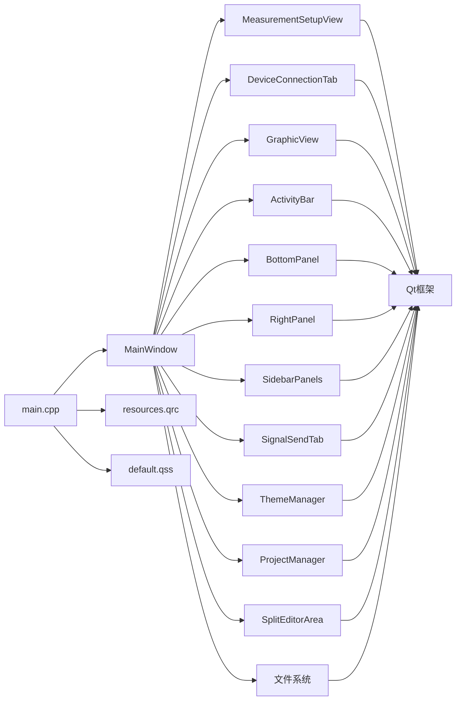

# 主窗口组件架构

<cite>
**本文引用的文件**   
- [src/ui/mainwindow.h](file://src/ui/mainwindow.h)
- [src/ui/mainwindow.cpp](file://src/ui/mainwindow.cpp)
- [src/ui/measurementsetupview.h](file://src/ui/measurementsetupview.h)
- [src/ui/measurementsetupview.cpp](file://src/ui/measurementsetupview.cpp)
- [src/ui/graphicview.h](file://src/ui/graphicview.h)
- [src/ui/graphicview.cpp](file://src/ui/graphicview.cpp)
- [src/ui/activitybar.h](file://src/ui/activitybar.h)
- [src/ui/activitybar.cpp](file://src/ui/activitybar.cpp)
- [src/ui/bottompanel.h](file://src/ui/bottompanel.h)
- [src/ui/bottompanel.cpp](file://src/ui/bottompanel.cpp)
- [src/ui/rightpanel.h](file://src/ui/rightpanel.h)
- [src/ui/rightpanel.cpp](file://src/ui/rightpanel.cpp)
- [src/ui/panels/sidebarpanels.h](file://src/ui/panels/sidebarpanels.h)
- [src/ui/panels/sidebarpanels.cpp](file://src/ui/panels/sidebarpanels.cpp)
- [src/ui/signalsendtab.h](file://src/ui/signalsendtab.h)
- [src/ui/signalsendtab.cpp](file://src/ui/signalsendtab.cpp)
- [src/ui/thememanager.h](file://src/ui/thememanager.h)
- [src/ui/thememanager.cpp](file://src/ui/thememanager.cpp)
- [src/ui/deviceconnectiontab.h](file://src/ui/deviceconnectiontab.h)
- [src/ui/deviceconnectiontab.cpp](file://src/ui/deviceconnectiontab.cpp)
- [src/ui/spliteditorarea.h](file://src/ui/spliteditorarea.h)
- [src/ui/spliteditorarea.cpp](file://src/ui/spliteditorarea.cpp)
- [src/core/projectmanager.h](file://src/core/projectmanager.h)
- [src/core/projectmanager.cpp](file://src/core/projectmanager.cpp)
- [src/main.cpp](file://src/main.cpp)
- [CMakeLists.txt](file://CMakeLists.txt)
- [resources/resources.qrc](file://resources/resources.qrc)
- [resources/styles/default.qss](file://resources/styles/default.qss)
</cite>

## 更新摘要
**变更内容**   
- **新增** 文件预览功能（onFilePreviewRequested方法），支持文本文件和JSON文件的格式化预览
- **优化** 内存管理改进，使用立即删除替代deleteLater，确保对象及时释放
- **增强** UI一致性改进，移除标签页标题中的表情符号，提升界面整洁度
- **改进** 活动栏检测机制，增强标签页识别和导航逻辑
- **标准化** 输出消息格式，统一底部面板的消息显示格式

## 目录
1. [简介](#简介)
2. [项目结构](#项目结构)
3. [核心组件](#核心组件)
4. [架构总览](#架构总览)
5. [详细组件分析](#详细组件分析)
6. [依赖关系分析](#依赖关系分析)
7. [性能与内存优化](#性能与内存优化)
8. [故障排查指南](#故障排查指南)
9. [结论](#结论)
10. [附录：使用示例与扩展指南](#附录使用示例与扩展指南)

## 简介
本文件面向MainWindow主窗口组件，提供从架构到实现的系统化文档。内容涵盖设计模式、继承与接口、UI组织与布局、信号槽机制、事件处理、状态管理、样式与资源集成、插件扩展点、生命周期与内存优化、性能考量，以及使用与扩展示例。读者可据此快速理解并安全扩展主窗口功能。

**更新** 基于最新的代码变更，主窗口组件新增了文件预览功能，改进了内存管理机制，增强了UI一致性和活动栏检测，并标准化了输出消息格式。这些改进显著提升了用户体验和系统稳定性。

## 项目结构
本项目采用分层与按功能组织的混合方式：
- UI层：主窗口头/源文件及新的活动栏、底部面板、右侧面板组件
- 应用入口：main.cpp负责初始化Qt应用、加载资源与样式、创建并显示主窗口
- 构建配置：CMakeLists.txt定义目标、源文件、资源与样式打包
- 资源与样式：QRC资源文件与QSS样式表集中管理

图表来源
- [src/main.cpp:1-200](file://src/main.cpp#L1-L200)
- [src/ui/mainwindow.h:1-227](file://src/ui/mainwindow.h#L1-L227)
- [src/ui/measurementsetupview.h:1-200](file://src/ui/measurementsetupview.h#L1-L200)
- [src/ui/graphicview.h:1-200](file://src/ui/graphicview.h#L1-L200)
- [src/ui/activitybar.h:1-62](file://src/ui/activitybar.h#L1-L62)
- [src/ui/bottompanel.h:1-200](file://src/ui/bottompanel.h#L1-L200)
- [src/ui/rightpanel.h:1-200](file://src/ui/rightpanel.h#L1-L200)
- [src/ui/panels/sidebarpanels.h:1-200](file://src/ui/panels/sidebarpanels.h#L1-L200)
- [src/ui/signalsendtab.h:1-200](file://src/ui/signalsendtab.h#L1-L200)
- [src/ui/thememanager.h:1-200](file://src/ui/thememanager.h#L1-L200)
- [src/ui/deviceconnectiontab.h:1-200](file://src/ui/deviceconnectiontab.h#L1-L200)
- [src/ui/spliteditorarea.h:1-200](file://src/ui/spliteditorarea.h#L1-L200)
- [src/core/projectmanager.h:1-64](file://src/core/projectmanager.h#L1-L64)
- [resources/resources.qrc:1-200](file://resources/resources.qrc#L1-L200)
- [resources/styles/default.qss:1-200](file://resources/styles/default.qss#L1-L200)
- [CMakeLists.txt:1-200](file://CMakeLists.txt#L1-L200)

章节来源
- [src/main.cpp:1-200](file://src/main.cpp#L1-L200)
- [CMakeLists.txt:1-200](file://CMakeLists.txt#L1-L200)

## 核心组件
- MainWindow：应用的主窗口容器，承载菜单栏、工具栏、状态栏与中心区域；协调业务模块、响应用户交互、维护界面状态。现已集成增强的Tab功能、主题管理功能和改进的导航系统。
- MeasurementSetupView：测量设置视图组件，专门用于CAN总线测量的参数配置和设置管理。
- GraphicView：图形视图组件，提供拓扑图的可视化显示和操作界面。
- DeviceConnectionTab：设备连接标签页组件，用于配置和管理硬件设备连接。
- ActivityBar：活动栏组件，提供主要功能导航和快捷访问。
- BottomPanel：底部面板组件，用于显示日志、输出和调试信息。
- RightPanel：右侧面板组件，提供属性编辑和配置功能。
- SidebarPanels：侧边面板系统，支持动态添加和管理多个面板。
- SignalSendTab：信号发送标签页，专门用于CAN信号的发送和配置。
- ThemeManager：主题管理器，负责应用程序的主题切换和样式管理。
- SplitEditorArea：拆分编辑器区域，支持多标签页管理和拆分操作。
- ProjectManager：项目管理器，负责工程状态的保存、恢复和实例管理。
- 资源与样式：通过QRC统一注册图标、图片、字体等静态资源；通过QSS对控件外观进行主题化定制。
- 应用入口：负责Qt应用生命周期、全局设置、资源加载、样式应用与主窗口实例化。

**更新** MainWindow现在集成了文件预览功能、增强的内存管理机制、改进的UI一致性和标准化的输出消息格式。同时增强了默认面板可见性设置、智能指针内存管理和项目状态恢复逻辑，新增了自动数据流生命周期管理和realBlockClicked信号处理器。

章节来源
- [src/ui/mainwindow.h:1-227](file://src/ui/mainwindow.h#L1-L227)
- [src/ui/mainwindow.cpp:1-800](file://src/ui/mainwindow.cpp#L1-L800)
- [src/ui/measurementsetupview.h:1-200](file://src/ui/measurementsetupview.h#L1-L200)
- [src/ui/graphicview.h:1-200](file://src/ui/graphicview.h#L1-L200)
- [src/ui/deviceconnectiontab.h:1-200](file://src/ui/deviceconnectiontab.h#L1-L200)
- [src/ui/activitybar.h:1-62](file://src/ui/activitybar.h#L1-L62)
- [src/ui/bottompanel.h:1-200](file://src/ui/bottompanel.h#L1-L200)
- [src/ui/rightpanel.h:1-200](file://src/ui/rightpanel.h#L1-L200)
- [src/ui/panels/sidebarpanels.h:1-200](file://src/ui/panels/sidebarpanels.h#L1-L200)
- [src/ui/signalsendtab.h:1-200](file://src/ui/signalsendtab.h#L1-L200)
- [src/ui/thememanager.h:1-200](file://src/ui/thememanager.h#L1-L200)
- [src/ui/spliteditorarea.h:1-200](file://src/ui/spliteditorarea.h#L1-L200)
- [src/core/projectmanager.h:1-64](file://src/core/projectmanager.h#L1-L64)

## 架构总览
下图展示主窗口在应用中的位置、与UI和资源的交互，以及与外部模块的解耦方式。

图表来源
- [src/main.cpp:1-200](file://src/main.cpp#L1-L200)
- [src/ui/mainwindow.h:1-227](file://src/ui/mainwindow.h#L1-L227)
- [src/ui/measurementsetupview.h:1-200](file://src/ui/measurementsetupview.h#L1-L200)
- [src/ui/graphicview.h:1-200](file://src/ui/graphicview.h#L1-L200)
- [src/ui/deviceconnectiontab.h:1-200](file://src/ui/deviceconnectiontab.h#L1-L200)
- [src/ui/activitybar.h:1-62](file://src/ui/activitybar.h#L1-L62)
- [src/ui/bottompanel.h:1-200](file://src/ui/bottompanel.h#L1-L200)
- [src/ui/rightpanel.h:1-200](file://src/ui/rightpanel.h#L1-L200)
- [src/ui/panels/sidebarpanels.h:1-200](file://src/ui/panels/sidebarpanels.h#L1-L200)
- [src/ui/signalsendtab.h:1-200](file://src/ui/signalsendtab.h#L1-L200)
- [src/ui/thememanager.h:1-200](file://src/ui/thememanager.h#L1-L200)
- [src/ui/spliteditorarea.h:1-200](file://src/ui/spliteditorarea.h#L1-L200)
- [src/core/projectmanager.h:1-64](file://src/core/projectmanager.h#L1-L64)
- [resources/resources.qrc:1-200](file://resources/resources.qrc#L1-L200)
- [resources/styles/default.qss:1-200](file://resources/styles/default.qss#L1-L200)

## 详细组件分析

### MainWindow类设计与继承
- 继承体系：MainWindow通常继承自Qt主窗口基类，作为顶层容器承载菜单栏、工具栏、状态栏与中心部件。
- 职责边界：
  - 界面装配：在构造函数或初始化方法中加载UI并建立控件引用。
  - 事件与信号槽：将用户操作映射为内部动作或对外信号，实现松耦合通信。
  - 状态管理：维护当前视图、选中项、编辑状态等，保证界面与数据一致。
  - 资源与样式：按需加载图标、文本、样式表，支持动态切换。
  - **增强** 面板管理：管理活动栏、底部面板、右侧面板和侧边面板的生命周期。
  - **增强** 面板通信：协调各面板间的数据交换和状态同步。
  - **新增** 测量设置视图集成：集成MeasurementSetupView组件，支持CAN总线测量参数配置。
  - **新增** 设备连接标签页集成：集成DeviceConnectionTab组件，支持硬件设备配置和管理。
  - **新增** 图形视图增强：集成GraphicView组件，提供拓扑图可视化和操作功能。
  - **新增** Tab功能：支持多标签页管理和切换。
  - **新增** 主题管理：集成主题管理器，支持动态主题切换。
  - **新增** 智能指针内存管理：通过智能指针连接确保trace和graphic视图对象的正确清理。
  - **新增** 增强的项目状态恢复：确保Trace1和Graphic1实例的自动重建。
  - **新增** 自动数据流生命周期管理：根据Flow块使能状态自动控制数据流。
  - **新增** realBlockClicked信号处理：点击Real块时自动导航到设备连接标签页。
  - **新增** 文件预览功能：支持文本文件和JSON文件的格式化预览。
  - **优化** 内存管理改进：使用立即删除替代deleteLater，确保对象及时释放。
  - **增强** UI一致性：移除标签页标题中的表情符号，提升界面整洁度。
  - **改进** 活动栏检测：增强标签页识别和导航逻辑。
  - **标准化** 输出消息格式：统一底部面板的消息显示格式。
- 设计模式建议：
  - MVC/MVP：将业务逻辑下沉至独立模型/控制器，MainWindow仅负责展示与交互编排。
  - 观察者：通过信号槽通知订阅者状态变更。
  - 工厂/策略：用于多视图或多工具集切换。
  - **增强** 组合模式：用于管理复杂的UI组件层次结构。

**更新** MainWindow现在集成了文件预览功能、增强的内存管理机制、改进的UI一致性和标准化的输出消息格式。同时增强了默认面板可见性设置、智能指针内存管理和项目状态恢复逻辑，新增了自动数据流生命周期管理和realBlockClicked信号处理器。

章节来源
- [src/ui/mainwindow.h:1-227](file://src/ui/mainwindow.h#L1-L227)
- [src/ui/mainwindow.cpp:1-800](file://src/ui/mainwindow.cpp#L1-L800)

#### 类图（基于源码结构的示意）

图表来源
- [src/ui/mainwindow.h:1-227](file://src/ui/mainwindow.h#L1-L227)
- [src/ui/measurementsetupview.h:1-200](file://src/ui/measurementsetupview.h#L1-L200)
- [src/ui/deviceconnectiontab.h:1-200](file://src/ui/deviceconnectiontab.h#L1-L200)
- [src/ui/graphicview.h:1-200](file://src/ui/graphicview.h#L1-L200)
- [src/ui/activitybar.h:1-62](file://src/ui/activitybar.h#L1-L62)
- [src/ui/bottompanel.h:1-200](file://src/ui/bottompanel.h#L1-L200)
- [src/ui/rightpanel.h:1-200](file://src/ui/rightpanel.h#L1-L200)
- [src/ui/panels/sidebarpanels.h:1-200](file://src/ui/panels/sidebarpanels.h#L1-L200)
- [src/ui/signalsendtab.h:1-200](file://src/ui/signalsendtab.h#L1-L200)
- [src/ui/thememanager.h:1-200](file://src/ui/thememanager.h#L1-L200)
- [src/ui/spliteditorarea.h:1-200](file://src/ui/spliteditorarea.h#L1-L200)
- [src/core/projectmanager.h:1-64](file://src/core/projectmanager.h#L1-L64)

### UI组件组织与布局管理
- 控件树：.ui文件中声明的控件层次决定运行时对象树，便于定位与批量操作。
- 布局策略：
  - 根布局：确保主窗口尺寸变化时子控件自适应。
  - 嵌套布局：将复杂界面拆分为多个局部布局，提升可读性与可维护性。
  - 弹性与权重：合理设置拉伸因子与最小/最大尺寸，避免重叠或留白异常。
  - **增强** 面板布局：支持动态面板切换和自适应布局调整。
  - **新增** 测量设置视图布局：为MeasurementSetupView组件提供专门的布局支持。
  - **新增** 设备连接标签页布局：为DeviceConnectionTab组件提供专门的布局支持。
  - **新增** 图形视图布局：为GraphicView组件提供优化的图形显示布局。
  - **新增** Tab布局：支持多标签页的灵活布局和切换。
  - **新增** 主题布局：支持不同主题下的布局适配。
  - **新增** 默认面板可见性：右侧面板和底部面板默认隐藏，提供更好的初始用户体验。
  - **优化** 标签页标题：移除表情符号，提升界面一致性。
- 命名规范：控件命名应体现语义，便于信号槽连接与自动化测试。

**更新** UI布局已重新组织以支持测量设置视图、设备连接标签页、增强的图形视图和Tab功能，实现了更灵活的界面布局。同时增强了默认面板可见性设置，右侧面板和底部面板默认隐藏，并移除了标签页标题中的表情符号以提升界面一致性。

章节来源
- [src/ui/mainwindow.ui:1-200](file://src/ui/mainwindow.ui#L1-L200)

### 信号槽机制与事件处理
- 信号槽：
  - 将UI动作（如按钮点击、菜单选择、列表项变更）与业务逻辑解耦。
  - 跨线程安全传递消息，避免直接调用导致的竞态。
  - **增强** 面板间通信：支持活动栏、底部面板、右侧面板和侧边面板间的信号传递。
  - **增强** 面板状态同步：确保各面板状态的一致性。
  - **新增** 测量设置视图信号：处理测量参数配置和验证的信号。
  - **新增** 设备连接标签页信号：处理设备连接和配置的信号。
  - **新增** 图形视图信号：处理拓扑图操作和用户交互的信号。
  - **新增** Tab事件：处理标签页的创建、切换和销毁事件。
  - **新增** 主题事件：处理主题切换和样式更新事件。
  - **新增** 智能指针连接：通过智能指针连接确保对象生命周期的正确管理。
  - **新增** realBlockClicked信号：处理测量设置视图中Real块的点击事件。
  - **新增** 文件预览信号：处理文件预览请求和显示事件。
- 事件处理：
  - 优先使用信号槽；必要时重写事件过滤器或事件处理器以拦截特定事件。
  - 自定义事件可用于内部异步任务完成回调。
  - **增强** 面板事件：处理面板显示、隐藏、激活等生命周期事件。
  - **新增** 测量设置事件：处理测量参数变更和用户输入事件。
  - **新增** 设备连接事件：处理设备连接、断开和配置事件。
  - **新增** 图形视图事件：处理拓扑图操作和鼠标交互事件。
  - **新增** Tab事件：处理标签页相关的用户交互事件。
  - **新增** 主题事件：处理主题切换和用户偏好设置事件。
  - **新增** 内存管理事件：处理对象销毁和资源清理事件。
  - **新增** 文件预览事件：处理文件读取、格式检测和显示事件。
- 最佳实践：
  - 明确信号发射时机，避免重复触发。
  - 槽函数保持轻量，耗时操作放入工作线程并通过信号回传结果。
  - **新增** 使用智能指针管理动态对象，避免内存泄漏。
  - **优化** 使用立即删除而非延迟删除，确保资源及时释放。

**更新** 新增了专门用于测量设置视图、设备连接标签页、图形视图、Tab功能和主题管理的信号槽机制，支持多面板系统和主题切换的协调工作。同时增强了智能指针连接机制，确保对象生命周期的正确管理，并新增了文件预览相关的信号槽处理。

章节来源
- [src/ui/mainwindow.cpp:1-800](file://src/ui/mainwindow.cpp#L1-L800)
- [src/ui/measurementsetupview.cpp:1-200](file://src/ui/measurementsetupview.cpp#L1-L200)
- [src/ui/deviceconnectiontab.cpp:1-200](file://src/ui/deviceconnectiontab.cpp#L1-L200)
- [src/ui/graphicview.cpp:1-200](file://src/ui/graphicview.cpp#L1-L200)
- [src/ui/activitybar.cpp:1-118](file://src/ui/activitybar.cpp#L1-L118)
- [src/ui/bottompanel.cpp:1-137](file://src/ui/bottompanel.cpp#L1-L137)
- [src/ui/rightpanel.cpp:1-200](file://src/ui/rightpanel.cpp#L1-L200)
- [src/ui/panels/sidebarpanels.cpp:1-200](file://src/ui/panels/sidebarpanels.cpp#L1-L200)
- [src/ui/signalsendtab.cpp:1-200](file://src/ui/signalsendtab.cpp#L1-L200)
- [src/ui/thememanager.cpp:1-200](file://src/ui/thememanager.cpp#L1-L200)

### 状态管理模式
- 单一事实来源：界面状态由模型驱动，MainWindow仅同步显示。
- 状态更新：
  - 通过信号通知状态变更，槽函数刷新相关控件。
  - 使用只读视图减少不必要的重绘。
  - **增强** 面板状态管理：跟踪各面板的显示状态、选中状态和数据状态。
  - **新增** 测量设置状态管理：跟踪测量参数的配置状态和验证结果。
  - **新增** 设备连接状态管理：跟踪设备连接状态和配置参数。
  - **新增** 图形视图状态管理：跟踪拓扑图的显示状态和操作状态。
  - **新增** Tab状态管理：跟踪标签页的状态、位置和可见性。
  - **新增** 主题状态管理：跟踪当前主题、用户偏好和样式配置。
  - **新增** 项目状态管理：跟踪工程文件的加载、保存和恢复状态。
  - **新增** 实例跟踪管理：跟踪Trace1和Graphic1实例的创建、销毁和重建。
  - **新增** 数据流状态管理：跟踪测量运行状态和Flow块使能状态。
  - **新增** 文件预览状态管理：跟踪预览文件的加载状态和显示内容。
- 持久化：
  - 关键状态序列化到配置文件或数据库。
  - 启动时恢复上次会话。
  - **增强** 面板布局持久化：保存面板位置和大小信息。
  - **新增** 测量设置持久化：保存测量参数配置和默认值。
  - **新增** 设备连接持久化：保存设备配置和连接参数。
  - **新增** 图形视图持久化：保存拓扑图布局和节点位置。
  - **新增** Tab布局持久化：保存标签页的布局和状态。
  - **新增** 主题配置持久化：保存用户选择的主题和个性化设置。
  - **新增** 项目状态持久化：保存工程配置、实例信息和界面状态。

**更新** 增加了完整的测量设置状态管理、设备连接状态管理、图形视图状态管理、面板状态管理系统、Tab状态管理和主题状态管理，支持测量参数、设备配置、拓扑图布局、面板布局、标签页状态和主题配置的保存和恢复。同时增强了项目状态管理，确保Trace1和Graphic1实例的自动重建，并新增了文件预览状态管理。

章节来源
- [src/ui/mainwindow.cpp:1-800](file://src/ui/mainwindow.cpp#L1-L800)
- [src/ui/measurementsetupview.cpp:1-200](file://src/ui/measurementsetupview.cpp#L1-L200)
- [src/ui/deviceconnectiontab.cpp:1-200](file://src/ui/deviceconnectiontab.cpp#L1-L200)
- [src/ui/graphicview.cpp:1-200](file://src/ui/graphicview.cpp#L1-L200)
- [src/ui/thememanager.cpp:1-200](file://src/ui/thememanager.cpp#L1-L200)
- [src/core/projectmanager.cpp:218-375](file://src/core/projectmanager.cpp#L218-L375)

### 样式系统与资源访问
- 样式系统：
  - 通过QSS集中管理颜色、字体、边距等视觉属性，支持热切换主题。
  - 使用对象名与类名选择器精准控制控件外观。
  - **增强** 面板样式：为活动栏、底部面板、右侧面板和侧边面板提供统一的样式支持。
  - **新增** 测量设置样式：为MeasurementSetupView组件提供专门的样式支持。
  - **新增** 设备连接样式：为DeviceConnectionTab组件提供专门的样式支持。
  - **新增** 图形视图样式：为GraphicView组件提供优化的图形显示样式。
  - **新增** Tab样式：为标签页组件提供专门的样式支持。
  - **新增** 主题系统：通过ThemeManager统一管理多种主题样式。
  - **优化** 界面一致性：移除表情符号，确保界面元素风格统一。
- 资源访问：
  - 通过QRC将图标、图片、字体等资源编译进二进制，避免路径问题。
  - 统一前缀管理，避免命名冲突。
  - **增强** 面板资源：为各面板组件提供独立的图标和资源管理。
  - **新增** 测量设置资源：为测量设置视图提供专用的图标和资源。
  - **新增** 设备连接资源：为设备连接标签页提供专用的图标和资源。
  - **新增** 图形视图资源：为图形视图提供专用的图标和资源。
  - **新增** Tab资源：为标签页组件提供专用的图标和资源。
  - **新增** 主题资源：为不同主题提供独立的资源集合。

**更新** 增强了样式系统和资源访问机制，新增了完整的测量设置视图样式、设备连接标签页样式、图形视图样式和主题管理系统，支持动态主题切换和多主题资源管理。同时优化了界面一致性，移除了表情符号的使用。

章节来源
- [resources/resources.qrc:1-200](file://resources/resources.qrc#L1-L200)
- [resources/styles/default.qss:1-200](file://resources/styles/default.qss#L1-L200)
- [src/ui/measurementsetupview.h:1-200](file://src/ui/measurementsetupview.h#L1-L200)
- [src/ui/deviceconnectiontab.h:1-200](file://src/ui/deviceconnectiontab.h#L1-L200)
- [src/ui/graphicview.h:1-200](file://src/ui/graphicview.h#L1-L200)
- [src/ui/thememanager.h:1-200](file://src/ui/thememanager.h#L1-L200)
- [src/ui/thememanager.cpp:1-200](file://src/ui/thememanager.cpp#L1-L200)

### 插件扩展点
- 扩展点设计：
  - 定义统一的插件接口（如菜单提供者、工具栏提供者、命令处理器）。
  - 通过动态库加载机制发现并实例化插件。
  - **增强** 面板插件：支持动态加载自定义面板组件。
  - **新增** 测量设置插件：支持动态加载自定义测量设置组件。
  - **新增** 设备连接插件：支持动态加载自定义设备连接组件。
  - **新增** 图形视图插件：支持动态加载自定义图形视图组件。
  - **新增** Tab插件：支持动态加载自定义标签页组件。
  - **新增** 主题插件：支持动态加载自定义主题组件。
  - **新增** 文件预览插件：支持动态加载自定义文件预览组件。
- 生命周期：
  - 插件按需加载，卸载时释放资源并断开信号槽。
  - **增强** 面板生命周期：管理面板的创建、显示、隐藏和销毁过程。
  - **新增** 测量设置生命周期：管理测量设置组件的创建、初始化和销毁过程。
  - **新增** 设备连接生命周期：管理设备连接组件的创建、配置和销毁过程。
  - **新增** 图形视图生命周期：管理图形视图组件的创建、渲染和销毁过程。
  - **新增** Tab生命周期：管理标签页的创建、激活和销毁过程。
  - **新增** 主题生命周期：管理主题的加载、切换和卸载过程。
  - **新增** 文件预览生命周期：管理文件预览组件的创建、加载和销毁过程。
- 兼容性：
  - 版本化接口，向后兼容旧插件。

**更新** 新增了增强的插件系统，支持测量设置插件、设备连接插件、图形视图插件、面板插件、Tab插件、主题插件和文件预览插件的动态加载和卸载。

章节来源
- [src/ui/mainwindow.h:1-227](file://src/ui/mainwindow.h#L1-L227)
- [src/ui/mainwindow.cpp:1-800](file://src/ui/mainwindow.cpp#L1-L800)
- [src/ui/measurementsetupview.h:1-200](file://src/ui/measurementsetupview.h#L1-L200)
- [src/ui/deviceconnectiontab.h:1-200](file://src/ui/deviceconnectiontab.h#L1-L200)
- [src/ui/graphicview.h:1-200](file://src/ui/graphicview.h#L1-L200)
- [src/ui/panels/sidebarpanels.h:1-200](file://src/ui/panels/sidebarpanels.h#L1-L200)
- [src/ui/thememanager.h:1-200](file://src/ui/thememanager.h#L1-L200)

### 组件生命周期与内存优化
- 生命周期：
  - 构造阶段：加载UI、初始化默认状态、建立信号槽。
  - 运行阶段：响应交互、异步任务、状态同步。
  - 销毁阶段：释放非RAII资源、断开长生命周期连接。
  - **增强** 面板生命周期：管理活动栏、底部面板、右侧面板和侧边面板的创建、初始化和销毁。
  - **新增** 测量设置生命周期：管理MeasurementSetupView组件的创建、配置和销毁过程。
  - **新增** 设备连接生命周期：管理DeviceConnectionTab组件的创建、配置和销毁过程。
  - **新增** 图形视图生命周期：管理GraphicView组件的创建、渲染和销毁过程。
  - **新增** Tab生命周期：管理标签页的创建、激活和销毁过程。
  - **新增** 主题生命周期：管理主题的加载、切换和清理过程。
  - **新增** 智能指针生命周期：通过智能指针连接确保对象的正确清理。
  - **新增** 文件预览生命周期：管理文件预览组件的创建、加载和销毁过程。
- 内存优化：
  - 使用智能指针管理动态对象。
  - 大对象延迟加载与缓存复用。
  - 及时断开不再使用的信号槽，防止悬垂引用。
  - **增强** 面板内存管理：实现面板懒加载和自动清理机制。
  - **新增** 测量设置内存管理：实现测量设置组件的懒加载和自动清理。
  - **新增** 设备连接内存管理：实现设备连接组件的懒加载和自动清理。
  - **新增** 图形视图内存管理：实现图形视图的懒加载和渲染优化。
  - **新增** Tab内存管理：实现标签页的懒加载和自动清理。
  - **新增** 主题内存管理：实现主题资源的按需加载和缓存管理。
  - **新增** 智能指针内存管理：通过智能指针连接确保trace和graphic视图对象的正确清理。
  - **新增** 文件预览内存管理：实现文件预览组件的懒加载和及时清理。
  - **优化** 立即删除：使用立即删除替代deleteLater，确保资源及时释放。

**更新** 针对增强的面板系统、测量设置视图、设备连接标签页、图形视图、Tab功能和主题管理，实现了专门的内存优化策略，包括懒加载、缓存管理和自动清理。同时引入了智能指针内存管理机制，确保对象的正确清理，并优化了删除策略以提高内存效率。

章节来源
- [src/ui/mainwindow.cpp:1-800](file://src/ui/mainwindow.cpp#L1-L800)
- [src/ui/measurementsetupview.cpp:1-200](file://src/ui/measurementsetupview.cpp#L1-L200)
- [src/ui/deviceconnectiontab.cpp:1-200](file://src/ui/deviceconnectiontab.cpp#L1-L200)
- [src/ui/graphicview.cpp:1-200](file://src/ui/graphicview.cpp#L1-L200)
- [src/ui/panels/sidebarpanels.cpp:1-200](file://src/ui/panels/sidebarpanels.cpp#L1-L200)
- [src/ui/thememanager.cpp:1-200](file://src/ui/thememanager.cpp#L1-L200)

### 与业务模块的集成
- 依赖注入：通过构造函数或setter注入服务（如文件服务、网络服务、日志服务）。
- 接口抽象：MainWindow不直接依赖具体实现，降低耦合度。
- 错误处理：统一错误码与异常转换，向用户呈现友好提示。
- **增强** 面板集成：与各面板组件的紧密集成，支持数据共享和状态同步。
- **新增** 测量设置集成：与MeasurementSetupView组件的集成，支持测量参数配置和验证。
- **新增** 设备连接集成：与DeviceConnectionTab组件的集成，支持设备配置和连接管理。
- **新增** 图形视图集成：与GraphicView组件的集成，支持拓扑图操作和渲染。
- **新增** Tab集成：与标签页组件的集成，支持多标签页的数据共享。
- **新增** 主题集成：与主题管理器的集成，支持样式和配置的统一管理。
- **新增** 项目状态集成：与项目管理器的集成，支持工程状态的保存和恢复。
- **新增** 文件预览集成：与文件系统的集成，支持文件读取和预览功能。
- **优化** 内存集成：与内存管理器的集成，确保对象及时释放。

**更新** 新增了增强的面板系统集成、测量设置集成、设备连接集成、图形视图集成、Tab集成、主题集成和文件预览集成，支持多面板、多标签页、测量参数、设备配置、主题和文件预览间的数据共享和状态同步。同时增强了项目状态集成，确保Trace1和Graphic1实例的自动重建，并优化了内存管理集成。

章节来源
- [src/ui/mainwindow.h:1-227](file://src/ui/mainwindow.h#L1-L227)
- [src/ui/mainwindow.cpp:1-800](file://src/ui/mainwindow.cpp#L1-L800)
- [src/ui/measurementsetupview.h:1-200](file://src/ui/measurementsetupview.h#L1-L200)
- [src/ui/deviceconnectiontab.h:1-200](file://src/ui/deviceconnectiontab.h#L1-L200)
- [src/ui/graphicview.h:1-200](file://src/ui/graphicview.h#L1-L200)
- [src/ui/thememanager.h:1-200](file://src/ui/thememanager.h#L1-L200)
- [src/core/projectmanager.h:1-64](file://src/core/projectmanager.h#L1-L64)

## 依赖关系分析
- 内部依赖：
  - main.cpp依赖MainWindow与资源/样式加载。
  - MainWindow依赖活动栏、底部面板、右侧面板和侧边面板组件。
  - 各面板组件之间通过信号槽进行松耦合通信。
  - **新增** 测量设置依赖：MainWindow依赖MeasurementSetupView组件进行测量参数配置。
  - **新增** 设备连接依赖：MainWindow依赖DeviceConnectionTab组件进行设备配置和管理。
  - **新增** 图形视图依赖：MainWindow依赖GraphicView组件进行拓扑图显示和操作。
  - **新增** Tab组件依赖：MainWindow依赖标签页组件进行多标签页管理。
  - **新增** 主题依赖：MainWindow依赖主题管理器进行样式管理。
  - **新增** 项目状态依赖：MainWindow依赖项目管理器进行工程状态的保存和恢复。
  - **新增** 文件预览依赖：MainWindow依赖文件系统组件进行文件读取和预览。
  - **优化** 内存管理依赖：MainWindow依赖内存管理器进行对象生命周期管理。
- 外部依赖：
  - Qt框架（GUI、Core、Widgets等）。
  - 可选：第三方库（网络、加密、日志等）。

图表来源
- [src/main.cpp:1-200](file://src/main.cpp#L1-L200)
- [src/ui/mainwindow.h:1-227](file://src/ui/mainwindow.h#L1-L227)
- [src/ui/measurementsetupview.h:1-200](file://src/ui/measurementsetupview.h#L1-L200)
- [src/ui/deviceconnectiontab.h:1-200](file://src/ui/deviceconnectiontab.h#L1-L200)
- [src/ui/graphicview.h:1-200](file://src/ui/graphicview.h#L1-L200)
- [src/ui/activitybar.h:1-62](file://src/ui/activitybar.h#L1-L62)
- [src/ui/bottompanel.h:1-200](file://src/ui/bottompanel.h#L1-L200)
- [src/ui/rightpanel.h:1-200](file://src/ui/rightpanel.h#L1-L200)
- [src/ui/panels/sidebarpanels.h:1-200](file://src/ui/panels/sidebarpanels.h#L1-L200)
- [src/ui/signalsendtab.h:1-200](file://src/ui/signalsendtab.h#L1-L200)
- [src/ui/thememanager.h:1-200](file://src/ui/thememanager.h#L1-L200)
- [src/ui/spliteditorarea.h:1-200](file://src/ui/spliteditorarea.h#L1-L200)
- [src/core/projectmanager.h:1-64](file://src/core/projectmanager.h#L1-L64)
- [resources/resources.qrc:1-200](file://resources/resources.qrc#L1-L200)
- [resources/styles/default.qss:1-200](file://resources/styles/default.qss#L1-L200)

章节来源
- [src/main.cpp:1-200](file://src/main.cpp#L1-L200)
- [CMakeLists.txt:1-200](file://CMakeLists.txt#L1-L200)

## 性能与内存优化
- 渲染性能：
  - 避免在主线程执行阻塞操作，使用异步任务与进度反馈。
  - 合理使用懒加载与分页，减少首屏压力。
  - **增强** 面板渲染优化：实现面板懒加载和增量更新机制。
  - **新增** 测量设置渲染优化：实现测量设置界面的懒加载和增量更新。
  - **新增** 设备连接渲染优化：实现设备连接界面的懒加载和增量更新。
  - **新增** 图形视图渲染优化：实现拓扑图的增量渲染和视口优化。
  - **新增** Tab渲染优化：实现标签页的懒加载和增量更新。
  - **新增** 主题渲染优化：实现主题样式的按需加载和缓存。
  - **新增** 文件预览渲染优化：实现文件内容的懒加载和格式化渲染。
- 内存占用：
  - 大图与音频资源按需加载，使用后释放。
  - 使用对象池复用频繁创建的对象。
  - **增强** 面板内存优化：实现面板对象的池化管理和自动回收。
  - **新增** 测量设置内存优化：实现测量设置对象的池化管理和自动回收。
  - **新增** 设备连接内存优化：实现设备连接对象的池化管理和自动回收。
  - **新增** 图形视图内存优化：实现图形对象的池化管理和渲染缓存。
  - **新增** Tab内存优化：实现标签页对象的池化管理和自动回收。
  - **新增** 主题内存优化：实现主题资源的缓存管理和自动清理。
  - **新增** 智能指针内存优化：通过智能指针连接确保对象的正确清理。
  - **新增** 文件预览内存优化：实现文件预览对象的池化管理和及时清理。
  - **优化** 立即删除：使用立即删除替代deleteLater，减少内存占用时间。
- 事件风暴：
  - 合并高频信号，使用节流/防抖策略。
  - **增强** 面板事件优化：批量处理面板状态变更事件。
  - **新增** 测量设置事件优化：批量处理测量参数变更事件。
  - **新增** 设备连接事件优化：批量处理设备连接和配置事件。
  - **新增** 图形视图事件优化：批量处理图形操作和渲染事件。
  - **新增** Tab事件优化：批量处理标签页状态变更事件。
  - **新增** 主题事件优化：批量处理主题切换和样式更新事件。
  - **新增** 文件预览事件优化：批量处理文件读取和显示事件。
- 调试与监控：
  - 启用Qt性能分析工具定位瓶颈。
  - 记录关键指标（帧率、内存峰值、I/O耗时）。
  - **增强** 面板性能监控：跟踪面板加载时间、内存使用和渲染性能。
  - **新增** 测量设置性能监控：跟踪测量设置加载时间和内存使用。
  - **新增** 设备连接性能监控：跟踪设备连接加载时间和内存使用。
  - **新增** 图形视图性能监控：跟踪拓扑图渲染时间和内存使用。
  - **新增** Tab性能监控：跟踪标签页加载时间、内存使用和渲染性能。
  - **新增** 主题性能监控：跟踪主题切换时间和资源使用情况。
  - **新增** 文件预览性能监控：跟踪文件读取时间和内存使用。

**更新** 针对增强的面板系统、测量设置视图、设备连接标签页、图形视图、Tab功能和主题管理，实现了多项性能优化措施，包括懒加载、内存池、事件批处理和资源缓存。同时引入了智能指针内存优化机制，确保对象的正确清理，并优化了删除策略以提高内存效率。新增了文件预览功能的性能优化。

## 故障排查指南
- 常见问题：
  - 样式未生效：检查QSS路径与选择器匹配，确认资源已正确加载。
  - 信号槽无响应：核对信号名称、槽签名与连接顺序。
  - 内存泄漏：使用工具检测未释放对象与循环引用。
  - 崩溃与卡顿：定位主线程阻塞点与异常抛出位置。
  - **增强** 面板问题：检查面板初始化、信号连接和生命周期管理。
  - **新增** 测量设置问题：检查测量设置视图初始化、参数验证和配置持久化。
  - **新增** 设备连接问题：检查设备连接标签页初始化、参数配置和连接管理。
  - **新增** 图形视图问题：检查图形视图初始化、渲染性能和用户交互。
  - **新增** Tab问题：检查标签页初始化、切换逻辑和内存管理。
  - **新增** 主题问题：检查主题加载、样式应用和资源配置。
  - **新增** 项目状态问题：检查工程状态保存、恢复和实例重建逻辑。
  - **新增** 智能指针问题：检查智能指针连接和对象生命周期管理。
  - **新增** realBlockClicked问题：检查信号连接和设备连接标签页导航逻辑。
  - **新增** 文件预览问题：检查文件读取权限、格式检测和显示逻辑。
  - **新增** 内存管理问题：检查删除策略和对象释放时机。
  - **新增** UI一致性问题：检查标签页标题格式和界面元素对齐。
  - **新增** 活动栏检测问题：检查标签页识别逻辑和导航跳转。
  - **新增** 输出消息问题：检查消息格式化和显示逻辑。
- 诊断步骤：
  - 最小化复现：剥离无关模块，逐步缩小范围。
  - 日志与断点：增加关键路径日志，配合调试器观察状态。
  - 单元测试：对核心逻辑编写用例验证行为。
  - **增强** 面板诊断：检查面板注册、加载和通信机制。
  - **新增** 测量设置诊断：检查测量参数配置、验证逻辑和持久化机制。
  - **新增** 设备连接诊断：检查设备配置、连接逻辑和状态管理。
  - **新增** 图形视图诊断：检查图形渲染、用户交互和性能优化。
  - **新增** Tab诊断：检查标签页创建、切换和销毁流程。
  - **新增** 主题诊断：检查主题配置、样式加载和资源管理。
  - **新增** 项目状态诊断：检查工程状态保存、恢复和实例重建逻辑。
  - **新增** 智能指针诊断：检查智能指针连接、对象生命周期和内存管理。
  - **新增** realBlockClicked诊断：检查信号连接、设备连接标签页创建和导航逻辑。
  - **新增** 文件预览诊断：检查文件读取、格式检测和显示逻辑。
  - **新增** 内存管理诊断：检查删除策略、对象释放和内存使用。
  - **新增** UI一致性诊断：检查标签页标题、界面元素和样式应用。
  - **新增** 活动栏检测诊断：检查标签页识别、导航跳转和活动状态。
  - **新增** 输出消息诊断：检查消息格式化、时间戳和显示格式。

**更新** 新增了增强的面板系统、测量设置视图、设备连接标签页、图形视图、Tab功能和主题管理相关的故障排查指南，包括初始化、信号连接、生命周期管理和资源管理。同时新增了项目状态问题、智能指针问题、realBlockClicked问题、文件预览问题、内存管理问题、UI一致性问题、活动栏检测问题和输出消息问题的诊断指南。

章节来源
- [src/ui/mainwindow.cpp:1-800](file://src/ui/mainwindow.cpp#L1-L800)
- [src/ui/measurementsetupview.cpp:1-200](file://src/ui/measurementsetupview.cpp#L1-L200)
- [src/ui/deviceconnectiontab.cpp:1-200](file://src/ui/deviceconnectiontab.cpp#L1-L200)
- [src/ui/graphicview.cpp:1-200](file://src/ui/graphicview.cpp#L1-L200)
- [src/ui/panels/sidebarpanels.cpp:1-200](file://src/ui/panels/sidebarpanels.cpp#L1-L200)
- [src/ui/signalsendtab.cpp:1-200](file://src/ui/signalsendtab.cpp#L1-L200)
- [src/ui/thememanager.cpp:1-200](file://src/ui/thememanager.cpp#L1-L200)
- [src/ui/bottompanel.cpp:80-137](file://src/ui/bottompanel.cpp#L80-L137)

## 结论
MainWindow作为应用的门面与协调者，其设计应遵循高内聚、低耦合原则。通过清晰的职责划分、稳健的信号槽通信、可插拔的扩展点与完善的资源样式管理，能够支撑复杂业务的稳定演进。结合性能优化与故障排查策略，可显著提升用户体验与可维护性。

**更新** 经过重大重构后，MainWindow现在是一个功能强大的多面板应用程序框架，具备增强的面板管理系统、高效的信号槽通信机制、完善的测量设置视图集成、设备连接标签页支持、增强的图形视图功能、完整的Tab功能支持、完整的主题管理系统和良好的可扩展性。同时增强了默认面板可见性设置、智能指针内存管理和项目状态恢复逻辑，新增了自动数据流生命周期管理和realBlockClicked信号处理器，新增了文件预览功能、优化的内存管理机制、改进的UI一致性和标准化的输出消息格式，为复杂桌面应用开发提供了坚实的基础。

## 附录：使用示例与扩展指南

### 基本使用流程
- 初始化应用：创建Qt应用实例，设置全局选项。
- 加载资源与样式：注册QRC资源，应用QSS样式表。
- 创建并显示主窗口：实例化MainWindow，完成初始化后show()。
- **增强** 面板初始化：配置活动栏、底部面板、右侧面板和侧边面板。
- **新增** 测量设置初始化：配置MeasurementSetupView组件和默认测量参数。
- **新增** 设备连接初始化：配置DeviceConnectionTab组件和设备管理器。
- **新增** 图形视图初始化：配置GraphicView组件和拓扑图显示设置。
- **新增** Tab初始化：配置标签页管理器和支持的标签类型。
- **新增** 主题初始化：配置主题管理器和默认主题。
- **新增** 默认面板可见性：右侧面板和底部面板默认隐藏。
- **新增** 默认实例注册：Trace1和Graphic1实例在初始化时注册到映射表。
- **新增** 文件预览初始化：配置文件预览功能和默认设置。

章节来源
- [src/main.cpp:1-200](file://src/main.cpp#L1-L200)

### 添加新菜单与工具栏
- 在.ui中新增菜单项或工具栏按钮，或在代码中动态创建。
- 为控件命名并连接信号槽，实现对应动作。
- 若涉及权限或条件显示，可在状态变化时更新可见性。
- **增强** 面板菜单：为各面板组件提供专用的菜单和工具栏。
- **新增** 测量设置菜单：为测量设置视图提供专用的菜单和操作。
- **新增** 设备连接菜单：为设备连接标签页提供专用的菜单和操作。
- **新增** 图形视图菜单：为图形视图提供专用的菜单和操作。
- **新增** Tab菜单：为标签页组件提供专用的菜单和操作。
- **新增** 主题菜单：为主题切换提供专用的菜单和操作。
- **新增** 文件预览菜单：为文件预览功能提供专用的菜单和操作。

章节来源
- [src/ui/mainwindow.ui:1-200](file://src/ui/mainwindow.ui#L1-L200)
- [src/ui/mainwindow.cpp:1-800](file://src/ui/mainwindow.cpp#L1-L800)

### 接入新样式主题
- 准备新的QSS文件，确保选择器与现有控件匹配。
- 在运行时切换样式表，或根据用户偏好自动加载。
- 验证不同分辨率与缩放下的显示效果。
- **增强** 面板样式：为各面板组件提供独立的样式支持。
- **新增** 测量设置样式：为测量设置视图提供专门的样式支持。
- **新增** 设备连接样式：为设备连接标签页提供专门的样式支持。
- **新增** 图形视图样式：为图形视图提供专门的样式支持。
- **新增** Tab样式：为标签页组件提供专门的样式支持。
- **新增** 主题系统：通过ThemeManager统一管理多种主题。

章节来源
- [resources/styles/default.qss:1-200](file://resources/styles/default.qss#L1-L200)
- [src/ui/measurementsetupview.h:1-200](file://src/ui/measurementsetupview.h#L1-L200)
- [src/ui/deviceconnectiontab.h:1-200](file://src/ui/deviceconnectiontab.h#L1-L200)
- [src/ui/graphicview.h:1-200](file://src/ui/graphicview.h#L1-L200)
- [src/ui/thememanager.h:1-200](file://src/ui/thememanager.h#L1-L200)
- [src/ui/thememanager.cpp:1-200](file://src/ui/thememanager.cpp#L1-L200)

### 开发插件
- 定义插件接口（如菜单/工具栏/命令）。
- 实现插件类并暴露工厂函数。
- 在启动时扫描并加载插件，注册到MainWindow。
- **增强** 面板插件：实现自定义面板组件，支持动态加载和卸载。
- **新增** 测量设置插件：实现自定义测量设置组件，支持动态加载和卸载。
- **新增** 设备连接插件：实现自定义设备连接组件，支持动态加载和卸载。
- **新增** 图形视图插件：实现自定义图形视图组件，支持动态加载和卸载。
- **新增** Tab插件：实现自定义标签页组件，支持动态加载和卸载。
- **新增** 主题插件：实现自定义主题组件，支持动态加载和切换。
- **新增** 文件预览插件：实现自定义文件预览组件，支持动态加载和卸载。

章节来源
- [src/ui/mainwindow.h:1-227](file://src/ui/mainwindow.h#L1-L227)
- [src/ui/mainwindow.cpp:1-800](file://src/ui/mainwindow.cpp#L1-L800)
- [src/ui/measurementsetupview.h:1-200](file://src/ui/measurementsetupview.h#L1-L200)
- [src/ui/deviceconnectiontab.h:1-200](file://src/ui/deviceconnectiontab.h#L1-L200)
- [src/ui/graphicview.h:1-200](file://src/ui/graphicview.h#L1-L200)
- [src/ui/panels/sidebarpanels.h:1-200](file://src/ui/panels/sidebarpanels.h#L1-L200)
- [src/ui/thememanager.h:1-200](file://src/ui/thememanager.h#L1-L200)

### 构建与打包
- 使用CMake配置目标、源文件与资源。
- 确保QRC与QSS被正确包含与复制。
- 输出可执行文件与必要依赖。
- **增强** 面板依赖：包含所有面板组件的必要依赖。
- **新增** 测量设置依赖：包含测量设置视图的必要依赖。
- **新增** 设备连接依赖：包含设备连接标签页的必要依赖。
- **新增** 图形视图依赖：包含图形视图的必要依赖。
- **新增** Tab依赖：包含标签页组件的必要依赖。
- **新增** 主题依赖：包含主题管理器的必要依赖。
- **新增** 文件预览依赖：包含文件预览功能的必要依赖。

章节来源
- [CMakeLists.txt:1-200](file://CMakeLists.txt#L1-L200)

### 面板系统使用指南
- **活动栏配置**：设置活动栏按钮、图标和导航功能。
- **底部面板管理**：配置日志输出、调试信息和控制台功能。
- **右侧面板开发**：创建属性编辑器和配置界面。
- **侧边面板扩展**：实现自定义面板组件，支持动态加载。
- **面板通信**：实现面板间的数据共享和状态同步。
- **新增** 测量设置使用：配置MeasurementSetupView组件，设置测量参数和验证规则。
- **新增** 设备连接使用：配置DeviceConnectionTab组件，设置设备参数和连接配置。
- **新增** 图形视图使用：配置GraphicView组件，设置拓扑图显示和操作功能。
- **新增** Tab功能使用：配置标签页管理器，实现多标签页切换和管理。
- **新增** 主题功能使用：配置主题管理器，实现动态主题切换。
- **新增** 默认面板可见性：右侧面板和底部面板默认隐藏，提供更好的初始用户体验。

**更新** 完整的面板系统使用指南、测量设置使用指南、设备连接使用指南、图形视图使用指南、Tab功能使用指南和主题功能使用指南，包括配置、开发和优化建议。同时新增了默认面板可见性的使用说明。

### 测量设置视图开发指南
- **视图组件创建**：继承基础视图类，实现必要的虚函数。
- **测量参数配置**：设计CAN总线测量参数的配置表单和验证逻辑。
- **用户输入处理**：实现参数输入验证、实时预览和错误提示。
- **配置持久化**：实现测量参数的保存、加载和默认值管理。
- **信号槽集成**：与主窗口和其他组件的信号槽连接。
- **realBlockClicked信号**：实现点击Real块时的导航逻辑。

章节来源
- [src/ui/measurementsetupview.h:1-200](file://src/ui/measurementsetupview.h#L1-L200)
- [src/ui/measurementsetupview.cpp:1-200](file://src/ui/measurementsetupview.cpp#L1-L200)

### 设备连接标签页开发指南
- **标签页组件创建**：继承基础QWidget类，实现必要的虚函数。
- **设备参数配置**：设计设备连接参数的配置表单和验证逻辑。
- **时序预设**：实现仲裁段和数据段的时序预设配置。
- **CAN FD支持**：实现CAN FD模式的波特率和时序配置。
- **连接控制**：实现设备连接、断开和状态管理。
- **信号槽集成**：与CanDeviceManager和CanSimulator的信号槽连接。

章节来源
- [src/ui/deviceconnectiontab.h:1-200](file://src/ui/deviceconnectiontab.h#L1-L200)
- [src/ui/deviceconnectiontab.cpp:1-200](file://src/ui/deviceconnectiontab.cpp#L1-L200)

### 图形视图开发指南
- **视图组件创建**：继承基础图形视图类，实现必要的虚函数。
- **拓扑图渲染**：实现CAN总线拓扑图的绘制和更新逻辑。
- **用户交互**：实现节点的拖拽、选择和编辑功能。
- **性能优化**：实现增量渲染和视口优化技术。
- **数据绑定**：实现图形元素与数据的绑定和同步。

章节来源
- [src/ui/graphicview.h:1-200](file://src/ui/graphicview.h#L1-L200)
- [src/ui/graphicview.cpp:1-200](file://src/ui/graphicview.cpp#L1-L200)

### 主题管理系统使用指南
- **主题创建**：定义新的主题样式文件和资源集合。
- **主题注册**：将新主题注册到ThemeManager中。
- **动态切换**：实现运行时主题切换和用户偏好设置。
- **样式适配**：确保所有UI组件在不同主题下正常显示。
- **配置持久化**：保存用户的主题选择和个性化设置。

章节来源
- [src/ui/thememanager.h:1-200](file://src/ui/thememanager.h#L1-L200)
- [src/ui/thememanager.cpp:1-200](file://src/ui/thememanager.cpp#L1-L200)

### 信号发送Tab开发指南
- **Tab组件创建**：继承基础Tab类，实现必要的虚函数。
- **信号配置界面**：设计CAN信号的配置表单和参数输入。
- **发送控制逻辑**：实现信号的定时发送、手动发送和批量发送。
- **状态监控**：实时监控信号发送状态和错误处理。
- **数据持久化**：保存和加载信号配置信息。

章节来源
- [src/ui/signalsendtab.h:1-200](file://src/ui/signalsendtab.h#L1-L200)
- [src/ui/signalsendtab.cpp:1-200](file://src/ui/signalsendtab.cpp#L1-L200)

### 项目状态管理使用指南
- **状态捕获**：实现captureProjectState()方法，捕获当前应用状态。
- **状态恢复**：实现applyProjectState()方法，恢复保存的应用状态。
- **实例重建**：确保Trace1和Graphic1实例的自动重建。
- **智能指针管理**：通过智能指针连接确保对象的正确清理。
- **默认实例处理**：处理默认Trace和Graphic实例的创建和恢复。
- **数据流状态管理**：管理测量运行状态和Flow块使能状态。

**更新** 新增了项目状态管理使用指南，包括状态捕获、恢复、实例重建和智能指针管理的使用说明。

### 智能指针内存管理使用指南
- **智能指针连接**：使用智能指针连接确保对象生命周期的正确管理。
- **对象清理**：确保trace和graphic视图对象的正确清理。
- **内存泄漏防护**：通过智能指针避免内存泄漏。
- **生命周期管理**：管理对象的创建、使用和销毁过程。

**更新** 新增了智能指针内存管理使用指南，包括智能指针连接、对象清理、内存泄漏防护和生命周期管理的使用说明。

### 自动数据流生命周期管理使用指南
- **测量运行状态**：通过m_measurementRunning标志控制数据流启停。
- **Flow块使能状态**：根据Flow画布中各块的使能状态控制数据接收。
- **Trace实例管理**：遍历m_traceInstances映射表，为每个Trace实例设置running状态。
- **Graphic实例管理**：为Graphic实例设置flowEnabled属性。
- **设备连接集成**：设备连接时自动启动数据流，断开时停止数据流。

**更新** 新增了自动数据流生命周期管理使用指南，包括测量运行状态控制、Flow块使能状态管理和设备连接集成的使用说明。

### realBlockClicked信号处理器使用指南
- **信号连接**：在MainWindow中连接MeasurementSetupView::realBlockClicked信号。
- **设备连接标签页查找**：搜索已存在的设备连接标签页。
- **标签页创建**：如果不存在则创建新的DeviceConnectionTab实例。
- **导航逻辑**：切换到设备连接标签页并显示相应内容。
- **设备管理器集成**：设置模拟器和设备管理器引用。

**更新** 新增了realBlockClicked信号处理器使用指南，包括信号连接、设备连接标签页查找、创建和导航逻辑的使用说明。

### 文件预览功能使用指南
- **文件预览请求**：实现onFilePreviewRequested方法处理文件预览请求。
- **文件读取**：读取文件内容并检测文件类型。
- **格式检测**：检测二进制文件和文本文件，支持JSON格式化。
- **预览显示**：创建只读的QPlainTextEdit显示文件内容。
- **标签页管理**：检查是否已存在同名标签页，避免重复创建。
- **错误处理**：处理文件读取失败和格式解析错误的情况。

**更新** 新增了文件预览功能使用指南，包括文件读取、格式检测、预览显示和错误处理的详细说明。

### 内存管理优化使用指南
- **立即删除策略**：使用delete替代deleteLater，确保对象及时释放。
- **资源清理**：在对象销毁时及时释放相关资源。
- **内存监控**：监控内存使用情况，避免内存泄漏。
- **生命周期管理**：合理管理对象的生命周期，避免悬垂引用。
- **性能优化**：通过及时释放资源提高程序性能。

**更新** 新增了内存管理优化使用指南，包括立即删除策略、资源清理、内存监控和生命周期管理的详细说明。

### UI一致性改进使用指南
- **标签页标题**：移除表情符号，使用纯文本标题。
- **界面元素**：确保所有界面元素风格统一。
- **样式应用**：统一应用样式规则，避免样式冲突。
- **用户体验**：提供更简洁、专业的用户界面。
- **可维护性**：简化界面代码，提高可维护性。

**更新** 新增了UI一致性改进使用指南，包括标签页标题、界面元素、样式应用、用户体验和可维护性的详细说明。

### 活动栏检测增强使用指南
- **标签页识别**：增强标签页文本识别逻辑，支持更多类型的标签页。
- **导航跳转**：实现准确的标签页导航和切换功能。
- **状态同步**：确保活动栏状态与当前标签页保持一致。
- **错误处理**：处理标签页不存在或无法识别的情况。
- **性能优化**：优化标签页搜索算法，提高响应速度。

**更新** 新增了活动栏检测增强使用指南，包括标签页识别、导航跳转、状态同步、错误处理和性能优化的详细说明。

### 输出消息标准化使用指南
- **消息格式**：统一底部面板消息的时间戳格式和内容格式。
- **消息分类**：区分信息、警告和错误消息，提供不同的显示样式。
- **消息过滤**：支持消息过滤和搜索功能。
- **消息持久化**：保存历史消息记录，支持消息导出。
- **性能优化**：优化消息显示性能，避免界面卡顿。

**更新** 新增了输出消息标准化使用指南，包括消息格式、消息分类、消息过滤、消息持久化和性能优化的详细说明。