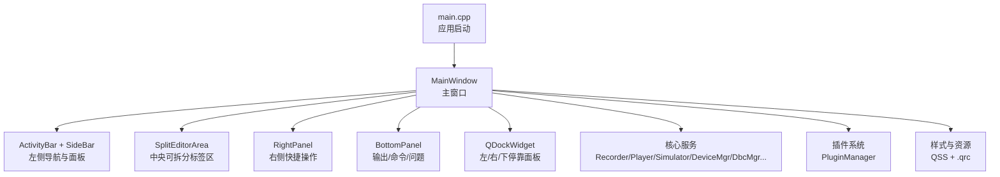
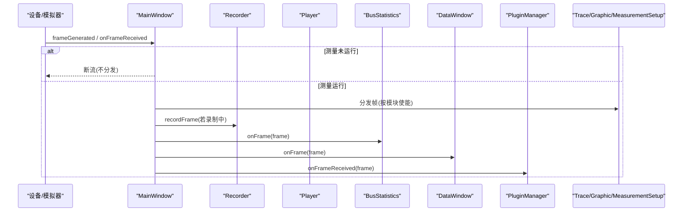
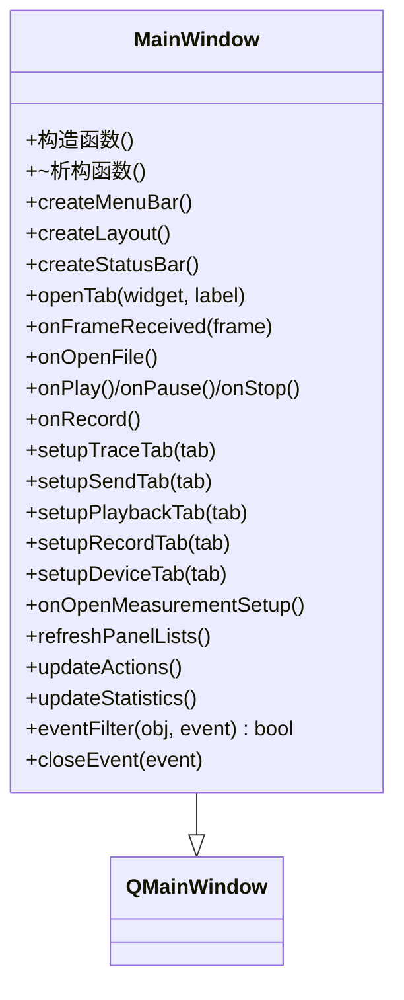
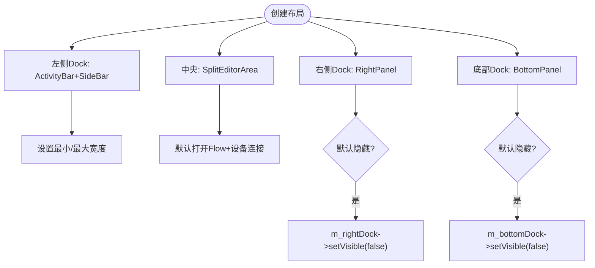
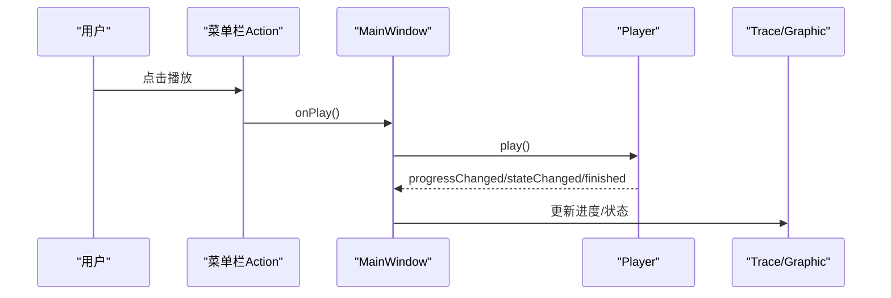
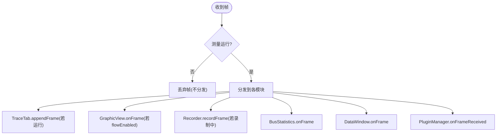
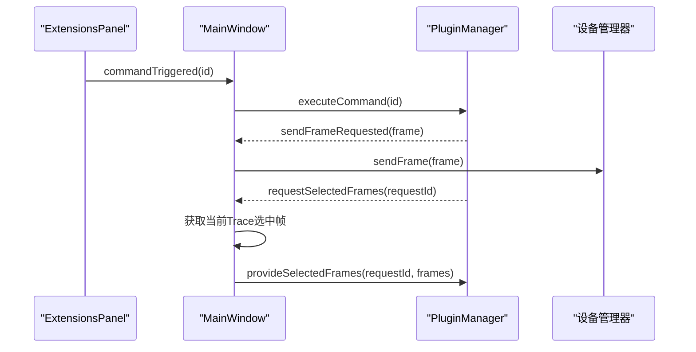
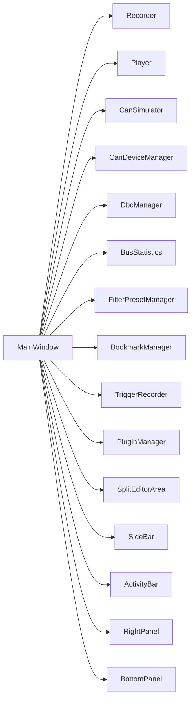

# 主窗口组件架构

<cite>
**本文引用的文件**
- [src/ui/mainwindow.h](file://src/ui/mainwindow.h)
- [src/ui/mainwindow.cpp](file://src/ui/mainwindow.cpp)
- [src/main.cpp](file://src/main.cpp)
- [resources/styles/default.qss](file://resources/styles/default.qss)
- [resources/resources.qrc](file://resources/resources.qrc)
</cite>

## 目录
1. [简介](#简介)
2. [项目结构](#项目结构)
3. [核心组件](#核心组件)
4. [架构总览](#架构总览)
5. [详细组件分析](#详细组件分析)
6. [依赖关系分析](#依赖关系分析)
7. [性能与内存优化](#性能与内存优化)
8. [故障排查指南](#故障排查指南)
9. [结论](#结论)
10. [附录：使用示例与扩展指南](#附录使用示例与扩展指南)

## 简介
本文件围绕 MainWindow 组件，系统化阐述其设计模式、继承关系、接口定义、UI 组织结构、布局管理策略、事件处理机制、信号槽通信、状态管理、样式系统集成、资源访问模式、插件扩展点、生命周期管理、内存优化与性能考量，并提供具体使用示例与扩展指南。该组件是 CAN/CAN FD 报文分析工具的主界面，承担菜单栏、可停靠面板、标签页编辑器区域、状态栏、数据流分发、录制/回放、DBC 解析、Flow 流程编排、工程管理与插件系统协调等职责。

## 项目结构
- UI 层：MainWindow 作为 QMainWindow 子类，组织 ActivityBar、SideBar、SplitEditorArea、BottomPanel、RightPanel 以及多个 Tab（TraceTab、GraphicView、PlaybackTab、RecordTab、DeviceConnectionTab、ExtensionsTab 等）。
- 核心服务：Recorder、Player、CanSimulator、CanDeviceManager、DbcManager、BusStatistics、FilterPresetManager、BookmarkManager、TriggerRecorder、PluginManager。
- 资源与样式：通过 Qt 资源系统加载 QSS 样式表，统一外观。
- 入口：main.cpp 负责应用初始化、主题加载、日志、会话恢复并创建 MainWindow。

图表来源
- [src/main.cpp:11-39](file://src/main.cpp#L11-L39)
- [src/ui/mainwindow.cpp:88-123](file://src/ui/mainwindow.cpp#L88-L123)
- [src/ui/mainwindow.cpp:638-714](file://src/ui/mainwindow.cpp#L638-L714)
- [resources/resources.qrc:1-20](file://resources/resources.qrc#L1-L20)

章节来源
- [src/main.cpp:11-39](file://src/main.cpp#L11-L39)
- [src/ui/mainwindow.cpp:88-123](file://src/ui/mainwindow.cpp#L88-L123)
- [src/ui/mainwindow.cpp:638-714](file://src/ui/mainwindow.cpp#L638-L714)
- [resources/resources.qrc:1-20](file://resources/resources.qrc#L1-L20)

## 核心组件
- MainWindow：继承自 QMainWindow，集中管理 UI 构建、信号槽连接、数据流分发、标签页与停靠面板、工程状态、插件集成。
- 侧边栏与活动栏：ActivityBar 切换“活动”，SideBar 提供 DBC、Trace、图形配置、收发、设备、协议、工具、扩展等子面板。
- 编辑器区域：SplitEditorArea 支持多拆分组与多标签页，承载 TraceTab、GraphicView、PlaybackTab、RecordTab、DeviceConnectionTab、ExtensionsTab 等。
- 底部面板：BottomPanel 提供输出日志、命令输入、问题列表。
- 右侧面板：RightPanel 提供快速录制/停止/播放/暂停/停止/清空/自动滚动/连接/断开/AI消息。
- 核心服务：Recorder、Player、CanSimulator、CanDeviceManager、DbcManager、BusStatistics、FilterPresetManager、BookmarkManager、TriggerRecorder、PluginManager。

章节来源
- [src/ui/mainwindow.h:51-268](file://src/ui/mainwindow.h#L51-L268)
- [src/ui/mainwindow.cpp:88-123](file://src/ui/mainwindow.cpp#L88-L123)
- [src/ui/mainwindow.cpp:638-714](file://src/ui/mainwindow.cpp#L638-L714)

## 架构总览
MainWindow 采用“中心调度 + 信号槽解耦”的架构：
- 数据源（硬件设备或模拟器）产生帧，经 MainWindow 分发到各模块（Trace、Graphic、Recorder、BusStatistics、DataWindow、插件）。
- 用户交互（菜单、快捷键、侧边栏、右侧面板、命令）统一汇聚到 MainWindow 的槽函数，再调用相应服务。
- Flow 页面控制测量运行状态，决定数据是否继续分发；模块级开关控制单个实例接收数据。
- 工程管理器负责保存/恢复当前工程状态（数据源、设备配置、DBC、默认 Trace/Graphic 实例、标签顺序等）。

图表来源
- [src/ui/mainwindow.cpp:1047-1091](file://src/ui/mainwindow.cpp#L1047-L1091)

章节来源
- [src/ui/mainwindow.cpp:1047-1091](file://src/ui/mainwindow.cpp#L1047-L1091)

## 详细组件分析

### 类结构与继承关系
- MainWindow 继承自 QMainWindow，封装了所有 UI 与业务协调逻辑。
- 成员包含大量子部件与服务指针，通过父对象父子关系进行生命周期管理。
- 通过 Q_OBJECT 宏启用信号槽机制，声明了大量槽用于响应各类事件。

图表来源
- [src/ui/mainwindow.h:51-268](file://src/ui/mainwindow.h#L51-L268)
- [src/ui/mainwindow.cpp:88-123](file://src/ui/mainwindow.cpp#L88-L123)

章节来源
- [src/ui/mainwindow.h:51-268](file://src/ui/mainwindow.h#L51-L268)
- [src/ui/mainwindow.cpp:88-123](file://src/ui/mainwindow.cpp#L88-L123)

### UI 组织与布局管理
- 左侧 Dock：ActivityBar + SideBar，支持收起/展开，宽度记忆。
- 中央：SplitEditorArea 作为 central widget，承载多拆分组与多标签页。
- 右侧 Dock：RightPanel，提供快捷操作。
- 底部 Dock：BottomPanel，输出日志、命令、问题。
- 停靠面板尺寸与可见性可通过视图菜单控制，支持重置布局。

图表来源
- [src/ui/mainwindow.cpp:638-714](file://src/ui/mainwindow.cpp#L638-L714)

章节来源
- [src/ui/mainwindow.cpp:638-714](file://src/ui/mainwindow.cpp#L638-L714)

### 事件处理与信号槽机制
- 菜单栏 Action 绑定到槽：文件、视图、工具、帮助等。
- 侧边栏面板事件：打开/选择/删除 Trace/Graphic、发送/回放/录制、设备连接、协议、工具、扩展等。
- 数据流事件：frameGenerated → onFrameReceived → 分发到各模块。
- 播放器事件：progress/state/finished → 更新 UI 与状态。
- 录制器事件：recordingStarted/recordingStopped → 更新状态与面板。
- 设备管理器事件：connectionChanged/errorOccurred → 更新连接状态与输出。
- 过滤器/选择事件：filterApplied/cleared/frameSelected → 更新过滤与选中状态。
- 命令输入：BottomPanel 命令 → processCommand → 执行对应操作。

图表来源
- [src/ui/mainwindow.cpp:463-584](file://src/ui/mainwindow.cpp#L463-L584)
- [src/ui/mainwindow.cpp:904-914](file://src/ui/mainwindow.cpp#L904-L914)
- [src/ui/mainwindow.cpp:1173-1194](file://src/ui/mainwindow.cpp#L1173-L1194)

章节来源
- [src/ui/mainwindow.cpp:463-584](file://src/ui/mainwindow.cpp#L463-L584)
- [src/ui/mainwindow.cpp:904-914](file://src/ui/mainwindow.cpp#L904-L914)
- [src/ui/mainwindow.cpp:1173-1194](file://src/ui/mainwindow.cpp#L1173-L1194)

### 数据流与状态管理
- 数据源：CanSimulator 与 CanDeviceManager 均发射 frameGenerated，统一接入 onFrameReceived。
- 测量运行标志 m_measurementRunning：由 Flow 页面控制，为 false 时直接断流。
- 模块级使能：Trace 标签页 isRunning、Graphic 属性 flowEnabled、MeasurementSetupView 模块开关。
- 状态同步：updateActions 根据播放器状态更新菜单可用性；updateStatistics 更新状态栏统计。
- 工程状态：captureProjectState/applyProjectState 负责保存/恢复数据源、设备配置、DBC、默认实例、标签顺序等。

图表来源
- [src/ui/mainwindow.cpp:1047-1091](file://src/ui/mainwindow.cpp#L1047-L1091)

章节来源
- [src/ui/mainwindow.cpp:1047-1091](file://src/ui/mainwindow.cpp#L1047-L1091)

### 样式系统与资源访问
- 样式表：default.qss 定义了全局控件风格、Dock、Tab、按钮、表格、滚动条、状态栏等。
- 资源注册：resources.qrc 将样式表与图标等资源纳入 Qt 资源系统，便于运行时加载。
- 主题管理：ThemeManager 负责应用主题，SideBar 设置面板触发主题切换。

章节来源
- [resources/styles/default.qss:1-693](file://resources/styles/default.qss#L1-L693)
- [resources/resources.qrc:1-20](file://resources/resources.qrc#L1-L20)
- [src/ui/mainwindow.cpp:272-279](file://src/ui/mainwindow.cpp#L272-L279)

### 插件扩展点
- 插件管理器：PluginManager 单例，提供发现、激活/停用、命令执行、输出、帧请求、选中帧提供等能力。
- 扩展面板：ExtensionsTab 与 SideBar 的 ExtensionsPanel 协同，展示插件列表、命令、启用状态。
- 事件桥接：MainWindow 连接插件信号到自身槽，转发到底部面板、设备发送、选中帧提供等。

图表来源
- [src/ui/mainwindow.cpp:135-163](file://src/ui/mainwindow.cpp#L135-L163)
- [src/ui/mainwindow.cpp:2849-2919](file://src/ui/mainwindow.cpp#L2849-L2919)

章节来源
- [src/ui/mainwindow.cpp:135-163](file://src/ui/mainwindow.cpp#L135-L163)
- [src/ui/mainwindow.cpp:2849-2919](file://src/ui/mainwindow.cpp#L2849-L2919)

### 生命周期管理
- 构造阶段：初始化核心服务、插件系统、菜单栏、窗口按钮、状态栏、布局、信号槽连接、默认标签页、工程自动加载。
- 运行阶段：响应用户交互、数据流、插件事件、工程切换。
- 关闭阶段：closeEvent 中停止录制/设备/播放器、关闭插件、自动保存工程。
- 标签页销毁：通过 QObject::destroyed 信号清理实例映射与 Flow 场景中的模块块，避免悬空引用。

章节来源
- [src/ui/mainwindow.cpp:88-123](file://src/ui/mainwindow.cpp#L88-L123)
- [src/ui/mainwindow.cpp:2925-2951](file://src/ui/mainwindow.cpp#L2925-L2951)
- [src/ui/mainwindow.cpp:2014-2021](file://src/ui/mainwindow.cpp#L2014-L2021)
- [src/ui/mainwindow.cpp:2056-2063](file://src/ui/mainwindow.cpp#L2056-L2063)

## 依赖关系分析
- MainWindow 强依赖多个子系统：Recorder、Player、CanSimulator、CanDeviceManager、DbcManager、BusStatistics、FilterPresetManager、BookmarkManager、TriggerRecorder、PluginManager。
- UI 组件之间通过信号槽松耦合：ActivityBar ↔ SideBar ↔ EditorArea ↔ Panels。
- 数据流单向：设备/模拟器 → MainWindow → 各消费模块。
- 工程状态通过 ProjectManager 序列化/反序列化，保证跨会话一致性。

图表来源
- [src/ui/mainwindow.cpp:88-123](file://src/ui/mainwindow.cpp#L88-L123)
- [src/ui/mainwindow.cpp:638-714](file://src/ui/mainwindow.cpp#L638-L714)

章节来源
- [src/ui/mainwindow.cpp:88-123](file://src/ui/mainwindow.cpp#L88-L123)
- [src/ui/mainwindow.cpp:638-714](file://src/ui/mainwindow.cpp#L638-L714)

## 性能与内存优化
- 数据流节流：测量未运行时直接断流，避免无效分发。
- 模块级使能：仅对运行中的 Trace 与启用的 Graphic 分发帧，减少渲染压力。
- 定时器管理：周期发送使用 QHash<int, QTimer*> 管理行号到定时器的映射，停止时及时释放。
- 标签页销毁：使用 delete 而非 deleteLater 在工程切换时立即销毁旧 Trace/Graphic，防止 use-after-free。
- 延迟清理：模块实例关闭时使用 QTimer::singleShot(0) 延迟到下一轮事件循环，避免在右键菜单 exec() 本地事件循环中触发重建导致崩溃。
- 自动滚动：仅在非覆盖模式下且开启自动滚动时滚动到底部，减少频繁重绘。
- 资源加载：QSS 与图标通过 .qrc 统一管理，避免路径错误与重复加载。

章节来源
- [src/ui/mainwindow.cpp:1047-1091](file://src/ui/mainwindow.cpp#L1047-L1091)
- [src/ui/mainwindow.cpp:1565-1620](file://src/ui/mainwindow.cpp#L1565-L1620)
- [src/ui/mainwindow.cpp:3156-3170](file://src/ui/mainwindow.cpp#L3156-L3170)
- [src/ui/mainwindow.cpp:2073-2105](file://src/ui/mainwindow.cpp#L2073-L2105)
- [src/ui/mainwindow.cpp:1031-1041](file://src/ui/mainwindow.cpp#L1031-L1041)
- [resources/resources.qrc:1-20](file://resources/resources.qrc#L1-L20)

## 故障排查指南
- 无法录制：检查文件格式是否支持写入、路径是否有效、磁盘空间是否足够；查看底部面板问题列表。
- 设备连接失败：确认设备驱动与通道配置；查看连接状态与错误输出。
- 数据未显示：确认 Flow 页面已启动测量；检查 Trace/Graphic 模块是否启用；确认自动滚动设置。
- 插件无输出：检查插件是否激活；查看插件命令是否注册；确认底部面板输出通道。
- 工程切换异常：确保正确保存当前工程状态；检查 DBC 文件是否存在；关注标签页销毁顺序。

章节来源
- [src/ui/mainwindow.cpp:876-902](file://src/ui/mainwindow.cpp#L876-L902)
- [src/ui/mainwindow.cpp:1737-1778](file://src/ui/mainwindow.cpp#L1737-L1778)
- [src/ui/mainwindow.cpp:1909-1942](file://src/ui/mainwindow.cpp#L1909-L1942)
- [src/ui/mainwindow.cpp:2849-2919](file://src/ui/mainwindow.cpp#L2849-L2919)
- [src/ui/mainwindow.cpp:3147-3298](file://src/ui/mainwindow.cpp#L3147-L3298)

## 结论
MainWindow 作为应用的中心枢纽，采用清晰的层次化布局与信号槽解耦机制，实现了数据流分发、用户交互、状态管理、插件扩展与工程持久化的统一协调。通过 Flow 页面控制测量运行、模块级使能、定时器与标签页生命周期管理，兼顾了功能完整性与性能稳定性。样式与资源通过 QSS 与 .qrc 统一管理，提升了可维护性与可扩展性。

## 附录：使用示例与扩展指南

### 基本使用流程
- 启动应用后，默认打开 Flow 与设备连接标签页。
- 在 Flow 页面选择数据源（文件或硬件），点击开始以启动数据流。
- 在 Trace 标签页查看报文，可使用过滤栏与列过滤筛选。
- 双击帧或信号可添加到 Graphic 视图进行波形显示。
- 使用右侧面板快捷按钮进行录制/播放/连接等操作。
- 通过底部面板命令行执行常用操作（help、clear、sim/dev on/off、record/play/filter/stats/load 等）。

章节来源
- [src/ui/mainwindow.cpp:669-680](file://src/ui/mainwindow.cpp#L669-L680)
- [src/ui/mainwindow.cpp:1909-1942](file://src/ui/mainwindow.cpp#L1909-L1942)
- [src/ui/mainwindow.cpp:2467-2553](file://src/ui/mainwindow.cpp#L2467-L2553)

### 扩展插件开发要点
- 实现插件信息注册与命令暴露。
- 订阅 MainWindow 提供的帧事件与选中帧请求。
- 通过 PluginManager 执行命令、激活/停用插件、输出日志。
- 在 ExtensionsTab 与 SideBar 扩展面板中展示插件状态与命令。

章节来源
- [src/ui/mainwindow.cpp:135-163](file://src/ui/mainwindow.cpp#L135-L163)
- [src/ui/mainwindow.cpp:2849-2919](file://src/ui/mainwindow.cpp#L2849-L2919)

### 自定义样式与主题
- 修改 default.qss 中的控件样式规则，如颜色、边框、字体、滚动条等。
- 通过 ThemeManager 动态切换主题，或在启动时应用指定主题。
- 使用 .qrc 资源系统管理样式与图标，确保跨平台一致。

章节来源
- [resources/styles/default.qss:1-693](file://resources/styles/default.qss#L1-L693)
- [resources/resources.qrc:1-20](file://resources/resources.qrc#L1-L20)
- [src/ui/mainwindow.cpp:272-279](file://src/ui/mainwindow.cpp#L272-L279)