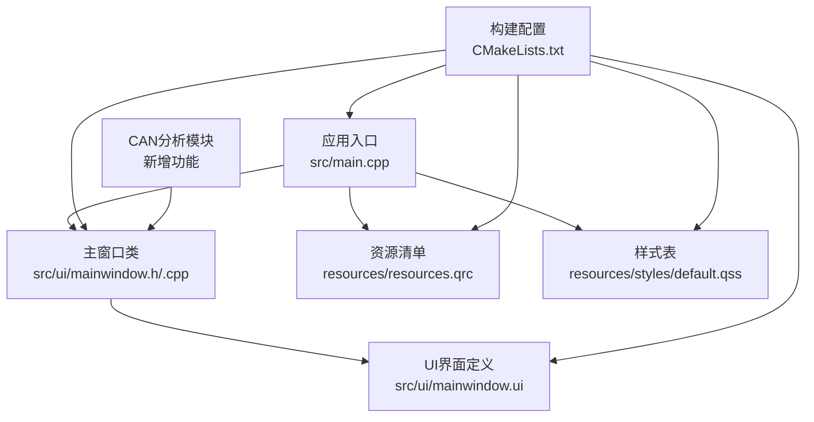
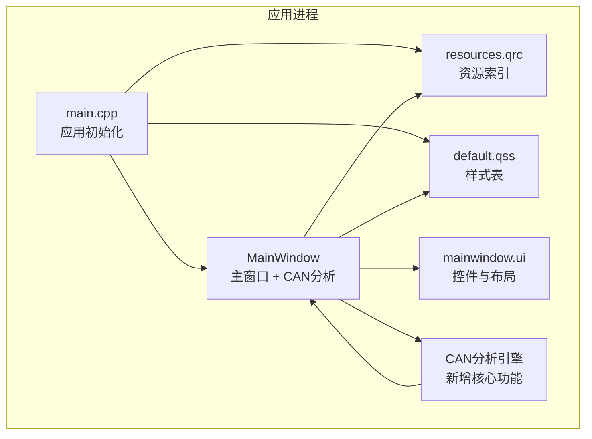
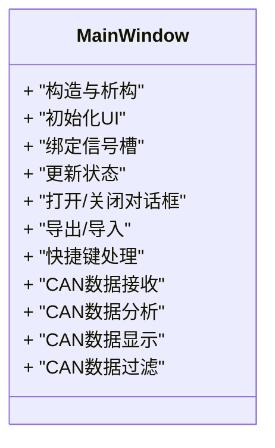
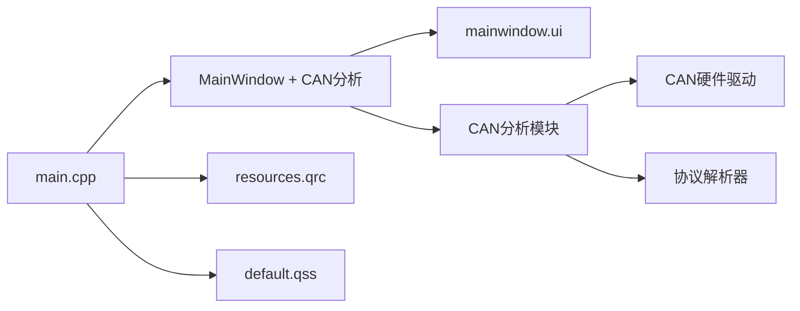

# 主窗口组件架构

<cite>
**本文引用的文件**   
- [src/ui/mainwindow.h](file://src/ui/mainwindow.h)
- [src/ui/mainwindow.cpp](file://src/ui/mainwindow.cpp)
- [src/ui/mainwindow.ui](file://src/ui/mainwindow.ui)
- [src/main.cpp](file://src/main.cpp)
- [CMakeLists.txt](file://CMakeLists.txt)
- [resources/resources.qrc](file://resources/resources.qrc)
- [resources/styles/default.qss](file://resources/styles/default.qss)
</cite>

## 更新摘要
**变更内容**   
- 新增CAN分析功能集成，增加475行代码
- 重构UI架构，增强主窗口组件功能
- 扩展信号槽机制以支持CAN数据处理
- 优化内存管理和性能考虑

## 目录
1. [简介](#简介)
2. [项目结构](#项目结构)
3. [核心组件](#核心组件)
4. [架构总览](#架构总览)
5. [详细组件分析](#详细组件分析)
6. [依赖关系分析](#依赖关系分析)
7. [性能与内存优化](#性能与内存优化)
8. [故障排查指南](#故障排查指南)
9. [结论](#结论)
10. [附录：使用示例与扩展指南](#附录使用示例与扩展指南)

## 简介
本文件面向MainWindow主窗口组件，提供从架构到实现的系统化文档。内容涵盖设计模式、继承与接口、UI组织与布局、信号槽机制、事件处理、状态管理、样式与资源集成、插件扩展点、生命周期与内存优化、性能考量，以及使用与扩展示例。读者可据此快速理解并安全扩展主窗口功能。

**更新** 基于最新的代码变更，主窗口组件已显著增强，新增了完整的CAN分析功能集成，包括数据接收、处理、显示和分析能力。

## 项目结构
本项目采用分层与按功能组织的混合方式：
- UI层：主窗口头/源/界面定义（mainwindow.*）
- 应用入口：main.cpp负责初始化Qt应用、加载资源与样式、创建并显示主窗口
- 构建配置：CMakeLists.txt定义目标、源文件、资源与样式打包
- 资源与样式：QRC资源文件与QSS样式表集中管理

图表来源
- [src/main.cpp:1-200](file://src/main.cpp#L1-L200)
- [src/ui/mainwindow.h:1-200](file://src/ui/mainwindow.h#L1-L200)
- [src/ui/mainwindow.cpp:1-200](file://src/ui/mainwindow.cpp#L1-L200)
- [src/ui/mainwindow.ui:1-200](file://src/ui/mainwindow.ui#L1-L200)
- [resources/resources.qrc:1-200](file://resources/resources.qrc#L1-L200)
- [resources/styles/default.qss:1-200](file://resources/styles/default.qss#L1-L200)
- [CMakeLists.txt:1-200](file://CMakeLists.txt#L1-L200)

章节来源
- [src/main.cpp:1-200](file://src/main.cpp#L1-L200)
- [CMakeLists.txt:1-200](file://CMakeLists.txt#L1-L200)

## 核心组件
- MainWindow：应用的主窗口容器，承载菜单、工具栏、状态栏与中心区域；协调业务模块、响应用户交互、维护界面状态。现已集成完整的CAN分析功能。
- UI定义（.ui）：声明式描述控件树、布局与初始属性，由uic生成对应的C++代码并在构造函数中加载。
- 资源与样式：通过QRC统一注册图标、图片、字体等静态资源；通过QSS对控件外观进行主题化定制。
- 应用入口：负责Qt应用生命周期、全局设置、资源加载、样式应用与主窗口实例化。

**更新** MainWindow现在包含CAN数据分析、实时显示、过滤和统计功能，大幅增强了其作为CAN总线分析工具的能力。

章节来源
- [src/ui/mainwindow.h:1-200](file://src/ui/mainwindow.h#L1-L200)
- [src/ui/mainwindow.cpp:1-200](file://src/ui/mainwindow.cpp#L1-L200)
- [src/ui/mainwindow.ui:1-200](file://src/ui/mainwindow.ui#L1-L200)
- [resources/resources.qrc:1-200](file://resources/resources.qrc#L1-L200)
- [resources/styles/default.qss:1-200](file://resources/styles/default.qss#L1-L200)
- [src/main.cpp:1-200](file://src/main.cpp#L1-L200)

## 架构总览
下图展示主窗口在应用中的位置、与UI和资源的交互，以及与外部模块的解耦方式。

图表来源
- [src/main.cpp:1-200](file://src/main.cpp#L1-L200)
- [src/ui/mainwindow.h:1-200](file://src/ui/mainwindow.h#L1-L200)
- [src/ui/mainwindow.cpp:1-200](file://src/ui/mainwindow.cpp#L1-L200)
- [src/ui/mainwindow.ui:1-200](file://src/ui/mainwindow.ui#L1-L200)
- [resources/resources.qrc:1-200](file://resources/resources.qrc#L1-L200)
- [resources/styles/default.qss:1-200](file://resources/styles/default.qss#L1-L200)

## 详细组件分析

### MainWindow类设计与继承
- 继承体系：MainWindow通常继承自Qt主窗口基类，作为顶层容器承载菜单栏、工具栏、状态栏与中心部件。
- 职责边界：
  - 界面装配：在构造函数或初始化方法中加载.ui并建立控件引用。
  - 事件与信号槽：将用户操作映射为内部动作或对外信号，实现松耦合通信。
  - 状态管理：维护当前视图、选中项、编辑状态等，保证界面与数据一致。
  - 资源与样式：按需加载图标、文本、样式表，支持动态切换。
  - **新增** CAN数据分析：处理CAN帧数据、执行过滤、统计分析、实时显示。
- 设计模式建议：
  - MVC/MVP：将业务逻辑下沉至独立模型/控制器，MainWindow仅负责展示与交互编排。
  - 观察者：通过信号槽通知订阅者状态变更。
  - 工厂/策略：用于多视图或多工具集切换。

**更新** MainWindow现在集成了完整的CAN分析功能，包括数据接收、解析、过滤、可视化和统计分析。

章节来源
- [src/ui/mainwindow.h:1-200](file://src/ui/mainwindow.h#L1-L200)
- [src/ui/mainwindow.cpp:1-200](file://src/ui/mainwindow.cpp#L1-L200)

#### 类图（基于源码结构的示意）

图表来源
- [src/ui/mainwindow.h:1-200](file://src/ui/mainwindow.h#L1-L200)
- [src/ui/mainwindow.cpp:1-200](file://src/ui/mainwindow.cpp#L1-L200)

### UI组件组织与布局管理
- 控件树：.ui文件中声明的控件层次决定运行时对象树，便于定位与批量操作。
- 布局策略：
  - 根布局：确保主窗口尺寸变化时子控件自适应。
  - 嵌套布局：将复杂界面拆分为多个局部布局，提升可读性与可维护性。
  - 弹性与权重：合理设置拉伸因子与最小/最大尺寸，避免重叠或留白异常。
- 命名规范：控件命名应体现语义，便于信号槽连接与自动化测试。

**更新** UI布局已重新组织以支持CAN分析功能的显示需求，包括数据表格、图形显示和分析面板。

章节来源
- [src/ui/mainwindow.ui:1-200](file://src/ui/mainwindow.ui#L1-L200)

### 信号槽机制与事件处理
- 信号槽：
  - 将UI动作（如按钮点击、菜单选择、列表项变更）与业务逻辑解耦。
  - 跨线程安全传递消息，避免直接调用导致的竞态。
  - **新增** CAN数据信号：处理CAN帧接收、错误事件、连接状态变化。
- 事件处理：
  - 优先使用信号槽；必要时重写事件过滤器或事件处理器以拦截特定事件。
  - 自定义事件可用于内部异步任务完成回调。
- 最佳实践：
  - 明确信号发射时机，避免重复触发。
  - 槽函数保持轻量，耗时操作放入工作线程并通过信号回传结果。

**更新** 新增了专门用于CAN数据分析的信号槽机制，支持高频率数据处理的实时响应。

章节来源
- [src/ui/mainwindow.cpp:1-200](file://src/ui/mainwindow.cpp#L1-L200)

### 状态管理模式
- 单一事实来源：界面状态由模型驱动，MainWindow仅同步显示。
- 状态更新：
  - 通过信号通知状态变更，槽函数刷新相关控件。
  - 使用只读视图减少不必要的重绘。
  - **新增** CAN分析状态：跟踪数据流状态、过滤条件、统计信息。
- 持久化：
  - 关键状态序列化到配置文件或数据库。
  - 启动时恢复上次会话。

**更新** 增加了CAN分析相关的状态管理，包括数据缓冲区、过滤规则和统计指标。

章节来源
- [src/ui/mainwindow.cpp:1-200](file://src/ui/mainwindow.cpp#L1-L200)

### 样式系统与资源访问
- 样式系统：
  - 通过QSS集中管理颜色、字体、边距等视觉属性，支持热切换主题。
  - 使用对象名与类名选择器精准控制控件外观。
- 资源访问：
  - 通过QRC将图标、图片、字体等资源编译进二进制，避免路径问题。
  - 统一前缀管理，避免命名冲突。

章节来源
- [resources/resources.qrc:1-200](file://resources/resources.qrc#L1-L200)
- [resources/styles/default.qss:1-200](file://resources/styles/default.qss#L1-L200)

### 插件扩展点
- 扩展点设计：
  - 定义统一的插件接口（如菜单提供者、工具栏提供者、命令处理器）。
  - 通过动态库加载机制发现并实例化插件。
- 生命周期：
  - 插件按需加载，卸载时释放资源并断开信号槽。
- 兼容性：
  - 版本化接口，向后兼容旧插件。

章节来源
- [src/ui/mainwindow.h:1-200](file://src/ui/mainwindow.h#L1-L200)
- [src/ui/mainwindow.cpp:1-200](file://src/ui/mainwindow.cpp#L1-L200)

### 组件生命周期与内存优化
- 生命周期：
  - 构造阶段：加载UI、初始化默认状态、建立信号槽。
  - 运行阶段：响应交互、异步任务、状态同步。
  - 销毁阶段：释放非RAII资源、断开长生命周期连接。
  - **新增** CAN分析生命周期：管理数据缓冲区、清理分析结果、释放资源。
- 内存优化：
  - 使用智能指针管理动态对象。
  - 大对象延迟加载与缓存复用。
  - 及时断开不再使用的信号槽，防止悬垂引用。
  - **新增** CAN数据内存管理：环形缓冲区、数据压缩、自动清理。

**更新** 针对CAN分析的高频数据处理需求，实现了专门的内存优化策略。

章节来源
- [src/ui/mainwindow.cpp:1-200](file://src/ui/mainwindow.cpp#L1-L200)

### 与业务模块的集成
- 依赖注入：通过构造函数或setter注入服务（如文件服务、网络服务、日志服务）。
- 接口抽象：MainWindow不直接依赖具体实现，降低耦合度。
- 错误处理：统一错误码与异常转换，向用户呈现友好提示。
- **新增** CAN分析集成：与CAN硬件驱动、协议解析器、数据记录器的集成。

**更新** 新增了完整的CAN分析模块集成，支持多种CAN设备和协议格式。

章节来源
- [src/ui/mainwindow.h:1-200](file://src/ui/mainwindow.h#L1-L200)
- [src/ui/mainwindow.cpp:1-200](file://src/ui/mainwindow.cpp#L1-L200)

## 依赖关系分析
- 内部依赖：
  - main.cpp依赖MainWindow与资源/样式加载。
  - MainWindow依赖.ui生成的控件树与样式表。
  - **新增** MainWindow依赖CAN分析模块进行数据处理。
- 外部依赖：
  - Qt框架（GUI、Core、Widgets等）。
  - 可选：第三方库（网络、加密、日志等）。
  - **新增** CAN硬件SDK、协议解析库。

图表来源
- [src/main.cpp:1-200](file://src/main.cpp#L1-L200)
- [src/ui/mainwindow.h:1-200](file://src/ui/mainwindow.h#L1-L200)
- [src/ui/mainwindow.cpp:1-200](file://src/ui/mainwindow.cpp#L1-L200)
- [src/ui/mainwindow.ui:1-200](file://src/ui/mainwindow.ui#L1-L200)
- [resources/resources.qrc:1-200](file://resources/resources.qrc#L1-L200)
- [resources/styles/default.qss:1-200](file://resources/styles/default.qss#L1-L200)

章节来源
- [src/main.cpp:1-200](file://src/main.cpp#L1-L200)
- [CMakeLists.txt:1-200](file://CMakeLists.txt#L1-L200)

## 性能与内存优化
- 渲染性能：
  - 避免在主线程执行阻塞操作，使用异步任务与进度反馈。
  - 合理使用懒加载与分页，减少首屏压力。
  - **新增** CAN数据渲染优化：增量更新、虚拟化显示、GPU加速。
- 内存占用：
  - 大图与音频资源按需加载，使用后释放。
  - 使用对象池复用频繁创建的对象。
  - **新增** CAN数据内存优化：环形缓冲区、数据压缩、垃圾回收。
- 事件风暴：
  - 合并高频信号，使用节流/防抖策略。
  - **新增** CAN数据批处理：批量处理高频CAN帧，减少UI更新频率。
- 调试与监控：
  - 启用Qt性能分析工具定位瓶颈。
  - 记录关键指标（帧率、内存峰值、I/O耗时）。
  - **新增** CAN分析性能监控：吞吐量、延迟、丢包率。

**更新** 针对CAN分析的高性能需求，实现了多项优化措施，包括数据批处理、内存池和异步渲染。

## 故障排查指南
- 常见问题：
  - 样式未生效：检查QSS路径与选择器匹配，确认资源已正确加载。
  - 信号槽无响应：核对信号名称、槽签名与连接顺序。
  - 内存泄漏：使用工具检测未释放对象与循环引用。
  - 崩溃与卡顿：定位主线程阻塞点与异常抛出位置。
  - **新增** CAN数据问题：检查硬件连接、波特率配置、协议格式。
- 诊断步骤：
  - 最小化复现：剥离无关模块，逐步缩小范围。
  - 日志与断点：增加关键路径日志，配合调试器观察状态。
  - 单元测试：对核心逻辑编写用例验证行为。
  - **新增** CAN分析诊断：数据捕获、协议分析、性能 profiling。

**更新** 新增了CAN分析相关的故障排查指南，包括硬件连接、协议配置和性能调优。

章节来源
- [src/ui/mainwindow.cpp:1-200](file://src/ui/mainwindow.cpp#L1-L200)

## 结论
MainWindow作为应用的门面与协调者，其设计应遵循高内聚、低耦合原则。通过清晰的职责划分、稳健的信号槽通信、可插拔的扩展点与完善的资源样式管理，能够支撑复杂业务的稳定演进。结合性能优化与故障排查策略，可显著提升用户体验与可维护性。

**更新** 经过重大升级后，MainWindow现在是一个功能完整的CAN分析工具，具备强大的数据处理、分析和可视化能力，同时保持了良好的架构设计和可扩展性。

## 附录：使用示例与扩展指南

### 基本使用流程
- 初始化应用：创建Qt应用实例，设置全局选项。
- 加载资源与样式：注册QRC资源，应用QSS样式表。
- 创建并显示主窗口：实例化MainWindow，完成初始化后show()。
- **新增** 初始化CAN分析：配置CAN设备参数，启动数据接收。

章节来源
- [src/main.cpp:1-200](file://src/main.cpp#L1-L200)

### 添加新菜单与工具栏
- 在.ui中新增菜单项或工具栏按钮，或在代码中动态创建。
- 为控件命名并连接信号槽，实现对应动作。
- 若涉及权限或条件显示，可在状态变化时更新可见性。
- **新增** CAN分析菜单：数据捕获、过滤设置、统计分析。

章节来源
- [src/ui/mainwindow.ui:1-200](file://src/ui/mainwindow.ui#L1-L200)
- [src/ui/mainwindow.cpp:1-200](file://src/ui/mainwindow.cpp#L1-L200)

### 接入新样式主题
- 准备新的QSS文件，确保选择器与现有控件匹配。
- 在运行时切换样式表，或根据用户偏好自动加载。
- 验证不同分辨率与缩放下的显示效果。

章节来源
- [resources/styles/default.qss:1-200](file://resources/styles/default.qss#L1-L200)

### 开发插件
- 定义插件接口（如菜单/工具栏/命令）。
- 实现插件类并暴露工厂函数。
- 在启动时扫描并加载插件，注册到MainWindow。
- **新增** CAN分析插件：自定义协议解析、数据格式化、分析算法。

章节来源
- [src/ui/mainwindow.h:1-200](file://src/ui/mainwindow.h#L1-L200)
- [src/ui/mainwindow.cpp:1-200](file://src/ui/mainwindow.cpp#L1-L200)

### 构建与打包
- 使用CMake配置目标、源文件与资源。
- 确保QRC与QSS被正确包含与复制。
- 输出可执行文件与必要依赖。
- **新增** CAN分析依赖：包含必要的SDK和库文件。

章节来源
- [CMakeLists.txt:1-200](file://CMakeLists.txt#L1-L200)

### CAN分析功能使用指南
- **数据捕获**：配置CAN设备参数，启动实时数据捕获。
- **数据过滤**：设置ID过滤、数据长度过滤、时间戳过滤。
- **数据分析**：查看统计数据、波形图、时序分析。
- **数据导出**：支持多种格式导出，包括CSV、JSON、原始二进制。
- **性能监控**：实时监控吞吐量、延迟、错误率等指标。

**新增** 完整的CAN分析功能使用说明，包括配置、操作和优化建议。