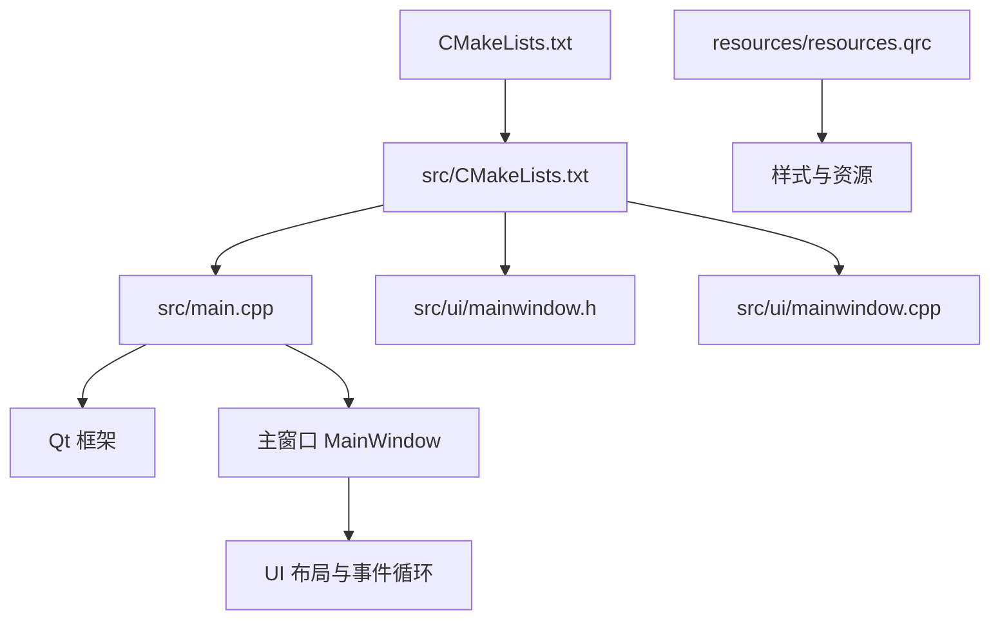
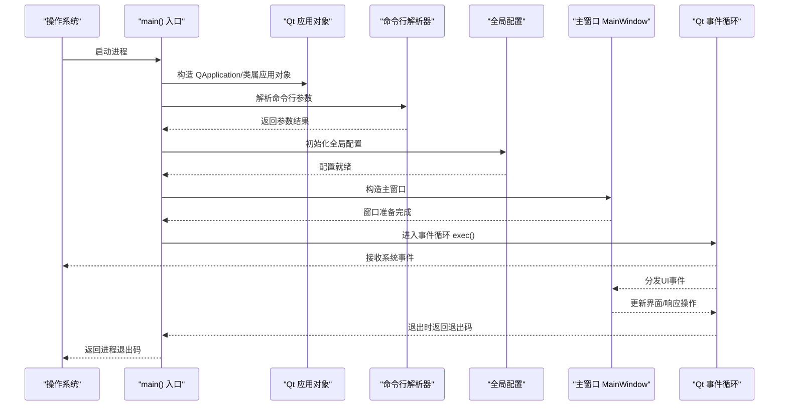
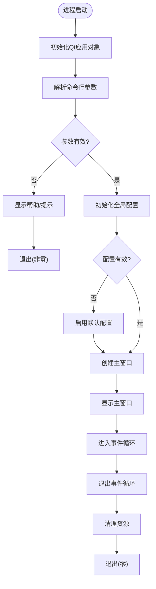
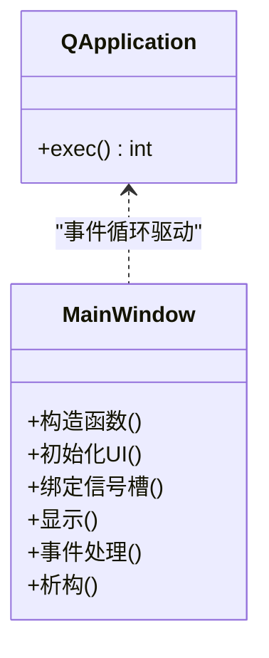
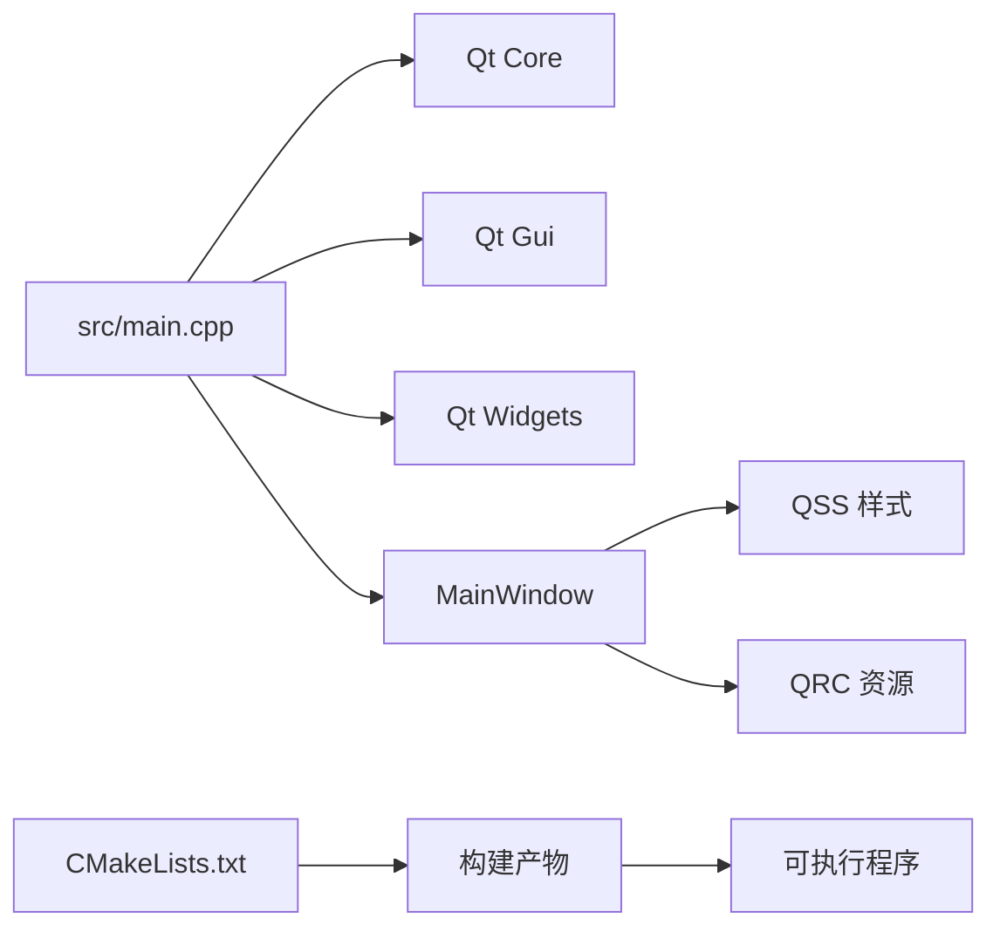

# 应用程序入口设计

<cite>
**本文档引用的文件**   
- [src/main.cpp](file://src/main.cpp)
- [src/ui/mainwindow.h](file://src/ui/mainwindow.h)
- [src/ui/mainwindow.cpp](file://src/ui/mainwindow.cpp)
- [CMakeLists.txt](file://CMakeLists.txt)
- [src/CMakeLists.txt](file://src/CMakeLists.txt)
- [resources/resources.qrc](file://resources/resources.qrc)
- [README.en.md](file://README.en.md)
</cite>

## 目录
1. [简介](#简介)
2. [项目结构](#项目结构)
3. [核心组件](#核心组件)
4. [架构总览](#架构总览)
5. [详细组件分析](#详细组件分析)
6. [依赖关系分析](#依赖关系分析)
7. [性能考虑](#性能考虑)
8. [故障排查指南](#故障排查指南)
9. [结论](#结论)
10. [附录](#附录)

## 简介
本设计文档聚焦于Qt/C++桌面应用程序的入口点设计与实现，围绕main.cpp展开，系统阐述应用程序生命周期管理、Qt框架初始化、资源加载流程与错误处理机制。同时覆盖启动序列、命令行参数处理、全局配置初始化、异常处理策略、与操作系统交互方式、进程管理与内存分配策略，并提供启动性能优化技巧与调试方法，辅以具体代码示例路径与最佳实践指导，帮助读者快速理解并高质量地维护该项目的入口逻辑。

## 项目结构
本项目采用典型的Qt/C++工程组织方式：
- src/main.cpp：应用程序入口，负责Qt环境初始化、命令行解析、全局配置与主窗口创建/显示。
- src/ui/mainwindow.{h,cpp,ui}：主界面定义与实现。
- resources/*：样式与资源文件（QSS、QRC）。
- CMakeLists.txt与src/CMakeLists.txt：构建配置，定义可执行目标、源文件集合、Qt模块链接与资源注册。

图表来源
- [CMakeLists.txt](file://CMakeLists.txt)
- [src/CMakeLists.txt](file://src/CMakeLists.txt)
- [src/main.cpp](file://src/main.cpp)
- [src/ui/mainwindow.h](file://src/ui/mainwindow.h)
- [src/ui/mainwindow.cpp](file://src/ui/mainwindow.cpp)
- [resources/resources.qrc](file://resources/resources.qrc)

章节来源
- [CMakeLists.txt](file://CMakeLists.txt)
- [src/CMakeLists.txt](file://src/CMakeLists.txt)
- [README.en.md](file://README.en.md)

## 核心组件
- 应用程序入口（main）：负责Qt应用对象构造、事件循环启动、异常捕获与退出码设置。
- 主窗口（MainWindow）：承载用户界面与业务交互，通常在main中实例化并显示。
- 资源系统（QSS/QRC）：通过Qt资源系统加载样式与静态资源，确保跨平台一致性与打包便捷性。
- 构建系统（CMake）：声明可执行目标、源文件、Qt模块与资源文件，驱动编译与链接。

章节来源
- [src/main.cpp](file://src/main.cpp)
- [src/ui/mainwindow.h](file://src/ui/mainwindow.h)
- [src/ui/mainwindow.cpp](file://src/ui/mainwindow.cpp)
- [resources/resources.qrc](file://resources/resources.qrc)
- [src/CMakeLists.txt](file://src/CMakeLists.txt)

## 架构总览
下图展示从程序启动到主界面显示的典型调用链，以及关键子系统之间的交互关系。

图表来源
- [src/main.cpp](file://src/main.cpp)
- [src/ui/mainwindow.h](file://src/ui/mainwindow.h)
- [src/ui/mainwindow.cpp](file://src/ui/mainwindow.cpp)

## 详细组件分析

### main.cpp 入口点分析
- 职责边界
  - 构造Qt应用对象，设置应用元信息（名称、版本等）。
  - 解析命令行参数，决定运行模式或功能开关。
  - 初始化全局配置（日志级别、主题、路径等），必要时进行校验与回退。
  - 创建并显示主窗口，启动事件循环。
  - 捕获异常，记录错误信息，设置合理的退出码。
- 启动序列
  - 进程启动 -> Qt初始化 -> 参数解析 -> 配置初始化 -> 主窗口创建 -> 事件循环 -> 退出清理。
- 错误处理策略
  - 使用异常捕获包裹关键初始化步骤，避免崩溃；对不可恢复错误输出诊断信息并返回非零退出码。
  - 对资源加载失败提供降级策略（如默认样式、默认配置）。
- 与操作系统交互
  - 通过Qt封装访问系统字体、屏幕尺寸、平台特性；避免直接调用系统API以保证跨平台一致性。
- 内存与资源管理
  - 遵循RAII原则，优先使用栈对象与智能指针；避免在入口中进行大对象堆分配。
  - 延迟加载重型资源，减少启动时间。

图表来源
- [src/main.cpp](file://src/main.cpp)

章节来源
- [src/main.cpp](file://src/main.cpp)

### 主窗口（MainWindow）组件分析
- 职责边界
  - 承载UI布局与业务交互逻辑，响应用户输入与系统事件。
  - 在构造阶段加载必要的视图数据与样式，必要时异步加载重型数据。
- 生命周期
  - 构造 -> 初始化UI -> 绑定信号槽 -> 显示 -> 事件处理 -> 析构释放资源。
- 与入口的关系
  - 由main创建并显示，通常不持有Qt应用对象的引用，保持解耦。

图表来源
- [src/ui/mainwindow.h](file://src/ui/mainwindow.h)
- [src/ui/mainwindow.cpp](file://src/ui/mainwindow.cpp)

章节来源
- [src/ui/mainwindow.h](file://src/ui/mainwindow.h)
- [src/ui/mainwindow.cpp](file://src/ui/mainwindow.cpp)

### 资源系统与样式（QSS/QRC）
- QSS样式
  - 通过Qt样式表统一控制界面外观，便于主题切换与维护。
- QRC资源
  - 将图片、样式等资源编译进二进制，提升加载速度与部署便利性。
- 加载时机
  - 建议在应用启动后按需加载，避免阻塞主线程；可在主窗口构造完成后触发。

章节来源
- [resources/resources.qrc](file://resources/resources.qrc)

### 构建系统（CMake）与入口集成
- 可执行目标
  - 定义可执行文件名、源文件集合、Qt模块链接（Core、Gui、Widgets等）。
- 资源注册
  - 将QRC文件加入构建，使资源在运行时可用。
- 交叉平台
  - 通过CMake变量与条件语句适配不同平台差异。

章节来源
- [CMakeLists.txt](file://CMakeLists.txt)
- [src/CMakeLists.txt](file://src/CMakeLists.txt)

## 依赖关系分析
- 入口依赖
  - main.cpp依赖Qt核心库、GUI/Widgets模块、主窗口类与资源系统。
- 主窗口依赖
  - 依赖Qt UI框架、样式资源、可能的业务模块（若存在）。
- 构建依赖
  - CMake依赖Qt安装路径与模块，生成平台相关构建脚本。

图表来源
- [src/main.cpp](file://src/main.cpp)
- [src/ui/mainwindow.h](file://src/ui/mainwindow.h)
- [src/ui/mainwindow.cpp](file://src/ui/mainwindow.cpp)
- [resources/resources.qrc](file://resources/resources.qrc)
- [CMakeLists.txt](file://CMakeLists.txt)
- [src/CMakeLists.txt](file://src/CMakeLists.txt)

章节来源
- [src/main.cpp](file://src/main.cpp)
- [src/CMakeLists.txt](file://src/CMakeLists.txt)

## 性能考虑
- 启动性能优化
  - 延迟加载重型资源与插件，仅在需要时初始化。
  - 减少主线程阻塞操作，将I/O与计算任务移至后台线程。
  - 预编译头文件与增量构建，缩短编译时间。
  - 使用Qt的QCoreApplication::processEvents谨慎处理，避免频繁刷新。
- 内存管理
  - 遵循RAII，避免手动new/delete；使用智能指针管理动态对象。
  - 避免在入口中分配大型缓冲区，改为按需分配。
- 资源加载
  - 使用QRC将资源内嵌，减少磁盘IO；对大图片进行压缩与懒加载。
- 调试与剖析
  - 使用Qt Creator的性能分析工具定位瓶颈。
  - 启用Qt调试宏与日志级别，区分开发/发布行为。

[本节为通用建议，无需特定文件来源]

## 故障排查指南
- 常见问题
  - 启动即崩溃：检查Qt初始化顺序与异常捕获是否完善。
  - 样式未生效：确认QSS加载路径与QRC资源是否正确注册。
  - 参数无效：验证命令行解析逻辑与默认值回退。
- 诊断方法
  - 在关键路径添加日志输出，记录初始化状态与错误码。
  - 使用断点与调试器跟踪异常抛出位置。
  - 在不同平台上复现问题，关注平台差异。
- 修复建议
  - 对不可恢复错误返回非零退出码，便于上层监控。
  - 对可恢复错误提供降级策略，保证基本可用性。

章节来源
- [src/main.cpp](file://src/main.cpp)

## 结论
通过对main.cpp入口点的深入分析，我们明确了应用程序的生命周期管理、Qt框架初始化、资源加载与错误处理的关键要点。结合CMake构建系统与Qt资源体系，可实现跨平台一致的启动体验与稳定的运行表现。遵循本文提供的性能优化与调试方法，有助于提升启动速度、降低故障率并改善用户体验。

[本节为总结性内容，无需特定文件来源]

## 附录
- 最佳实践清单
  - 在main中仅做最小必要初始化，复杂逻辑下沉至模块层。
  - 使用统一的配置中心管理全局设置，支持热重载与校验。
  - 所有外部资源通过QRC统一管理，避免硬编码路径。
  - 对异常进行分层捕获，区分可恢复与不可恢复错误。
  - 使用日志分级输出，生产环境关闭冗余日志。
- 参考实现路径
  - 入口初始化与异常捕获：[src/main.cpp](file://src/main.cpp)
  - 主窗口创建与显示：[src/ui/mainwindow.h](file://src/ui/mainwindow.h), [src/ui/mainwindow.cpp](file://src/ui/mainwindow.cpp)
  - 资源注册与样式加载：[resources/resources.qrc](file://resources/resources.qrc)
  - 构建配置与依赖声明：[CMakeLists.txt](file://CMakeLists.txt), [src/CMakeLists.txt](file://src/CMakeLists.txt)

章节来源
- [src/main.cpp](file://src/main.cpp)
- [src/ui/mainwindow.h](file://src/ui/mainwindow.h)
- [src/ui/mainwindow.cpp](file://src/ui/mainwindow.cpp)
- [resources/resources.qrc](file://resources/resources.qrc)
- [CMakeLists.txt](file://CMakeLists.txt)
- [src/CMakeLists.txt](file://src/CMakeLists.txt)