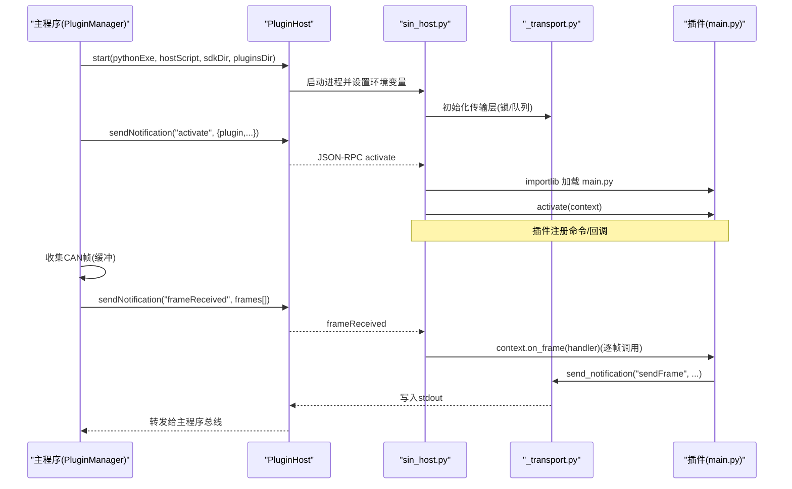
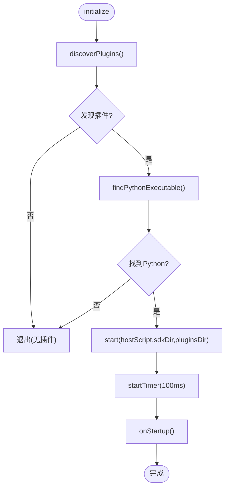
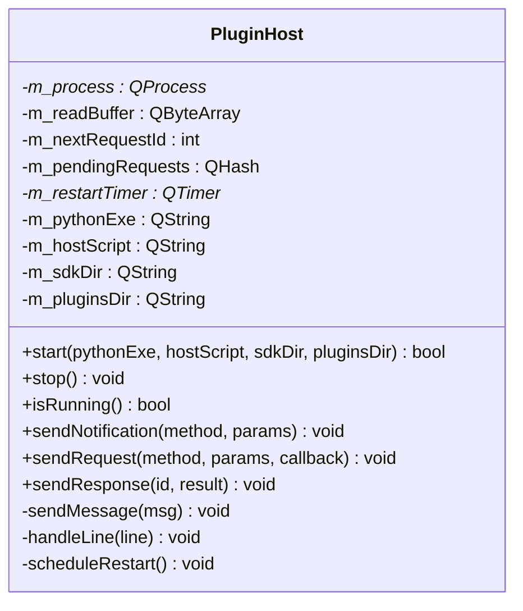
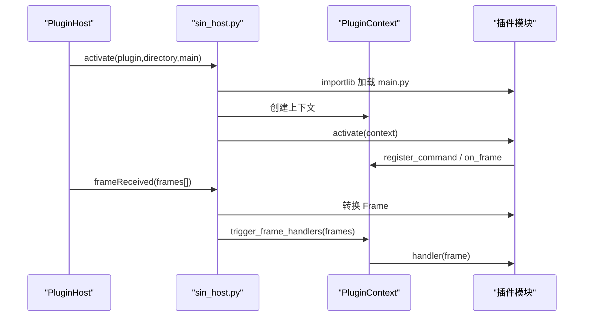
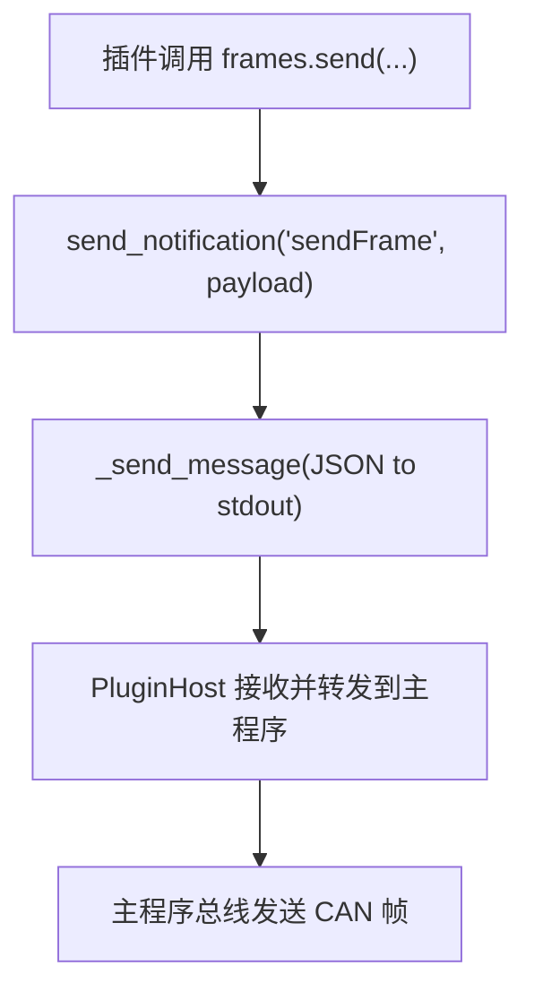
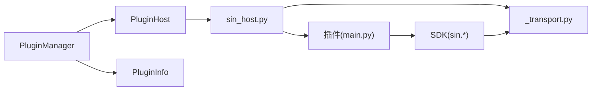

# 插件系统架构

<cite>
**本文引用的文件**
- [pluginhost.h](file://src/core/plugin/pluginhost.h)
- [pluginhost.cpp](file://src/core/plugin/pluginhost.cpp)
- [pluginmanager.h](file://src/core/plugin/pluginmanager.h)
- [pluginmanager.cpp](file://src/core/plugin/pluginmanager.cpp)
- [plugininfo.h](file://src/core/plugin/plugininfo.h)
- [sin_host.py](file://scripts/sin_host.py)
- [_transport.py](file://sdk/sin/_transport.py)
- [frames.py](file://sdk/sin/frames.py)
- [__init__.py](file://sdk/sin/__init__.py)
- [hello-world plugin.json](file://plugins/hello-world/plugin.json)
- [frame-counter plugin.json](file://plugins/frame-counter/plugin.json)
- [ui-demo plugin.json](file://plugins/ui-demo/plugin.json)
- [hello-world main.py](file://plugins/hello-world/main.py)
- [frame-counter main.py](file://plugins/frame-counter/main.py)
- [ui-demo main.py](file://plugins/ui-demo/main.py)
</cite>

## 目录
1. [简介](#简介)
2. [项目结构](#项目结构)
3. [核心组件](#核心组件)
4. [架构总览](#架构总览)
5. [详细组件分析](#详细组件分析)
6. [依赖关系分析](#依赖关系分析)
7. [性能考量](#性能考量)
8. [故障排查指南](#故障排查指南)
9. [结论](#结论)
10. [附录](#附录)

## 简介
本仓库实现了一个跨进程、基于 JSON-RPC 的插件系统。C++ 主程序通过 QProcess 启动独立的 Python 宿主进程，使用 newline-delimited JSON 进行双向通信。插件以 Python 包形式提供，通过声明式配置（plugin.json）描述元数据与激活事件；宿主负责动态加载插件模块并调用其 activate/deactivate 钩子。主程序将 CAN 帧、命令执行、文件打开等事件分发到已激活的插件，插件可通过 SDK 向主程序请求数据或输出日志。该设计实现了主程序与插件之间的松耦合、可扩展与可插拔能力。

## 项目结构
- C++ 核心层：位于 src/core/plugin，包含插件管理器、宿主进程管理、插件元数据结构。
- Python 宿主层：位于 scripts/sin_host.py，负责解析 JSON-RPC、加载插件、分发事件。
- SDK 层：位于 sdk/sin，为插件提供统一 API（输出、帧操作、命令、工作区、信号、UI）。
- 插件示例：位于 plugins，每个插件一个目录，含 plugin.json 与 main.py。

```mermaid
graph TB
subgraph "主程序(C++)"
PM["PluginManager"]
PH["PluginHost"]
end
subgraph "Python 宿主"
SH["sin_host.py"]
TR["_transport.py"]
end
subgraph "插件"
P1["hello-world"]
P2["frame-counter"]
P3["ui-demo"]
end
PM --> PH
PH < --> SH
SH --> TR
SH --> P1
SH --> P2
SH --> P3
```

图表来源
- [pluginmanager.cpp:113-183](file://src/core/plugin/pluginmanager.cpp#L113-L183)
- [pluginhost.cpp:24-79](file://src/core/plugin/pluginhost.cpp#L24-L79)
- [sin_host.py:312-335](file://scripts/sin_host.py#L312-L335)

章节来源
- [pluginmanager.cpp:113-183](file://src/core/plugin/pluginmanager.cpp#L113-L183)
- [pluginhost.cpp:24-79](file://src/core/plugin/pluginhost.cpp#L24-L79)
- [sin_host.py:312-335](file://scripts/sin_host.py#L312-L335)

## 核心组件
- 插件管理器（PluginManager）：单例，负责发现插件、启动宿主、激活/停用插件、事件分发、批量帧缓冲与定时发送。
- 插件宿主（PluginHost）：QProcess 封装，维护 stdin/stdout JSON-RPC 通道，处理请求/响应映射、崩溃重启。
- 插件信息（PluginInfo）：从 plugin.json 解析的元数据，包括名称、版本、入口脚本、激活事件、贡献点等。
- Python 宿主（sin_host.py）：JSON-RPC 消息路由、插件动态加载、上下文管理、Qt 事件循环集成。
- SDK（_transport.py, frames.py, __init__.py）：线程安全的 stdout 传输、请求/响应队列、插件 API。

章节来源
- [pluginmanager.h:17-123](file://src/core/plugin/pluginmanager.h#L17-L123)
- [pluginhost.h:13-95](file://src/core/plugin/pluginhost.h#L13-L95)
- [plugininfo.h:8-54](file://src/core/plugin/plugininfo.h#L8-L54)
- [sin_host.py:78-261](file://scripts/sin_host.py#L78-L261)
- [_transport.py:1-72](file://sdk/sin/_transport.py#L1-L72)
- [frames.py:9-92](file://sdk/sin/frames.py#L9-L92)
- [__init__.py:1-31](file://sdk/sin/__init__.py#L1-L31)

## 架构总览
插件系统采用“主进程 + 子进程”的隔离架构。主进程通过 PluginHost 启动 sin_host.py，并通过环境变量注入 SDK 路径与插件目录。双方通过标准输入输出管道交换 JSON-RPC 消息。插件在 Python 侧由宿主动态导入，按 activationEvents 触发激活流程。CAN 帧事件在主进程侧批量缓冲后定时下发至 Python 宿主，再由宿主分发给所有注册了 on_frame 的插件。



图表来源
- [pluginhost.cpp:24-79](file://src/core/plugin/pluginhost.cpp#L24-L79)
- [pluginmanager.cpp:145-183](file://src/core/plugin/pluginmanager.cpp#L145-L183)
- [sin_host.py:123-164](file://scripts/sin_host.py#L123-L164)
- [sin_host.py:178-194](file://scripts/sin_host.py#L178-L194)
- [_transport.py:39-72](file://sdk/sin/_transport.py#L39-L72)
- [frames.py:69-88](file://sdk/sin/frames.py#L69-L88)

## 详细组件分析

### 插件管理器（PluginManager）
- 职责：扫描插件目录、解析 plugin.json、查找 Python 解释器、启动宿主、激活 onStartup 插件、分发帧/命令/文件事件、批量缓冲帧并按定时器发送。
- 关键流程：
  - discoverPlugins：遍历 plugins/ 目录，加载每个 plugin.json，去重并记录。
  - initialize：构建路径、启动 PluginHost、连接信号、启动帧批处理定时器、onStartup。
  - onFrameReceived：将 CanFrame 转换为 JSON 对象并加入缓冲，定时器触发时批量发送。
  - executeCommand：向宿主发送 executeCommand 通知，宿主在已激活插件中查找并执行。
- 错误处理：未找到 Python、宿主脚本缺失、重复插件名等均有日志提示。



图表来源
- [pluginmanager.cpp:113-183](file://src/core/plugin/pluginmanager.cpp#L113-L183)

章节来源
- [pluginmanager.h:17-123](file://src/core/plugin/pluginmanager.h#L17-L123)
- [pluginmanager.cpp:17-46](file://src/core/plugin/pluginmanager.cpp#L17-L46)
- [pluginmanager.cpp:113-200](file://src/core/plugin/pluginmanager.cpp#L113-L200)

### 插件宿主（PluginHost）
- 职责：管理 QProcess 生命周期、设置环境变量、发送/接收 JSON-RPC 消息、维护待处理请求映射、崩溃自动重启。
- 通信协议：newline-delimited JSON-RPC 2.0，支持通知与请求/响应。
- 关键行为：
  - start：创建 QProcess，连接 readyReadStandardOutput、finished、errorOccurred，设置环境变量 SIN_SDK_DIR/SIN_PLUGINS_DIR。
  - sendRequest/sendNotification：构造 JSON 并写入进程标准输入。
  - onReadyRead：读取缓冲区，按行解析，匹配 id 分发到 pendingRequests。
  - stop：发送 shutdown 通知，优雅退出，必要时 kill。



图表来源
- [pluginhost.h:22-95](file://src/core/plugin/pluginhost.h#L22-L95)
- [pluginhost.cpp:11-200](file://src/core/plugin/pluginhost.cpp#L11-L200)

章节来源
- [pluginhost.h:13-95](file://src/core/plugin/pluginhost.h#L13-L95)
- [pluginhost.cpp:24-200](file://src/core/plugin/pluginhost.cpp#L24-L200)

### Python 宿主（sin_host.py）
- 职责：解析 JSON-RPC、动态加载插件、维护插件上下文、分发帧与命令、可选 Qt 事件循环。
- 关键机制：
  - PluginContext：保存 on_frame 处理器与命令表，提供 register_command/on_frame/execute_command。
  - load_plugin/activate_plugin：importlib 动态导入 main.py，调用 activate(context)。
  - dispatch_frames：将帧数据转为 Frame 对象，逐个调用注册的 handler。
  - handle_message：路由 activate/deactivate/frameReceived/executeCommand/fileOpened/shutdown。
  - _stdin_reader：后台线程读取 stdin，区分响应与请求/通知，避免死锁。
  - 主循环：若 PyQt6 可用则进入 Qt 事件循环，否则简单轮询。



图表来源
- [sin_host.py:123-194](file://scripts/sin_host.py#L123-L194)
- [sin_host.py:225-261](file://scripts/sin_host.py#L225-L261)
- [sin_host.py:280-306](file://scripts/sin_host.py#L280-L306)

章节来源
- [sin_host.py:78-261](file://scripts/sin_host.py#L78-L261)
- [sin_host.py:280-398](file://scripts/sin_host.py#L280-L398)

### SDK 传输层与帧 API
- _transport.py：线程安全地通过 stdout 发送 JSON-RPC 消息，维护请求 ID 与等待队列，支持超时。
- frames.py：提供 Frame 模型与 _Frames API（get_selected/get_recent/send），通过 send_request/send_notification 与主程序交互。
- __init__.py：暴露 output/frames/commands/workspace/signals/ui 等模块供插件使用。



图表来源
- [_transport.py:31-72](file://sdk/sin/_transport.py#L31-L72)
- [frames.py:69-88](file://sdk/sin/frames.py#L69-L88)

章节来源
- [_transport.py:1-72](file://sdk/sin/_transport.py#L1-L72)
- [frames.py:9-92](file://sdk/sin/frames.py#L9-L92)
- [__init__.py:1-31](file://sdk/sin/__init__.py#L1-L31)

### 插件示例与激活事件
- hello-world：演示 onStartup 与命令注册，点击命令输出问候。
- frame-counter：演示 onFrame 实时统计与命令报告输出。
- ui-demo：演示独立窗口、按钮发送帧、订阅帧显示、命令清空输出。

章节来源
- [hello-world plugin.json:1-17](file://plugins/hello-world/plugin.json#L1-L17)
- [frame-counter plugin.json:1-18](file://plugins/frame-counter/plugin.json#L1-L18)
- [ui-demo plugin.json:1-14](file://plugins/ui-demo/plugin.json#L1-L14)
- [hello-world main.py:1-25](file://plugins/hello-world/main.py#L1-L25)
- [frame-counter main.py:1-54](file://plugins/frame-counter/main.py#L1-L54)
- [ui-demo main.py:1-106](file://plugins/ui-demo/main.py#L1-L106)

## 依赖关系分析
- 主程序依赖：
  - PluginManager 依赖 PluginHost、PluginInfo、CanFrame。
  - PluginHost 依赖 QProcess/QTimer/QJsonObject。
- Python 宿主依赖：
  - sin_host.py 依赖 _transport.py、插件模块、可选 PyQt6。
  - SDK 依赖 _transport.py。
- 插件依赖：
  - 插件 main.py 依赖 sin.* 模块（output/frames/commands/workspace/signals/ui）。



图表来源
- [pluginmanager.cpp:1-16](file://src/core/plugin/pluginmanager.cpp#L1-L16)
- [pluginhost.cpp:1-10](file://src/core/plugin/pluginhost.cpp#L1-L10)
- [sin_host.py:12-34](file://scripts/sin_host.py#L12-L34)
- [__init__.py:14-31](file://sdk/sin/__init__.py#L14-L31)

章节来源
- [pluginmanager.cpp:1-16](file://src/core/plugin/pluginmanager.cpp#L1-L16)
- [pluginhost.cpp:1-10](file://src/core/plugin/pluginhost.cpp#L1-L10)
- [sin_host.py:12-34](file://scripts/sin_host.py#L12-L34)
- [__init__.py:14-31](file://sdk/sin/__init__.py#L14-L31)

## 性能考量
- 帧批量缓冲：主程序侧对 CAN 帧进行缓冲，定时器（100ms）批量发送，降低 JSON-RPC 开销与上下文切换成本。
- 异步 I/O：Python 宿主使用独立线程读取 stdin，避免阻塞 send_request 导致死锁；Qt 模式下通过 QTimer 轮询消息队列。
- 线程安全：_transport.py 使用锁保护 stdout 写与请求队列，确保并发安全。
- 资源清理：shutdown 时停用所有插件并关闭 Qt 窗口，防止资源泄漏。

[本节为通用指导，不直接分析具体文件]

## 故障排查指南
- 无法启动 Python 宿主：
  - 检查 findPythonExecutable 是否找到解释器，确认环境变量 SIN_PYTHON 或系统 PATH。
  - 查看日志中的“未找到系统 Python 解释器”。
- 插件未激活：
  - 确认 plugin.json 中 activationEvents 包含 onStartup 或对应事件。
  - 检查 activate 函数是否抛出异常，查看宿主日志中的“激活失败”。
- 命令未生效：
  - 确认插件已注册命令（register_command），且命令 ID 与 plugin.json 一致。
  - 检查 executeCommand 是否正确转发到宿主。
- 帧未到达插件：
  - 确认插件调用了 context.on_frame(handler)。
  - 检查主程序帧缓冲与定时器是否正常触发。
- 死锁或无响应：
  - 确认 _transport.py 的请求/响应队列未被阻塞，stdin 读取线程是否运行。
  - 检查 Qt 模式下 QTimer 是否正常工作。

章节来源
- [pluginmanager.cpp:79-111](file://src/core/plugin/pluginmanager.cpp#L79-L111)
- [sin_host.py:158-176](file://scripts/sin_host.py#L158-L176)
- [sin_host.py:280-306](file://scripts/sin_host.py#L280-L306)
- [_transport.py:44-72](file://sdk/sin/_transport.py#L44-L72)

## 结论
本插件系统通过清晰的层次划分与稳定的 JSON-RPC 通信机制，实现了主程序与插件的解耦与扩展。C++ 侧负责进程管理与事件调度，Python 侧负责插件加载与业务逻辑，SDK 提供统一的接口。批量帧缓冲与异步 I/O 保证了性能与稳定性。建议在实际使用中遵循插件规范，合理声明激活事件与贡献点，并在插件中妥善处理异常与资源释放。

[本节为总结性内容，不直接分析具体文件]

## 附录
- 插件开发最佳实践：
  - 在 activate 中注册命令与帧回调，避免在模块顶层执行耗时操作。
  - 使用 sin.output.append 输出日志，便于调试。
  - 对于 UI 插件，注意 PyQt6 可用性检测与异常捕获。
- 常见问题定位：
  - 通过宿主日志查看“未知方法”、“消息解析错误”、“命令执行错误”等提示。
  - 使用 provideSelectedFrames/provideRecentFrames 回复宿主请求，确保数据正确返回。

[本节为补充说明，不直接分析具体文件]