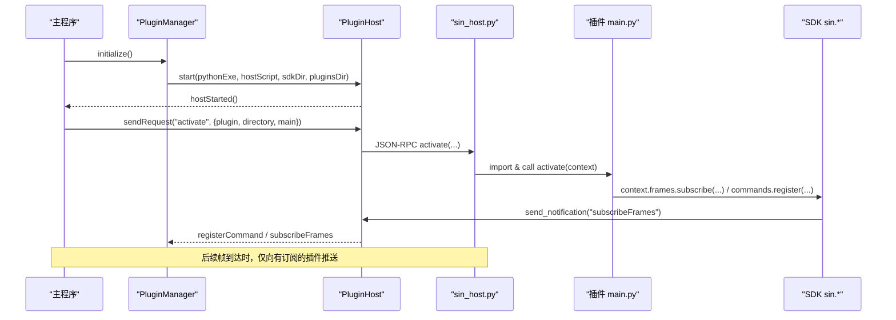
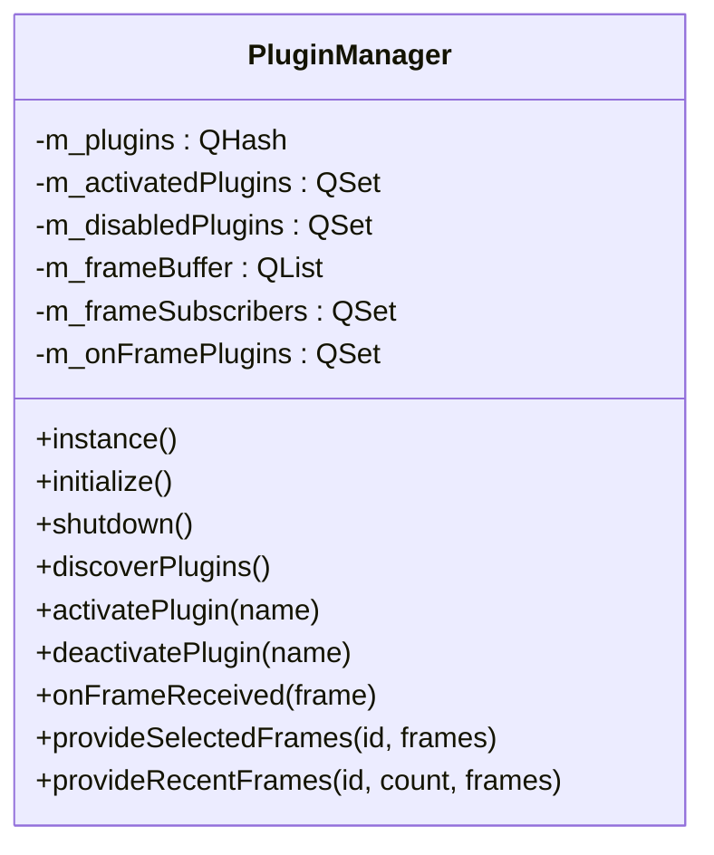
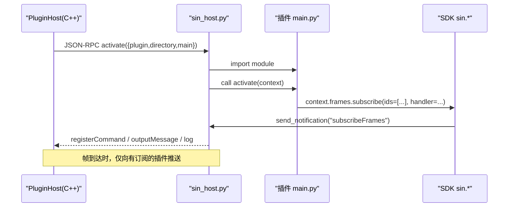
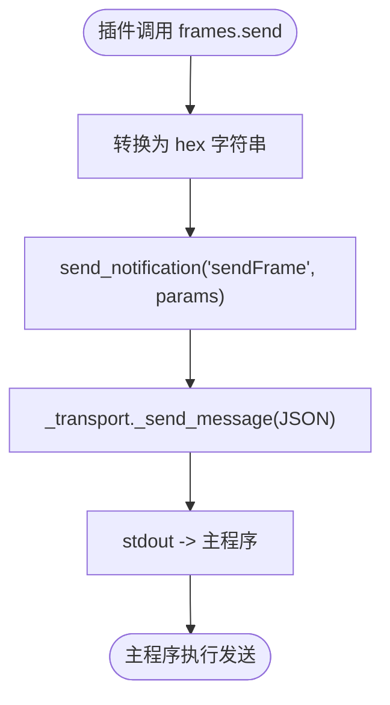
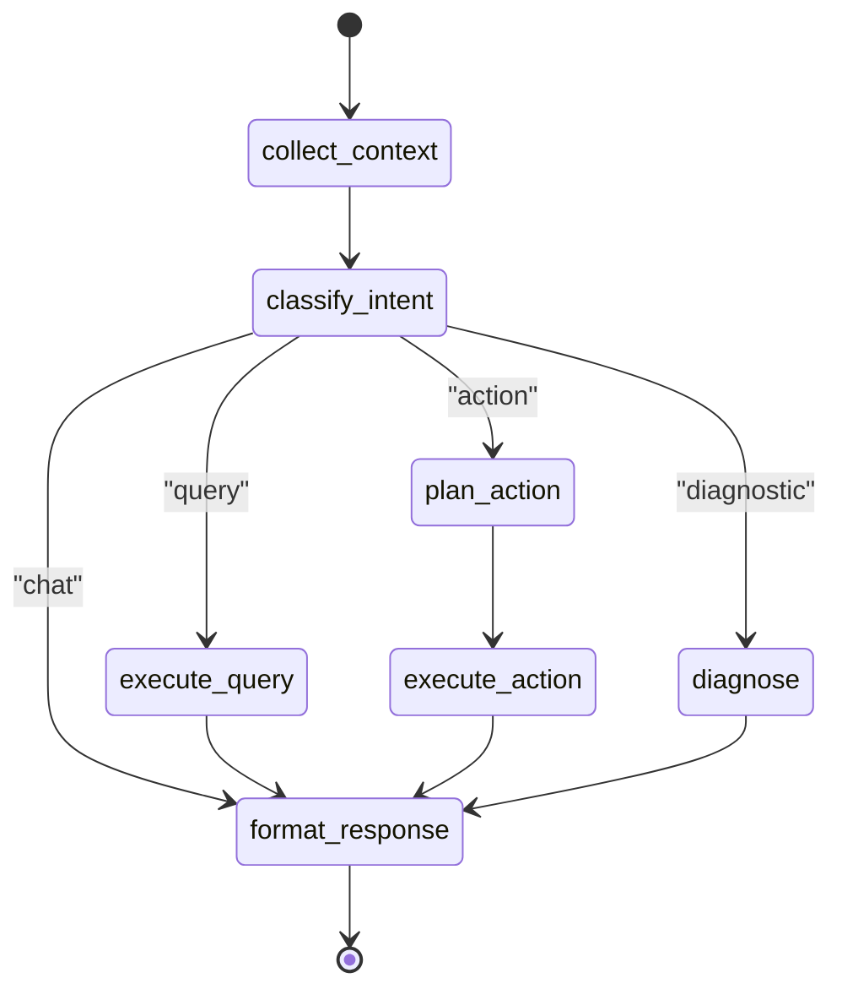

# AI Agent插件系统（已废弃）

<cite>
**本文引用的文件**
- [README.md](file://README.md)
- [doc/插件系统方案.md](file://doc/插件系统方案.md)
- [src/core/plugin/pluginmanager.h](file://src/core/plugin/pluginmanager.h)
- [scripts/sin_host.py](file://scripts/sin_host.py)
- [sdk/sin/__init__.py](file://sdk/sin/__init__.py)
</cite>

## 更新摘要
**变更内容**
- 标记整个AI Agent插件系统为已废弃状态
- 移除所有AI相关功能描述（LangGraph工作流、MCP服务器、OpenAI集成等）
- 保留基础插件系统架构说明作为参考
- 添加废弃警告和迁移指南

## 重要警告 ⚠️

**该AI Agent插件系统已在当前版本中完全移除**。以下文档仅作为历史参考，实际代码库中不再包含任何AI相关功能。

## 目录
1. [简介](#简介)
2. [项目结构](#项目结构)
3. [核心组件](#核心组件)
4. [架构总览](#架构总览)
5. [详细组件分析](#详细组件分析)
6. [依赖关系分析](#依赖关系分析)
7. [性能与扩展性](#性能与扩展性)
8. [故障排查指南](#故障排查指南)
9. [结论](#结论)
10. [附录](#附录)

## 简介
本仓库是一个面向 CAN/CAN FD 总线分析的桌面工具，曾经内置了"AI Agent 插件系统"。**注意：该AI功能已在最新版本中被完全移除**。该系统原本以 VS Code 扩展模型为参考，采用进程隔离、双通道通信（控制通道 JSON-RPC + 数据通道二进制协议）、声明式贡献点与订阅制推送，将 C++ Qt 主程序与 Python 插件完全解耦。其中，oai 插件实现了基于 LangGraph 的工作流编排，结合 MCP（Model Context Protocol）暴露的数据源，提供自然语言查询、诊断与操作能力。

**当前状态**：AI Agent插件系统已从代码库中删除，包括plugins/oai/目录、MCP服务器、OpenAI集成、工作流引擎等所有AI相关功能。

## 项目结构
- 主程序（C++/Qt）：负责 UI、Trace/Graphic、DBC、设备驱动、回放录制等核心功能，并通过插件管理器发现、激活、管理插件进程。
- 插件宿主（Python）：sin_host.py 作为每个插件的独立进程入口，通过 stdin/stdout 的 JSON-RPC 与主程序通信，并加载插件 main.py。
- SDK（Python）：sin.* 模块封装帧、信号、命令、工作区、文件、DBC 等 API，屏蔽 IPC 细节。
- **已移除**：AI Agent 插件（plugins/oai）：原包含 LangGraph 工作流引擎、MCP 服务器、UI 集成计划与安全策略文档。

```mermaid
graph TB
A["主程序 (Qt C++)"] --> B["PluginManager (C++)"]
B --> C["PluginHost (QProcess)"]
C --> D["sin_host.py (Python)"]
D --> E["插件 main.py"]
D --> F["SDK sin.*"]
Note G["⚠️ AI Agent插件系统已移除<br/>plugins/oai/ 目录不存在"]
```

**图表来源**
- [src/core/plugin/pluginmanager.h:20-70](file://src/core/plugin/pluginmanager.h#L20-L70)
- [scripts/sin_host.py:1-49](file://scripts/sin_host.py#L1-L49)

**章节来源**
- [README.md:17-93](file://README.md#L17-L93)
- [doc/插件系统方案.md:17-33](file://doc/插件系统方案.md#L17-L33)

## 核心组件
- 插件管理器（PluginManager）：单例，负责插件发现、激活/停用、消息分发、订阅路由、崩溃自愈与资源回收。
- 插件宿主（PluginHost）：管理 Python 子进程生命周期，JSON-RPC 请求/响应回调、自动重启。
- 宿主脚本（sin_host.py）：解析 JSON-RPC，动态加载插件，维护上下文与命令注册，转发帧到已注册的 on_frame 处理器。
- SDK（sin.*）：对外暴露 frames/signals/commands/workspace/files/dbc/ui 等 API，内部使用 _transport 进行同步请求/通知。
- **已移除**：AI Agent 工作流（workflow_engine.py）：原基于 LangGraph 的状态机，完成意图分类、工具调用、结果格式化；配合 MCP 服务器访问文件系统、实时帧流与 DBC 数据库。

**章节来源**
- [src/core/plugin/pluginmanager.h:20-115](file://src/core/plugin/pluginmanager.h#L20-L115)
- [scripts/sin_host.py:85-139](file://scripts/sin_host.py#L85-L139)
- [sdk/sin/__init__.py:1-33](file://sdk/sin/__init__.py#L1-L33)

## 架构总览
系统采用"主进程 + 多插件进程"的隔离模型，控制通道使用 JSON-RPC 2.0，数据通道使用自定义二进制协议（批量帧、信号更新、统计快照）。插件通过 plugin.json 声明式贡献命令、视图、配置、数据输入输出等，主程序在激活前即可注册 UI 与路由，实现零侵入与按需激活。

**注意**：原AI Agent架构中的LangGraph工作流和MCP服务器组件已完全移除。



**图表来源**
- [src/core/plugin/pluginmanager.h:36-70](file://src/core/plugin/pluginmanager.h#L36-L70)
- [scripts/sin_host.py:164-193](file://scripts/sin_host.py#L164-L193)

## 详细组件分析

### 插件管理器（PluginManager）
- 职责：扫描 plugins/ 目录、读取 plugin.json、启动宿主进程、激活/停用插件、处理来自宿主的消息（输出、命令注册、帧发送请求、清空输出、日志等），并提供选中帧/最近帧查询回复。
- 关键设计：
  - 零侵入接入：仅连接现有信号，不修改已有源文件。
  - 订阅制数据链路：仅在插件注册首个 on_frame 回调后，才向该插件推送帧，无订阅=零开销。
  - 慢消费者保护：缓冲上限丢弃计数，flush 时告警并清零。
  - 工程 DBC 注入：MainWindow 注入 DbcManager，供 signals.* 解码/编码使用。



**图表来源**
- [src/core/plugin/pluginmanager.h:20-115](file://src/core/plugin/pluginmanager.h#L20-L115)

**章节来源**
- [src/core/plugin/pluginmanager.h:20-198](file://src/core/plugin/pluginmanager.h#L20-L198)

### 插件宿主（PluginHost 与 sin_host.py）
- PluginHost（C++）：管理 QProcess 生命周期，JSON-RPC 请求/响应回调，崩溃指数退避重启。
- sin_host.py（Python）：stdin/stdout JSON-RPC 主循环，动态加载插件模块，维护 PluginContext（帧回调、命令注册），分发帧到已注册处理器，处理 files.convert 进度通知，优雅关闭。



**图表来源**
- [scripts/sin_host.py:164-236](file://scripts/sin_host.py#L164-L236)

**章节来源**
- [scripts/sin_host.py:1-452](file://scripts/sin_host.py#L1-L452)

### SDK（sin.*）
- 统一导出：output、frames、commands、workspace、signals、files、dbc、ui（可选）。
- 传输层：_transport 提供 send_notification/send_request/deliver_response，基于 stdout 管道与主程序通信。
- 帧 API：Frame 类封装 id/dlc/data/timestamp/channel/direction 等；支持 get_selected/get_recent/send。



**图表来源**
- [sdk/sin/_transport.py:31-36](file://sdk/sin/_transport.py#L31-L36)

**章节来源**
- [sdk/sin/__init__.py:1-33](file://sdk/sin/__init__.py#L1-L33)

### **已移除**：AI Agent 工作流（LangGraph + MCP）
**注意**：以下内容为历史参考，实际代码已不存在。

- 状态机节点：collect_context → classify_intent → execute_query/plan_action/diagnose → format_response。
- 意图分类：规则关键词匹配（query/action/diagnostic/chat），可扩展为 LLM 分类。
- 工具调用：通过 MockMCPClient 模拟获取最近帧、文件列表、DBC 消息；生产环境替换为真实 mcp.Client。
- 输出格式：根据意图生成表格、建议或确认提示。



**注意**：此架构图仅用于历史参考，实际代码中已不存在相关文件。

## 依赖关系分析
- 主程序依赖：Qt6、C++17、CMake；插件系统通过 PluginManager/PluginHost 与 Python 宿主解耦。
- 插件宿主依赖：Python 标准库、可选 PyQt6（用于 UI）；通过环境变量 SIN_SDK_DIR/SIN_PLUGINS_DIR 定位 SDK 与插件目录。
- SDK 依赖：json、threading、queue；与主程序共享 stdout 锁与请求队列。
- **已移除**：AI 插件依赖：langgraph（可选）、mcp（可选）、fastapi/websockets/pydantic（MCP 服务）。

```mermaid
graph LR
Main["主程序 (Qt C++)"] --> PM["PluginManager"]
PM --> PH["PluginHost"]
PH --> Host["sin_host.py"]
Host --> SDK["SDK sin.*"]
Host --> Plug["插件 main.py"]
Note X["⚠️ AI相关依赖已移除<br/>langgraph/mcp/fastapi等不再需要"]
```

**图表来源**
- [src/core/plugin/pluginmanager.h:20-70](file://src/core/plugin/pluginmanager.h#L20-L70)
- [scripts/sin_host.py:39-49](file://scripts/sin_host.py#L39-L49)

**章节来源**
- [README.md:665-676](file://README.md#L665-L676)

## 性能与扩展性
- 双通道通信：控制通道 JSON-RPC（低频、延迟敏感），数据通道二进制协议（高频、吞吐敏感），满足 CAN FD 高带宽需求。
- 订阅制推送：仅当插件注册 on_frame 回调时才推送帧，无订阅=零开销；批量打包减少 IPC 次数。
- 慢消费者保护：缓冲上限丢弃计数，避免阻塞主线程；flush 时告警并清零。
- 进程隔离：每插件一进程，崩溃不影响主程序与其他插件；自动重启提升鲁棒性。
- 扩展性：声明式贡献点允许在不修改主程序的情况下新增命令、视图、设置项、数据输入输出。

**注意**：原AI插件的性能优化特性（如智能意图分类、MCP数据源缓存等）已随AI功能一同移除。

**章节来源**
- [doc/插件系统方案.md:73-101](file://doc/插件系统方案.md#L73-L101)
- [doc/插件系统方案.md:248-319](file://doc/插件系统方案.md#L248-L319)
- [src/core/plugin/pluginmanager.h:151-164](file://src/core/plugin/pluginmanager.h#L151-L164)

## 故障排查指南
- 插件加载失败：检查插件入口文件是否存在、activate 是否抛出异常；查看宿主日志输出。
- JSON-RPC 超时：确认主程序与宿主进程通信正常，检查 _transport 请求队列与响应分发。
- 帧未推送：确认插件已注册 on_frame 回调并触发 subscribeFrames；检查订阅路由表。
- PyQt6 不可用：若未安装 PyQt6，UI 功能不可用；安装后宿主将启用事件循环。
- **已移除**：MCP 服务端口冲突：原AI插件的MCP服务端口冲突问题已不再适用。

**章节来源**
- [scripts/sin_host.py:145-161](file://scripts/sin_host.py#L145-L161)
- [scripts/sin_host.py:267-311](file://scripts/sin_host.py#L267-L311)

## 结论
**重要更新**：本项目的 AI Agent 插件系统已在最新版本中被完全移除。基础插件系统架构仍然有效，但所有AI相关功能（LangGraph工作流、MCP服务器、OpenAI集成等）均已删除。

当前版本专注于CAN/CAN FD总线分析的核心功能，通过稳定的插件系统提供扩展能力。如需AI功能，建议等待未来版本的重新实现或考虑其他解决方案。

## 附录
- 插件清单（plugin.json）：声明命令、菜单、视图、配置、数据输入输出、信号解码器、文件格式、快捷键、状态栏等，主程序解析后即可注册 UI 与路由，无需激活插件进程。
- 协议契约：版本化（major.minor），仅增量演进；未知消息类型静默丢弃，未知 JSON 字段忽略；能力协商确保前后兼容。
- **已移除**：安全策略：原AI插件的MCP服务沙箱模式、文件系统白名单、控制命令白名单、审计日志记录等功能已不再适用。

**章节来源**
- [doc/插件系统方案.md:463-687](file://doc/插件系统方案.md#L463-L687)
- [doc/插件系统方案.md:192-247](file://doc/插件系统方案.md#L192-L247)