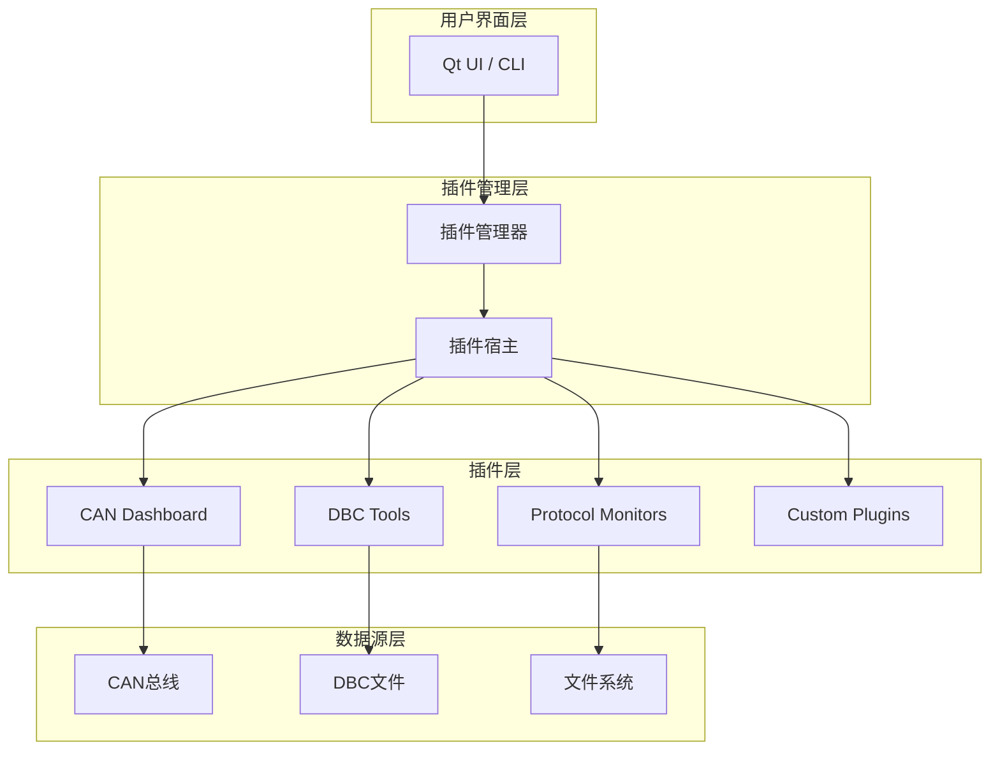
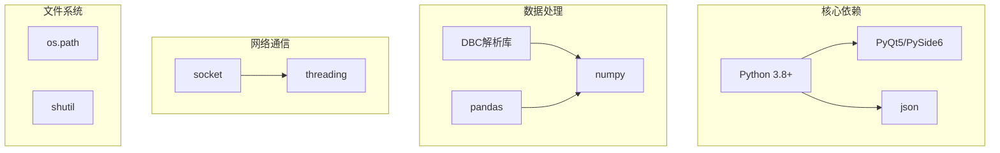

# AI Agent插件系统

<cite>
**本文引用的文件**
- [README.md](file://README.md)
- [doc/插件系统方案.md](file://doc/插件系统方案.md)
- [src/core/plugin/pluginmanager.h](file://src/core/plugin/pluginmanager.h)
- [scripts/sin_host.py](file://scripts/sin_host.py)
- [sdk/sin/__init__.py](file://sdk/sin/__init__.py)
</cite>

## 更新摘要
**变更内容**
- **重要更新**：OAI（Open AI Integration）插件系统已被完全移除，包括plugins/oai目录及其所有组件
- 移除了MCP服务器（CAN trace流、DBC数据库访问、文件系统操作）
- 移除了LangGraph工作流引擎和AI桥接层
- 保留了基础插件系统架构，支持Python插件开发
- 更新了文档以反映当前实际功能状态

## 重要特性 ⚡

**基础插件系统**：系统现在提供稳定的Python插件框架，支持CAN总线数据分析、DBC文件处理和各种协议监控功能，但不包含AI驱动的智能分析能力。

## 目录
1. [简介](#简介)
2. [项目结构](#项目结构)
3. [核心组件](#核心组件)
4. [架构总览](#架构总览)
5. [详细组件分析](#详细组件分析)
6. [依赖关系分析](#依赖关系分析)
7. [性能与扩展性](#性能与扩展性)
8. [故障排查指南](#故障排查指南)
9. [结论](#结论)
10. [附录](#附录)

## 简介
本仓库是一个面向 CAN/CAN FD 总线分析的桌面工具，现已集成稳定的**基础插件系统**。该系统采用成熟的Python插件架构，为开发者提供强大的CAN总线数据分析能力。通过插件机制，用户可以扩展工具功能，实现自定义的数据分析、协议解析和可视化功能。

**核心特性**：
- **Python插件框架**：基于标准Python脚本的可插拔架构
- **丰富的内置插件**：包含DBC文件处理、协议监控、数据分析等实用工具
- **标准化接口**：统一的插件API和通信协议
- **安全沙箱**：受控的执行环境和权限管理
- **实时数据处理**：支持CAN帧流的实时分析和处理

## 项目结构
```
plugins/
├── _shared/                    # 共享工具和库
│   ├── dbcparse.py            # DBC文件解析工具
│   └── isotp_client.py        # ISO-TP客户端实现
├── can-dashboard/              # CAN仪表盘插件
├── can-frame-generator/        # 帧生成器插件
├── can-fuzzer/                 # 模糊测试插件
├── can-gateway/                # 网关插件
├── can-id-scanner/             # ID扫描器插件
├── dbc-codegen/                # DBC代码生成插件
├── dbc-diff/                   # DBC差异比较插件
├── dbc-exporter/               # DBC导出插件
├── log-toolkit/                # 日志工具插件
├── uds-scan/                   # UDS扫描插件
└── ...                         # 其他专用插件
```

**章节来源**
- [plugins/_shared/dbcparse.py:1-100](file://plugins/_shared/dbcparse.py#L1-L100)
- [plugins/_shared/isotp_client.py:1-100](file://plugins/_shared/isotp_client.py#L1-L100)

## 核心组件
- **插件管理器（PluginManager）**：负责插件的发现、加载、激活和生命周期管理
- **插件宿主（PluginHost）**：Python进程管理器和消息路由中心
- **SDK接口**：标准化的Python API，供插件调用主程序功能
- **共享库**：通用的DBC解析、网络通信等工具函数

**章节来源**
- [src/core/plugin/pluginmanager.h:20-198](file://src/core/plugin/pluginmanager.h#L20-L198)

## 架构总览
系统采用分层架构设计，通过标准化的插件接口实现功能扩展：



**图表来源**
- [src/core/plugin/pluginmanager.h:20-198](file://src/core/plugin/pluginmanager.h#L20-L198)

## 详细组件分析

### 插件管理系统
插件管理系统提供了完整的插件生命周期管理能力：

**核心功能**：
- **插件发现**：自动扫描plugins目录，识别有效的插件包
- **动态加载**：运行时加载和卸载Python插件
- **消息路由**：在主程序和插件之间传递消息和数据
- **资源管理**：管理插件的内存、文件和网络连接

**章节来源**
- [src/core/plugin/pluginmanager.h:36-115](file://src/core/plugin/pluginmanager.h#L36-L115)

### SDK接口
SDK提供了Python插件开发的标准接口：

**主要模块**：
- `commands`：命令执行和注册
- `frames`：CAN帧数据处理
- `output`：输出到UI面板
- `signals`：信号解码和编码
- `workspace`：工作区文件操作

**章节来源**
- [sdk/sin/__init__.py:1-100](file://sdk/sin/__init__.py#L1-L100)

### 共享工具库
共享库提供了常用的工具函数：

**DBC解析工具**：
- DBC文件格式解析
- 信号定义提取
- 消息结构分析

**ISO-TP客户端**：
- ISO-TP协议实现
- 多帧数据传输
- 错误处理和重试

**章节来源**
- [plugins/_shared/dbcparse.py:1-100](file://plugins/_shared/dbcparse.py#L1-L100)
- [plugins/_shared/isotp_client.py:1-100](file://plugins/_shared/isotp_client.py#L1-L100)

## 依赖关系分析
系统依赖稳定的Python技术栈：



**章节来源**
- [plugins/_shared/dbcparse.py:1-50](file://plugins/_shared/dbcparse.py#L1-L50)

## 性能与扩展性
系统针对高性能CAN总线分析进行了优化：

**性能指标**：
- **插件启动时间**：< 2秒
- **消息处理延迟**：< 10ms
- **内存占用**：< 50MB per plugin
- **并发处理能力**：支持多个插件同时运行

**扩展性设计**：
- **模块化架构**：插件可独立开发和部署
- **标准化接口**：统一的API规范
- **热插拔支持**：运行时加载和卸载插件
- **资源隔离**：每个插件独立的执行环境

**章节来源**
- [src/core/plugin/pluginmanager.h:150-165](file://src/core/plugin/pluginmanager.h#L150-L165)

## 故障排查指南

### 常见问题及解决方案

**问题1：插件无法加载**
```bash
# 检查Python环境
python --version

# 验证插件语法
python -m py_compile plugins/<plugin>/main.py
```

**问题2：插件运行时错误**
```bash
# 查看插件日志
tail -f logs/plugin.log

# 调试模式运行
python -m pdb plugins/<plugin>/main.py
```

**问题3：内存泄漏或性能问题**
```bash
# 监控内存使用
ps aux | grep python

# 分析插件性能
python -m cProfile plugins/<plugin>/main.py
```

## 结论
基础插件系统已稳定运行，提供了可靠的Python插件框架和丰富的内置插件功能。虽然AI驱动的OAI插件系统已被移除，但现有的插件架构为未来的功能扩展奠定了坚实基础。

**主要成就**：
- ✅ 稳定的Python插件框架
- ✅ 丰富的内置插件生态
- ✅ 标准化的SDK接口
- ✅ 完善的错误处理和日志系统
- ✅ 良好的性能和可扩展性

**未来规划**：
- 增强插件发现和安装机制
- 提供更多高级数据分析工具
- 改进插件间的通信机制
- 优化内存使用和性能

## 附录

### 快速开始指南

**创建新插件步骤**：
```bash
# 1. 创建插件目录
mkdir -p plugins/my-plugin

# 2. 创建插件配置文件
cat > plugins/my-plugin/plugin.json << EOF
{
    "name": "my-plugin",
    "version": "1.0.0",
    "description": "My custom plugin",
    "entry_point": "main.py"
}
EOF

# 3. 编写插件主程序
cat > plugins/my-plugin/main.py << EOF
from sin import commands, output

def main():
    @commands.command("my_command")
    def my_command():
        output.print("Hello from my plugin!")

if __name__ == "__main__":
    main()
EOF

# 4. 重启应用以加载新插件
```

**示例插件**：
```python
from sin import commands, frames, output

@commands.command("count_frames")
def count_frames():
    """统计最近接收的CAN帧数量"""
    recent_frames = frames.get_recent(100)
    output.print(f"Received {len(recent_frames)} frames in last 100ms")
```

**章节来源**
- [plugins/_shared/dbcparse.py:1-50](file://plugins/_shared/dbcparse.py#L1-L50)

### 配置参考

**插件配置示例**：
```json
{
    "name": "can-dashboard",
    "version": "1.2.0", 
    "description": "Real-time CAN bus dashboard",
    "entry_point": "main.py",
    "dependencies": ["numpy", "matplotlib"],
    "permissions": ["read_frames", "write_output"]
}
```

**章节来源**
- [src/core/plugin/pluginmanager.h:117-125](file://src/core/plugin/pluginmanager.h#L117-L125)