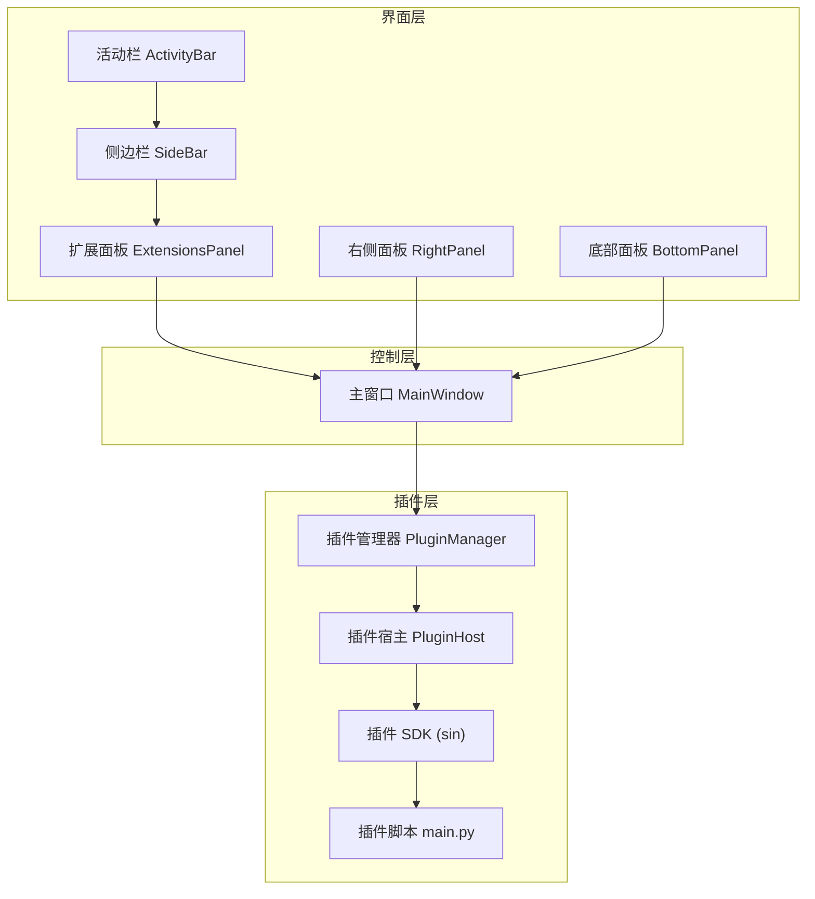
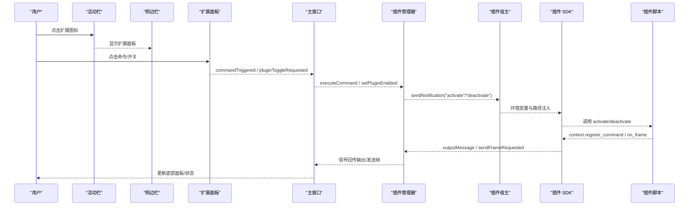
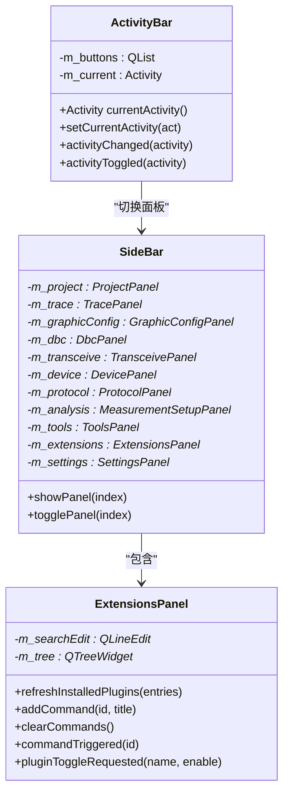
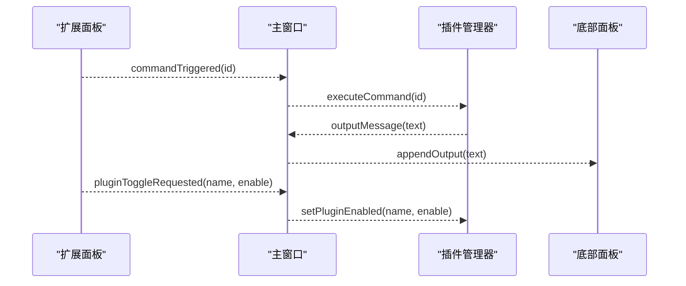
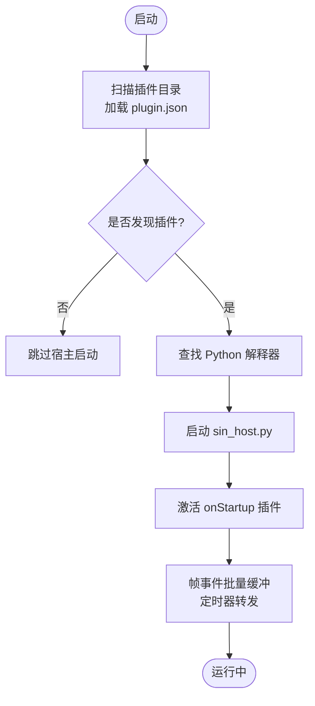
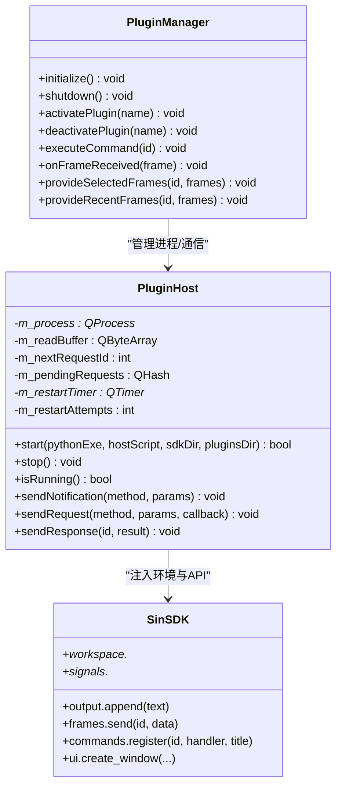
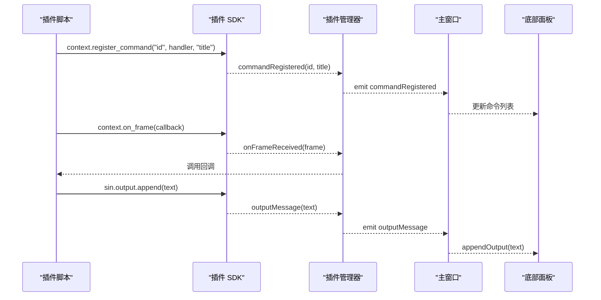
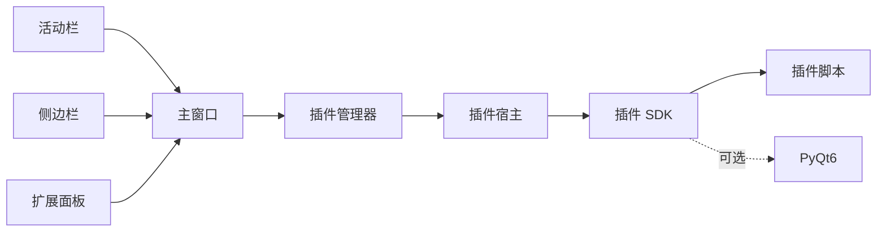

# 扩展面板系统

<cite>
**本文引用的文件**
- [README.md](file://README.md)
- [mainwindow.h](file://src/ui/mainwindow.h)
- [mainwindow.cpp](file://src/ui/mainwindow.cpp)
- [sidebarpanels.h](file://src/ui/panels/sidebarpanels.h)
- [sidebarpanels.cpp](file://src/ui/panels/sidebarpanels.cpp)
- [activitybar.h](file://src/ui/activitybar.h)
- [rightpanel.h](file://src/ui/rightpanel.h)
- [bottompanel.h](file://src/ui/bottompanel.h)
- [pluginmanager.h](file://src/core/plugin/pluginmanager.h)
- [pluginmanager.cpp](file://src/core/plugin/pluginmanager.cpp)
- [pluginhost.h](file://src/core/plugin/pluginhost.h)
- [__init__.py](file://sdk/sin/__init__.py)
- [frame-counter/main.py](file://plugins/frame-counter/main.py)
- [hello-world/main.py](file://plugins/hello-world/main.py)
- [ui-demo/main.py](file://plugins/ui-demo/main.py)
</cite>

## 目录
1. [简介](#简介)
2. [项目结构](#项目结构)
3. [核心组件](#核心组件)
4. [架构总览](#架构总览)
5. [详细组件分析](#详细组件分析)
6. [依赖关系分析](#依赖关系分析)
7. [性能考量](#性能考量)
8. [故障排查指南](#故障排查指南)
9. [结论](#结论)
10. [附录](#附录)

## 简介
本文件聚焦“扩展面板系统”，即基于 VS Code 风格的侧边栏与活动栏，结合插件管理器与 Python 宿主进程，为 sin 提供可扩展的 UI、命令与数据交互能力。该系统将主程序（Qt/C++）与插件生态（Python）解耦，通过 JSON-RPC 通信，实现插件发现、激活、命令执行、帧事件分发与 UI 窗口创建等能力。

## 项目结构
扩展面板系统涉及三层：
- 界面层：活动栏、侧边栏容器、扩展面板（ExtensionsPanel）、右侧面板、底部面板等
- 控制层：主窗口 MainWindow 负责装配、路由信号与状态管理
- 插件层：PluginManager + PluginHost 管理 Python 插件生命周期与消息分发；SDK 暴露给插件的 API

图表来源
- [activitybar.h:1-63](file://src/ui/activitybar.h#L1-L63)
- [sidebarpanels.h:394-435](file://src/ui/panels/sidebarpanels.h#L394-L435)
- [mainwindow.h:50-166](file://src/ui/mainwindow.h#L50-L166)
- [pluginmanager.h:17-89](file://src/core/plugin/pluginmanager.h#L17-L89)
- [pluginhost.h:13-95](file://src/core/plugin/pluginhost.h#L13-L95)
- [__init__.py:1-31](file://sdk/sin/__init__.py#L1-L31)

章节来源
- [README.md:17-88](file://README.md#L17-L88)
- [mainwindow.h:50-166](file://src/ui/mainwindow.h#L50-L166)
- [sidebarpanels.h:394-435](file://src/ui/panels/sidebarpanels.h#L394-L435)
- [pluginmanager.h:17-89](file://src/core/plugin/pluginmanager.h#L17-L89)
- [pluginhost.h:13-95](file://src/core/plugin/pluginhost.h#L13-L95)
- [__init__.py:1-31](file://sdk/sin/__init__.py#L1-L31)

## 核心组件
- 活动栏 ActivityBar：窄竖条功能入口，切换侧边栏面板并联动主标签页
- 侧边栏 SideBar：QStackedWidget 容器，承载工程、Trace、Graphic、DBC、收发、协议、工具、扩展、设置等面板
- 扩展面板 ExtensionsPanel：展示已安装插件、市场列表与命令，支持搜索与过滤
- 主窗口 MainWindow：组装 UI、连接信号槽、路由用户操作到对应服务或插件
- 插件管理器 PluginManager：单例，扫描插件、启动 Python 宿主、激活/停用插件、事件分发
- 插件宿主 PluginHost：QProcess 管理 Python 子进程，JSON-RPC over stdin/stdout，请求/响应回调与崩溃重启
- 插件 SDK sin：输出、帧发送、命令注册、工作区与信号等 API，供插件调用

章节来源
- [activitybar.h:1-63](file://src/ui/activitybar.h#L1-L63)
- [sidebarpanels.h:394-435](file://src/ui/panels/sidebarpanels.h#L394-L435)
- [sidebarpanels.h:344-391](file://src/ui/panels/sidebarpanels.h#L344-L391)
- [mainwindow.h:50-166](file://src/ui/mainwindow.h#L50-L166)
- [pluginmanager.h:17-89](file://src/core/plugin/pluginmanager.h#L17-L89)
- [pluginhost.h:13-95](file://src/core/plugin/pluginhost.h#L13-L95)
- [__init__.py:1-31](file://sdk/sin/__init__.py#L1-L31)

## 架构总览
扩展面板系统采用“界面—控制—插件”分层架构，通过信号/槽与 JSON-RPC 解耦。主窗口作为编排者，将用户操作映射到具体面板或服务；插件管理器负责插件生命周期与事件转发；插件宿主以独立进程运行，保证稳定性与隔离性。

图表来源
- [activitybar.h:1-63](file://src/ui/activitybar.h#L1-L63)
- [sidebarpanels.h:394-435](file://src/ui/panels/sidebarpanels.h#L394-L435)
- [sidebarpanels.h:344-391](file://src/ui/panels/sidebarpanels.h#L344-L391)
- [mainwindow.cpp:126-147](file://src/ui/mainwindow.cpp#L126-L147)
- [pluginmanager.cpp:145-183](file://src/core/plugin/pluginmanager.cpp#L145-L183)
- [pluginhost.h:44-57](file://src/core/plugin/pluginhost.h#L44-L57)
- [__init__.py:1-31](file://sdk/sin/__init__.py#L1-L31)

## 详细组件分析

### 活动栏与侧边栏
- 活动栏维护一组按钮与当前活动项，点击后通知侧边栏切换面板；再次点击同一按钮可隐藏侧边栏
- 侧边栏使用 QStackedWidget 承载多个面板，索引与活动栏枚举一致，便于统一切换
- 扩展面板是其中一个面板，用于展示插件与命令

图表来源
- [activitybar.h:1-63](file://src/ui/activitybar.h#L1-L63)
- [sidebarpanels.h:394-435](file://src/ui/panels/sidebarpanels.h#L394-L435)
- [sidebarpanels.h:344-391](file://src/ui/panels/sidebarpanels.h#L344-L391)

章节来源
- [activitybar.h:1-63](file://src/ui/activitybar.h#L1-L63)
- [sidebarpanels.h:394-435](file://src/ui/panels/sidebarpanels.h#L394-L435)
- [sidebarpanels.h:344-391](file://src/ui/panels/sidebarpanels.h#L344-L391)

### 主窗口与扩展面板集成
- 主窗口在构造时初始化插件管理器，并连接扩展面板的信号到插件管理器
- 当用户在扩展面板触发命令或启用/禁用插件时，主窗口将调用插件管理器的相应方法
- 同时，主窗口也订阅插件管理器发出的信号，将输出、帧发送请求等反馈到底部面板或业务逻辑

图表来源
- [mainwindow.cpp:126-147](file://src/ui/mainwindow.cpp#L126-L147)
- [pluginmanager.h:63-89](file://src/core/plugin/pluginmanager.h#L63-L89)

章节来源
- [mainwindow.cpp:126-147](file://src/ui/mainwindow.cpp#L126-L147)
- [pluginmanager.h:63-89](file://src/core/plugin/pluginmanager.h#L63-L89)

### 插件管理器与宿主进程
- 插件管理器负责扫描 plugins/ 目录，加载每个插件的 plugin.json，构建插件信息表
- initialize() 查找 Python 解释器，启动 sin_host.py 宿主进程，建立 JSON-RPC 通道
- 激活/停用插件通过 sendNotification 通知宿主；命令执行通过 executeCommand 下发
- 帧事件批量缓冲并通过定时器转发给已激活的 onFrame 插件，降低高频事件开销

图表来源
- [pluginmanager.cpp:123-183](file://src/core/plugin/pluginmanager.cpp#L123-L183)
- [pluginmanager.h:33-50](file://src/core/plugin/pluginmanager.h#L33-L50)

章节来源
- [pluginmanager.cpp:123-183](file://src/core/plugin/pluginmanager.cpp#L123-L183)
- [pluginmanager.h:33-50](file://src/core/plugin/pluginmanager.h#L33-L50)

### 插件宿主与 SDK
- 插件宿主通过 QProcess 管理 Python 子进程，使用 newline-delimited JSON 进行双向通信
- 支持请求/响应模式，维护待处理请求的回调映射，崩溃后指数退避重启
- SDK 暴露 output、frames、commands、workspace、signals 等接口；UI 模块可选（需 PyQt6）

图表来源
- [pluginhost.h:13-95](file://src/core/plugin/pluginhost.h#L13-L95)
- [pluginmanager.h:33-95](file://src/core/plugin/pluginmanager.h#L33-L95)
- [__init__.py:1-31](file://sdk/sin/__init__.py#L1-L31)

章节来源
- [pluginhost.h:13-95](file://src/core/plugin/pluginhost.h#L13-L95)
- [pluginmanager.h:33-95](file://src/core/plugin/pluginmanager.h#L33-L95)
- [__init__.py:1-31](file://sdk/sin/__init__.py#L1-L31)

### 示例插件
- hello-world：最简示例，激活时输出欢迎消息，注册命令并在底部面板输出问候
- frame-counter：演示 onFrame 事件，统计总帧数与 ID 分布，提供报告命令
- ui-demo：演示创建独立窗口，发送帧、订阅帧、注册命令，需要 PyQt6

图表来源
- [hello-world/main.py:11-24](file://plugins/hello-world/main.py#L11-L24)
- [frame-counter/main.py:16-54](file://plugins/frame-counter/main.py#L16-L54)
- [ui-demo/main.py:15-106](file://plugins/ui-demo/main.py#L15-L106)
- [pluginmanager.h:63-89](file://src/core/plugin/pluginmanager.h#L63-L89)

章节来源
- [hello-world/main.py:11-24](file://plugins/hello-world/main.py#L11-L24)
- [frame-counter/main.py:16-54](file://plugins/frame-counter/main.py#L16-L54)
- [ui-demo/main.py:15-106](file://plugins/ui-demo/main.py#L15-L106)
- [pluginmanager.h:63-89](file://src/core/plugin/pluginmanager.h#L63-L89)

## 依赖关系分析
- 界面层依赖控制层：活动栏与侧边栏由主窗口装配，扩展面板通过信号与主窗口交互
- 控制层依赖插件层：主窗口连接插件管理器信号，路由命令与插件开关
- 插件层内部依赖：插件管理器依赖插件宿主；宿主通过 SDK 与插件脚本交互
- 外部依赖：Python 解释器、PyQt6（可选，用于 UI 演示插件）

图表来源
- [activitybar.h:1-63](file://src/ui/activitybar.h#L1-L63)
- [sidebarpanels.h:394-435](file://src/ui/panels/sidebarpanels.h#L394-L435)
- [mainwindow.cpp:126-147](file://src/ui/mainwindow.cpp#L126-L147)
- [pluginmanager.cpp:145-183](file://src/core/plugin/pluginmanager.cpp#L145-L183)
- [pluginhost.h:13-95](file://src/core/plugin/pluginhost.h#L13-L95)
- [__init__.py:1-31](file://sdk/sin/__init__.py#L1-L31)

章节来源
- [mainwindow.cpp:126-147](file://src/ui/mainwindow.cpp#L126-L147)
- [pluginmanager.cpp:145-183](file://src/core/plugin/pluginmanager.cpp#L145-L183)
- [pluginhost.h:13-95](file://src/core/plugin/pluginhost.h#L13-L95)
- [__init__.py:1-31](file://sdk/sin/__init__.py#L1-L31)

## 性能考量
- 帧事件批量缓冲：插件管理器对 onFrame 事件进行缓冲，按定时器批量转发，避免每帧触发导致的 UI 卡顿
- 插件隔离：Python 宿主独立进程，崩溃不影响主程序稳定性
- 按需加载：仅当存在 onFrame 插件时才缓冲帧，减少无谓开销
- UI 刷新节流：底部面板输出与命令列表更新应适度节流，避免频繁重绘

章节来源
- [pluginmanager.cpp:178-183](file://src/core/plugin/pluginmanager.cpp#L178-L183)
- [pluginmanager.cpp:283-297](file://src/core/plugin/pluginmanager.cpp#L283-L297)

## 故障排查指南
- 插件未生效
  - 检查插件目录是否存在、plugin.json 是否有效
  - 确认 Python 解释器路径正确且可执行
  - 查看底部面板输出，定位宿主启动失败或激活失败原因
- 命令不显示
  - 确认插件已激活且成功注册命令
  - 检查主窗口是否正确连接 commandRegistered 信号并更新命令列表
- 帧事件未触发
  - 确认至少有一个插件声明 onFrame
  - 检查帧事件是否被批量缓冲与定时转发
- 宿主崩溃
  - 观察是否触发 hostCrashed 信号
  - 确认自动重启机制是否按预期工作

章节来源
- [pluginmanager.cpp:123-183](file://src/core/plugin/pluginmanager.cpp#L123-L183)
- [pluginmanager.cpp:283-297](file://src/core/plugin/pluginmanager.cpp#L283-L297)
- [pluginhost.h:59-70](file://src/core/plugin/pluginhost.h#L59-L70)

## 结论
扩展面板系统通过清晰的层次划分与稳定的进程隔离，实现了插件生态的可插拔与可扩展。活动栏与侧边栏提供统一的入口与导航，主窗口负责编排与路由，插件管理器与宿主承担生命周期管理与消息分发。该设计既保证了主程序的稳定性，又为后续功能扩展提供了灵活的基础设施。

## 附录
- 快速上手
  - 在 plugins/ 下新增插件目录，编写 main.py 与 plugin.json
  - 激活插件后，可在扩展面板查看命令并执行
  - 使用 sin.output 输出日志，使用 sin.frames 发送帧，使用 context.register_command 注册命令
- 参考示例
  - hello-world：最小可用插件
  - frame-counter：帧统计与报告
  - ui-demo：独立窗口与 PyQt6 集成

章节来源
- [hello-world/main.py:11-24](file://plugins/hello-world/main.py#L11-L24)
- [frame-counter/main.py:16-54](file://plugins/frame-counter/main.py#L16-L54)
- [ui-demo/main.py:15-106](file://plugins/ui-demo/main.py#L15-L106)
- [__init__.py:1-31](file://sdk/sin/__init__.py#L1-L31)