# 扩展面板系统

<cite>
**本文引用的文件**
- [README.md](file://README.md)
- [mainwindow.h](file://src/ui/mainwindow.h)
- [mainwindow.cpp](file://src/ui/mainwindow.cpp)
- [sidebarpanels.h](file://src/ui/panels/sidebarpanels.h)
- [sidebarpanels.cpp](file://src/ui/panels/sidebarpanels.cpp)
- [activitybar.h](file://src/ui/activitybar.h)
- [rightpanel.h](file://src/ui/rightpanel.h)
- [bottompanel.h](file://src/ui/bottompanel.h)
- [pluginmanager.h](file://src/core/plugin/pluginmanager.h)
- [pluginmanager.cpp](file://src/core/plugin/pluginmanager.cpp)
- [pluginhost.h](file://src/core/plugin/pluginhost.h)
- [extensionstab.h](file://src/ui/extensionstab.h)
- [extensionstab.cpp](file://src/ui/extensionstab.cpp)
- [adddevicetab.h](file://src/ui/adddevicetab.h)
- [adddevicetab.cpp](file://src/ui/adddevicetab.cpp)
- [marketindex.h](file://src/core/driver/marketindex.h)
- [marketindex.cpp](file://src/core/driver/marketindex.cpp)
- [driverregistry.h](file://src/core/driver/driverregistry.h)
- [driverregistry.cpp](file://src/core/driver/driverregistry.cpp)
- [__init__.py](file://sdk/sin/__init__.py)
- [frame-counter/main.py](file://plugins/frame-counter/main.py)
- [hello-world/main.py](file://plugins/hello-world/main.py)
- [ui-demo/main.py](file://plugins/ui-demo/main.py)
</cite>

## 更新摘要
**所做更改**
- 新增"新增设备"标签页功能，提供完整的驱动市场浏览、搜索、安装和管理界面
- 集成设备市场索引系统，支持在线驱动包下载和离线安装
- 增强驱动注册表功能，支持热加载和动态管理
- 更新侧边栏架构以包含新的设备管理功能
- 完善驱动生命周期管理和用户交互流程

## 目录
1. [简介](#简介)
2. [项目结构](#项目结构)
3. [核心组件](#核心组件)
4. [架构总览](#架构总览)
5. [详细组件分析](#详细组件分析)
6. [依赖关系分析](#依赖关系分析)
7. [性能考量](#性能考量)
8. [故障排查指南](#故障排查指南)
9. [结论](#结论)
10. [附录](#附录)

## 简介
本文件聚焦"扩展面板系统"，即基于侧边栏与活动栏的插件管理系统，结合插件管理器与 Python 宿主进程，为 sin 提供可扩展的 UI、命令与数据交互能力。该系统将主程序（Qt/C++）与插件生态（Python）解耦，通过 JSON-RPC 通信，实现插件发现、手动激活、命令执行、帧事件分发与 UI 窗口创建等能力。**当前版本采用简化的插件架构，移除了复杂的 VS Code 扩展生态系统，专注于核心的插件管理和手动激活机制，并新增了完整的设备驱动管理系统**。

## 项目结构
扩展面板系统涉及四层：
- 界面层：活动栏、侧边栏容器、扩展面板、新增设备标签页、右侧面板、底部面板等
- 控制层：主窗口 MainWindow 负责装配、路由信号与状态管理
- 插件层：PluginManager + PluginHost 管理 Python 插件生命周期与消息分发；SDK 暴露给插件的 API
- 驱动层：DriverRegistry + MarketIndex 管理设备驱动的发现、安装、配置和生命周期

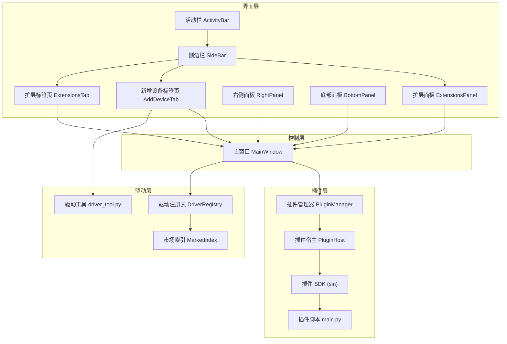

**图表来源**
- [activitybar.h:1-63](file://src/ui/activitybar.h#L1-L63)
- [sidebarpanels.h:394-435](file://src/ui/panels/sidebarpanels.h#L394-L435)
- [adddevicetab.h:22-32](file://src/ui/adddevicetab.h#L22-L32)
- [extensionstab.h:13-77](file://src/ui/extensionstab.h#L13-L77)
- [mainwindow.h:50-166](file://src/ui/mainwindow.h#L50-L166)
- [pluginmanager.h:17-89](file://src/core/plugin/pluginmanager.h#L17-L89)
- [pluginhost.h:13-95](file://src/core/plugin/pluginhost.h#L13-95)
- [marketindex.h:13-22](file://src/core/driver/marketindex.h#L13-L22)
- [driverregistry.h:15-27](file://src/core/driver/driverregistry.h#L15-L27)
- [__init__.py:1-31](file://sdk/sin/__init__.py#L1-L31)

**章节来源**
- [README.md:17-88](file://README.md#L17-L88)
- [mainwindow.h:50-166](file://src/ui/mainwindow.h#L50-L166)
- [sidebarpanels.h:394-435](file://src/ui/panels/sidebarpanels.h#L394-L435)
- [adddevicetab.h:22-32](file://src/ui/adddevicetab.h#L22-L32)
- [extensionstab.h:13-77](file://src/ui/extensionstab.h#L13-L77)
- [pluginmanager.h:17-89](file://src/core/plugin/pluginmanager.h#L17-L89)
- [pluginhost.h:13-95](file://src/core/plugin/pluginhost.h#L13-95)
- [marketindex.h:13-22](file://src/core/driver/marketindex.h#L13-L22)
- [driverregistry.h:15-27](file://src/core/driver/driverregistry.h#L15-L27)
- [__init__.py:1-31](file://sdk/sin/__init__.py#L1-L31)

## 核心组件
- 活动栏 ActivityBar：窄竖条功能入口，切换侧边栏面板并联动主标签页
- 侧边栏 SideBar：QStackedWidget 容器，承载工程、Trace、Graphic、DBC、收发、协议、工具、扩展、设置等面板
- 扩展面板 ExtensionsPanel：展示已安装插件、市场列表与命令，支持搜索、过滤与双击激活
- **新增设备标签页 AddDeviceTab：设备市场浏览、搜索、图文详情、驱动安装和已安装驱动管理的完整界面**
- 扩展标签页 ExtensionsTab：详细的插件管理中心，显示宿主进程资源信息和插件状态表格
- 主窗口 MainWindow：组装 UI、连接信号槽、路由用户操作到对应服务或插件
- 插件管理器 PluginManager：单例，扫描插件、启动 Python 宿主、手动激活/停用插件、事件分发
- 插件宿主 PluginHost：QProcess 管理 Python 子进程，JSON-RPC over stdin/stdout，请求/响应回调与崩溃重启
- **驱动注册表 DriverRegistry：内置和外置驱动的装配、枚举、创建设备实例和生命周期管理**
- **市场索引 MarketIndex：设备市场索引的加载、检索和 URL 解析**
- 插件 SDK sin：输出、帧发送、命令注册、工作区与信号等 API，供插件调用

**章节来源**
- [activitybar.h:1-63](file://src/ui/activitybar.h#L1-L63)
- [sidebarpanels.h:394-435](file://src/ui/panels/sidebarpanels.h#L394-L435)
- [sidebarpanels.h:344-391](file://src/ui/panels/sidebarpanels.h#L344-L391)
- [adddevicetab.h:22-32](file://src/ui/adddevicetab.h#L22-L32)
- [extensionstab.h:13-77](file://src/ui/extensionstab.h#L13-L77)
- [mainwindow.h:50-166](file://src/ui/mainwindow.h#L50-L166)
- [pluginmanager.h:17-89](file://src/core/plugin/pluginmanager.h#L17-L89)
- [pluginhost.h:13-95](file://src/core/plugin/pluginhost.h#L13-95)
- [driverregistry.h:15-27](file://src/core/driver/driverregistry.h#L15-L27)
- [marketindex.h:13-22](file://src/core/driver/marketindex.h#L13-L22)
- [__init__.py:1-31](file://sdk/sin/__init__.py#L1-L31)

## 架构总览
扩展面板系统采用"界面—控制—插件—驱动"分层架构，通过信号/槽与 JSON-RPC 解耦。主窗口作为编排者，将用户操作映射到具体面板或服务；插件管理器负责插件生命周期与事件转发；插件宿主以独立进程运行，保证稳定性与隔离性；驱动注册表统一管理设备驱动的发现和安装。**当前版本采用简化的插件架构，移除了复杂的 VS Code 扩展生态系统，专注于核心的插件管理和手动激活机制，并集成了完整的设备驱动管理系统**。

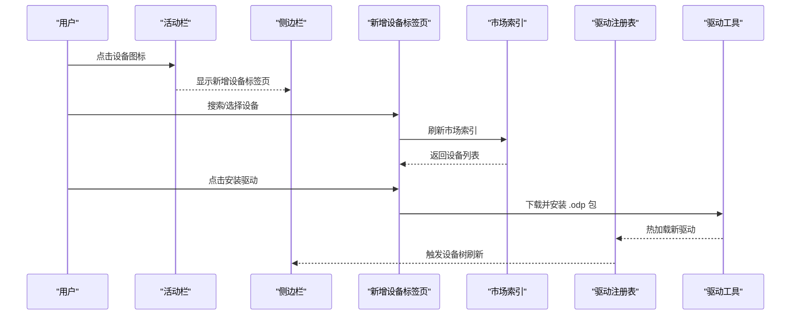

**图表来源**
- [activitybar.h:1-63](file://src/ui/activitybar.h#L1-L63)
- [sidebarpanels.h:394-435](file://src/ui/panels/sidebarpanels.h#L394-L435)
- [adddevicetab.h:22-32](file://src/ui/adddevicetab.h#L22-L32)
- [marketindex.h:13-22](file://src/core/driver/marketindex.h#L13-L22)
- [driverregistry.h:15-27](file://src/core/driver/driverregistry.h#L15-L27)
- [adddevicetab.cpp:505-566](file://src/ui/adddevicetab.cpp#L505-L566)
- [adddevicetab.cpp:838-894](file://src/ui/adddevicetab.cpp#L838-L894)

## 详细组件分析

### 活动栏与侧边栏
- 活动栏维护一组按钮与当前活动项，点击后通知侧边栏切换面板；再次点击同一按钮可隐藏侧边栏
- 侧边栏使用 QStackedWidget 承载多个面板，索引与活动栏枚举一致，便于统一切换
- 扩展面板是其中一个面板，用于展示插件与命令，支持双击激活插件
- **新增设备标签页作为侧边栏的重要面板，提供设备驱动的完整管理功能**

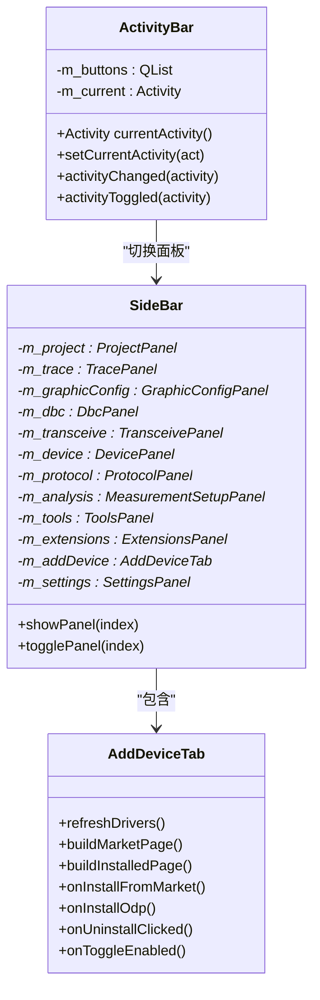

**图表来源**
- [activitybar.h:1-63](file://src/ui/activitybar.h#L1-L63)
- [sidebarpanels.h:394-435](file://src/ui/panels/sidebarpanels.h#L394-L435)
- [sidebarpanels.h:344-391](file://src/ui/panels/sidebarpanels.h#L344-L391)
- [adddevicetab.h:33-83](file://src/ui/adddevicetab.h#L33-L83)

**章节来源**
- [activitybar.h:1-63](file://src/ui/activitybar.h#L1-L63)
- [sidebarpanels.h:394-435](file://src/ui/panels/sidebarpanels.h#L394-L435)
- [sidebarpanels.h:344-391](file://src/ui/panels/sidebarpanels.h#L344-L391)
- [adddevicetab.h:33-83](file://src/ui/adddevicetab.h#L33-L83)

### 新增设备标签页功能
**新增设备标签页提供了完整的设备驱动管理功能：**

- **双视图设计**：顶部切换按钮在"市场"和"已安装"两个视图间切换
- **设备市场浏览**：支持搜索设备型号、厂商、关键词的多词 AND 匹配
- **图文详情展示**：显示设备主图、规格表、Markdown 介绍、驱动包信息
- **驱动安装流程**：下载 .odp 包 → sha256 校验 → 确认弹窗 → 安装 → 热加载
- **已安装驱动管理**：显示驱动列表、详细信息、支持的设备型号表
- **驱动操作**：支持禁用/启用、卸载外置驱动、从 .odp 离线安装

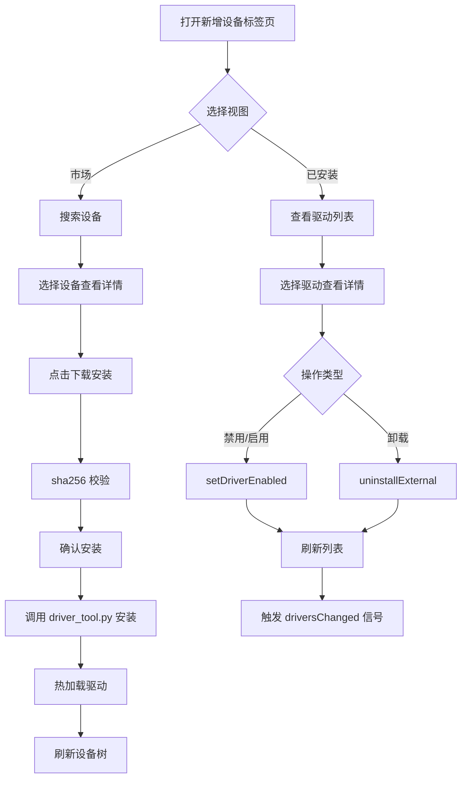

**图表来源**
- [adddevicetab.cpp:105-169](file://src/ui/adddevicetab.cpp#L105-L169)
- [adddevicetab.cpp:175-263](file://src/ui/adddevicetab.cpp#L175-L263)
- [adddevicetab.cpp:505-566](file://src/ui/adddevicetab.cpp#L505-L566)
- [adddevicetab.cpp:593-669](file://src/ui/adddevicetab.cpp#L593-L669)
- [adddevicetab.cpp:838-894](file://src/ui/adddevicetab.cpp#L838-L894)

**章节来源**
- [adddevicetab.h:22-32](file://src/ui/adddevicetab.h#L22-L32)
- [adddevicetab.cpp:105-169](file://src/ui/adddevicetab.cpp#L105-L169)
- [adddevicetab.cpp:175-263](file://src/ui/adddevicetab.cpp#L175-L263)
- [adddevicetab.cpp:505-566](file://src/ui/adddevicetab.cpp#L505-L566)
- [adddevicetab.cpp:593-669](file://src/ui/adddevicetab.cpp#L593-L669)
- [adddevicetab.cpp:838-894](file://src/ui/adddevicetab.cpp#L838-L894)

### 市场索引系统
**市场索引系统负责设备市场的加载、检索和 URL 解析：**

- **双索引结构**：同时管理驱动条目（drivers）和设备条目（devices）
- **异步加载**：通过网络或本地文件加载 market.json，完成后发出 loaded 信号
- **多词搜索**：支持型号、厂商、摘要、标签、keywords 的 AND 匹配
- **URL 解析**：相对路径自动解析为绝对 URL，支持开发/发布环境
- **图片缓存**：设备图片下载到 AppData/market-cache 目录，提升加载速度

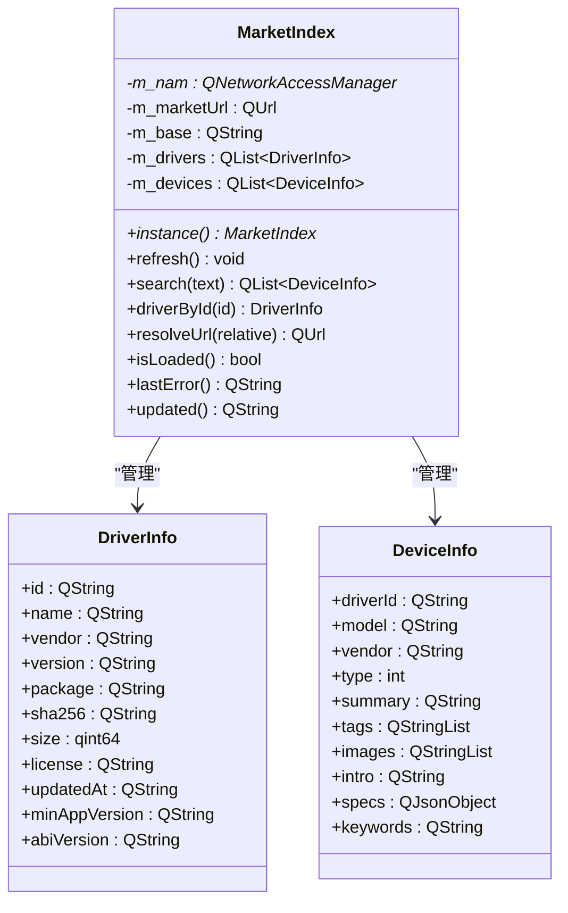

**图表来源**
- [marketindex.h:13-96](file://src/core/driver/marketindex.h#L13-L96)
- [marketindex.cpp:41-185](file://src/core/driver/marketindex.cpp#L41-L185)

**章节来源**
- [marketindex.h:13-96](file://src/core/driver/marketindex.h#L13-L96)
- [marketindex.cpp:41-185](file://src/core/driver/marketindex.cpp#L41-L185)

### 驱动注册表系统
**驱动注册表系统统一管理内置和外置设备驱动：**

- **内置驱动支持**：ZLG、PEAK、Kvaser 等厂商驱动静态编译，零安装开箱可用
- **外置驱动管理**：扫描 <应用目录>/drivers/<id> 目录，加载 driver.json 清单
- **安全验证**：sha256 校验、ABI/架构预检、版本兼容性检查
- **热加载支持**：安装新驱动后无需重启即可生效
- **驱动禁用**：支持运行时禁用驱动，持久化配置到 disabled.json
- **设备工厂**：按 driverId 创建设备实例，外置优先于内置

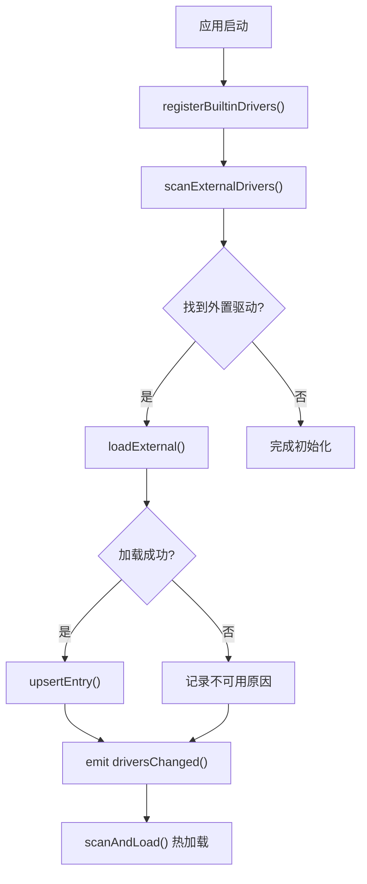

**图表来源**
- [driverregistry.h:15-110](file://src/core/driver/driverregistry.h#L15-L110)
- [driverregistry.cpp](file://src/core/driver/driverregistry.cpp)

**章节来源**
- [driverregistry.h:15-110](file://src/core/driver/driverregistry.h#L15-L110)

### 主窗口与新增设备标签页集成
- 主窗口在构造时初始化插件管理器和驱动注册表
- 新增设备标签页通过信号与主窗口交互，驱动安装成功后触发设备树刷新
- 主窗口订阅驱动注册表的 driversChanged 信号，同步更新设备面板

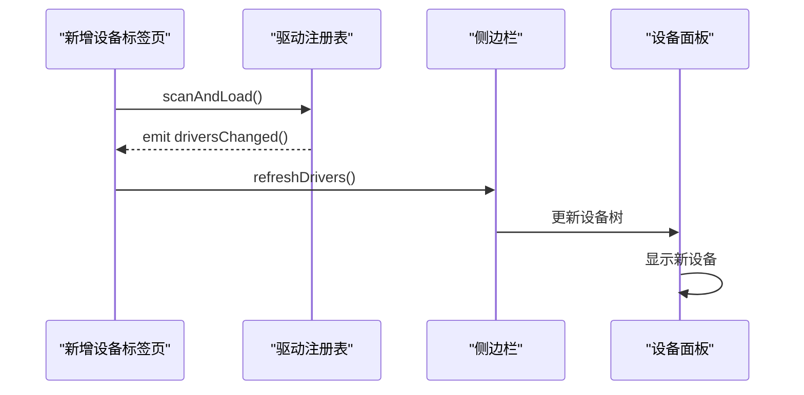

**图表来源**
- [adddevicetab.cpp:838-894](file://src/ui/adddevicetab.cpp#L838-L894)
- [driverregistry.h:86-88](file://src/core/driver/driverregistry.h#L86-L88)

**章节来源**
- [adddevicetab.cpp:838-894](file://src/ui/adddevicetab.cpp#L838-L894)
- [driverregistry.h:86-88](file://src/core/driver/driverregistry.h#L86-L88)

### 插件管理器与宿主进程
- 插件管理器负责扫描 plugins/ 目录，加载每个插件的 plugin.json，构建插件信息表
- initialize() 查找 Python 解释器，启动 sin_host.py 宿主进程，建立 JSON-RPC 通道
- 插件不再自动激活，由用户通过双击操作手动触发激活
- 激活/停用插件通过 sendNotification 通知宿主；命令执行通过 executeCommand 下发
- 新增 reactivatePlugin() 方法支持重新激活已存在的插件，先停用再激活
- 新增 isPluginActivated() 方法用于跟踪插件激活状态
- 帧事件批量缓冲并通过定时器转发给已激活的 onFrame 插件，降低高频事件开销

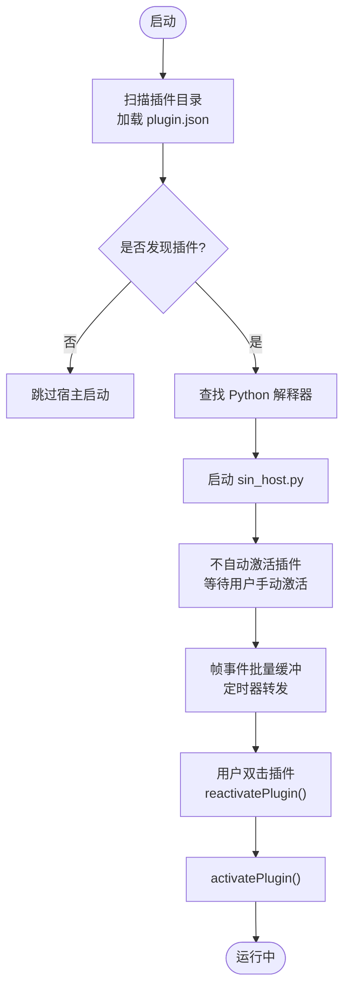

**图表来源**
- [pluginmanager.cpp:123-183](file://src/core/plugin/pluginmanager.cpp#L123-L183)
- [pluginmanager.h:33-50](file://src/core/plugin/pluginmanager.h#L33-L50)

**章节来源**
- [pluginmanager.cpp:123-183](file://src/core/plugin/pluginmanager.cpp#L123-L183)
- [pluginmanager.h:33-50](file://src/core/plugin/pluginmanager.h#L33-L50)

### 插件宿主与 SDK
- 插件宿主通过 QProcess 管理 Python 子进程，使用 newline-delimited JSON 进行双向通信
- 支持请求/响应模式，维护待处理请求的回调映射，崩溃后指数退避重启
- SDK 暴露 output、frames、commands、workspace、signals 等接口；UI 模块可选（需 PyQt6）

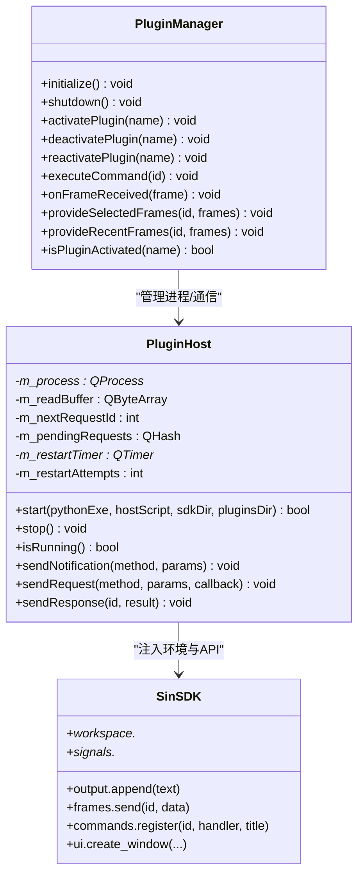

**图表来源**
- [pluginhost.h:13-95](file://src/core/plugin/pluginhost.h#L13-95)
- [pluginmanager.h:33-95](file://src/core/plugin/pluginmanager.h#L33-95)
- [__init__.py:1-31](file://sdk/sin/__init__.py#L1-L31)

**章节来源**
- [pluginhost.h:13-95](file://src/core/plugin/pluginhost.h#L13-95)
- [pluginmanager.h:33-95](file://src/core/plugin/pluginmanager.h#L33-95)
- [__init__.py:1-31](file://sdk/sin/__init__.py#L1-L31)

### 示例插件
- hello-world：最简示例，激活时输出欢迎消息，注册命令并在底部面板输出问候
- frame-counter：演示 onFrame 事件，统计总帧数与 ID 分布，提供报告命令
- ui-demo：演示创建独立窗口，发送帧、订阅帧、注册命令，需要 PyQt6

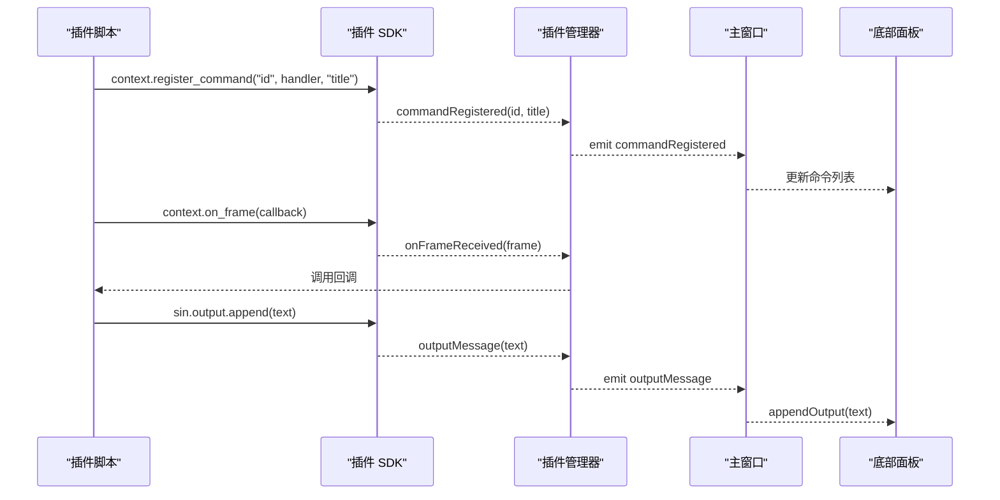

**图表来源**
- [hello-world/main.py:11-24](file://plugins/hello-world/main.py#L11-L24)
- [frame-counter/main.py:16-54](file://plugins/frame-counter/main.py#L16-L54)
- [ui-demo/main.py:15-106](file://plugins/ui-demo/main.py#L15-L106)
- [pluginmanager.h:63-89](file://src/core/plugin/pluginmanager.h#L63-L89)

**章节来源**
- [hello-world/main.py:11-24](file://plugins/hello-world/main.py#L11-L24)
- [frame-counter/main.py:16-54](file://plugins/frame-counter/main.py#L16-L54)
- [ui-demo/main.py:15-106](file://plugins/ui-demo/main.py#L15-L106)
- [pluginmanager.h:63-89](file://src/core/plugin/pluginmanager.h#L63-L89)

### 扩展面板用户体验改进
**新增功能**：
- **双击激活支持**：用户在扩展面板中双击插件项即可激活插件
- **视觉状态指示器**：运行时显示绿色"● 运行中"状态标识
- **改进的插件列表**：更好的布局和信息展示
- **手动激活机制**：插件不再自动启动，需要用户明确操作
- **扩展标签页**：提供详细的插件管理界面和资源监控

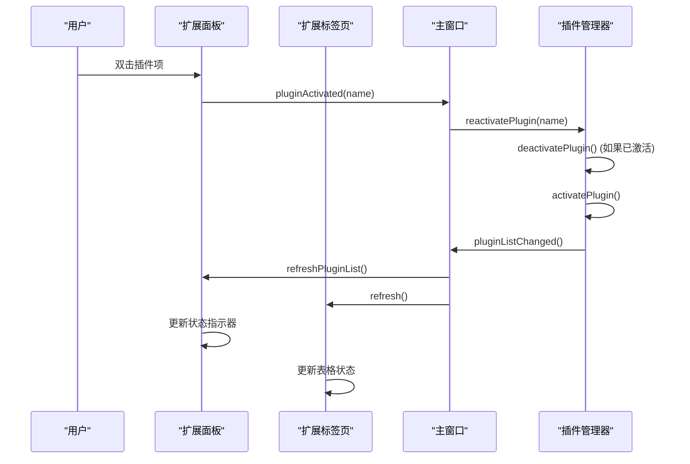

**章节来源**
- [sidebarpanels.cpp:1180-1250](file://src/ui/panels/sidebarpanels.cpp#L1180-L1250)
- [sidebarpanels.cpp:1271-1333](file://src/ui/panels/sidebarpanels.cpp#L1271-L1333)
- [sidebarpanels.cpp:1394-1406](file://src/ui/panels/sidebarpanels.cpp#L1394-L1406)
- [extensionstab.cpp:328-425](file://src/ui/extensionstab.cpp#L328-L425)
- [mainwindow.cpp:135-152](file://src/ui/mainwindow.cpp#L135-L152)
- [pluginmanager.cpp:231-242](file://src/core/plugin/pluginmanager.cpp#L231-L242)

### 扩展标签页功能
扩展标签页提供了更详细的插件管理界面：
- **插件状态表格**：显示插件名称、版本、作者、描述、状态和操作按钮
- **交互式操作**：支持双击激活、按钮操作等方式管理插件
- **插件包管理**：支持 .opk 插件包的安装和卸载
- **右键菜单**：提供卸载插件等快捷操作

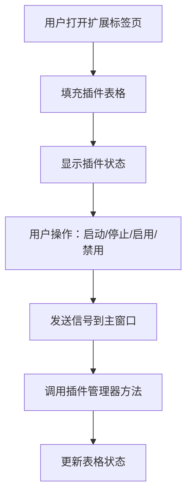

**图表来源**
- [extensionstab.cpp:38-51](file://src/ui/extensionstab.cpp#L38-L51)
- [extensionstab.cpp:174-191](file://src/ui/extensionstab.cpp#L174-L191)
- [extensionstab.cpp:211-326](file://src/ui/extensionstab.cpp#L211-L326)
- [extensionstab.cpp:328-425](file://src/ui/extensionstab.cpp#L328-L425)

**章节来源**
- [extensionstab.h:13-77](file://src/ui/extensionstab.h#L13-L77)
- [extensionstab.cpp:38-51](file://src/ui/extensionstab.cpp#L38-L51)
- [extensionstab.cpp:174-191](file://src/ui/extensionstab.cpp#L174-L191)
- [extensionstab.cpp:211-326](file://src/ui/extensionstab.cpp#L211-L326)
- [extensionstab.cpp:328-425](file://src/ui/extensionstab.cpp#L328-L425)

## 依赖关系分析
- 界面层依赖控制层：活动栏与侧边栏由主窗口装配，扩展面板和新增设备标签页通过信号与主窗口交互
- 控制层依赖插件层和驱动层：主窗口连接插件管理器信号，路由命令与插件开关；连接驱动注册表信号，同步设备面板
- 插件层内部依赖：插件管理器依赖插件宿主；宿主通过 SDK 与插件脚本交互
- 驱动层内部依赖：新增设备标签页依赖市场索引和驱动注册表；驱动注册表管理内置和外置驱动
- 外部依赖：Python 解释器、PyQt6（可选，用于 UI 演示插件）、网络访问（市场下载）

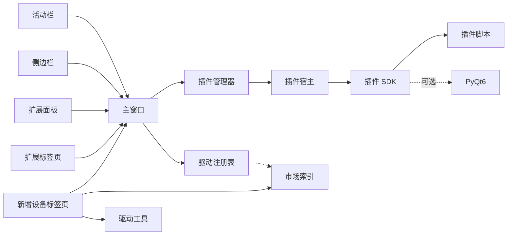

**图表来源**
- [activitybar.h:1-63](file://src/ui/activitybar.h#L1-L63)
- [sidebarpanels.h:394-435](file://src/ui/panels/sidebarpanels.h#L394-L435)
- [adddevicetab.h:22-32](file://src/ui/adddevicetab.h#L22-L32)
- [extensionstab.h:13-77](file://src/ui/extensionstab.h#L13-L77)
- [mainwindow.cpp:126-147](file://src/ui/mainwindow.cpp#L126-L147)
- [pluginmanager.cpp:145-183](file://src/core/plugin/pluginmanager.cpp#L145-L183)
- [pluginhost.h:13-95](file://src/core/plugin/pluginhost.h#L13-95)
- [marketindex.h:13-22](file://src/core/driver/marketindex.h#L13-L22)
- [driverregistry.h:15-27](file://src/core/driver/driverregistry.h#L15-L27)
- [__init__.py:1-31](file://sdk/sin/__init__.py#L1-L31)

**章节来源**
- [mainwindow.cpp:126-147](file://src/ui/mainwindow.cpp#L126-L147)
- [pluginmanager.cpp:145-183](file://src/core/plugin/pluginmanager.cpp#L145-L183)
- [pluginhost.h:13-95](file://src/core/plugin/pluginhost.h#L13-95)
- [marketindex.h:13-22](file://src/core/driver/marketindex.h#L13-L22)
- [driverregistry.h:15-27](file://src/core/driver/driverregistry.h#L15-L27)
- [__init__.py:1-31](file://sdk/sin/__init__.py#L1-L31)

## 性能考量
- 帧事件批量缓冲：插件管理器对 onFrame 事件进行缓冲，按定时器批量转发，避免每帧触发导致的 UI 卡顿
- 插件隔离：Python 宿主独立进程，崩溃不影响主程序稳定性
- 按需加载：仅当存在 onFrame 插件时才缓冲帧，减少无谓开销
- UI 刷新节流：底部面板输出与命令列表更新应适度节流，避免频繁重绘
- 手动激活优化：插件延迟激活减少启动时的资源消耗
- 资源监控：扩展标签页提供宿主进程的实时监控，帮助诊断性能问题
- **市场索引缓存：设备图片下载到本地缓存，减少重复网络请求**
- **驱动热加载：新驱动安装后立即生效，无需重启应用程序**
- **异步网络操作：市场索引加载、驱动包下载均采用异步方式，避免阻塞 UI**

**章节来源**
- [pluginmanager.cpp:178-183](file://src/core/plugin/pluginmanager.cpp#L178-L183)
- [pluginmanager.cpp:283-297](file://src/core/plugin/pluginmanager.cpp#L283-L297)
- [extensionstab.cpp:211-326](file://src/ui/extensionstab.cpp#L211-L326)
- [adddevicetab.cpp:442-503](file://src/ui/adddevicetab.cpp#L442-L503)
- [marketindex.cpp:71-79](file://src/core/driver/marketindex.cpp#L71-L79)

## 故障排查指南
- 插件未生效
  - 检查插件目录是否存在、plugin.json 是否有效
  - 确认 Python 解释器路径正确且可执行
  - 确认用户已通过双击激活插件
  - 查看底部面板输出，定位宿主启动失败或激活失败原因
- 命令不显示
  - 确认插件已激活且成功注册命令
  - 检查主窗口是否正确连接 commandRegistered 信号并更新命令列表
- 帧事件未触发
  - 确认至少有一个插件声明 onFrame
  - 检查帧事件是否被批量缓冲与定时转发
- 宿主崩溃
  - 观察是否触发 hostCrashed 信号
  - 确认自动重启机制是否按预期工作
- 资源占用过高
  - 使用扩展标签页监控宿主进程的 CPU、内存、磁盘 I/O
  - 检查是否有插件在处理大量数据或频繁触发事件
- **设备驱动相关问题**
  - 检查市场索引是否正常加载，确认网络连接状态
  - 验证驱动包的 sha256 校验是否通过
  - 确认 Python 解释器可正常执行 driver_tool.py
  - 查看驱动注册表日志，定位驱动加载失败原因
  - 检查驱动是否被禁用或卸载

**章节来源**
- [pluginmanager.cpp:123-183](file://src/core/plugin/pluginmanager.cpp#L123-L183)
- [pluginmanager.cpp:283-297](file://src/core/plugin/pluginmanager.cpp#L283-L297)
- [pluginhost.h:59-70](file://src/core/plugin/pluginhost.h#L59-L70)
- [extensionstab.cpp:211-326](file://src/ui/extensionstab.cpp#L211-L326)
- [adddevicetab.cpp:838-894](file://src/ui/adddevicetab.cpp#L838-L894)
- [marketindex.cpp:81-148](file://src/core/driver/marketindex.cpp#L81-L148)

## 结论
扩展面板系统通过清晰的层次划分与稳定的进程隔离，实现了插件生态的可插拔与可扩展。**当前版本采用简化的插件架构，移除了复杂的 VS Code 扩展生态系统，专注于核心的插件管理和手动激活机制，并集成了完整的设备驱动管理系统**。通过引入手动激活机制、增强的状态跟踪和改进的用户界面体验，进一步提升了系统的稳定性和用户体验。活动栏与侧边栏提供统一的入口与导航，主窗口负责编排与路由，插件管理器与宿主承担生命周期管理与消息分发，新增设备标签页提供完整的驱动管理功能。该设计既保证了主程序的稳定性，又为后续功能扩展提供了灵活的基础设施。

## 附录
- 快速上手
  - 在 plugins/ 下新增插件目录，编写 main.py 与 plugin.json
  - 激活插件：在扩展面板中双击插件项
  - 可在扩展面板查看命令并执行
  - 使用 sin.output 输出日志，使用 sin.frames 发送帧，使用 context.register_command 注册命令
- 参考示例
  - hello-world：最小可用插件
  - frame-counter：帧统计与报告
  - ui-demo：独立窗口与 PyQt6 集成
- 扩展标签页使用
  - 打开扩展标签页查看详细的插件管理界面
  - 通过表格中的按钮管理插件状态
  - 支持 .opk 插件包的安装和卸载
- **新增设备标签页使用**
  - 打开新增设备标签页浏览设备市场
  - 使用搜索功能查找特定设备型号
  - 查看设备图文详情和规格参数
  - 一键安装驱动包，支持离线安装
  - 管理已安装驱动：禁用/启用、卸载等操作
  - 通过设备树查看新安装的驱动设备

**章节来源**
- [hello-world/main.py:11-24](file://plugins/hello-world/main.py#L11-L24)
- [frame-counter/main.py:16-54](file://plugins/frame-counter/main.py#L16-L54)
- [ui-demo/main.py:15-106](file://plugins/ui-demo/main.py#L15-L106)
- [__init__.py:1-31](file://sdk/sin/__init__.py#L1-L31)
- [extensionstab.cpp:328-425](file://src/ui/extensionstab.cpp#L328-L425)
- [adddevicetab.cpp:105-169](file://src/ui/adddevicetab.cpp#L105-L169)
- [adddevicetab.cpp:505-566](file://src/ui/adddevicetab.cpp#L505-L566)
- [adddevicetab.cpp:593-669](file://src/ui/adddevicetab.cpp#L593-L669)