# 扩展面板系统

<cite>
**本文引用的文件**
- [README.md](file://README.md)
- [mainwindow.h](file://src/ui/mainwindow.h)
- [mainwindow.cpp](file://src/ui/mainwindow.cpp)
- [sidebarpanels.h](file://src/ui/panels/sidebarpanels.h)
- [sidebarpanels.cpp](file://src/ui/panels/sidebarpanels.cpp)
- [activitybar.h](file://src/ui/activitybar.h)
- [rightpanel.h](file://src/ui/rightpanel.h)
- [bottompanel.h](file://src/ui/bottompanel.h)
- [pluginmanager.h](file://src/core/plugin/pluginmanager.h)
- [pluginmanager.cpp](file://src/core/plugin/pluginmanager.cpp)
- [pluginhost.h](file://src/core/plugin/pluginhost.h)
- [markettab.h](file://src/ui/markettab.h)
- [markettab.cpp](file://src/ui/markettab.cpp)
- [marketmodel.h](file://src/ui/marketmodel.h)
- [marketmodel.cpp](file://src/ui/marketmodel.cpp)
- [adddevicetab.h](file://src/ui/adddevicetab.h)
- [adddevicetab.cpp](file://src/ui/adddevicetab.cpp)
- [marketindex.h](file://src/core/driver/marketindex.h)
- [marketindex.cpp](file://src/core/driver/marketindex.cpp)
- [driverregistry.h](file://src/core/driver/driverregistry.h)
- [driverregistry.cpp](file://src/core/driver/driverregistry.cpp)
- [__init__.py](file://sdk/sin/__init__.py)
- [frame-counter/main.py](file://plugins/frame-counter/main.py)
- [hello-world/main.py](file://plugins/hello-world/main.py)
- [ui-demo/main.py](file://plugins/ui-demo/main.py)
</cite>

## 更新摘要
**所做更改**
- **界面优化升级**：扩展面板实现了增强的尺寸策略设置，使用QSizePolicy::Ignored改善窄面板布局下的显示效果
- **文本截断优化**：改进了文本截断逻辑，将最大宽度缩短至120像素，提升受限空间内的UI展示效果
- **用户体验改进**：通过更精细的布局控制，确保在狭窄侧边栏中也能保持良好的视觉效果和可用性

## 目录
1. [简介](#简介)
2. [项目结构](#项目结构)
3. [核心组件](#核心组件)
4. [架构总览](#架构总览)
5. [详细组件分析](#详细组件分析)
6. [依赖关系分析](#依赖关系分析)
7. [性能考量](#性能考量)
8. [故障排查指南](#故障排查指南)
9. [结论](#结论)
10. [附录](#附录)

## 简介
本文件聚焦"扩展面板系统"，即基于侧边栏与活动栏的插件管理系统，结合插件管理器与 Python 宿主进程，为 sin 提供可扩展的 UI、命令与数据交互能力。该系统将主程序（Qt/C++）与插件生态（Python）解耦，通过 JSON-RPC 通信，实现插件发现、手动激活、命令执行、帧事件分发与 UI 窗口创建等能力。**当前版本已全面升级为完整的迷你市场系统，集成了设备驱动管理和插件管理的统一界面，提供类似 VS Code 扩展市场的用户体验**。

**重要升级**：系统已从简单的插件管理器发展为功能完整的迷你市场，支持驱动和插件的统一管理，采用三区域布局（已安装项目、驱动市场、插件市场），并提供丰富的用户界面功能。

## 项目结构
扩展面板系统涉及四层：
- 界面层：活动栏、侧边栏容器、扩展面板、统一市场标签页、右侧面板、底部面板等
- 控制层：主窗口 MainWindow 负责装配、路由信号与状态管理
- 插件层：PluginManager + PluginHost 管理 Python 插件生命周期与消息分发；SDK 暴露给插件的 API
- 驱动层：DriverRegistry + MarketIndex 管理设备驱动的发现、安装、配置和生命周期

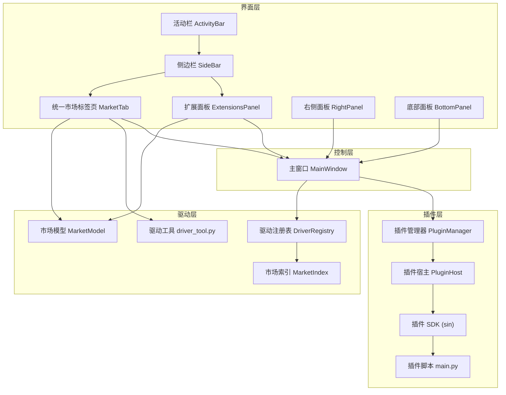

**图表来源**
- [activitybar.h:1-63](file://src/ui/activitybar.h#L1-L63)
- [sidebarpanels.h:394-416](file://src/ui/panels/sidebarpanels.h#L394-L416)
- [markettab.h:45-137](file://src/ui/markettab.h#L45-L137)
- [mainwindow.h:221-222](file://src/ui/mainwindow.h#L221-L222)
- [pluginmanager.h:17-89](file://src/core/plugin/pluginmanager.h#L17-L89)
- [pluginhost.h:13-95](file://src/core/plugin/pluginhost.h#L13-95)
- [marketindex.h:13-22](file://src/core/driver/marketindex.h#L13-L22)
- [driverregistry.h:15-27](file://src/core/driver/driverregistry.h#L15-L27)
- [marketmodel.h:14-84](file://src/ui/marketmodel.h#L14-L84)
- [__init__.py:1-31](file://sdk/sin/__init__.py#L1-L31)

**章节来源**
- [README.md:17-88](file://README.md#L17-L88)
- [mainwindow.h:221-222](file://src/ui/mainwindow.h#L221-L222)
- [sidebarpanels.h:394-416](file://src/ui/panels/sidebarpanels.h#L394-L416)
- [markettab.h:45-137](file://src/ui/markettab.h#L45-L137)
- [pluginmanager.h:17-89](file://src/core/plugin/pluginmanager.h#L17-L89)
- [pluginhost.h:13-95](file://src/core/plugin/pluginhost.h#L13-95)
- [marketindex.h:13-22](file://src/core/driver/marketindex.h#L13-L22)
- [driverregistry.h:15-27](file://src/core/driver/driverregistry.h#L15-L27)
- [marketmodel.h:14-84](file://src/ui/marketmodel.h#L14-L84)
- [__init__.py:1-31](file://sdk/sin/__init__.py#L1-L31)

## 核心组件
- 活动栏 ActivityBar：窄竖条功能入口，切换侧边栏面板并联动主标签页
- 侧边栏 SideBar：QStackedWidget 容器，承载工程、Trace、Graphic、DBC、收发、协议、工具、扩展、设置等面板
- 扩展面板 ExtensionsPanel：展示已安装插件、市场列表与命令，支持搜索、过滤与双击激活，**现已升级为三区域布局的迷你市场**
- **统一市场标签页 MarketTab：整合驱动和插件管理的完整界面，采用VS Code扩展市场风格设计，支持四类型条目管理**
- 主窗口 MainWindow：组装 UI、连接信号槽、路由用户操作到对应服务或插件
- 插件管理器 PluginManager：单例，扫描插件、启动 Python 宿主、手动激活/停用插件、事件分发
- 插件宿主 PluginHost：QProcess 管理 Python 子进程，JSON-RPC over stdin/stdout，请求/响应回调与崩溃重启
- 驱动注册表 DriverRegistry：内置和外置驱动的装配、枚举、创建设备实例和生命周期管理
- 市场索引 MarketIndex：设备市场索引的加载、检索和 URL 解析
- **市场模型 MarketModel：统一的数据聚合层，提供四源数据的标准化访问接口**
- 插件 SDK sin：输出、帧发送、命令注册、工作区与信号等 API，供插件调用

**章节来源**
- [activitybar.h:1-63](file://src/ui/activitybar.h#L1-L63)
- [sidebarpanels.h:394-416](file://src/ui/panels/sidebarpanels.h#L394-L416)
- [markettab.h:45-137](file://src/ui/markettab.h#L45-L137)
- [mainwindow.h:221-222](file://src/ui/mainwindow.h#L221-L222)
- [pluginmanager.h:17-89](file://src/core/plugin/pluginmanager.h#L17-L89)
- [pluginhost.h:13-95](file://src/core/plugin/pluginhost.h#L13-95)
- [driverregistry.h:15-27](file://src/core/driver/driverregistry.h#L15-L27)
- [marketindex.h:13-22](file://src/core/driver/marketindex.h#L13-L22)
- [marketmodel.h:62-84](file://src/ui/marketmodel.h#L62-L84)
- [__init__.py:1-31](file://sdk/sin/__init__.py#L1-L31)

## 架构总览
扩展面板系统采用"界面—控制—插件—驱动"分层架构，通过信号/槽与 JSON-RPC 解耦。主窗口作为编排者，将用户操作映射到具体面板或服务；插件管理器负责插件生命周期与事件转发；插件宿主以独立进程运行，保证稳定性与隔离性；驱动注册表统一管理设备驱动的发现和安装。**当前版本已全面升级为完整的迷你市场系统，通过统一的数据模型和市场模型，实现了驱动和插件的无缝集成管理**。

**重要架构升级**：系统现在支持三区域布局（已安装项目、驱动市场、插件市场），采用统一的数据模型MarketItem和MarketEntryData，提供一致的用户体验。

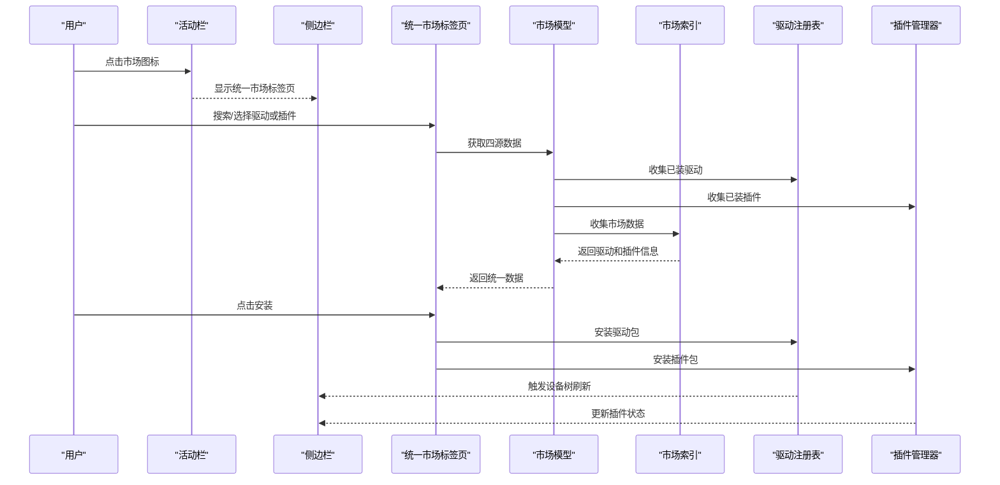

**图表来源**
- [activitybar.h:1-63](file://src/ui/activitybar.h#L1-L63)
- [sidebarpanels.h:394-416](file://src/ui/panels/sidebarpanels.h#L394-L416)
- [markettab.h:45-137](file://src/ui/markettab.h#L45-L137)
- [marketmodel.h:62-84](file://src/ui/marketmodel.h#L62-L84)
- [marketindex.h:13-22](file://src/core/driver/marketindex.h#L13-L22)
- [driverregistry.h:15-27](file://src/core/driver/driverregistry.h#L15-27)
- [pluginmanager.h:17-89](file://src/core/plugin/pluginmanager.h#L17-L89)

## 详细组件分析

### 活动栏与侧边栏
- 活动栏维护一组按钮与当前活动项，点击后通知侧边栏切换面板；再次点击同一按钮可隐藏侧边栏
- 侧边栏使用 QStackedWidget 承载多个面板，索引与活动栏枚举一致，便于统一切换
- **扩展面板现已升级为三区域布局的迷你市场，支持已安装项目、驱动市场、插件市场的统一管理**
- **统一市场标签页作为侧边栏的重要面板，提供驱动和插件的完整管理功能**

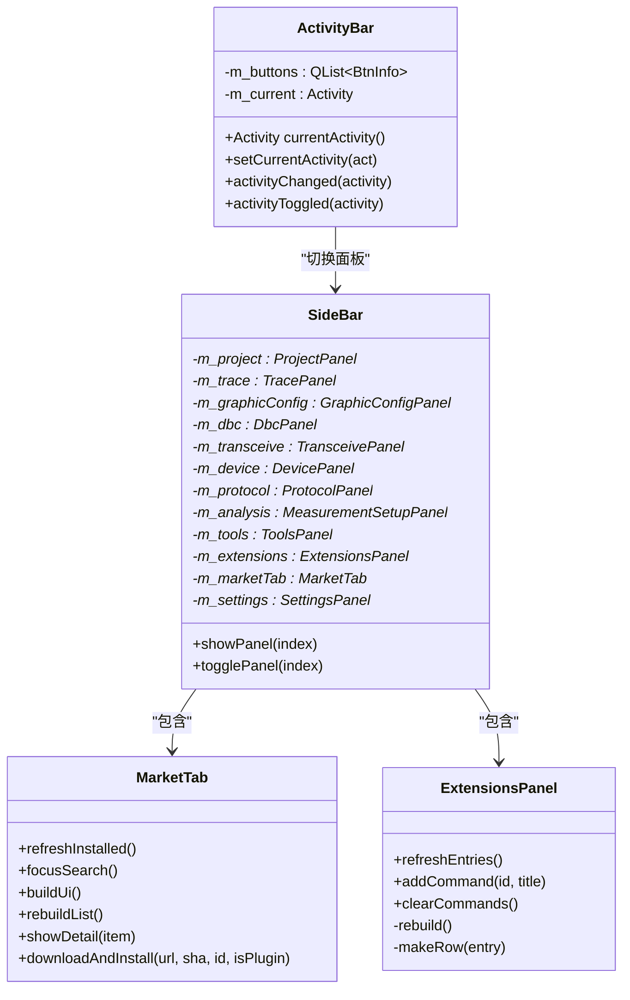

**图表来源**
- [activitybar.h:1-63](file://src/ui/activitybar.h#L1-L63)
- [sidebarpanels.h:394-416](file://src/ui/panels/sidebarpanels.h#L394-L416)
- [markettab.h:45-137](file://src/ui/markettab.h#L45-L137)
- [sidebarpanels.h:320-361](file://src/ui/panels/sidebarpanels.h#L320-L361)

**章节来源**
- [activitybar.h:1-63](file://src/ui/activitybar.h#L1-L63)
- [sidebarpanels.h:394-416](file://src/ui/panels/sidebarpanels.h#L394-L416)
- [markettab.h:45-137](file://src/ui/markettab.h#L45-L137)
- [sidebarpanels.h:320-361](file://src/ui/panels/sidebarpanels.h#L320-L361)

### 统一市场标签页功能
**统一市场标签页提供了驱动和插件的完整管理功能：**

- **统一界面设计**：采用VS Code扩展市场风格，左侧列表+右侧详情布局
- **四类型条目管理**：已装驱动、已装插件、市场驱动、市场插件的统一视图
- **智能搜索过滤**：支持型号、厂商、关键词的多词 AND 匹配
- **图文详情展示**：显示设备主图、规格表、Markdown 介绍、驱动包信息
- **统一安装流程**：下载 → sha256 校验 → 确认弹窗 → 安装 → 热加载
- **生命周期管理**：支持驱动和设备插件的启用/禁用、卸载等操作
- **状态指示器**：实时显示插件运行状态（● 运行中）、驱动可用性等
- **图片缓存机制**：市场图标和图片下载到本地缓存，提升加载速度

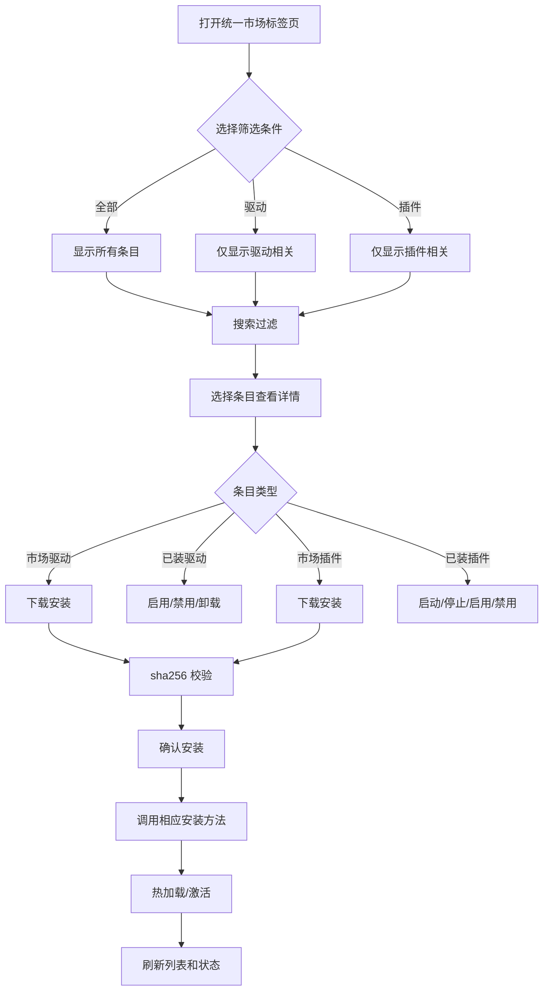

**图表来源**
- [markettab.cpp:188-299](file://src/ui/markettab.cpp#L188-L299)
- [markettab.cpp:450-575](file://src/ui/markettab.cpp#L450-L575)
- [markettab.cpp:620-646](file://src/ui/markettab.cpp#L620-L646)
- [markettab.cpp:680-704](file://src/ui/markettab.cpp#L680-L704)

**章节来源**
- [markettab.h:45-137](file://src/ui/markettab.h#L45-L137)
- [markettab.cpp:188-299](file://src/ui/markettab.cpp#L188-L299)
- [markettab.cpp:450-575](file://src/ui/markettab.cpp#L450-L575)
- [markettab.cpp:620-646](file://src/ui/markettab.cpp#L620-L646)
- [markettab.cpp:680-704](file://src/ui/markettab.cpp#L680-L704)

### 三区域布局的扩展面板
**扩展面板现已升级为三区域布局的迷你市场：**

- **已安装区域**：显示已安装的驱动和插件，支持行内齿轮菜单进行启停、启用/禁用、卸载等操作
- **驱动市场区域**：显示可用的驱动包，支持搜索、查看详细信息、下载安装
- **插件市场区域**：显示可用的插件包，支持搜索、查看详细信息、下载安装
- **统一搜索功能**：支持跨区域的搜索过滤，快速定位目标项目
- **命令列表**：显示已激活插件提供的命令，支持直接执行

**界面优化升级**：扩展面板实现了增强的尺寸策略设置，使用QSizePolicy::Ignored改善窄面板布局下的显示效果，并通过优化的文本截断逻辑（120像素最大宽度）提升受限空间内的UI展示效果。

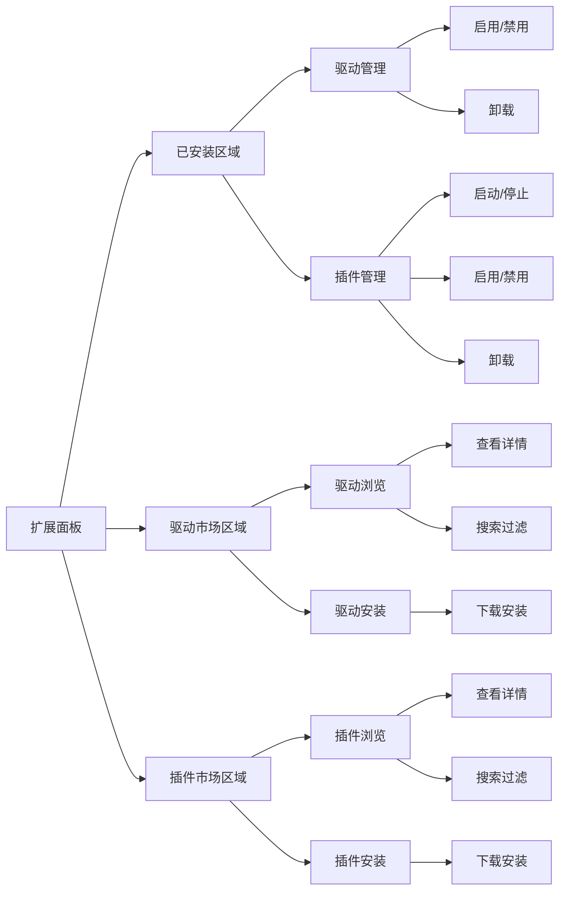

**章节来源**
- [sidebarpanels.cpp:1147-1511](file://src/ui/panels/sidebarpanels.cpp#L1147-L1511)

### 统一数据模型与市场模型
**新增统一的数据模型和市场模型，支持四类型条目的统一管理：**

- **MarketItem**：统一的条目标识符，支持四种类型（已装驱动、已装插件、市场驱动、市场插件）
- **MarketEntryData**：行条目聚合数据，包含标题、元信息、状态、图标、搜索字段等
- **FrameRow**：统一的市场列表行组件，支持选中态、点击事件、图标显示
- **MarketModel**：数据聚合层，提供四个收集函数分别获取不同来源的数据
- **PluginUi**：插件图标绘制工具，支持本地图片加载和首字母头像兜底

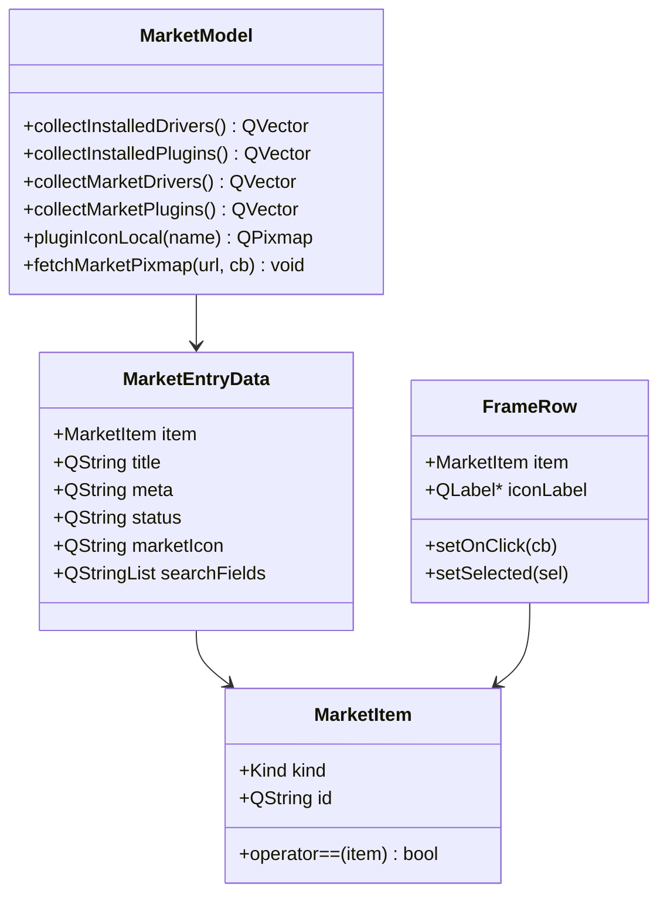

**图表来源**
- [marketmodel.h:14-84](file://src/ui/marketmodel.h#L14-L84)
- [marketmodel.cpp:111-194](file://src/ui/marketmodel.cpp#L111-L194)

**章节来源**
- [marketmodel.h:14-84](file://src/ui/marketmodel.h#L14-L84)
- [marketmodel.cpp:111-194](file://src/ui/marketmodel.cpp#L111-L194)

### 主窗口与统一市场标签页集成
- 主窗口在构造时初始化插件管理器和驱动注册表
- 统一市场标签页通过信号与主窗口交互，驱动安装成功后触发设备树刷新
- 主窗口订阅驱动注册表的 driversChanged 信号，同步更新设备面板
- **新增setupMarketTab方法，专门处理MarketTab的初始化和信号连接**

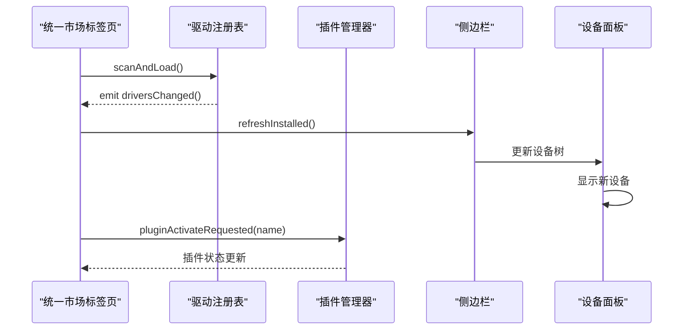

**图表来源**
- [mainwindow.cpp:1492-1515](file://src/ui/mainwindow.cpp#L1492-L1515)
- [markettab.cpp:293-299](file://src/ui/markettab.cpp#L293-L299)
- [driverregistry.h:86-88](file://src/core/driver/driverregistry.h#L86-L88)

**章节来源**
- [mainwindow.cpp:1492-1515](file://src/ui/mainwindow.cpp#L1492-L1515)
- [markettab.cpp:293-299](file://src/ui/markettab.cpp#L293-L299)
- [driverregistry.h:86-88](file://src/core/driver/driverregistry.h#L86-L88)

### 插件管理器与宿主进程
- 插件管理器负责扫描 plugins/ 目录，加载每个插件的 plugin.json，构建插件信息表
- initialize() 查找 Python 解释器，启动 sin_host.py 宿主进程，建立 JSON-RPC 通道
- 插件不再自动激活，由用户通过双击操作手动触发激活
- 激活/停用插件通过 sendNotification 通知宿主；命令执行通过 executeCommand 下发
- 新增 reactivatePlugin() 方法支持重新激活已存在的插件，先停用再激活
- 新增 isPluginActivated() 方法用于跟踪插件激活状态
- 帧事件批量缓冲并通过定时器转发给已激活的 onFrame 插件，降低高频事件开销

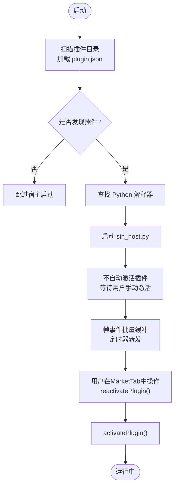

**图表来源**
- [pluginmanager.cpp:123-183](file://src/core/plugin/pluginmanager.cpp#L123-L183)
- [pluginmanager.h:33-50](file://src/core/plugin/pluginmanager.h#L33-L50)

**章节来源**
- [pluginmanager.cpp:123-183](file://src/core/plugin/pluginmanager.cpp#L123-L183)
- [pluginmanager.h:33-50](file://src/core/plugin/pluginmanager.h#L33-L50)

### 插件宿主与 SDK
- 插件宿主通过 QProcess 管理 Python 子进程，使用 newline-delimited JSON 进行双向通信
- 支持请求/响应模式，维护待处理请求的回调映射，崩溃后指数退避重启
- SDK 暴露 output、frames、commands、workspace、signals 等接口；UI 模块可选（需 PyQt6）

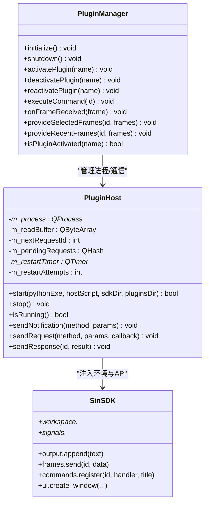

**图表来源**
- [pluginhost.h:13-95](file://src/core/plugin/pluginhost.h#L13-95)
- [pluginmanager.h:33-95](file://src/core/plugin/pluginmanager.h#L33-95)
- [__init__.py:1-31](file://sdk/sin/__init__.py#L1-L31)

**章节来源**
- [pluginhost.h:13-95](file://src/core/plugin/pluginhost.h#L13-95)
- [pluginmanager.h:33-95](file://src/core/plugin/pluginmanager.h#L33-95)
- [__init__.py:1-31](file://sdk/sin/__init__.py#L1-L31)

### 示例插件
- hello-world：最简示例，激活时输出欢迎消息，注册命令并在底部面板输出问候
- frame-counter：演示 onFrame 事件，统计总帧数与 ID 分布，提供报告命令
- ui-demo：演示创建独立窗口，发送帧、订阅帧、注册命令，需要 PyQt6

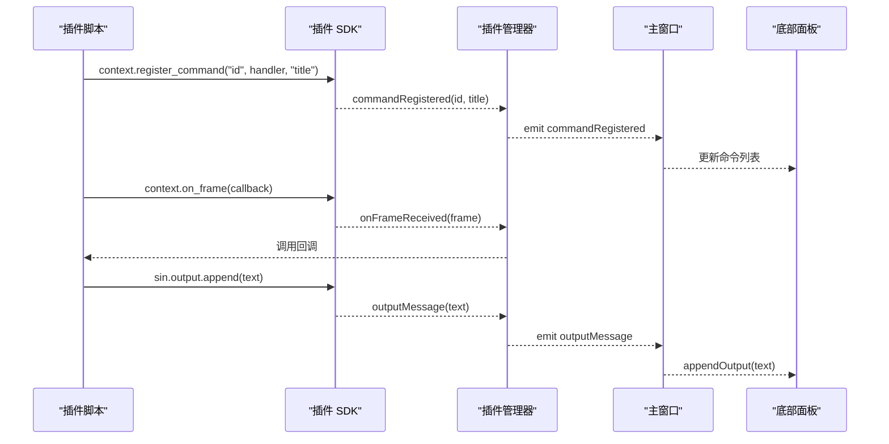

**图表来源**
- [hello-world/main.py:11-24](file://plugins/hello-world/main.py#L11-L24)
- [frame-counter/main.py:16-54](file://plugins/frame-counter/main.py#L16-L54)
- [ui-demo/main.py:15-106](file://plugins/ui-demo/main.py#L15-L106)
- [pluginmanager.h:63-89](file://src/core/plugin/pluginmanager.h#L63-L89)

**章节来源**
- [hello-world/main.py:11-24](file://plugins/hello-world/main.py#L11-L24)
- [frame-counter/main.py:16-54](file://plugins/frame-counter/main.py#L16-L54)
- [ui-demo/main.py:15-106](file://plugins/ui-demo/main.py#L15-L106)
- [pluginmanager.h:63-89](file://src/core/plugin/pluginmanager.h#L63-L89)

### 统一市场标签页用户体验改进
**新增功能**：
- **统一界面设计**：采用VS Code扩展市场风格的左右分栏布局
- **智能搜索过滤**：支持多词AND匹配，快速定位目标驱动或插件
- **视觉状态指示器**：运行时显示绿色"● 运行中"状态标识
- **行内操作按钮**：已装插件的行内启停小按钮，提升操作效率
- **统一安装流程**：驱动和插件共享相同的安装和验证流程
- **图片缓存机制**：市场图标和图片下载到本地缓存，提升加载速度

**界面优化升级**：扩展面板实现了增强的尺寸策略设置，使用QSizePolicy::Ignored改善窄面板布局下的显示效果，并通过优化的文本截断逻辑（120像素最大宽度）提升受限空间内的UI展示效果。

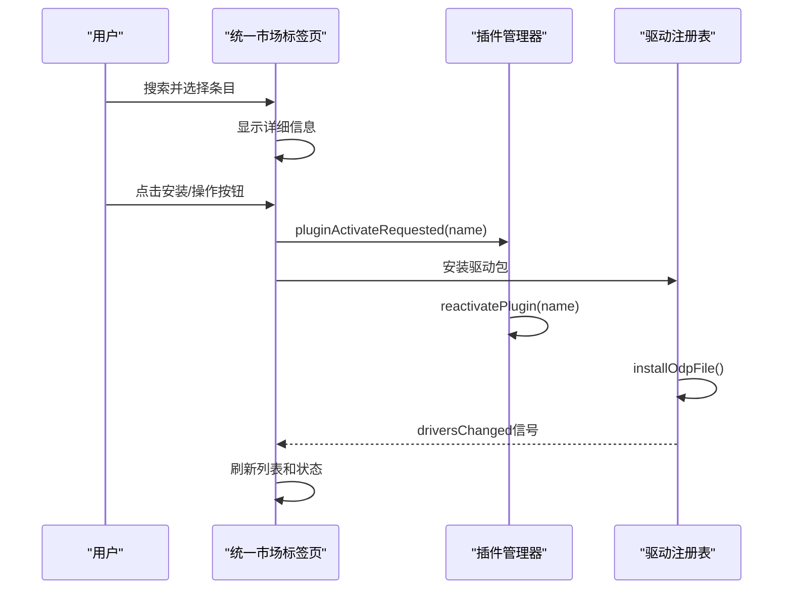

**章节来源**
- [markettab.cpp:188-299](file://src/ui/markettab.cpp#L188-L299)
- [markettab.cpp:419-448](file://src/ui/markettab.cpp#L419-L448)
- [markettab.cpp:680-704](file://src/ui/markettab.cpp#L680-L704)
- [mainwindow.cpp:1492-1515](file://src/ui/mainwindow.cpp#L1492-L1515)

### 扩展面板界面优化详解
**界面优化升级**：扩展面板实现了以下关键改进：

- **增强的尺寸策略设置**：使用QSizePolicy::Ignored策略，允许标题和元信息标签在窄面板中被压缩到内容以下，避免挤占右侧状态词和齿轮按钮的空间
- **优化的文本截断逻辑**：将元信息的最大截断宽度缩短至120像素，确保在受限空间内提供更好的UI展示效果
- **改进的布局适应性**：通过精细的尺寸策略控制，确保在狭窄侧边栏中也能保持良好的视觉效果和可用性

**技术实现细节**：
- 标题标签和元信息标签都设置了`QSizePolicy::Ignored, QSizePolicy::Preferred`策略
- 使用`fm.elidedText(e.meta, Qt::ElideRight, 120)`实现单行文本截断
- 通过透明鼠标事件属性确保行点击事件的正确传递

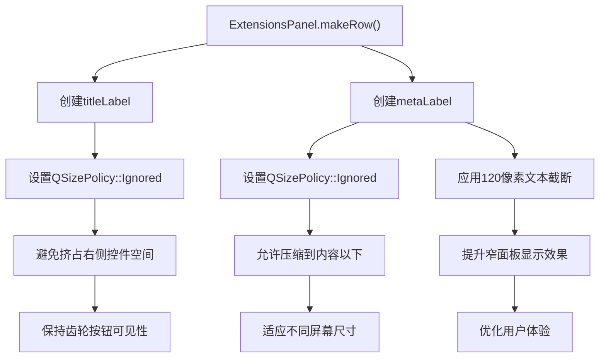

**章节来源**
- [sidebarpanels.cpp:1341-1357](file://src/ui/panels/sidebarpanels.cpp#L1341-L1357)

## 依赖关系分析
- 界面层依赖控制层：活动栏与侧边栏由主窗口装配，扩展面板和统一市场标签页通过信号与主窗口交互
- 控制层依赖插件层和驱动层：主窗口连接插件管理器信号，路由命令与插件开关；连接驱动注册表信号，同步设备面板
- 插件层内部依赖：插件管理器依赖插件宿主；宿主通过 SDK 与插件脚本交互
- 驱动层内部依赖：统一市场标签页依赖市场索引和驱动注册表；驱动注册表管理内置和外置驱动
- **新增市场模型依赖**：统一市场标签页和扩展面板都依赖市场模型进行数据聚合
- 外部依赖：Python 解释器、PyQt6（可选，用于 UI 演示插件）、网络访问（市场下载）

**重要变更**：系统现在通过统一的市场模型协调插件管理器和驱动注册表，提供一致的界面入口和数据访问接口。

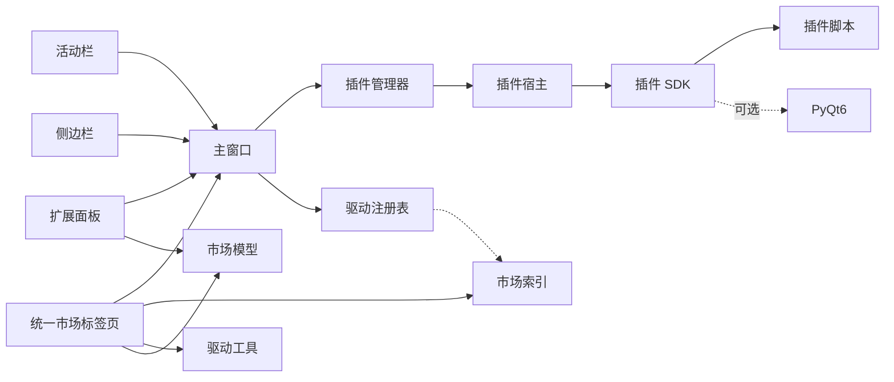

**图表来源**
- [activitybar.h:1-63](file://src/ui/activitybar.h#L1-L63)
- [sidebarpanels.h:394-416](file://src/ui/panels/sidebarpanels.h#L394-L416)
- [markettab.h:45-137](file://src/ui/markettab.h#L45-L137)
- [mainwindow.cpp:1492-1515](file://src/ui/mainwindow.cpp#L1492-L1515)
- [pluginmanager.cpp:145-183](file://src/core/plugin/pluginmanager.cpp#L145-L183)
- [pluginhost.h:13-95](file://src/core/plugin/pluginhost.h#L13-95)
- [marketindex.h:13-22](file://src/core/driver/marketindex.h#L13-L22)
- [driverregistry.h:15-27](file://src/core/driver/driverregistry.h#L15-27)
- [marketmodel.h:62-84](file://src/ui/marketmodel.h#L62-L84)
- [__init__.py:1-31](file://sdk/sin/__init__.py#L1-L31)

**章节来源**
- [mainwindow.cpp:1492-1515](file://src/ui/mainwindow.cpp#L1492-L1515)
- [pluginmanager.cpp:145-183](file://src/core/plugin/pluginmanager.cpp#L145-L183)
- [pluginhost.h:13-95](file://src/core/plugin/pluginhost.h#L13-95)
- [marketindex.h:13-22](file://src/core/driver/marketindex.h#L13-L22)
- [driverregistry.h:15-27](file://src/core/driver/driverregistry.h#L15-27)
- [marketmodel.h:62-84](file://src/ui/marketmodel.h#L62-L84)
- [__init__.py:1-31](file://sdk/sin/__init__.py#L1-L31)

## 性能考量
- 帧事件批量缓冲：插件管理器对 onFrame 事件进行缓冲，按定时器批量转发，避免每帧触发导致的 UI 卡顿
- 插件隔离：Python 宿主独立进程，崩溃不影响主程序稳定性
- 按需加载：仅当存在 onFrame 插件时才缓冲帧，减少无谓开销
- UI 刷新节流：底部面板输出与命令列表更新应适度节流，避免频繁重绘
- 手动激活优化：插件延迟激活减少启动时的资源消耗
- 资源监控：扩展标签页提供宿主进程的实时监控，帮助诊断性能问题
- **市场索引缓存：设备图片下载到本地缓存，减少重复网络请求**
- **驱动热加载：新驱动安装后立即生效，无需重启应用程序**
- **异步网络操作：市场索引加载、驱动包下载均采用异步方式，避免阻塞 UI**
- **统一界面优化：MarketTab采用懒加载策略，仅在需要时加载详情内容**
- **数据聚合优化：MarketModel提供高效的数据聚合接口，避免重复查询**
- **界面渲染优化：QSizePolicy::Ignored策略减少不必要的布局计算，提升滚动性能**

**章节来源**
- [pluginmanager.cpp:178-183](file://src/core/plugin/pluginmanager.cpp#L178-L183)
- [pluginmanager.cpp:283-297](file://src/core/plugin/pluginmanager.cpp#L283-L297)
- [markettab.cpp:293-299](file://src/ui/markettab.cpp#L293-L299)
- [markettab.cpp:662-668](file://src/ui/markettab.cpp#L662-L668)
- [marketindex.cpp:71-79](file://src/core/driver/marketindex.cpp#L71-L79)
- [marketmodel.cpp:231-265](file://src/ui/marketmodel.cpp#L231-L265)
- [sidebarpanels.cpp:1347-1357](file://src/ui/panels/sidebarpanels.cpp#L1347-L1357)

## 故障排查指南
- 插件未生效
  - 检查插件目录是否存在、plugin.json 是否有效
  - 确认 Python 解释器路径正确且可执行
  - 确认用户已通过MarketTab中的操作激活插件
  - 查看底部面板输出，定位宿主启动失败或激活失败原因
- 命令不显示
  - 确认插件已激活且成功注册命令
  - 检查主窗口是否正确连接 commandRegistered 信号并更新命令列表
- 帧事件未触发
  - 确认至少有一个插件声明 onFrame
  - 检查帧事件是否被批量缓冲与定时转发
- 宿主崩溃
  - 观察是否触发 hostCrashed 信号
  - 确认自动重启机制是否按预期工作
- 资源占用过高
  - 使用扩展标签页监控宿主进程的 CPU、内存、磁盘 I/O
  - 检查是否有插件在处理大量数据或频繁触发事件
- **设备驱动相关问题**
  - 检查市场索引是否正常加载，确认网络连接状态
  - 验证驱动包的 sha256 校验是否通过
  - 确认 Python 解释器可正常执行 driver_tool.py
  - 查看驱动注册表日志，定位驱动加载失败原因
  - 检查驱动是否被禁用或卸载
- **统一市场标签页相关问题**
  - 确认MarketTab是否正确初始化并连接到主窗口
  - 检查插件操作请求信号是否正确连接到PluginManager
  - 验证驱动安装和插件安装的错误处理机制
- **三区域布局相关问题**
  - 确认扩展面板的三区域布局是否正确渲染
  - 检查MarketModel的数据聚合功能是否正常工作
  - 验证搜索过滤功能是否跨区域生效
- **界面显示问题**
  - 检查QSizePolicy::Ignored策略是否正确应用到标题和元信息标签
  - 验证120像素文本截断是否正常工作
  - 确认在窄面板布局下界面元素不会溢出或被遮挡

**章节来源**
- [pluginmanager.cpp:123-183](file://src/core/plugin/pluginmanager.cpp#L123-L183)
- [pluginmanager.cpp:283-297](file://src/core/plugin/pluginmanager.cpp#L283-L297)
- [pluginhost.h:59-70](file://src/core/plugin/pluginhost.h#L59-L70)
- [markettab.cpp:293-299](file://src/ui/markettab.cpp#L293-L299)
- [mainwindow.cpp:1492-1515](file://src/ui/mainwindow.cpp#L1492-L1515)
- [marketindex.cpp:81-148](file://src/core/driver/marketindex.cpp#L81-L148)
- [sidebarpanels.cpp:1147-1511](file://src/ui/panels/sidebarpanels.cpp#L1147-L1511)
- [sidebarpanels.cpp:1347-1357](file://src/ui/panels/sidebarpanels.cpp#L1347-L1357)

## 结论
扩展面板系统通过清晰的层次划分与稳定的进程隔离，实现了插件生态的可插拔与可扩展。**当前版本已全面升级为完整的迷你市场系统，集成了设备驱动管理和插件管理的统一界面，提供类似 VS Code 扩展市场的用户体验**。

**重大架构升级**：系统已从简单的插件管理器发展为功能完整的迷你市场，支持驱动和插件的统一管理。通过引入统一的数据模型（MarketItem、MarketEntryData）和市场模型（MarketModel），实现了四类型条目的统一管理。三区域布局（已安装项目、驱动市场、插件市场）为用户提供了一致的操作体验，而统一的生命周期管理机制确保了驱动和插件的稳定运行。该设计既保证了主程序的稳定性，又为后续功能扩展提供了灵活的基础设施。

**界面优化成果**：最新的界面优化通过QSizePolicy::Ignored策略和优化的文本截断逻辑，显著提升了在窄面板布局下的用户体验，确保在各种屏幕尺寸和面板宽度下都能保持良好的视觉效果和可用性。

## 附录
- 快速上手
  - 在 plugins/ 下新增插件目录，编写 main.py 与 plugin.json
  - 激活插件：在统一市场标签页中操作插件的启停按钮
  - 可在扩展面板查看命令并执行
  - 使用 sin.output 输出日志，使用 sin.frames 发送帧，使用 context.register_command 注册命令
- 参考示例
  - hello-world：最小可用插件
  - frame-counter：帧统计与报告
  - ui-demo：独立窗口与 PyQt6 集成
- **统一市场标签页使用**
  - 打开统一市场标签页浏览驱动和插件市场
  - 使用搜索功能查找特定设备型号或插件
  - 查看详细的图文信息和规格参数
  - 一键安装驱动包和插件包，支持离线安装
  - 管理已安装项目：启用/禁用、卸载等操作
  - 通过设备树查看新安装的驱动设备
- **三区域布局使用**
  - 在扩展面板中查看已安装的项目（驱动和插件混合显示）
  - 浏览驱动市场和插件市场，搜索和安装新的扩展
  - 使用统一的搜索功能跨区域查找项目
  - 通过行内齿轮菜单进行项目管理操作
- **迁移指南**
  - 原有的ExtensionsTab功能已完全迁移到MarketTab
  - 插件管理操作现在通过MarketTab的界面完成
  - 保持了原有的插件生命周期管理机制
  - 新增了更丰富的用户界面和功能特性
  - 引入了统一的数据模型和市场模型，提供更好的扩展性
- **界面优化说明**
  - 扩展面板现在使用QSizePolicy::Ignored策略优化窄面板显示
  - 文本截断宽度优化为120像素，提升受限空间的展示效果
  - 通过精细的布局控制确保在各种屏幕尺寸下的良好用户体验

**章节来源**
- [hello-world/main.py:11-24](file://plugins/hello-world/main.py#L11-L24)
- [frame-counter/main.py:16-54](file://plugins/frame-counter/main.py#L16-L54)
- [ui-demo/main.py:15-106](file://plugins/ui-demo/main.py#L15-L106)
- [__init__.py:1-31](file://sdk/sin/__init__.py#L1-L31)
- [markettab.cpp:188-299](file://src/ui/markettab.cpp#L188-L299)
- [markettab.cpp:450-575](file://src/ui/markettab.cpp#L450-L575)
- [mainwindow.cpp:1492-1515](file://src/ui/mainwindow.cpp#L1492-L1515)
- [sidebarpanels.cpp:1147-1511](file://src/ui/panels/sidebarpanels.cpp#L1147-L1511)
- [marketmodel.h:14-84](file://src/ui/marketmodel.h#L14-L84)
- [sidebarpanels.cpp:1347-1357](file://src/ui/panels/sidebarpanels.cpp#L1347-L1357)