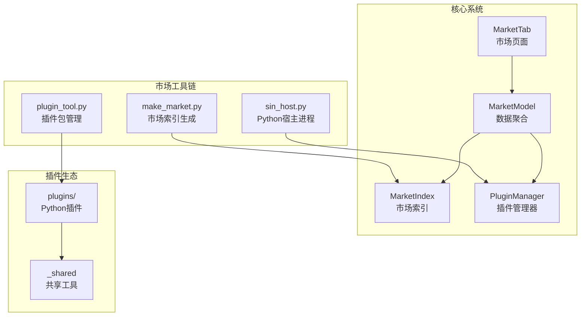
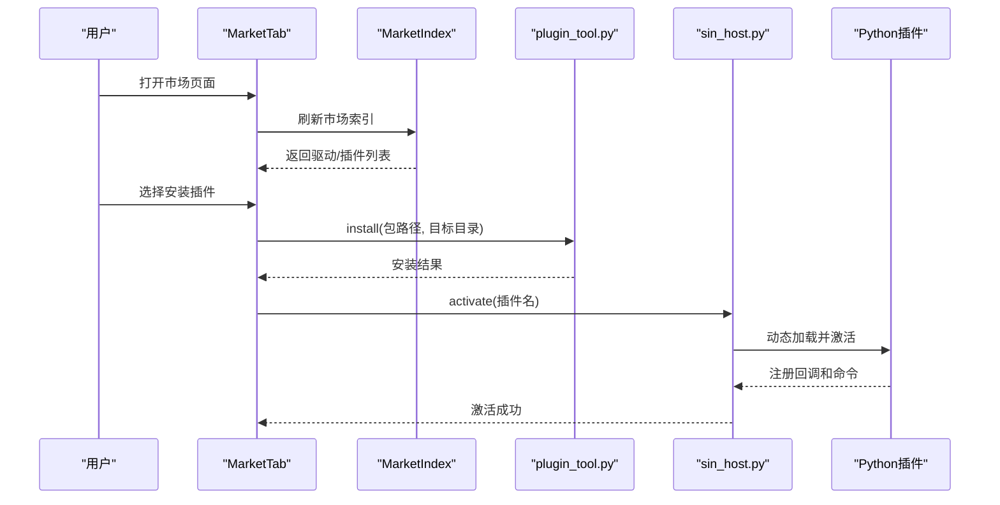
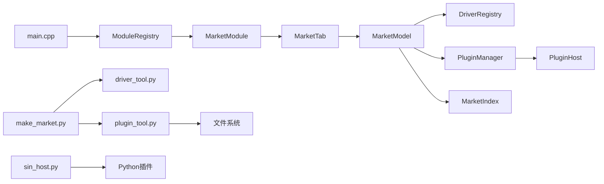
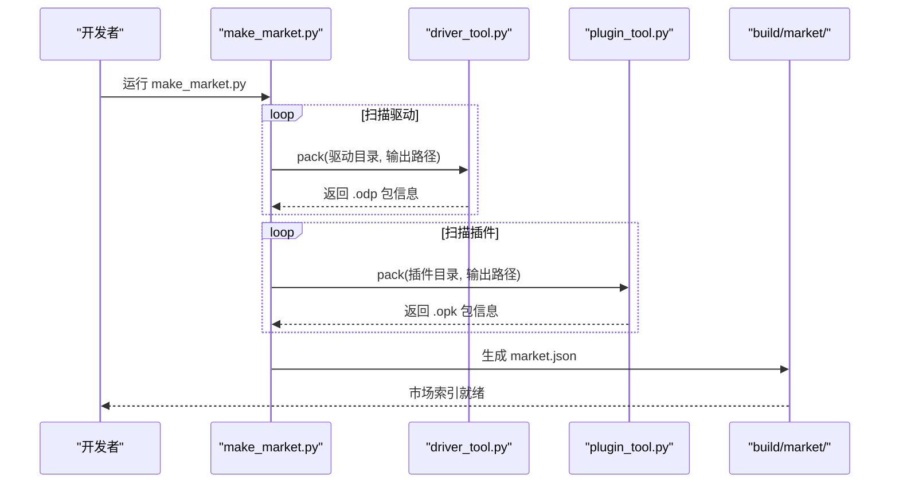
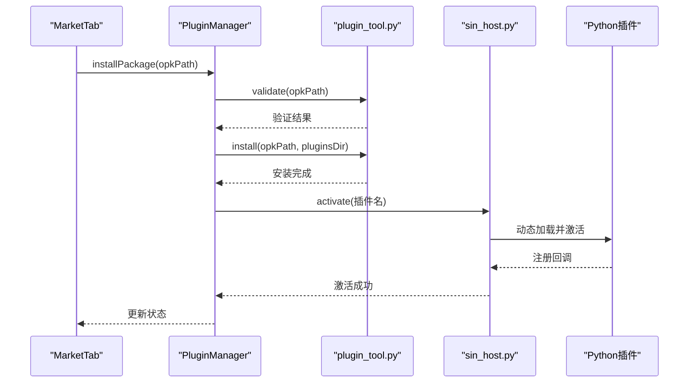
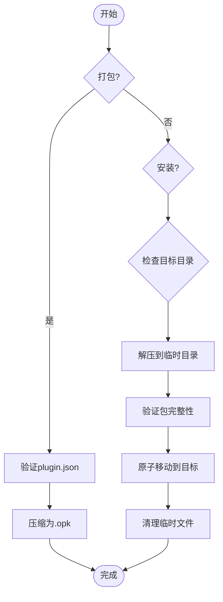

# 插件市场系统

<cite>
**本文引用的文件**
- [scripts/make_market.py](file://scripts/make_market.py)
- [scripts/plugin_tool.py](file://scripts/plugin_tool.py)
- [scripts/sin_host.py](file://scripts/sin_host.py)
- [src/core/driver/marketindex.h](file://src/core/driver/marketindex.h)
- [src/core/driver/marketindex.cpp](file://src/core/driver/marketindex.cpp)
- [src/core/plugin/pluginmanager.h](file://src/core/plugin/pluginmanager.h)
- [plugins/_shared/dbcparse.py](file://plugins/_shared/dbcparse.py)
- [plugins/_shared/isotp_client.py](file://plugins/_shared/isotp_client.py)
- [plugins/autosar-nm-monitor/main.py](file://plugins/autosar-nm-monitor/main.py)
</cite>

## 更新摘要
**变更内容**
- 实现了完整的基于市场的插件分发系统，支持本地和远程市场索引
- 新增了脚本工具链：make_market.py（市场索引生成）、plugin_tool.py（插件包管理）、sin_host.py（Python宿主进程）
- 标准化了共享工具模块，提供DBC解析和ISO-TP客户端功能
- 增强了插件安装、卸载、验证和生命周期管理
- 改进了Python插件的统一导入语句和错误处理机制

## 目录
1. [简介](#简介)
2. [项目结构](#项目结构)
3. [核心组件](#核心组件)
4. [架构总览](#架构总览)
5. [详细组件分析](#详细组件分析)
6. [依赖关系分析](#依赖关系分析)
7. [性能与可靠性](#性能与可靠性)
8. [故障排查指南](#故障排查指南)
9. [结论](#结论)
10. [附录：关键流程时序图](#附录关键流程时序图)

## 简介
本仓库实现了一个"插件市场系统"，将驱动插件（硬件设备）与工具插件（Python 应用）统一纳入同一市场界面进行发现、安装、启停与管理。系统采用"主进程 + Python 宿主进程"的进程隔离模型，通过 JSON-RPC 通信；同时提供本地/远程 market.json 索引，支持搜索、图文详情、一键安装与热加载。

**更新** 系统现已具备完整的市场化插件分发能力，包括本地市场索引生成、插件包打包与安装管理、标准化的共享工具库，以及健壮的Python宿主进程管理。所有Python插件已统一使用标准导入方式和增强的错误处理机制。

## 项目结构
- **市场索引生成**：make_market.py 扫描驱动和插件，生成包含元数据、图标、描述的market.json
- **插件包管理**：plugin_tool.py 负责 .opk 格式的打包、安装、卸载和验证
- **Python宿主进程**：sin_host.py 管理插件生命周期，提供JSON-RPC通信接口
- **UI层**：MarketTab 提供 VS Code 风格的市场页面，聚合已装驱动/插件与市场条目
- **数据层**：MarketModel 聚合 DriverRegistry（已装驱动）、PluginManager（已装插件）、MarketIndex（市场索引）
- **共享工具**：标准化的 DBC解析器和 ISO-TP客户端，供插件复用

**图表来源**
- [scripts/make_market.py:1-416](file://scripts/make_market.py#L1-L416)
- [scripts/plugin_tool.py:1-207](file://scripts/plugin_tool.py#L1-L207)
- [scripts/sin_host.py:1-452](file://scripts/sin_host.py#L1-L452)
- [src/core/driver/marketindex.h:14-120](file://src/core/driver/marketindex.h#L14-L120)
- [src/core/plugin/pluginmanager.h:20-198](file://src/core/plugin/pluginmanager.h#L20-L198)

## 核心组件
- **市场索引生成器（make_market.py）**
  - 职责：扫描 drivers/ 和 plugins/ 目录，生成 schema 2 的 market.json，包含驱动和设备信息、插件元数据和资源文件
  - 特性：支持驱动厂商元数据、设备规格补充、插件标签和关键词增强
- **插件包管理器（plugin_tool.py）**
  - 职责：.opk 格式打包、安装、卸载、验证，确保插件完整性和安全性
  - 特性：路径穿越防护、临时目录原子操作、依赖检查
- **Python宿主进程（sin_host.py）**
  - 职责：启动和管理插件生命周期，提供JSON-RPC通信，处理帧分发和命令执行
  - 特性：崩溃自愈、Qt事件循环集成、UTF-8管道编码
- **市场索引（MarketIndex）**
  - 职责：拉取并解析 market.json，提供驱动和插件检索能力，支持多词AND匹配
  - 特性：本地/远程源切换、资源URL解析、异步加载
- **插件管理器（PluginManager）**
  - 职责：插件发现、激活/停用、消息分发、包管理集成
  - 特性：订阅制帧转发、批量缓冲、慢消费者保护

**章节来源**
- [scripts/make_market.py:16-416](file://scripts/make_market.py#L16-L416)
- [scripts/plugin_tool.py:23-207](file://scripts/plugin_tool.py#L23-L207)
- [scripts/sin_host.py:20-452](file://scripts/sin_host.py#L20-L452)
- [src/core/driver/marketindex.h:14-120](file://src/core/driver/marketindex.h#L14-L120)
- [src/core/plugin/pluginmanager.h:20-198](file://src/core/plugin/pluginmanager.h#L20-L198)

## 架构总览
系统采用分层与进程隔离设计，实现了完整的市场化插件分发：
- **工具层**：make_market.py 生成市场索引，plugin_tool.py 管理插件包
- **运行时层**：sin_host.py 作为Python宿主，PluginManager 协调主进程通信
- **数据层**：MarketIndex 提供市场数据，MarketModel 聚合统一视图
- **插件层**：标准化的Python插件，共享工具库提升一致性

**图表来源**
- [scripts/make_market.py:370-416](file://scripts/make_market.py#L370-L416)
- [scripts/plugin_tool.py:104-150](file://scripts/plugin_tool.py#L104-L150)
- [scripts/sin_host.py:164-193](file://scripts/sin_host.py#L164-L193)
- [src/core/driver/marketindex.cpp:54-143](file://src/core/driver/marketindex.cpp#L54-L143)

## 详细组件分析

### 市场索引生成器（make_market.py）
- **驱动扫描**：遍历 drivers/ 目录，读取 driver.json，调用 driver_tool.py 打包 .odp
- **插件扫描**：遍历 plugins/ 目录，读取 plugin.json，调用 plugin_tool.py 打包 .opk
- **元数据增强**：DRIVER_META 和 PLUGIN_META 提供中文标题、标签、关键词和说明
- **资源管理**：复制驱动图标到 assets/ 目录，生成统一的市场索引

**更新** 现在支持 schema 2 格式，包含按驱动聚合的设备信息和插件描述。

**章节来源**
- [scripts/make_market.py:252-323](file://scripts/make_market.py#L252-L323)
- [scripts/make_market.py:325-368](file://scripts/make_market.py#L325-L368)
- [scripts/make_market.py:370-416](file://scripts/make_market.py#L370-L416)

### 插件包管理器（plugin_tool.py）
- **打包功能**：将插件目录压缩为 .opk 格式，排除 __pycache__ 和编译文件
- **安装验证**：检查 plugin.json 完整性，防止路径穿越攻击，原子性安装
- **卸载清理**：安全删除插件目录，支持名称验证
- **校验工具**：验证插件目录或包的完整性和格式正确性

**更新** 增强了安全性检查，支持 UTF-8 输出编码，改进的错误处理。

**章节来源**
- [scripts/plugin_tool.py:66-102](file://scripts/plugin_tool.py#L66-L102)
- [scripts/plugin_tool.py:104-150](file://scripts/plugin_tool.py#L104-L150)
- [scripts/plugin_tool.py:153-186](file://scripts/plugin_tool.py#L153-L186)

### Python宿主进程（sin_host.py）
- **进程管理**：QProcess 启动 sin_host.py，设置环境变量（SIN_SDK_DIR、SIN_PLUGINS_DIR）
- **通信协议**：newline-delimited JSON-RPC，支持通知、请求/响应、错误响应
- **健壮性**：崩溃检测与自动重启（指数退避），停机标志抑制 kill 触发的重启
- **Qt集成**：可选的 PyQt6 事件循环，支持插件创建GUI窗口

**更新** 改进了UTF-8管道编码，增强了错误处理和日志记录。

**章节来源**
- [scripts/sin_host.py:20-49](file://scripts/sin_host.py#L20-L49)
- [scripts/sin_host.py:164-193](file://scripts/sin_host.py#L164-L193)
- [scripts/sin_host.py:362-452](file://scripts/sin_host.py#L362-L452)

### 市场索引（MarketIndex）
- **数据源**：market.json schema 2，drivers[] 聚合驱动信息（含 devices 简表、icon/image/readme/keywords），plugins[] 为 .opk 描述
- **检索能力**：matchWords 支持多词 AND 匹配；resolveUrl 将相对路径解析为绝对 URL
- **定位策略**：默认优先 build/market（开发），其次 market/（发布布局），最后官方占位 URL

**更新** 支持新的插件格式，包含增强的元数据处理功能，如标签、关键词和版本兼容性检查。

**章节来源**
- [src/core/driver/marketindex.h:14-120](file://src/core/driver/marketindex.h#L14-L120)
- [src/core/driver/marketindex.cpp:37-52](file://src/core/driver/marketindex.cpp#L37-L52)
- [src/core/driver/marketindex.cpp:87-143](file://src/core/driver/marketindex.cpp#L87-L143)

### 共享工具标准化
**新增** 标准化的共享工具模块提升了插件的一致性和可维护性：

- **DBC解析器**：自包含的 DBC 文件解析、编码和序列化功能，支持 Intel/Motorola 字节序
- **ISO-TP客户端**：完整的 ISO 15765-2 协议实现，支持多帧传输和流控制
- **错误处理**：统一的错误处理和日志记录机制

**章节来源**
- [plugins/_shared/dbcparse.py:1-200](file://plugins/_shared/dbcparse.py#L1-L200)
- [plugins/_shared/isotp_client.py:1-200](file://plugins/_shared/isotp_client.py#L1-L200)

### Python插件统一更新
**新增** 所有Python插件已统一更新导入语句和错误处理：

- **标准导入**：统一使用 `import sin` 和 `import dbcparse` 等标准导入方式
- **错误处理**：增强的异常捕获和友好的错误提示
- **依赖检查**：启动时检查必要的依赖库（如 PyQt6）并提供安装指导

**章节来源**
- [plugins/autosar-nm-monitor/main.py:13-132](file://plugins/autosar-nm-monitor/main.py#L13-L132)

## 依赖关系分析
- 主程序入口 main.cpp 注册业务模块（包含 market 模块），随后初始化主题并显示 MainWindow
- MarketTab 依赖 MarketModel、DriverRegistry、PluginManager、MarketIndex 提供数据与操作能力
- PluginManager 依赖 PluginHost 与 Python 宿主脚本，以及 SDK 与插件目录
- 脚本 make_market.py 依赖 driver_tool.py 与 plugin_tool.py 生成 market.json

**图表来源**
- [src/main.cpp:12-19](file://src/main.cpp#L12-L19)
- [src/ui/marketmodule.h:8-17](file://src/ui/marketmodule.h#L8-L17)
- [src/ui/markettab.h:25-40](file://src/ui/markettab.h#L25-L40)
- [src/core/marketmodel.h:66-80](file://src/core/marketmodel.h#L66-L80)
- [src/core/driver/driverregistry.h:15-27](file://src/core/driver/driverregistry.h#L15-L27)
- [src/core/driver/marketindex.h:14-26](file://src/core/driver/marketindex.h#L14-L26)
- [src/core/plugin/pluginmanager.h:20-28](file://src/core/plugin/pluginmanager.h#L20-L28)
- [src/core/plugin/pluginhost.h:13-21](file://src/core/plugin/pluginhost.h#L13-L21)
- [scripts/make_market.py:1-14](file://scripts/make_market.py#L1-L14)

**章节来源**
- [src/main.cpp:12-19](file://src/main.cpp#L12-L19)
- [src/ui/marketmodule.h:8-17](file://src/ui/marketmodule.h#L8-L17)
- [src/ui/markettab.h:25-40](file://src/ui/markettab.h#L25-L40)
- [src/core/marketmodel.h:66-80](file://src/core/marketmodel.h#L66-L80)
- [src/core/driver/driverregistry.h:15-27](file://src/core/driver/driverregistry.h#L15-L27)
- [src/core/driver/marketindex.h:14-26](file://src/core/driver/marketindex.h#L14-L26)
- [src/core/plugin/pluginmanager.h:20-28](file://src/core/plugin/pluginmanager.h#L20-L28)
- [src/core/plugin/pluginhost.h:13-21](file://src/core/plugin/pluginhost.h#L13-L21)
- [scripts/make_market.py:1-14](file://scripts/make_market.py#L1-L14)

## 性能与可靠性
- **帧转发优化**：订阅制 + 批量缓冲（每批 ≤100 帧，上限 50000 帧），无订阅零开销，避免慢消费者导致内存膨胀
- **宿主稳定性**：崩溃自动重启（指数退避），停机标志抑制误重启；Python 解释器优先级查找（环境变量 → 捆绑运行时 → 系统 PATH）
- **市场资源加载**：图片异步加载并磁盘缓存，减少网络与 I/O 压力
- **驱动热加载**：scanAndLoad 增量扫描，避免全量重建；外置 DLL 进程内常驻，卸载延迟清理

**更新** 增强了包管理的可靠性和性能：
- 插件安装采用原子操作，确保安装过程的完整性
- 增强的错误恢复机制，支持部分失败的恢复
- 优化的资源管理和内存使用

**章节来源**
- [src/core/plugin/pluginmanager.cpp:24-30](file://src/core/plugin/pluginmanager.cpp#L24-L30)
- [src/core/plugin/pluginmanager.cpp:96-136](file://src/core/plugin/pluginmanager.cpp#L96-L136)
- [src/core/marketmodel.h:74-78](file://src/core/marketmodel.h#L74-L78)
- [src/core/driver/driverregistry.h:51-78](file://src/core/driver/driverregistry.h#L51-L78)

## 故障排查指南
- **未找到 Python 解释器**
  - 现象：插件系统不可用，宿主无法启动
  - 排查：检查 SIN_PYTHON 环境变量、捆绑运行时是否存在、系统 PATH 中 python/python3/py 是否可执行
- **插件重复名**
  - 现象：discoverPlugins 跳过重复插件
  - 排查：确保 plugins/ 下每个插件目录名称唯一
- **市场索引加载失败**
  - 现象：MarketIndex.lastError 非空，UI 提示错误
  - 排查：检查 marketUrl 配置、网络连通性、market.json 格式
- **驱动安装失败**
  - 现象：driver_tool 返回错误
  - 排查：检查 .odp 包完整性、sha256 校验、厂商 SDK 依赖
- **插件安装失败**
  - 现象：plugin_tool.py 返回错误
  - 排查：检查 .opk 包结构（plugin.json、main.py）、路径穿越防护、目标目录权限

**新增** 包管理相关故障排查：
- **插件验证失败**：检查 plugin.json 格式和必填字段
- **依赖缺失**：确认必要的Python库已正确安装
- **权限问题**：确保插件目录具有适当的读写权限

**章节来源**
- [src/core/plugin/pluginmanager.cpp:96-136](file://src/core/plugin/pluginmanager.cpp#L96-L136)
- [src/core/plugin/pluginmanager.cpp:153-165](file://src/core/plugin/pluginmanager.cpp#L153-L165)
- [src/core/driver/marketindex.h:74-91](file://src/core/driver/marketindex.h#L74-L91)
- [src/ui/markettab.h:97-103](file://src/ui/markettab.h#L97-L103)
- [scripts/plugin_tool.py:104-150](file://scripts/plugin_tool.py#L104-L150)

## 结论
该插件市场系统以清晰的层次化设计与进程隔离机制，实现了驱动与工具插件的统一发现、安装与管理。通过订阅制帧转发、批量缓冲与宿主自愈，保障了高负载下的稳定性；借助 market.json 索引与脚本工具链，提供了可扩展的市场生态。

**更新** 经过本次增强，系统现已具备完整的市场化插件分发能力。新的脚本工具链（make_market.py、plugin_tool.py、sin_host.py）提供了从市场索引生成到插件包管理的完整解决方案。标准化的共享工具模块和统一的Python插件导入标准提高了插件的一致性和可维护性。未来可进一步增强市场内容运营（如在线商店）、插件沙箱安全与更丰富的调试能力。

## 附录：关键流程时序图

### 市场索引生成流程

**图表来源**
- [scripts/make_market.py:370-416](file://scripts/make_market.py#L370-L416)
- [scripts/make_market.py:252-323](file://scripts/make_market.py#L252-L323)
- [scripts/make_market.py:325-368](file://scripts/make_market.py#L325-L368)

### 插件安装流程（下载 → 校验 → 热加载）

**图表来源**
- [scripts/plugin_tool.py:104-150](file://scripts/plugin_tool.py#L104-L150)
- [scripts/sin_host.py:164-193](file://scripts/sin_host.py#L164-L193)
- [src/core/plugin/pluginmanager.h:117-125](file://src/core/plugin/pluginmanager.h#L117-L125)

### 插件包管理流程

**图表来源**
- [scripts/plugin_tool.py:66-102](file://scripts/plugin_tool.py#L66-L102)
- [scripts/plugin_tool.py:104-150](file://scripts/plugin_tool.py#L104-L150)