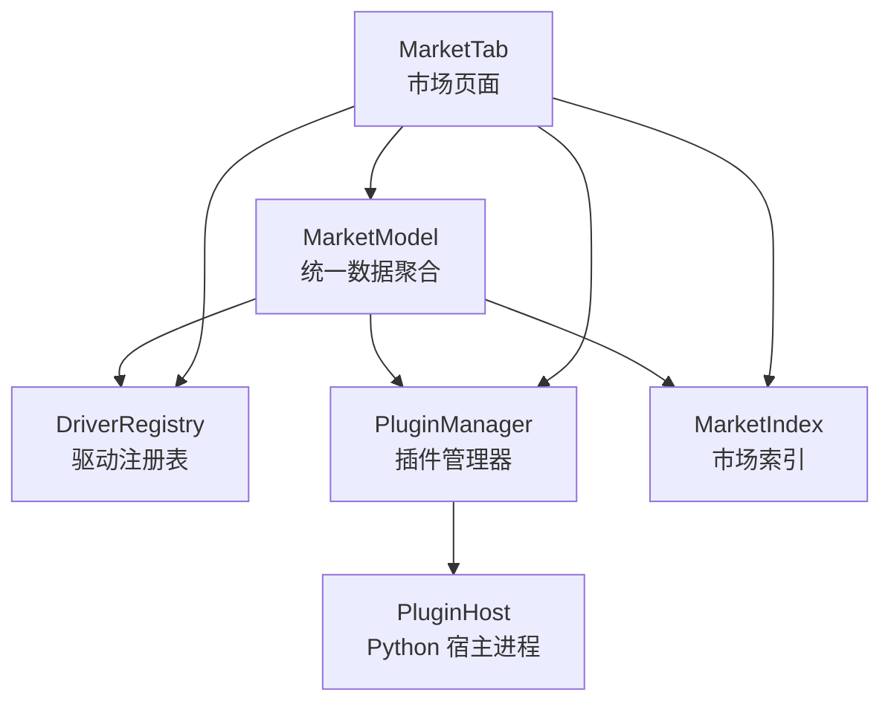
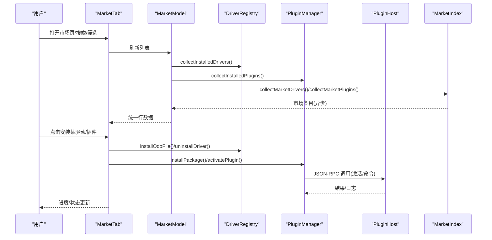
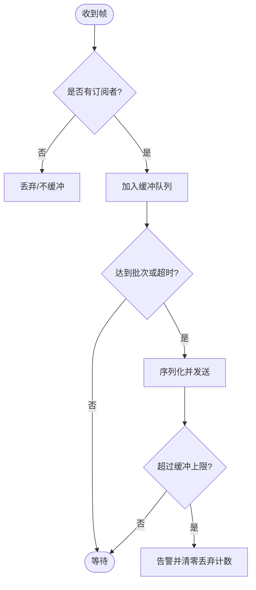
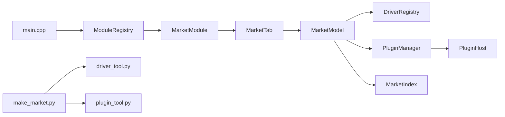
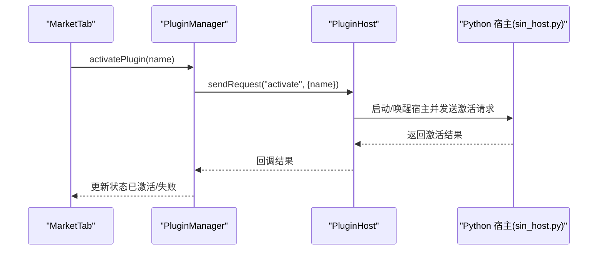
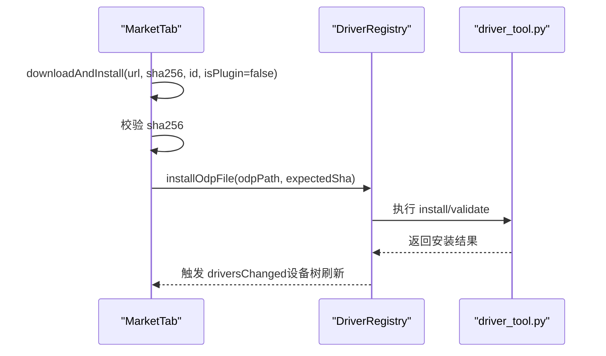
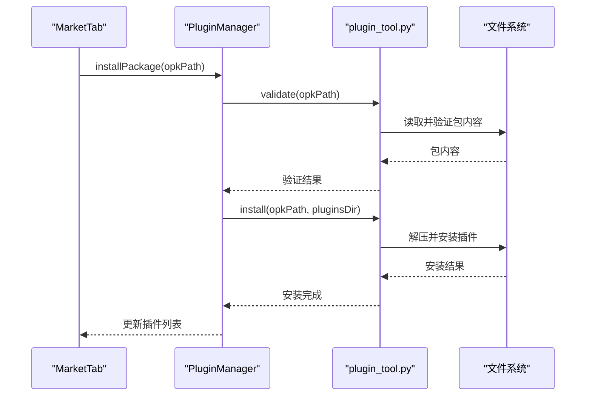

# 插件市场系统

<cite>
**本文引用的文件**
- [README.md](file://README.md)
- [src/main.cpp](file://src/main.cpp)
- [src/core/plugin/pluginmanager.h](file://src/core/plugin/pluginmanager.h)
- [src/core/plugin/pluginmanager.cpp](file://src/core/plugin/pluginmanager.cpp)
- [src/core/plugin/pluginhost.h](file://src/core/plugin/pluginhost.h)
- [src/ui/marketmodule.h](file://src/ui/marketmodule.h)
- [src/ui/markettab.h](file://src/ui/markettab.h)
- [src/core/marketmodel.h](file://src/core/marketmodel.h)
- [src/core/driver/marketindex.h](file://src/core/driver/marketindex.h)
- [src/core/driver/marketindex.cpp](file://src/core/driver/marketindex.cpp)
- [src/core/driver/driverregistry.h](file://src/core/driver/driverregistry.h)
- [scripts/make_market.py](file://scripts/make_market.py)
- [scripts/plugin_tool.py](file://scripts/plugin_tool.py)
- [plugins/_shared/dbcparse.py](file://plugins/_shared/dbcparse.py)
- [plugins/_shared/isotp_client.py](file://plugins/_shared/isotp_client.py)
- [plugins/autosar-nm-monitor/main.py](file://plugins/autosar-nm-monitor/main.py)
- [plugins/can-bit-timing/main.py](file://plugins/can-bit-timing/main.py)
- [plugins/can-dashboard/main.py](file://plugins/can-dashboard/main.py)
- [plugins/dbc-codegen/main.py](file://plugins/dbc-codegen/main.py)
</cite>

## 更新摘要
**变更内容**
- 增强了包管理功能，改进了安装流程和验证机制
- 统一更新了Python插件的导入语句和错误处理
- 标准化了共享工具模块（DBC解析、ISO-TP客户端）
- 市场索引生成支持新的插件格式和改进的元数据处理
- 增强了插件包的打包、安装、卸载和校验功能

## 目录
1. [简介](#简介)
2. [项目结构](#项目结构)
3. [核心组件](#核心组件)
4. [架构总览](#架构总览)
5. [详细组件分析](#详细组件分析)
6. [依赖关系分析](#依赖关系分析)
7. [性能与可靠性](#性能与可靠性)
8. [故障排查指南](#故障排查指南)
9. [结论](#结论)
10. [附录：关键流程时序图](#附录关键流程时序图)

## 简介
本仓库实现了一个"插件市场系统"，将驱动插件（硬件设备）与工具插件（Python 应用）统一纳入同一市场界面进行发现、安装、启停与管理。系统采用"主进程 + Python 宿主进程"的进程隔离模型，通过 JSON-RPC 通信；同时提供本地/远程 market.json 索引，支持搜索、图文详情、一键安装与热加载。

**更新** 系统得到了显著增强，包括更好的包管理、改进的安装流程和更强大的验证机制。所有Python插件已统一更新导入语句和错误处理，共享工具实现了标准化，市场索引生成现在支持新的插件格式和改进的元数据处理。

## 项目结构
- UI 层：MarketTab 提供 VS Code 风格的市场页面，聚合已装驱动/插件与市场条目，提供搜索、筛选、排序、详情与安装操作入口。
- 数据层：MarketModel 聚合 DriverRegistry（已装驱动）、PluginManager（已装插件）、MarketIndex（市场索引），生成统一的列表行数据。
- 插件运行时：PluginManager 负责插件发现、激活/停用、帧转发、命令执行、文件/DBC 会话等；PluginHost 管理 Python 子进程与 JSON-RPC 通信。
- 驱动注册表：DriverRegistry 负责内置/外置驱动的扫描、加载、启用/禁用、卸载与设备枚举。
- 脚本工具：make_market.py 生成本地 market.json；plugin_tool.py 负责 .opk 打包/安装/卸载/校验；driver_tool.py 用于驱动包生命周期管理。

**图表来源**
- [src/ui/markettab.h:25-40](file://src/ui/markettab.h#L25-L40)
- [src/core/marketmodel.h:66-80](file://src/core/marketmodel.h#L66-L80)
- [src/core/driver/driverregistry.h:15-27](file://src/core/driver/driverregistry.h#L15-L27)
- [src/core/driver/marketindex.h:14-26](file://src/core/driver/marketindex.h#L14-L26)
- [src/core/plugin/pluginmanager.h:20-28](file://src/core/plugin/pluginmanager.h#L20-L28)
- [src/core/plugin/pluginhost.h:13-21](file://src/core/plugin/pluginhost.h#L13-L21)

**章节来源**
- [src/ui/markettab.h:25-40](file://src/ui/markettab.h#L25-L40)
- [src/core/marketmodel.h:66-80](file://src/core/marketmodel.h#L66-L80)
- [src/core/driver/driverregistry.h:15-27](file://src/core/driver/driverregistry.h#L15-L27)
- [src/core/driver/marketindex.h:14-26](file://src/core/driver/marketindex.h#L14-L26)
- [src/core/plugin/pluginmanager.h:20-28](file://src/core/plugin/pluginmanager.h#L20-L28)
- [src/core/plugin/pluginhost.h:13-21](file://src/core/plugin/pluginhost.h#L13-L21)

## 核心组件
- 插件管理器（PluginManager）
  - 职责：发现 plugins/ 下所有插件、启动 Python 宿主、激活/停用插件、消息分发（帧、命令、文件/DBC 会话）、批量缓冲与订阅制推送。
  - 关键点：懒激活（仅当有 on_frame 回调时才缓冲帧）、慢消费者保护（缓冲上限丢弃计数）、自动重启宿主。
- Python 宿主（PluginHost）
  - 职责：启动 sin_host.py，维护 stdin/stdout JSON-RPC 通道，处理请求/通知/响应，崩溃指数退避重启。
- 市场索引（MarketIndex）
  - 职责：拉取并解析 market.json（schema 2），提供 drivers[] 与 plugins[] 检索能力，多词 AND 匹配。
- 驱动注册表（DriverRegistry）
  - 职责：注册内置驱动、扫描并加载外置 .odp 驱动、设备枚举、启用/禁用、卸载、热加载。
- 市场模块（MarketModule）
  - 职责：作为 IBusinessModule 适配器，创建 MarketTab 并转发用户操作到数据层。
- 市场模型（MarketModel）
  - 职责：聚合已装驱动/插件与市场条目，生成统一行数据与图标/图片异步加载。

**章节来源**
- [src/core/plugin/pluginmanager.h:20-28](file://src/core/plugin/pluginmanager.h#L20-L28)
- [src/core/plugin/pluginhost.h:13-21](file://src/core/plugin/pluginhost.h#L13-L21)
- [src/core/driver/marketindex.h:14-26](file://src/core/driver/marketindex.h#L14-L26)
- [src/core/driver/driverregistry.h:15-27](file://src/core/driver/driverregistry.h#L15-L27)
- [src/ui/marketmodule.h:8-17](file://src/ui/marketmodule.h#L8-L17)
- [src/core/marketmodel.h:66-80](file://src/core/marketmodel.h#L66-L80)

## 架构总览
系统采用分层与进程隔离设计：
- UI 层：MarketTab 提供统一市场页，聚合三类数据源（已装驱动、已装插件、市场索引）。
- 数据层：MarketModel 聚合 DriverRegistry、PluginManager、MarketIndex 的数据，输出统一行条目。
- 运行时层：PluginManager 与 PluginHost 构成主进程与 Python 宿主的通信桥，负责插件生命周期与事件分发。
- 驱动层：DriverRegistry 统一管理内置/外置驱动，支持热加载与设备树联动。

**图表来源**
- [src/ui/markettab.h:25-40](file://src/ui/markettab.h#L25-L40)
- [src/core/marketmodel.h:66-80](file://src/core/marketmodel.h#L66-L80)
- [src/core/driver/driverregistry.h:15-27](file://src/core/driver/driverregistry.h#L15-L27)
- [src/core/driver/marketindex.h:14-26](file://src/core/driver/marketindex.h#L14-L26)
- [src/core/plugin/pluginmanager.h:20-28](file://src/core/plugin/pluginmanager.h#L20-L28)
- [src/core/plugin/pluginhost.h:13-21](file://src/core/plugin/pluginhost.h#L13-L21)

## 详细组件分析

### 插件管理器（PluginManager）
- 插件发现：扫描 plugins/ 目录，读取 plugin.json，去重并记录 activatesOnFrame 的插件集合。
- 宿主管理：按需启动 Python 宿主（sin_host.py），失败时指数退避重启；崩溃后恢复已激活插件。
- 事件分发：onFrameReceived 按订阅制批量转发帧（每批 ≤100 帧，缓冲上限 50000 帧，避免慢消费者阻塞）。
- 扩展接口：files.* 转换 Job、dbc.* 会话、signals.* 解码/编码、workspace.* 设置访问。
- 包管理：installPackage/uninstallPlugin 基于 plugin_tool.py 完成 .opk 的安装与卸载。

**图表来源**
- [src/core/plugin/pluginmanager.cpp:24-30](file://src/core/plugin/pluginmanager.cpp#L24-L30)
- [src/core/plugin/pluginmanager.h:151-164](file://src/core/plugin/pluginmanager.h#L151-L164)

**章节来源**
- [src/core/plugin/pluginmanager.h:20-28](file://src/core/plugin/pluginmanager.h#L20-L28)
- [src/core/plugin/pluginmanager.cpp:138-183](file://src/core/plugin/pluginmanager.cpp#L138-L183)
- [src/core/plugin/pluginmanager.cpp:24-30](file://src/core/plugin/pluginmanager.cpp#L24-L30)

### Python 宿主（PluginHost）
- 进程管理：QProcess 启动 sin_host.py，设置环境变量（SIN_SDK_DIR、SIN_PLUGINS_DIR）。
- 通信协议：newline-delimited JSON-RPC，支持通知、请求/响应、错误响应。
- 健壮性：崩溃检测与自动重启（指数退避），停机标志抑制 kill 触发的重启。

**章节来源**
- [src/core/plugin/pluginhost.h:13-21](file://src/core/plugin/pluginhost.h#L13-L21)
- [src/core/plugin/pluginhost.h:47-63](file://src/core/plugin/pluginhost.h#L47-L63)
- [src/core/plugin/pluginhost.h:78-100](file://src/core/plugin/pluginhost.h#L78-L100)

### 市场索引（MarketIndex）
- 数据源：market.json schema 2，drivers[] 聚合驱动信息（含 devices 简表、icon/image/readme/keywords），plugins[] 为 .opk 描述。
- 检索能力：matchWords 支持多词 AND 匹配；resolveUrl 将相对路径解析为绝对 URL。
- 定位策略：默认优先 build/market（开发），其次 market/（发布布局），最后官方占位 URL。

**更新** 市场索引现在支持新的插件格式，包含增强的元数据处理功能，如标签、关键词和版本兼容性检查。

**章节来源**
- [src/core/driver/marketindex.h:14-26](file://src/core/driver/marketindex.h#L14-L26)
- [src/core/driver/marketindex.h:31-70](file://src/core/driver/marketindex.h#L31-L70)
- [src/core/driver/marketindex.h:87-100](file://src/core/driver/marketindex.h#L87-L100)
- [src/core/driver/marketindex.cpp:87-136](file://src/core/driver/marketindex.cpp#L87-L136)

### 驱动注册表（DriverRegistry）
- 内置驱动：启动时注册内置驱动（ZLG/PEAK/Kvaser/SLCAN/Candle）。
- 外置驱动：扫描 drivers/<id>，读取 driver.json，sha256 校验，QPluginLoader 预检 ABI/架构后 load()。
- 热加载：scanAndLoad 增量扫描，同 id 高版本覆盖；支持启用/禁用与卸载。
- 设备枚举：aggregate 全部可用驱动的设备信息，供设备树展示。

**章节来源**
- [src/core/driver/driverregistry.h:15-27](file://src/core/driver/driverregistry.h#L15-L27)
- [src/core/driver/driverregistry.h:32-47](file://src/core/driver/driverregistry.h#L32-L47)
- [src/core/driver/driverregistry.h:51-78](file://src/core/driver/driverregistry.h#L51-L78)

### 市场模块与页面（MarketModule / MarketTab）
- MarketModule：IBusinessModule 适配器，创建 MarketTab，动作经 invoke() 字符串路由。
- MarketTab：统一市场页（首页卡片网格 + 详情页），支持搜索、筛选、排序、离线安装、下载进度、sha256 校验、驱动热加载与插件启停。

**章节来源**
- [src/ui/marketmodule.h:8-17](file://src/ui/marketmodule.h#L8-L17)
- [src/ui/markettab.h:25-40](file://src/ui/markettab.h#L25-L40)
- [src/ui/markettab.h:47-104](file://src/ui/markettab.h#L47-L104)

### 市场模型（MarketModel）
- 统一条目：MarketItem 标识四类条目（已装驱动/已装插件/市场驱动/市场插件）。
- 行数据：MarketEntryData 聚合标题、元信息、状态、图标与搜索字段。
- 资源加载：pluginIconLocal 获取本地图标；fetchMarketPixmap 异步加载市场图片并缓存。

**章节来源**
- [src/core/marketmodel.h:15-25](file://src/core/marketmodel.h#L15-L25)
- [src/core/marketmodel.h:56-80](file://src/core/marketmodel.h#L56-L80)

### 包管理与验证机制
**新增** 增强的包管理系统提供了更可靠的插件生命周期管理：

- **插件打包**：plugin_tool.py 支持 .opk 格式的打包，包含完整的插件清单和依赖检查
- **安装验证**：安装前进行完整性校验，防止损坏或不兼容的插件
- **卸载清理**：安全的卸载机制，确保完全移除插件文件和注册信息
- **版本管理**：支持插件版本检查和冲突检测

**章节来源**
- [scripts/plugin_tool.py:66-150](file://scripts/plugin_tool.py#L66-L150)
- [scripts/plugin_tool.py:153-186](file://scripts/plugin_tool.py#L153-L186)

### 共享工具标准化
**新增** 标准化的共享工具模块提升了插件的一致性和可维护性：

- **DBC解析器**：自包含的 DBC 文件解析、编码和序列化功能，支持 Intel/Motorola 字节序
- **ISO-TP客户端**：完整的 ISO 15765-2 协议实现，支持多帧传输和流控制
- **错误处理**：统一的错误处理和日志记录机制

**章节来源**
- [plugins/_shared/dbcparse.py:1-423](file://plugins/_shared/dbcparse.py#L1-L423)
- [plugins/_shared/isotp_client.py:1-214](file://plugins/_shared/isotp_client.py#L1-L214)

### Python插件统一更新
**新增** 所有Python插件已统一更新导入语句和错误处理：

- **标准导入**：统一使用 `import sin` 和 `import dbcparse` 等标准导入方式
- **错误处理**：增强的异常捕获和友好的错误提示
- **依赖检查**：启动时检查必要的依赖库（如 PyQt6）并提供安装指导

**章节来源**
- [plugins/autosar-nm-monitor/main.py:13-132](file://plugins/autosar-nm-monitor/main.py#L13-L132)
- [plugins/can-bit-timing/main.py:12-78](file://plugins/can-bit-timing/main.py#L12-L78)
- [plugins/can-dashboard/main.py:11-18](file://plugins/can-dashboard/main.py#L11-L18)
- [plugins/dbc-codegen/main.py:13-18](file://plugins/dbc-codegen/main.py#L13-L18)

## 依赖关系分析
- 主程序入口 main.cpp 注册业务模块（包含 market 模块），随后初始化主题并显示 MainWindow。
- MarketTab 依赖 MarketModel、DriverRegistry、PluginManager、MarketIndex 提供数据与操作能力。
- PluginManager 依赖 PluginHost 与 Python 宿主脚本，以及 SDK 与插件目录。
- 脚本 make_market.py 依赖 driver_tool.py 与 plugin_tool.py 生成 market.json。

**图表来源**
- [src/main.cpp:12-19](file://src/main.cpp#L12-L19)
- [src/ui/marketmodule.h:8-17](file://src/ui/marketmodule.h#L8-L17)
- [src/ui/markettab.h:25-40](file://src/ui/markettab.h#L25-L40)
- [src/core/marketmodel.h:66-80](file://src/core/marketmodel.h#L66-L80)
- [src/core/driver/driverregistry.h:15-27](file://src/core/driver/driverregistry.h#L15-L27)
- [src/core/driver/marketindex.h:14-26](file://src/core/driver/marketindex.h#L14-L26)
- [src/core/plugin/pluginmanager.h:20-28](file://src/core/plugin/pluginmanager.h#L20-L28)
- [src/core/plugin/pluginhost.h:13-21](file://src/core/plugin/pluginhost.h#L13-L21)
- [scripts/make_market.py:1-14](file://scripts/make_market.py#L1-L14)

**章节来源**
- [src/main.cpp:12-19](file://src/main.cpp#L12-L19)
- [src/ui/marketmodule.h:8-17](file://src/ui/marketmodule.h#L8-L17)
- [src/ui/markettab.h:25-40](file://src/ui/markettab.h#L25-L40)
- [src/core/marketmodel.h:66-80](file://src/core/marketmodel.h#L66-L80)
- [src/core/driver/driverregistry.h:15-27](file://src/core/driver/driverregistry.h#L15-L27)
- [src/core/driver/marketindex.h:14-26](file://src/core/driver/marketindex.h#L14-L26)
- [src/core/plugin/pluginmanager.h:20-28](file://src/core/plugin/pluginmanager.h#L20-L28)
- [src/core/plugin/pluginhost.h:13-21](file://src/core/plugin/pluginhost.h#L13-L21)
- [scripts/make_market.py:1-14](file://scripts/make_market.py#L1-L14)

## 性能与可靠性
- 帧转发优化：订阅制 + 批量缓冲（每批 ≤100 帧，上限 50000 帧），无订阅零开销，避免慢消费者导致内存膨胀。
- 宿主稳定性：崩溃自动重启（指数退避），停机标志抑制误重启；Python 解释器优先级查找（环境变量 → 捆绑运行时 → 系统 PATH）。
- 市场资源加载：图片异步加载并磁盘缓存，减少网络与 I/O 压力。
- 驱动热加载：scanAndLoad 增量扫描，避免全量重建；外置 DLL 进程内常驻，卸载延迟清理。

**更新** 增强了包管理的可靠性和性能：
- 插件安装采用原子操作，确保安装过程的完整性
- 增强的错误恢复机制，支持部分失败的恢复
- 优化的资源管理和内存使用

**章节来源**
- [src/core/plugin/pluginmanager.cpp:24-30](file://src/core/plugin/pluginmanager.cpp#L24-L30)
- [src/core/plugin/pluginmanager.cpp:96-136](file://src/core/plugin/pluginmanager.cpp#L96-L136)
- [src/core/marketmodel.h:74-78](file://src/core/marketmodel.h#L74-L78)
- [src/core/driver/driverregistry.h:51-78](file://src/core/driver/driverregistry.h#L51-L78)

## 故障排查指南
- 未找到 Python 解释器
  - 现象：插件系统不可用，宿主无法启动。
  - 排查：检查 SIN_PYTHON 环境变量、捆绑运行时是否存在、系统 PATH 中 python/python3/py 是否可执行。
  - 参考：[src/core/plugin/pluginmanager.cpp:96-136](file://src/core/plugin/pluginmanager.cpp#L96-L136)
- 插件重复名
  - 现象：discoverPlugins 跳过重复插件。
  - 排查：确保 plugins/ 下每个插件目录名称唯一。
  - 参考：[src/core/plugin/pluginmanager.cpp:153-165](file://src/core/plugin/pluginmanager.cpp#L153-L165)
- 市场索引加载失败
  - 现象：MarketIndex.lastError 非空，UI 提示错误。
  - 排查：检查 marketUrl 配置、网络连通性、market.json 格式。
  - 参考：[src/core/driver/marketindex.h:74-91](file://src/core/driver/marketindex.h#L74-L91)
- 驱动安装失败
  - 现象：driver_tool 返回错误。
  - 排查：检查 .odp 包完整性、sha256 校验、厂商 SDK 依赖。
  - 参考：[src/ui/markettab.h:97-103](file://src/ui/markettab.h#L97-L103)
- 插件安装失败
  - 现象：plugin_tool.py 返回错误。
  - 排查：检查 .opk 包结构（plugin.json、main.py）、路径穿越防护、目标目录权限。
  - 参考：[scripts/plugin_tool.py:104-150](file://scripts/plugin_tool.py#L104-L150)

**新增** 包管理相关故障排查：
- **插件验证失败**：检查 plugin.json 格式和必填字段
- **依赖缺失**：确认必要的Python库已正确安装
- **权限问题**：确保插件目录具有适当的读写权限

**章节来源**
- [src/core/plugin/pluginmanager.cpp:96-136](file://src/core/plugin/pluginmanager.cpp#L96-L136)
- [src/core/plugin/pluginmanager.cpp:153-165](file://src/core/plugin/pluginmanager.cpp#L153-L165)
- [src/core/driver/marketindex.h:74-91](file://src/core/driver/marketindex.h#L74-L91)
- [src/ui/markettab.h:97-103](file://src/ui/markettab.h#L97-L103)
- [scripts/plugin_tool.py:104-150](file://scripts/plugin_tool.py#L104-L150)

## 结论
该插件市场系统以清晰的层次化设计与进程隔离机制，实现了驱动与工具插件的统一发现、安装与管理。通过订阅制帧转发、批量缓冲与宿主自愈，保障了高负载下的稳定性；借助 market.json 索引与脚本工具链，提供了可扩展的市场生态。

**更新** 经过本次增强，系统在包管理、安装流程和验证机制方面得到了显著提升。统一的Python插件导入标准和错误处理提高了插件的一致性和可维护性，标准化的共享工具模块为开发者提供了可靠的底层支持。未来可进一步增强市场内容运营（如在线商店）、插件沙箱安全与更丰富的调试能力。

## 附录：关键流程时序图

### 插件激活流程（从 UI 到 Python 宿主）

**图表来源**
- [src/core/plugin/pluginmanager.h:74-78](file://src/core/plugin/pluginmanager.h#L74-L78)
- [src/core/plugin/pluginhost.h:47-63](file://src/core/plugin/pluginhost.h#L47-L63)
- [src/ui/markettab.h:65-68](file://src/ui/markettab.h#L65-68)

### 驱动安装流程（下载 → 校验 → 热加载）

**图表来源**
- [src/ui/markettab.h:97-103](file://src/ui/markettab.h#L97-L103)
- [src/core/driver/driverregistry.h:51-78](file://src/core/driver/driverregistry.h#L51-L78)

### 插件包管理流程（新增）

**图表来源**
- [scripts/plugin_tool.py:104-150](file://scripts/plugin_tool.py#L104-L150)
- [scripts/plugin_tool.py:166-186](file://scripts/plugin_tool.py#L166-L186)