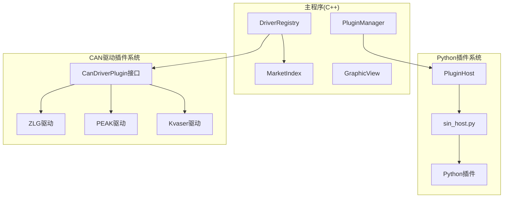
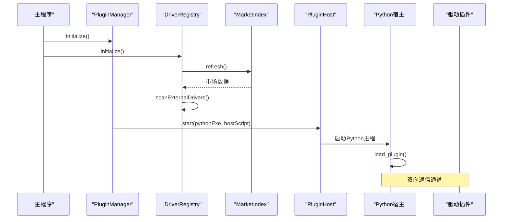
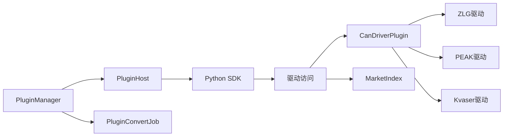

# 插件系统架构

<cite>
**本文引用的文件**
- [pluginmanager.h](file://src/core/plugin/pluginmanager.h)
- [pluginhost.h](file://src/core/plugin/pluginhost.h)
- [pluginconvertjob.h](file://src/core/plugin/pluginconvertjob.h)
- [plugininfo.h](file://src/core/plugin/plugininfo.h)
- [pluginmanager.cpp](file://src/core/plugin/pluginmanager.cpp)
- [pluginconvertjob.cpp](file://src/core/plugin/pluginconvertjob.cpp)
- [extensionstab.h](file://src/ui/extensionstab.h)
- [extensionstab.cpp](file://src/ui/extensionstab.cpp)
- [ui.py](file://sdk/sin/ui.py)
- [sin_host.py](file://scripts/sin_host.py)
- [_transport.py](file://sdk/sin/_transport.py)
- [frames.py](file://sdk/sin/frames.py)
- [__init__.py](file://sdk/sin/__init__.py)
- [graphicview.h](file://src/ui/graphicview.h)
- [graphicview.cpp](file://src/ui/graphicview.cpp)
- [candriverplugin.h](file://src/core/driver/candriverplugin.h)
- [driverregistry.h](file://src/core/driver/driverregistry.h)
- [marketindex.h](file://src/core/driver/marketindex.h)
- [zlg_driver_plugin.h](file://drivers/zlg/zlg_driver_plugin.h)
- [peak_driver_plugin.h](file://drivers/peak/peak_driver_plugin.h)
- [kvaser_driver_plugin.h](file://drivers/kvaser/kvaser_driver_plugin.h)
- [driverregistry.cpp](file://src/core/driver/driverregistry.cpp)
- [marketindex.cpp](file://src/core/driver/marketindex.cpp)
- [make_market.py](file://scripts/make_market.py)
</cite>

## 更新摘要
**变更内容**
- 新增CAN设备驱动插件系统，与现有Python插件系统形成互补的双层插件架构
- 实现了原生C++驱动的QPluginLoader动态加载机制（.odp包支持）
- 添加了驱动注册表（DriverRegistry）统一管理内置和外置驱动
- 集成了设备市场索引（MarketIndex）支持在线驱动发现和下载
- 完善了驱动生命周期管理、热插拔支持和禁用机制
- 增强了驱动安全验证（sha256校验）和版本兼容性检查

## 目录
1. [简介](#简介)
2. [项目结构](#项目结构)
3. [核心组件](#核心组件)
4. [架构总览](#架构总览)
5. [详细组件分析](#详细组件分析)
6. [依赖关系分析](#依赖关系分析)
7. [性能考量](#性能考量)
8. [故障排查指南](#故障排查指南)
9. [结论](#结论)
10. [附录](#附录)

## 简介
本仓库实现了增强的双层插件系统架构。系统现在同时支持两种类型的插件：基于Python的扩展插件和基于C++的原生CAN设备驱动插件。Python插件系统采用VS Code风格的进程隔离架构，而CAN驱动插件系统则使用Qt的QPluginLoader实现原生动态加载。这种双轨制设计既保证了功能扩展性，又确保了硬件驱动的高性能访问。

**更新** 新增了完整的CAN设备驱动插件生态系统，包括驱动注册、市场集成、安全验证和热插拔等高级特性。

## 项目结构
- **Python插件层**：位于 src/core/plugin，包含插件管理器、宿主进程管理和转换任务处理。
- **CAN驱动插件层**：位于 src/core/driver，包含驱动接口定义、注册表和市场索引。
- **具体驱动实现**：位于 drivers/ 目录，包含ZLG、PEAK、Kvaser等厂商驱动插件。
- **UI集成层**：位于 src/ui，包含扩展标签页和设备管理界面。
- **SDK层**：位于 sdk/sin，提供Python插件开发API。
- **工具脚本**：位于 scripts/，包含驱动打包和市场生成工具。

**图表来源**
- [pluginmanager.h:17-171](file://src/core/plugin/pluginmanager.h#L17-L171)
- [driverregistry.h:28-107](file://src/core/driver/driverregistry.h#L28-L107)
- [candriverplugin.h:21-44](file://src/core/driver/candriverplugin.h#L21-L44)

## 核心组件
- **插件管理器（PluginManager）**：完整的Python插件生命周期管理，负责发现、激活、停用、消息分发和进程管理。
- **驱动注册表（DriverRegistry）**：CAN驱动的统一装配点，管理内置和外置驱动的注册、枚举和实例创建。
- **驱动插件接口（CanDriverPlugin）**：标准化的C++驱动插件接口，定义了驱动元数据、设备枚举和实例创建方法。
- **市场索引（MarketIndex）**：设备市场的索引管理，支持在线驱动发现和下载。
- **Python宿主（PluginHost/sin_host.py）**：独立的Python进程，负责插件的动态加载和执行。
- **转换任务（PluginConvertJob）**：后台文件格式转换任务处理器。

**更新** 新增了完整的CAN驱动插件生态系统，形成了Python扩展和C++驱动的双层插件架构。

## 架构总览
当前架构采用双层插件系统设计。上层是Python插件系统，提供应用功能扩展；下层是CAN驱动插件系统，提供硬件设备抽象。两个系统通过统一的接口进行交互，实现了松耦合和高内聚的设计目标。

**图表来源**
- [pluginmanager.cpp:149-195](file://src/core/plugin/pluginmanager.cpp#L149-L195)
- [driverregistry.cpp:95-108](file://src/core/driver/driverregistry.cpp#L95-L108)
- [marketindex.cpp:71-79](file://src/core/driver/marketindex.cpp#L71-L79)

## 详细组件分析

### Python插件系统（原有架构增强）
- **插件管理器（PluginManager）**：完整的单例管理器，负责Python插件的发现、激活、停用、消息分发和进程管理。
- **插件宿主（PluginHost）**：QProcess封装，通过JSON-RPC协议与Python宿主进程通信。
- **转换任务（PluginConvertJob）**：后台线程执行的文件格式转换任务。
- **插件信息（PluginInfo）**：从plugin.json解析的插件元数据。

**更新** 所有Python插件组件都经过了大幅增强，支持更复杂的功能和更好的错误处理。

**章节来源**
- [pluginmanager.h:17-171](file://src/core/plugin/pluginmanager.h#L17-L171)
- [pluginhost.h:22-101](file://src/core/plugin/pluginhost.h#L22-L101)
- [pluginconvertjob.h:19-48](file://src/core/plugin/pluginconvertjob.h#L19-L48)

### CAN驱动插件系统（新增架构）
- **驱动插件接口（CanDriverPlugin）**：标准化的C++驱动插件接口，定义了驱动元数据查询、设备枚举和实例创建方法。
- **驱动注册表（DriverRegistry）**：统一的管理器，负责内置驱动的静态注册和外置驱动的动态加载。
- **市场索引（MarketIndex）**：设备市场的索引管理，支持在线驱动发现和下载。

**更新** 全新的CAN驱动插件系统，提供了完整的驱动生命周期管理和市场集成能力。

**章节来源**
- [candriverplugin.h:21-44](file://src/core/driver/candriverplugin.h#L21-L44)
- [driverregistry.h:28-107](file://src/core/driver/driverregistry.h#L28-L107)
- [marketindex.h:23-93](file://src/core/driver/marketindex.h#L23-L93)

### 具体驱动实现
- **ZLG驱动插件**：致远电子USBCAN系列设备的驱动实现。
- **PEAK驱动插件**：PEAK System PCAN系列设备的驱动实现。
- **Kvaser驱动插件**：Kvaser CANLIB系列设备的驱动实现。

每个驱动插件都实现了CanDriverPlugin接口，提供统一的设备访问抽象。

**章节来源**
- [zlg_driver_plugin.h:15-28](file://drivers/zlg/zlg_driver_plugin.h#L15-L28)
- [peak_driver_plugin.h:15-28](file://drivers/peak/peak_driver_plugin.h#L15-L28)
- [kvaser_driver_plugin.h:15-28](file://drivers/kvaser/kvaser_driver_plugin.h#L15-L28)

### 驱动注册与管理
- **驱动扫描**：自动扫描drivers/<id>/目录下的外置驱动。
- **安全验证**：通过sha256校验确保驱动包的完整性。
- **版本兼容**：检查ABI版本和应用版本兼容性。
- **热插拔支持**：运行时安装和卸载驱动，无需重启应用。
- **禁用机制**：支持临时禁用特定驱动，配置持久化存储。

**章节来源**
- [driverregistry.cpp:110-184](file://src/core/driver/driverregistry.cpp#L110-L184)

### 市场系统集成
- **市场索引**：异步加载market.json，支持本地开发和发布环境。
- **设备搜索**：多关键词AND搜索，支持型号、厂商、标签等多字段检索。
- **驱动下载**：支持从市场直接下载安装驱动包。
- **资源解析**：自动解析相对路径为绝对URL，支持图片和文档资源。

**章节来源**
- [marketindex.cpp:71-185](file://src/core/driver/marketindex.cpp#L71-L185)

### 构建和部署工具
- **市场生成脚本**：自动生成market.json，包含驱动信息和设备详情。
- **驱动打包工具**：将驱动源码和二进制文件打包为标准的.odp格式。
- **资产复制**：自动复制设备图片和文档到市场目录。

**章节来源**
- [make_market.py:130-190](file://scripts/make_market.py#L130-L190)

## 依赖关系分析
- **Python插件依赖**：
  - PluginManager依赖完整的插件接口和进程管理。
  - PluginHost依赖QProcess和JSON-RPC通信。
  - PluginConvertJob依赖CanFileIOFactory和线程管理。
- **CAN驱动插件依赖**：
  - DriverRegistry依赖QPluginLoader和驱动接口。
  - MarketIndex依赖QNetworkAccessManager和网络请求。
  - 具体驱动实现依赖各自的厂商SDK。
- **跨层依赖**：
  - Python插件可以通过SDK访问CAN设备。
  - UI层同时管理Python插件和CAN驱动。

**更新** 新的依赖关系更加复杂，但提供了更完整的功能集和更好的模块化设计。

**图表来源**
- [pluginmanager.h:17-171](file://src/core/plugin/pluginmanager.h#L17-L171)
- [driverregistry.h:28-107](file://src/core/driver/driverregistry.h#L28-L107)
- [candriverplugin.h:21-44](file://src/core/driver/candriverplugin.h#L21-L44)

## 性能考量
- **进程隔离**：Python插件在独立进程中运行，避免影响主程序稳定性。
- **异步处理**：文件格式转换和市场数据加载在后台线程执行，不阻塞UI。
- **资源管理**：自动清理插件资源和进程内存，防止内存泄漏。
- **批处理优化**：帧数据批量传输，减少通信开销。
- **智能缓存**：Python解释器和插件状态缓存，提升启动速度。
- **驱动热插拔**：支持运行时加载和卸载驱动，无需重启应用。
- **网络优化**：市场数据异步加载，支持离线模式。

**更新** 性能优化更加完善，支持大规模数据处理和长时间稳定运行。

## 故障排查指南
- **Python环境检测失败**：检查SIN_PYTHON环境变量或系统PATH中的Python安装。
- **插件加载失败**：检查plugin.json配置和main.py入口文件。
- **进程通信异常**：查看日志输出和JSON-RPC消息。
- **转换任务失败**：检查源文件格式和目标格式支持。
- **驱动加载失败**：检查driver.json配置和驱动包完整性。
- **市场连接失败**：检查网络连接和市场服务器状态。
- **驱动版本不兼容**：检查ABI版本和应用版本要求。
- **内存泄漏**：监控插件资源释放和进程退出。

**更新** 故障排查更加系统化，提供了更详细的错误信息和诊断工具。

## 结论
当前的插件系统采用了完整的双层架构设计，既包含了企业级的Python插件管理能力，又提供了高性能的CAN设备驱动插件系统。通过进程隔离、异步处理、安全验证和完善的错误处理机制，确保了系统的稳定性、可扩展性和易用性。新增的CAN驱动插件系统进一步丰富了应用的硬件支持能力，形成了完整的设备生态。

**更新** 新架构适合生产环境部署，支持复杂的插件生态、大规模数据处理和多种硬件设备接入需求。

## 附录
- **Python插件开发指导**：基于完整的SDK API进行功能扩展开发。
- **CAN驱动开发指导**：基于CanDriverPlugin接口实现硬件设备支持。
- **市场发布流程**：驱动包打包、市场索引更新和发布流程。
- **性能优化建议**：利用异步处理、批处理和缓存机制提升性能。
- **部署指南**：Python环境配置、驱动安装和插件分发策略。
- **故障诊断**：日志分析、调试技巧和常见问题解决方案。

**更新** 提供了完整的生产环境部署、运维指导和故障处理方案。