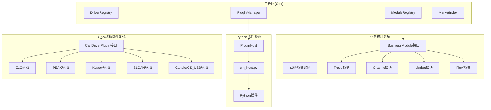
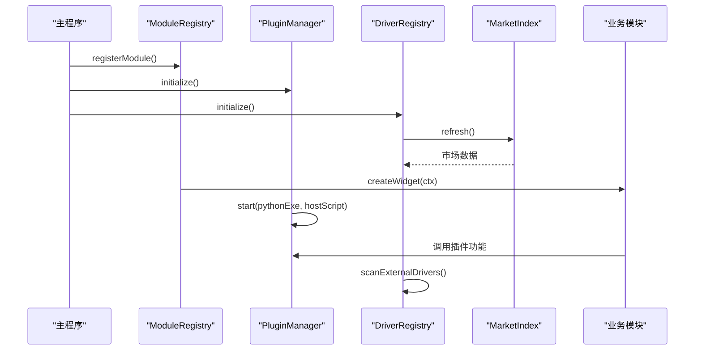
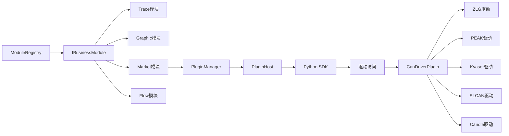

# 插件系统架构

<cite>
**本文引用的文件**
- [imodule.h](file://src/core/module/imodule.h)
- [moduleregistry.h](file://src/core/module/moduleregistry.h)
- [moduleregistry.cpp](file://src/core/module/moduleregistry.cpp)
- [pluginmanager.h](file://src/core/plugin/pluginmanager.h)
- [pluginhost.h](file://src/core/plugin/pluginhost.h)
- [pluginconvertjob.h](file://src/core/plugin/pluginconvertjob.h)
- [plugininfo.h](file://src/core/plugin/plugininfo.h)
- [pluginmanager.cpp](file://src/core/plugin/pluginmanager.cpp)
- [pluginconvertjob.cpp](file://src/core/plugin/pluginconvertjob.cpp)
- [ui.py](file://sdk/sin/ui.py)
- [sin_host.py](file://scripts/sin_host.py)
- [_transport.py](file://sdk/sin/_transport.py)
- [frames.py](file://sdk/sin/frames.py)
- [__init__.py](file://sdk/sin/__init__.py)
- [graphicview.h](file://src/ui/graphicview.h)
- [candriverplugin.h](file://src/core/driver/candriverplugin.h)
- [driverregistry.h](file://src/core/driver/driverregistry.h)
- [marketindex.h](file://src/core/driver/marketindex.h)
- [zlg_driver_plugin.h](file://drivers/zlg/zlg_driver_plugin.h)
- [peak_driver_plugin.h](file://drivers/peak/peak_driver_plugin.h)
- [kvaser_driver_plugin.h](file://drivers/kvaser/kvaser_driver_plugin.h)
- [slcan_driver_plugin.h](file://drivers/slcan/slcan_driver_plugin.h)
- [candle_driver_plugin.h](file://drivers/candle/candle_driver_plugin.h)
- [driverregistry.cpp](file://src/core/driver/driverregistry.cpp)
- [marketindex.cpp](file://src/core/driver/marketindex.cpp)
- [make_market.py](file://scripts/make_market.py)
- [CMakeLists.txt](file://drivers/CMakeLists.txt)
- [slcan_driver_plugin.cpp](file://drivers/slcan/slcan_driver_plugin.cpp)
- [candle_driver_plugin.cpp](file://drivers/candle/candle_driver_plugin.cpp)
- [candevice_slcan.h](file://src/core/candevice_slcan.h)
- [candevice_candle.h](file://src/core/candevice_candle.h)
- [tracemodule.h](file://src/ui/tracemodule.h)
- [graphicmodule.h](file://src/ui/graphicmodule.h)
- [marketmodule.h](file://src/ui/marketmodule.h)
- [marketmodule.cpp](file://src/ui/marketmodule.cpp)
- [main.cpp](file://src/main.cpp)
</cite>

## 更新摘要
**变更内容**
- 新增业务模块系统，实现插件与业务模块的协同工作架构
- 引入IBusinessModule接口和ModuleRegistry注册表，统一管理业务功能模块
- 现有插件系统（Python插件和CAN驱动插件）现在作为业务模块的一部分运行
- 实现了模块化架构，支持动态加载和卸载业务功能
- 增强了插件系统与业务模块之间的通信机制

## 目录
1. [简介](#简介)
2. [项目结构](#项目结构)
3. [核心组件](#核心组件)
4. [架构总览](#架构总览)
5. [详细组件分析](#详细组件分析)
6. [依赖关系分析](#依赖关系分析)
7. [性能考量](#性能考量)
8. [故障排查指南](#故障排查指南)
9. [结论](#结论)
10. [附录](#附录)

## 简介
本仓库实现了增强的双层插件系统架构，现已集成新的业务模块系统。系统现在同时支持三种类型的扩展：基于Python的扩展插件、基于C++的原生CAN设备驱动插件，以及标准化的业务功能模块。Python插件系统采用VS Code风格的进程隔离架构，CAN驱动插件系统使用Qt的QPluginLoader实现原生动态加载，而业务模块系统则通过统一的IBusinessModule接口提供标准化的功能扩展点。这种三轨制设计既保证了功能扩展性，又确保了硬件驱动的高性能访问和业务逻辑的模块化组织。

**更新** 新增了完整的业务模块系统，实现了插件与业务功能的深度集成，形成了更加完善的模块化架构体系。

## 项目结构
- **业务模块层**：位于 src/core/module，包含模块接口定义和注册表管理。
- **Python插件层**：位于 src/core/plugin，包含插件管理器、宿主进程管理和转换任务处理。
- **CAN驱动插件层**：位于 src/core/driver，包含驱动接口定义、注册表和市场索引。
- **具体业务模块**：位于 src/ui，包含Trace、Graphic、Market等具体业务功能模块。
- **具体驱动实现**：位于 drivers/ 目录，包含ZLG、PEAK、Kvaser、SLCAN、Candle等厂商驱动插件。
- **SDK层**：位于 sdk/sin，提供Python插件开发API。
- **工具脚本**：位于 scripts/，包含驱动打包和市场生成工具。

**图表来源**
- [imodule.h:85-171](file://src/core/module/imodule.h#L85-L171)
- [moduleregistry.h:27-50](file://src/core/module/moduleregistry.h#L27-L50)
- [pluginmanager.h:17-171](file://src/core/plugin/pluginmanager.h#L17-L171)
- [driverregistry.h:28-107](file://src/core/driver/driverregistry.h#L28-L107)

## 核心组件
- **业务模块接口（IBusinessModule）**：标准化的业务功能接口，定义了模块标识、标题、图标创建和页面管理能力。
- **模块注册表（ModuleRegistry）**：业务模块的统一装配点，管理所有业务模块的注册、发现和实例创建。
- **插件管理器（PluginManager）**：完整的Python插件生命周期管理，负责发现、激活、停用、消息分发和进程管理。
- **驱动注册表（DriverRegistry）**：CAN驱动的统一装配点，管理内置和外置驱动的注册、枚举和实例创建。
- **驱动插件接口（CanDriverPlugin）**：标准化的C++驱动插件接口，定义了驱动元数据、设备枚举和实例创建方法。
- **市场索引（MarketIndex）**：设备市场的索引管理，支持在线驱动发现和下载。
- **Python宿主（PluginHost/sin_host.py）**：独立的Python进程，负责插件的动态加载和执行。
- **转换任务（PluginConvertJob）**：后台文件格式转换任务处理器。

**更新** 新增了业务模块系统，实现了插件与业务功能的深度集成，提供了更强大的模块化扩展能力。

## 架构总览
当前架构采用三层扩展系统设计。最外层是Python插件系统，提供应用功能扩展；中间层是业务模块系统，提供标准化的业务功能封装；最内层是CAN驱动插件系统，提供硬件设备抽象。三个层次通过统一的接口进行交互，实现了松耦合和高内聚的设计目标。

**图表来源**
- [main.cpp:39-48](file://src/main.cpp#L39-L48)
- [moduleregistry.cpp:9-22](file://src/core/module/moduleregistry.cpp#L9-L22)
- [pluginmanager.cpp:149-195](file://src/core/plugin/pluginmanager.cpp#L149-L195)
- [driverregistry.cpp:95-108](file://src/core/driver/driverregistry.cpp#L95-L108)

## 详细组件分析

### 业务模块系统（新增架构）
- **业务模块接口（IBusinessModule）**：标准化的业务功能接口，定义了模块标识、标题、图标创建、页面管理和动作处理能力。
- **模块上下文（ShellContext）**：壳提供给业务模块的服务入口，包含主窗口、数据层服务和回调函数。
- **模块注册表（ModuleRegistry）**：统一的管理器，负责业务模块的注册、发现和实例创建。
- **多页面支持**：支持单页面和多页面模块，提供灵活的页面管理能力。

**更新** 全新的业务模块系统，提供了标准化的功能扩展点和模块化管理能力。

**章节来源**
- [imodule.h:31-171](file://src/core/module/imodule.h#L31-L171)
- [moduleregistry.h:27-50](file://src/core/module/moduleregistry.h#L27-L50)
- [moduleregistry.cpp:1-32](file://src/core/module/moduleregistry.cpp#L1-L32)

### Python插件系统（原有架构增强）
- **插件管理器（PluginManager）**：完整的单例管理器，负责Python插件的发现、激活、停用、消息分发和进程管理。
- **插件宿主（PluginHost）**：QProcess封装，通过JSON-RPC协议与Python宿主进程通信。
- **转换任务（PluginConvertJob）**：后台线程执行的文件格式转换任务。
- **插件信息（PluginInfo）**：从plugin.json解析的插件元数据。

**更新** Python插件系统现在可以通过业务模块接口与业务功能深度集成，提供更丰富的交互体验。

**章节来源**
- [pluginmanager.h:17-171](file://src/core/plugin/pluginmanager.h#L17-L171)
- [pluginhost.h:22-101](file://src/core/plugin/pluginhost.h#L22-L101)
- [pluginconvertjob.h:19-48](file://src/core/plugin/pluginconvertjob.h#L19-L48)

### CAN驱动插件系统（原有架构增强）
- **驱动插件接口（CanDriverPlugin）**：标准化的C++驱动插件接口，定义了驱动元数据查询、设备枚举和实例创建方法。
- **驱动注册表（DriverRegistry）**：统一的管理器，负责内置驱动的静态注册和外置驱动的动态加载。
- **市场索引（MarketIndex）**：设备市场的索引管理，支持在线驱动发现和下载。

**更新** CAN驱动插件系统现在可以作为业务模块的一部分，提供更好的集成体验和功能扩展能力。

**章节来源**
- [candriverplugin.h:21-44](file://src/core/driver/candriverplugin.h#L21-44)
- [driverregistry.h:28-107](file://src/core/driver/driverregistry.h#L28-L107)
- [marketindex.h:23-93](file://src/core/driver/marketindex.h#L23-L93)

### 具体业务模块实现
- **Trace模块**：CAN总线跟踪和分析功能模块，提供帧过滤、着色规则、书签跳转等功能。
- **Graphic模块**：信号图形化显示模块，支持实时信号波形显示和数据窗口。
- **Market模块**：插件市场功能模块，提供插件的搜索、安装和管理功能。
- **Flow模块**：流程图编辑模块，支持可视化业务流程编排。

每个业务模块都实现了IBusinessModule接口，提供统一的页面管理和动作处理能力。

**章节来源**
- [tracemodule.h:20-62](file://src/ui/tracemodule.h#L20-L62)
- [graphicmodule.h:23-63](file://src/ui/graphicmodule.h#L23-L63)
- [marketmodule.h:18-28](file://src/ui/marketmodule.h#L18-L28)

### 模块注册与管理
- **模块注册**：在main()中通过C工厂函数注册各业务模块。
- **惰性创建**：模块实例采用惰性创建模式，首次访问时才创建。
- **生命周期管理**：模块实例由注册表缓存和管理，避免重复创建。
- **错误处理**：模块创建失败时返回nullptr，不影响其他模块正常运行。

**章节来源**
- [main.cpp:39-48](file://src/main.cpp#L39-L48)
- [moduleregistry.cpp:14-22](file://src/core/module/moduleregistry.cpp#L14-L22)

### 插件与业务模块集成
- **Market模块集成**：Market模块直接调用PluginManager进行插件操作，实现了插件管理与业务界面的无缝集成。
- **双向通信**：业务模块可以通过ShellContext提供的回调函数与插件系统进行通信。
- **事件驱动**：插件状态变化可以触发业务模块的UI更新。
- **资源共享**：插件和业务模块可以共享数据层服务，如DbcManager、DeviceManager等。

**更新** 插件系统现在完全融入业务模块架构，提供了更强大的功能集成能力。

**章节来源**
- [marketmodule.cpp:34-75](file://src/ui/marketmodule.cpp#L34-L75)
- [imodule.h:38-80](file://src/core/module/imodule.h#L38-L80)

### 具体驱动实现
- **ZLG驱动插件**：致远电子USBCAN系列设备的驱动实现。
- **PEAK驱动插件**：PEAK System PCAN系列设备的驱动实现。
- **Kvaser驱动插件**：Kvaser CANLIB系列设备的驱动实现。
- **SLCAN驱动插件**：Lawicel串口文本协议兼容设备的驱动实现。
- **Candle/GS_USB驱动插件**：开源USB CAN协议设备的驱动实现。

每个驱动插件都实现了CanDriverPlugin接口，提供统一的设备访问抽象。

**章节来源**
- [zlg_driver_plugin.h:15-28](file://drivers/zlg/zlg_driver_plugin.h#L15-L28)
- [peak_driver_plugin.h:15-28](file://drivers/peak/peak_driver_plugin.h#L15-L28)
- [kvaser_driver_plugin.h:15-28](file://drivers/kvaser/kvaser_driver_plugin.h#L15-L28)
- [slcan_driver_plugin.h:17-30](file://drivers/slcan/slcan_driver_plugin.h#L17-L30)
- [candle_driver_plugin.h:19-32](file://drivers/candle/candle_driver_plugin.h#L19-L32)

## 依赖关系分析
- **业务模块依赖**：
  - 业务模块依赖IBusinessModule接口和ShellContext服务。
  - ModuleRegistry提供模块的注册和发现机制。
  - 业务模块之间通过ShellContext进行间接通信。
- **Python插件依赖**：
  - PluginManager依赖完整的插件接口和进程管理。
  - PluginHost依赖QProcess和JSON-RPC通信。
  - PluginConvertJob依赖CanFileIOFactory和线程管理。
- **CAN驱动插件依赖**：
  - DriverRegistry依赖QPluginLoader和驱动接口。
  - MarketIndex依赖QNetworkAccessManager和网络请求。
  - 具体驱动实现依赖各自的厂商SDK或协议库。
- **跨层依赖**：
  - Python插件可以通过SDK访问CAN设备和业务模块。
  - UI层同时管理Python插件、业务模块和CAN驱动。

**更新** 新的依赖关系更加清晰，通过业务模块系统实现了更好的解耦和模块化设计。

**图表来源**
- [imodule.h:85-171](file://src/core/module/imodule.h#L85-L171)
- [moduleregistry.h:27-50](file://src/core/module/moduleregistry.h#L27-L50)
- [marketmodule.cpp:34-75](file://src/ui/marketmodule.cpp#L34-L75)
- [driverregistry.h:28-107](file://src/core/driver/driverregistry.h#L28-L107)

## 性能考量
- **进程隔离**：Python插件在独立进程中运行，避免影响主程序稳定性。
- **异步处理**：文件格式转换和市场数据加载在后台线程执行，不阻塞UI。
- **资源管理**：自动清理插件资源和进程内存，防止内存泄漏。
- **批处理优化**：帧数据批量传输，减少通信开销。
- **智能缓存**：Python解释器和插件状态缓存，提升启动速度。
- **驱动热插拔**：支持运行时加载和卸载驱动，无需重启应用。
- **网络优化**：市场数据异步加载，支持离线模式。
- **模块懒加载**：业务模块采用惰性创建，减少启动时间和内存占用。
- **接口优化**：通过ShellContext提供高效的服务访问接口。

**更新** 性能优化更加完善，支持大规模数据处理、长时间稳定运行和高效的模块化管理。

## 故障排查指南
- **Python环境检测失败**：检查SIN_PYTHON环境变量或系统PATH中的Python安装。
- **插件加载失败**：检查plugin.json配置和main.py入口文件。
- **进程通信异常**：查看日志输出和JSON-RPC消息。
- **转换任务失败**：检查源文件格式和目标格式支持。
- **驱动加载失败**：检查driver.json配置和驱动包完整性。
- **市场连接失败**：检查网络连接和市场服务器状态。
- **驱动版本不兼容**：检查ABI版本和应用版本要求。
- **内存泄漏**：监控插件资源释放和进程退出。
- **SLCAN串口问题**：检查串口权限和波特率设置。
- **Candle USB问题**：检查libusb-1.0.dll加载和设备驱动绑定。
- **模块注册失败**：检查C工厂函数和模块ID配置。
- **模块创建异常**：检查ShellContext参数和模块依赖。
- **业务模块通信失败**：检查ShellContext回调函数和模块间通信协议。

**更新** 故障排查更加系统化，提供了更详细的错误信息和诊断工具，特别增加了业务模块相关的故障排查指导。

## 结论
当前的插件系统采用了完整的三层架构设计，既包含了企业级的Python插件管理能力，又提供了高性能的CAN设备驱动插件系统，还新增了标准化的业务模块系统。通过进程隔离、异步处理、安全验证和完善的错误处理机制，确保了系统的稳定性、可扩展性和易用性。新增的业务模块系统实现了插件与业务功能的深度集成，形成了更加完整和灵活的模块化架构体系。

**更新** 新架构适合生产环境部署，支持复杂的插件生态、大规模数据处理、多种硬件设备接入需求和模块化的业务功能扩展。

## 附录
- **Python插件开发指导**：基于完整的SDK API进行功能扩展开发。
- **CAN驱动开发指导**：基于CanDriverPlugin接口实现硬件设备支持。
- **业务模块开发指导**：基于IBusinessModule接口实现业务功能模块。
- **市场发布流程**：驱动包打包、市场索引更新和发布流程。
- **性能优化建议**：利用异步处理、批处理和缓存机制提升性能。
- **部署指南**：Python环境配置、驱动安装、插件分发和业务模块部署策略。
- **故障诊断**：日志分析、调试技巧和常见问题解决方案。
- **模块集成最佳实践**：业务模块与插件系统的集成模式和通信协议。

**更新** 提供了完整的生产环境部署、运维指导和故障处理方案，特别增加了业务模块开发和集成的指导文档。