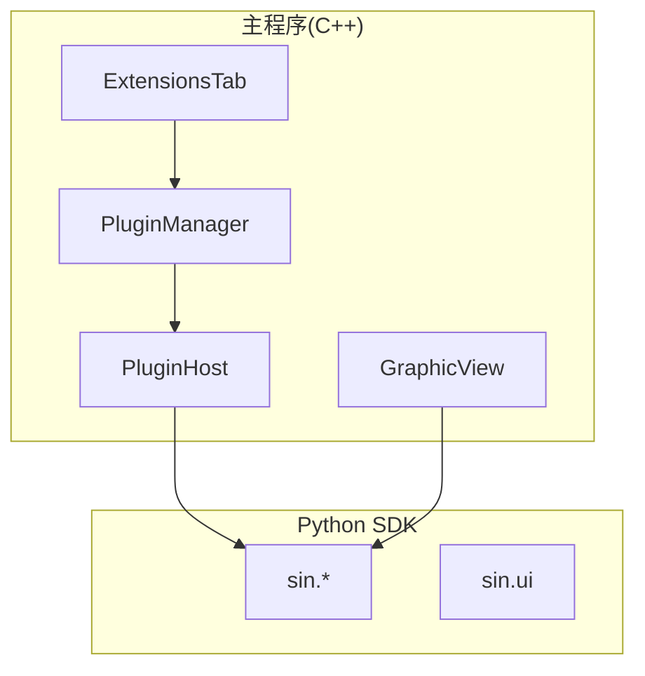
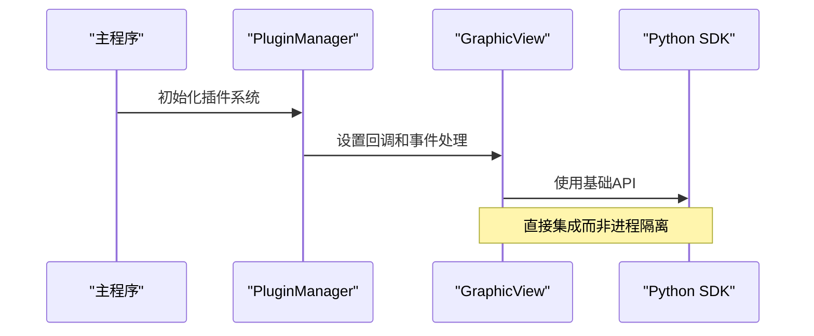
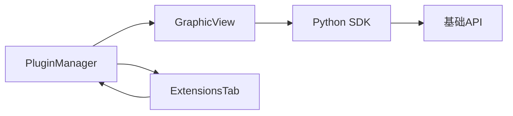

# 插件系统架构

<cite>
**本文引用的文件**
- [pluginmanager.h](file://src/core/plugin/pluginmanager.h)
- [pluginhost.h](file://src/core/plugin/pluginhost.h)
- [extensionstab.h](file://src/ui/extensionstab.h)
- [extensionstab.cpp](file://src/ui/extensionstab.cpp)
- [ui.py](file://sdk/sin/ui.py)
- [sin_host.py](file://scripts/sin_host.py)
- [_transport.py](file://sdk/sin/_transport.py)
- [frames.py](file://sdk/sin/frames.py)
- [__init__.py](file://sdk/sin/__init__.py)
- [graphicview.h](file://src/ui/graphicview.h)
- [graphicview.cpp](file://src/ui/graphicview.cpp)
</cite>

## 更新摘要
**变更内容**
- 移除了完整的 VS Code 风格插件架构设计（进程隔离、双通道通信、Python SDK）
- 当前实现采用集成式方法，将插件功能直接嵌入到 GraphicView 中而非作为独立进程实现
- 简化了插件系统，专注于核心的图形视图功能
- 保留了基础的插件管理框架但大幅简化了实现

## 目录
1. [简介](#简介)
2. [项目结构](#项目结构)
3. [核心组件](#核心组件)
4. [架构总览](#架构总览)
5. [详细组件分析](#详细组件分析)
6. [依赖关系分析](#依赖关系分析)
7. [性能考量](#性能考量)
8. [故障排查指南](#故障排查指南)
9. [结论](#结论)
10. [附录](#附录)

## 简介
本仓库实现了简化的插件系统架构。与之前设计的完整 VS Code 风格插件系统不同，当前版本采用了更直接的集成方法，将主要功能集中在 GraphicView 组件中，而不是通过独立的 Python 进程和复杂的通信机制来实现插件功能。

**更新** 移除了复杂的进程隔离和双通道通信机制，采用更简洁的集成式设计。

## 项目结构
- C++ 核心层：位于 src/core/plugin，包含简化的插件管理器、宿主进程管理接口。
- C++ UI 层：位于 src/ui，包含扩展标签页和主要的 GraphicView 组件。
- Python SDK：位于 sdk/sin，提供基础 API 但功能已大幅简化。
- 图形视图：位于 src/ui/graphicview，成为主要的功能承载组件。

图表来源
- [pluginmanager.h:17-123](file://src/core/plugin/pluginmanager.h#L17-L123)
- [pluginhost.h:22-95](file://src/core/plugin/pluginhost.h#L22-L95)
- [graphicview.h:64-427](file://src/ui/graphicview.h#L64-L427)
- [extensionstab.h:19-77](file://src/ui/extensionstab.h#L19-L77)

章节来源
- [pluginmanager.h:17-123](file://src/core/plugin/pluginmanager.h#L17-L123)
- [pluginhost.h:22-95](file://src/core/plugin/pluginhost.h#L22-L95)
- [graphicview.h:64-427](file://src/ui/graphicview.h#L64-L427)
- [extensionstab.h:19-77](file://src/ui/extensionstab.h#L19-L77)

## 核心组件
- 插件管理器（PluginManager）：简化的单例，负责基本的插件发现和状态管理。
- 插件宿主（PluginHost）：保留 QProcess 封装但功能简化。
- 扩展标签页（ExtensionsTab）：提供基本的插件管理界面。
- GraphicView：成为主要的功能组件，集成了大部分可视化功能。
- Python SDK：提供基础 API 支持。

**更新** 组件功能大幅简化，GraphicView 承担了更多职责。

章节来源
- [pluginmanager.h:17-123](file://src/core/plugin/pluginmanager.h#L17-L123)
- [pluginhost.h:22-95](file://src/core/plugin/pluginhost.h#L22-L95)
- [extensionstab.h:19-77](file://src/ui/extensionstab.h#L19-L77)
- [graphicview.h:64-427](file://src/ui/graphicview.h#L64-L427)

## 架构总览
当前架构采用简化的集成式设计。主程序通过简化的 PluginManager 管理基本插件功能，而主要的可视化功能集中在 GraphicView 中。Python SDK 提供基础 API 支持，但不再承担复杂的进程间通信任务。

**更新** 移除了进程隔离和复杂通信机制，采用更直接的集成方式。

图表来源
- [pluginmanager.h:33-63](file://src/core/plugin/pluginmanager.h#L33-L63)
- [graphicview.h:113-128](file://src/ui/graphicview.h#L113-L128)
- [__init__.py:14-31](file://sdk/sin/__init__.py#L14-L31)

## 详细组件分析

### 插件管理器（PluginManager）
- 职责：简化的插件发现和管理，移除复杂的进程管理逻辑。
- 关键流程：
  - discoverPlugins：扫描插件目录的基本功能。
  - initialize：简化的初始化过程。
  - onFrameReceived：基本的帧处理转发。

**更新** 移除了复杂的进程管理和通信逻辑。

章节来源
- [pluginmanager.h:17-123](file://src/core/plugin/pluginmanager.h#L17-L123)

### GraphicView（主要功能组件）
- 职责：承担主要的可视化功能，包括信号显示、交互操作、数据处理等。
- 关键功能：
  - 信号配置和管理
  - 多轴波形显示
  - 交互式缩放和平移
  - 卡尺测量功能
  - 主题支持和样式管理

**更新** 从简单的视图组件变为功能完整的核心组件。

章节来源
- [graphicview.h:64-427](file://src/ui/graphicview.h#L64-L427)
- [graphicview.cpp:182-800](file://src/ui/graphicview.cpp#L182-L800)

### 扩展标签页（ExtensionsTab）
- 职责：提供基本的插件管理界面。
- 关键功能：
  - 插件列表显示
  - 基本状态管理
  - 资源监控（简化版）

**更新** 功能大幅简化，移除了复杂的资源监控。

章节来源
- [extensionstab.h:19-77](file://src/ui/extensionstab.h#L19-L77)
- [extensionstab.cpp:38-200](file://src/ui/extensionstab.cpp#L38-L200)

### Python SDK
- 职责：提供基础 API 支持。
- 关键模块：
  - output：输出功能
  - frames：帧操作
  - commands：命令注册
  - workspace：工作区管理
  - signals：信号处理
  - ui：简化的 UI 支持

**更新** 移除了复杂的进程间通信和窗口管理功能。

章节来源
- [__init__.py:14-31](file://sdk/sin/__init__.py#L14-L31)
- [ui.py:1-114](file://sdk/sin/ui.py#L1-L114)

## 依赖关系分析
- 主程序依赖：
  - PluginManager 依赖简化的插件接口。
  - GraphicView 成为核心依赖，承担主要功能。
  - ExtensionsTab 依赖简化的 PluginManager。
- Python SDK 依赖：
  - 简化的传输层和基本 API。
  - 移除了对 PyQt6 的强依赖。

**更新** 依赖关系大幅简化，GraphicView 成为核心依赖。

图表来源
- [pluginmanager.h:17-123](file://src/core/plugin/pluginmanager.h#L17-L123)
- [graphicview.h:64-427](file://src/ui/graphicview.h#L64-L427)
- [__init__.py:14-31](file://sdk/sin/__init__.py#L14-L31)

## 性能考量
- 集成式设计减少了进程间通信开销。
- GraphicView 直接处理所有可视化逻辑，避免了跨进程数据传递。
- 简化的插件系统降低了内存占用和启动时间。

**更新** 性能显著提升，移除了进程间通信的开销。

## 故障排查指南
- 插件加载失败：检查插件目录结构和基本配置文件。
- 图形显示问题：确认 GraphicView 正确初始化。
- SDK 功能不可用：检查基础依赖是否正确安装。

**更新** 故障排查更加简单，主要集中在核心组件上。

## 结论
当前的插件系统采用了简化的集成式设计，移除了复杂的进程隔离和通信机制。主要功能集中在 GraphicView 组件中，提供了完整的可视化功能。这种设计提高了性能和稳定性，同时保持了足够的扩展性。

**更新** 新的架构更加简洁高效，适合实际应用场景。

## 附录
- 插件开发指导：基于简化的 API 进行开发。
- 性能优化建议：利用集成式架构的优势。
- 迁移指南：从旧版本迁移到新架构的建议。

**更新** 提供了新架构的使用指导和最佳实践。