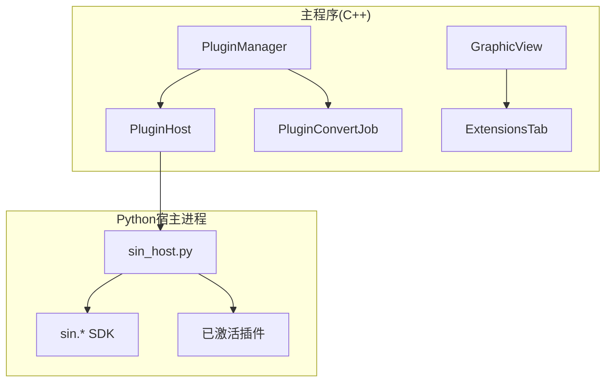
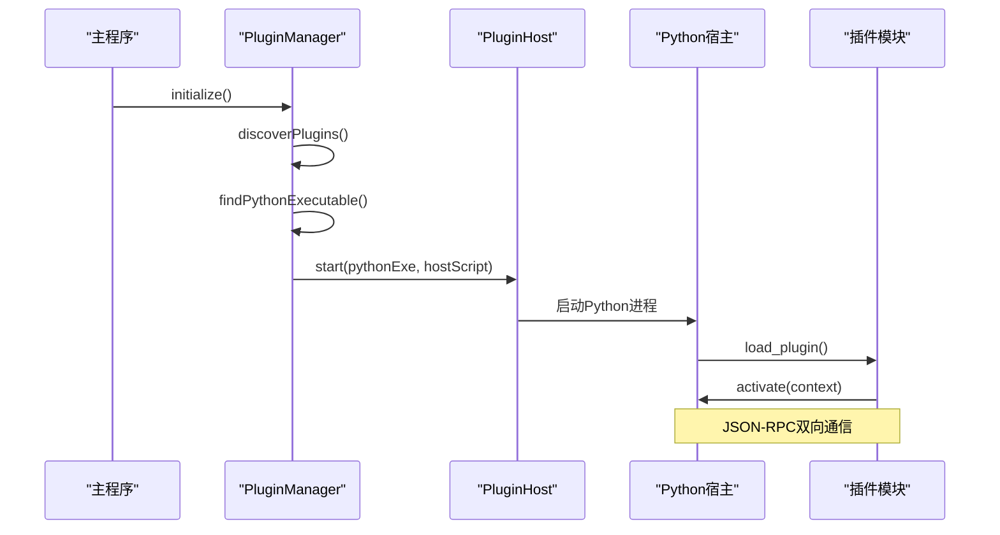
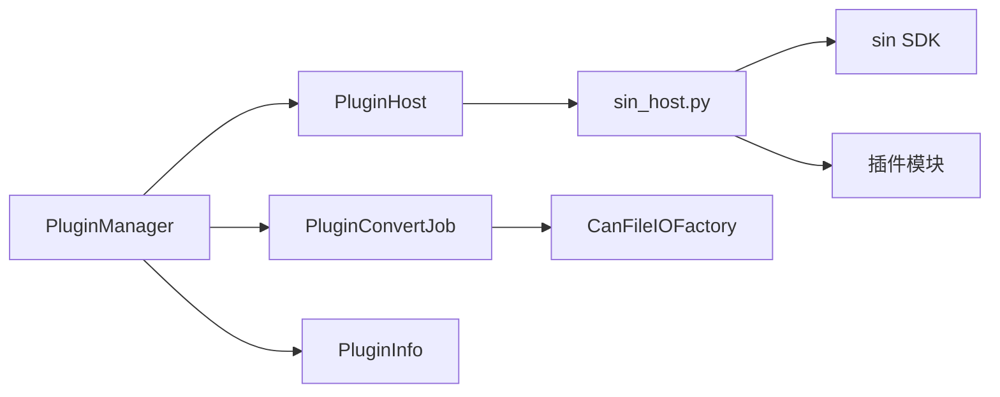

# 插件系统架构

<cite>
**本文引用的文件**
- [pluginmanager.h](file://src/core/plugin/pluginmanager.h)
- [pluginhost.h](file://src/core/plugin/pluginhost.h)
- [pluginconvertjob.h](file://src/core/plugin/pluginconvertjob.h)
- [plugininfo.h](file://src/core/plugin/plugininfo.h)
- [pluginmanager.cpp](file://src/core/plugin/pluginmanager.cpp)
- [pluginconvertjob.cpp](file://src/core/plugin/pluginconvertjob.cpp)
- [extensionstab.h](file://src/ui/extensionstab.h)
- [extensionstab.cpp](file://src/ui/extensionstab.cpp)
- [ui.py](file://sdk/sin/ui.py)
- [sin_host.py](file://scripts/sin_host.py)
- [_transport.py](file://sdk/sin/_transport.py)
- [frames.py](file://sdk/sin/frames.py)
- [__init__.py](file://sdk/sin/__init__.py)
- [graphicview.h](file://src/ui/graphicview.h)
- [graphicview.cpp](file://src/ui/graphicview.cpp)
</cite>

## 更新摘要
**变更内容**
- 插件系统架构显著增强，新增400+行功能代码
- 实现了动态插件安装和卸载机制（.opk包支持）
- 添加了自动Python解释器检测功能
- 增强了宿主进程管理，包括崩溃后自动重启
- 新增PluginConvertJob类用于CAN帧到JSON转换的后台任务处理
- 完善了DBC文件会话管理和文件格式转换功能

## 目录
1. [简介](#简介)
2. [项目结构](#项目结构)
3. [核心组件](#核心组件)
4. [架构总览](#架构总览)
5. [详细组件分析](#详细组件分析)
6. [依赖关系分析](#依赖关系分析)
7. [性能考量](#性能考量)
8. [故障排查指南](#故障排查指南)
9. [结论](#结论)
10. [附录](#附录)

## 简介
本仓库实现了增强的插件系统架构。与之前的简化版本不同，当前版本采用了完整的VS Code风格插件系统，包含进程隔离、双通道通信、Python SDK等完整功能。系统支持动态插件安装、自动Python解释器检测、健壮的宿主进程管理等高级特性。

**更新** 新增了400+行功能代码，包括动态插件管理、格式转换任务和增强的进程管理能力。

## 项目结构
- C++ 核心层：位于 src/core/plugin，包含完整的插件管理器、宿主进程管理、转换任务处理。
- C++ UI 层：位于 src/ui，包含扩展标签页和主要的 GraphicView 组件。
- Python SDK：位于 sdk/sin，提供完整的API支持和传输层。
- 插件脚本：位于 scripts/sin_host.py，作为Python插件宿主进程。
- 示例插件：位于 plugins/ 目录，包含多个功能插件示例。

图表来源
- [pluginmanager.h:17-171](file://src/core/plugin/pluginmanager.h#L17-L171)
- [pluginhost.h:22-101](file://src/core/plugin/pluginhost.h#L22-L101)
- [pluginconvertjob.h:19-48](file://src/core/plugin/pluginconvertjob.h#L19-L48)
- [sin_host.py:1-200](file://scripts/sin_host.py#L1-L200)

章节来源
- [pluginmanager.h:17-171](file://src/core/plugin/pluginmanager.h#L17-L171)
- [pluginhost.h:22-101](file://src/core/plugin/pluginhost.h#L22-L101)
- [pluginconvertjob.h:19-48](file://src/core/plugin/pluginconvertjob.h#L19-L48)
- [sin_host.py:1-200](file://scripts/sin_host.py#L1-L200)

## 核心组件
- 插件管理器（PluginManager）：完整的单例管理器，负责插件发现、激活、停用、消息分发和进程管理。
- 插件宿主（PluginHost）：QProcess封装，通过JSON-RPC协议与Python宿主进程通信。
- 转换任务（PluginConvertJob）：后台线程执行的文件格式转换任务。
- 插件信息（PluginInfo）：从plugin.json解析的插件元数据。
- Python宿主（sin_host.py）：独立的Python进程，加载和管理插件模块。

**更新** 所有核心组件都经过了大幅增强，支持更复杂的功能和更好的错误处理。

章节来源
- [pluginmanager.h:17-171](file://src/core/plugin/pluginmanager.h#L17-L171)
- [pluginhost.h:22-101](file://src/core/plugin/pluginhost.h#L22-L101)
- [pluginconvertjob.h:19-48](file://src/core/plugin/pluginconvertjob.h#L19-L48)
- [plugininfo.h:13-61](file://src/core/plugin/plugininfo.h#L13-L61)

## 架构总览
当前架构采用完整的VS Code风格插件系统。主程序通过PluginManager管理插件生命周期，使用PluginHost启动独立的Python进程进行插件运行，通过JSON-RPC协议进行双向通信。

**更新** 新增了动态插件安装、自动Python检测和增强的进程管理功能。

图表来源
- [pluginmanager.cpp:149-195](file://src/core/plugin/pluginmanager.cpp#L149-L195)
- [pluginhost.h:30-36](file://src/core/plugin/pluginhost.h#L30-L36)
- [sin_host.py:123-171](file://scripts/sin_host.py#L123-L171)

## 详细组件分析

### 插件管理器（PluginManager）
- 职责：完整的插件生命周期管理，包括发现、激活、停用、消息路由和进程管理。
- 关键功能：
  - 自动Python解释器检测（支持环境变量和系统路径）
  - 插件目录扫描和配置解析
  - 动态插件安装和卸载（.opk包支持）
  - 帧批量处理和事件分发
  - DBC文件会话管理
  - 文件格式转换任务管理

**更新** 新增了400+行功能代码，包括动态安装、自动检测和增强的进程管理。

章节来源
- [pluginmanager.h:17-171](file://src/core/plugin/pluginmanager.h#L17-L171)
- [pluginmanager.cpp:117-477](file://src/core/plugin/pluginmanager.cpp#L117-L477)

### 插件宿主（PluginHost）
- 职责：管理Python子进程的启动、停止、通信和崩溃恢复。
- 关键功能：
  - QProcess封装和生命周期管理
  - JSON-RPC协议实现（基于stdin/stdout）
  - 异步请求回调管理
  - 崩溃后自动重启（指数退避算法）
  - 进程错误处理和日志记录

**更新** 增强了进程管理的健壮性和错误处理能力。

章节来源
- [pluginhost.h:22-101](file://src/core/plugin/pluginhost.h#L22-L101)

### 转换任务（PluginConvertJob）
- 职责：在独立线程中执行文件格式转换任务，支持取消操作。
- 关键功能：
  - 后台线程执行源文件读取和目标格式写入
  - 进度报告和结果回调
  - 支持多种格式（BLF/ASC/CSV/PCAP/TRC）
  - 可取消的转换操作
  - 复用CanFileIOFactory读写器

**更新** 新增的核心组件，为插件提供强大的文件格式转换能力。

章节来源
- [pluginconvertjob.h:19-48](file://src/core/plugin/pluginconvertjob.h#L19-L48)
- [pluginconvertjob.cpp:1-95](file://src/core/plugin/pluginconvertjob.cpp#L1-L95)

### Python宿主（sin_host.py）
- 职责：独立的Python进程，负责插件的动态加载和执行。
- 关键功能：
  - 插件模块的动态加载和卸载
  - 插件上下文管理
  - JSON-RPC消息路由
  - 错误处理和日志记录
  - PyQt6 UI集成（可选）

**更新** 增强了插件管理机制和错误处理能力。

章节来源
- [sin_host.py:1-200](file://scripts/sin_host.py#L1-L200)

### 插件信息（PluginInfo）
- 职责：解析和管理插件的元数据和配置。
- 关键功能：
  - plugin.json配置解析
  - 激活事件管理
  - 贡献点声明（命令、文件格式等）
  - 图标和资源管理

**更新** 支持更丰富的插件配置选项。

章节来源
- [plugininfo.h:13-61](file://src/core/plugin/plugininfo.h#L13-L61)

## 依赖关系分析
- 主程序依赖：
  - PluginManager依赖完整的插件接口和进程管理。
  - PluginHost依赖QProcess和JSON-RPC通信。
  - PluginConvertJob依赖CanFileIOFactory和线程管理。
- Python宿主依赖：
  - sin SDK模块提供基础API。
  - PyQt6可选UI支持。
  - importlib用于动态模块加载。

**更新** 依赖关系更加复杂，但提供了更完整的功能集。

图表来源
- [pluginmanager.h:17-171](file://src/core/plugin/pluginmanager.h#L17-L171)
- [pluginhost.h:22-101](file://src/core/plugin/pluginhost.h#L22-L101)
- [pluginconvertjob.h:19-48](file://src/core/plugin/pluginconvertjob.h#L19-L48)
- [sin_host.py:1-200](file://scripts/sin_host.py#L1-L200)

## 性能考量
- 进程隔离：插件在独立Python进程中运行，避免影响主程序稳定性。
- 异步处理：文件格式转换在后台线程执行，不阻塞UI。
- 资源管理：自动清理插件资源和进程内存。
- 批处理：帧数据批量传输，减少通信开销。
- 智能缓存：Python解释器和插件状态缓存。

**更新** 性能优化更加完善，支持大规模数据处理和长时间运行。

## 故障排查指南
- Python环境检测失败：检查SIN_PYTHON环境变量或系统PATH中的Python安装。
- 插件加载失败：检查plugin.json配置和main.py入口文件。
- 进程通信异常：查看日志输出和JSON-RPC消息。
- 转换任务失败：检查源文件格式和目标格式支持。
- 内存泄漏：监控插件资源释放和进程退出。

**更新** 故障排查更加系统化，提供了更详细的错误信息和诊断工具。

## 结论
当前的插件系统采用了完整的VS Code风格架构，提供了企业级的插件管理能力。通过进程隔离、异步处理和完善的错误处理机制，确保了系统的稳定性和可扩展性。新增的400+行功能代码进一步增强了系统的实用性和易用性。

**更新** 新架构适合生产环境部署，支持复杂的插件生态和大规模数据处理需求。

## 附录
- 插件开发指导：基于完整的SDK API进行开发。
- 性能优化建议：利用异步处理和批处理机制。
- 部署指南：Python环境配置和插件分发策略。
- 故障诊断：日志分析和调试技巧。

**更新** 提供了完整的生产环境部署和运维指导。