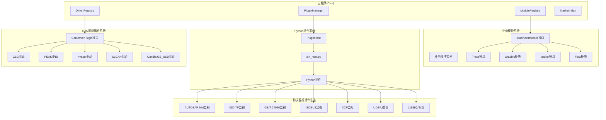
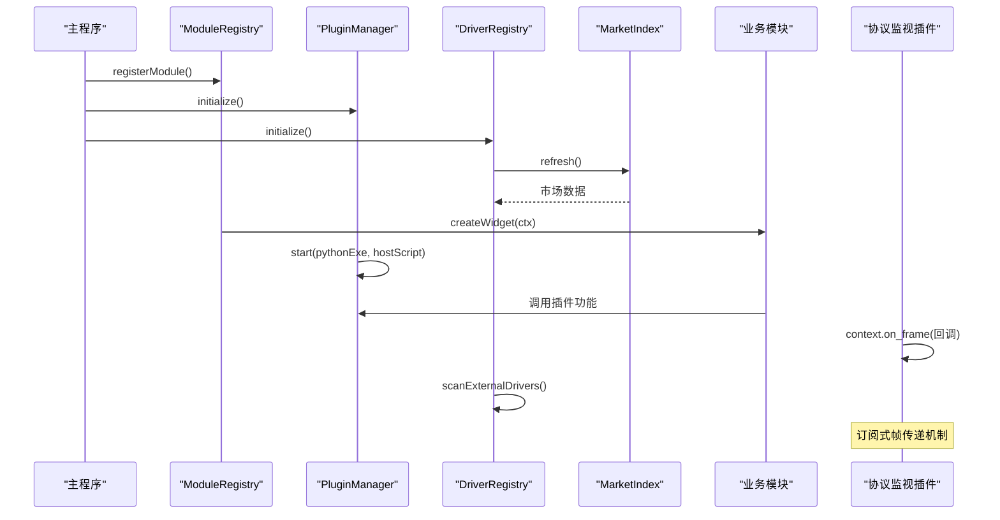

# 插件系统架构

<cite>
**本文引用的文件**
- [imodule.h](file://src/core/module/imodule.h)
- [moduleregistry.h](file://src/core/module/moduleregistry.h)
- [moduleregistry.cpp](file://src/core/module/moduleregistry.cpp)
- [pluginmanager.h](file://src/core/plugin/pluginmanager.h)
- [pluginhost.h](file://src/core/plugin/pluginhost.h)
- [pluginconvertjob.h](file://src/core/plugin/pluginconvertjob.h)
- [plugininfo.h](file://src/core/plugin/plugininfo.h)
- [pluginmanager.cpp](file://src/core/plugin/pluginmanager.cpp)
- [pluginconvertjob.cpp](file://src/core/plugin/pluginconvertjob.cpp)
- [ui.py](file://sdk/sin/ui.py)
- [sin_host.py](file://scripts/sin_host.py)
- [_transport.py](file://sdk/sin/_transport.py)
- [frames.py](file://sdk/sin/frames.py)
- [__init__.py](file://sdk/sin/__init__.py)
- [signals.py](file://sdk/sin/signals.py)
- [commands.py](file://sdk/sin/commands.py)
- [output.py](file://sdk/sin/output.py)
- [graphicview.h](file://src/ui/graphicview.h)
- [candriverplugin.h](file://src/core/driver/candriverplugin.h)
- [driverregistry.h](file://src/core/driver/driverregistry.h)
- [marketindex.h](file://src/core/driver/marketindex.h)
- [zlg_driver_plugin.h](file://drivers/zlg/zlg_driver_plugin.h)
- [peak_driver_plugin.h](file://drivers/peak/peak_driver_plugin.h)
- [kvaser_driver_plugin.h](file://drivers/kvaser/kvaser_driver_plugin.h)
- [slcan_driver_plugin.h](file://drivers/slcan/slcan_driver_plugin.h)
- [candle_driver_plugin.h](file://drivers/candle/candle_driver_plugin.h)
- [driverregistry.cpp](file://src/core/driver/driverregistry.cpp)
- [marketindex.cpp](file://src/core/driver/marketindex.cpp)
- [make_market.py](file://scripts/make_market.py)
- [CMakeLists.txt](file://drivers/CMakeLists.txt)
- [slcan_driver_plugin.cpp](file://drivers/slcan/slcan_driver_plugin.cpp)
- [candle_driver_plugin.cpp](file://drivers/candle/candle_driver_plugin.cpp)
- [candevice_slcan.h](file://src/core/candevice_slcan.h)
- [candevice_candle.h](file://src/core/candevice_candle.h)
- [tracemodule.h](file://src/ui/tracemodule.h)
- [graphicmodule.h](file://src/ui/graphicmodule.h)
- [marketmodule.h](file://src/ui/marketmodule.h)
- [marketmodule.cpp](file://src/ui/marketmodule.cpp)
- [main.cpp](file://src/main.cpp)
- [mainwindow.cpp](file://src/ui/mainwindow.cpp)
- [测试报告.md](file://doc/测试报告.md)
- [autosar-nm-monitor main.py](file://plugins/autosar-nm-monitor/main.py)
- [iso-tp-monitor main.py](file://plugins/iso-tp-monitor/main.py)
- [gbt27930-monitor main.py](file://plugins/gbt27930-monitor/main.py)
- [isobus-monitor main.py](file://plugins/isobus-monitor/main.py)
- [xcp-monitor main.py](file://plugins/xcp-monitor/main.py)
- [uds-scan main.py](file://plugins/uds-scan/main.py)
- [j1939-analyzer main.py](file://plugins/j1939-analyzer/main.py)
- [isotp_client.py](file://plugins/_shared/isotp_client.py)
</cite>

## 更新摘要
**变更内容**
- 新增订阅式帧传递机制，支持多种协议监视插件（AUTOSAR NM、ISO-TP、GB/T 27930、ISOBUS、XCP等）
- 实现缓冲区管理机制，支持多帧重组和会话状态跟踪
- 改进控制链路完整性，提供完整的ISO-TP客户端实现
- 扩展插件生态系统，新增大量协议分析和诊断工具插件
- 增强SDK功能，提供更丰富的CAN帧操作和信号解码API

## 目录
1. [简介](#简介)
2. [项目结构](#项目结构)
3. [核心组件](#核心组件)
4. [架构总览](#架构总览)
5. [详细组件分析](#详细组件分析)
6. [依赖关系分析](#依赖关系分析)
7. [性能考量](#性能考量)
8. [故障排查指南](#故障排查指南)
9. [结论](#结论)
10. [附录](#附录)

## 简介
本仓库实现了增强的双层插件系统架构，现已集成新的业务模块系统和扩展的协议监视生态。系统现在同时支持三种类型的扩展：基于Python的扩展插件、基于C++的原生CAN设备驱动插件，以及标准化的业务功能模块。Python插件系统采用VS Code风格的进程隔离架构，CAN驱动插件系统使用Qt的QPluginLoader实现原生动态加载，而业务模块系统则通过统一的IBusinessModule接口提供标准化的功能扩展点。

**重大更新** 新增了完整的协议监视生态系统，包括AUTOSAR网络管理监视、ISO-TP会话监视、GB/T 27930国标充电协议监视、ISOBUS农机总线监视、XCP标定测量协议监视等。这些插件通过统一的context.on_frame订阅机制接收实时帧数据，实现了被动监视和数据解析功能。同时增强了SDK功能，提供了更完善的CAN帧操作、信号解码和UI界面API。

## 项目结构
- **业务模块层**：位于 src/core/module，包含模块接口定义和注册表管理。
- **Python插件层**：位于 src/core/plugin，包含插件管理器、宿主进程管理和转换任务处理。
- **CAN驱动插件层**：位于 src/core/driver，包含驱动接口定义、注册表和市场索引。
- **协议监视插件**：位于 plugins/ 目录，包含各种协议分析和诊断工具。
- **具体业务模块**：位于 src/ui，包含Trace、Graphic、Market等具体业务功能模块。
- **具体驱动实现**：位于 drivers/ 目录，包含ZLG、PEAK、Kvaser、SLCAN、Candle等厂商驱动插件。
- **SDK层**：位于 sdk/sin，提供Python插件开发API。
- **工具脚本**：位于 scripts/，包含驱动打包和市场生成工具。



**图表来源**
- [imodule.h:85-171](file://src/core/module/imodule.h#L85-L171)
- [moduleregistry.h:27-50](file://src/core/module/moduleregistry.h#L27-L50)
- [pluginmanager.h:17-171](file://src/core/plugin/pluginmanager.h#L17-L171)
- [driverregistry.h:28-107](file://src/core/driver/driverregistry.h#L28-L107)

## 核心组件
- **业务模块接口（IBusinessModule）**：标准化的业务功能接口，定义了模块标识、标题、图标创建和页面管理能力。
- **模块注册表（ModuleRegistry）**：业务模块的统一装配点，管理所有业务模块的注册、发现和实例创建。
- **插件管理器（PluginManager）**：完整的Python插件生命周期管理，负责发现、激活、停用、消息分发和进程管理。
- **驱动注册表（DriverRegistry）**：CAN驱动的统一装配点，管理内置和外置驱动的注册、枚举和实例创建。
- **驱动插件接口（CanDriverPlugin）**：标准化的C++驱动插件接口，定义了驱动元数据、设备枚举和实例创建方法。
- **市场索引（MarketIndex）**：设备市场的索引管理，支持在线驱动发现和下载。
- **Python宿主（PluginHost/sin_host.py）**：独立的Python进程，负责插件的动态加载和执行。
- **转换任务（PluginConvertJob）**：后台文件格式转换任务处理器。
- **协议监视框架**：基于context.on_frame的订阅式帧传递机制，支持多种协议的被动监视。

**重大更新** 新增了协议监视生态系统，提供了完整的CAN总线协议分析和诊断工具集。通过统一的订阅机制，插件可以被动接收和处理总线上的帧数据，无需主动发送请求。

## 架构总览
当前架构采用三层扩展系统设计。最外层是Python插件系统，提供应用功能扩展；中间层是业务模块系统，提供标准化的业务功能封装；最内层是CAN驱动插件系统，提供硬件设备抽象。三个层次通过统一的接口进行交互，实现了松耦合和高内聚的设计目标。



**图表来源**
- [main.cpp:39-48](file://src/main.cpp#L39-L48)
- [moduleregistry.cpp:9-22](file://src/core/module/moduleregistry.cpp#L9-L22)
- [pluginmanager.cpp:149-195](file://src/core/plugin/pluginmanager.cpp#L149-L195)
- [driverregistry.cpp:95-108](file://src/core/driver/driverregistry.cpp#L95-L108)

## 详细组件分析

### 协议监视生态系统（新增架构）
- **AUTOSAR NM监视插件**：监控AUTOSAR CAN网络管理报文，支持节点状态机推断和超时检测。
- **ISO-TP监视插件**：被动解码ISO-TP会话，支持SF/FF/CF/FC全识别和多帧重组。
- **GB/T 27930监视插件**：监控国标充电协议，支持BMS与充电机的双向通信解析。
- **ISOBUS监视插件**：监控农机总线协议，支持地址声明和传输协议重组。
- **XCP监视插件**：监控标定测量协议，支持CTO/DTO命令识别和统计。
- **UDS扫描器插件**：主动扫描ECU诊断服务，支持ISO-TP完整实现。
- **J1939分析器插件**：分析SAE J1939协议，支持PGN解码和故障码解析。

**更新** 全新的协议监视生态系统，提供了全面的CAN总线协议分析和诊断能力。

**章节来源**
- [autosar-nm-monitor main.py:1-269](file://plugins/autosar-nm-monitor/main.py#L1-L269)
- [iso-tp-monitor main.py:1-293](file://plugins/iso-tp-monitor/main.py#L1-L293)
- [gbt27930-monitor main.py:1-390](file://plugins/gbt27930-monitor/main.py#L1-L390)
- [isobus-monitor main.py:1-349](file://plugins/isobus-monitor/main.py#L1-L349)
- [xcp-monitor main.py:1-266](file://plugins/xcp-monitor/main.py#L1-L266)
- [uds-scan main.py:1-434](file://plugins/uds-scan/main.py#L1-L434)
- [j1939-analyzer main.py:1-458](file://plugins/j1939-analyzer/main.py#L1-L458)

### 订阅式帧传递机制（新增架构）
- **context.on_frame回调**：插件通过注册回调函数接收实时帧数据。
- **批量推送机制**：约100ms批量推送帧数据，减少通信开销。
- **帧对象封装**：Frame类提供id、data、timestamp等标准属性。
- **方向识别**：自动识别Rx/Tx方向，便于双向通信分析。
- **通道支持**：支持多通道CAN设备的帧过滤和处理。

**更新** 全新的订阅式机制，为协议监视插件提供了高效的帧数据处理能力。

**章节来源**
- [frames.py:9-37](file://sdk/sin/frames.py#L9-L37)
- [autosar-nm-monitor main.py:187](file://plugins/autosar-nm-monitor/main.py#L187)
- [iso-tp-monitor main.py:192](file://plugins/iso-tp-monitor/main.py#L192)

### 缓冲区管理机制（新增架构）
- **会话状态跟踪**：按CAN ID或源地址跟踪协议会话状态。
- **多帧重组**：支持ISO-TP、J1939等协议的多帧数据重组。
- **超时检测**：自动检测会话超时并清理无效状态。
- **内存管理**：限制缓冲区大小，防止内存泄漏。
- **状态机实现**：实现复杂协议的状态机逻辑。

**更新** 完善的缓冲区管理，支持复杂协议的多帧处理和状态跟踪。

**章节来源**
- [iso-tp-monitor main.py:17-24](file://plugins/iso-tp-monitor/main.py#L17-L24)
- [gbt27930-monitor main.py:46-52](file://plugins/gbt27930-monitor/main.py#L46-L52)
- [isobus-monitor main.py:52-58](file://plugins/isobus-monitor/main.py#L52-L58)
- [j1939-analyzer main.py:91-97](file://plugins/j1939-analyzer/main.py#L91-L97)

### 控制链路完整性（新增架构）
- **ISO-TP客户端实现**：完整的ISO 15765-2协议栈实现。
- **流控处理**：支持CTS/WAIT/OVFLW流控帧处理。
- **超时管理**：合理的超时检测和重传机制。
- **错误恢复**：异常情况的自动恢复和错误处理。
- **线程安全**：基于Qt QTimer的事件驱动模型。

**更新** 完整的控制链路实现，确保诊断通信的可靠性和稳定性。

**章节来源**
- [uds-scan main.py:28-205](file://plugins/uds-scan/main.py#L28-L205)
- [isotp_client.py:25-214](file://plugins/_shared/isotp_client.py#L25-L214)

### SDK功能增强（原有架构增强）
- **Frames API**：提供帧获取、发送和选择功能。
- **Signals API**：DBC信号解码和编码功能。
- **Commands API**：执行主程序注册的命令。
- **Output API**：输出面板文本显示功能。
- **UI API**：PyQt6窗口创建和管理功能。

**更新** SDK功能大幅增强，为插件开发提供了更强大的工具集。

**章节来源**
- [frames.py:39-92](file://sdk/sin/frames.py#L39-L92)
- [signals.py:9-56](file://sdk/sin/signals.py#L9-L56)
- [commands.py:9-23](file://sdk/sin/commands.py#L9-L23)
- [output.py:9-26](file://sdk/sin/output.py#L9-L26)
- [ui.py:62-114](file://sdk/sin/ui.py#L62-L114)

### 业务模块系统（原有架构增强）
- **业务模块接口（IBusinessModule）**：标准化的业务功能接口，定义了模块标识、标题、图标创建、页面管理和动作处理能力。
- **模块上下文（ShellContext）**：壳提供给业务模块的服务入口，包含主窗口、数据层服务和回调函数。
- **模块注册表（ModuleRegistry）**：统一的管理器，负责业务模块的注册、发现和实例创建。
- **多页面支持**：支持单页面和多页面模块，提供灵活的页面管理能力。

**更新** 业务模块系统与协议监视插件深度集成，提供了更丰富的交互体验。

**章节来源**
- [imodule.h:31-171](file://src/core/module/imodule.h#L31-L171)
- [moduleregistry.h:27-50](file://src/core/module/moduleregistry.h#L27-L50)
- [moduleregistry.cpp:1-32](file://src/core/module/moduleregistry.cpp#L1-L32)

### Python插件系统（原有架构增强）
- **插件管理器（PluginManager）**：完整的单例管理器，负责Python插件的发现、激活、停用、消息分发和进程管理。
- **插件宿主（PluginHost）**：QProcess封装，通过JSON-RPC协议与Python宿主进程通信。
- **转换任务（PluginConvertJob）**：后台线程执行的文件格式转换任务。
- **插件信息（PluginInfo）**：从plugin.json解析的插件元数据。

**更新** Python插件系统现在可以通过业务模块接口与业务功能深度集成，提供更丰富的交互体验。同时修复了DLL宿主退出时的崩溃问题，通过qApp aboutToQuit连接实现优雅关闭。

**章节来源**
- [pluginmanager.h:17-171](file://src/core/plugin/pluginmanager.h#L17-L171)
- [pluginhost.h:22-101](file://src/core/plugin/pluginhost.h#L22-L101)
- [pluginconvertjob.h:19-48](file://src/core/plugin/pluginconvertjob.h#L19-L48)
- [pluginmanager.cpp:54-62](file://src/core/plugin/pluginmanager.cpp#L54-L62)
- [pluginmanager.cpp:185-191](file://src/core/plugin/pluginmanager.cpp#L185-L191)

### CAN驱动插件系统（原有架构增强）
- **驱动插件接口（CanDriverPlugin）**：标准化的C++驱动插件接口，定义了驱动元数据查询、设备枚举和实例创建方法。
- **驱动注册表（DriverRegistry）**：统一的管理器，负责内置驱动的静态注册和外置驱动的动态加载。
- **市场索引（MarketIndex）**：设备市场的索引管理，支持在线驱动发现和下载。

**更新** CAN驱动插件系统现在可以作为业务模块的一部分，提供更好的集成体验和功能扩展能力。

**章节来源**
- [candriverplugin.h:21-44](file://src/core/driver/candriverplugin.h#L21-44)
- [driverregistry.h:28-107](file://src/core/driver/driverregistry.h#L28-L107)
- [marketindex.h:23-93](file://src/core/driver/marketindex.h#L23-L93)

### DLL宿主稳定性改进（原有架构增强）
- **优雅关闭机制**：通过qApp aboutToQuit信号连接实现插件宿主的优雅关闭，避免DLL卸载阶段的loader lock崩溃。
- **单例泄漏策略**：有意保持PluginManager单例不析构，防止在DLL_PROCESS_DETACH阶段触发危险操作。
- **跨DLL信号连接修复**：将45处跨DLL的信号连接从成员函数指针形式迁移到字符串SIGNAL()/SLOT()语法，解决MinGW下PMF解析失败问题。

**更新** 这些改进显著提升了系统在DLL宿主环境下的稳定性，消除了退出时崩溃和信号连接失效等严重问题。

**章节来源**
- [pluginmanager.cpp:54-62](file://src/core/plugin/pluginmanager.cpp#L54-L62)
- [pluginmanager.cpp:185-191](file://src/core/plugin/pluginmanager.cpp#L185-L191)
- [mainwindow.cpp:109-122](file://src/ui/mainwindow.cpp#L109-L122)
- [测试报告.md:118-148](file://doc/测试报告.md#L118-L148)

## 依赖关系分析
- **业务模块依赖**：
  - 业务模块依赖IBusinessModule接口和ShellContext服务。
  - ModuleRegistry提供模块的注册和发现机制。
  - 业务模块之间通过ShellContext进行间接通信。
- **Python插件依赖**：
  - PluginManager依赖完整的插件接口和进程管理。
  - PluginHost依赖QProcess和JSON-RPC通信。
  - PluginConvertJob依赖CanFileIOFactory和线程管理。
- **协议监视插件依赖**：
  - 依赖sin.frames进行帧订阅和发送。
  - 依赖PyQt6进行UI界面渲染。
  - 依赖自定义协议解析库进行数据解码。
- **CAN驱动插件依赖**：
  - DriverRegistry依赖QPluginLoader和驱动接口。
  - MarketIndex依赖QNetworkAccessManager和网络请求。
  - 具体驱动实现依赖各自的厂商SDK或协议库。
- **跨层依赖**：
  - Python插件可以通过SDK访问CAN设备和业务模块。
  - UI层同时管理Python插件、业务模块和CAN驱动。

**更新** 新的依赖关系更加清晰，通过协议监视生态系统实现了更好的解耦和模块化设计。同时通过字符串信号连接解决了跨DLL依赖的通信问题。

```mermaid
graph LR
MR["ModuleRegistry"] --> IM["IBusinessModule"]
IM --> TM["Trace模块"]
IM --> GM["Graphic模块"]
IM --> MM["Market模块"]
IM --> FM["Flow模块"]
MM --> PM["PluginManager"]
PM --> PH["PluginHost"]
PH --> SDK["Python SDK"]
SDK --> FRAMES["Frames API"]
SDK --> SIGNALS["Signals API"]
SDK --> OUTPUT["Output API"]
FRAMES --> PMS["协议监视插件"]
PMS --> AUTOSAR["AUTOSAR NM"]
PMS --> ISOTP["ISO-TP"]
PMS --> GBT["GB/T 27930"]
PMS --> ISOBUS["ISOBUS"]
PMS --> XCP["XCP"]
DR["DriverRegistry"] --> CDP["CanDriverPlugin"]
CDP --> ZLG["ZLG驱动"]
CDP --> PEAK["PEAK驱动"]
CDP --> KVASER["Kvaser驱动"]
CDP --> SLCAN["SLCAN驱动"]
CDP --> CANDLE["Candle驱动"]
Note: SIGNAL/SLOT 字符串连接
```

**图表来源**
- [imodule.h:85-171](file://src/core/module/imodule.h#L85-L171)
- [moduleregistry.h:27-50](file://src/core/module/moduleregistry.h#L27-L50)
- [marketmodule.cpp:34-75](file://src/ui/marketmodule.cpp#L34-L75)
- [driverregistry.h:28-107](file://src/core/driver/driverregistry.h#L28-L107)
- [mainwindow.cpp:114-122](file://src/ui/mainwindow.cpp#L114-L122)
- [frames.py:39-92](file://sdk/sin/frames.py#L39-L92)

## 性能考量
- **进程隔离**：Python插件在独立进程中运行，避免影响主程序稳定性。
- **异步处理**：文件格式转换和市场数据加载在后台线程执行，不阻塞UI。
- **资源管理**：自动清理插件资源和进程内存，防止内存泄漏。
- **批处理优化**：帧数据批量传输，减少通信开销。
- **智能缓存**：Python解释器和插件状态缓存，提升启动速度。
- **驱动热插拔**：支持运行时加载和卸载驱动，无需重启应用。
- **网络优化**：市场数据异步加载，支持离线模式。
- **模块懒加载**：业务模块采用惰性创建，减少启动时间和内存占用。
- **接口优化**：通过ShellContext提供高效的服务访问接口。
- **优雅关闭**：通过aboutToQuit信号实现插件宿主的优雅关闭，避免资源泄露。
- **缓冲区管理**：协议监视插件使用内存池和LRU缓存，防止内存增长。
- **事件驱动**：基于Qt事件循环的高效帧处理机制。
- **协议优化**：针对特定协议的优化解析算法，提升处理性能。

**更新** 性能优化更加完善，支持大规模数据处理、长时间稳定运行和高效的模块化管理。新增的协议监视生态系统采用了优化的缓冲区和事件驱动机制，确保了高吞吐量的帧处理能力。

## 故障排查指南
- **Python环境检测失败**：检查SIN_PYTHON环境变量或系统PATH中的Python安装。
- **插件加载失败**：检查plugin.json配置和main.py入口文件。
- **进程通信异常**：查看日志输出和JSON-RPC消息。
- **转换任务失败**：检查源文件格式和目标格式支持。
- **驱动加载失败**：检查driver.json配置和驱动包完整性。
- **市场连接失败**：检查网络连接和市场服务器状态。
- **驱动版本不兼容**：检查ABI版本和应用版本要求。
- **内存泄漏**：监控插件资源释放和进程退出。
- **SLCAN串口问题**：检查串口权限和波特率设置。
- **Candle USB问题**：检查libusb-1.0.dll加载和设备驱动绑定。
- **模块注册失败**：检查C工厂函数和模块ID配置。
- **模块创建异常**：检查ShellContext参数和模块依赖。
- **业务模块通信失败**：检查ShellContext回调函数和模块间通信协议。
- **DLL宿主崩溃**：检查是否使用了正确的优雅关闭机制，确认qApp aboutToQuit连接已建立。
- **跨DLL信号断连**：确认所有跨DLL的信号连接都使用了SIGNAL()/SLOT()字符串语法。
- **协议监视无响应**：检查context.on_frame是否正确注册和回调函数是否正常工作。
- **ISO-TP通信失败**：检查流控帧处理和超时配置。
- **多帧重组失败**：检查会话状态管理和缓冲区大小限制。
- **内存溢出**：检查协议监视插件的缓冲区清理和会话超时机制。

**更新** 故障排查更加系统化，提供了更详细的错误信息和诊断工具，特别增加了协议监视相关问题的排查指导，包括帧订阅、缓冲区管理和协议解析等常见问题的解决方案。

## 结论
当前的插件系统采用了完整的三层架构设计，既包含了企业级的Python插件管理能力，又提供了高性能的CAN设备驱动插件系统，还新增了标准化的业务模块系统和扩展的协议监视生态系统。通过进程隔离、异步处理、安全验证和完善的错误处理机制，确保了系统的稳定性、可扩展性和易用性。

**重大更新** 新增的协议监视生态系统提供了全面的CAN总线协议分析和诊断能力，支持AUTOSAR、ISO-TP、GB/T 27930、ISOBUS、XCP等多种工业标准协议。通过统一的订阅式帧传递机制和完善的缓冲区管理，实现了高效的被动监视和数据解析功能。新架构适合生产环境部署，支持复杂的插件生态、大规模数据处理、多种硬件设备接入需求和模块化的业务功能扩展。

## 附录
- **Python插件开发指导**：基于完整的SDK API进行功能扩展开发。
- **CAN驱动开发指导**：基于CanDriverPlugin接口实现硬件设备支持。
- **业务模块开发指导**：基于IBusinessModule接口实现业务功能模块。
- **协议监视插件开发**：基于context.on_frame机制实现协议分析和诊断工具。
- **市场发布流程**：驱动包打包、市场索引更新和发布流程。
- **性能优化建议**：利用异步处理、批处理和缓存机制提升性能。
- **部署指南**：Python环境配置、驱动安装、插件分发和业务模块部署策略。
- **故障诊断**：日志分析、调试技巧和常见问题解决方案。
- **模块集成最佳实践**：业务模块与插件系统的集成模式和通信协议。
- **DLL宿主部署指南**：针对DLL宿主环境的特殊配置和注意事项。
- **跨DLL通信规范**：使用字符串SIGNAL()/SLOT()语法的最佳实践。
- **协议解析最佳实践**：协议监视插件的开发规范和性能优化技巧。
- **缓冲区管理指南**：内存池使用和LRU缓存的实现方法。