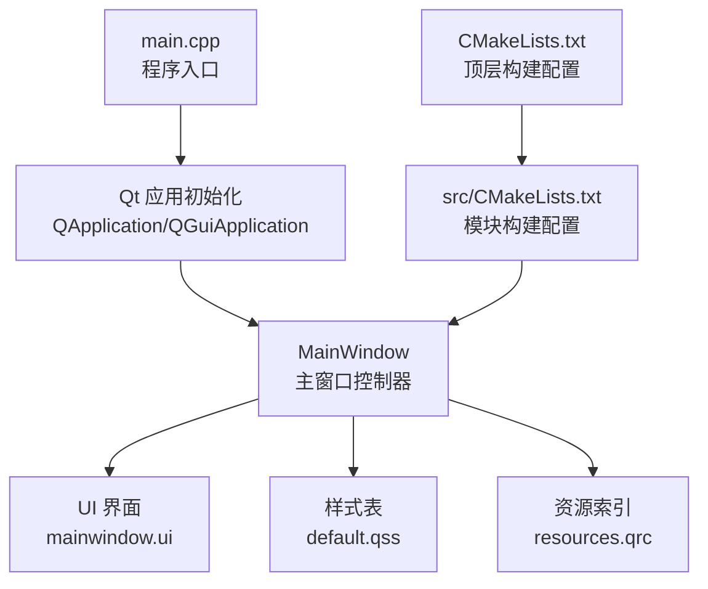
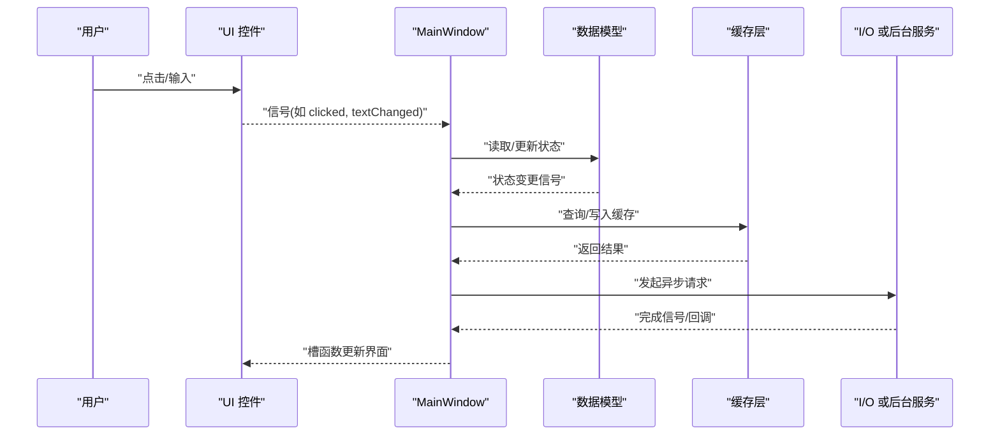
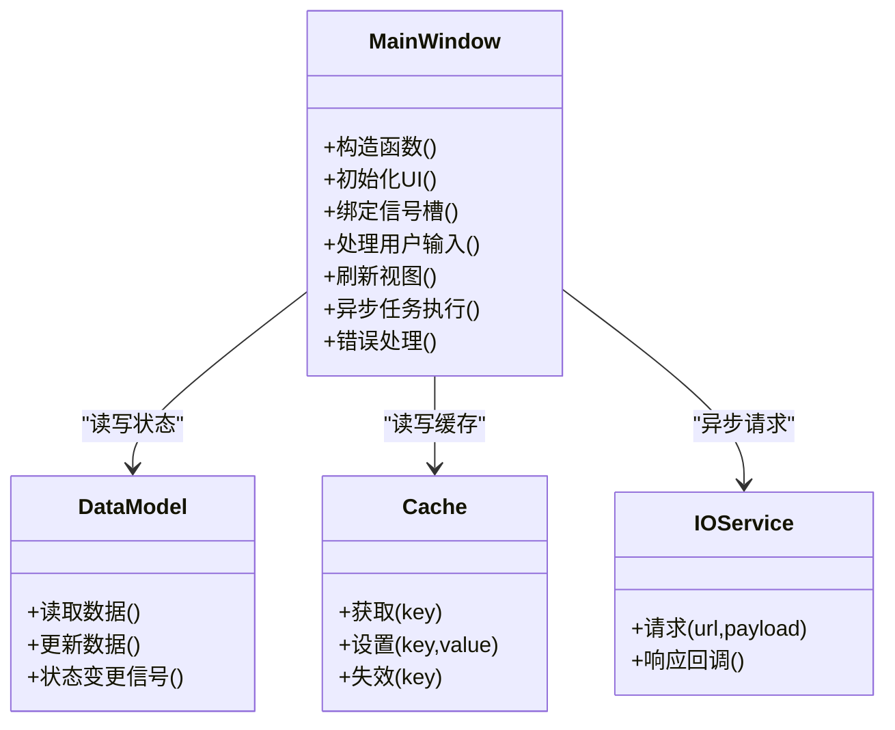
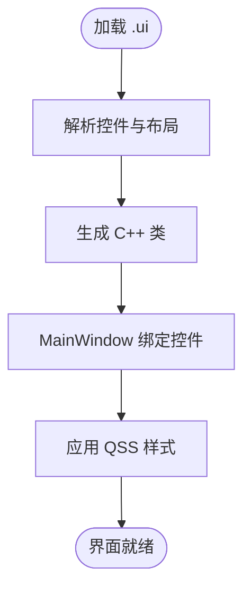
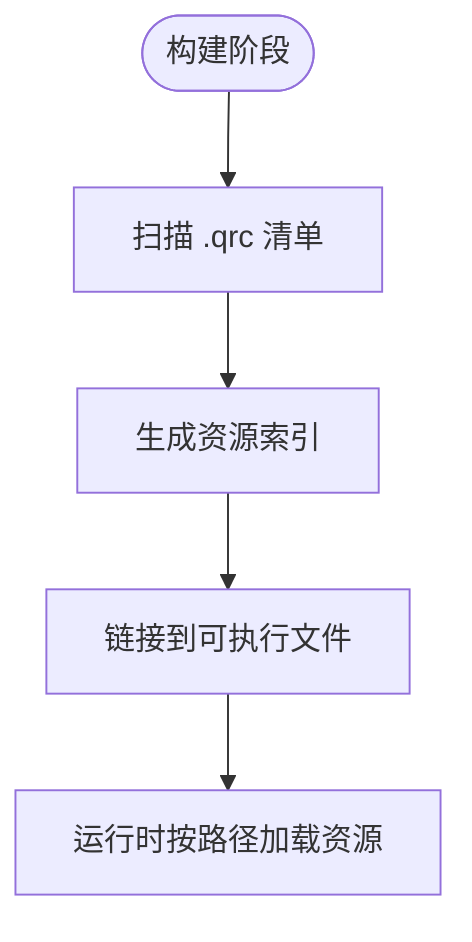
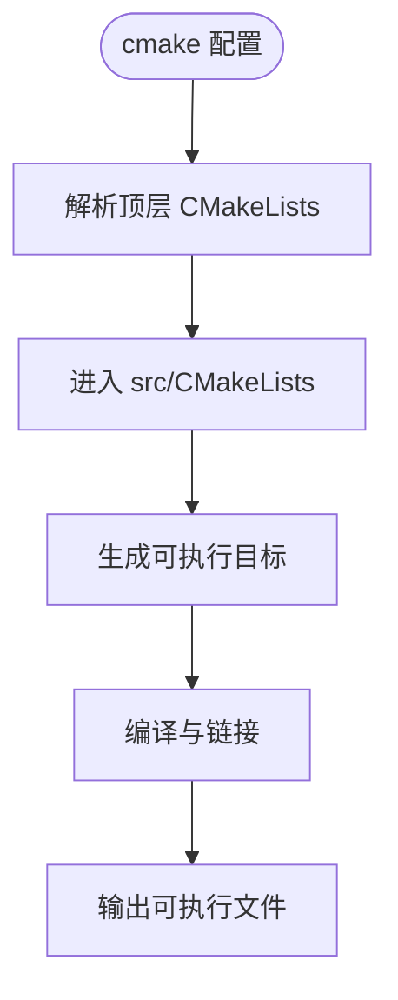
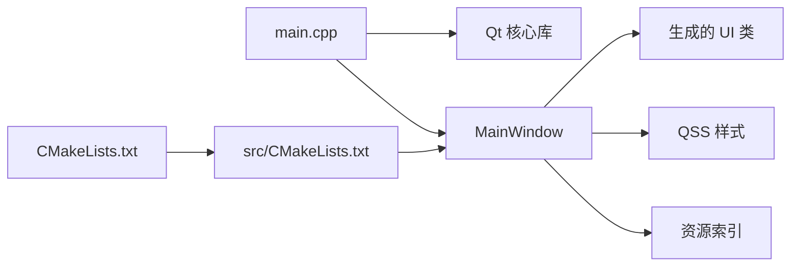

# 数据流架构

<cite>
**本文引用的文件**   
- [main.cpp](file://src/main.cpp)
- [CMakeLists.txt](file://CMakeLists.txt)
- [src/CMakeLists.txt](file://src/CMakeLists.txt)
- [mainwindow.h](file://src/ui/mainwindow.h)
- [mainwindow.cpp](file://src/ui/mainwindow.cpp)
- [mainwindow.ui](file://src/ui/mainwindow.ui)
- [default.qss](file://resources/styles/default.qss)
- [resources.qrc](file://resources/resources.qrc)
- [README.en.md](file://README.en.md)
</cite>

## 目录
1. [简介](#简介)
2. [项目结构](#项目结构)
3. [核心组件](#核心组件)
4. [架构总览](#架构总览)
5. [详细组件分析](#详细组件分析)
6. [依赖分析](#依赖分析)
7. [性能考虑](#性能考虑)
8. [故障排查指南](#故障排查指南)
9. [结论](#结论)
10. [附录](#附录)

## 简介
本设计文档围绕应用程序的数据流架构展开，重点描述数据在各组件间的流转路径、状态同步机制与一致性保证。结合 Qt 事件驱动模型与信号槽通信模式，说明异步操作处理、数据模型设计、状态管理与缓存策略，并给出数据验证、错误处理与事务管理的实践建议。文档包含数据流图、时序图与实现示例路径，覆盖性能优化、内存管理与并发处理的要点。

## 项目结构
该工程为基于 Qt 的桌面应用，采用 CMake 构建系统，UI 层通过 .ui 文件生成，样式通过 QSS 管理，资源通过 .qrc 打包。核心入口在 main.cpp，主窗口逻辑位于 src/ui/mainwindow.*。

**图表来源** 
- [main.cpp:1-200](file://src/main.cpp#L1-L200)
- [CMakeLists.txt:1-200](file://CMakeLists.txt#L1-L200)
- [src/CMakeLists.txt:1-200](file://src/CMakeLists.txt#L1-L200)
- [mainwindow.h:1-200](file://src/ui/mainwindow.h#L1-L200)
- [mainwindow.cpp:1-200](file://src/ui/mainwindow.cpp#L1-L200)
- [mainwindow.ui:1-200](file://src/ui/mainwindow.ui#L1-L200)
- [default.qss:1-200](file://resources/styles/default.qss#L1-L200)
- [resources.qrc:1-200](file://resources/resources.qrc#L1-L200)

**章节来源**
- [main.cpp:1-200](file://src/main.cpp#L1-L200)
- [CMakeLists.txt:1-200](file://CMakeLists.txt#L1-L200)
- [src/CMakeLists.txt:1-200](file://src/CMakeLists.txt#L1-L200)
- [mainwindow.h:1-200](file://src/ui/mainwindow.h#L1-L200)
- [mainwindow.cpp:1-200](file://src/ui/mainwindow.cpp#L1-L200)
- [mainwindow.ui:1-200](file://src/ui/mainwindow.ui#L1-L200)
- [default.qss:1-200](file://resources/styles/default.qss#L1-L200)
- [resources.qrc:1-200](file://resources/resources.qrc#L1-L200)

## 核心组件
- 程序入口与生命周期：负责创建 Qt 应用实例、加载资源、启动主窗口，并在退出时释放资源。
- 主窗口控制器（MainWindow）：协调 UI 与业务逻辑，订阅/发布事件，维护视图状态，触发异步任务。
- UI 界面（.ui）：声明控件布局与初始状态，由 Qt 自动生成对应的 C++ 类。
- 样式与资源：QSS 提供主题样式；.qrc 集中管理图标、图片等静态资源。

**章节来源**
- [main.cpp:1-200](file://src/main.cpp#L1-L200)
- [mainwindow.h:1-200](file://src/ui/mainwindow.h#L1-L200)
- [mainwindow.cpp:1-200](file://src/ui/mainwindow.cpp#L1-L200)
- [mainwindow.ui:1-200](file://src/ui/mainwindow.ui#L1-L200)
- [default.qss:1-200](file://resources/styles/default.qss#L1-L200)
- [resources.qrc:1-200](file://resources/resources.qrc#L1-L200)

## 架构总览
下图展示数据从用户交互到 UI 更新的整体流程，强调事件驱动与信号槽解耦。

**图表来源** 
- [mainwindow.h:1-200](file://src/ui/mainwindow.h#L1-L200)
- [mainwindow.cpp:1-200](file://src/ui/mainwindow.cpp#L1-L200)

## 详细组件分析

### 主窗口控制器（MainWindow）
- 职责：作为视图与模型的协调者，接收 UI 信号，调用模型方法，管理缓存，调度异步任务，并将结果回写至 UI。
- 关键设计点：
  - 使用信号槽将 UI 事件与业务逻辑解耦。
  - 对频繁访问的数据进行缓存，减少重复 I/O。
  - 通过队列化槽或线程池避免阻塞主线程。
  - 统一错误处理与用户提示。

**图表来源** 
- [mainwindow.h:1-200](file://src/ui/mainwindow.h#L1-L200)
- [mainwindow.cpp:1-200](file://src/ui/mainwindow.cpp#L1-L200)

**章节来源**
- [mainwindow.h:1-200](file://src/ui/mainwindow.h#L1-L200)
- [mainwindow.cpp:1-200](file://src/ui/mainwindow.cpp#L1-L200)

### UI 界面（.ui）与样式（QSS）
- .ui 文件定义控件树、布局与初始属性，编译期生成对应 C++ 头文件，供 MainWindow 直接操作。
- QSS 提供统一的视觉风格，支持动态切换主题。

**图表来源** 
- [mainwindow.ui:1-200](file://src/ui/mainwindow.ui#L1-L200)
- [default.qss:1-200](file://resources/styles/default.qss#L1-L200)

**章节来源**
- [mainwindow.ui:1-200](file://src/ui/mainwindow.ui#L1-L200)
- [default.qss:1-200](file://resources/styles/default.qss#L1-L200)

### 资源管理（.qrc）
- 通过 .qrc 集中管理图标、图片等资源，运行时以统一命名空间访问，便于替换与国际化。

**图表来源** 
- [resources.qrc:1-200](file://resources/resources.qrc#L1-L200)

**章节来源**
- [resources.qrc:1-200](file://resources/resources.qrc#L1-L200)

### 构建系统（CMake）
- 顶层 CMakeLists 组织子模块与目标，src/CMakeLists 定义 Qt 模块、源文件与依赖。

**图表来源** 
- [CMakeLists.txt:1-200](file://CMakeLists.txt#L1-L200)
- [src/CMakeLists.txt:1-200](file://src/CMakeLists.txt#L1-L200)

**章节来源**
- [CMakeLists.txt:1-200](file://CMakeLists.txt#L1-L200)
- [src/CMakeLists.txt:1-200](file://src/CMakeLists.txt#L1-L200)

## 依赖分析
- 入口依赖 Qt 框架与主窗口类。
- 主窗口依赖 UI 生成类、样式与资源。
- 构建系统依赖 CMake 与 Qt 模块。

**图表来源** 
- [main.cpp:1-200](file://src/main.cpp#L1-L200)
- [mainwindow.h:1-200](file://src/ui/mainwindow.h#L1-L200)
- [resources.qrc:1-200](file://resources/resources.qrc#L1-L200)
- [CMakeLists.txt:1-200](file://CMakeLists.txt#L1-L200)
- [src/CMakeLists.txt:1-200](file://src/CMakeLists.txt#L1-L200)

**章节来源**
- [main.cpp:1-200](file://src/main.cpp#L1-L200)
- [mainwindow.h:1-200](file://src/ui/mainwindow.h#L1-L200)
- [resources.qrc:1-200](file://resources/resources.qrc#L1-L200)
- [CMakeLists.txt:1-200](file://CMakeLists.txt#L1-L200)
- [src/CMakeLists.txt:1-200](file://src/CMakeLists.txt#L1-L200)

## 性能考虑
- 事件循环与非阻塞：所有耗时操作应放入后台线程并通过信号槽通知主线程更新 UI，避免阻塞事件循环。
- 缓存策略：对读多写少的数据使用内存缓存，设置合理的过期与失效策略，降低重复 I/O。
- 批量更新：合并多次 UI 更新，减少重绘开销。
- 资源加载：按需懒加载大资源，预加载常用资源。
- 内存管理：利用 Qt 对象树自动释放，避免裸指针；必要时使用智能指针。
- 并发安全：共享数据加锁或使用线程安全的容器；避免跨线程直接访问非线程安全对象。

[本节为通用指导，不直接分析具体文件]

## 故障排查指南
- 常见问题定位：
  - 界面未更新：检查信号是否发出、槽是否连接、是否在正确线程更新 UI。
  - 资源加载失败：确认 .qrc 已加入构建、路径是否正确、权限是否足够。
  - 样式未生效：检查 QSS 选择器语法、样式是否被覆盖。
  - 崩溃与异常：启用调试符号，捕获未处理异常，打印堆栈。
- 日志与诊断：
  - 在关键路径添加日志，记录输入参数、中间状态与返回值。
  - 使用 Qt 调试工具（如 qmlscene、Valgrind）辅助定位内存问题。

**章节来源**
- [mainwindow.cpp:1-200](file://src/ui/mainwindow.cpp#L1-L200)
- [resources.qrc:1-200](file://resources/resources.qrc#L1-L200)
- [default.qss:1-200](file://resources/styles/default.qss#L1-L200)

## 结论
本项目的数据流以 Qt 事件驱动为核心，通过信号槽实现松耦合通信。主窗口作为协调者，统一管理 UI、模型、缓存与异步任务，确保状态一致性与用户体验流畅。配合 CMake 构建系统与资源管理机制，形成清晰、可维护的应用架构。遵循本文的性能与并发最佳实践，可进一步提升稳定性与可扩展性。

[本节为总结性内容，不直接分析具体文件]

## 附录
- 术语
  - 事件驱动：基于事件循环分发消息的编程模型。
  - 信号槽：Qt 提供的类型安全回调机制。
  - 缓存：临时存储以提高访问速度的数据结构。
  - 事务：一组操作的原子性单元，要么全部成功，要么全部回滚。
- 参考
  - README 英文说明用于了解项目背景与总体目标。

**章节来源**
- [README.en.md:1-200](file://README.en.md#L1-L200)