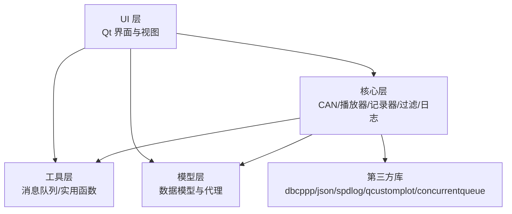
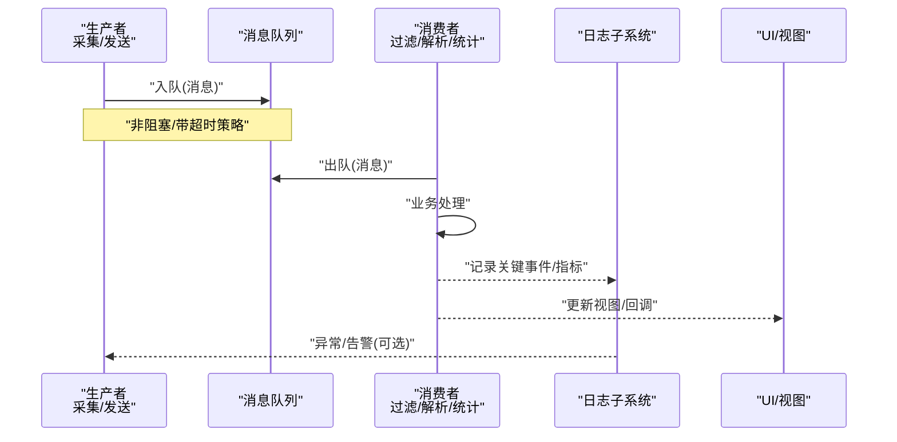
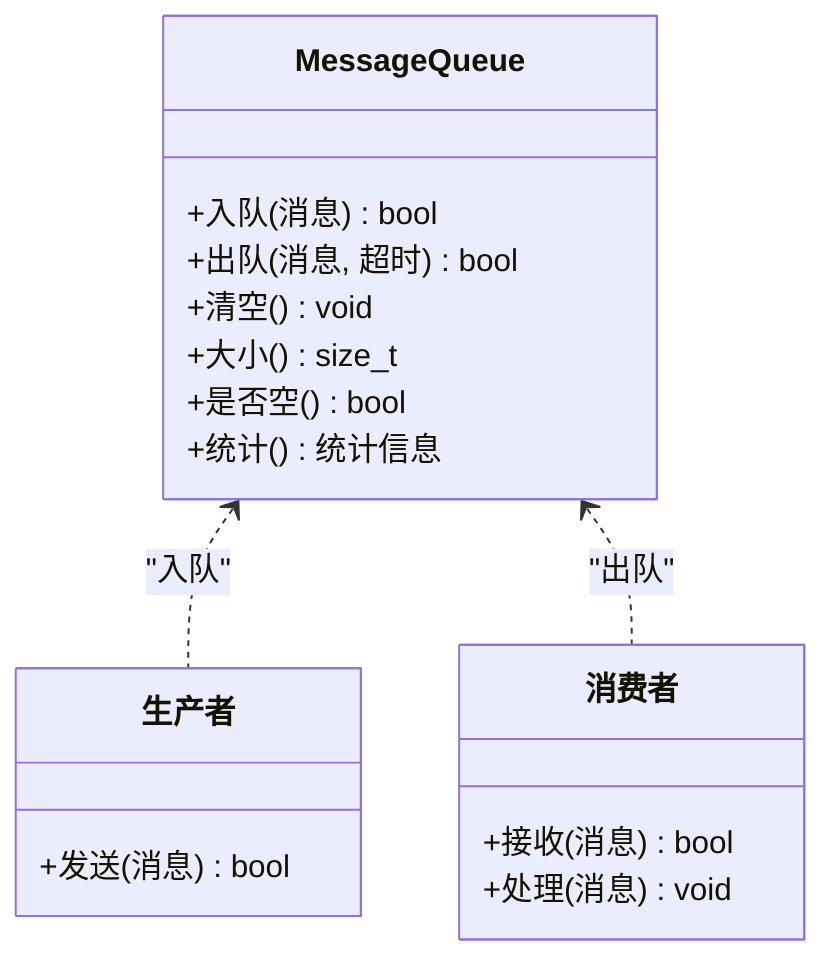
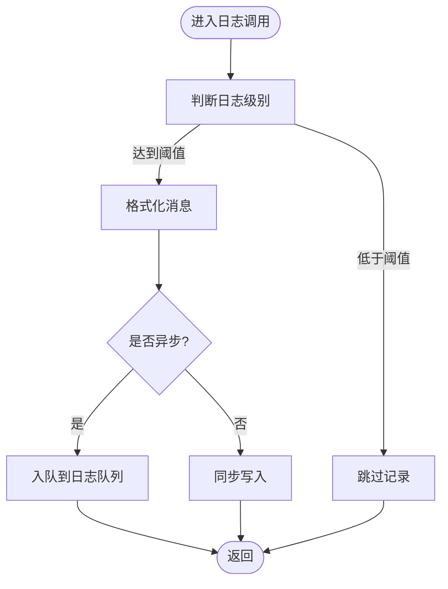
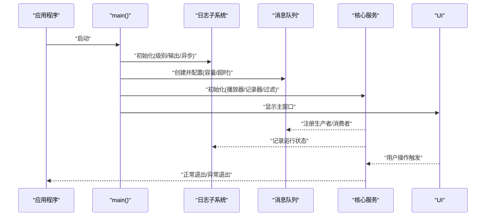
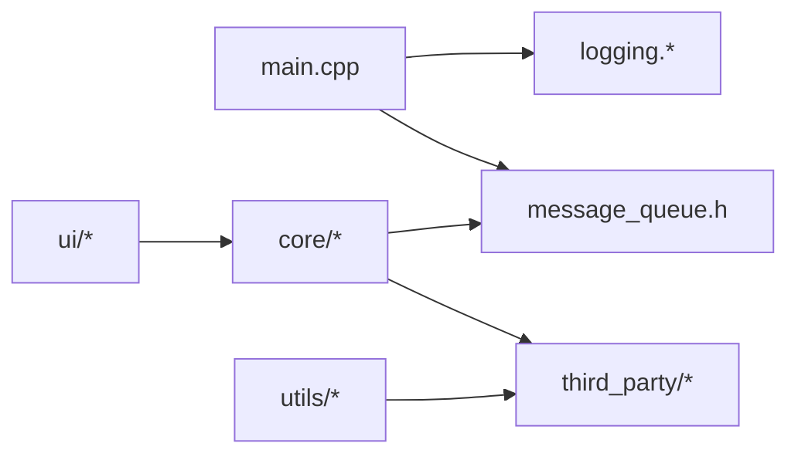

# 消息队列架构

<cite>
**本文引用的文件**   
- [src/utils/message_queue.h](file://src/utils/message_queue.h)
- [src/core/logging.cpp](file://src/core/logging.cpp)
- [src/core/logging.h](file://src/core/logging.h)
- [src/main.cpp](file://src/main.cpp)
- [CMakeLists.txt](file://CMakeLists.txt)
</cite>

## 目录
1. [简介](#简介)
2. [项目结构](#项目结构)
3. [核心组件](#核心组件)
4. [架构总览](#架构总览)
5. [详细组件分析](#详细组件分析)
6. [依赖关系分析](#依赖关系分析)
7. [性能考量](#性能考量)
8. [故障排查指南](#故障排查指南)
9. [结论](#结论)
10. [附录](#附录)

## 简介
本文件围绕“消息队列架构”展开，聚焦于项目中用于跨线程/跨模块通信的消息传递机制。文档从系统架构、组件职责、数据流与处理逻辑、集成点、错误处理与性能特性等维度进行系统化说明，并以图示帮助读者快速理解整体设计与关键流程。

## 项目结构
本项目采用分层组织方式：UI 层负责界面交互，core 层承载核心业务（如 CAN 仿真、播放器、记录器、过滤引擎、日志等），utils 层提供通用工具（含消息队列），models 层封装数据模型与代理，third_party 为第三方库，scripts 包含构建与资源下载脚本。

[本图为概念性结构示意，不直接映射具体源码文件]

## 核心组件
- 消息队列（utils）：提供无锁或低开销的并发安全队列，用于生产者-消费者模式下的消息传递，解耦采集、处理与展示环节。
- 日志子系统（core）：统一输出日志，支持异步写入与分级控制，便于问题定位与性能分析。
- 主程序入口（main）：初始化应用、配置日志、启动各子系统并协调生命周期。

**章节来源**
- [src/utils/message_queue.h](file://src/utils/message_queue.h)
- [src/core/logging.cpp](file://src/core/logging.cpp)
- [src/core/logging.h](file://src/core/logging.h)
- [src/main.cpp](file://src/main.cpp)

## 架构总览
下图展示了消息在系统中的典型流转路径：采集端（如 CAN 帧捕获）作为生产者将消息入队；处理端（如过滤、解析、统计）作为消费者出队并处理；必要时将结果回写至 UI 或持久化存储。日志贯穿全链路，保障可观测性。

**图表来源**
- [src/utils/message_queue.h](file://src/utils/message_queue.h)
- [src/core/logging.cpp](file://src/core/logging.cpp)
- [src/core/logging.h](file://src/core/logging.h)
- [src/main.cpp](file://src/main.cpp)

## 详细组件分析

### 消息队列组件（utils）
- 设计目标
  - 高吞吐、低延迟：适用于高频消息场景（如 CAN 总线帧）。
  - 线程安全：多生产者/多消费者并发访问。
  - 可扩展：支持不同消息类型与序列化策略。
- 关键能力
  - 入队/出队接口：支持阻塞与非阻塞模式，提供超时与失败重试策略。
  - 容量与背压：队列满时的丢弃/等待策略，避免内存膨胀。
  - 监控与统计：入队/出队计数、延迟采样、丢包率统计。
- 复杂度与权衡
  - 时间复杂度：入队/出队通常为 O(1)。
  - 空间复杂度：受限于队列容量与消息大小。
  - 一致性：保证单条消息仅被消费一次，避免重复与丢失。
- 使用建议
  - 合理设置队列长度与超时阈值，平衡吞吐与延迟。
  - 对关键路径增加日志与指标上报，便于定位瓶颈。
  - 结合信号槽或回调机制，将处理结果高效回传 UI。

**图表来源**
- [src/utils/message_queue.h](file://src/utils/message_queue.h)

**章节来源**
- [src/utils/message_queue.h](file://src/utils/message_queue.h)

### 日志子系统（core）
- 设计目标
  - 统一日志格式与级别，支持异步落盘与滚动。
  - 低开销：避免阻塞关键路径，支持开关与采样。
- 关键能力
  - 分级日志：DEBUG/INFO/WARN/ERROR/FATAL。
  - 异步写入：后台线程批量写入，降低同步 IO 开销。
  - 上下文信息：线程 ID、时间戳、模块名等元数据。
- 集成点
  - 在消息队列与业务处理中插入关键日志点。
  - 通过宏或 API 便捷调用，减少样板代码。

**图表来源**
- [src/core/logging.cpp](file://src/core/logging.cpp)
- [src/core/logging.h](file://src/core/logging.h)

**章节来源**
- [src/core/logging.cpp](file://src/core/logging.cpp)
- [src/core/logging.h](file://src/core/logging.h)

### 主程序入口（main）
- 职责
  - 初始化 Qt 应用环境与全局配置。
  - 配置日志子系统（级别、输出目标、异步参数）。
  - 创建并启动消息队列实例，注册生产者/消费者。
  - 启动 UI 与核心服务，协调生命周期与退出流程。
- 关键点
  - 确保日志与队列在 UI 之前完成初始化。
  - 优雅退出：停止消费者、刷新日志缓冲、释放资源。

**图表来源**
- [src/main.cpp](file://src/main.cpp)
- [src/core/logging.cpp](file://src/core/logging.cpp)
- [src/core/logging.h](file://src/core/logging.h)
- [src/utils/message_queue.h](file://src/utils/message_queue.h)

**章节来源**
- [src/main.cpp](file://src/main.cpp)

## 依赖关系分析
- 内部依赖
  - main 依赖 logging 与 message_queue，并在启动阶段完成初始化。
  - core 中的采集/处理模块依赖 message_queue 进行解耦通信。
  - UI 通过回调或信号槽消费处理结果，避免直接耦合底层队列。
- 外部依赖
  - 日志可能依赖 spdlog（若启用）。
  - 队列实现可能基于 concurrentqueue 或其他无锁队列。
  - JSON 用于配置与序列化（nlohmann_json）。

**图表来源**
- [CMakeLists.txt](file://CMakeLists.txt)
- [src/main.cpp](file://src/main.cpp)
- [src/core/logging.h](file://src/core/logging.h)
- [src/utils/message_queue.h](file://src/utils/message_queue.h)

**章节来源**
- [CMakeLists.txt](file://CMakeLists.txt)
- [src/main.cpp](file://src/main.cpp)

## 性能考量
- 队列容量与背压
  - 根据峰值流量设定容量，避免频繁扩容与拷贝。
  - 队列满时采用丢弃最旧/最新策略或限流，防止雪崩。
- 异步与批处理
  - 日志与持久化采用异步写入，批量提交降低 IO 次数。
  - 消费者侧合并小任务，减少上下文切换。
- 零拷贝与移动语义
  - 消息体尽量使用移动语义，避免不必要的深拷贝。
  - 大对象通过指针或共享内存传递，注意生命周期管理。
- 监控与调优
  - 统计入队/出队速率、延迟分布、丢包率。
  - 针对热点路径进行 CPU/内存剖析，定位瓶颈。

[本节为通用指导，不直接分析具体文件]

## 故障排查指南
- 常见问题
  - 队列溢出：检查生产者速率与消费者处理能力，调整容量与超时。
  - 消息丢失：确认出队成功分支与重试策略，增加关键日志。
  - 日志阻塞：检查异步队列是否满载，提升写入线程数或降低级别。
  - 死锁/竞态：审查临界区与锁粒度，确保无循环依赖。
- 诊断步骤
  - 开启 DEBUG 日志，定位异常发生位置。
  - 采集队列深度与延迟指标，观察趋势变化。
  - 复现最小用例，隔离问题范围。
  - 使用调试器附加进程，检查线程栈与变量状态。

**章节来源**
- [src/core/logging.cpp](file://src/core/logging.cpp)
- [src/core/logging.h](file://src/core/logging.h)
- [src/utils/message_queue.h](file://src/utils/message_queue.h)

## 结论
本项目通过消息队列实现了解耦、高吞吐的跨模块通信，配合统一的日志子系统保障可观测性与可维护性。合理的容量规划、异步策略与监控指标是稳定运行的关键。建议在后续迭代中持续完善指标采集与自动化测试，进一步提升系统的鲁棒性与可运维性。

[本节为总结性内容，不直接分析具体文件]

## 附录
- 术语表
  - 生产者：产生消息的模块（如数据采集、外部输入）。
  - 消费者：消费消息的模块（如过滤、解析、统计、展示）。
  - 背压：当消费者慢于生产者时，限制上游速率以避免过载。
  - 异步写入：将 IO 操作放入后台线程执行，降低主线程阻塞。
- 参考路径
  - 消息队列定义：[src/utils/message_queue.h](file://src/utils/message_queue.h)
  - 日志实现：[src/core/logging.cpp](file://src/core/logging.cpp)、[src/core/logging.h](file://src/core/logging.h)
  - 应用入口：[src/main.cpp](file://src/main.cpp)
  - 构建配置：[CMakeLists.txt](file://CMakeLists.txt)