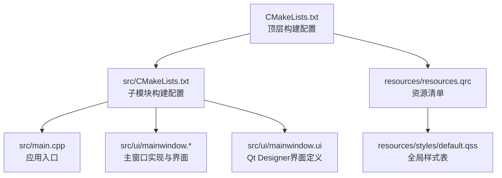
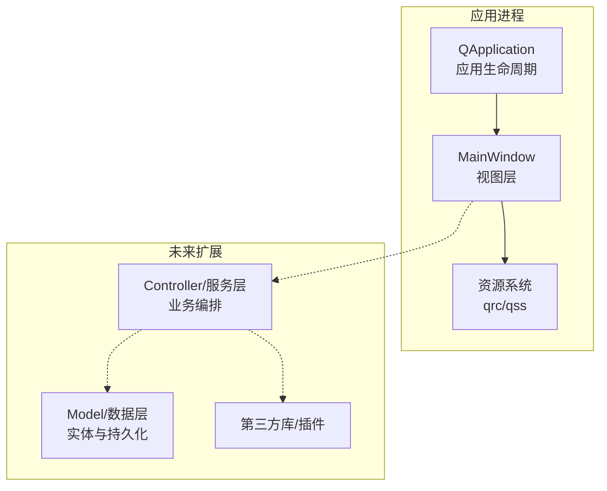
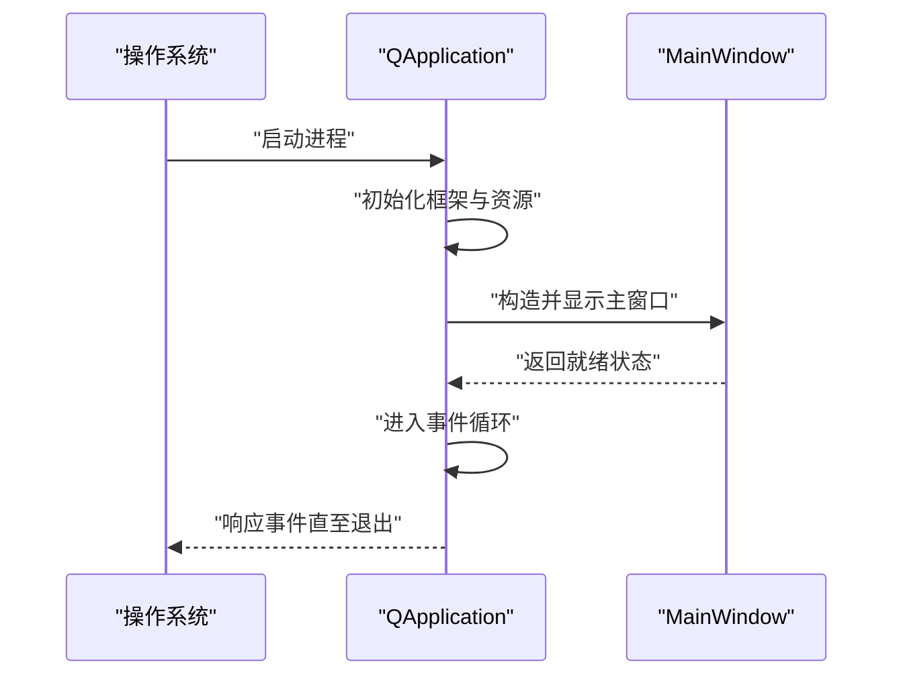
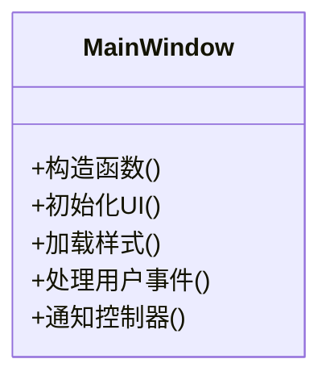
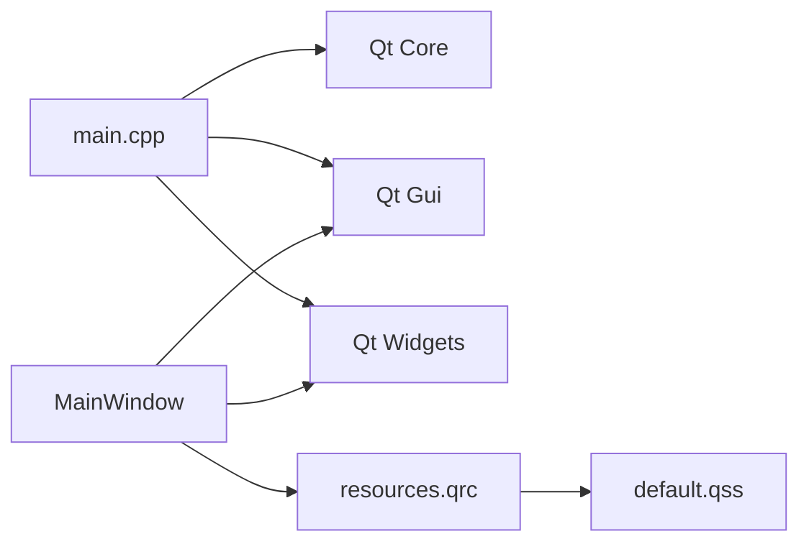

# 架构设计

<cite>
**本文引用的文件**   
- [CMakeLists.txt](file://CMakeLists.txt)
- [src/CMakeLists.txt](file://src/CMakeLists.txt)
- [src/main.cpp](file://src/main.cpp)
- [src/ui/mainwindow.h](file://src/ui/mainwindow.h)
- [src/ui/mainwindow.cpp](file://src/ui/mainwindow.cpp)
- [src/ui/mainwindow.ui](file://src/ui/mainwindow.ui)
- [resources/styles/default.qss](file://resources/styles/default.qss)
- [resources/resources.qrc](file://resources/resources.qrc)
- [README.en.md](file://README.en.md)
</cite>

## 目录
1. [简介](#简介)
2. [项目结构](#项目结构)
3. [核心组件](#核心组件)
4. [架构总览](#架构总览)
5. [详细组件分析](#详细组件分析)
6. [依赖分析](#依赖分析)
7. [性能考虑](#性能考虑)
8. [故障排查指南](#故障排查指南)
9. [结论](#结论)
10. [附录](#附录)

## 简介
本文件为Qt/C++桌面应用程序的架构设计文档，面向MVC模式、模块化设计与事件驱动架构的实现与集成。文档基于仓库现有结构与源码进行梳理，给出系统边界、基础设施需求、部署拓扑、技术栈与依赖、以及安全性、监控与灾难恢复等横切关注点的实践建议。由于当前仓库仅包含最小可运行的UI骨架（主窗口与资源），本文在“详细组件分析”中重点围绕主窗口与构建系统进行说明，并在其他章节提供通用性指导与扩展建议。

## 项目结构
仓库采用分层组织：顶层CMake脚本负责工程配置；src目录包含应用入口与UI模块；resources目录集中管理样式与资源清单。整体结构清晰，便于后续按功能域拆分模块。

图表来源
- [CMakeLists.txt](file://CMakeLists.txt)
- [src/CMakeLists.txt](file://src/CMakeLists.txt)
- [src/main.cpp](file://src/main.cpp)
- [src/ui/mainwindow.h](file://src/ui/mainwindow.h)
- [src/ui/mainwindow.cpp](file://src/ui/mainwindow.cpp)
- [src/ui/mainwindow.ui](file://src/ui/mainwindow.ui)
- [resources/resources.qrc](file://resources/resources.qrc)
- [resources/styles/default.qss](file://resources/styles/default.qss)

章节来源
- [CMakeLists.txt](file://CMakeLists.txt)
- [src/CMakeLists.txt](file://src/CMakeLists.txt)
- [src/main.cpp](file://src/main.cpp)
- [src/ui/mainwindow.h](file://src/ui/mainwindow.h)
- [src/ui/mainwindow.cpp](file://src/ui/mainwindow.cpp)
- [src/ui/mainwindow.ui](file://src/ui/mainwindow.ui)
- [resources/resources.qrc](file://resources/resources.qrc)
- [resources/styles/default.qss](file://resources/styles/default.qss)

## 核心组件
- 应用入口与生命周期管理：由main.cpp负责创建QApplication实例、设置应用元信息、启动主窗口并进入事件循环。
- UI层（View）：mainwindow.h/.cpp/.ui构成主窗口视图，承载用户交互与展示逻辑。
- 资源与样式：通过resources.qrc将样式表default.qss纳入打包资源，运行时加载以实现主题化。
- 构建系统：顶层与src级CMakeLists.txt定义目标、依赖与安装规则，确保跨平台一致性。

章节来源
- [src/main.cpp](file://src/main.cpp)
- [src/ui/mainwindow.h](file://src/ui/mainwindow.h)
- [src/ui/mainwindow.cpp](file://src/ui/mainwindow.cpp)
- [src/ui/mainwindow.ui](file://src/ui/mainwindow.ui)
- [resources/resources.qrc](file://resources/resources.qrc)
- [resources/styles/default.qss](file://resources/styles/default.qss)
- [CMakeLists.txt](file://CMakeLists.txt)
- [src/CMakeLists.txt](file://src/CMakeLists.txt)

## 架构总览
本项目采用“轻量MVC + 事件驱动”的架构模式：
- Model：当前未显式实现数据模型层，可在后续引入业务实体与持久化抽象。
- View：主窗口及其控件作为视图层，处理展示与用户输入。
- Controller：可由主窗口或新增控制器类承担，协调Model与View之间的数据绑定与状态更新。
- 事件驱动：基于Qt信号槽机制，解耦组件间通信，提升可测试性与可扩展性。

图表来源
- [src/main.cpp](file://src/main.cpp)
- [src/ui/mainwindow.h](file://src/ui/mainwindow.h)
- [src/ui/mainwindow.cpp](file://src/ui/mainwindow.cpp)
- [resources/resources.qrc](file://resources/resources.qrc)
- [resources/styles/default.qss](file://resources/styles/default.qss)

## 详细组件分析

### 应用入口（main.cpp）
- 职责：初始化Qt应用环境、设置应用名称与版本、创建并显示主窗口、进入事件循环。
- 关键点：异常捕获与退出码处理；日志与调试输出；资源路径与样式加载时机。
- 事件流：应用启动 → 创建主窗口 → 显示 → 进入事件循环 → 响应用户输入与系统事件。

图表来源
- [src/main.cpp](file://src/main.cpp)

章节来源
- [src/main.cpp](file://src/main.cpp)

### 主窗口（MainWindow）
- 职责：承载UI布局、注册信号槽、处理用户交互、触发业务动作（待扩展）。
- 关键点：UI文件生成代码的集成；样式表加载与应用；事件处理与状态同步。
- 扩展点：可拆分为多个子视图/对话框，通过信号槽与主窗口通信。

图表来源
- [src/ui/mainwindow.h](file://src/ui/mainwindow.h)
- [src/ui/mainwindow.cpp](file://src/ui/mainwindow.cpp)
- [src/ui/mainwindow.ui](file://src/ui/mainwindow.ui)

章节来源
- [src/ui/mainwindow.h](file://src/ui/mainwindow.h)
- [src/ui/mainwindow.cpp](file://src/ui/mainwindow.cpp)
- [src/ui/mainwindow.ui](file://src/ui/mainwindow.ui)

### 资源与样式（resources.qrc / default.qss）
- 职责：集中管理静态资源（样式、图标、字体等），通过qrc编译进二进制，保证部署一致性。
- 关键点：样式表路径引用；运行时动态切换主题；资源缺失时的降级策略。

图表来源
- [resources/resources.qrc](file://resources/resources.qrc)
- [resources/styles/default.qss](file://resources/styles/default.qss)

章节来源
- [resources/resources.qrc](file://resources/resources.qrc)
- [resources/styles/default.qss](file://resources/styles/default.qss)

### 构建系统（CMakeLists）
- 职责：定义可执行目标、链接Qt库、设置源文件与资源、配置安装规则。
- 关键点：跨平台兼容性；Qt模块按需启用；资源与样式打包；调试/发布配置分离。

章节来源
- [CMakeLists.txt](file://CMakeLists.txt)
- [src/CMakeLists.txt](file://src/CMakeLists.txt)

## 依赖分析
- 内部依赖：main.cpp依赖Qt核心库；MainWindow依赖Qt GUI与UI生成代码；资源系统依赖qrc编译器。
- 外部依赖：Qt框架（Core、Gui、Widgets等）；可选的第三方库（网络、数据库、加密等）可按需引入。
- 耦合度：当前UI与入口耦合较低，便于后续引入Controller/Model层进行解耦。

图表来源
- [src/main.cpp](file://src/main.cpp)
- [src/ui/mainwindow.h](file://src/ui/mainwindow.h)
- [src/ui/mainwindow.cpp](file://src/ui/mainwindow.cpp)
- [resources/resources.qrc](file://resources/resources.qrc)
- [resources/styles/default.qss](file://resources/styles/default.qss)

章节来源
- [CMakeLists.txt](file://CMakeLists.txt)
- [src/CMakeLists.txt](file://src/CMakeLists.txt)
- [src/main.cpp](file://src/main.cpp)
- [src/ui/mainwindow.h](file://src/ui/mainwindow.h)
- [src/ui/mainwindow.cpp](file://src/ui/mainwindow.cpp)
- [resources/resources.qrc](file://resources/resources.qrc)
- [resources/styles/default.qss](file://resources/styles/default.qss)

## 性能考虑
- UI渲染：避免在主线程执行耗时操作；使用异步任务与队列更新UI。
- 资源加载：预加载关键资源，延迟加载非关键资源；对大图片进行压缩与缓存。
- 事件循环：减少阻塞调用；合理拆分任务，保持帧率稳定。
- 内存管理：合理使用智能指针与RAII；避免循环引用导致泄漏。
- 构建优化：开启链接时优化（LTO）、按需启用Qt模块、区分Debug/Release配置。

## 故障排查指南
- 启动失败：检查Qt库路径与环境变量；确认qrc资源已正确编译；验证样式表路径有效。
- UI不显示：确认主窗口构造与show调用顺序；检查事件循环是否被阻塞。
- 样式失效：检查qrc中资源路径；确认样式表语法正确；查看控制台错误输出。
- 崩溃定位：启用调试符号；使用断点与日志定位；必要时使用平台调试工具（如gdb/Visual Studio）。

章节来源
- [src/main.cpp](file://src/main.cpp)
- [resources/resources.qrc](file://resources/resources.qrc)
- [resources/styles/default.qss](file://resources/styles/default.qss)

## 结论
当前仓库提供了清晰的Qt/C++桌面应用骨架，遵循MVC思想与事件驱动模式的基础结构。建议在后续迭代中引入明确的Controller与Model层，完善数据流与状态管理；同时加强资源管理与样式主题化能力，提升用户体验与可维护性。构建系统与资源组织已具备良好基础，便于扩展更多功能模块与第三方集成。

## 附录
- 技术栈与版本兼容性
  - 语言：C++（建议C++17及以上）
  - 框架：Qt（Widgets模块为主，按需启用Network/Core/Concurrent等）
  - 构建：CMake（推荐3.16+）
  - 平台：Windows/Linux/macOS（依据Qt支持）
- 安全与合规
  - 输入校验与白名单过滤；敏感数据加密存储；权限最小化原则。
- 监控与诊断
  - 结构化日志；崩溃上报；性能指标采集（FPS、内存占用、启动时间）。
- 灾难恢复
  - 自动备份与恢复；配置回滚；健康检查与自修复机制。
- 部署拓扑
  - 单机桌面应用；资源内嵌于二进制；可选远程配置中心与更新服务。

章节来源
- [README.en.md](file://README.en.md)
- [CMakeLists.txt](file://CMakeLists.txt)
- [src/CMakeLists.txt](file://src/CMakeLists.txt)
- [src/main.cpp](file://src/main.cpp)
- [resources/resources.qrc](file://resources/resources.qrc)
- [resources/styles/default.qss](file://resources/styles/default.qss)