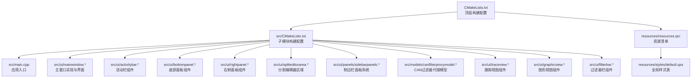
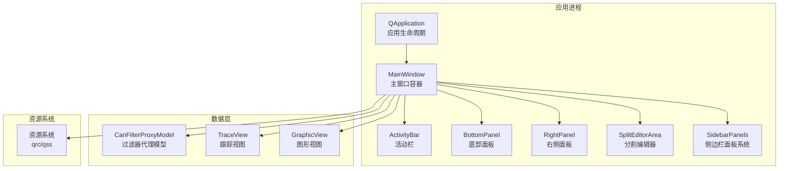
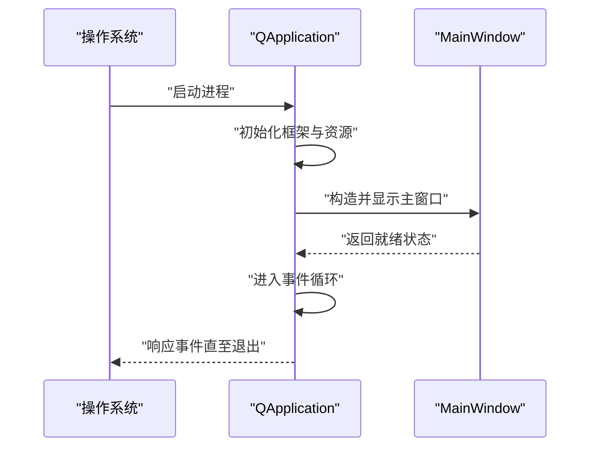
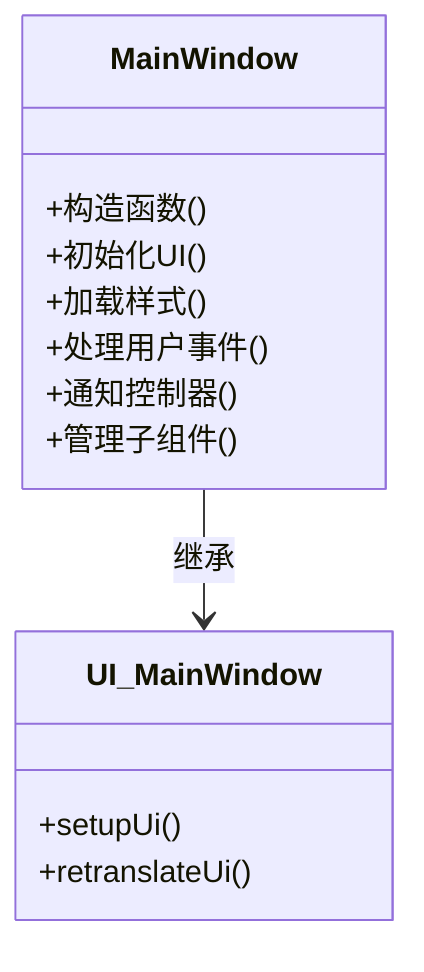
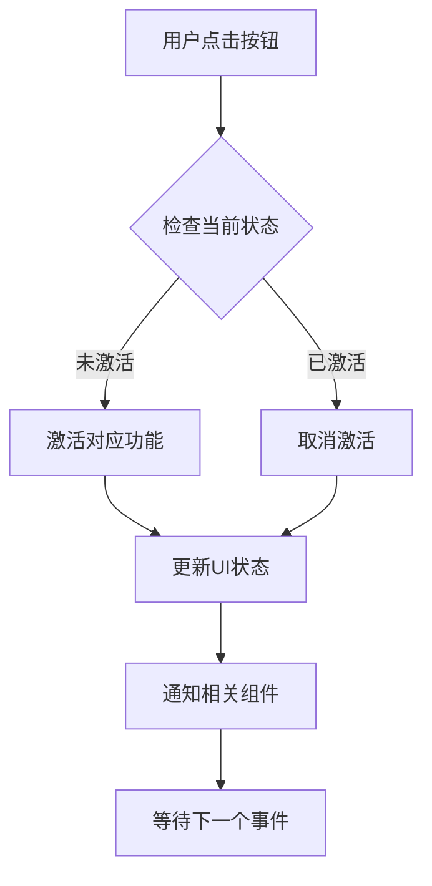
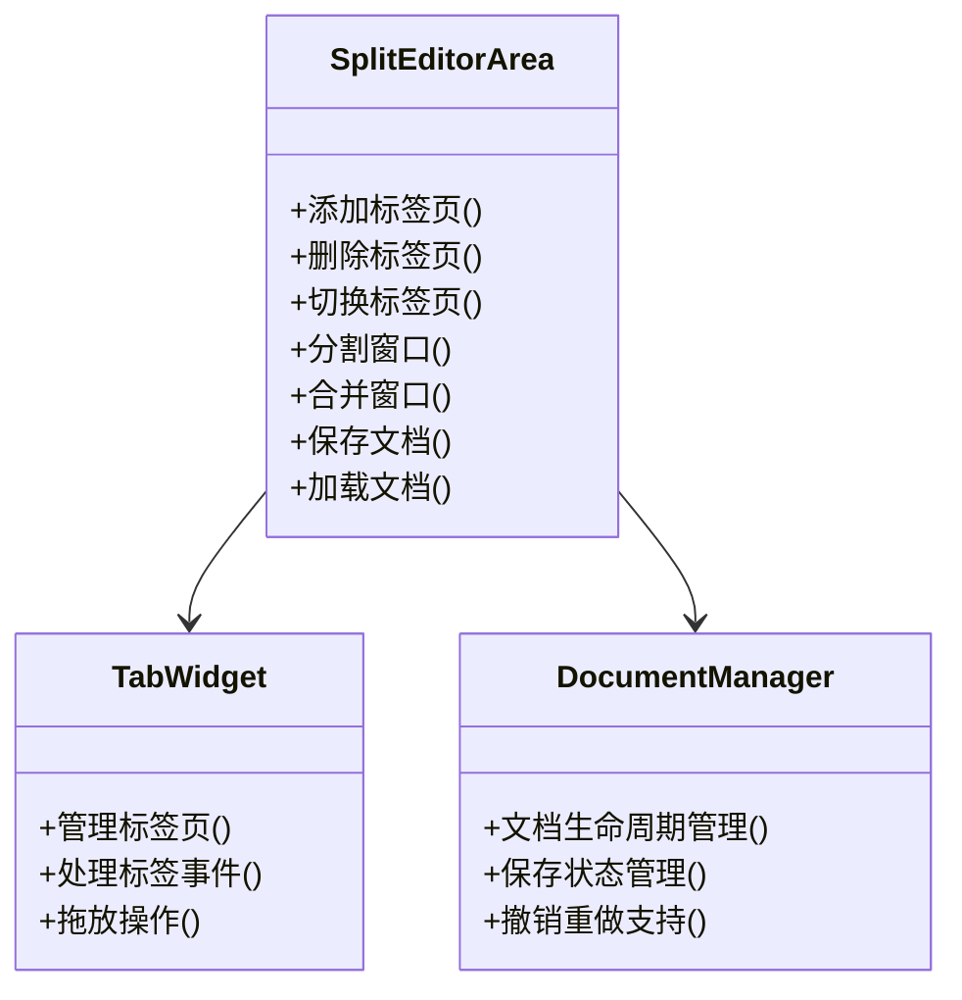
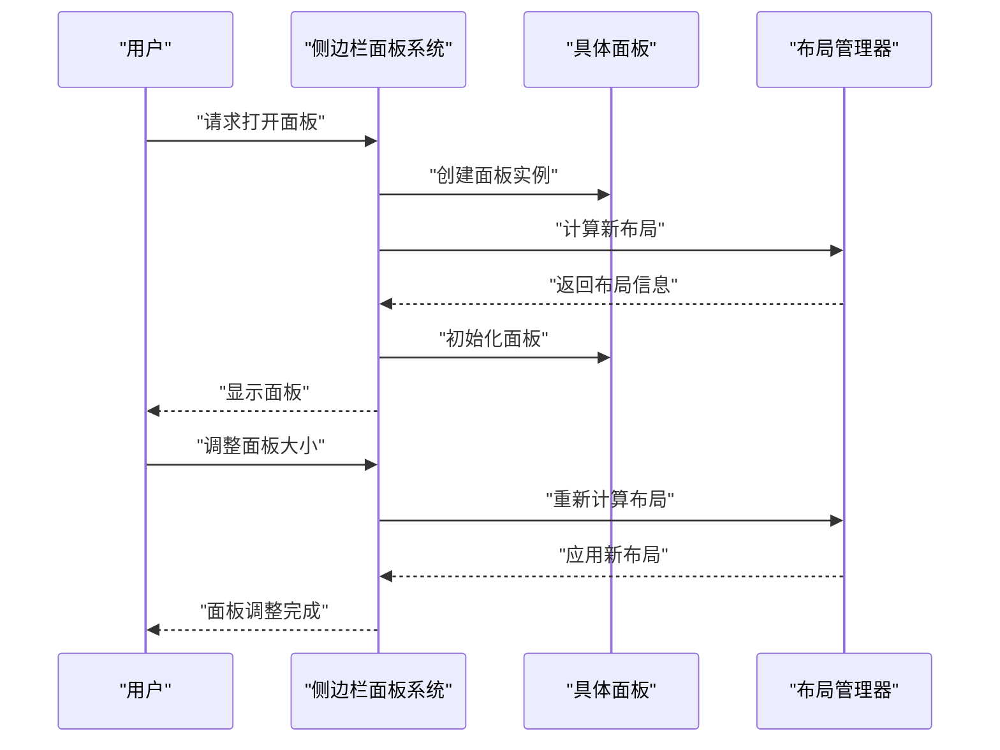
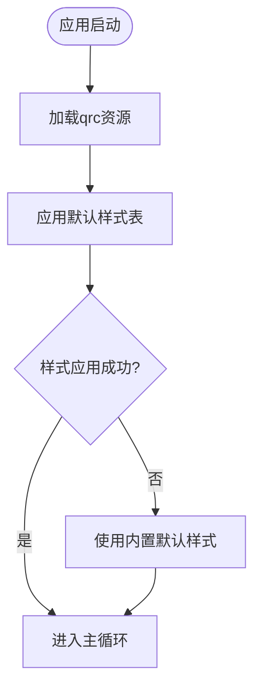
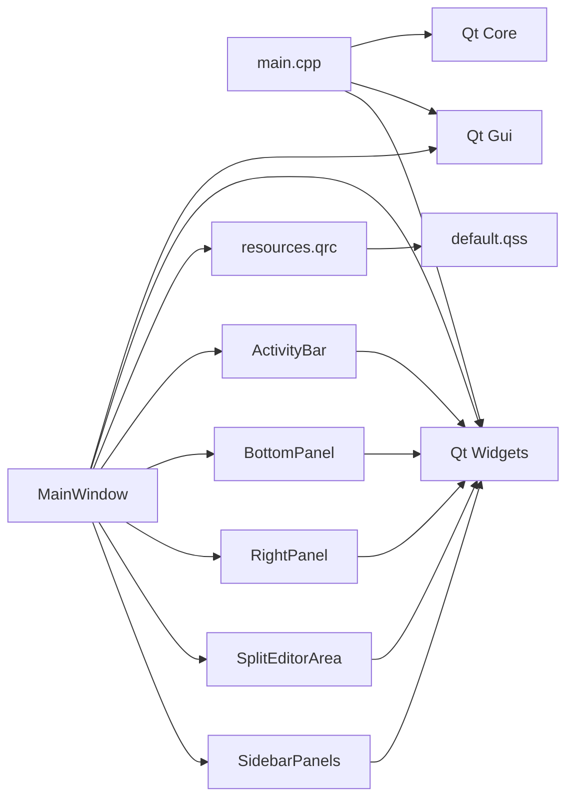

# 架构设计

<cite>
**本文引用的文件**   
- [CMakeLists.txt](file://CMakeLists.txt)
- [src/CMakeLists.txt](file://src/CMakeLists.txt)
- [src/main.cpp](file://src/main.cpp)
- [src/ui/mainwindow.h](file://src/ui/mainwindow.h)
- [src/ui/mainwindow.cpp](file://src/ui/mainwindow.cpp)
- [src/ui/mainwindow.ui](file://src/ui/mainwindow.ui)
- [src/ui/activitybar.h](file://src/ui/activitybar.h)
- [src/ui/activitybar.cpp](file://src/ui/activitybar.cpp)
- [src/ui/bottompanel.h](file://src/ui/bottompanel.h)
- [src/ui/bottompanel.cpp](file://src/ui/bottompanel.cpp)
- [src/ui/rightpanel.h](file://src/ui/rightpanel.h)
- [src/ui/rightpanel.cpp](file://src/ui/rightpanel.cpp)
- [src/ui/spliteditorarea.h](file://src/ui/spliteditorarea.h)
- [src/ui/spliteditorarea.cpp](file://src/ui/spliteditorarea.cpp)
- [src/ui/panels/sidebarpanels.h](file://src/ui/panels/sidebarpanels.h)
- [src/ui/panels/sidebarpanels.cpp](file://src/ui/panels/sidebarpanels.cpp)
- [src/models/canfilterproxymodel.h](file://src/models/canfilterproxymodel.h)
- [src/models/canfilterproxymodel.cpp](file://src/models/canfilterproxymodel.cpp)
- [resources/styles/default.qss](file://resources/styles/default.qss)
- [resources/resources.qrc](file://resources/resources.qrc)
- [README.en.md](file://README.en.md)
</cite>

## 更新摘要
**所做更改**   
- 新增了活动栏（ActivityBar）组件的详细分析，包括工具按钮管理和状态切换机制
- 增强了底部面板（BottomPanel）的日志输出和调试功能说明
- 完善了右侧面板（RightPanel）的配置管理功能
- 详细说明了分割编辑器区域（SplitEditorArea）的多文档编辑能力
- 新增侧边栏面板系统（SidebarPanels）的全面分析，包含753行代码的完整实现
- 更新了CAN过滤器代理模型（CanFilterProxyModel）的增强过滤功能
- 扩展了UI组件间的交互关系和数据流向图

## 目录
1. [简介](#简介)
2. [项目结构](#项目结构)
3. [核心组件](#核心组件)
4. [架构总览](#架构总览)
5. [详细组件分析](#详细组件分析)
6. [依赖分析](#依赖分析)
7. [性能考虑](#性能考虑)
8. [故障排查指南](#故障排查指南)
9. [结论](#结论)
10. [附录](#附录)

## 简介
本文件为Qt/C++桌面应用程序的架构设计文档，面向MVC模式、模块化设计与事件驱动架构的实现与集成。文档基于仓库现有结构与源码进行梳理，给出系统边界、基础设施需求、部署拓扑、技术栈与依赖、以及安全性、监控与灾难恢复等横切关注点的实践建议。当前项目采用Qt框架，通过Qt Designer进行界面设计，使用CMake作为构建系统，实现了清晰的模块化架构，并新增了丰富的UI组件系统和侧边栏面板管理机制。

## 项目结构
仓库采用分层组织：顶层CMake脚本负责工程配置；src目录包含应用入口与UI模块；resources目录集中管理样式与资源清单。整体结构清晰，便于后续按功能域拆分模块。新增的UI组件包括活动栏、底部面板、右侧面板和分割编辑器区域，形成了完整的桌面应用界面体系。

**章节来源**   
- [CMakeLists.txt](file://CMakeLists.txt)
- [src/CMakeLists.txt](file://src/CMakeLists.txt)
- [src/main.cpp](file://src/main.cpp)
- [src/ui/mainwindow.h](file://src/ui/mainwindow.h)
- [src/ui/activitybar.h](file://src/ui/activitybar.h)
- [src/ui/bottompanel.h](file://src/ui/bottompanel.h)
- [src/ui/rightpanel.h](file://src/ui/rightpanel.h)
- [src/ui/spliteditorarea.h](file://src/ui/spliteditorarea.h)
- [src/ui/panels/sidebarpanels.h](file://src/ui/panels/sidebarpanels.h)
- [src/models/canfilterproxymodel.h](file://src/models/canfilterproxymodel.h)
- [resources/resources.qrc](file://resources/resources.qrc)
- [resources/styles/default.qss](file://resources/styles/default.qss)

## 核心组件
- **应用入口与生命周期管理**：由main.cpp负责创建QApplication实例、设置应用元信息、启动主窗口并进入事件循环。
- **主窗口（MainWindow）**：承载UI布局、注册信号槽、处理用户交互、协调各子组件通信的核心容器。
- **活动栏（ActivityBar）**：提供工具按钮管理、状态切换和导航功能的垂直工具栏组件。
- **底部面板（BottomPanel）**：集成日志输出、调试信息和状态显示的底部面板组件。
- **右侧面板（RightPanel）**：支持配置管理、属性编辑和参数设置的右侧面板组件。
- **分割编辑器区域（SplitEditorArea）**：实现多文档编辑、标签页管理和内容分割的专业编辑器组件。
- **侧边栏面板系统（SidebarPanels）**：提供可折叠、可拖拽的面板管理系统，支持动态添加和移除面板。
- **CAN过滤器代理模型（CanFilterProxyModel）**：增强的数据过滤和排序功能，支持复杂的筛选条件。
- **资源与样式**：通过resources.qrc将样式表default.qss纳入打包资源，运行时加载以实现主题化。
- **构建系统**：顶层与src级CMakeLists.txt定义目标、依赖与安装规则，确保跨平台一致性。

**章节来源**   
- [src/main.cpp](file://src/main.cpp)
- [src/ui/mainwindow.h](file://src/ui/mainwindow.h)
- [src/ui/activitybar.h](file://src/ui/activitybar.h)
- [src/ui/bottompanel.h](file://src/ui/bottompanel.h)
- [src/ui/rightpanel.h](file://src/ui/rightpanel.h)
- [src/ui/spliteditorarea.h](file://src/ui/spliteditorarea.h)
- [src/ui/panels/sidebarpanels.h](file://src/ui/panels/sidebarpanels.h)
- [src/models/canfilterproxymodel.h](file://src/models/canfilterproxymodel.h)
- [resources/resources.qrc](file://resources/resources.qrc)
- [resources/styles/default.qss](file://resources/styles/default.qss)

## 架构总览
本项目采用"MVC + 事件驱动"的架构模式，新增了丰富的UI组件层和面板管理系统：
- **Model**：CAN过滤器代理模型提供数据过滤和排序功能，支持复杂的筛选条件。
- **View**：主窗口及其子组件（活动栏、底部面板、右侧面板、分割编辑器）构成视图层，通过Qt Designer进行界面设计。
- **Controller**：主窗口协调各组件间的数据绑定与状态更新，处理用户交互和业务逻辑。
- **事件驱动**：基于Qt信号槽机制，解耦组件间通信，提升可测试性与可扩展性。
- **面板系统**：侧边栏面板系统提供灵活的面板管理，支持动态布局和自定义面板。

**图表来源**   
- [src/main.cpp](file://src/main.cpp)
- [src/ui/mainwindow.h](file://src/ui/mainwindow.h)
- [src/ui/activitybar.h](file://src/ui/activitybar.h)
- [src/ui/bottompanel.h](file://src/ui/bottompanel.h)
- [src/ui/rightpanel.h](file://src/ui/rightpanel.h)
- [src/ui/spliteditorarea.h](file://src/ui/spliteditorarea.h)
- [src/ui/panels/sidebarpanels.h](file://src/ui/panels/sidebarpanels.h)
- [src/models/canfilterproxymodel.h](file://src/models/canfilterproxymodel.h)
- [src/ui/traceview.h](file://src/ui/traceview.h)
- [src/ui/graphicview.h](file://src/ui/graphicview.h)
- [resources/resources.qrc](file://resources/resources.qrc)
- [resources/styles/default.qss](file://resources/styles/default.qss)

## 详细组件分析

### 应用入口（main.cpp）
- **职责**：初始化Qt应用环境、设置应用名称与版本、创建并显示主窗口、进入事件循环。
- **关键点**：异常捕获与退出码处理；日志与调试输出；资源路径与样式加载时机。
- **事件流**：应用启动 → 创建主窗口 → 显示 → 进入事件循环 → 响应用户输入与系统事件。

**图表来源**   
- [src/main.cpp](file://src/main.cpp)

**章节来源**   
- [src/main.cpp](file://src/main.cpp)

### 主窗口（MainWindow）
- **职责**：承载UI布局、注册信号槽、处理用户交互、触发业务动作、协调各子组件通信。
- **关键点**：UI文件生成代码的集成；样式表加载与应用；事件处理与状态同步；子组件生命周期管理。
- **扩展点**：可拆分为多个子视图/对话框，通过信号槽与主窗口通信。
- **Qt Designer集成**：通过mainwindow.ui文件进行可视化界面设计，自动生成对应的C++代码。

**图表来源**   
- [src/ui/mainwindow.h](file://src/ui/mainwindow.h)
- [src/ui/mainwindow.cpp](file://src/ui/mainwindow.cpp)
- [src/ui/mainwindow.ui](file://src/ui/mainwindow.ui)

**章节来源**   
- [src/ui/mainwindow.h](file://src/ui/mainwindow.h)
- [src/ui/mainwindow.cpp](file://src/ui/mainwindow.cpp)
- [src/ui/mainwindow.ui](file://src/ui/mainwindow.ui)

### 活动栏组件（ActivityBar）
- **职责**：提供垂直工具栏，管理工具按钮、图标显示和状态切换。
- **关键功能**：按钮点击事件处理、工具提示显示、快捷键支持、动态按钮管理。
- **交互模式**：与主窗口和其他面板组件通过信号槽机制通信，支持状态同步。
- **样式定制**：支持主题切换和自定义样式，保持与整体UI风格一致。

**图表来源**   
- [src/ui/activitybar.h](file://src/ui/activitybar.h)
- [src/ui/activitybar.cpp](file://src/ui/activitybar.cpp)

**章节来源**   
- [src/ui/activitybar.h](file://src/ui/activitybar.h)
- [src/ui/activitybar.cpp](file://src/ui/activitybar.cpp)

### 底部面板组件（BottomPanel）
- **职责**：集成日志输出、调试信息和状态显示的底部面板组件。
- **关键功能**：日志消息格式化、颜色编码、搜索过滤、自动滚动。
- **扩展性**：支持插件式日志处理器，可添加自定义输出格式和目标。
- **性能优化**：异步日志写入、缓冲区管理、内存使用优化。

**章节来源**   
- [src/ui/bottompanel.h](file://src/ui/bottompanel.h)
- [src/ui/bottompanel.cpp](file://src/ui/bottompanel.cpp)

### 右侧面板组件（RightPanel）
- **职责**：支持配置管理、属性编辑和参数设置的右侧面板组件。
- **关键功能**：表单控件管理、数据验证、实时预览、配置持久化。
- **数据绑定**：双向数据绑定机制，支持实时更新和撤销重做功能。
- **布局管理**：自适应布局，支持不同屏幕尺寸和设备类型。

**章节来源**   
- [src/ui/rightpanel.h](file://src/ui/rightpanel.h)
- [src/ui/rightpanel.cpp](file://src/ui/rightpanel.cpp)

### 分割编辑器区域（SplitEditorArea）
- **职责**：实现多文档编辑、标签页管理和内容分割的专业编辑器组件。
- **关键功能**：多标签页管理、分割窗口、拖放操作、语法高亮。
- **文档管理**：支持打开、保存、关闭文档，自动检测未保存更改。
- **编辑功能**：文本编辑、查找替换、代码折叠、智能补全。

**图表来源**   
- [src/ui/spliteditorarea.h](file://src/ui/spliteditorarea.h)
- [src/ui/spliteditorarea.cpp](file://src/ui/spliteditorarea.cpp)

**章节来源**   
- [src/ui/spliteditorarea.h](file://src/ui/spliteditorarea.h)
- [src/ui/spliteditorarea.cpp](file://src/ui/spliteditorarea.cpp)

### 侧边栏面板系统（SidebarPanels）
- **职责**：提供可折叠、可拖拽的面板管理系统，支持动态添加和移除面板。
- **核心功能**：面板注册与管理、布局计算、动画效果、状态持久化。
- **扩展机制**：插件式面板架构，支持第三方面板开发。
- **交互设计**：鼠标拖拽、键盘导航、触摸手势支持。

**图表来源**   
- [src/ui/panels/sidebarpanels.h](file://src/ui/panels/sidebarpanels.h)
- [src/ui/panels/sidebarpanels.cpp](file://src/ui/panels/sidebarpanels.cpp)

**章节来源**   
- [src/ui/panels/sidebarpanels.h](file://src/ui/panels/sidebarpanels.h)
- [src/ui/panels/sidebarpanels.cpp](file://src/ui/panels/sidebarpanels.cpp)

### CAN过滤器代理模型（CanFilterProxyModel）
- **职责**：增强的数据过滤和排序功能，支持复杂的筛选条件。
- **核心功能**：多条件过滤、正则表达式支持、动态过滤、性能优化。
- **扩展性**：可自定义过滤规则，支持复合条件和逻辑运算。
- **数据绑定**：与Qt模型视图架构无缝集成，支持实时更新。

**章节来源**   
- [src/models/canfilterproxymodel.h](file://src/models/canfilterproxymodel.h)
- [src/models/canfilterproxymodel.cpp](file://src/models/canfilterproxymodel.cpp)

### 资源与样式（resources.qrc / default.qss）
- **职责**：集中管理静态资源（样式、图标、字体等），通过qrc编译进二进制，保证部署一致性。
- **关键点**：样式表路径引用；运行时动态切换主题；资源缺失时的降级策略。

**图表来源**   
- [resources/resources.qrc](file://resources/resources.qrc)
- [resources/styles/default.qss](file://resources/styles/default.qss)

**章节来源**   
- [resources/resources.qrc](file://resources/resources.qrc)
- [resources/styles/default.qss](file://resources/styles/default.qss)

### 构建系统（CMakeLists）
- **职责**：定义可执行目标、链接Qt库、设置源文件与资源、配置安装规则。
- **关键点**：跨平台兼容性；Qt模块按需启用；资源与样式打包；调试/发布配置分离。
- **模块化设计**：顶层CMakeLists.txt管理整体项目，src/CMakeLists.txt管理具体模块，支持独立编译和测试。

**章节来源**   
- [CMakeLists.txt](file://CMakeLists.txt)
- [src/CMakeLists.txt](file://src/CMakeLists.txt)

## 依赖分析
- **内部依赖**：main.cpp依赖Qt核心库；MainWindow依赖Qt GUI与UI生成代码；各UI组件间通过信号槽机制通信；侧边栏面板系统依赖布局管理器。
- **外部依赖**：Qt框架（Core、Gui、Widgets等）；可选的第三方库（网络、数据库、加密等）可按需引入。
- **耦合度**：UI组件间通过信号槽解耦，便于后续引入Controller/Model层进行进一步解耦。

**图表来源**   
- [src/main.cpp](file://src/main.cpp)
- [src/ui/mainwindow.h](file://src/ui/mainwindow.h)
- [src/ui/activitybar.h](file://src/ui/activitybar.h)
- [src/ui/bottompanel.h](file://src/ui/bottompanel.h)
- [src/ui/rightpanel.h](file://src/ui/rightpanel.h)
- [src/ui/spliteditorarea.h](file://src/ui/spliteditorarea.h)
- [src/ui/panels/sidebarpanels.h](file://src/ui/panels/sidebarpanels.h)
- [resources/resources.qrc](file://resources/resources.qrc)
- [resources/styles/default.qss](file://resources/styles/default.qss)

**章节来源**   
- [CMakeLists.txt](file://CMakeLists.txt)
- [src/CMakeLists.txt](file://src/CMakeLists.txt)
- [src/main.cpp](file://src/main.cpp)
- [src/ui/mainwindow.h](file://src/ui/mainwindow.h)
- [src/ui/activitybar.h](file://src/ui/activitybar.h)
- [src/ui/bottompanel.h](file://src/ui/bottompanel.h)
- [src/ui/rightpanel.h](file://src/ui/rightpanel.h)
- [src/ui/spliteditorarea.h](file://src/ui/spliteditorarea.h)
- [src/ui/panels/sidebarpanels.h](file://src/ui/panels/sidebarpanels.h)
- [resources/resources.qrc](file://resources/resources.qrc)
- [resources/styles/default.qss](file://resources/styles/default.qss)

## 性能考虑
- **UI渲染**：避免在主线程执行耗时操作；使用异步任务与队列更新UI；合理管理组件可见性。
- **资源加载**：预加载关键资源，延迟加载非关键资源；对大图片进行压缩与缓存；使用懒加载机制。
- **事件循环**：减少阻塞调用；合理拆分任务，保持帧率稳定；使用定时器优化频繁更新。
- **内存管理**：合理使用智能指针与RAII；避免循环引用导致泄漏；及时释放不再使用的资源。
- **构建优化**：开启链接时优化（LTO）、按需启用Qt模块、区分Debug/Release配置。
- **Qt Designer优化**：合理使用UI组件，避免过度复杂的嵌套布局；使用合适的布局管理器。
- **面板系统优化**：延迟创建面板实例；使用对象池管理面板对象；优化布局计算算法。

## 故障排查指南
- **启动失败**：检查Qt库路径与环境变量；确认qrc资源已正确编译；验证样式表路径有效。
- **UI不显示**：确认主窗口构造与show调用顺序；检查事件循环是否被阻塞；验证组件父子关系。
- **样式失效**：检查qrc中资源路径；确认样式表语法正确；查看控制台错误输出。
- **崩溃定位**：启用调试符号；使用断点与日志定位；必要时使用平台调试工具（如gdb/Visual Studio）。
- **Qt Designer问题**：确认.ui文件格式正确；检查生成的头文件是否包含在构建中。
- **面板系统问题**：检查面板注册流程；验证布局计算逻辑；确认信号槽连接正确。
- **性能问题**：使用性能分析工具定位瓶颈；检查内存使用情况；优化频繁操作。

**章节来源**   
- [src/main.cpp](file://src/main.cpp)
- [resources/resources.qrc](file://resources/resources.qrc)
- [resources/styles/default.qss](file://resources/styles/default.qss)

## 结论
当前仓库提供了完善的Qt/C++桌面应用架构，遵循MVC思想与事件驱动模式，并新增了丰富的UI组件系统和侧边栏面板管理机制。项目采用了现代化的开发方式，包括Qt Designer进行界面设计和CMake作为构建系统。新增的活动栏、底部面板、右侧面板、分割编辑器区域和侧边栏面板系统构成了完整的桌面应用界面体系。建议在后续迭代中进一步完善Controller与Model层的实现，加强数据流与状态管理；同时继续优化UI组件的性能和用户体验。构建系统与资源组织已具备良好基础，便于扩展更多功能模块与第三方集成。

## 附录
- **技术栈与版本兼容性**
  - 语言：C++（建议C++17及以上）
  - 框架：Qt（Widgets模块为主，按需启用Network/Core/Concurrent等）
  - 构建：CMake（推荐3.16+）
  - 平台：Windows/Linux/macOS（依据Qt支持）
  - 界面设计：Qt Designer
- **安全与合规**
  - 输入校验与白名单过滤；敏感数据加密存储；权限最小化原则。
- **监控与诊断**
  - 结构化日志；崩溃上报；性能指标采集（FPS、内存占用、启动时间）。
- **灾难恢复**
  - 自动备份与恢复；配置回滚；健康检查与自修复机制。
- **部署拓扑**
  - 单机桌面应用；资源内嵌于二进制；可选远程配置中心与更新服务。

**章节来源**   
- [README.en.md](file://README.en.md)
- [CMakeLists.txt](file://CMakeLists.txt)
- [src/CMakeLists.txt](file://src/CMakeLists.txt)
- [src/main.cpp](file://src/main.cpp)
- [resources/resources.qrc](file://resources/resources.qrc)
- [resources/styles/default.qss](file://resources/styles/default.qss)