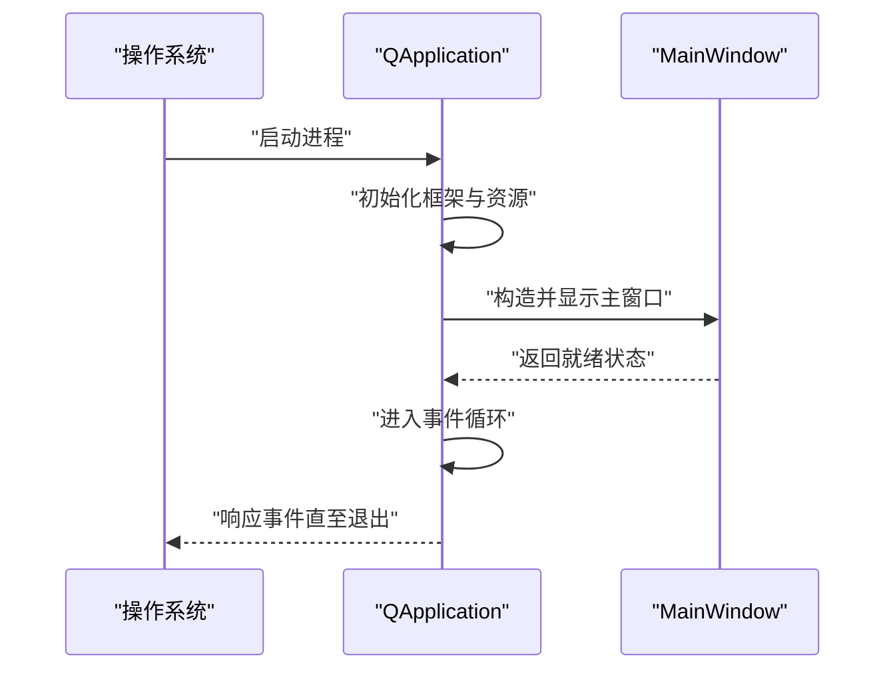
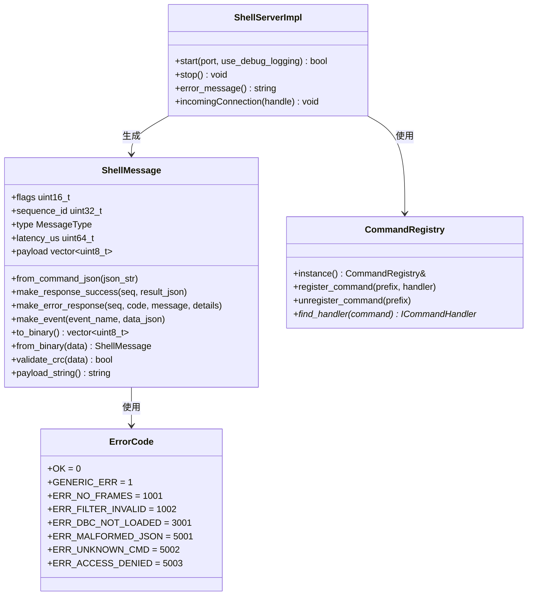
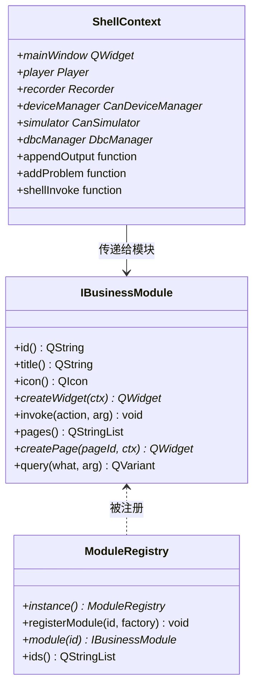
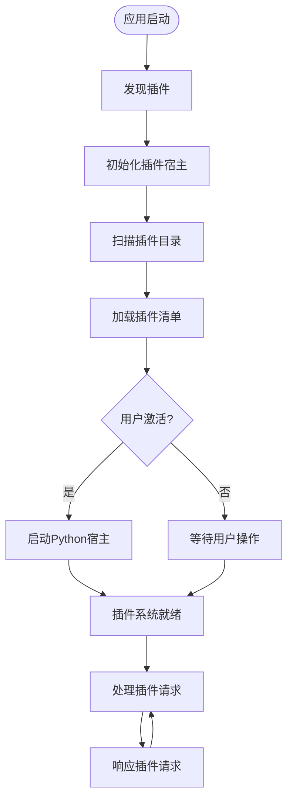
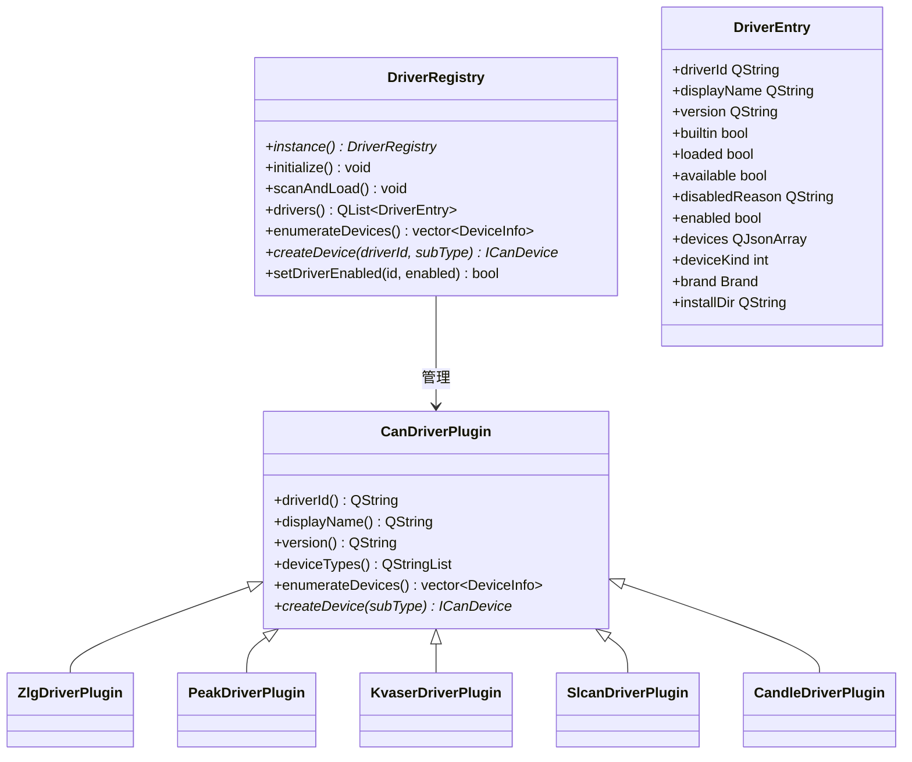
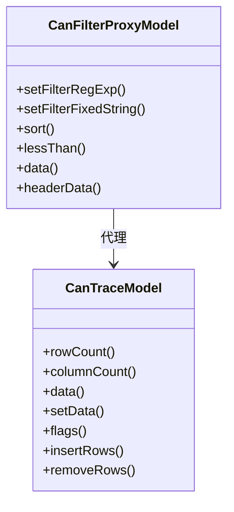
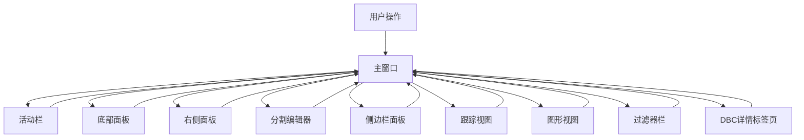
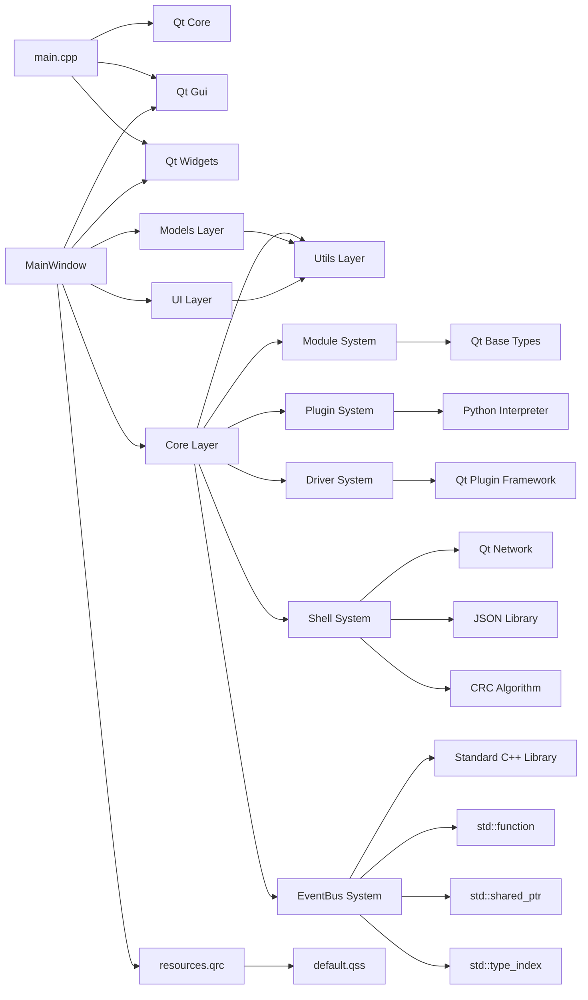

# 架构设计

<cite>
**本文引用的文件**   
- [CMakeLists.txt](file://CMakeLists.txt)
- [src/CMakeLists.txt](file://src/CMakeLists.txt)
- [src/main.cpp](file://src/main.cpp)
- [src/core/eventbus.h](file://src/core/eventbus.h)
- [src/core/signalrelay.h](file://src/core/signalrelay.h)
- [src/core/cansimulator.h](file://src/core/cansimulator.h)
- [src/core/dbcmanager.h](file://src/core/dbcmanager.h)
- [src/core/dbcdata.h](file://src/core/dbcdata.h)
- [src/core/player.h](file://src/core/player.h)
- [src/core/recorder.h](file://src/core/recorder.h)
- [src/models/canfilterproxymodel.h](file://src/models/canfilterproxymodel.h)
- [src/models/cantracemodel.h](file://src/models/cantracemodel.h)
- [src/ui/mainwindow.h](file://src/ui/mainwindow.h)
- [src/ui/activitybar.h](file://src/ui/activitybar.h)
- [src/ui/bottompanel.h](file://src/ui/bottompanel.h)
- [src/ui/rightpanel.h](file://src/ui/rightpanel.h)
- [src/ui/spliteditorarea.h](file://src/ui/spliteditorarea.h)
- [src/ui/panels/sidebarpanels.h](file://src/ui/panels/sidebarpanels.h)
- [src/ui/traceview.h](file://src/ui/traceview.h)
- [src/ui/graphicview.h](file://src/ui/graphicview.h)
- [src/ui/filterbar.h](file://src/ui/filterbar.h)
- [src/ui/dbcdetailtab.h](file://src/ui/dbcdetailtab.h)
- [src/utils/canutils.h](file://src/utils/canutils.h)
- [resources/styles/default.qss](file://resources/styles/default.qss)
- [resources/resources.qrc](file://resources/resources.qrc)
- [README.md](file://README.md)
- [src/core/module/imodule.h](file://src/core/module/imodule.h)
- [src/core/module/moduleregistry.h](file://src/core/module/moduleregistry.h)
- [src/core/plugin/pluginmanager.h](file://src/core/plugin/pluginmanager.h)
- [src/core/plugin/pluginhost.h](file://src/core/plugin/pluginhost.h)
- [src/core/driver/candriverplugin.h](file://src/core/driver/candriverplugin.h)
- [src/core/driver/driverregistry.h](file://src/core/driver/driverregistry.h)
- [drivers/zlg/zlg_driver_plugin.h](file://drivers/zlg/zlg_driver_plugin.h)
- [drivers/CMakeLists.txt](file://drivers/CMakeLists.txt)
- [doc/OAI-02-OpenBUS-CLI-Shell-Protocol.md](file://doc/OAI-02-OpenBUS-CLI-Shell-Protocol.md)
- [src/core/shell/http_rpc_server.h](file://src/core/shell/http_rpc_server.h)
- [src/core/shell/rpc_commands.cpp](file://src/core/shell/rpc_commands.cpp)
</cite>

## 更新摘要
**所做更改**   
- 新增 EventBus 事件总线架构章节，描述类型安全的事件处理机制和 RAII 连接管理
- 更新核心组件分析，增加 EventBus 与现有 Qt 信号槽机制的对比和集成策略
- 扩展性能考虑，添加事件总线性能优化和内存管理策略
- 完善依赖分析，包含 EventBus 的编译时类型检查和运行时开销分析
- 增强故障排查指南，涵盖事件总线调试和连接生命周期管理

## 目录
1. [简介](#简介)
2. [项目结构](#项目结构)
3. [核心组件](#核心组件)
4. [架构总览](#架构总览)
5. [详细组件分析](#详细组件分析)
6. [依赖分析](#依赖分析)
7. [性能考虑](#性能考虑)
8. [故障排查指南](#故障排查指南)
9. [结论](#结论)
10. [附录](#附录)

## 简介
本文件为Qt/C++桌面应用程序的架构设计文档，专注于报文分析工具的MVC模式实现、模块化设计与事件驱动架构。文档基于当前仓库结构与源码进行梳理，给出系统边界、基础设施需求、部署拓扑、技术栈与依赖、以及安全性、监控与灾难恢复等横切关注点的实践建议。项目采用分层架构设计，将核心业务逻辑、UI界面和数据模型清晰分离，支持CAN总线数据的模拟、录制、播放和分析。**最新更新**：通过重大架构重构，将单体应用拆分为模块化DLL架构，实现了动态加载系统和模块注册机制，大幅提升了系统的可扩展性和可维护性。同时引入了驱动插件系统和Python插件生态，为第三方扩展提供了标准化接口。**最新重大更新**：新增 OpenBUS CLI Shell Protocol（OAI-02），为AI Agent集成和自动化系统控制提供标准化的命令行接口，支持TCP远程控制和实时事件推送。**重要架构演进**：引入基于标准C++的EventBus事件总线架构，提供类型安全的事件处理、RAII连接管理和高性能事件分发机制，作为传统Qt信号槽机制的现代化替代方案。

## 项目结构
项目采用清晰的三层架构加上模块化DLL架构：**新增** OpenBUS CLI Shell Protocol 架构和EventBus事件总线架构，形成完整的可编程CAN分析引擎。core层负责核心业务逻辑，models层提供数据模型和视图模型，ui层处理用户界面交互，shell层提供命令行交互接口。资源文件统一管理样式和静态资源，脚本文件包含构建自动化脚本。**重大更新**：新增模块系统、驱动插件系统、Python插件系统、Shell协议系统和EventBus事件总线系统，形成完整的插件化架构和现代化事件驱动机制。

```mermaid
graph TB
A["CMakeLists.txt<br/>顶层构建配置"] --> B["src/CMakeLists.txt<br/>子模块构建配置"]
B --> C["src/main.cpp<br/>应用入口"]
B --> D["src/core/<br/>核心业务逻辑层"]
B --> E["src/models/<br/>数据模型层"]
B --> F["src/ui/<br/>用户界面层"]
B --> G["src/utils/<br/>工具类库"]
D --> H["cansimulator<br/>CAN模拟器"]
D --> I["dbcmanager<br/>DBC管理器"]
D --> J["player<br/>数据播放器"]
D --> K["recorder<br/>数据记录器"]
D --> L["module<br/>模块系统"]
D --> M["plugin<br/>插件系统"]
D --> N["driver<br/>驱动系统"]
D --> O["shell<br/>Shell协议系统"]
D --> P["eventbus<br/>事件总线系统"]
E --> Q["canfilterproxymodel<br/>过滤器代理模型"]
E --> R["cantracemodel<br/>跟踪数据模型"]
F --> S["mainwindow<br/>主窗口"]
F --> T["activitybar<br/>活动栏"]
F --> U["bottompanel<br/>底部面板"]
F --> V["rightpanel<br/>右侧面板"]
F --> W["spliteditorarea<br/>分割编辑器"]
F --> X["panels/sidebarpanels<br/>侧边栏面板"]
F --> Y["traceview<br/>跟踪视图"]
F --> Z["graphicview<br/>图形视图"]
F --> AA["filterbar<br/>过滤器栏"]
F --> BB["dbcdetailtab<br/>DBC详情标签页"]
A --> CC["resources/<br/>资源管理"]
A --> DD["drivers/<br/>驱动插件目录"]
A --> EE["plugins/<br/>Python插件目录"]
DD --> FF["zlg<br/>ZLG驱动"]
DD --> GG["peak<br/>PEAK驱动"]
DD --> HH["kvaser<br/>Kvaser驱动"]
DD --> II["slcan<br/>SLCAN驱动"]
DD --> JJ["candle<br/>Candle驱动"]
EE --> KK["blf-converter<br/>BLF转换器"]
EE --> LL["bus-statistics<br/>总线统计"]
EE --> MM["canopen-explorer<br/>CANopen浏览器"]
EE --> NN["dbc-tool<br/>DBC工具"]
EE --> OO["uds-diagnostic<br/>UDS诊断"]
```



**章节来源**   
- [CMakeLists.txt](file://CMakeLists.txt)
- [src/CMakeLists.txt](file://src/CMakeLists.txt)
- [src/main.cpp](file://src/main.cpp)
- [drivers/CMakeLists.txt](file://drivers/CMakeLists.txt)

## 核心组件
- **应用入口与生命周期管理**：由main.cpp负责创建QApplication实例、设置应用元信息、启动主窗口并进入事件循环。
- **核心业务层（Core）**：包含CAN模拟器、DBC管理器、数据播放器和记录器，提供完整的CAN总线数据处理能力。**重大更新**：新增模块系统、插件系统和驱动系统，形成完整的插件化架构。**新增**：EventBus事件总线系统，提供类型安全的事件处理和RAII连接管理。
- **EventBus事件总线系统**：**新增**：基于标准C++的类型安全事件总线，支持编译时类型检查、RAII连接管理和高性能事件分发，作为Qt信号槽机制的现代化替代方案。
- **Shell协议系统**：**新增**：基于OAI-02协议的命令行交互系统，支持二进制协议编解码、命令注册表、TCP服务器和实时事件推送。
- **模块系统**：基于IBusinessModule接口的业务模块框架，支持动态加载和卸载，提供ShellContext上下文服务。
- **插件系统**：集成Python插件宿主，支持第三方功能扩展，提供插件发现、激活和管理功能。
- **驱动系统**：标准化的CAN设备驱动接口，支持热插拔的设备驱动插件，提供设备枚举和创建设备实例功能。
- **数据模型层（Models）**：实现CAN过滤器代理模型和跟踪数据模型，支持数据过滤、排序和视图绑定。
- **用户界面层（UI）**：主窗口及其子组件构成完整的GUI界面，支持多标签页编辑、实时数据展示和参数配置。
- **工具类库（Utils）**：提供CAN总线通信、文件格式转换、数据解析等通用功能。
- **资源管理系统**：通过qrc文件统一管理样式、图标和其他静态资源，支持运行时主题切换。

**章节来源**   
- [src/main.cpp](file://src/main.cpp)
- [src/core/eventbus.h](file://src/core/eventbus.h)
- [src/core/signalrelay.h](file://src/core/signalrelay.h)
- [src/core/cansimulator.h](file://src/core/cansimulator.h)
- [src/core/dbcmanager.h](file://src/core/dbcmanager.h)
- [src/core/dbcdata.h](file://src/core/dbcdata.h)
- [src/core/player.h](file://src/core/player.h)
- [src/core/recorder.h](file://src/core/recorder.h)
- [src/core/module/imodule.h](file://src/core/module/imodule.h)
- [src/core/plugin/pluginmanager.h](file://src/core/plugin/pluginmanager.h)
- [src/core/driver/candriverplugin.h](file://src/core/driver/candriverplugin.h)
- [src/core/shell/http_rpc_server.h](file://src/core/shell/http_rpc_server.h)
- [src/core/shell/rpc_commands.cpp](file://src/core/shell/rpc_commands.cpp)
- [src/models/canfilterproxymodel.h](file://src/models/canfilterproxymodel.h)
- [src/models/cantracemodel.h](file://src/models/cantracemodel.h)
- [src/utils/canutils.h](file://src/utils/canutils.h)

## 架构总览
本项目采用"MVC + 事件驱动 + 模块化DLL + Shell协议 + EventBus"的分层架构模式，实现了清晰的职责分离和松耦合设计。**重大更新**：通过模块化DLL架构重构，将单体应用拆分为可独立开发和部署的模块，支持动态加载和热插拔。**最新重大更新**：新增 OpenBUS CLI Shell Protocol（OAI-02），为AI Agent集成和自动化控制提供标准化接口。**重要架构演进**：引入EventBus事件总线系统，提供类型安全的事件处理和RAII连接管理，作为传统Qt信号槽机制的现代化替代方案。

- **Model层**：CAN过滤器代理模型和跟踪数据模型提供数据抽象和状态管理。
- **View层**：主窗口及其子组件（活动栏、底部面板、右侧面板、分割编辑器）构成用户界面。
- **Controller层**：核心业务逻辑层处理CAN数据处理、协议解析和业务规则。
- **EventBus层**：**新增**：基于标准C++的类型安全事件总线，提供编译时类型检查、RAII连接管理和高性能事件分发。
- **Shell协议层**：**新增**：基于OAI-02协议的命令行交互系统，支持二进制协议、JSON负载和CRC校验。
- **模块系统**：基于IBusinessModule接口的业务模块框架，支持动态加载和卸载。
- **插件系统**：Python插件宿主，支持第三方功能扩展和自定义处理器。
- **驱动系统**：标准化的CAN设备驱动接口，支持热插拔的设备驱动插件。
- **事件驱动**：结合Qt信号槽机制和EventBus事件总线，实现组件间解耦通信和异步处理。

```mermaid
graph TB
subgraph "应用进程"
App["QApplication<br/>应用生命周期"]
Win["MainWindow<br/>主窗口容器"]
end
subgraph "核心业务层"
Core["Core Layer<br/>核心业务逻辑"]
Simulator["CAN Simulator<br/>CAN模拟器"]
DBCManager["DBC Manager<br/>DBC管理器"]
Player["Player<br/>数据播放器"]
Recorder["Recorder<br/>数据记录器"]
ModuleSystem["Module System<br/>模块系统"]
PluginSystem["Plugin System<br/>插件系统"]
DriverSystem["Driver System<br/>驱动系统"]
ShellSystem["Shell System<br/>Shell协议系统"]
EventBusSystem["EventBus System<br/>事件总线系统"]
end
subgraph "EventBus事件总线"
EventBus["EventBus<br/>事件总线核心"]
Connection["Connection<br/>RAII连接管理"]
Subscriptions["Subscriptions<br/>订阅管理"]
Dispatch["Dispatch<br/>事件分发"]
end
subgraph "Shell协议层"
ShellProtocol["Shell Protocol<br/>OAI-02协议"]
CommandRegistry["Command Registry<br/>命令注册表"]
ShellServer["Shell Server<br/>TCP服务器"]
EventDispatcher["Event Dispatcher<br/>事件分发器"]
end
subgraph "模块系统"
IModule["IBusinessModule<br/>模块接口"]
Registry["ModuleRegistry<br/>模块注册表"]
ShellCtx["ShellContext<br/>模块上下文"]
end
subgraph "插件系统"
PluginMgr["PluginManager<br/>插件管理器"]
PluginHost["PluginHost<br/>插件宿主"]
PythonHost["Python Host<br/>Python宿主进程"]
end
subgraph "驱动系统"
DriverReg["DriverRegistry<br/>驱动注册表"]
DriverIF["CanDriverPlugin<br/>驱动接口"]
Drivers["Drivers<br/>驱动插件"]
end
subgraph "数据模型层"
Models["Models Layer<br/>数据模型"]
FilterModel["CanFilterProxyModel<br/>过滤器代理模型"]
TraceModel["CanTraceModel<br/>跟踪数据模型"]
end
subgraph "用户界面层"
UI["UI Layer<br/>用户界面"]
ActBar["ActivityBar<br/>活动栏"]
BotPanel["BottomPanel<br/>底部面板"]
RightPanel["RightPanel<br/>右侧面板"]
SplitArea["SplitEditorArea<br/>分割编辑器"]
SidePanels["SidebarPanels<br/>侧边栏面板"]
TraceView["TraceView<br/>跟踪视图"]
GraphicView["GraphicView<br/>图形视图"]
FilterBar["FilterBar<br/>过滤器栏"]
DBCDetailTab["DBC Detail Tab<br/>DBC详情标签页"]
end
App --> Win
Win --> Core
Win --> Models
Win --> UI
Core --> Simulator
Core --> DBCManager
Core --> Player
Core --> Recorder
Core --> ModuleSystem
Core --> PluginSystem
Core --> DriverSystem
Core --> ShellSystem
Core --> EventBusSystem
EventBusSystem --> EventBus
EventBusSystem --> Connection
EventBusSystem --> Subscriptions
EventBusSystem --> Dispatch
ShellSystem --> ShellProtocol
ShellSystem --> CommandRegistry
ShellSystem --> ShellServer
ShellSystem --> EventDispatcher
ModuleSystem --> IModule
ModuleSystem --> Registry
ModuleSystem --> ShellCtx
PluginSystem --> PluginMgr
PluginSystem --> PluginHost
PluginHost --> PythonHost
DriverSystem --> DriverReg
DriverSystem --> DriverIF
DriverIF --> Drivers
Models --> FilterModel
Models --> TraceModel
UI --> ActBar
UI --> BotPanel
UI --> RightPanel
UI --> SplitArea
UI --> SidePanels
UI --> TraceView
UI --> GraphicView
UI --> FilterBar
UI --> DBCDetailTab
```



**图表来源**   
- [src/main.cpp](file://src/main.cpp)
- [src/core/eventbus.h](file://src/core/eventbus.h)
- [src/core/cansimulator.h](file://src/core/cansimulator.h)
- [src/core/dbcmanager.h](file://src/core/dbcmanager.h)
- [src/core/dbcdata.h](file://src/core/dbcdata.h)
- [src/core/player.h](file://src/core/player.h)
- [src/core/recorder.h](file://src/core/recorder.h)
- [src/core/module/imodule.h](file://src/core/module/imodule.h)
- [src/core/module/moduleregistry.h](file://src/core/module/moduleregistry.h)
- [src/core/plugin/pluginmanager.h](file://src/core/plugin/pluginmanager.h)
- [src/core/plugin/pluginhost.h](file://src/core/plugin/pluginhost.h)
- [src/core/driver/candriverplugin.h](file://src/core/driver/candriverplugin.h)
- [src/core/driver/driverregistry.h](file://src/core/driver/driverregistry.h)
- [src/core/shell/http_rpc_server.h](file://src/core/shell/http_rpc_server.h)
- [src/core/shell/rpc_commands.cpp](file://src/core/shell/rpc_commands.cpp)
- [src/models/canfilterproxymodel.h](file://src/models/canfilterproxymodel.h)
- [src/models/cantracemodel.h](file://src/models/cantracemodel.h)
- [src/ui/mainwindow.h](file://src/ui/mainwindow.h)
- [src/ui/activitybar.h](file://src/ui/activitybar.h)
- [src/ui/bottompanel.h](file://src/ui/bottompanel.h)
- [src/ui/rightpanel.h](file://src/ui/rightpanel.h)
- [src/ui/spliteditorarea.h](file://src/ui/spliteditorarea.h)
- [src/ui/panels/sidebarpanels.h](file://src/ui/panels/sidebarpanels.h)
- [src/ui/traceview.h](file://src/ui/traceview.h)
- [src/ui/graphicview.h](file://src/ui/graphicview.h)
- [src/ui/filterbar.h](file://src/ui/filterbar.h)
- [src/ui/dbcdetailtab.h](file://src/ui/dbcdetailtab.h)

## 详细组件分析

### 应用入口（main.cpp）
- **职责**：初始化Qt应用环境、设置应用名称与版本、创建并显示主窗口、进入事件循环。
- **关键点**：异常捕获与退出码处理；日志与调试输出；资源路径与样式加载时机。
- **事件流**：应用启动 → 创建主窗口 → 显示 → 进入事件循环 → 响应用户输入与系统事件。



**图表来源**   
- [src/main.cpp](file://src/main.cpp)

**章节来源**   
- [src/main.cpp](file://src/main.cpp)

### EventBus事件总线系统（EventBus System）
- **事件总线核心（EventBus）**：**新增**：基于标准C++的类型安全事件总线，使用模板和type_index实现编译时类型检查，支持任意类型的事件对象。
- **RAII连接管理（Connection）**：**新增**：自动化的连接生命周期管理，确保订阅者在对象销毁时自动断开连接，防止内存泄漏和悬空指针。
- **订阅管理（Subscriptions）**：**新增**：基于unordered_map的高效订阅存储，使用type_index和token组合键实现类型安全的订阅查找。
- **事件分发（Dispatch）**：**新增**：高性能事件分发机制，支持异常隔离和批量事件处理，确保单个处理器的异常不会影响其他处理器。

```mermaid
classDiagram
class EventBus {
+instance() EventBus&
+subscribe(TEvent, HandlerType) Connection
+emit(TEvent, Args...) void
}
class Connection {
+disconnect() void
+is_connected() bool
+~Connection()
}
class SubscribedHandler {
+handler std : : function<void(const void*)>
}
class ConnectionImpl {
+token weak_ptr<void>
}
EventBus --> Connection : 返回
EventBus --> SubscribedHandler : 管理
EventBus --> ConnectionImpl : 创建
Connection --> ConnectionImpl : 持有
```

**图表来源**   
- [src/core/eventbus.h:87-176](file://src/core/eventbus.h#L87-L176)

**章节来源**   
- [src/core/eventbus.h](file://src/core/eventbus.h)

### 核心业务层（Core Layer）
- **CAN模拟器（CAN Simulator）**：模拟CAN总线数据传输，支持多种波特率和帧格式。
- **DBC管理器（DBC Manager）**：解析和管理DBC数据库文件，提供信号和消息定义查询。
- **数据播放器（Player）**：回放录制的CAN数据，支持时间轴控制和速度调节。
- **数据记录器（Recorder）**：实时录制CAN总线数据，支持多种输出格式和压缩选项。
- **Shell协议系统（Shell System）**：**新增**：基于OAI-02协议的命令行交互系统，提供二进制协议编解码、命令注册和TCP服务。
- **模块系统（Module System）**：**新增**：基于IBusinessModule接口的业务模块框架，支持动态加载和卸载。
- **插件系统（Plugin System）**：**新增**：集成Python插件宿主，支持第三方功能扩展。
- **驱动系统（Driver System）**：**新增**：标准化的CAN设备驱动接口，支持热插拔的设备驱动插件。
- **SignalRelay桥接器**：**新增**：解决MinGW DLL中Qt信号槽连接问题的桥接组件，支持lambda和std::function的直接连接。

```mermaid
classDiagram
class CANSimulator {
+发送帧()
+接收帧()
+设置波特率()
+启动模拟()
+停止模拟()
}
class DBCManager {
+加载DBC文件()
+获取消息定义()
+获取信号定义()
+解析数据()
+验证格式()
}
class Player {
+加载数据文件()
+开始播放()
+暂停播放()
+停止播放()
+设置播放速度()
}
class Recorder {
+开始录制()
+停止录制()
+保存数据()
+设置录制格式()
+过滤数据()
}
class ShellSystem {
+start_server()
+stop_server()
+execute_command()
+subscribe_events()
+send_event()
}
class ModuleSystem {
+注册模块()
+获取模块()
+枚举模块()
+模块工厂()
}
class PluginSystem {
+发现插件()
+激活插件()
+停用插件()
+执行命令()
}
class DriverSystem {
+扫描驱动()
+加载驱动()
+创建设备()
+枚举设备()
}
class SignalRelay {
+fire0 std : : function<void()>
+fnString std : : function<void(QString)>
+fire()
+fireQString(QString)
}
CANSimulator --> DBCManager
Player --> DBCManager
Recorder --> DBCManager
ShellSystem --> DBCManager
ShellSystem --> Player
ShellSystem --> Recorder
ModuleSystem --> PluginSystem
ModuleSystem --> DriverSystem
SignalRelay --> QObject : 继承
```

**图表来源**   
- [src/core/cansimulator.h](file://src/core/cansimulator.h)
- [src/core/dbcmanager.h](file://src/core/dbcmanager.h)
- [src/core/dbcdata.h](file://src/core/dbcdata.h)
- [src/core/player.h](file://src/core/player.h)
- [src/core/recorder.h](file://src/core/recorder.h)
- [src/core/shell/http_rpc_server.h](file://src/core/shell/http_rpc_server.h)
- [src/core/shell/rpc_commands.cpp](file://src/core/shell/rpc_commands.cpp)
- [src/core/module/imodule.h](file://src/core/module/imodule.h)
- [src/core/plugin/pluginmanager.h](file://src/core/plugin/pluginmanager.h)
- [src/core/driver/candriverplugin.h](file://src/core/driver/candriverplugin.h)
- [src/core/signalrelay.h](file://src/core/signalrelay.h)

**章节来源**   
- [src/core/cansimulator.h](file://src/core/cansimulator.h)
- [src/core/dbcmanager.h](file://src/core/dbcmanager.h)
- [src/core/dbcdata.h](file://src/core/dbcdata.h)
- [src/core/player.h](file://src/core/player.h)
- [src/core/recorder.h](file://src/core/recorder.h)
- [src/core/shell/http_rpc_server.h](file://src/core/shell/http_rpc_server.h)
- [src/core/shell/rpc_commands.cpp](file://src/core/shell/rpc_commands.cpp)
- [src/core/module/imodule.h](file://src/core/module/imodule.h)
- [src/core/plugin/pluginmanager.h](file://src/core/plugin/pluginmanager.h)
- [src/core/driver/candriverplugin.h](file://src/core/driver/candriverplugin.h)
- [src/core/signalrelay.h](file://src/core/signalrelay.h)

### Shell协议系统（Shell System）
- **协议编解码（Shell Protocol）**：**新增**：实现OAI-02二进制协议，支持CRC校验、消息类型识别和JSON负载处理。
- **命令注册表（Command Registry）**：**新增**：管理命令处理器注册、前缀匹配和动态路由，支持通配符命令模式。
- **TCP服务器（Shell Server）**：**新增**：基于Qt网络模块的TCP服务器，支持多客户端连接和会话管理。
- **事件分发器（Event Dispatcher）**：**新增**：实现发布订阅模式，支持事件过滤、限流和批量推送。



**图表来源**   
- [src/core/shell/http_rpc_server.h](file://src/core/shell/http_rpc_server.h)
- [src/core/shell/rpc_commands.cpp](file://src/core/shell/rpc_commands.cpp)

**章节来源**   
- [src/core/shell/http_rpc_server.h](file://src/core/shell/http_rpc_server.h)
- [src/core/shell/rpc_commands.cpp](file://src/core/shell/rpc_commands.cpp)

### 模块系统（Module System）
- **模块接口（IBusinessModule）**：**新增**：定义业务模块的标准接口，包括模块标识、标题、图标、页面创建等功能。
- **模块注册表（ModuleRegistry）**：**新增**：管理模块的注册、发现和实例化，支持单例模式和懒加载。
- **模块上下文（ShellContext）**：**新增**：提供模块访问宿主应用服务的上下文对象，包含主窗口、数据层服务等。



**图表来源**   
- [src/core/module/imodule.h](file://src/core/module/imodule.h)
- [src/core/module/moduleregistry.h](file://src/core/module/moduleregistry.h)

**章节来源**   
- [src/core/module/imodule.h](file://src/core/module/imodule.h)
- [src/core/module/moduleregistry.h](file://src/core/module/moduleregistry.h)

### 插件系统（Plugin System）
- **插件管理器（PluginManager）**：**新增**：负责插件的发现、激活、停用和消息分发，管理Python插件宿主进程。
- **插件宿主（PluginHost）**：**新增**：管理Python子进程的启动、停止和通信，通过JSON-RPC协议进行双向通信。
- **插件信息（PluginInfo）**：**新增**：描述插件的元数据，包括名称、版本、描述等信息。



**图表来源**   
- [src/core/plugin/pluginmanager.h](file://src/core/plugin/pluginmanager.h)
- [src/core/plugin/pluginhost.h](file://src/core/plugin/pluginhost.h)

**章节来源**   
- [src/core/plugin/pluginmanager.h](file://src/core/plugin/pluginmanager.h)
- [src/core/plugin/pluginhost.h](file://src/core/plugin/pluginhost.h)

### 驱动系统（Driver System）
- **驱动接口（CanDriverPlugin）**：**新增**：定义CAN设备驱动的标准接口，包括设备枚举、创建设备实例等功能。
- **驱动注册表（DriverRegistry）**：**新增**：管理内置和外置驱动的注册、加载和发现，支持热插拔。
- **驱动插件示例**：**新增**：提供ZLG、PEAK、Kvaser、SLCAN、Candle等厂商的驱动插件实现。



**图表来源**   
- [src/core/driver/candriverplugin.h](file://src/core/driver/candriverplugin.h)
- [src/core/driver/driverregistry.h](file://src/core/driver/driverregistry.h)
- [drivers/zlg/zlg_driver_plugin.h](file://drivers/zlg/zlg_driver_plugin.h)

**章节来源**   
- [src/core/driver/candriverplugin.h](file://src/core/driver/candriverplugin.h)
- [src/core/driver/driverregistry.h](file://src/core/driver/driverregistry.h)
- [drivers/zlg/zlg_driver_plugin.h](file://drivers/zlg/zlg_driver_plugin.h)
- [drivers/CMakeLists.txt](file://drivers/CMakeLists.txt)

### 数据模型层（Models Layer）
- **CAN过滤器代理模型（CanFilterProxyModel）**：实现复杂的数据过滤和排序功能，支持多条件筛选。
- **CAN跟踪数据模型（CanTraceModel）**：管理CAN总线跟踪数据，提供高效的内存管理和数据访问接口。



**图表来源**   
- [src/models/canfilterproxymodel.h](file://src/models/canfilterproxymodel.h)
- [src/models/cantracemodel.h](file://src/models/cantracemodel.h)

**章节来源**   
- [src/models/canfilterproxymodel.h](file://src/models/canfilterproxymodel.h)
- [src/models/cantracemodel.h](file://src/models/cantracemodel.h)

### 用户界面层（UI Layer）
- **主窗口（MainWindow）**：承载整个应用程序的UI布局，协调各子组件通信。
- **活动栏（ActivityBar）**：提供垂直工具栏，管理工具按钮、图标显示和状态切换。
- **底部面板（BottomPanel）**：集成日志输出、调试信息和状态显示的底部面板。
- **右侧面板（RightPanel）**：支持配置管理、属性编辑和参数设置的右侧面板。
- **分割编辑器区域（SplitEditorArea）**：实现多文档编辑、标签页管理和内容分割的专业编辑器。
- **侧边栏面板系统（SidebarPanels）**：提供可折叠、可拖拽的面板管理系统。
- **跟踪视图（TraceView）**：专门用于显示CAN总线跟踪数据的可视化组件。
- **图形视图（GraphicView）**：提供图形化数据展示和交互式操作功能。
- **过滤器栏（FilterBar）**：提供快速数据过滤和搜索功能的工具栏。
- **DBC详情标签页（DBC Detail Tab）**：提供直观的DBC文件分析和协议查看界面。



**图表来源**   
- [src/ui/mainwindow.h](file://src/ui/mainwindow.h)
- [src/ui/activitybar.h](file://src/ui/activitybar.h)
- [src/ui/bottompanel.h](file://src/ui/bottompanel.h)
- [src/ui/rightpanel.h](file://src/ui/rightpanel.h)
- [src/ui/spliteditorarea.h](file://src/ui/spliteditorarea.h)
- [src/ui/panels/sidebarpanels.h](file://src/ui/panels/sidebarpanels.h)
- [src/ui/traceview.h](file://src/ui/traceview.h)
- [src/ui/graphicview.h](file://src/ui/graphicview.h)
- [src/ui/filterbar.h](file://src/ui/filterbar.h)
- [src/ui/dbcdetailtab.h](file://src/ui/dbcdetailtab.h)

**章节来源**   
- [src/ui/mainwindow.h](file://src/ui/mainwindow.h)
- [src/ui/activitybar.h](file://src/ui/activitybar.h)
- [src/ui/bottompanel.h](file://src/ui/bottompanel.h)
- [src/ui/rightpanel.h](file://src/ui/rightpanel.h)
- [src/ui/spliteditorarea.h](file://src/ui/spliteditorarea.h)
- [src/ui/panels/sidebarpanels.h](file://src/ui/panels/sidebarpanels.h)
- [src/ui/traceview.h](file://src/ui/traceview.h)
- [src/ui/graphicview.h](file://src/ui/graphicview.h)
- [src/ui/filterbar.h](file://src/ui/filterbar.h)
- [src/ui/dbcdetailtab.h](file://src/ui/dbcdetailtab.h)

### 工具类库（Utils Layer）
- **CAN工具函数（CAN Utils）**：提供CAN总线通信、数据格式转换、校验计算等通用功能。
- **文件操作工具**：支持多种文件格式的读写和转换。
- **字符串处理工具**：提供文本格式化、编码转换和正则表达式支持。

**章节来源**   
- [src/utils/canutils.h](file://src/utils/canutils.h)

### 资源与样式（Resources）
- **资源管理系统**：通过qrc文件统一管理样式、图标和其他静态资源，支持运行时主题切换。
- **样式表（default.qss）**：定义应用程序的整体视觉风格，支持动态修改和主题切换。


**图表来源**   
- [resources/resources.qrc](file://resources/resources.qrc)
- [resources/styles/default.qss](file://resources/styles/default.qss)

**章节来源**   
- [resources/resources.qrc](file://resources/resources.qrc)
- [resources/styles/default.qss](file://resources/styles/default.qss)

### 构建系统（CMakeLists）
- **职责**：定义可执行目标、链接Qt库、设置源文件与资源、配置安装规则。
- **关键点**：跨平台兼容性；Qt模块按需启用；资源与样式打包；调试/发布配置分离。
- **模块化设计**：顶层CMakeLists.txt管理整体项目，src/CMakeLists.txt管理具体模块，支持独立编译和测试。
- **驱动插件构建**：**新增**：drivers/CMakeLists.txt管理驱动插件的构建和部署，支持多个厂商驱动。
- **Shell协议构建**：**新增**：在src/CMakeLists.txt中集成Shell协议相关源文件，支持独立的协议编解码模块。

**章节来源**   
- [CMakeLists.txt](file://CMakeLists.txt)
- [src/CMakeLists.txt](file://src/CMakeLists.txt)
- [drivers/CMakeLists.txt](file://drivers/CMakeLists.txt)

## 依赖分析
- **内部依赖**：main.cpp依赖Qt核心库；MainWindow依赖Qt GUI与UI生成代码；各UI组件间通过信号槽机制通信；核心业务层依赖工具类库。
- **外部依赖**：Qt框架（Core、Gui、Widgets等）；可选的第三方库（网络、数据库、加密等）可按需引入。
- **模块系统依赖**：**新增**：模块系统依赖Qt基础类型和data层类型，禁止直接依赖壳的具体类型。
- **插件系统依赖**：**新增**：插件系统依赖Python解释器和JSON-RPC通信协议。
- **驱动系统依赖**：**新增**：驱动系统依赖Qt插件框架和厂商特定的DLL。
- **Shell协议依赖**：**新增**：Shell协议系统依赖Qt网络模块、JSON库和CRC校验算法。
- **EventBus依赖**：**新增**：EventBus系统依赖标准C++库（functional、memory、typeindex、unordered_map、vector），无Qt依赖，提供纯C++事件处理能力。
- **耦合度**：UI组件间通过信号槽解耦，核心业务层与UI层通过接口隔离，EventBus提供类型安全的事件解耦，便于后续扩展和维护。



**图表来源**   
- [src/main.cpp](file://src/main.cpp)
- [src/core/eventbus.h](file://src/core/eventbus.h)
- [src/core/cansimulator.h](file://src/core/cansimulator.h)
- [src/core/dbcmanager.h](file://src/core/dbcmanager.h)
- [src/core/dbcdata.h](file://src/core/dbcdata.h)
- [src/core/player.h](file://src/core/player.h)
- [src/core/recorder.h](file://src/core/recorder.h)
- [src/core/module/imodule.h](file://src/core/module/imodule.h)
- [src/core/plugin/pluginmanager.h](file://src/core/plugin/pluginmanager.h)
- [src/core/driver/candriverplugin.h](file://src/core/driver/candriverplugin.h)
- [src/core/shell/http_rpc_server.h](file://src/core/shell/http_rpc_server.h)
- [src/core/shell/rpc_commands.cpp](file://src/core/shell/rpc_commands.cpp)
- [src/models/canfilterproxymodel.h](file://src/models/canfilterproxymodel.h)
- [src/models/cantracemodel.h](file://src/models/cantracemodel.h)
- [src/ui/mainwindow.h](file://src/ui/mainwindow.h)
- [src/ui/dbcdetailtab.h](file://src/ui/dbcdetailtab.h)
- [src/utils/canutils.h](file://src/utils/canutils.h)
- [resources/resources.qrc](file://resources/resources.qrc)
- [resources/styles/default.qss](file://resources/styles/default.qss)

**章节来源**   
- [CMakeLists.txt](file://CMakeLists.txt)
- [src/CMakeLists.txt](file://src/CMakeLists.txt)
- [src/main.cpp](file://src/main.cpp)
- [src/core/eventbus.h](file://src/core/eventbus.h)
- [src/core/cansimulator.h](file://src/core/cansimulator.h)
- [src/core/dbcmanager.h](file://src/core/dbcmanager.h)
- [src/core/dbcdata.h](file://src/core/dbcdata.h)
- [src/core/player.h](file://src/core/player.h)
- [src/core/recorder.h](file://src/core/recorder.h)
- [src/core/module/imodule.h](file://src/core/module/imodule.h)
- [src/core/plugin/pluginmanager.h](file://src/core/plugin/pluginmanager.h)
- [src/core/driver/candriverplugin.h](file://src/core/driver/candriverplugin.h)
- [src/core/shell/http_rpc_server.h](file://src/core/shell/http_rpc_server.h)
- [src/core/shell/rpc_commands.cpp](file://src/core/shell/rpc_commands.cpp)
- [src/models/canfilterproxymodel.h](file://src/models/canfilterproxymodel.h)
- [src/models/cantracemodel.h](file://src/models/cantracemodel.h)
- [src/ui/mainwindow.h](file://src/ui/mainwindow.h)
- [src/ui/dbcdetailtab.h](file://src/ui/dbcdetailtab.h)
- [src/utils/canutils.h](file://src/utils/canutils.h)
- [resources/resources.qrc](file://resources/resources.qrc)
- [resources/styles/default.qss](file://resources/styles/default.qss)

## 性能考虑
- **UI渲染**：避免在主线程执行耗时操作；使用异步任务与队列更新UI；合理管理组件可见性。
- **数据缓存**：对频繁访问的DBC数据进行内存缓存；使用LRU算法管理缓存大小。
- **事件循环**：减少阻塞调用；合理拆分任务，保持帧率稳定；使用定时器优化频繁更新。
- **内存管理**：合理使用智能指针与RAII；避免循环引用导致泄漏；及时释放不再使用的资源。
- **构建优化**：开启链接时优化（LTO）、按需启用Qt模块、区分Debug/Release配置。
- **I/O优化**：使用异步文件读写；批量处理大量数据；实现数据流式处理。
- **多线程支持**：利用Qt的多线程机制处理耗时的CAN数据处理任务。
- **模块加载优化**：**新增**：使用懒加载策略减少启动时间；预编译模块元数据；优化模块依赖关系。
- **插件性能优化**：**新增**：限制插件并发数量；实现插件资源隔离；提供插件性能监控。
- **驱动性能优化**：**新增**：批量设备枚举；异步设备连接；驱动级数据缓冲。
- **Shell协议优化**：**新增**：二进制协议减少序列化开销；CRC校验保证数据完整性；事件限流防止系统过载。
- **EventBus性能优化**：**新增**：编译时类型检查减少运行时开销；RAII连接管理避免内存泄漏；异常隔离确保事件分发稳定性；类型索引优化提高订阅查找效率。

## 故障排查指南
- **启动失败**：检查Qt库路径与环境变量；确认qrc资源已正确编译；验证样式表路径有效。
- **UI不显示**：确认主窗口构造与show调用顺序；检查事件循环是否被阻塞；验证组件父子关系。
- **样式失效**：检查qrc中资源路径；确认样式表语法正确；查看控制台错误输出。
- **崩溃定位**：启用调试符号；使用断点与日志定位；必要时使用平台调试工具（如gdb/Visual Studio）。
- **CAN通信问题**：检查硬件连接；验证波特率设置；确认DBC文件路径正确。
- **性能问题**：使用性能分析工具定位瓶颈；检查内存使用情况；优化频繁操作。
- **构建问题**：检查CMake配置；确认Qt安装路径；验证编译器兼容性。
- **模块加载问题**：**新增**：检查模块接口版本兼容性；验证模块依赖关系；查看模块注册日志。
- **插件运行问题**：**新增**：确认Python环境配置；检查插件清单格式；验证插件权限设置。
- **驱动加载问题**：**新增**：验证驱动ABI兼容性；检查厂商DLL依赖；确认驱动签名验证。
- **Shell协议问题**：**新增**：检查端口占用情况；验证二进制协议格式；确认CRC校验结果；调试TCP连接状态。
- **EventBus问题**：**新增**：检查事件类型定义一致性；验证RAII连接生命周期；调试事件分发异常；确认订阅者存活状态。

**章节来源**   
- [src/main.cpp](file://src/main.cpp)
- [resources/resources.qrc](file://resources/resources.qrc)
- [resources/styles/default.qss](file://resources/styles/default.qss)
- [src/core/module/imodule.h](file://src/core/module/imodule.h)
- [src/core/plugin/pluginmanager.h](file://src/core/plugin/pluginmanager.h)
- [src/core/driver/driverregistry.h](file://src/core/driver/driverregistry.h)
- [src/core/shell/http_rpc_server.h](file://src/core/shell/http_rpc_server.h)
- [src/core/shell/rpc_commands.cpp](file://src/core/shell/rpc_commands.cpp)
- [src/core/eventbus.h](file://src/core/eventbus.h)

## 结论
当前项目提供了完善的Qt/C++桌面应用架构，遵循MVC思想与事件驱动模式，实现了清晰的三层架构设计。核心业务层、数据模型层和用户界面层职责明确，通过信号槽机制实现松耦合通信。项目支持CAN总线数据的完整处理流程，包括模拟、录制、播放和分析功能。**重大更新**：通过重大架构重构，将单体应用拆分为模块化DLL架构，实现了动态加载系统和模块注册机制，大幅提升了系统的可扩展性和可维护性。新增的模块系统、插件系统和驱动系统为第三方扩展提供了标准化接口，形成了完整的插件化生态系统。**最新重大更新**：新增 OpenBUS CLI Shell Protocol（OAI-02），为AI Agent集成和自动化系统控制提供标准化的命令行接口，支持TCP远程控制和实时事件推送，使OpenBUS成为真正可编程的CAN分析引擎。**重要架构演进**：引入EventBus事件总线系统，提供类型安全的事件处理和RAII连接管理，作为传统Qt信号槽机制的现代化替代方案，进一步提升了系统的性能和可维护性。建议在后续迭代中继续优化性能，增强错误处理机制，并完善单元测试覆盖。

## 附录
- **技术栈与版本兼容性**
  - 语言：C++（建议C++17及以上）
  - 框架：Qt（Widgets模块为主，Core/Gui/Network/Concurrent等按需启用）
  - 构建：CMake（推荐3.16+）
  - 平台：Windows/Linux/macOS（依据Qt支持）
  - 界面设计：Qt Designer
  - **新增**：Python插件宿主（Python 3.8+）
  - **新增**：Qt插件框架（QPluginLoader）
  - **新增**：JSON-RPC通信协议
  - **新增**：OAI-02二进制协议（CRC-16-CCITT校验）
  - **新增**：标准C++事件总线（std::function、std::shared_ptr、std::type_index）
- **安全与合规**
  - 输入校验与白名单过滤；敏感数据加密存储；权限最小化原则。
  - **新增**：插件沙箱隔离；驱动签名验证；模块ABI兼容性检查。
  - **新增**：Shell协议认证机制；ACL权限控制；危险命令确认。
  - **新增**：EventBus异常隔离；事件类型安全检查；连接生命周期验证。
- **监控与诊断**
  - 结构化日志；崩溃上报；性能指标采集（FPS、内存占用、启动时间）。
  - **新增**：模块加载监控；插件运行状态；驱动健康检查。
  - **新增**：Shell协议连接监控；命令执行统计；事件推送速率监控。
  - **新增**：EventBus订阅监控；事件分发统计；连接生命周期追踪。
- **灾难恢复**
  - 自动备份与恢复；配置回滚；健康检查与自修复机制。
  - **新增**：插件自动重启；驱动热重载；模块降级恢复。
  - **新增**：Shell连接断线重连；命令重试机制；事件队列持久化。
  - **新增**：EventBus连接自动清理；事件处理器异常恢复；订阅者状态同步。
- **部署拓扑**
  - 单机桌面应用；资源内嵌于二进制；可选远程配置中心与更新服务。
  - **新增**：模块化部署；插件独立安装；驱动热插拔支持。
  - **新增**：TCP服务器模式；多客户端并发访问；防火墙端口配置。
  - **新增**：EventBus无依赖部署；纯C++事件处理；跨平台兼容性。

**章节来源**   
- [README.md](file://README.md)
- [CMakeLists.txt](file://CMakeLists.txt)
- [src/CMakeLists.txt](file://src/CMakeLists.txt)
- [src/main.cpp](file://src/main.cpp)
- [resources/resources.qrc](file://resources/resources.qrc)
- [resources/styles/default.qss](file://resources/styles/default.qss)
- [src/core/module/imodule.h](file://src/core/module/imodule.h)
- [src/core/plugin/pluginmanager.h](file://src/core/plugin/pluginmanager.h)
- [src/core/driver/driverregistry.h](file://src/core/driver/driverregistry.h)
- [drivers/CMakeLists.txt](file://drivers/CMakeLists.txt)
- [doc/OAI-02-OpenBUS-CLI-Shell-Protocol.md](file://doc/OAI-02-OpenBUS-CLI-Shell-Protocol.md)
- [src/core/shell/http_rpc_server.h](file://src/core/shell/http_rpc_server.h)
- [src/core/shell/rpc_commands.cpp](file://src/core/shell/rpc_commands.cpp)
- [src/core/eventbus.h](file://src/core/eventbus.h)