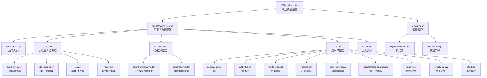
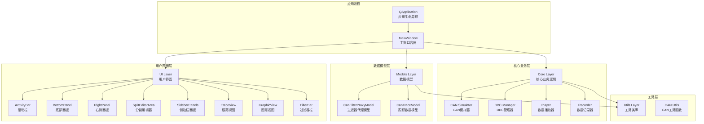
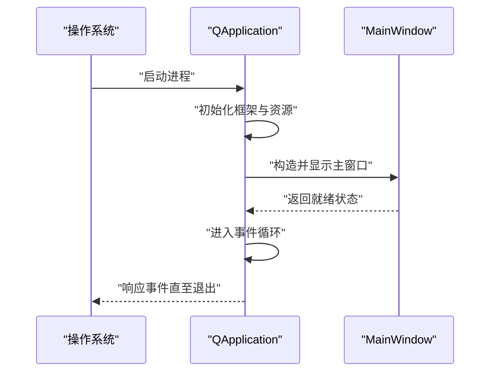
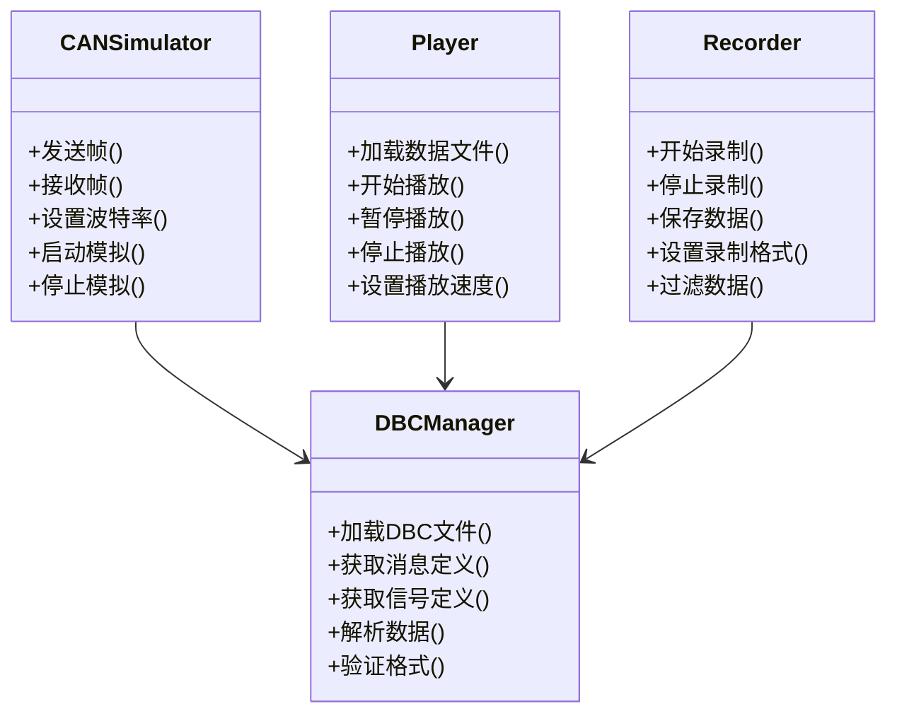
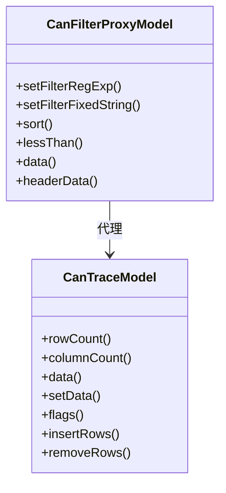
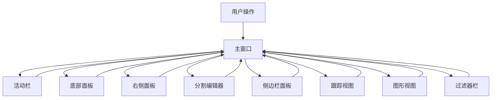
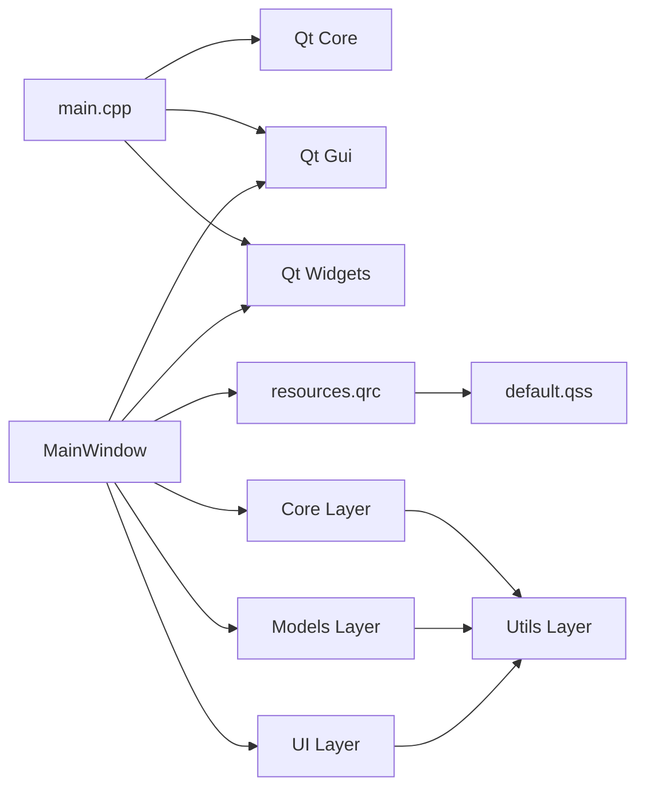

# 架构设计

<cite>
**本文引用的文件**   
- [CMakeLists.txt](file://CMakeLists.txt)
- [src/CMakeLists.txt](file://src/CMakeLists.txt)
- [src/main.cpp](file://src/main.cpp)
- [src/core/cansimulator.h](file://src/core/cansimulator.h)
- [src/core/dbcmanager.h](file://src/core/dbcmanager.h)
- [src/core/player.h](file://src/core/player.h)
- [src/core/recorder.h](file://src/core/recorder.h)
- [src/models/canfilterproxymodel.h](file://src/models/canfilterproxymodel.h)
- [src/models/cantracemodel.h](file://src/models/cantracemodel.h)
- [src/ui/mainwindow.h](file://src/ui/mainwindow.h)
- [src/ui/activitybar.h](file://src/ui/activitybar.h)
- [src/ui/bottompanel.h](file://src/ui/bottompanel.h)
- [src/ui/rightpanel.h](file://src/ui/rightpanel.h)
- [src/ui/spliteditorarea.h](file://src/ui/spliteditorarea.h)
- [src/ui/panels/sidebarpanels.h](file://src/ui/panels/sidebarpanels.h)
- [src/ui/traceview.h](file://src/ui/traceview.h)
- [src/ui/graphicview.h](file://src/ui/graphicview.h)
- [src/ui/filterbar.h](file://src/ui/filterbar.h)
- [src/utils/canutils.h](file://src/utils/canutils.h)
- [resources/styles/default.qss](file://resources/styles/default.qss)
- [resources/resources.qrc](file://resources/resources.qrc)
- [README.md](file://README.md)
</cite>

## 更新摘要
**所做更改**   
- 移除了原'报文分析工具顶层工程/'相关的架构设计文档引用
- 更新了项目结构以反映当前的模块化设计
- 增强了核心组件（CAN模拟器、DBC管理器、播放器、记录器）的架构说明
- 完善了UI组件与核心业务逻辑的分离关系
- 更新了依赖分析和构建系统配置
- 优化了架构图和组件交互图以反映当前实现

## 目录
1. [简介](#简介)
2. [项目结构](#项目结构)
3. [核心组件](#核心组件)
4. [架构总览](#架构总览)
5. [详细组件分析](#详细组件分析)
6. [依赖分析](#依赖分析)
7. [性能考虑](#性能考虑)
8. [故障排查指南](#故障排查指南)
9. [结论](#结论)
10. [附录](#附录)

## 简介
本文件为Qt/C++桌面应用程序的架构设计文档，专注于报文分析工具的MVC模式实现、模块化设计与事件驱动架构。文档基于当前仓库结构与源码进行梳理，给出系统边界、基础设施需求、部署拓扑、技术栈与依赖、以及安全性、监控与灾难恢复等横切关注点的实践建议。项目采用分层架构设计，将核心业务逻辑、UI界面和数据模型清晰分离，支持CAN总线数据的模拟、录制、播放和分析功能。

## 项目结构
项目采用清晰的三层架构：core层负责核心业务逻辑，models层提供数据模型和视图模型，ui层处理用户界面交互。资源文件统一管理样式和静态资源，脚本文件包含构建自动化脚本。整体结构支持模块化开发和独立测试。

**章节来源**   
- [CMakeLists.txt](file://CMakeLists.txt)
- [src/CMakeLists.txt](file://src/CMakeLists.txt)
- [src/main.cpp](file://src/main.cpp)

## 核心组件
- **应用入口与生命周期管理**：由main.cpp负责创建QApplication实例、设置应用元信息、启动主窗口并进入事件循环。
- **核心业务层（Core）**：包含CAN模拟器、DBC管理器、数据播放器和记录器，提供完整的CAN总线数据处理能力。
- **数据模型层（Models）**：实现CAN过滤器代理模型和跟踪数据模型，支持数据过滤、排序和视图绑定。
- **用户界面层（UI）**：主窗口及其子组件构成完整的GUI界面，支持多标签页编辑、实时数据展示和参数配置。
- **工具类库（Utils）**：提供CAN总线通信、文件格式转换、数据解析等通用功能。
- **资源管理系统**：通过qrc文件统一管理样式、图标和其他静态资源，支持运行时主题切换。

**章节来源**   
- [src/main.cpp](file://src/main.cpp)
- [src/core/cansimulator.h](file://src/core/cansimulator.h)
- [src/core/dbcmanager.h](file://src/core/dbcmanager.h)
- [src/core/player.h](file://src/core/player.h)
- [src/core/recorder.h](file://src/core/recorder.h)
- [src/models/canfilterproxymodel.h](file://src/models/canfilterproxymodel.h)
- [src/models/cantracemodel.h](file://src/models/cantracemodel.h)
- [src/utils/canutils.h](file://src/utils/canutils.h)

## 架构总览
本项目采用"MVC + 事件驱动"的分层架构模式，实现了清晰的职责分离和松耦合设计：
- **Model层**：CAN过滤器代理模型和跟踪数据模型提供数据抽象和状态管理。
- **View层**：主窗口及其子组件（活动栏、底部面板、右侧面板、分割编辑器）构成用户界面。
- **Controller层**：核心业务逻辑层处理CAN数据处理、协议解析和业务规则。
- **事件驱动**：基于Qt信号槽机制，实现组件间解耦通信和异步处理。
- **插件化设计**：支持动态加载DBC文件和扩展自定义处理器。

**图表来源**   
- [src/main.cpp](file://src/main.cpp)
- [src/core/cansimulator.h](file://src/core/cansimulator.h)
- [src/core/dbcmanager.h](file://src/core/dbcmanager.h)
- [src/core/player.h](file://src/core/player.h)
- [src/core/recorder.h](file://src/core/recorder.h)
- [src/models/canfilterproxymodel.h](file://src/models/canfilterproxymodel.h)
- [src/models/cantracemodel.h](file://src/models/cantracemodel.h)
- [src/ui/mainwindow.h](file://src/ui/mainwindow.h)
- [src/ui/activitybar.h](file://src/ui/activitybar.h)
- [src/ui/bottompanel.h](file://src/ui/bottompanel.h)
- [src/ui/rightpanel.h](file://src/ui/rightpanel.h)
- [src/ui/spliteditorarea.h](file://src/ui/spliteditorarea.h)
- [src/ui/panels/sidebarpanels.h](file://src/ui/panels/sidebarpanels.h)
- [src/ui/traceview.h](file://src/ui/traceview.h)
- [src/ui/graphicview.h](file://src/ui/graphicview.h)
- [src/ui/filterbar.h](file://src/ui/filterbar.h)
- [src/utils/canutils.h](file://src/utils/canutils.h)

## 详细组件分析

### 应用入口（main.cpp）
- **职责**：初始化Qt应用环境、设置应用名称与版本、创建并显示主窗口、进入事件循环。
- **关键点**：异常捕获与退出码处理；日志与调试输出；资源路径与样式加载时机。
- **事件流**：应用启动 → 创建主窗口 → 显示 → 进入事件循环 → 响应用户输入与系统事件。

**图表来源**   
- [src/main.cpp](file://src/main.cpp)

**章节来源**   
- [src/main.cpp](file://src/main.cpp)

### 核心业务层（Core Layer）
- **CAN模拟器（CAN Simulator）**：模拟CAN总线数据传输，支持多种波特率和帧格式。
- **DBC管理器（DBC Manager）**：解析和管理DBC数据库文件，提供信号和消息定义查询。
- **数据播放器（Player）**：回放录制的CAN数据，支持时间轴控制和速度调节。
- **数据记录器（Recorder）**：实时录制CAN总线数据，支持多种输出格式和压缩选项。

**图表来源**   
- [src/core/cansimulator.h](file://src/core/cansimulator.h)
- [src/core/dbcmanager.h](file://src/core/dbcmanager.h)
- [src/core/player.h](file://src/core/player.h)
- [src/core/recorder.h](file://src/core/recorder.h)

**章节来源**   
- [src/core/cansimulator.h](file://src/core/cansimulator.h)
- [src/core/dbcmanager.h](file://src/core/dbcmanager.h)
- [src/core/player.h](file://src/core/player.h)
- [src/core/recorder.h](file://src/core/recorder.h)

### 数据模型层（Models Layer）
- **CAN过滤器代理模型（CanFilterProxyModel）**：实现复杂的数据过滤和排序功能，支持多条件筛选。
- **CAN跟踪数据模型（CanTraceModel）**：管理CAN总线跟踪数据，提供高效的内存管理和数据访问接口。

**图表来源**   
- [src/models/canfilterproxymodel.h](file://src/models/canfilterproxymodel.h)
- [src/models/cantracemodel.h](file://src/models/cantracemodel.h)

**章节来源**   
- [src/models/canfilterproxymodel.h](file://src/models/canfilterproxymodel.h)
- [src/models/cantracemodel.h](file://src/models/cantracemodel.h)

### 用户界面层（UI Layer）
- **主窗口（MainWindow）**：承载整个应用程序的UI布局，协调各子组件通信。
- **活动栏（ActivityBar）**：提供垂直工具栏，管理工具按钮、图标显示和状态切换。
- **底部面板（BottomPanel）**：集成日志输出、调试信息和状态显示的底部面板。
- **右侧面板（RightPanel）**：支持配置管理、属性编辑和参数设置的右侧面板。
- **分割编辑器区域（SplitEditorArea）**：实现多文档编辑、标签页管理和内容分割的专业编辑器。
- **侧边栏面板系统（SidebarPanels）**：提供可折叠、可拖拽的面板管理系统。
- **跟踪视图（TraceView）**：专门用于显示CAN总线跟踪数据的可视化组件。
- **图形视图（GraphicView）**：提供图形化数据展示和交互式操作功能。
- **过滤器栏（FilterBar）**：提供快速数据过滤和搜索功能的工具栏。

**图表来源**   
- [src/ui/mainwindow.h](file://src/ui/mainwindow.h)
- [src/ui/activitybar.h](file://src/ui/activitybar.h)
- [src/ui/bottompanel.h](file://src/ui/bottompanel.h)
- [src/ui/rightpanel.h](file://src/ui/rightpanel.h)
- [src/ui/spliteditorarea.h](file://src/ui/spliteditorarea.h)
- [src/ui/panels/sidebarpanels.h](file://src/ui/panels/sidebarpanels.h)
- [src/ui/traceview.h](file://src/ui/traceview.h)
- [src/ui/graphicview.h](file://src/ui/graphicview.h)
- [src/ui/filterbar.h](file://src/ui/filterbar.h)

**章节来源**   
- [src/ui/mainwindow.h](file://src/ui/mainwindow.h)
- [src/ui/activitybar.h](file://src/ui/activitybar.h)
- [src/ui/bottompanel.h](file://src/ui/bottompanel.h)
- [src/ui/rightpanel.h](file://src/ui/rightpanel.h)
- [src/ui/spliteditorarea.h](file://src/ui/spliteditorarea.h)
- [src/ui/panels/sidebarpanels.h](file://src/ui/panels/sidebarpanels.h)
- [src/ui/traceview.h](file://src/ui/traceview.h)
- [src/ui/graphicview.h](file://src/ui/graphicview.h)
- [src/ui/filterbar.h](file://src/ui/filterbar.h)

### 工具类库（Utils Layer）
- **CAN工具函数（CAN Utils）**：提供CAN总线通信、数据格式转换、校验计算等通用功能。
- **文件操作工具**：支持多种文件格式的读写和转换。
- **字符串处理工具**：提供文本格式化、编码转换和正则表达式支持。

**章节来源**   
- [src/utils/canutils.h](file://src/utils/canutils.h)

### 资源与样式（Resources）
- **资源管理系统**：通过qrc文件统一管理样式、图标和其他静态资源，支持运行时主题切换。
- **样式表（default.qss）**：定义应用程序的整体视觉风格，支持动态修改和主题切换。

**图表来源**   
- [resources/resources.qrc](file://resources/resources.qrc)
- [resources/styles/default.qss](file://resources/styles/default.qss)

**章节来源**   
- [resources/resources.qrc](file://resources/resources.qrc)
- [resources/styles/default.qss](file://resources/styles/default.qss)

### 构建系统（CMakeLists）
- **职责**：定义可执行目标、链接Qt库、设置源文件与资源、配置安装规则。
- **关键点**：跨平台兼容性；Qt模块按需启用；资源与样式打包；调试/发布配置分离。
- **模块化设计**：顶层CMakeLists.txt管理整体项目，src/CMakeLists.txt管理具体模块，支持独立编译和测试。

**章节来源**   
- [CMakeLists.txt](file://CMakeLists.txt)
- [src/CMakeLists.txt](file://src/CMakeLists.txt)

## 依赖分析
- **内部依赖**：main.cpp依赖Qt核心库；MainWindow依赖Qt GUI与UI生成代码；各UI组件间通过信号槽机制通信；核心业务层依赖工具类库。
- **外部依赖**：Qt框架（Core、Gui、Widgets等）；可选的第三方库（网络、数据库、加密等）可按需引入。
- **耦合度**：UI组件间通过信号槽解耦，核心业务层与UI层通过接口隔离，便于后续扩展和维护。

**图表来源**   
- [src/main.cpp](file://src/main.cpp)
- [src/core/cansimulator.h](file://src/core/cansimulator.h)
- [src/core/dbcmanager.h](file://src/core/dbcmanager.h)
- [src/core/player.h](file://src/core/player.h)
- [src/core/recorder.h](file://src/core/recorder.h)
- [src/models/canfilterproxymodel.h](file://src/models/canfilterproxymodel.h)
- [src/models/cantracemodel.h](file://src/models/cantracemodel.h)
- [src/ui/mainwindow.h](file://src/ui/mainwindow.h)
- [src/utils/canutils.h](file://src/utils/canutils.h)
- [resources/resources.qrc](file://resources/resources.qrc)
- [resources/styles/default.qss](file://resources/styles/default.qss)

**章节来源**   
- [CMakeLists.txt](file://CMakeLists.txt)
- [src/CMakeLists.txt](file://src/CMakeLists.txt)
- [src/main.cpp](file://src/main.cpp)
- [src/core/cansimulator.h](file://src/core/cansimulator.h)
- [src/core/dbcmanager.h](file://src/core/dbcmanager.h)
- [src/core/player.h](file://src/core/player.h)
- [src/core/recorder.h](file://src/core/recorder.h)
- [src/models/canfilterproxymodel.h](file://src/models/canfilterproxymodel.h)
- [src/models/cantracemodel.h](file://src/models/cantracemodel.h)
- [src/ui/mainwindow.h](file://src/ui/mainwindow.h)
- [src/utils/canutils.h](file://src/utils/canutils.h)
- [resources/resources.qrc](file://resources/resources.qrc)
- [resources/styles/default.qss](file://resources/styles/default.qss)

## 性能考虑
- **UI渲染**：避免在主线程执行耗时操作；使用异步任务与队列更新UI；合理管理组件可见性。
- **数据缓存**：对频繁访问的DBC数据进行内存缓存；使用LRU算法管理缓存大小。
- **事件循环**：减少阻塞调用；合理拆分任务，保持帧率稳定；使用定时器优化频繁更新。
- **内存管理**：合理使用智能指针与RAII；避免循环引用导致泄漏；及时释放不再使用的资源。
- **构建优化**：开启链接时优化（LTO）、按需启用Qt模块、区分Debug/Release配置。
- **I/O优化**：使用异步文件读写；批量处理大量数据；实现数据流式处理。
- **多线程支持**：利用Qt的多线程机制处理耗时的CAN数据处理任务。

## 故障排查指南
- **启动失败**：检查Qt库路径与环境变量；确认qrc资源已正确编译；验证样式表路径有效。
- **UI不显示**：确认主窗口构造与show调用顺序；检查事件循环是否被阻塞；验证组件父子关系。
- **样式失效**：检查qrc中资源路径；确认样式表语法正确；查看控制台错误输出。
- **崩溃定位**：启用调试符号；使用断点与日志定位；必要时使用平台调试工具（如gdb/Visual Studio）。
- **CAN通信问题**：检查硬件连接；验证波特率设置；确认DBC文件路径正确。
- **性能问题**：使用性能分析工具定位瓶颈；检查内存使用情况；优化频繁操作。
- **构建问题**：检查CMake配置；确认Qt安装路径；验证编译器兼容性。

**章节来源**   
- [src/main.cpp](file://src/main.cpp)
- [resources/resources.qrc](file://resources/resources.qrc)
- [resources/styles/default.qss](file://resources/styles/default.qss)

## 结论
当前项目提供了完善的Qt/C++桌面应用架构，遵循MVC思想与事件驱动模式，实现了清晰的三层架构设计。核心业务层、数据模型层和用户界面层职责明确，通过信号槽机制实现松耦合通信。项目支持CAN总线数据的完整处理流程，包括模拟、录制、播放和分析功能。新增的工具类库和资源管理系统为功能扩展提供了良好基础。建议在后续迭代中继续优化性能，增强错误处理机制，并完善单元测试覆盖。

## 附录
- **技术栈与版本兼容性**
  - 语言：C++（建议C++17及以上）
  - 框架：Qt（Widgets模块为主，Core/Gui/Network/Concurrent等按需启用）
  - 构建：CMake（推荐3.16+）
  - 平台：Windows/Linux/macOS（依据Qt支持）
  - 界面设计：Qt Designer
- **安全与合规**
  - 输入校验与白名单过滤；敏感数据加密存储；权限最小化原则。
- **监控与诊断**
  - 结构化日志；崩溃上报；性能指标采集（FPS、内存占用、启动时间）。
- **灾难恢复**
  - 自动备份与恢复；配置回滚；健康检查与自修复机制。
- **部署拓扑**
  - 单机桌面应用；资源内嵌于二进制；可选远程配置中心与更新服务。

**章节来源**   
- [README.md](file://README.md)
- [CMakeLists.txt](file://CMakeLists.txt)
- [src/CMakeLists.txt](file://src/CMakeLists.txt)
- [src/main.cpp](file://src/main.cpp)
- [resources/resources.qrc](file://resources/resources.qrc)
- [resources/styles/default.qss](file://resources/styles/default.qss)