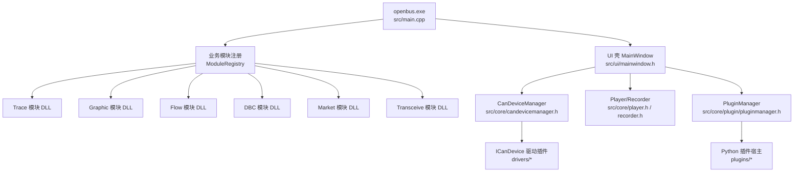
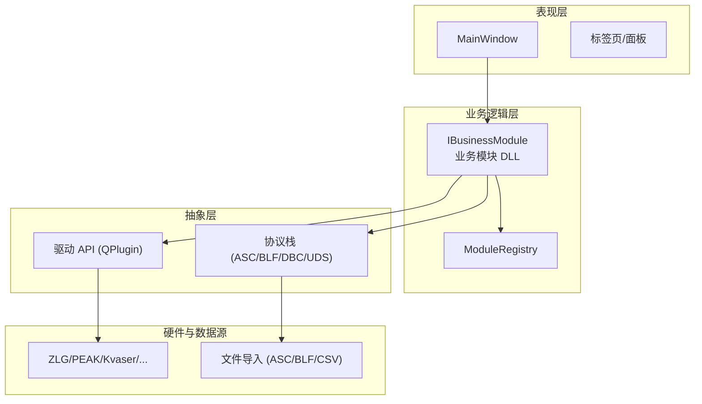
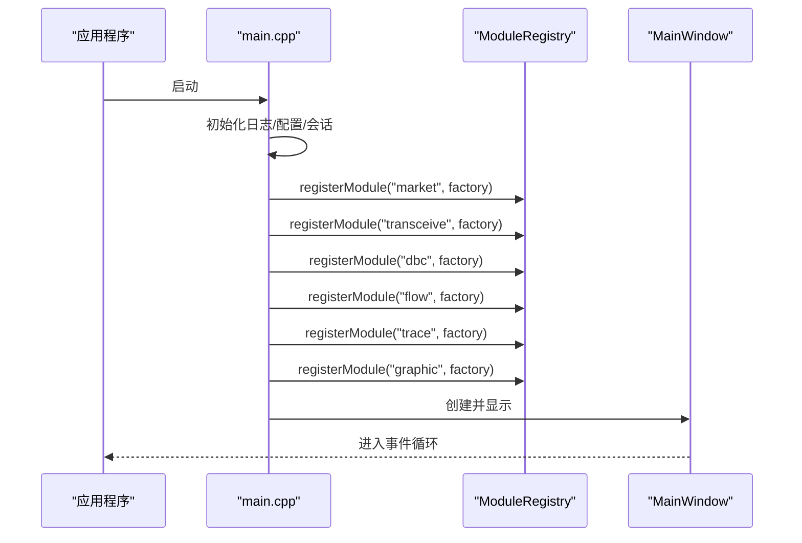
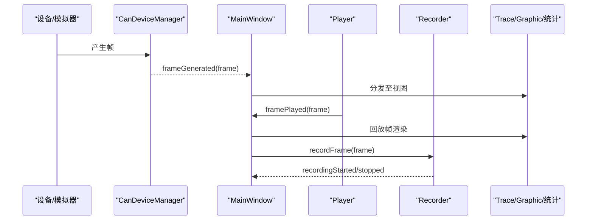
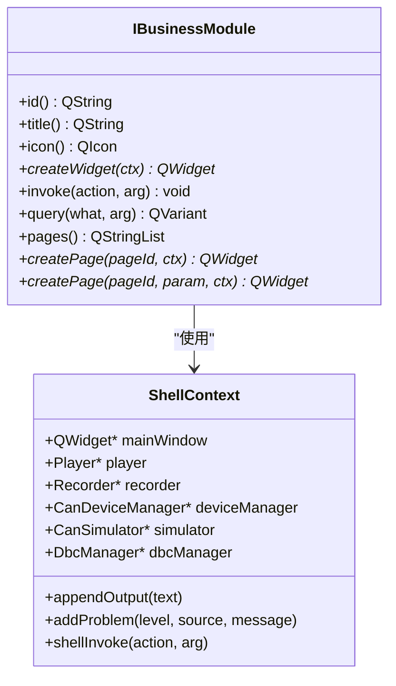
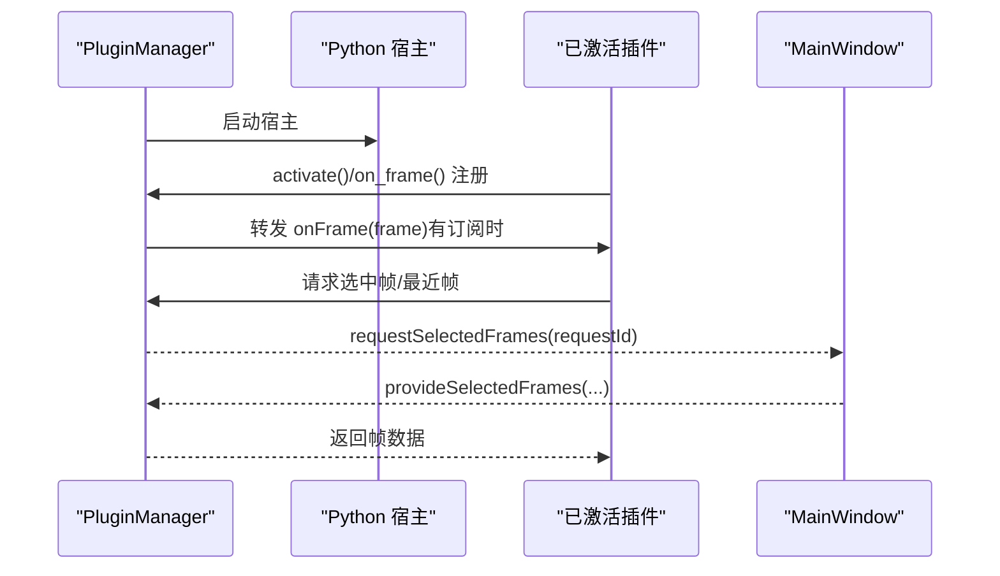
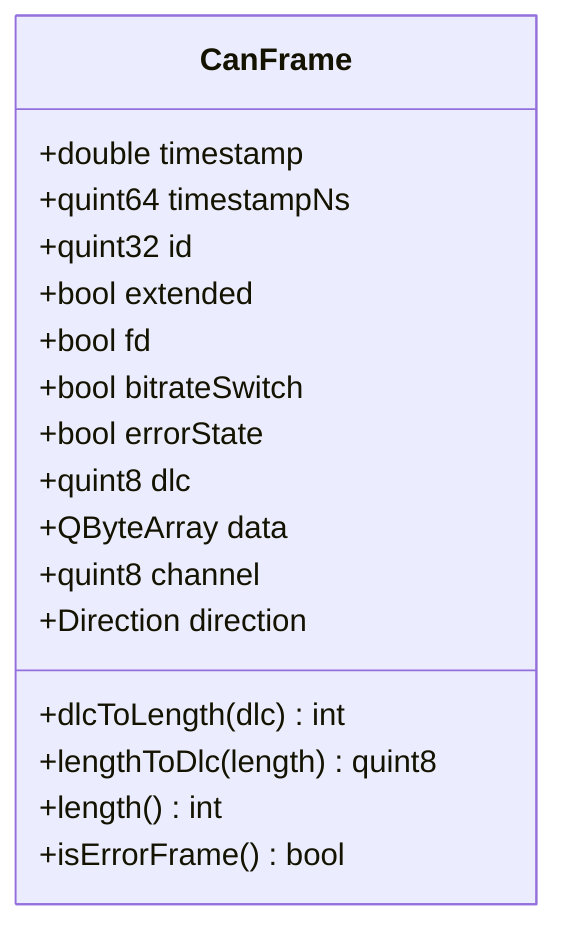
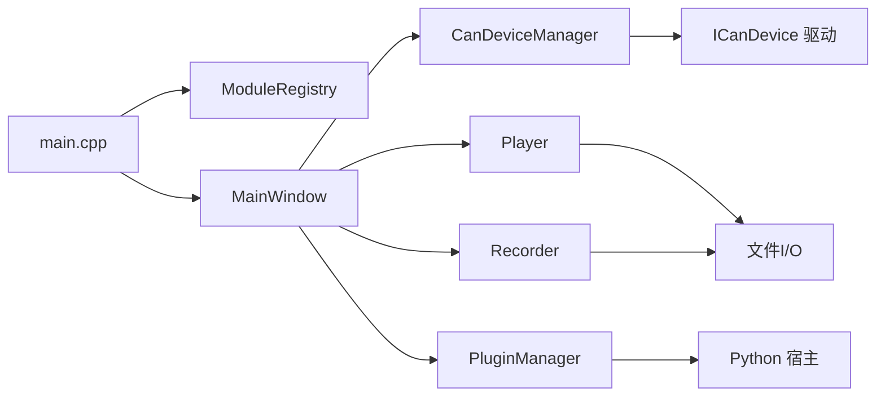

# 系统架构设计

<cite>
**本文引用的文件**
- [README.md](file://README.md)
- [doc/System_Architecture.md](file://doc/System_Architecture.md)
- [CMakeLists.txt](file://CMakeLists.txt)
- [src/main.cpp](file://src/main.cpp)
- [src/core/canframe.h](file://src/core/canframe.h)
- [src/core/module/imodule.h](file://src/core/module/imodule.h)
- [src/core/plugin/pluginmanager.h](file://src/core/plugin/pluginmanager.h)
- [src/core/candevicemanager.h](file://src/core/candevicemanager.h)
- [src/ui/mainwindow.h](file://src/ui/mainwindow.h)
- [src/core/recorder.h](file://src/core/recorder.h)
- [src/core/player.h](file://src/core/player.h)
</cite>

## 目录
1. [简介](#简介)
2. [项目结构](#项目结构)
3. [核心组件](#核心组件)
4. [架构总览](#架构总览)
5. [详细组件分析](#详细组件分析)
6. [依赖关系分析](#依赖关系分析)
7. [性能考量](#性能考量)
8. [故障排查指南](#故障排查指南)
9. [结论](#结论)
10. [附录](#附录)

## 简介
本仓库是一个面向 CAN/CAN FD 的报文录制、回放、解析与分析桌面工具。整体采用“壳 + 业务模块 DLL + 插件”的分层架构：主程序负责初始化与编排，业务模块以动态库形式提供 Trace/Graphic/Flow/DBC/Market/Transceive 等能力，Python 插件通过进程外宿主扩展分析工具链。数据流围绕 CanFrame 在设备/模拟器、回放器、录制器、视图与插件之间流转，并通过统一的 ShellContext 与 invoke/query 契约进行跨模块通信。

**章节来源**
- [README.md:17-111](file://README.md#L17-L111)
- [doc/System_Architecture.md:17-68](file://doc/System_Architecture.md#L17-L68)

## 项目结构
- 顶层 CMake 工程定义版本、Qt 依赖、第三方库集成与子目录组织（src、drivers）。
- src 下分为 core（数据与引擎）、models（模型）、ui（界面）、utils（工具）。
- drivers 为硬件驱动插件（.odp），按厂商分目录，包含 driver.json 与实现。
- plugins 为 Python 工具插件，每个插件含 main.py 与 plugin.json，共享 sdk/sin 接口。
- resources/styles 提供主题样式；scripts 提供构建与打包脚本。

**图表来源**
- [src/main.cpp:21-64](file://src/main.cpp#L21-L64)
- [src/ui/mainwindow.h:43-55](file://src/ui/mainwindow.h#L43-L55)
- [src/core/candevicemanager.h:16-24](file://src/core/candevicemanager.h#L16-L24)
- [src/core/recorder.h:12-17](file://src/core/recorder.h#L12-L17)
- [src/core/player.h:9-14](file://src/core/player.h#L9-L14)
- [src/core/plugin/pluginmanager.h:20-28](file://src/core/plugin/pluginmanager.h#L20-L28)

**章节来源**
- [CMakeLists.txt:1-95](file://CMakeLists.txt#L1-L95)
- [README.md:568-611](file://README.md#L568-L611)

## 核心组件
- 主程序入口：初始化 Qt、日志、配置与会话，注册业务模块并启动主窗口。
- 主窗口（MainWindow）：负责 UI 布局、菜单/面板、数据管线连接、模块编排与事件分发。
- 设备管理器（CanDeviceManager）：统一封装内置模拟器与各硬件驱动，对外暴露帧生成信号与发送接口。
- 回放器（Player）：从文件或内存加载帧序列，按时间戳回放，支持速度/循环/跳转。
- 录制器（Recorder）：将帧流式写入 BLF/ASC/CSV 等格式。
- 模块接口（IBusinessModule）：壳与业务 DLL 的唯一契约，提供 createWidget/createPage/invoke/query 等能力。
- 插件管理器（PluginManager）：发现、激活/停用 Python 插件，转发帧与命令，管理安装/卸载。
- 数据模型（CanFrame）：CAN/CAN FD 帧的统一数据结构，贯穿全流程。

**章节来源**
- [src/main.cpp:21-64](file://src/main.cpp#L21-L64)
- [src/ui/mainwindow.h:43-55](file://src/ui/mainwindow.h#L43-L55)
- [src/core/candevicemanager.h:16-24](file://src/core/candevicemanager.h#L16-L24)
- [src/core/player.h:9-14](file://src/core/player.h#L9-L14)
- [src/core/recorder.h:12-17](file://src/core/recorder.h#L12-L17)
- [src/core/module/imodule.h:90-200](file://src/core/module/imodule.h#L90-L200)
- [src/core/plugin/pluginmanager.h:20-28](file://src/core/plugin/pluginmanager.h#L20-L28)
- [src/core/canframe.h:8-13](file://src/core/canframe.h#L8-L13)

## 架构总览
系统采用分层与插件化设计：
- 表现层：MainWindow 及可停靠面板、标签页、侧边栏。
- 业务逻辑层：各业务模块 DLL（Trace/Graphic/Flow/DBC/Market/Transceive），通过 IBusinessModule 暴露页面与动作。
- 抽象层：驱动 API（QPlugin 动态加载）与协议栈（ASC/BLF/DBC/UDS 解析）。
- 硬件与数据源：ZLG/PEAK/Kvaser/SLCAN/Candle 驱动与文件导入。

**图表来源**
- [doc/System_Architecture.md:28-68](file://doc/System_Architecture.md#L28-L68)
- [src/core/module/imodule.h:90-200](file://src/core/module/imodule.h#L90-L200)

**章节来源**
- [doc/System_Architecture.md:28-68](file://doc/System_Architecture.md#L28-L68)

## 详细组件分析

### 主程序与模块装配
- 入口 main.cpp 注册元类型、初始化日志、加载配置与会话，通过 ModuleRegistry 注册市场、收发、DBC、Flow、Trace、Graphic 模块工厂函数，应用主题后创建并显示 MainWindow。
- 模块以 C 工厂导出，壳仅依赖接口与约定，避免强耦合。

**图表来源**
- [src/main.cpp:21-64](file://src/main.cpp#L21-L64)

**章节来源**
- [src/main.cpp:21-64](file://src/main.cpp#L21-L64)

### 数据流：实时采集与回放
- 设备/模拟器产生 CanFrame，经 CanDeviceManager 统一转发 frameGenerated 信号。
- 回放器 Player 从文件/内存加载帧序列，按时间推进发射 framePlayed。
- 录制器 Recorder 接收帧并写入目标格式。
- 主窗口连接这些信号到 Trace/Graphic/统计等视图。

**图表来源**
- [src/core/candevicemanager.h:16-24](file://src/core/candevicemanager.h#L16-L24)
- [src/core/player.h:9-14](file://src/core/player.h#L9-L14)
- [src/core/recorder.h:12-17](file://src/core/recorder.h#L12-L17)
- [src/ui/mainwindow.h:87-103](file://src/ui/mainwindow.h#L87-L103)

**章节来源**
- [src/core/candevicemanager.h:16-24](file://src/core/candevicemanager.h#L16-L24)
- [src/core/player.h:9-14](file://src/core/player.h#L9-L14)
- [src/core/recorder.h:12-17](file://src/core/recorder.h#L12-L17)
- [src/ui/mainwindow.h:87-103](file://src/ui/mainwindow.h#L87-L103)

### 模块间通信：ShellContext 与 invoke/query
- 业务模块通过 ShellContext 访问数据层服务（Player/Recorder/DeviceManager/Simulator/DbcManager）与壳回调（输出、问题、打开页面、测量启停等）。
- 模块通过 invoke/query 字符串约定与壳交互，避免直接依赖具体 UI 类型。

**图表来源**
- [src/core/module/imodule.h:31-88](file://src/core/module/imodule.h#L31-L88)
- [src/core/module/imodule.h:90-200](file://src/core/module/imodule.h#L90-L200)

**章节来源**
- [src/core/module/imodule.h:31-88](file://src/core/module/imodule.h#L31-L88)
- [src/core/module/imodule.h:90-200](file://src/core/module/imodule.h#L90-L200)

### 插件系统：Python 插件宿主与消息分发
- PluginManager 扫描 plugins/ 目录，启动 Python 宿主进程，管理插件激活/停用、命令执行、帧订阅与批量缓冲。
- 插件通过 SDK 调用 signals/files/workspace 等能力，主程序提供选中帧/最近帧等数据回复。

**图表来源**
- [src/core/plugin/pluginmanager.h:20-28](file://src/core/plugin/pluginmanager.h#L20-L28)
- [src/core/plugin/pluginmanager.h:65-115](file://src/core/plugin/pluginmanager.h#L65-L115)

**章节来源**
- [src/core/plugin/pluginmanager.h:20-28](file://src/core/plugin/pluginmanager.h#L20-L28)
- [src/core/plugin/pluginmanager.h:65-115](file://src/core/plugin/pluginmanager.h#L65-L115)

### 数据模型：CanFrame
- CanFrame 是全局帧结构，包含时间戳（秒与纳秒）、ID、扩展位、FD/BRS/ESI、DLC、数据、通道、方向等，并提供 DLC 转换与序列化/反序列化。
- 由 CanDeviceManager 统一填充纳秒级时间戳，确保多设备时间轴一致。

**图表来源**
- [src/core/canframe.h:8-13](file://src/core/canframe.h#L8-L13)
- [src/core/canframe.h:14-120](file://src/core/canframe.h#L14-L120)

**章节来源**
- [src/core/canframe.h:8-13](file://src/core/canframe.h#L8-L13)
- [src/core/canframe.h:14-120](file://src/core/canframe.h#L14-L120)

## 依赖关系分析
- 主程序依赖 UI 壳与业务模块注册表；业务模块依赖 ShellContext 提供的数据层服务。
- 设备管理器依赖 ICanDevice 抽象与无锁队列，屏蔽不同硬件差异。
- 回放器/录制器依赖文件格式 I/O 抽象，支持多种日志格式。
- 插件管理器依赖 Python 宿主与 SDK，提供进程外扩展能力。

**图表来源**
- [src/main.cpp:21-64](file://src/main.cpp#L21-L64)
- [src/ui/mainwindow.h:43-55](file://src/ui/mainwindow.h#L43-L55)
- [src/core/candevicemanager.h:16-24](file://src/core/candevicemanager.h#L16-L24)
- [src/core/player.h:9-14](file://src/core/player.h#L9-L14)
- [src/core/recorder.h:12-17](file://src/core/recorder.h#L12-L17)
- [src/core/plugin/pluginmanager.h:20-28](file://src/core/plugin/pluginmanager.h#L20-L28)

**章节来源**
- [src/main.cpp:21-64](file://src/main.cpp#L21-L64)
- [src/ui/mainwindow.h:43-55](file://src/ui/mainwindow.h#L43-L55)
- [src/core/candevicemanager.h:16-24](file://src/core/candevicemanager.h#L16-L24)
- [src/core/player.h:9-14](file://src/core/player.h#L9-L14)
- [src/core/recorder.h:12-17](file://src/core/recorder.h#L12-L17)
- [src/core/plugin/pluginmanager.h:20-28](file://src/core/plugin/pluginmanager.h#L20-L28)

## 性能考量
- 时间戳归一化：CanDeviceManager 使用单调时钟填充纳秒级时间戳，保证多设备一致性。
- 批量消费：设备接收线程通过定时器在主线程批量消费队列，降低 UI 压力。
- 回放精度：Player 基于原始时间戳控制播放节奏，支持变速与跳转。
- 录制效率：Recorder 根据扩展名选择写入器，流式写入减少内存占用。
- 插件零开销：无帧订阅时不缓冲、不序列化，避免额外开销。

**章节来源**
- [src/core/canframe.h:18-24](file://src/core/canframe.h#L18-L24)
- [src/core/candevicemanager.h:132-142](file://src/core/candevicemanager.h#L132-L142)
- [src/core/player.h:46-59](file://src/core/player.h#L46-L59)
- [src/core/recorder.h:22-36](file://src/core/recorder.h#L22-L36)
- [src/core/plugin/pluginmanager.h:151-164](file://src/core/plugin/pluginmanager.h#L151-L164)

## 故障排查指南
- 主程序异常捕获：main.cpp 捕获未处理异常并记录日志，弹出错误提示。
- 设备连接状态：CanDeviceManager 通过 connectionChanged/errorOccurred 信号反馈连接变化与错误信息。
- 回放/录制状态：Player/Recorder 提供 stateChanged/frameRecorded/recordingStarted/stopped 等信号用于 UI 状态同步。
- 插件宿主健康：PluginManager 维护宿主进程 PID 与崩溃自愈机制，重启后重激活已启用插件。

**章节来源**
- [src/main.cpp:65-77](file://src/main.cpp#L65-L77)
- [src/core/candevicemanager.h:104-112](file://src/core/candevicemanager.h#L104-L112)
- [src/core/player.h:54-59](file://src/core/player.h#L54-L59)
- [src/core/recorder.h:38-41](file://src/core/recorder.h#L38-L41)
- [src/core/plugin/pluginmanager.h:52-59](file://src/core/plugin/pluginmanager.h#L52-L59)

## 结论
该架构通过清晰的层次划分与插件化扩展，实现了 CAN/CAN FD 报文的全流程处理能力：设备/模拟器接入、帧统一建模、回放/录制、可视化分析与 Python 插件生态。模块间以 ShellContext 与 invoke/query 解耦，便于独立演进与热插拔。未来可在 DBC 查找优化、视口降采样、多 Y 轴与游标联动等方面继续增强用户体验与性能。

## 附录
- 构建与部署：参考根 CMake 配置与 README 中的构建步骤。
- 文档索引：参见 doc/System_Architecture.md 与 README.md 的设计文档索引。

**章节来源**
- [CMakeLists.txt:1-95](file://CMakeLists.txt#L1-L95)
- [README.md:613-640](file://README.md#L613-L640)
- [doc/System_Architecture.md:17-68](file://doc/System_Architecture.md#L17-L68)