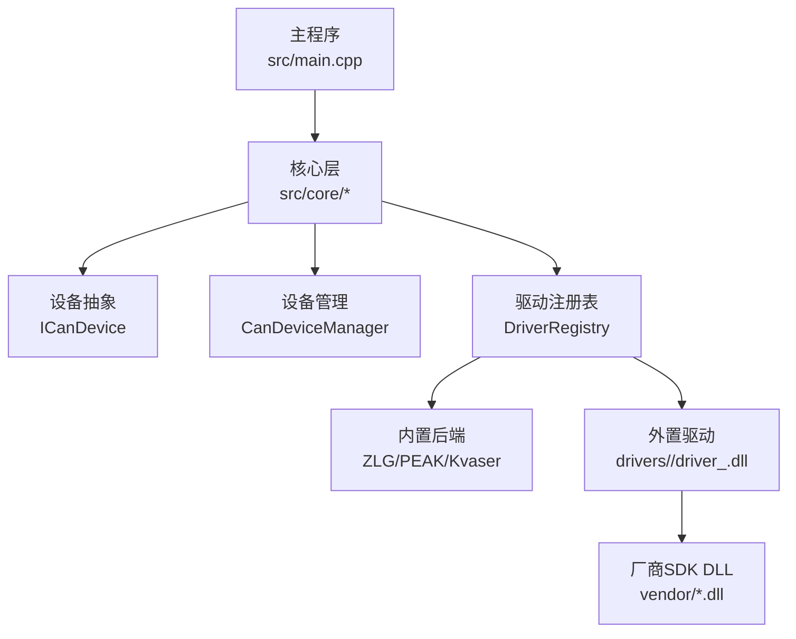
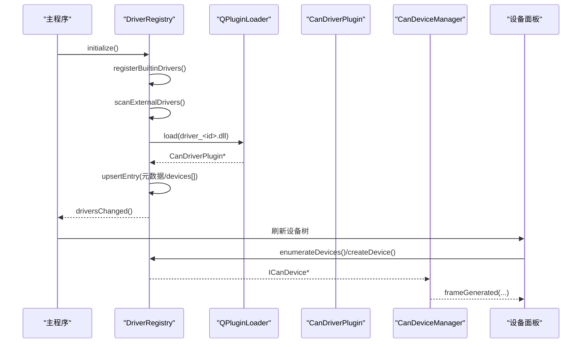
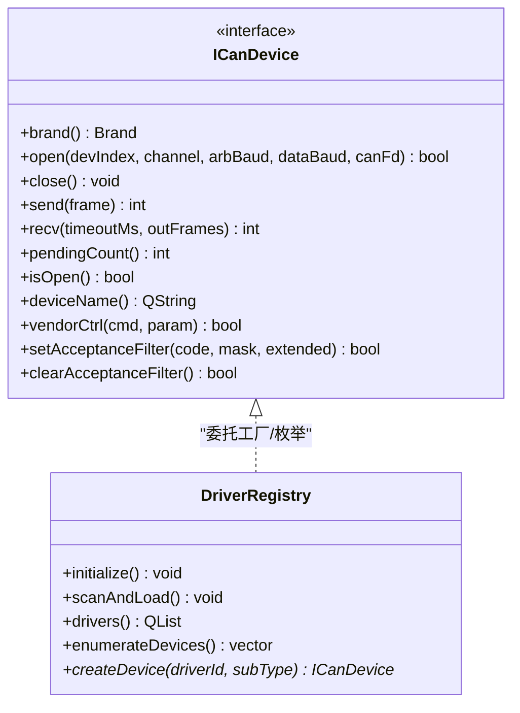
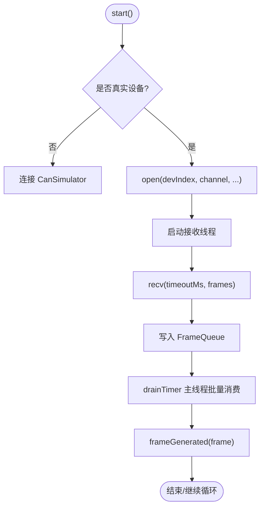
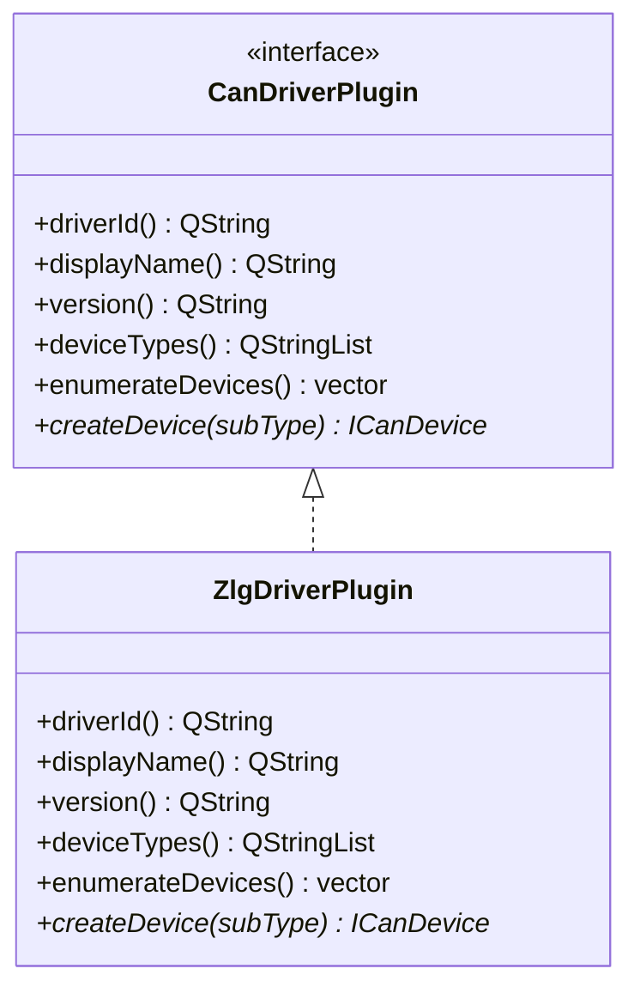
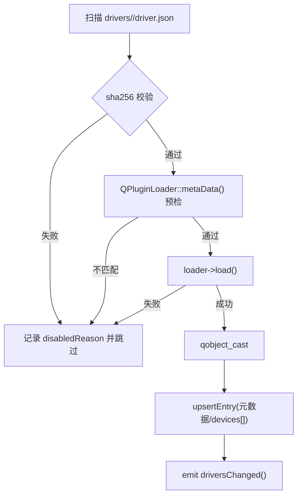
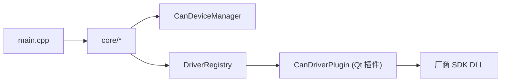

# 驱动系统方案

<cite>
**本文引用的文件**
- [doc/驱动系统方案.md](file://doc/驱动系统方案.md)
- [README.md](file://README.md)
- [CMakeLists.txt](file://CMakeLists.txt)
- [src/main.cpp](file://src/main.cpp)
- [driver/zlgcan.h](file://driver/zlgcan.h)
- [src/core/candevice.h](file://src/core/candevice.h)
- [src/core/candevicemanager.h](file://src/core/candevicemanager.h)
- [src/core/driver/candriverplugin.h](file://src/core/driver/candriverplugin.h)
- [src/core/driver/driverregistry.h](file://src/core/driver/driverregistry.h)
- [drivers/zlg/zlg_driver_plugin.h](file://drivers/zlg/zlg_driver_plugin.h)
- [drivers/zlg/driver.json](file://drivers/zlg/driver.json)
</cite>

## 目录
1. [简介](#简介)
2. [项目结构](#项目结构)
3. [核心组件](#核心组件)
4. [架构总览](#架构总览)
5. [详细组件分析](#详细组件分析)
6. [依赖关系分析](#依赖关系分析)
7. [性能与可靠性](#性能与可靠性)
8. [故障排查指南](#故障排查指南)
9. [结论](#结论)
10. [附录](#附录)

## 简介
本方案将 CAN/CAN FD 采集硬件驱动从主程序静态编译迁移为“可从官方应用市场下载安装的驱动插件包”，以原生代码在主进程内运行，实现低时延、可热加载的设备接入。现有 ICanDevice 抽象与 CanDeviceManager 管线保持不变，新增 DriverRegistry 作为统一装配点，支持内置驱动（ZLG/PEAK/Kvaser）与外置 .odp 驱动的统一发现、安装、枚举与创建。

## 项目结构
- 顶层 CMake 配置引入 Qt6、第三方依赖，并分别构建主程序与 drivers 子模块。
- src/core 提供设备抽象、管理器、文件格式、DBC、插件宿主等核心能力。
- drivers 下按厂商组织驱动插件工程（如 zlg），每个驱动包含 driver.json 清单与 Qt 插件实现。
- UI 层通过侧边栏与标签页展示设备树与“新增设备”入口，后续由 Registry 动态驱动。

图表来源
- [CMakeLists.txt:1-66](file://CMakeLists.txt#L1-L66)
- [src/main.cpp:1-54](file://src/main.cpp#L1-L54)
- [src/core/candevicemanager.h:1-141](file://src/core/candevicemanager.h#L1-L141)
- [src/core/driver/driverregistry.h:1-100](file://src/core/driver/driverregistry.h#L1-L100)

章节来源
- [CMakeLists.txt:1-66](file://CMakeLists.txt#L1-L66)
- [src/main.cpp:1-54](file://src/main.cpp#L1-L54)

## 核心组件
- ICanDevice：统一的设备操作契约（open/close/send/recv/vendorCtrl/滤波），时间戳归一化在 Manager 层处理。
- CanDeviceManager：QObject 桥接层，封装接收线程、无锁队列、时间戳归一化，对外暴露 frameGenerated 信号。
- DriverRegistry：唯一装配点，负责内置驱动注册、外置驱动扫描与加载、聚合枚举与工厂创建。
- CanDriverPlugin：驱动插件接口，定义 driverId/displayName/version/deviceTypes/enumerateDevices/createDevice。
- ZLG 驱动插件示例：复用现有 CanDeviceZLG 实现，声明 driver.json 清单，输出为独立 .odp 包。

章节来源
- [src/core/candevice.h:1-125](file://src/core/candevice.h#L1-L125)
- [src/core/candevicemanager.h:1-141](file://src/core/candevicemanager.h#L1-L141)
- [src/core/driver/candriverplugin.h:1-48](file://src/core/driver/candriverplugin.h#L1-L48)
- [src/core/driver/driverregistry.h:1-100](file://src/core/driver/driverregistry.h#L1-L100)
- [drivers/zlg/zlg_driver_plugin.h:1-31](file://drivers/zlg/zlg_driver_plugin.h#L1-L31)
- [drivers/zlg/driver.json:1-26](file://drivers/zlg/driver.json#L1-L26)

## 架构总览
整体流程：启动后 DriverRegistry 注册内置驱动并扫描 drivers/ 下的外置驱动；UI 通过 Registry 动态生成设备分区；用户通过“新增设备”标签页从市场搜索/查看详情/一键安装；安装成功后热加载并刷新设备树，无需重启。

图表来源
- [src/core/driver/driverregistry.h:1-100](file://src/core/driver/driverregistry.h#L1-L100)
- [src/core/candevicemanager.h:1-141](file://src/core/candevicemanager.h#L1-L141)
- [src/core/driver/candriverplugin.h:1-48](file://src/core/driver/candriverplugin.h#L1-L48)

## 详细组件分析

### 设备抽象与工厂
- ICanDevice 定义品牌枚举、设备信息结构、枚举与工厂方法；当前 create/enumerateAll 委托给 DriverRegistry，使新增厂商无需修改主程序。
- Brand 兼容映射保留，便于与现有 UI/日志对齐。

图表来源
- [src/core/candevice.h:1-125](file://src/core/candevice.h#L1-L125)
- [src/core/driver/driverregistry.h:1-100](file://src/core/driver/driverregistry.h#L1-L100)

章节来源
- [src/core/candevice.h:1-125](file://src/core/candevice.h#L1-L125)
- [src/core/candevice.cpp:1-42](file://src/core/candevice.cpp#L1-L42)

### 设备管理与接收管线
- CanDeviceManager 统一管理模拟器与真实设备，提供 start/stop、发送帧、设置硬件滤波器、枚举设备等能力。
- 接收线程循环读取 ICanDevice，经无锁队列转发到主线程批量消费，时间戳归一化确保多设备混用时间轴一致。

图表来源
- [src/core/candevicemanager.h:1-141](file://src/core/candevicemanager.h#L1-L141)

章节来源
- [src/core/candevicemanager.h:1-141](file://src/core/candevicemanager.h#L1-L141)

### 驱动插件接口与 ZLG 示例
- CanDriverPlugin 定义驱动元数据与设备枚举/创建接口，使用 Q_PLUGIN_METADATA 声明 IID 与版本。
- ZLG 驱动插件示例复用现有实现，声明 driver.json 清单，列出支持的型号与通道数、是否 CAN FD。

图表来源
- [src/core/driver/candriverplugin.h:1-48](file://src/core/driver/candriverplugin.h#L1-L48)
- [drivers/zlg/zlg_driver_plugin.h:1-31](file://drivers/zlg/zlg_driver_plugin.h#L1-L31)

章节来源
- [src/core/driver/candriverplugin.h:1-48](file://src/core/driver/candriverplugin.h#L1-L48)
- [drivers/zlg/zlg_driver_plugin.h:1-31](file://drivers/zlg/zlg_driver_plugin.h#L1-L31)
- [drivers/zlg/driver.json:1-26](file://drivers/zlg/driver.json#L1-L26)

### 驱动注册表与加载流程
- DriverRegistry 维护驱动条目列表，启动时注册内置驱动，扫描 drivers/ 下外置驱动的 driver.json，进行 sha256 校验与 QPluginLoader::metaData() ABI/架构预检，通过后 load() 并注册。
- 同 id 外置版本高者优先覆盖内置；提供 drivers()/enumerateDevices()/createDevice() 统一访问。

图表来源
- [src/core/driver/driverregistry.h:1-100](file://src/core/driver/driverregistry.h#L1-L100)
- [doc/驱动系统方案.md:360-370](file://doc/驱动系统方案.md#L360-L370)

章节来源
- [src/core/driver/driverregistry.h:1-100](file://src/core/driver/driverregistry.h#L1-L100)
- [doc/驱动系统方案.md:360-370](file://doc/驱动系统方案.md#L360-L370)

### 厂商 SDK 隔离与生命周期
- 厂商 DLL 放置于 drivers/<id>/vendor/，驱动内部以自身目录绝对路径加载，避免同名冲突。
- 沿用已有实践：PE 头预检 64 位、共享 DLL 单例加载后永不卸载，避免破坏 USB 设备状态。
- 卸载语义：已加载的驱动标记待删除，重启时清理目录；未加载则直接删除。

章节来源
- [doc/驱动系统方案.md:372-383](file://doc/驱动系统方案.md#L372-L383)

### 设备市场与“新增设备”工作流
- “新增设备”标签页提供搜索、筛选、图文详情、一键安装闭环；安装后热加载并即时出现在设备折叠栏。
- 市场索引 market.json 两级模型：drivers[]（安装单元）、devices[]（展示单元），按设备型号组织。

章节来源
- [doc/驱动系统方案.md:386-509](file://doc/驱动系统方案.md#L386-L509)

## 依赖关系分析
- 主程序入口初始化日志、主题、会话，并创建 MainWindow。
- 核心层通过 DriverRegistry 统一装配设备实例，CanDeviceManager 负责接收线程与时间戳归一化。
- 驱动插件通过 QPluginLoader 加载，依赖 Qt 与厂商 SDK DLL。

图表来源
- [src/main.cpp:1-54](file://src/main.cpp#L1-L54)
- [src/core/candevicemanager.h:1-141](file://src/core/candevicemanager.h#L1-L141)
- [src/core/driver/driverregistry.h:1-100](file://src/core/driver/driverregistry.h#L1-L100)
- [src/core/driver/candriverplugin.h:1-48](file://src/core/driver/candriverplugin.h#L1-L48)

章节来源
- [src/main.cpp:1-54](file://src/main.cpp#L1-L54)
- [src/core/candevicemanager.h:1-141](file://src/core/candevicemanager.h#L1-L141)
- [src/core/driver/driverregistry.h:1-100](file://src/core/driver/driverregistry.h#L1-L100)
- [src/core/driver/candriverplugin.h:1-48](file://src/core/driver/candriverplugin.h#L1-L48)

## 性能与可靠性
- 零拷贝收发：驱动插件在主进程内运行，与内置后端一致的时延特性。
- 无锁队列：接收线程到主线程通过无锁队列传输，降低阻塞与抖动。
- 时间戳归一化：统一纳秒时间戳，保证多设备混用时时间轴一致。
- 安全预检链：sha256 + metaData 预检拒绝不兼容驱动，避免崩溃。
- 厂商 DLL 隔离：按驱动目录隔离 vendor SDK，避免冲突。

[本节为通用指导，不直接分析具体文件]

## 故障排查指南
- 驱动加载失败：检查 driver.json 的 abiVersion/minAppVersion 是否与主程序匹配；查看 disabledReason。
- 厂商 DLL 缺失：确认 drivers/<id>/vendor/ 下存在对应 DLL，或环境变量 PATH 可找到；遵循搜索顺序。
- 设备无法枚举：确认设备已连接且驱动可用；检查 DeviceInfo.channels 与 driver.json devices[] 是否一致。
- 时间戳异常：确认后端填充了硬件时间戳；若不支持，UI 需区分软件接收时间。

章节来源
- [doc/驱动系统方案.md:360-383](file://doc/驱动系统方案.md#L360-L383)
- [src/core/candevicemanager.h:1-141](file://src/core/candevicemanager.h#L1-L141)

## 结论
本方案通过 DriverRegistry 将设备驱动解耦为可插拔的原生插件，既保留现有 ICanDevice 与 CanDeviceManager 的高性能管线，又实现了按需安装、热加载与统一设备市场体验。内置驱动保底、外置驱动优先覆盖，满足多厂商快速接入与长期演进需求。

[本节为总结性内容，不直接分析具体文件]

## 附录

### 关键数据结构与复杂度
- ICanDevice::DeviceInfo：描述设备品牌、名称、类型、通道数、所属驱动 id；枚举与创建均为 O(n) 遍历可用驱动集合。
- DriverRegistry::DriverEntry：存储驱动元数据与设备型号表；聚合枚举与工厂创建均基于内存映射，响应迅速。
- CanDeviceManager：接收线程与无锁队列保障高吞吐；时间戳归一化开销常数级。

[本节为概念说明，不直接分析具体文件]

### 厂商 SDK 参考
- ZLG SDK 头文件定义了设备类型、错误码、数据结构与通信协议，供驱动实现调用。

章节来源
- [driver/zlgcan.h:1-800](file://driver/zlgcan.h#L1-L800)