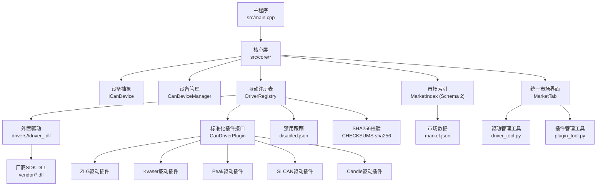
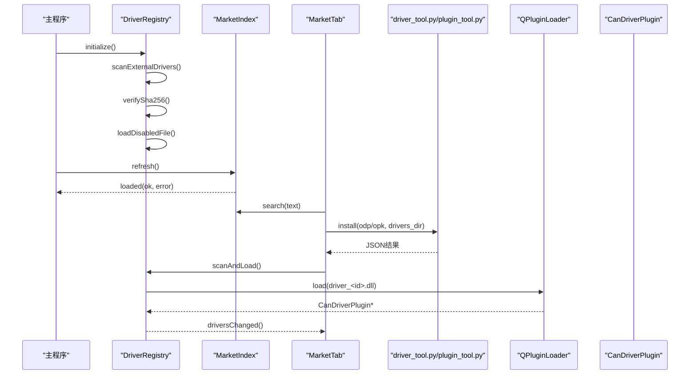
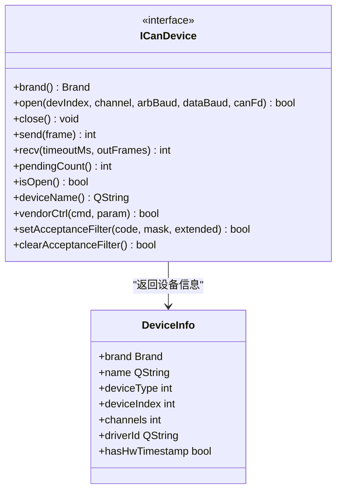
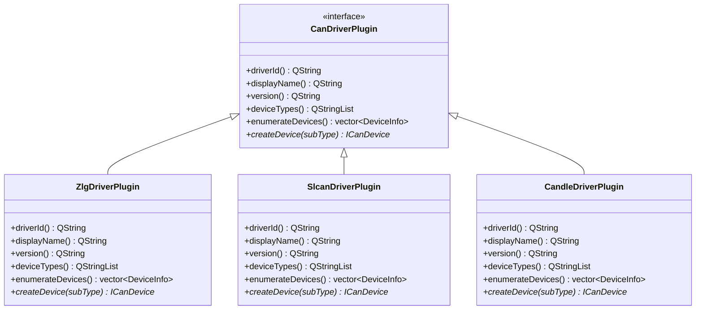
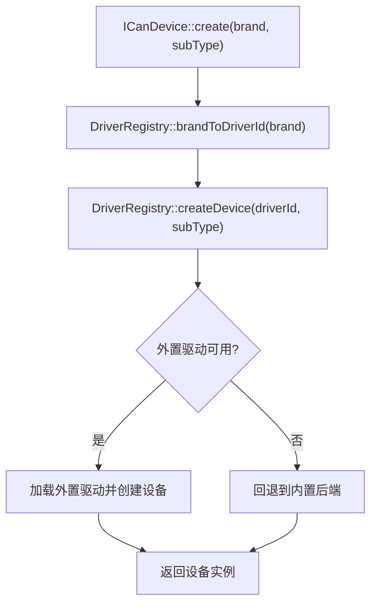
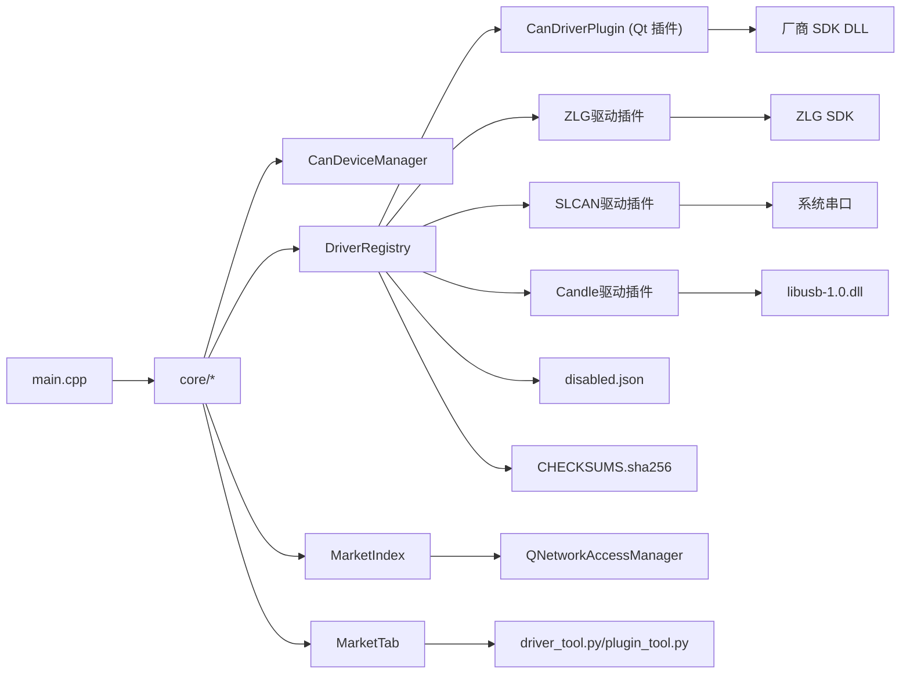

# 驱动系统方案

<cite>
**本文引用的文件**
- [src/core/candevice.h](file://src/core/candevice.h)
- [src/core/driver/candriverplugin.h](file://src/core/driver/candriverplugin.h)
- [src/core/driver/driverregistry.h](file://src/core/driver/driverregistry.h)
- [src/core/driver/driverregistry.cpp](file://src/core/driver/driverregistry.cpp)
- [src/core/driver/marketindex.h](file://src/core/driver/marketindex.h)
- [drivers/zlg/driver.json](file://drivers/zlg/driver.json)
- [drivers/peak/driver.json](file://drivers/peak/driver.json)
- [drivers/kvaser/driver.json](file://drivers/kvaser/driver.json)
- [drivers/slcan/driver.json](file://drivers/slcan/driver.json)
- [drivers/candle/driver.json](file://drivers/candle/driver.json)
- [drivers/candle/candle_driver_plugin.h](file://drivers/candle/candle_driver_plugin.h)
</cite>

## 更新摘要
**变更内容**
- 引入全新的插件化架构，支持外部 .odp 包动态加载的 CAN 总线驱动（ZLG、PEAK、Kvaser、SLCAN、Candle）
- 实现 SHA256 完整性检查机制，确保驱动包的完整性和安全性
- 新增禁用驱动跟踪功能，通过 disabled.json 文件管理驱动的启用/禁用状态
- 标准化 CanDriverPlugin 接口规范，统一所有驱动的生命周期管理
- 增强设备信息结构，支持更丰富的设备属性和兼容性映射
- 改进的错误处理和兼容性检测机制

## 目录
1. [简介](#简介)
2. [项目结构](#项目结构)
3. [核心组件](#核心组件)
4. [架构总览](#架构总览)
5. [详细组件分析](#详细组件分析)
6. [依赖关系分析](#依赖关系分析)
7. [性能与可靠性](#性能与可靠性)
8. [故障排查指南](#故障排查指南)
9. [结论](#结论)
10. [附录](#附录)

## 简介
本方案将 CAN/CAN FD 采集硬件驱动从主程序静态编译迁移为"可从官方应用市场下载安装的驱动插件包"，以原生代码在主进程内运行，实现低时延、可热加载的设备接入。现有 ICanDevice 抽象与 CanDeviceManager 管线保持不变，新增 DriverRegistry 作为统一装配点，支持内置驱动（ZLG/PEAK/Kvaser/SLCAN/CandleLight）与外置 .odp 驱动的统一发现、安装、枚举与创建。

**重大更新** 驱动系统架构得到显著增强，引入了全新的插件化架构，支持外部 .odp 包动态加载。新增 SHA256 完整性检查机制确保驱动安全，禁用驱动跟踪功能通过 disabled.json 管理驱动状态。各驱动插件实现了标准化的插件注册机制，确保所有厂商驱动遵循统一的接口规范和生命周期管理。

## 项目结构
- 顶层 CMake 配置引入 Qt6、第三方依赖，并分别构建主程序与 drivers 子模块。
- src/core 提供设备抽象、管理器、文件格式、DBC、插件宿主等核心能力。
- drivers 下按厂商组织驱动插件工程（如 zlg、slcan、candle），每个驱动包含 driver.json 清单与 Qt 插件实现。
- scripts 目录包含驱动管理工具和市場生成脚本。
- UI 层通过侧边栏与标签页展示设备树与"新增设备"入口，后续由 Registry 动态驱动。

**图表来源**
- [src/core/candevice.h:25-124](file://src/core/candevice.h#L25-L124)
- [src/core/driver/candriverplugin.h:21-44](file://src/core/driver/candriverplugin.h#L21-L44)
- [src/core/driver/driverregistry.h:28-107](file://src/core/driver/driverregistry.h#L28-L107)
- [src/core/driver/driverregistry.cpp:209-220](file://src/core/driver/driverregistry.cpp#L209-L220)

## 核心组件
- **ICanDevice**：统一的设备操作契约（open/close/send/recv/vendorCtrl/滤波），时间戳归一化在 Manager 层处理。**更新** 接口获得完善的文档注释，包括详细的参数说明和方法描述。
- **CanDeviceManager**：QObject 桥接层，封装接收线程、无锁队列、时间戳归一化，对外暴露 frameGenerated 信号。
- **DriverRegistry**：唯一装配点，负责外置驱动扫描与加载、聚合枚举与工厂创建。**更新** 增强了品牌到驱动ID的兼容映射机制，新增禁用驱动跟踪和SHA256完整性检查。
- **MarketIndex**：设备市场索引管理器，负责 market.json schema 2 的加载、检索和 URL 解析。
- **CanDriverPlugin**：驱动插件接口，定义 driverId/displayName/version/deviceTypes/enumerateDevices/createDevice。**更新** 实现了标准化的插件注册机制。
- **MarketTab**：统一市场界面，提供驱动与插件的统一搜索、详情展示、安装管理和离线安装功能。
- **标准化驱动插件**：ZLG/PEAK/Kvaser/SLCAN/Candle 驱动插件示例：复用现有实现，声明 driver.json 清单，输出为独立 .odp 包。

**章节来源**
- [src/core/candevice.h:25-124](file://src/core/candevice.h#L25-L124)
- [src/core/driver/candriverplugin.h:21-44](file://src/core/driver/candriverplugin.h#L21-L44)
- [src/core/driver/driverregistry.h:28-107](file://src/core/driver/driverregistry.h#L28-L107)

## 架构总览
整体流程：启动后 DriverRegistry 扫描 drivers/ 下的外置驱动；MarketIndex 异步加载 market.json schema 2；UI 通过 Registry 动态生成设备分区；用户通过统一市场标签页从市场搜索/查看详情/一键安装；安装成功后热加载并刷新设备树，无需重启。

**图表来源**
- [src/core/driver/driverregistry.cpp:95-108](file://src/core/driver/driverregistry.cpp#L95-L108)
- [src/core/driver/marketindex.cpp:49-57](file://src/core/driver/marketindex.cpp#L49-L57)
- [src/ui/markettab.cpp:188-195](file://src/ui/markettab.cpp#L188-L195)

## 详细组件分析

### 设备抽象接口增强
- **ICanDevice**：统一的设备操作契约，定义了品牌标识、设备枚举、设备操作、厂商扩展和硬件滤波器等功能。
- **更新** 接口获得完善的文档注释，包括详细的参数描述和方法说明，提升了接口的可读性和可维护性。
- **DeviceInfo 结构**：包含品牌、名称、设备类型、设备序号、通道数、驱动ID和时间戳支持等属性。
- **Brand 枚举**：支持 ZLG、PEAK、Kvaser、TongXing、SLCAN、Candle 六种品牌。

**图表来源**
- [src/core/candevice.h:25-124](file://src/core/candevice.h#L25-L124)

**章节来源**
- [src/core/candevice.h:25-124](file://src/core/candevice.h#L25-L124)

### 标准化插件注册机制
- **CanDriverPlugin 接口**：定义了驱动插件的标准接口，包括驱动标识、显示名、版本、设备类型、设备枚举和设备创建方法。
- **统一插件元数据**：使用 Q_PLUGIN_METADATA 声明 IID 和版本，确保插件的兼容性和可识别性。
- **标准化实现**：所有驱动插件（ZLG、Kvaser、Peak、SLCAN、Candle）都遵循相同的接口规范。

**图表来源**
- [src/core/driver/candriverplugin.h:21-44](file://src/core/driver/candriverplugin.h#L21-L44)
- [drivers/candle/candle_driver_plugin.h:19-32](file://drivers/candle/candle_driver_plugin.h#L19-L32)

**章节来源**
- [src/core/driver/candriverplugin.h:21-44](file://src/core/driver/candriverplugin.h#L21-L44)
- [drivers/candle/candle_driver_plugin.h:19-32](file://drivers/candle/candle_driver_plugin.h#L19-L32)

### 设备管理与工厂模式
- **ICanDevice::enumerateAll()**：委托给 DriverRegistry 进行全品牌设备枚举，支持内置和外置驱动的聚合。
- **ICanDevice::create()**：工厂方法，按品牌创建设备实例，优先使用外置驱动，失败时回退到内置后端。
- **品牌到驱动ID映射**：通过 DriverRegistry::brandToDriverId() 实现品牌到驱动ID的转换。

**图表来源**
- [src/core/driver/driverregistry.cpp:369-394](file://src/core/driver/driverregistry.cpp#L369-L394)

**章节来源**
- [src/core/driver/driverregistry.cpp:369-394](file://src/core/driver/driverregistry.cpp#L369-L394)

### 驱动插件实现细节
- **ZLG 驱动插件**：复用 CanDeviceZLG 实现，支持致远电子系列设备。
- **SLCAN 驱动插件**：基于 Lawicel 串口文本协议，支持多种低成本 USB-CAN 适配器。
- **Candle 驱动插件**：基于 GS_USB 协议，支持 candleLight 固件家族设备。
- **统一枚举机制**：所有插件都实现 enumerateDevices() 方法，返回当前可用的物理设备列表。
- **设备创建**：通过 createDevice() 方法根据子类型创建具体的设备实例。

**章节来源**
- [drivers/candle/candle_driver_plugin.h:19-32](file://drivers/candle/candle_driver_plugin.h#L19-L32)

### 驱动注册表增强
- **DriverRegistry**：维护驱动条目列表，启动时扫描 drivers/ 下外置驱动的 driver.json，进行 sha256 校验与 QPluginLoader::metaData() ABI/架构预检。
- **品牌兼容映射**：新增 brandToDriverId() 和 driverIdToBrand() 方法，实现品牌与驱动ID的双向转换。
- **设备Kind映射**：提供 driverIdToDeviceKind() 方法，保持与 CanDeviceManager 的兼容性。
- **启用/禁用机制**：支持 setDriverEnabled() 方法，可以动态启用或禁用特定驱动，并通过 disabled.json 持久化状态。
- **SHA256完整性检查**：新增 CHECKSUMS.sha256 文件验证机制，确保驱动包完整性。

**章节来源**
- [src/core/driver/driverregistry.h:28-107](file://src/core/driver/driverregistry.h#L28-L107)
- [src/core/driver/driverregistry.cpp:209-220](file://src/core/driver/driverregistry.cpp#L209-L220)
- [src/core/driver/driverregistry.cpp:449-511](file://src/core/driver/driverregistry.cpp#L449-L511)

### 禁用驱动跟踪机制
- **disabled.json 文件**：持久化存储被禁用的驱动ID列表，格式为 {"disabled": ["zlg", "peak"]}
- **启动时加载**：DriverRegistry 构造时自动加载禁用清单，影响内置和外置驱动的可用性
- **运行时管理**：通过 setDriverEnabled() 方法动态启用/禁用驱动，自动更新禁用清单
- **UI集成**：禁用状态的驱动在设备树中隐藏，不参与枚举和创建过程

**章节来源**
- [src/core/driver/driverregistry.cpp:449-511](file://src/core/driver/driverregistry.cpp#L449-L511)

### SHA256完整性检查机制
- **CHECKSUMS.sha256 文件**：驱动包中包含的完整性校验文件，格式为 "<hex>  <相对路径>" 每行一条
- **加载时验证**：DriverRegistry 在加载外置驱动前强制验证所有文件的SHA256值
- **失败处理**：校验失败的驱动被标记为不可用，并在UI中显示具体错误原因
- **安全保障**：防止篡改的驱动包被加载，确保系统安全性

**章节来源**
- [src/core/driver/driverregistry.cpp:29-59](file://src/core/driver/driverregistry.cpp#L29-L59)
- [src/core/driver/driverregistry.cpp:209-220](file://src/core/driver/driverregistry.cpp#L209-L220)

## 依赖关系分析
- 主程序入口初始化日志、主题、会话，并创建 MainWindow。
- 核心层通过 DriverRegistry 统一装配设备实例，CanDeviceManager 负责接收线程与时间戳归一化。
- 驱动插件通过 QPluginLoader 加载，依赖 Qt 与厂商 SDK DLL。
- MarketIndex 依赖 QNetworkAccessManager 进行网络请求。
- MarketTab 依赖 Python 解释器执行 driver_tool.py 和 plugin_tool.py。

**图表来源**
- [src/core/candevicemanager.h:1-141](file://src/core/candevicemanager.h#L1-L141)
- [src/core/driver/driverregistry.h:28-107](file://src/core/driver/driverregistry.h#L28-L107)
- [src/core/driver/marketindex.h:27-117](file://src/core/driver/marketindex.h#L27-117)

**章节来源**
- [src/core/candevicemanager.h:1-141](file://src/core/candevicemanager.h#L1-L141)
- [src/core/driver/driverregistry.h:28-107](file://src/core/driver/driverregistry.h#L28-L107)
- [src/core/driver/marketindex.h:27-117](file://src/core/driver/marketindex.h#L27-117)

## 性能与可靠性
- 零拷贝收发：驱动插件在主进程内运行，与内置后端一致的时延特性。
- 无锁队列：接收线程到主线程通过无锁队列传输，降低阻塞与抖动。
- 时间戳归一化：统一纳秒时间戳，保证多设备混用时时间轴一致。
- 安全预检链：sha256 + metaData 预检拒绝不兼容驱动，避免崩溃。
- 厂商 DLL 隔离：按驱动目录隔离 vendor SDK，避免冲突。
- 市场索引缓存：本地 market.json 优先，减少网络依赖。
- 安装完整性：CHECKSUMS.sha256 双重校验，确保驱动包完整性。
- **重大更新** 新增禁用驱动跟踪机制，通过 disabled.json 持久化管理驱动状态，提升系统可控性。
- **重大更新** 标准化插件接口确保了驱动的一致性和可靠性，完善的文档注释提升了可维护性。

## 故障排查指南
- 驱动加载失败：检查 driver.json 的 abiVersion/minAppVersion 是否与主程序匹配；查看 disabledReason。
- 厂商 DLL 缺失：确认 drivers/<id>/vendor/ 下存在对应 DLL，或环境变量 PATH 可找到；遵循搜索顺序。
- 设备无法枚举：确认设备已连接且驱动可用；检查 DeviceInfo.channels 与 driver.json devices[] 是否一致。
- 时间戳异常：确认后端填充了硬件时间戳；若不支持，UI 需区分软件接收时间。
- 市场加载失败：检查网络连接，确认 market.json 地址可达；查看 lastError 获取详细错误信息。
- 驱动安装失败：检查 driver_tool.py 输出 JSON，确认 CHECKSUMS 校验是否通过。
- Python 工具错误：确认 Python 解释器路径正确，driver_tool.py 可执行。
- **新增问题** 驱动被禁用：检查 drivers/disabled.json 文件，确认目标驱动不在禁用列表中。
- **新增问题** SHA256校验失败：检查驱动包完整性，重新下载安装驱动包。
- **新增问题** 插件接口问题：检查 CanDriverPlugin 接口的实现是否符合规范，确认 Q_PLUGIN_METADATA 配置正确。

**章节来源**
- [src/core/driver/driverregistry.cpp:186-200](file://src/core/driver/driverregistry.cpp#L186-L200)
- [src/core/driver/marketindex.cpp:62-75](file://src/core/driver/marketindex.cpp#L62-L75)
- [src/core/driver/driverregistry.cpp:449-511](file://src/core/driver/driverregistry.cpp#L449-L511)

## 结论
本方案通过 DriverRegistry 将设备驱动解耦为可插拔的原生插件，既保留现有 ICanDevice 与 CanDeviceManager 的高性能管线，又实现了按需安装、热加载与统一设备市场体验。**重大更新后的驱动系统架构**通过标准化的插件接口和完善的技术文档，显著提升了系统的可维护性和可扩展性。新增的插件化架构支持外部 .odp 包动态加载，SHA256完整性检查机制确保驱动安全，禁用驱动跟踪功能通过 disabled.json 管理驱动状态。ICanDevice 接口的改进使得设备操作更加清晰和规范，各驱动插件的统一注册机制确保了驱动的一致性和可靠性。内置驱动保底、外置驱动优先覆盖，满足多厂商快速接入与长期演进需求。

## 附录

### 关键数据结构与复杂度
- **ICanDevice::DeviceInfo**：描述设备品牌、名称、类型、通道数、所属驱动 id；枚举与创建均为 O(n) 遍历可用驱动集合。
- **DriverRegistry::DriverEntry**：存储驱动元数据与设备型号表；聚合枚举与工厂创建均基于内存映射，响应迅速。
- **MarketIndex::DriverInfo**：描述驱动元数据、内嵌devices简表、图文信息与关键词；MarketIndex::PluginInfo：描述插件元数据与标签。
- **CanDeviceManager**：接收线程与无锁队列保障高吞吐；时间戳归一化开销常数级。

### 标准化插件接口规范
- **CanDriverPlugin 接口**：定义了驱动插件的标准接口，包括驱动标识、显示名、版本、设备类型、设备枚举和设备创建方法。
- **插件元数据**：使用 Q_PLUGIN_METADATA 声明 IID "com.sin.openbus.CanDriverPlugin/1.0" 和版本信息。
- **生命周期管理**：插件通过 QPluginLoader 加载，进程内常驻不卸载，避免破坏设备状态。

**章节来源**
- [src/core/driver/candriverplugin.h:21-44](file://src/core/driver/candriverplugin.h#L21-L44)

### 设备抽象接口增强
- **ICanDevice 接口**：定义了统一的设备操作契约，包括打开、关闭、发送、接收、厂商扩展和硬件滤波等功能。
- **完善的方法注释**：每个公共方法都有详细的参数说明和返回值描述。
- **设备信息结构**：DeviceInfo 结构包含完整的设备属性描述，支持品牌兼容和驱动ID关联。

**章节来源**
- [src/core/candevice.h:25-124](file://src/core/candevice.h#L25-L124)

### 驱动插件实现示例
- **ZLG 驱动插件**：实现标准的 CanDriverPlugin 接口，复用 CanDeviceZLG 的枚举和创建功能。
- **SLCAN 驱动插件**：基于 Lawicel 协议实现，支持多种低成本 USB-CAN 适配器。
- **Candle 驱动插件**：基于 GS_USB 协议实现，支持 candleLight 固件家族设备。

**章节来源**
- [drivers/candle/candle_driver_plugin.h:19-32](file://drivers/candle/candle_driver_plugin.h#L19-L32)

### 禁用驱动跟踪机制
- **disabled.json 文件格式**：{"disabled": ["driver_id_1", "driver_id_2"]}
- **启动时加载**：DriverRegistry 构造时自动读取禁用清单
- **运行时更新**：通过 setDriverEnabled() 方法动态修改禁用状态
- **持久化存储**：禁用状态保存在 drivers/disabled.json 文件中

**章节来源**
- [src/core/driver/driverregistry.cpp:449-511](file://src/core/driver/driverregistry.cpp#L449-L511)

### SHA256完整性检查机制
- **CHECKSUMS.sha256 文件格式**："<hex>  <relative_path>" 每行一条记录
- **加载时验证**：DriverRegistry 在加载驱动前验证所有文件完整性
- **失败处理**：校验失败的驱动被标记为不可用，显示具体错误信息
- **安全保障**：防止篡改的驱动包被加载到系统中

**章节来源**
- [src/core/driver/driverregistry.cpp:29-59](file://src/core/driver/driverregistry.cpp#L29-L59)
- [src/core/driver/driverregistry.cpp:209-220](file://src/core/driver/driverregistry.cpp#L209-L220)