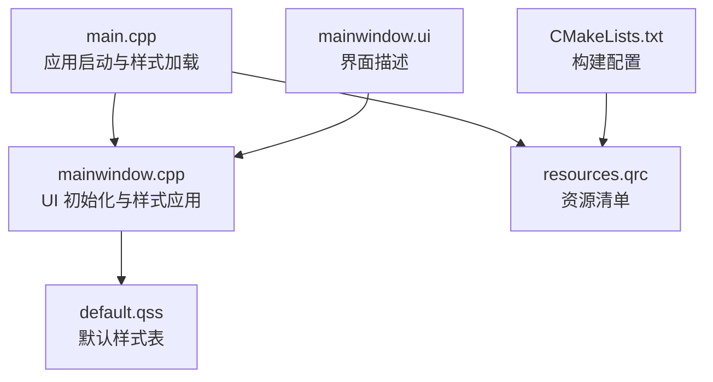
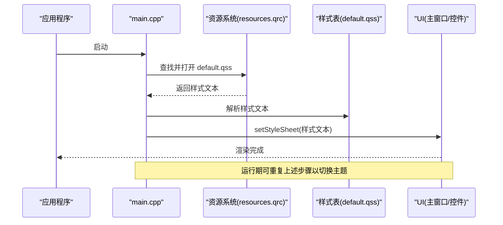
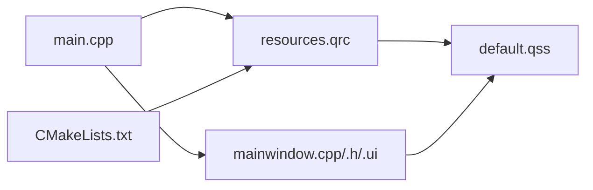
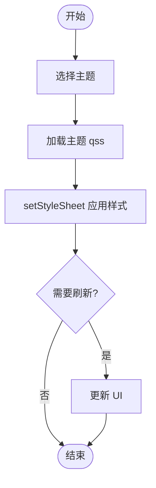

# 样式系统

<cite>
**本文引用的文件**   
- [resources/styles/default.qss](file://resources/styles/default.qss)
- [resources/resources.qrc](file://resources/resources.qrc)
- [src/main.cpp](file://src/main.cpp)
- [src/ui/mainwindow.h](file://src/ui/mainwindow.h)
- [src/ui/mainwindow.cpp](file://src/ui/mainwindow.cpp)
- [src/ui/mainwindow.ui](file://src/ui/mainwindow.ui)
- [CMakeLists.txt](file://CMakeLists.txt)
- [README.en.md](file://README.en.md)
</cite>

## 目录
1. [简介](#简介)
2. [项目结构](#项目结构)
3. [核心组件](#核心组件)
4. [架构总览](#架构总览)
5. [详细组件分析](#详细组件分析)
6. [依赖分析](#依赖分析)
7. [性能考虑](#性能考虑)
8. [故障排查指南](#故障排查指南)
9. [结论](#结论)
10. [附录](#附录)

## 简介
本文件面向使用 Qt 的 QSS（Qt Style Sheets）样式系统的开发者，系统化说明语法规则、选择器与属性用法，主题管理机制、动态样式更新与样式文件组织方式。文档还涵盖样式加载流程、性能优化技巧与调试方法，并提供实际示例与最佳实践，帮助快速构建可维护、可扩展的主题切换能力。

## 项目结构
本项目采用资源文件与源码分离的组织方式：
- 样式资源位于 resources/styles/default.qss，作为默认主题样式表。
- 资源清单 resources/resources.qrc 用于将样式等静态资源打包进应用。
- 主程序入口 src/main.cpp 负责初始化应用并加载样式。
- UI 层由 src/ui/mainwindow.* 和 .ui 构成，演示如何为窗口及控件应用样式。
- CMakeLists.txt 定义构建配置，确保资源正确编译与链接。

图表来源
- [src/main.cpp](file://src/main.cpp)
- [src/ui/mainwindow.cpp](file://src/ui/mainwindow.cpp)
- [resources/styles/default.qss](file://resources/styles/default.qss)
- [resources/resources.qrc](file://resources/resources.qrc)
- [CMakeLists.txt](file://CMakeLists.txt)
- [src/ui/mainwindow.ui](file://src/ui/mainwindow.ui)

章节来源
- [resources/styles/default.qss](file://resources/styles/default.qss)
- [resources/resources.qrc](file://resources/resources.qrc)
- [src/main.cpp](file://src/main.cpp)
- [src/ui/mainwindow.h](file://src/ui/mainwindow.h)
- [src/ui/mainwindow.cpp](file://src/ui/mainwindow.cpp)
- [src/ui/mainwindow.ui](file://src/ui/mainwindow.ui)
- [CMakeLists.txt](file://CMakeLists.txt)

## 核心组件
- 样式资源 default.qss：集中管理颜色、字体、边距、边框、背景等视觉规则，按选择器组织。
- 资源清单 resources.qrc：声明样式文件路径，使 Qt 资源系统可在运行时访问。
- 应用入口 main.cpp：创建 QApplication/QMainWindow，读取 qss 文本并设置到应用或窗口对象上。
- UI 组件 mainwindow.*：在构造或 show 前应用样式，支持后续动态替换。
- 构建配置 CMakeLists.txt：确保 qrc 被处理，qss 随资源一起打包。

章节来源
- [resources/styles/default.qss](file://resources/styles/default.qss)
- [resources/resources.qrc](file://resources/resources.qrc)
- [src/main.cpp](file://src/main.cpp)
- [src/ui/mainwindow.h](file://src/ui/mainwindow.h)
- [src/ui/mainwindow.cpp](file://src/ui/mainwindow.cpp)
- [src/ui/mainwindow.ui](file://src/ui/mainwindow.ui)
- [CMakeLists.txt](file://CMakeLists.txt)

## 架构总览
QSS 样式系统在应用中的典型数据流如下：
- 启动阶段：main.cpp 初始化应用，从 resources.qrc 中定位 default.qss，读取其内容。
- 应用阶段：将样式文本通过 setStyleSheet 应用到 QApplication 或 QMainWindow，从而覆盖全局或局部样式。
- 运行期：可通过事件或用户操作触发样式切换，重新读取新主题 qss 并再次 setStyleSheet。

图表来源
- [src/main.cpp](file://src/main.cpp)
- [resources/resources.qrc](file://resources/resources.qrc)
- [resources/styles/default.qss](file://resources/styles/default.qss)
- [src/ui/mainwindow.cpp](file://src/ui/mainwindow.cpp)

## 详细组件分析

### 样式资源 default.qss
- 作用：定义全局与控件级别的样式规则，包括颜色、字体、尺寸、边框、阴影、状态（悬停、按下、禁用）等。
- 组织建议：
  - 按控件类型分组（如 QPushButton、QLineEdit、QLabel）。
  - 使用类选择器与 ID 选择器结合，避免过深嵌套。
  - 将通用变量（颜色、字号）放在顶部，便于统一修改。
- 注意事项：
  - 避免在 qss 中使用复杂逻辑；如需条件样式，建议在代码中切换不同主题文件。
  - 控制选择器数量与复杂度，减少重绘开销。

章节来源
- [resources/styles/default.qss](file://resources/styles/default.qss)

### 资源清单 resources.qrc
- 作用：声明 qss 等资源的路径，供 Qt 资源系统编译与访问。
- 关键点：
  - 确保 qss 路径与 CMake 构建一致。
  - 使用相对路径，提高跨平台兼容性。
- 常见问题：
  - 路径大小写不一致导致资源找不到。
  - 未将 qrc 加入构建目标导致资源未打包。

章节来源
- [resources/resources.qrc](file://resources/resources.qrc)

### 应用入口 main.cpp
- 职责：
  - 创建 QApplication 与主窗口。
  - 从资源系统读取 default.qss 文本。
  - 调用 setStyleSheet 应用到应用或窗口。
- 扩展点：
  - 提供主题切换接口：根据用户选择加载不同 qss 并重新 setStyleSheet。
  - 支持热重载：监听文件变化后重新加载样式。

章节来源
- [src/main.cpp](file://src/main.cpp)

### UI 组件 mainwindow.*
- 职责：
  - 在构造函数或 show 之前应用样式，确保首次渲染即生效。
  - 暴露切换主题的 API，供业务层调用。
- 最佳实践：
  - 将样式应用逻辑封装为独立函数，便于复用与测试。
  - 对关键控件使用 objectName 或 class 选择器，提升样式匹配精度。

章节来源
- [src/ui/mainwindow.h](file://src/ui/mainwindow.h)
- [src/ui/mainwindow.cpp](file://src/ui/mainwindow.cpp)
- [src/ui/mainwindow.ui](file://src/ui/mainwindow.ui)

### 构建配置 CMakeLists.txt
- 职责：
  - 指定 Qt 模块与源文件。
  - 处理 resources.qrc，确保 qss 被打包。
- 检查要点：
  - 确认 add_executable 包含 main.cpp 与生成的 qrc 输出。
  - 验证 Qt 资源命令已启用。

章节来源
- [CMakeLists.txt](file://CMakeLists.txt)

## 依赖分析
- 组件耦合关系：
  - main.cpp 依赖资源系统与样式文件，进而影响 UI 渲染。
  - mainwindow.* 依赖样式表，决定控件外观。
  - CMakeLists.txt 依赖 resources.qrc，保证资源可用。
- 外部依赖：
  - Qt 框架（QApplication、QWidget、QStyle 等）。
  - Qt 资源系统（QResource/QRC）。
- 潜在风险：
  - 循环依赖：样式不应反向依赖 UI 逻辑。
  - 资源路径错误：构建或部署时路径不一致导致样式缺失。

图表来源
- [src/main.cpp](file://src/main.cpp)
- [resources/resources.qrc](file://resources/resources.qrc)
- [resources/styles/default.qss](file://resources/styles/default.qss)
- [src/ui/mainwindow.cpp](file://src/ui/mainwindow.cpp)
- [CMakeLists.txt](file://CMakeLists.txt)

章节来源
- [src/main.cpp](file://src/main.cpp)
- [resources/resources.qrc](file://resources/resources.qrc)
- [resources/styles/default.qss](file://resources/styles/default.qss)
- [src/ui/mainwindow.cpp](file://src/ui/mainwindow.cpp)
- [CMakeLists.txt](file://CMakeLists.txt)

## 性能考虑
- 样式表规模控制：
  - 合并相近规则，减少选择器数量。
  - 避免深层嵌套与通配符滥用。
- 渲染优化：
  - 尽量使用类选择器而非 ID 选择器，提升匹配效率。
  - 避免频繁 setStyleSheet 调用，批量更新后再刷新。
- 资源加载：
  - 将大样式文件拆分为多个主题，按需加载。
  - 缓存已解析的样式文本，避免重复 IO。
- 调试与监控：
  - 使用 Qt Creator 的样式检查工具定位不生效的规则。
  - 开启日志记录样式切换与错误信息。

[本节为通用指导，无需特定文件引用]

## 故障排查指南
- 样式不生效：
  - 检查 qss 路径是否正确，资源是否打包成功。
  - 确认 setStyleSheet 调用时机在控件可见前。
  - 查看选择器优先级与继承关系。
- 性能问题：
  - 统计样式规则数量，移除冗余规则。
  - 避免在动画或高频事件中重复应用样式。
- 主题切换异常：
  - 确保旧样式完全清除后再应用新样式。
  - 检查控件 objectName/class 是否与选择器一致。
- 构建问题：
  - 核对 CMakeLists.txt 中 qrc 处理命令。
  - 清理构建目录后重新生成。

章节来源
- [resources/resources.qrc](file://resources/resources.qrc)
- [src/main.cpp](file://src/main.cpp)
- [src/ui/mainwindow.cpp](file://src/ui/mainwindow.cpp)
- [CMakeLists.txt](file://CMakeLists.txt)

## 结论
通过合理的样式组织、资源管理与加载流程，QSS 能够高效支撑多主题与动态切换需求。遵循选择器与属性的最佳实践，结合性能优化与调试手段，可显著提升用户体验与开发效率。建议在项目中建立统一的样式规范与主题模板，便于团队协作与维护。

[本节为总结性内容，无需特定文件引用]

## 附录

### QSS 语法与选择器速查
- 基本选择器：
  - 类选择器：QPushButton { ... }
  - ID 选择器：#myButton { ... }
  - 属性选择器：QPushButton[flat="true"] { ... }
  - 后代选择器：QDialog QPushButton { ... }
  - 子选择器：QDialog > QPushButton { ... }
  - 相邻兄弟选择器：QPushButton + QLineEdit { ... }
- 常用伪状态：
  - :hover、:pressed、:disabled、:checked、:focus
- 常用属性：
  - 颜色与背景：color、background-color、border-color
  - 尺寸与布局：margin、padding、min-width、max-height
  - 字体与文本：font-family、font-size、font-weight
  - 边框与圆角：border、border-radius、border-image
  - 阴影与透明度：box-shadow、opacity

[本节为概念性说明，无需特定文件引用]

### 主题管理与切换流程
- 主题文件组织：
  - 每个主题一个 qss 文件，命名如 theme_light.qss、theme_dark.qss。
  - 公共样式提取为 base.qss，主题文件仅覆盖差异部分。
- 切换流程：
  - 用户选择主题 -> 读取对应 qss -> 调用 setStyleSheet -> 刷新 UI。
- 热重载：
  - 监听文件系统变化 -> 重新加载 qss -> 应用新样式。

[本图为概念流程图，无需特定文件引用]

### 样式示例与最佳实践
- 示例结构：
  - 在 default.qss 中定义按钮、输入框、标签等基础样式。
  - 使用变量集中管理颜色与字号，便于主题切换。
- 最佳实践：
  - 优先使用类选择器，避免过度依赖 ID。
  - 保持样式文件模块化，按功能拆分。
  - 在 UI 中为关键控件设置 objectName，提升样式匹配准确性。

[本节为概念性说明，无需特定文件引用]

### 自定义主题与样式切换实现要点
- 自定义主题：
  - 复制默认主题 qss，修改颜色与尺寸，保存为新文件。
  - 在主题管理器中注册新主题名称与路径。
- 切换实现：
  - 提供 switchTheme(themeName) 接口，内部读取 qss 并应用。
  - 持久化用户选择，下次启动自动加载。
- 调试技巧：
  - 使用 Qt Creator 的样式检查器定位不生效规则。
  - 打印样式加载日志，确认路径与内容正确。

[本节为概念性说明，无需特定文件引用]