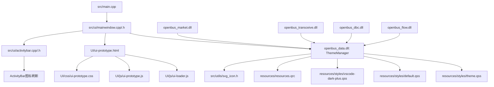
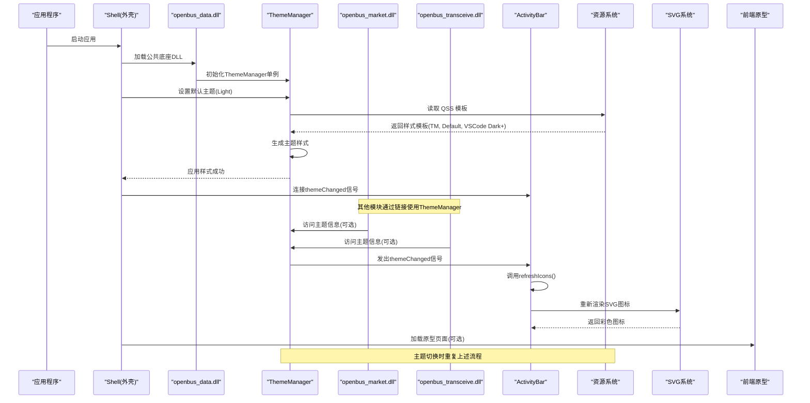
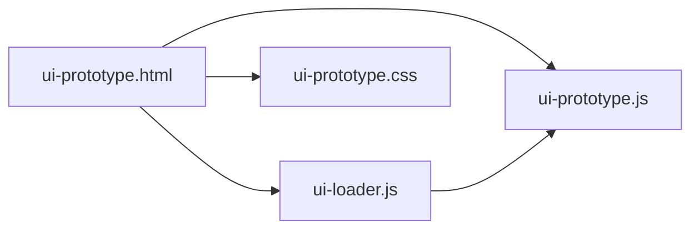
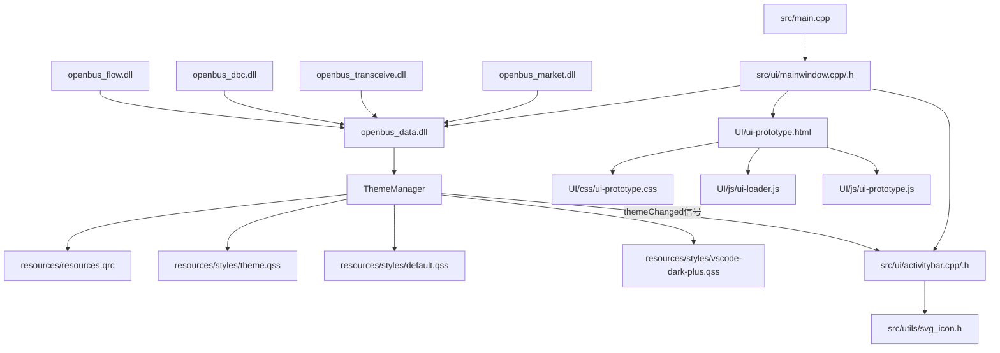

# 主题管理系统

<cite>
**本文引用的文件**
- [CMakeLists.txt](file://CMakeLists.txt)
- [src/CMakeLists.txt](file://src/CMakeLists.txt)
- [src/main.cpp](file://src/main.cpp)
- [src/ui/mainwindow.h](file://src/ui/mainwindow.h)
- [src/ui/mainwindow.cpp](file://src/ui/mainwindow.cpp)
- [src/ui/thememanager.h](file://src/ui/thememanager.h)
- [src/ui/thememanager.cpp](file://src/ui/thememanager.cpp)
- [src/ui/activitybar.h](file://src/ui/activitybar.h)
- [src/ui/activitybar.cpp](file://src/ui/activitybar.cpp)
- [resources/styles/default.qss](file://resources/styles/default.qss)
- [resources/styles/theme.qss](file://resources/styles/theme.qss)
- [resources/styles/vscode-dark-plus.qss](file://resources/styles/vscode-dark-plus.qss)
- [resources/resources.qrc](file://resources/resources.qrc)
- [src/utils/svg_icon.h](file://src/utils/svg_icon.h)
- [UI/ui-prototype.html](file://UI/ui-prototype.html)
- [UI/js/ui-loader.js](file://UI/js/ui-loader.js)
- [UI/js/ui-prototype.js](file://UI/js/ui-prototype.js)
- [UI/css/ui-prototype.css](file://UI/css/ui-prototype.css)
- [doc/构建基线.md](file://doc/构建基线.md)
</cite>

## 更新摘要
**变更内容**
- **新增VSCode Dark+主题支持**：添加了完整的VSCode Dark+风格主题样式文件，提供专业现代的深色界面体验
- **扩展主题管理系统**：在现有Light主题基础上增加了VSCode Dark+主题选项，丰富了用户的主题选择
- **完善主题资源管理**：更新了资源清单以支持新的主题样式文件，确保跨平台一致访问
- **保持向后兼容**：现有API和架构保持不变，新增主题无缝集成到现有系统

## 目录
1. [简介](#简介)
2. [项目结构](#项目结构)
3. [核心组件](#核心组件)
4. [架构总览](#架构总览)
5. [详细组件分析](#详细组件分析)
6. [依赖关系分析](#依赖关系分析)
7. [性能考虑](#性能考虑)
8. [故障排查指南](#故障排查指南)
9. [结论](#结论)
10. [附录](#附录)

## 简介
本文件面向"主题管理系统"的代码库，聚焦于 Qt/C++ 应用中的主题加载、样式切换与 UI 资源管理。系统现已完成架构重构，将主题管理器从UI层迁移到openbus_data.dll公共底座中，使其成为全进程共享的单例服务，为所有业务模块提供统一的主题管理能力。**最新更新**：系统新增了VSCode Dark+主题支持，为用户提供了专业的深色界面体验，同时保持了原有的Light主题。

文档从架构、数据流、关键类职责、错误处理与性能优化等维度展开，帮助读者快速理解并扩展主题管理能力。

**更新** 系统已完成主题管理器的DLL化迁移，现在作为openbus_data.dll的核心组件，支持跨模块共享和统一的单例访问模式，并新增了VSCode Dark+主题支持。

## 项目结构
仓库采用分层组织，主题管理器现已迁移到公共底座DLL中：
- src/core：核心业务逻辑和数据管理
- src/models：Qt数据模型
- src/utils：工具函数和通用组件
- src/ui：界面组件（包含ActivityBar等UI元素）
- resources：QSS样式与Qt资源清单
- UI：前端原型页面与脚本
- scripts：构建脚本
- third_party：第三方库



图表来源
- [src/main.cpp](file://src/main.cpp)
- [src/ui/mainwindow.cpp](file://src/ui/mainwindow.cpp)
- [src/ui/mainwindow.h](file://src/ui/mainwindow.h)
- [src/ui/thememanager.cpp](file://src/ui/thememanager.cpp)
- [src/ui/thememanager.h](file://src/ui/thememanager.h)
- [src/ui/activitybar.cpp](file://src/ui/activitybar.cpp)
- [src/ui/activitybar.h](file://src/ui/activitybar.h)
- [resources/styles/theme.qss](file://resources/styles/theme.qss)
- [resources/styles/default.qss](file://resources/styles/default.qss)
- [resources/styles/vscode-dark-plus.qss](file://resources/styles/vscode-dark-plus.qss)
- [resources/resources.qrc](file://resources/resources.qrc)
- [src/utils/svg_icon.h](file://src/utils/svg_icon.h)
- [UI/ui-prototype.html](file://UI/ui-prototype.html)
- [UI/js/ui-loader.js](file://UI/js/ui-loader.js)
- [UI/js/ui-prototype.js](file://UI/js/ui-prototype.js)
- [UI/css/ui-prototype.css](file://UI/css/ui-prototype.css)
- [src/CMakeLists.txt](file://src/CMakeLists.txt)

章节来源
- [CMakeLists.txt](file://CMakeLists.txt)
- [src/CMakeLists.txt](file://src/CMakeLists.txt)
- [src/main.cpp](file://src/main.cpp)
- [src/ui/mainwindow.h](file://src/ui/mainwindow.h)
- [src/ui/mainwindow.cpp](file://src/ui/mainwindow.cpp)
- [src/ui/thememanager.h](file://src/ui/thememanager.h)
- [src/ui/thememanager.cpp](file://src/ui/thememanager.cpp)
- [src/ui/activitybar.h](file://src/ui/activitybar.h)
- [src/ui/activitybar.cpp](file://src/ui/activitybar.cpp)
- [resources/styles/theme.qss](file://resources/styles/theme.qss)
- [resources/styles/default.qss](file://resources/styles/default.qss)
- [resources/styles/vscode-dark-plus.qss](file://resources/styles/vscode-dark-plus.qss)
- [resources/resources.qrc](file://resources/resources.qrc)
- [src/utils/svg_icon.h](file://src/utils/svg_icon.h)
- [UI/ui-prototype.html](file://UI/ui-prototype.html)
- [UI/js/ui-loader.js](file://UI/js/ui-loader.js)
- [UI/js/ui-prototype.js](file://UI/js/ui-prototype.js)
- [UI/css/ui-prototype.css](file://UI/css/ui-prototype.css)
- [doc/构建基线.md](file://doc/构建基线.md)

## 核心组件
- **ThemeManager（主题管理器）**：封装在openbus_data.dll中，提供全局单例访问，负责QSS加载、缓存、应用与回退策略；提供主题枚举与当前主题查询。
- **主窗口（MainWindow）**：负责应用生命周期、UI初始化、菜单/面板装配，以及触发主题切换。
- **ActivityBar（活动栏）**：VS Code风格的左侧导航栏，支持主题感知的图标显示和刷新功能。
- **资源系统（resources.qrc + theme.qss）**：集中管理样式资源路径，确保跨平台一致访问。
- **SVG图标系统（svg_icon.h）**：支持动态颜色渲染的SVG图标处理。
- **前端原型（UI/*）**：提供 HTML/JS/CSS 原型，便于在 WebEngine 中渲染或作为主题预览。

**更新** 主题管理器现已迁移到openbus_data.dll中，作为公共底座服务被所有业务模块共享使用，并新增了VSCode Dark+主题支持。

章节来源
- [src/ui/mainwindow.h](file://src/ui/mainwindow.h)
- [src/ui/mainwindow.cpp](file://src/ui/mainwindow.cpp)
- [src/ui/thememanager.h](file://src/ui/thememanager.h)
- [src/ui/thememanager.cpp](file://src/ui/thememanager.cpp)
- [src/ui/activitybar.h](file://src/ui/activitybar.h)
- [src/ui/activitybar.cpp](file://src/ui/activitybar.cpp)
- [resources/resources.qrc](file://resources/resources.qrc)
- [resources/styles/theme.qss](file://resources/styles/theme.qss)
- [resources/styles/default.qss](file://resources/styles/default.qss)
- [resources/styles/vscode-dark-plus.qss](file://resources/styles/vscode-dark-plus.qss)
- [src/utils/svg_icon.h](file://src/utils/svg_icon.h)
- [UI/ui-prototype.html](file://UI/ui-prototype.html)
- [UI/js/ui-loader.js](file://UI/js/ui-loader.js)
- [UI/js/ui-prototype.js](file://UI/js/ui-prototype.js)
- [UI/css/ui-prototype.css](file://UI/css/ui-prototype.css)
- [src/CMakeLists.txt](file://src/CMakeLists.txt)

## 架构总览
主题管理的整体流程如下：
- 应用启动时创建主窗口并初始化openbus_data.dll中的ThemeManager单例。
- 主窗口根据配置或用户选择调用ThemeManager加载对应QSS。
- ThemeManager将样式应用到QApplication/QMainWindow，并缓存结果。
- 若切换主题失败，自动回退到默认主题。
- 主题切换时发出themeChanged信号，ActivityBar接收信号并刷新图标颜色。
- 所有业务模块通过链接openbus_data.dll共享同一个ThemeManager实例。
- 前端原型可通过WebEngine集成，受同一主题上下文影响。

**更新** 新架构支持跨DLL的主题管理共享，所有模块通过openbus_data.dll访问统一的ThemeManager单例，并支持VSCode Dark+主题。



图表来源
- [src/main.cpp](file://src/main.cpp)
- [src/ui/mainwindow.cpp](file://src/ui/mainwindow.cpp)
- [src/ui/thememanager.cpp](file://src/ui/thememanager.cpp)
- [src/ui/activitybar.cpp](file://src/ui/activitybar.cpp)
- [resources/styles/theme.qss](file://resources/styles/theme.qss)
- [resources/styles/default.qss](file://resources/styles/default.qss)
- [resources/styles/vscode-dark-plus.qss](file://resources/styles/vscode-dark-plus.qss)
- [resources/resources.qrc](file://resources/resources.qrc)
- [src/utils/svg_icon.h](file://src/utils/svg_icon.h)
- [UI/ui-prototype.html](file://UI/ui-prototype.html)
- [src/CMakeLists.txt](file://src/CMakeLists.txt)

## 详细组件分析

### 主窗口（MainWindow）
- 职责：应用入口后的 UI 装配、事件分发、主题切换入口。
- 关键点：
  - 在构造函数或初始化函数中获取openbus_data.dll中的ThemeManager单例。
  - 暴露切换主题的接口，内部委托给 ThemeManager。
  - 处理用户交互（菜单/工具栏）触发主题变更。
  - 连接ThemeManager的themeChanged信号到ActivityBar的refreshIcons方法。

**更新** 主窗口现在通过openbus_data.dll访问ThemeManager单例，实现了跨DLL的主题管理，并支持VSCode Dark+主题切换。

```mermaid
classDiagram
class MainWindow {
+show()
+initUI()
+switchTheme(themeId)
-themeManager : ThemeManager*
}
class ThemeManager {
+instance() ThemeManager*
+setTheme(themeId) bool
+applyTo(app) void
+getAvailableThemes() list
+getCurrentTheme() string
+currentTheme() Theme
-loadQss(path) string
-cacheQss(key, text) void
+generateQss(theme) QString
+themeChanged(name) signal
}
class ActivityBar {
+refreshIcons() void
-makeActivityIcon(path) QIcon
-currentActivity() Activity
}
class SvgIcon {
+renderSvgPixmap(path, color, size) QPixmap
+svgIcon(path, color, size) QIcon
}
MainWindow --> ThemeManager : "通过DLL单例访问"
MainWindow --> ActivityBar : "管理"
ActivityBar --> SvgIcon : "使用"
ThemeManager -->> ActivityBar : "themeChanged信号"
```

图表来源
- [src/ui/mainwindow.h](file://src/ui/mainwindow.h)
- [src/ui/mainwindow.cpp](file://src/ui/mainwindow.cpp)
- [src/ui/thememanager.h](file://src/ui/thememanager.h)
- [src/ui/thememanager.cpp](file://src/ui/thememanager.cpp)
- [src/ui/activitybar.h](file://src/ui/activitybar.h)
- [src/ui/activitybar.cpp](file://src/ui/activitybar.cpp)
- [src/utils/svg_icon.h](file://src/utils/svg_icon.h)
- [src/CMakeLists.txt](file://src/CMakeLists.txt)

章节来源
- [src/ui/mainwindow.h](file://src/ui/mainwindow.h)
- [src/ui/mainwindow.cpp](file://src/ui/mainwindow.cpp)

### 主题管理器（ThemeManager）
- 职责：统一管理主题资源、加载与缓存 QSS、应用样式、错误回退。
- 关键点：
  - 主题标识与映射表：维护 themeId 到资源路径的映射。
  - QSS 加载：优先从文件系统 (开发模式, 改完无需编译), 回退到 qrc。
  - 缓存机制：避免重复 IO，提升切换速度。
  - 错误处理：加载失败时记录日志并回退到默认主题。
  - **DLL单例模式**：通过静态实例确保在整个进程中只有一个ThemeManager实例。
  - **跨模块共享**：所有业务模块通过链接openbus_data.dll共享同一个实例。

**更新** 主题管理器现已迁移到openbus_data.dll中，通过单例模式为所有模块提供统一的主题管理服务，并支持VSCode Dark+主题。

```mermaid
flowchart TD
Start(["开始"]) --> CheckCache["检查主题缓存"]
CheckCache --> CacheHit{"命中缓存?"}
CacheHit --> |是| Apply["应用样式到应用"]
CacheHit --> |否| LoadTemplate["加载 QSS 模板"]
LoadTemplate --> ReplaceVars["替换 @变量"]
ReplaceVars --> Apply
Apply --> EmitSignal["发出themeChanged信号"]
EmitSignal --> End(["结束"])
Note over Start,End : ThemeManager现在位于openbus_data.dll中<br/>支持Light和VSCode Dark+主题
```

图表来源
- [src/ui/thememanager.cpp](file://src/ui/thememanager.cpp)
- [src/ui/thememanager.h](file://src/ui/thememanager.h)
- [resources/styles/theme.qss](file://resources/styles/theme.qss)
- [resources/styles/default.qss](file://resources/styles/default.qss)
- [resources/styles/vscode-dark-plus.qss](file://resources/styles/vscode-dark-plus.qss)
- [src/CMakeLists.txt](file://src/CMakeLists.txt)

章节来源
- [src/ui/thememanager.h](file://src/ui/thememanager.h)
- [src/ui/thememanager.cpp](file://src/ui/thememanager.cpp)
- [resources/styles/theme.qss](file://resources/styles/theme.qss)
- [resources/styles/default.qss](file://resources/styles/default.qss)
- [resources/styles/vscode-dark-plus.qss](file://resources/styles/vscode-dark-plus.qss)
- [src/CMakeLists.txt](file://src/CMakeLists.txt)

### ActivityBar（活动栏）
- 职责：VS Code风格的左侧导航栏，提供功能模块的快速访问。
- 关键点：
  - 主题感知图标：根据当前主题动态调整图标颜色。
  - 图标刷新机制：支持主题切换时重新渲染图标。
  - 状态管理：跟踪当前选中的活动项。
  - **DLL间通信**：通过ThemeManager的信号机制接收主题变化通知。

**更新** ActivityBar现在通过openbus_data.dll中的ThemeManager接收主题变化信号，实现跨DLL的主题同步，并支持VSCode Dark+主题下的图标显示。

```mermaid
flowchart TD
ThemeChange["主题切换"] --> Signal["收到themeChanged信号"]
Signal --> Refresh["调用refreshIcons()"]
Refresh --> Loop{"遍历所有按钮"}
Loop --> Icon["重新创建图标"]
Icon --> Colors["应用主题颜色"]
Colors --> Next{"下一个按钮?"}
Next --> |是| Loop
Next --> |否| Complete["刷新完成"]
Note over ThemeChange,Complete : 信号来自openbus_data.dll中的ThemeManager<br/>支持Light和VSCode Dark+主题
```

图表来源
- [src/ui/activitybar.cpp](file://src/ui/activitybar.cpp)
- [src/ui/activitybar.h](file://src/ui/activitybar.h)
- [src/ui/thememanager.cpp](file://src/ui/thememanager.cpp)

章节来源
- [src/ui/activitybar.h](file://src/ui/activitybar.h)
- [src/ui/activitybar.cpp](file://src/ui/activitybar.cpp)

### 资源系统（resources.qrc + theme.qss）
- 职责：集中管理样式资源路径，保证跨平台一致性。
- 关键点：
  - qrc 清单定义资源别名与路径。
  - theme.qss 作为主题模板，使用@变量占位符。
  - default.qss 作为默认主题样式，确保无可用主题时的稳定外观。
  - **新增** vscode-dark-plus.qss 作为VSCode Dark+主题样式。

**更新** 资源系统保持不变，但现在由openbus_data.dll统一管理，供所有模块共享，并新增了VSCode Dark+主题支持。

章节来源
- [resources/resources.qrc](file://resources/resources.qrc)
- [resources/styles/theme.qss](file://resources/styles/theme.qss)
- [resources/styles/default.qss](file://resources/styles/default.qss)
- [resources/styles/vscode-dark-plus.qss](file://resources/styles/vscode-dark-plus.qss)

### SVG图标系统（svg_icon.h）
- 职责：提供SVG图标的动态颜色渲染功能。
- 关键点：
  - 支持将currentColor替换为指定颜色。
  - 提供Pixmap和QIcon两种输出格式。
  - 支持自定义尺寸和抗锯齿渲染。
  - 被ActivityBar用于创建主题感知的图标。

**更新** SVG图标系统现在作为openbus_data.dll的一部分，被所有模块共享使用，并支持VSCode Dark+主题下的图标渲染。

章节来源
- [src/utils/svg_icon.h](file://src/utils/svg_icon.h)

### 前端原型（UI/*）
- 职责：提供 HTML/JS/CSS 原型，便于在 WebEngine 中渲染或作为主题预览。
- 关键点：
  - ui-prototype.html：页面骨架与脚本引用。
  - ui-loader.js：动态加载模块与资源。
  - ui-prototype.js：原型行为逻辑。
  - ui-prototype.css：原型样式，可与 QSS 主题保持一致性。



图表来源
- [UI/ui-prototype.html](file://UI/ui-prototype.html)
- [UI/js/ui-loader.js](file://UI/js/ui-loader.js)
- [UI/js/ui-prototype.js](file://UI/js/ui-prototype.js)
- [UI/css/ui-prototype.css](file://UI/css/ui-prototype.css)

章节来源
- [UI/ui-prototype.html](file://UI/ui-prototype.html)
- [UI/js/ui-loader.js](file://UI/js/ui-loader.js)
- [UI/js/ui-prototype.js](file://UI/js/ui-prototype.js)
- [UI/css/ui-prototype.css](file://UI/css/ui-prototype.css)

## 依赖关系分析
- 主窗口依赖openbus_data.dll中的ThemeManager完成样式切换。
- ThemeManager依赖资源系统获取 QSS 文本。
- ActivityBar依赖ThemeManager获取当前主题信息。
- SVG图标系统独立于主题系统，但受益于主题颜色方案。
- 前端原型与 Qt 应用解耦，可通过 WebEngine 集成，受主题上下文影响。
- **新增**：所有业务模块（market、transceive、dbc、flow）都依赖openbus_data.dll来获取主题管理服务。

**更新** 新增了openbus_data.dll作为主题管理的中心，所有模块通过链接该DLL来共享主题管理功能，并支持VSCode Dark+主题。



图表来源
- [src/main.cpp](file://src/main.cpp)
- [src/ui/mainwindow.cpp](file://src/ui/mainwindow.cpp)
- [src/ui/mainwindow.h](file://src/ui/mainwindow.h)
- [src/ui/thememanager.cpp](file://src/ui/thememanager.cpp)
- [src/ui/thememanager.h](file://src/ui/thememanager.h)
- [src/ui/activitybar.cpp](file://src/ui/activitybar.cpp)
- [src/ui/activitybar.h](file://src/ui/activitybar.h)
- [resources/resources.qrc](file://resources/resources.qrc)
- [resources/styles/theme.qss](file://resources/styles/theme.qss)
- [resources/styles/default.qss](file://resources/styles/default.qss)
- [resources/styles/vscode-dark-plus.qss](file://resources/styles/vscode-dark-plus.qss)
- [src/utils/svg_icon.h](file://src/utils/svg_icon.h)
- [UI/ui-prototype.html](file://UI/ui-prototype.html)
- [UI/js/ui-loader.js](file://UI/js/ui-loader.js)
- [UI/js/ui-prototype.js](file://UI/js/ui-prototype.js)
- [UI/css/ui-prototype.css](file://UI/css/ui-prototype.css)
- [src/CMakeLists.txt](file://src/CMakeLists.txt)

章节来源
- [src/main.cpp](file://src/main.cpp)
- [src/ui/mainwindow.h](file://src/ui/mainwindow.h)
- [src/ui/mainwindow.cpp](file://src/ui/mainwindow.cpp)
- [src/ui/thememanager.h](file://src/ui/thememanager.h)
- [src/ui/thememanager.cpp](file://src/ui/thememanager.cpp)
- [src/ui/activitybar.h](file://src/ui/activitybar.h)
- [src/ui/activitybar.cpp](file://src/ui/activitybar.cpp)
- [resources/resources.qrc](file://resources/resources.qrc)
- [resources/styles/theme.qss](file://resources/styles/theme.qss)
- [resources/styles/default.qss](file://resources/styles/default.qss)
- [resources/styles/vscode-dark-plus.qss](file://resources/styles/vscode-dark-plus.qss)
- [src/utils/svg_icon.h](file://src/utils/svg_icon.h)
- [UI/ui-prototype.html](file://UI/ui-prototype.html)
- [UI/js/ui-loader.js](file://UI/js/ui-loader.js)
- [UI/js/ui-prototype.js](file://UI/js/ui-prototype.js)
- [UI/css/ui-prototype.css](file://UI/css/ui-prototype.css)
- [src/CMakeLists.txt](file://src/CMakeLists.txt)

## 性能考虑
- 缓存 QSS 文本：避免重复 IO，减少主题切换延迟。
- 增量更新：仅对变化部分重新应用样式（若框架支持）。
- 资源预加载：启动时按需预加载常用主题，降低首次切换开销。
- 样式复杂度控制：避免过深的选择器与大量规则，提升渲染性能。
- SVG图标优化：使用内存缓存避免重复渲染。
- **ActivityBar图标刷新优化**：仅在主题切换时刷新图标，避免不必要的重绘。
- **DLL共享优化**：ThemeManager单例在DLL中共享，避免重复实例化和资源占用。

**更新** 新增了DLL共享优化的性能考虑，通过单例模式减少内存占用和提高访问效率，同时VSCode Dark+主题经过优化确保流畅的主题切换体验。

[本节为通用指导，不直接分析具体文件]

## 故障排查指南
- 主题未生效：
  - 检查 qrc 清单是否正确包含 QSS 路径。
  - 确认主题管理器加载路径与资源别名一致。
  - 查看是否触发了回退到默认主题。
- 切换卡顿：
  - 检查是否存在重复加载与未命中缓存的情况。
  - 评估 QSS 规则复杂度与数量。
- 前端样式不一致：
  - 核对 UI 原型 CSS 与 QSS 主题变量是否对齐。
  - 确认 WebEngine 上下文是否继承应用主题。
- SVG图标颜色问题：
  - 检查SVG文件中是否正确使用currentColor属性。
  - 确认传入的颜色值格式正确。
- **ActivityBar图标不更新**：
  - 检查themeChanged信号是否正确连接到ActivityBar::refreshIcons。
  - 确认ActivityBar::refreshIcons方法是否正确遍历所有按钮。
  - 验证makeActivityIcon函数是否能正确获取当前主题颜色。
- **DLL加载问题**：
  - 确认openbus_data.dll已正确部署到可执行文件目录。
  - 检查所有依赖模块是否正确链接到openbus_data.dll。
  - 验证ThemeManager单例是否在正确的DLL上下文中初始化。
- **VSCode Dark+主题问题**：
  - 确认vscode-dark-plus.qss文件已正确添加到资源系统中。
  - 检查主题名称是否正确配置为"VSCode Dark+"。
  - 验证主题切换时是否正确加载了VSCode Dark+样式。

**更新** 新增了DLL加载相关的故障排查指南，以及VSCode Dark+主题特有的问题排查方法。

章节来源
- [src/ui/thememanager.cpp](file://src/ui/thememanager.cpp)
- [src/ui/activitybar.cpp](file://src/ui/activitybar.cpp)
- [resources/resources.qrc](file://resources/resources.qrc)
- [resources/styles/theme.qss](file://resources/styles/theme.qss)
- [resources/styles/default.qss](file://resources/styles/default.qss)
- [resources/styles/vscode-dark-plus.qss](file://resources/styles/vscode-dark-plus.qss)
- [src/utils/svg_icon.h](file://src/utils/svg_icon.h)
- [UI/ui-prototype.html](file://UI/ui-prototype.html)
- [UI/css/ui-prototype.css](file://UI/css/ui-prototype.css)
- [src/CMakeLists.txt](file://src/CMakeLists.txt)

## 结论
主题管理系统以 ThemeManager 为核心，结合 Qt 资源系统、SVG图标系统和前端原型，实现了可扩展、可回退、高性能的样式管理能力。通过清晰的职责划分与缓存策略，系统在保持 UI 一致性的同时提供了良好的用户体验。**经过架构重构后，主题管理器现已迁移到openbus_data.dll公共底座中，通过单例模式为所有业务模块提供统一的主题管理服务，实现了真正的跨模块共享和一致的界面体验。最新更新的VSCode Dark+主题为开发者提供了专业的深色界面体验，进一步丰富了用户的主题选择。**

**更新** 系统现已具备完整的企业级主题管理能力，支持DLL化的架构设计、跨模块共享、灵活的自定义扩展、ActivityBar图标刷新、完善的主题变化事件处理机制，以及VSCode Dark+专业主题支持。

[本节为总结，不直接分析具体文件]

## 附录
- 构建与运行：参考根目录 CMakeLists.txt 与 scripts/build.py。
- 扩展新主题：在主题管理器中添加新的Theme实例，并在qrc中添加对应的QSS文件。
- 前端集成：在 UI 原型中遵循与 QSS 一致的命名约定，确保视觉一致性。
- SVG图标使用：使用svg_icon.h提供的API创建动态颜色的SVG图标。
- **ActivityBar集成**：确保在MainWindow中连接ThemeManager的themeChanged信号到ActivityBar::refreshIcons方法。
- **主题监听**：使用ThemeManager::instance()->currentTheme()获取当前主题信息，或使用themeChanged信号响应主题变化。
- **DLL使用**：所有业务模块通过链接openbus_data.dll来使用ThemeManager，确保单例的唯一性和跨模块共享。
- **VSCode Dark+主题**：新增的VSCode Dark+主题提供了专业的深色界面体验，可通过ThemeManager进行切换和使用。

**更新** 新增了DLL使用和跨模块集成的相关说明，以及VSCode Dark+主题的使用指南。

章节来源
- [CMakeLists.txt](file://CMakeLists.txt)
- [src/CMakeLists.txt](file://src/CMakeLists.txt)
- [scripts/build.py](file://scripts/build.py)
- [resources/resources.qrc](file://resources/resources.qrc)
- [src/ui/thememanager.h](file://src/ui/thememanager.h)
- [src/ui/thememanager.cpp](file://src/ui/thememanager.cpp)
- [src/ui/activitybar.h](file://src/ui/activitybar.h)
- [src/ui/activitybar.cpp](file://src/ui/activitybar.cpp)
- [src/utils/svg_icon.h](file://src/utils/svg_icon.h)
- [resources/styles/vscode-dark-plus.qss](file://resources/styles/vscode-dark-plus.qss)
- [UI/ui-prototype.html](file://UI/ui-prototype.html)
- [doc/构建基线.md](file://doc/构建基线.md)